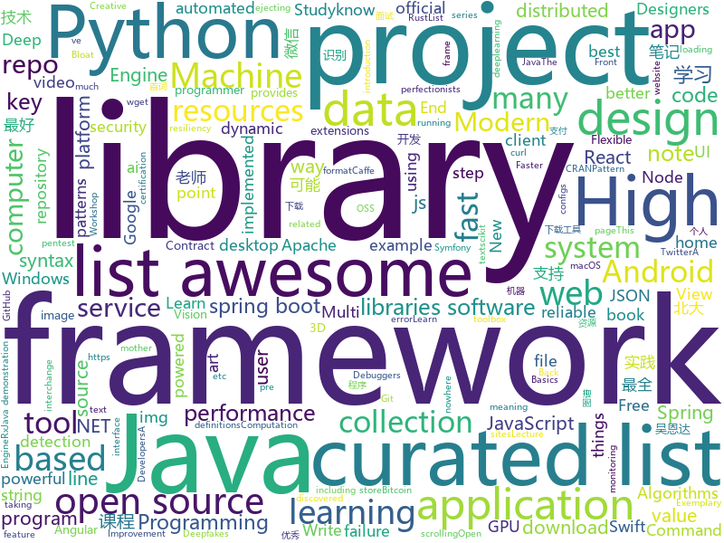

# 2018-04-30
See what the GitHub community is most excited about today.

## python
* [swapy](https://github.com/danieldaeschle/swapy)(**446 stars today**): Easy and modular web development
* [hypertools](https://github.com/ContextLab/hypertools)(**167 stars today**): A Python toolbox for gaining geometric insights into high-dimensional data
* [chinese-poetry](https://github.com/chinese-poetry/chinese-poetry)(**65 stars today**): 最全中华古诗词数据库, 唐宋两朝近一万四千古诗人, 接近5.5万首唐诗加26万宋诗. 两宋时期1564位词人，21050首词。
* [fdb-nbd](https://github.com/dividuum/fdb-nbd)(**63 stars today**): A totally proof-of-concept FoundationDB based network block device backend
* [models](https://github.com/tensorflow/models)(**33 stars today**): Models and examples built with TensorFlow
* [flask](https://github.com/pallets/flask)(**39 stars today**): The Python micro framework for building web applications.
* [awesome-python](https://github.com/vinta/awesome-python)(**35 stars today**): A curated list of awesome Python frameworks, libraries, software and resources
* [c-cpp-notes](https://github.com/BenLangmead/c-cpp-notes)(**35 stars today**): Lecture notes and example code for teaching C & C++
* [sklearn-introduction](https://github.com/YouChouNoBB/sklearn-introduction)(**27 stars today**): 3节课简单入门一下sklearn
* [rebound](https://github.com/shobrook/rebound)(**29 stars today**): Command-line tool that instantly fetches Stack Overflow results when you get a compiler error
* [you-get](https://github.com/soimort/you-get)(**27 stars today**): ⏬Dumb downloader that scrapes the web
* [pandas](https://github.com/pandas-dev/pandas)(**18 stars today**): Flexible and powerful data analysis / manipulation library for Python, providing labeled data structures similar to R data.frame objects, statistical functions, and much more
* [system-design-primer](https://github.com/donnemartin/system-design-primer)(**23 stars today**): Learn how to design large-scale systems. Prep for the system design interview. Includes Anki flashcards.
* [faceswap](https://github.com/deepfakes/faceswap)(**20 stars today**): Non official project based on original /r/Deepfakes thread. Many thanks to him!
* [keras](https://github.com/keras-team/keras)(**19 stars today**): Deep Learning for humans
* [django](https://github.com/django/django)(**19 stars today**): The Web framework for perfectionists with deadlines.
* [awesome-machine-learning](https://github.com/josephmisiti/awesome-machine-learning)(**22 stars today**): A curated list of awesome Machine Learning frameworks, libraries and software.
* [monkey](https://github.com/guardicore/monkey)(**22 stars today**): Infection Monkey - An automated pentest tool
* [youtube-dl](https://github.com/rg3/youtube-dl)(**22 stars today**): Command-line program to download videos from YouTube.com and other video sites
* [public-apis](https://github.com/toddmotto/public-apis)(**22 stars today**): A collective list of public JSON APIs for use in web development.
* [snallygaster](https://github.com/hannob/snallygaster)(**23 stars today**): Tool to scan for secret files on HTTP servers
* [Detectron](https://github.com/facebookresearch/Detectron)(**21 stars today**): FAIR's research platform for object detection research, implementing popular algorithms like Mask R-CNN and RetinaNet.
* [ansible](https://github.com/ansible/ansible)(**19 stars today**): Ansible is a radically simple IT automation platform that makes your applications and systems easier to deploy. Avoid writing scripts or custom code to deploy and update your applications — automate in a language that approaches plain English, using SSH, with no agents to install on remote systems. https://docs.ansible.com/ansible/
* [gluon-cv](https://github.com/dmlc/gluon-cv)(**19 stars today**): Gluon CV Toolkit
* [cpython](https://github.com/python/cpython)(**14 stars today**): The Python programming language

## java
* [proxyee-down](https://github.com/monkeyWie/proxyee-down)(**43 stars today**): http下载工具，基于http代理，支持多连接分块下载
* [okdownload](https://github.com/lingochamp/okdownload)(**45 stars today**): A Reliable, Flexible, Fast and Powerful download engine.
* [halo](https://github.com/ruibaby/halo)(**42 stars today**): Halo可能是最好的Java博客系统😉
* [graal](https://github.com/oracle/graal)(**38 stars today**): GraalVM: Run Programs Faster Anywhere🚀
* [spring-boot](https://github.com/spring-projects/spring-boot)(**22 stars today**): Spring Boot
* [java-design-patterns](https://github.com/iluwatar/java-design-patterns)(**23 stars today**): Design patterns implemented in Java
* [Java](https://github.com/TheAlgorithms/Java)(**18 stars today**): All Algorithms implemented in Java
* [elasticsearch](https://github.com/elastic/elasticsearch)(**16 stars today**): Open Source, Distributed, RESTful Search Engine
* [Hijacker](https://github.com/chrisk44/Hijacker)(**17 stars today**): Aircrack, Airodump, Aireplay, MDK3 and Reaver GUI Application for Android
* [spring-framework](https://github.com/spring-projects/spring-framework)(**10 stars today**): Spring Framework
* [okhttp](https://github.com/square/okhttp)(**14 stars today**): An HTTP+HTTP/2 client for Android and Java applications.
* [tutorials](https://github.com/eugenp/tutorials)(**7 stars today**): The "REST With Spring" Course:
* [incubator-dubbo](https://github.com/apache/incubator-dubbo)(**12 stars today**): Apache Dubbo (incubating) is a high-performance, java based, open source RPC framework.
* [Hystrix](https://github.com/Netflix/Hystrix)(**10 stars today**): Hystrix is a latency and fault tolerance library designed to isolate points of access to remote systems, services and 3rd party libraries, stop cascading failure and enable resilience in complex distributed systems where failure is inevitable.
* [runelite](https://github.com/runelite/runelite)(**5 stars today**): Open source Old School RuneScape client
* [RxJava](https://github.com/ReactiveX/RxJava)(**11 stars today**): RxJava – Reactive Extensions for the JVM – a library for composing asynchronous and event-based programs using observable sequences for the Java VM.
* [glide](https://github.com/bumptech/glide)(**11 stars today**): An image loading and caching library for Android focused on smooth scrolling
* [springboot-learning-example](https://github.com/JeffLi1993/springboot-learning-example)(**10 stars today**): spring boot 实践学习案例，是 spring boot 初学者及核心技术巩固的最佳实践。
* [SmartRefreshLayout](https://github.com/scwang90/SmartRefreshLayout)(**10 stars today**): 🔥下拉刷新、上拉加载、二级刷新、淘宝二楼、RefreshLayout、OverScroll，Android智能下拉刷新框架，支持越界回弹、越界拖动，具有极强的扩展性，集成了几十种炫酷的Header和 Footer。
* [Telegram](https://github.com/DrKLO/Telegram)(**9 stars today**): Telegram for Android source
* [MPAndroidChart](https://github.com/PhilJay/MPAndroidChart)(**10 stars today**): A powerful🚀Android chart view / graph view library, supporting line- bar- pie- radar- bubble- and candlestick charts as well as scaling, dragging and animations.
* [zuul](https://github.com/Netflix/zuul)(**9 stars today**): Zuul is a gateway service that provides dynamic routing, monitoring, resiliency, security, and more.
* [Amadeus](https://github.com/Yink/Amadeus)(**9 stars today**): A side project that aims to replicate the Amadeus App shown in Steins;Gate 0.
* [selenium](https://github.com/SeleniumHQ/selenium)(**7 stars today**): A browser automation framework and ecosystem.
* [disruptor](https://github.com/LMAX-Exchange/disruptor)(**8 stars today**): High Performance Inter-Thread Messaging Library

## unknown
* [architect-awesome](https://github.com/xingshaocheng/architect-awesome)(**542 stars today**): 后端架构师技术图谱
* [the-bread-code](https://github.com/hendricius/the-bread-code)(**332 stars today**): Learn how to master the art of baking the programmer way.
* [swift](https://github.com/tensorflow/swift)(**146 stars today**): Swift for TensorFlow documentation repository.
* [windows10_ntfs_crash_dos](https://github.com/mtivadar/windows10_ntfs_crash_dos)(**110 stars today**): PoC for a NTFS crash that I discovered, in various Windows versions
* [coding-interview-university](https://github.com/jwasham/coding-interview-university)(**104 stars today**): A complete computer science study plan to become a software engineer.
* [project-based-learning](https://github.com/tuvtran/project-based-learning)(**104 stars today**): Curated list of project-based tutorials
* [gitignore](https://github.com/github/gitignore)(**69 stars today**): A collection of useful .gitignore templates
* [SwiftTips](https://github.com/JohnSundell/SwiftTips)(**52 stars today**): A collection of Swift tips & tricks that I've shared on Twitter
* [Interview-Notebook](https://github.com/CyC2018/Interview-Notebook)(**43 stars today**): 📚技术面试需要掌握的基础知识整理，欢迎编辑~
* [You-Dont-Know-JS](https://github.com/getify/You-Dont-Know-JS)(**40 stars today**): A book series on JavaScript. @YDKJS on twitter.
* [awesome](https://github.com/sindresorhus/awesome)(**41 stars today**): 😎Curated list of awesome lists
* [free-programming-books](https://github.com/EbookFoundation/free-programming-books)(**33 stars today**): 📚Freely available programming books
* [awesome-scalability](https://github.com/binhnguyennus/awesome-scalability)(**33 stars today**): High Scalability, High Availability, High Stability, High Performance, and High Intelligence Back-end Designs
* [baidu-netdisk-downloaderx](https://github.com/b3log/baidu-netdisk-downloaderx)(**26 stars today**): ⚡️百度网盘不限速下载器
* [awesome-vue](https://github.com/vuejs/awesome-vue)(**24 stars today**): 🎉A curated list of awesome things related to Vue.js
* [Front-End-Design-Checklist](https://github.com/thedaviddias/Front-End-Design-Checklist)(**23 stars today**): 💎The Design Checklist for Creative Web Designers and Patient Front-End Developers
* [awesome-computer-vision](https://github.com/jbhuang0604/awesome-computer-vision)(**21 stars today**): A curated list of awesome computer vision resources
* [p1xt-guides](https://github.com/P1xt/p1xt-guides)(**20 stars today**): Programming curricula
* [awesome-nodejs](https://github.com/sindresorhus/awesome-nodejs)(**19 stars today**): ⚡️Delightful Node.js packages and resources
* [awesome-flutter](https://github.com/Solido/awesome-flutter)(**18 stars today**): A curated list of awesome Flutter components, frameworks, libraries, and softwares
* [Documentation](https://github.com/EOSIO/Documentation)(**14 stars today**): EOS.IO Documents
* [the-math-of-intelligence](https://github.com/LearnMachineLearning/the-math-of-intelligence)(**15 stars today**): List of resources & possible pathway for the Math of Machine Learning and AI.
* [realworld](https://github.com/gothinkster/realworld)(**14 stars today**): "The mother of all demo apps" — Exemplary fullstack Medium.com clone powered by React, Angular, Node, Django, and many more🏅
* [awesome-react](https://github.com/enaqx/awesome-react)(**14 stars today**): A collection of awesome things regarding React ecosystem.
* [nocode](https://github.com/kelseyhightower/nocode)(**14 stars today**): The best way to write secure and reliable applications. Write nothing; deploy nowhere.

## c++
* [tensorflow](https://github.com/tensorflow/tensorflow)(**96 stars today**): Computation using data flow graphs for scalable machine learning
* [foundationdb](https://github.com/apple/foundationdb)(**67 stars today**): FoundationDB - the open source, distributed, transactional key-value store
* [Open3D](https://github.com/Open-3D/Open3D)(**53 stars today**): Open3D: A Modern Library for 3D Data Processing
* [span-lite](https://github.com/martinmoene/span-lite)(**33 stars today**): span lite - A single-file header-only version of a C++20-like span for C++98, C++11 and later
* [bitcoin](https://github.com/bitcoin/bitcoin)(**23 stars today**): Bitcoin Core integration/staging tree
* [opencv](https://github.com/opencv/opencv)(**18 stars today**): Open Source Computer Vision Library
* [eos](https://github.com/EOSIO/eos)(**23 stars today**): An open source smart contract platform
* [protobuf](https://github.com/google/protobuf)(**21 stars today**): Protocol Buffers - Google's data interchange format
* [electron](https://github.com/electron/electron)(**21 stars today**): Build cross platform desktop apps with JavaScript, HTML, and CSS
* [aseprite](https://github.com/aseprite/aseprite)(**21 stars today**): Animated sprite editor & pixel art tool (Windows, macOS, Linux)
* [pytorch](https://github.com/pytorch/pytorch)(**17 stars today**): Tensors and Dynamic neural networks in Python with strong GPU acceleration
* [leveldb](https://github.com/google/leveldb)(**16 stars today**): LevelDB is a fast key-value storage library written at Google that provides an ordered mapping from string keys to string values.
* [napajs](https://github.com/Microsoft/napajs)(**18 stars today**): Napa.js: a multi-threaded JavaScript runtime
* [al-khaser](https://github.com/LordNoteworthy/al-khaser)(**16 stars today**): Public malware techniques used in the wild: Virtual Machine, Emulation, Debuggers, Sandbox detection.
* [swift](https://github.com/apple/swift)(**14 stars today**): The Swift Programming Language
* [tesseract](https://github.com/tesseract-ocr/tesseract)(**14 stars today**): Tesseract Open Source OCR Engine (main repository)
* [tdesktop](https://github.com/telegramdesktop/tdesktop)(**13 stars today**): Telegram Desktop messaging app
* [godot](https://github.com/godotengine/godot)(**13 stars today**): Godot Engine – Multi-platform 2D and 3D game engine
* [CNTK](https://github.com/Microsoft/CNTK)(**12 stars today**): Microsoft Cognitive Toolkit (CNTK), an open source deep-learning toolkit
* [cmder](https://github.com/cmderdev/cmder)(**13 stars today**): Lovely console emulator package for Windows
* [grpc](https://github.com/grpc/grpc)(**12 stars today**): The C based gRPC (C++, Python, Ruby, Objective-C, PHP, C#)
* [caffe](https://github.com/BVLC/caffe)(**11 stars today**): Caffe: a fast open framework for deep learning.
* [lift](https://github.com/rollbear/lift)(**12 stars today**): constexpr C++17 library for simplifying higher order functions in application code
* [TegraRcmSmash](https://github.com/rajkosto/TegraRcmSmash)(**12 stars today**): A reimplementation of fusee-launcher in C++ for Windows platforms.
* [solidity](https://github.com/ethereum/solidity)(**10 stars today**): Solidity, the Contract-Oriented Programming Language

## html
* [deeplearning_ai_books](https://github.com/fengdu78/deeplearning_ai_books)(**111 stars today**): deeplearning.ai（吴恩达老师的深度学习课程笔记及资源）
* [Coursera-ML-AndrewNg-Notes](https://github.com/fengdu78/Coursera-ML-AndrewNg-Notes)(**87 stars today**): 吴恩达老师的机器学习课程个人笔记
* [Xin-Yue](https://github.com/sikaozhe1997/Xin-Yue)(**92 stars today**): 岳昕：致北大师生与北大外国语学院的一封公开信
* [awesome-quantum-machine-learning](https://github.com/krishnakumarsekar/awesome-quantum-machine-learning)(**42 stars today**): Here you can get all the Quantum Machine learning Basics, Algorithms ,Study Materials ,Projects and the descriptions of the projects around the web
* [img-2](https://github.com/RevillWeb/img-2)(**23 stars today**): Replace  elements with  to automatically pre-cache images and improve page performance.
* [AdminLTE](https://github.com/almasaeed2010/AdminLTE)(**11 stars today**): AdminLTE - Free Premium Admin control Panel Theme Based On Bootstrap 3.x
* [awesome-mac](https://github.com/jaywcjlove/awesome-mac)(**12 stars today**):  This repo is a collection of awesome Mac applications and tools for developers and designers.
* [generator-jhipster](https://github.com/jhipster/generator-jhipster)(**10 stars today**): Open Source application generator for creating Spring Boot + Angular/React projects in seconds!
* [zju-icicles](https://github.com/QSCTech/zju-icicles)(**8 stars today**): 浙江大学课程攻略共享计划
* [Hacking-Tools-Repository](https://github.com/Gexos/Hacking-Tools-Repository)(**7 stars today**): A list of security/hacking tools that have been collected from the internet. Suggestions are welcomed.
* [Spoon-Knife](https://github.com/octocat/Spoon-Knife)(****): This repo is for demonstration purposes only.
* [portainer](https://github.com/portainer/portainer)(**8 stars today**): Simple management UI for Docker
* [cs231n.github.io](https://github.com/cs231n/cs231n.github.io)(**6 stars today**): Public facing notes page
* [fastText](https://github.com/facebookresearch/fastText)(**7 stars today**): Library for fast text representation and classification.
* [core](https://github.com/stackblitz/core)(**7 stars today**): Online IDE powered by VS Code⚡️
* [EIPs](https://github.com/ethereum/EIPs)(**7 stars today**): The Ethereum Improvement Proposal repository
* [gson](https://github.com/google/gson)(**5 stars today**): A Java serialization/deserialization library to convert Java Objects into JSON and back
* [intro.js](https://github.com/usablica/intro.js)(**7 stars today**): A better way for new feature introduction and step-by-step users guide for your website and project.
* [symfony-certification-preparation-list](https://github.com/ThomasBerends/symfony-certification-preparation-list)(**6 stars today**): List of topic-specific resources to help you prepare for Symfony certification
* [jsr](https://github.com/mercyblitz/jsr)(**6 stars today**): Java Specification Requests
* [zenbot](https://github.com/DeviaVir/zenbot)(**5 stars today**): Zenbot is a command-line cryptocurrency trading bot using Node.js and MongoDB.
* [react-app-rewired](https://github.com/timarney/react-app-rewired)(**6 stars today**): Override create-react-app webpack configs without ejecting
* [coreui-free-bootstrap-admin-template](https://github.com/coreui/coreui-free-bootstrap-admin-template)(**5 stars today**): CoreUI is free bootstrap admin template
* [electron-api-demos](https://github.com/electron/electron-api-demos)(**5 stars today**): Explore the Electron APIs
* [ecma262](https://github.com/tc39/ecma262)(**5 stars today**): Status, process, and documents for ECMA262

## WordCloud

