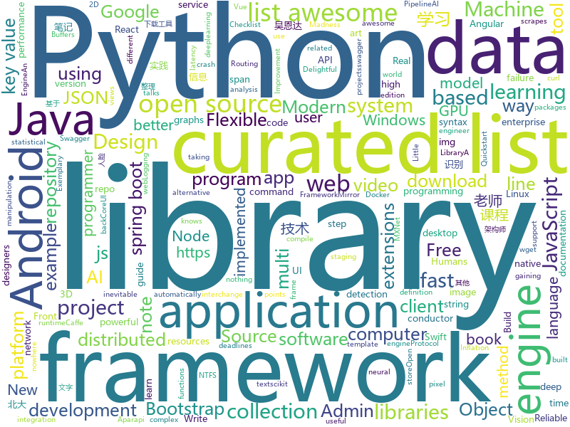

# 2018-05-01
See what the GitHub community is most excited about today.

## python
* [monkey](https://github.com/guardicore/monkey)(**300 stars today**): Infection Monkey - An automated pentest tool
* [hypertools](https://github.com/ContextLab/hypertools)(**87 stars today**): A Python toolbox for gaining geometric insights into high-dimensional data
* [models](https://github.com/tensorflow/models)(**48 stars today**): Models and examples built with TensorFlow
* [awesome-python](https://github.com/vinta/awesome-python)(**59 stars today**): A curated list of awesome Python frameworks, libraries, software and resources
* [pipenv](https://github.com/pypa/pipenv)(**53 stars today**): Python Development Workflow for Humans.
* [youtube-dl](https://github.com/rg3/youtube-dl)(**51 stars today**): Command-line program to download videos from YouTube.com and other video sites
* [public-apis](https://github.com/toddmotto/public-apis)(**48 stars today**): A collective list of public JSON APIs for use in web development.
* [faceai](https://github.com/vipstone/faceai)(**45 stars today**): 一款优秀的人脸检测、人脸识别、视频识别、文字识别等智能AI项目。
* [swapy](https://github.com/danieldaeschle/swapy)(**45 stars today**): Easy and modular web development
* [c-cpp-notes](https://github.com/BenLangmead/c-cpp-notes)(**43 stars today**): Lecture notes and example code for teaching C & C++
* [flask](https://github.com/pallets/flask)(**37 stars today**): The Python micro framework for building web applications.
* [keras](https://github.com/keras-team/keras)(**36 stars today**): Deep Learning for humans
* [QANet-pytorch](https://github.com/hengruo/QANet-pytorch)(**40 stars today**): 
* [django](https://github.com/django/django)(**28 stars today**): The Web framework for perfectionists with deadlines.
* [snips-nlu](https://github.com/snipsco/snips-nlu)(**32 stars today**): Snips Python library to extract meaning from text
* [scikit-learn](https://github.com/scikit-learn/scikit-learn)(**29 stars today**): scikit-learn: machine learning in Python
* [system-design-primer](https://github.com/donnemartin/system-design-primer)(**29 stars today**): Learn how to design large-scale systems. Prep for the system design interview. Includes Anki flashcards.
* [awesome-machine-learning](https://github.com/josephmisiti/awesome-machine-learning)(**29 stars today**): A curated list of awesome Machine Learning frameworks, libraries and software.
* [pandas](https://github.com/pandas-dev/pandas)(**23 stars today**): Flexible and powerful data analysis / manipulation library for Python, providing labeled data structures similar to R data.frame objects, statistical functions, and much more
* [httpie](https://github.com/jakubroztocil/httpie)(**26 stars today**): Modern command line HTTP client – user-friendly curl alternative with intuitive UI, JSON support, syntax highlighting, wget-like downloads, extensions, etc. https://httpie.org
* [you-get](https://github.com/soimort/you-get)(**25 stars today**): ⏬Dumb downloader that scrapes the web
* [mxboard](https://github.com/awslabs/mxboard)(**24 stars today**): Logging MXNet data for visualization in TensorBoard.
* [opensnitch](https://github.com/evilsocket/opensnitch)(**24 stars today**): OpenSnitch is a GNU/Linux port of the Little Snitch application firewall.
* [OSVOS-PyTorch](https://github.com/kmaninis/OSVOS-PyTorch)(**24 stars today**): PyTorch implementation of One-Shot Video Object Segmentation (OSVOS)
* [requests](https://github.com/requests/requests)(****): Python HTTP Requests for Humans™✨🍰✨

## java
* [proxyee-down](https://github.com/monkeyWie/proxyee-down)(**42 stars today**): http下载工具，基于http代理，支持多连接分块下载
* [graal](https://github.com/oracle/graal)(**45 stars today**): GraalVM: Run Programs Faster Anywhere🚀
* [java-design-patterns](https://github.com/iluwatar/java-design-patterns)(**37 stars today**): Design patterns implemented in Java
* [spring-boot](https://github.com/spring-projects/spring-boot)(**29 stars today**): Spring Boot
* [halo](https://github.com/ruibaby/halo)(**25 stars today**): Halo可能是最好的Java博客系统😉
* [RxJava](https://github.com/ReactiveX/RxJava)(**24 stars today**): RxJava – Reactive Extensions for the JVM – a library for composing asynchronous and event-based programs using observable sequences for the Java VM.
* [tutorials](https://github.com/eugenp/tutorials)(**13 stars today**): The "REST With Spring" Course:
* [aparapi](https://github.com/Syncleus/aparapi)(**25 stars today**): The New Aparapi: a framework for executing native Java code on the GPU.
* [elasticsearch](https://github.com/elastic/elasticsearch)(**23 stars today**): Open Source, Distributed, RESTful Search Engine
* [okhttp](https://github.com/square/okhttp)(**22 stars today**): An HTTP+HTTP/2 client for Android and Java applications.
* [Java](https://github.com/TheAlgorithms/Java)(**21 stars today**): All Algorithms implemented in Java
* [okdownload](https://github.com/lingochamp/okdownload)(**23 stars today**): A Reliable, Flexible, Fast and Powerful download engine.
* [glide](https://github.com/bumptech/glide)(**22 stars today**): An image loading and caching library for Android focused on smooth scrolling
* [ViewPump](https://github.com/InflationX/ViewPump)(**23 stars today**): View Inflation you can intercept.
* [NXLoader](https://github.com/DavidBuchanan314/NXLoader)(**17 stars today**): My first Android app: Launch Fusée Gelée payloads from stock Android (CVE-2018-6242)
* [CallerInfo](https://github.com/xdtianyu/CallerInfo)(**16 stars today**): 来电信息 - 一个获取号码归属地和其他信息（诈骗、骚扰等）的开源 Android 应用
* [springboot-learning-example](https://github.com/JeffLi1993/springboot-learning-example)(**15 stars today**): spring boot 实践学习案例，是 spring boot 初学者及核心技术巩固的最佳实践。
* [error-prone](https://github.com/google/error-prone)(**15 stars today**): Catch common Java mistakes as compile-time errors
* [kayenta](https://github.com/spinnaker/kayenta)(**15 stars today**): Automated Canary Service
* [spring-framework](https://github.com/spring-projects/spring-framework)(**10 stars today**): Spring Framework
* [hadoop](https://github.com/apache/hadoop)(**10 stars today**): Mirror of Apache Hadoop
* [Hystrix](https://github.com/Netflix/Hystrix)(**13 stars today**): Hystrix is a latency and fault tolerance library designed to isolate points of access to remote systems, services and 3rd party libraries, stop cascading failure and enable resilience in complex distributed systems where failure is inevitable.
* [conductor](https://github.com/Netflix/conductor)(**13 stars today**): Conductor is a microservices orchestration engine - https://netflix.github.io/conductor/
* [runelite](https://github.com/runelite/runelite)(**8 stars today**): Open source Old School RuneScape client
* [butterknife](https://github.com/JakeWharton/butterknife)(**12 stars today**): Bind Android views and callbacks to fields and methods.

## unknown
* [architect-awesome](https://github.com/xingshaocheng/architect-awesome)(**380 stars today**): 后端架构师技术图谱
* [the-bread-code](https://github.com/hendricius/the-bread-code)(**278 stars today**): Learn how to master the art of baking the programmer way.
* [project-based-learning](https://github.com/tuvtran/project-based-learning)(**188 stars today**): Curated list of project-based tutorials
* [swift](https://github.com/tensorflow/swift)(**135 stars today**): Swift for TensorFlow documentation repository.
* [gitignore](https://github.com/github/gitignore)(**113 stars today**): A collection of useful .gitignore templates
* [coding-interview-university](https://github.com/jwasham/coding-interview-university)(**120 stars today**): A complete computer science study plan to become a software engineer.
* [SwiftTips](https://github.com/JohnSundell/SwiftTips)(**125 stars today**): A collection of Swift tips & tricks that I've shared on Twitter
* [windows10_ntfs_crash_dos](https://github.com/mtivadar/windows10_ntfs_crash_dos)(**70 stars today**): PoC for a NTFS crash that I discovered, in various Windows versions
* [awesome](https://github.com/sindresorhus/awesome)(**65 stars today**): 😎Curated list of awesome lists
* [You-Dont-Know-JS](https://github.com/getify/You-Dont-Know-JS)(**47 stars today**): A book series on JavaScript. @YDKJS on twitter.
* [free-programming-books](https://github.com/EbookFoundation/free-programming-books)(**43 stars today**): 📚Freely available programming books
* [Interview-Notebook](https://github.com/CyC2018/Interview-Notebook)(**37 stars today**): 📚技术面试需要掌握的基础知识整理，欢迎编辑~
* [ReLaXed-examples](https://github.com/RelaxedJS/ReLaXed-examples)(**38 stars today**): Example projects for ReLaXed, the PDF edition framework: letter, slide, poster, report, and more.
* [awesome-vue](https://github.com/vuejs/awesome-vue)(**36 stars today**): 🎉A curated list of awesome things related to Vue.js
* [frontend-case-studies](https://github.com/andrew--r/frontend-case-studies)(**34 stars today**): 💼A curated list of technical talks and articles about real-world enterprise frontend development
* [Front-End-Design-Checklist](https://github.com/thedaviddias/Front-End-Design-Checklist)(**30 stars today**): 💎The Design Checklist for Creative Web Designers and Patient Front-End Developers
* [awesome-computer-vision](https://github.com/jbhuang0604/awesome-computer-vision)(**28 stars today**): A curated list of awesome computer vision resources
* [awesome-nodejs](https://github.com/sindresorhus/awesome-nodejs)(**27 stars today**): ⚡️Delightful Node.js packages and resources
* [proposal-pattern-matching](https://github.com/tc39/proposal-pattern-matching)(**27 stars today**): Pattern matching syntax for ECMAScript
* [nocode](https://github.com/kelseyhightower/nocode)(**26 stars today**): The best way to write secure and reliable applications. Write nothing; deploy nowhere.
* [junior-recruit-scheduler](https://github.com/jojoldu/junior-recruit-scheduler)(**22 stars today**): 주니어 개발자 채용 정보
* [awesome-flutter](https://github.com/Solido/awesome-flutter)(**21 stars today**): A curated list of awesome Flutter components, frameworks, libraries, and softwares
* [sysmon-modular](https://github.com/olafhartong/sysmon-modular)(**21 stars today**): A repository of sysmon configuration modules
* [realworld](https://github.com/gothinkster/realworld)(**21 stars today**): "The mother of all demo apps" — Exemplary fullstack Medium.com clone powered by React, Angular, Node, Django, and many more🏅
* [titus](https://github.com/Netflix/titus)(**21 stars today**): 

## c++
* [tensorflow](https://github.com/tensorflow/tensorflow)(**92 stars today**): Computation using data flow graphs for scalable machine learning
* [foundationdb](https://github.com/apple/foundationdb)(**54 stars today**): FoundationDB - the open source, distributed, transactional key-value store
* [opencv](https://github.com/opencv/opencv)(**34 stars today**): Open Source Computer Vision Library
* [vnote](https://github.com/tamlok/vnote)(**43 stars today**): A Vim-inspired note-taking application that knows programmers and Markdown better.
* [electron](https://github.com/electron/electron)(**39 stars today**): Build cross platform desktop apps with JavaScript, HTML, and CSS
* [valhalla](https://github.com/valhalla/valhalla)(**36 stars today**): Open Source Routing Engine for OpenStreetMap
* [bitcoin](https://github.com/bitcoin/bitcoin)(**31 stars today**): Bitcoin Core integration/staging tree
* [eos](https://github.com/EOSIO/eos)(**31 stars today**): An open source smart contract platform
* [aseprite](https://github.com/aseprite/aseprite)(**29 stars today**): Animated sprite editor & pixel art tool (Windows, macOS, Linux)
* [swift](https://github.com/apple/swift)(**26 stars today**): The Swift Programming Language
* [pytorch](https://github.com/pytorch/pytorch)(**23 stars today**): Tensors and Dynamic neural networks in Python with strong GPU acceleration
* [Open3D](https://github.com/Open-3D/Open3D)(**22 stars today**): Open3D: A Modern Library for 3D Data Processing
* [godot](https://github.com/godotengine/godot)(**20 stars today**): Godot Engine – Multi-platform 2D and 3D game engine
* [protobuf](https://github.com/google/protobuf)(**20 stars today**): Protocol Buffers - Google's data interchange format
* [napajs](https://github.com/Microsoft/napajs)(**20 stars today**): Napa.js: a multi-threaded JavaScript runtime
* [caffe](https://github.com/BVLC/caffe)(**15 stars today**): Caffe: a fast open framework for deep learning.
* [tesseract](https://github.com/tesseract-ocr/tesseract)(**16 stars today**): Tesseract Open Source OCR Engine (main repository)
* [span-lite](https://github.com/martinmoene/span-lite)(**14 stars today**): span lite - A single-file header-only version of a C++20-like span for C++98, C++11 and later
* [al-khaser](https://github.com/LordNoteworthy/al-khaser)(**13 stars today**): Public malware techniques used in the wild: Virtual Machine, Emulation, Debuggers, Sandbox detection.
* [leveldb](https://github.com/google/leveldb)(**12 stars today**): LevelDB is a fast key-value storage library written at Google that provides an ordered mapping from string keys to string values.
* [grpc](https://github.com/grpc/grpc)(**12 stars today**): The C based gRPC (C++, Python, Ruby, Objective-C, PHP, C#)
* [arangodb](https://github.com/arangodb/arangodb)(**12 stars today**): 🥑ArangoDB is a native multi-model database with flexible data models for documents, graphs, and key-values. Build high performance applications using a convenient SQL-like query language or JavaScript extensions.
* [envoy](https://github.com/envoyproxy/envoy)(**11 stars today**): C++ front/service proxy
* [tdesktop](https://github.com/telegramdesktop/tdesktop)(**11 stars today**): Telegram Desktop messaging app
* [json](https://github.com/nlohmann/json)(**11 stars today**): JSON for Modern C++

## html
* [Xin-Yue](https://github.com/sikaozhe1997/Xin-Yue)(**233 stars today**): 岳昕：致北大师生与北大外国语学院的一封公开信
* [deeplearning_ai_books](https://github.com/fengdu78/deeplearning_ai_books)(**71 stars today**): deeplearning.ai（吴恩达老师的深度学习课程笔记及资源）
* [Coursera-ML-AndrewNg-Notes](https://github.com/fengdu78/Coursera-ML-AndrewNg-Notes)(**57 stars today**): 吴恩达老师的机器学习课程个人笔记
* [picojs](https://github.com/tehnokv/picojs)(**51 stars today**): A face detection library in 200 lines of JavaScript
* [img-2](https://github.com/RevillWeb/img-2)(**26 stars today**): Replace  elements with  to automatically pre-cache images and improve page performance.
* [nanoscope](https://github.com/uber/nanoscope)(**26 stars today**): An extremely accurate Android method tracing tool.
* [AdminLTE](https://github.com/almasaeed2010/AdminLTE)(**21 stars today**): AdminLTE - Free Premium Admin control Panel Theme Based On Bootstrap 3.x
* [NMapNetworkInventoryContainer](https://github.com/jgamblin/NMapNetworkInventoryContainer)(**24 stars today**): A Docker Container To Continually Scan Your Network And Display Findings Cleanly.
* [fastText](https://github.com/facebookresearch/fastText)(**16 stars today**): Library for fast text representation and classification.
* [Spoon-Knife](https://github.com/octocat/Spoon-Knife)(****): This repo is for demonstration purposes only.
* [gentelella](https://github.com/puikinsh/gentelella)(**11 stars today**): Free Bootstrap 3 Admin Template
* [cs231n.github.io](https://github.com/cs231n/cs231n.github.io)(**10 stars today**): Public facing notes page
* [portainer](https://github.com/portainer/portainer)(**10 stars today**): Simple management UI for Docker
* [crowds](https://github.com/ncase/crowds)(**10 stars today**): The Wisdom and/or Madness of the Crowds
* [generator-jhipster](https://github.com/jhipster/generator-jhipster)(**9 stars today**): Open Source application generator for creating Spring Boot + Angular/React projects in seconds!
* [EIPs](https://github.com/ethereum/EIPs)(**8 stars today**): The Ethereum Improvement Proposal repository
* [styleguide](https://github.com/google/styleguide)(**7 stars today**): Style guides for Google-originated open-source projects
* [swagger-codegen](https://github.com/swagger-api/swagger-codegen)(**6 stars today**): swagger-codegen contains a template-driven engine to generate documentation, API clients and server stubs in different languages by parsing your OpenAPI / Swagger definition.
* [awesome-mac](https://github.com/jaywcjlove/awesome-mac)(**8 stars today**):  This repo is a collection of awesome Mac applications and tools for developers and designers.
* [gson](https://github.com/google/gson)(**7 stars today**): A Java serialization/deserialization library to convert Java Objects into JSON and back
* [coreui-free-bootstrap-admin-template](https://github.com/coreui/coreui-free-bootstrap-admin-template)(**6 stars today**): CoreUI is free bootstrap admin template
* [quickstart-js](https://github.com/firebase/quickstart-js)(**7 stars today**): Firebase Quickstart Samples for Web
* [intro.js](https://github.com/usablica/intro.js)(**5 stars today**): A better way for new feature introduction and step-by-step users guide for your website and project.
* [awesome-modern-cpp](https://github.com/rigtorp/awesome-modern-cpp)(**6 stars today**): A collection of resources on modern C++
* [pipeline](https://github.com/PipelineAI/pipeline)(**5 stars today**): PipelineAI: Real-Time Enterprise AI Platform

## WordCloud

