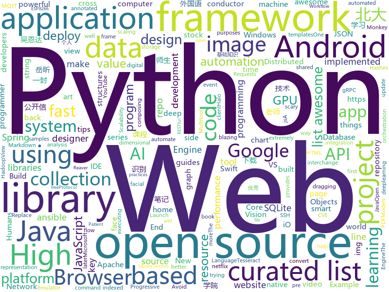

# 2018-05-02
See what the GitHub community is most excited about today.

## python
* [WinPwnage](https://github.com/rootm0s/WinPwnage)(**336 stars today**): 💻Elevate, UAC bypass, persistence, privilege escalation, dll hijack techniques
* [monkey](https://github.com/guardicore/monkey)(**226 stars today**): Infection Monkey - An automated pentest tool
* [Bad-Pdf](https://github.com/deepzec/Bad-Pdf)(**89 stars today**): Steal NTLM Hashes with Bad-PDF
* [models](https://github.com/tensorflow/models)(**41 stars today**): Models and examples built with TensorFlow
* [PRNet](https://github.com/YadiraF/PRNet)(**58 stars today**): The source code of 'Joint 3D Face Reconstruction and Dense Alignment with Position Map Regression Network'.
* [awesome-python](https://github.com/vinta/awesome-python)(**54 stars today**): A curated list of awesome Python frameworks, libraries, software and resources
* [youtube-dl](https://github.com/rg3/youtube-dl)(**55 stars today**): Command-line program to download videos from YouTube.com and other video sites
* [keras](https://github.com/keras-team/keras)(**30 stars today**): Deep Learning for humans
* [flask](https://github.com/pallets/flask)(**37 stars today**): The Python micro framework for building web applications.
* [public-apis](https://github.com/toddmotto/public-apis)(**34 stars today**): A collective list of public JSON APIs for use in web development.
* [faceai](https://github.com/vipstone/faceai)(**34 stars today**): 一款优秀的人脸检测、人脸识别、视频识别、文字识别等智能AI项目。
* [scikit-learn](https://github.com/scikit-learn/scikit-learn)(**25 stars today**): scikit-learn: machine learning in Python
* [pipenv](https://github.com/pypa/pipenv)(**29 stars today**): Python Development Workflow for Humans.
* [django](https://github.com/django/django)(**24 stars today**): The Web framework for perfectionists with deadlines.
* [apistar](https://github.com/encode/apistar)(**29 stars today**): A smart Web API framework, for Python 3.🌟
* [ansible](https://github.com/ansible/ansible)(**19 stars today**): Ansible is a radically simple IT automation platform that makes your applications and systems easier to deploy. Avoid writing scripts or custom code to deploy and update your applications — automate in a language that approaches plain English, using SSH, with no agents to install on remote systems. https://docs.ansible.com/ansible/
* [hypertools](https://github.com/ContextLab/hypertools)(**27 stars today**): A Python toolbox for gaining geometric insights into high-dimensional data
* [pandas](https://github.com/pandas-dev/pandas)(**18 stars today**): Flexible and powerful data analysis / manipulation library for Python, providing labeled data structures similar to R data.frame objects, statistical functions, and much more
* [face_recognition](https://github.com/ageitgey/face_recognition)(**23 stars today**): The world's simplest facial recognition api for Python and the command line
* [system-design-primer](https://github.com/donnemartin/system-design-primer)(**24 stars today**): Learn how to design large-scale systems. Prep for the system design interview. Includes Anki flashcards.
* [ntlmv1-multi](https://github.com/evilmog/ntlmv1-multi)(**22 stars today**): NTLMv1 Multitool
* [you-get](https://github.com/soimort/you-get)(**23 stars today**): ⏬Dumb downloader that scrapes the web
* [home-assistant](https://github.com/home-assistant/home-assistant)(**20 stars today**): 🏡Open-source home automation platform running on Python 3
* [requests](https://github.com/requests/requests)(**22 stars today**): Python HTTP Requests for Humans™✨🍰✨
* [cpython](https://github.com/python/cpython)(**15 stars today**): The Python programming language

## java
* [graal](https://github.com/oracle/graal)(**48 stars today**): GraalVM: Run Programs Faster Anywhere🚀
* [java-design-patterns](https://github.com/iluwatar/java-design-patterns)(**40 stars today**): Design patterns implemented in Java
* [spring-boot](https://github.com/spring-projects/spring-boot)(**29 stars today**): Spring Boot
* [proxyee-down](https://github.com/monkeyWie/proxyee-down)(**33 stars today**): http下载工具，基于http代理，支持多连接分块下载
* [tutorials](https://github.com/eugenp/tutorials)(**16 stars today**): The "REST With Spring" Course:
* [elasticsearch](https://github.com/elastic/elasticsearch)(**21 stars today**): Open Source, Distributed, RESTful Search Engine
* [aparapi](https://github.com/Syncleus/aparapi)(**24 stars today**): The New Aparapi: a framework for executing native Java code on the GPU.
* [hadoop](https://github.com/apache/hadoop)(**22 stars today**): Mirror of Apache Hadoop
* [ViewPump](https://github.com/InflationX/ViewPump)(**24 stars today**): View Inflation you can intercept.
* [NXLoader](https://github.com/DavidBuchanan314/NXLoader)(**22 stars today**): My first Android app: Launch Fusée Gelée payloads from stock Android (CVE-2018-6242)
* [RxJava](https://github.com/ReactiveX/RxJava)(**19 stars today**): RxJava – Reactive Extensions for the JVM – a library for composing asynchronous and event-based programs using observable sequences for the Java VM.
* [Java](https://github.com/TheAlgorithms/Java)(**15 stars today**): All Algorithms implemented in Java
* [Amadeus](https://github.com/Yink/Amadeus)(**18 stars today**): A side project that aims to replicate the Amadeus App shown in Steins;Gate 0.
* [guava](https://github.com/google/guava)(**16 stars today**): Google core libraries for Java
* [runelite](https://github.com/runelite/runelite)(**10 stars today**): Open source Old School RuneScape client
* [halo](https://github.com/ruibaby/halo)(**16 stars today**): Halo可能是最好的Java博客系统😉
* [Hijacker](https://github.com/chrisk44/Hijacker)(**16 stars today**): Aircrack, Airodump, Aireplay, MDK3 and Reaver GUI Application for Android
* [MPAndroidChart](https://github.com/PhilJay/MPAndroidChart)(**16 stars today**): A powerful🚀Android chart view / graph view library, supporting line- bar- pie- radar- bubble- and candlestick charts as well as scaling, dragging and animations.
* [incubator-dubbo](https://github.com/apache/incubator-dubbo)(**14 stars today**): Apache Dubbo (incubating) is a high-performance, java based, open source RPC framework.
* [spring-framework](https://github.com/spring-projects/spring-framework)(**11 stars today**): Spring Framework
* [glide](https://github.com/bumptech/glide)(**15 stars today**): An image loading and caching library for Android focused on smooth scrolling
* [okhttp](https://github.com/square/okhttp)(**12 stars today**): An HTTP+HTTP/2 client for Android and Java applications.
* [Signal-Android](https://github.com/signalapp/Signal-Android)(**12 stars today**): A private messenger for Android.
* [selenium](https://github.com/SeleniumHQ/selenium)(**9 stars today**): A browser automation framework and ecosystem.
* [conductor](https://github.com/Netflix/conductor)(**11 stars today**): Conductor is a microservices orchestration engine - https://netflix.github.io/conductor/

## unknown
* [architect-awesome](https://github.com/xingshaocheng/architect-awesome)(**679 stars today**): 后端架构师技术图谱
* [css-protips](https://github.com/AllThingsSmitty/css-protips)(**293 stars today**): A collection of tips to help take your CSS skills pro
* [the-bread-code](https://github.com/hendricius/the-bread-code)(**271 stars today**): Learn how to master the art of baking the programmer way.
* [awesome-scalability](https://github.com/binhnguyennus/awesome-scalability)(**143 stars today**): High Scalability, High Availability, High Stability, High Performance, and High Intelligence Back-end Designs
* [subliminal](https://github.com/gaearon/subliminal)(**147 stars today**): An opinionated minimalistic VS Code theme for JavaScript
* [project-based-learning](https://github.com/tuvtran/project-based-learning)(**108 stars today**): Curated list of project-based tutorials
* [gitignore](https://github.com/github/gitignore)(**86 stars today**): A collection of useful .gitignore templates
* [HTMLX](https://github.com/Rich-Harris/HTMLX)(**89 stars today**): One Template to rule them all
* [swift](https://github.com/tensorflow/swift)(**82 stars today**): Swift for TensorFlow documentation repository.
* [awesome](https://github.com/sindresorhus/awesome)(**74 stars today**): 😎Curated list of awesome lists
* [Interview-Notebook](https://github.com/CyC2018/Interview-Notebook)(**52 stars today**): 📚技术面试需要掌握的基础知识整理，欢迎编辑~
* [You-Dont-Know-JS](https://github.com/getify/You-Dont-Know-JS)(**53 stars today**): A book series on JavaScript. @YDKJS on twitter.
* [ReLaXed-examples](https://github.com/RelaxedJS/ReLaXed-examples)(**54 stars today**): Example projects for ReLaXed, the PDF edition framework: letter, slide, poster, report, and more.
* [free-programming-books](https://github.com/EbookFoundation/free-programming-books)(**44 stars today**): 📚Freely available programming books
* [awesome-operators](https://github.com/operator-framework/awesome-operators)(**36 stars today**): A resource tracking a number of Operators out in the wild.
* [windows10_ntfs_crash_dos](https://github.com/mtivadar/windows10_ntfs_crash_dos)(**34 stars today**): PoC for a NTFS crash that I discovered, in various Windows versions
* [awful-ai](https://github.com/daviddao/awful-ai)(**32 stars today**): Awful AI is a curated list to track current scary usages of AI - hoping to raise awareness
* [awesome-vue](https://github.com/vuejs/awesome-vue)(**29 stars today**): 🎉A curated list of awesome things related to Vue.js
* [SwiftTips](https://github.com/JohnSundell/SwiftTips)(**29 stars today**): A collection of Swift tips & tricks that I've shared on Twitter
* [open-images-dataset](https://github.com/cvdfoundation/open-images-dataset)(**27 stars today**): Open Images is a dataset of ~9 million images that have been annotated with image-level labels and bounding boxes spanning thousands of classes.
* [Front-End-Design-Checklist](https://github.com/thedaviddias/Front-End-Design-Checklist)(**23 stars today**): 💎The Design Checklist for Creative Web Designers and Patient Front-End Developers
* [frontend-case-studies](https://github.com/andrew--r/frontend-case-studies)(**21 stars today**): 💼A curated list of technical talks and articles about real-world enterprise frontend development
* [awesome-javascript](https://github.com/sorrycc/awesome-javascript)(**20 stars today**): 🐢A collection of awesome browser-side JavaScript libraries, resources and shiny things.
* [awesome-computer-vision](https://github.com/jbhuang0604/awesome-computer-vision)(**21 stars today**): A curated list of awesome computer vision resources
* [baidu-netdisk-downloaderx](https://github.com/b3log/baidu-netdisk-downloaderx)(**21 stars today**): ⚡️百度网盘不限速下载器

## c++
* [tensorflow](https://github.com/tensorflow/tensorflow)(**64 stars today**): Computation using data flow graphs for scalable machine learning
* [vnote](https://github.com/tamlok/vnote)(**69 stars today**): A Vim-inspired note-taking application that knows programmers and Markdown better.
* [opencv](https://github.com/opencv/opencv)(**35 stars today**): Open Source Computer Vision Library
* [pytorch](https://github.com/pytorch/pytorch)(**32 stars today**): Tensors and Dynamic neural networks in Python with strong GPU acceleration
* [Rea](https://github.com/im95able/Rea)(**39 stars today**): Lightweight library of data structures implemented in C++11, designed for constant time insertion, erasure, lookup, and fastest possible iteration.
* [foundationdb](https://github.com/apple/foundationdb)(**36 stars today**): FoundationDB - the open source, distributed, transactional key-value store
* [electron](https://github.com/electron/electron)(**32 stars today**): Build cross platform desktop apps with JavaScript, HTML, and CSS
* [valhalla](https://github.com/valhalla/valhalla)(**35 stars today**): Open Source Routing Engine for OpenStreetMap
* [Open3D](https://github.com/Open-3D/Open3D)(**34 stars today**): Open3D: The Community version
* [bitcoin](https://github.com/bitcoin/bitcoin)(**26 stars today**): Bitcoin Core integration/staging tree
* [protobuf](https://github.com/google/protobuf)(**25 stars today**): Protocol Buffers - Google's data interchange format
* [meshoptimizer](https://github.com/zeux/meshoptimizer)(**26 stars today**): Mesh optimization library that makes indexed meshes more GPU-friendly
* [aseprite](https://github.com/aseprite/aseprite)(**25 stars today**): Animated sprite editor & pixel art tool (Windows, macOS, Linux)
* [eos](https://github.com/EOSIO/eos)(**21 stars today**): An open source smart contract platform
* [swift](https://github.com/apple/swift)(**18 stars today**): The Swift Programming Language
* [tesseract](https://github.com/tesseract-ocr/tesseract)(**19 stars today**): Tesseract Open Source OCR Engine (main repository)
* [dxup](https://github.com/Joshua-Ashton/dxup)(**18 stars today**): D3D10 -> D3D11 layer
* [grpc](https://github.com/grpc/grpc)(**15 stars today**): The C based gRPC (C++, Python, Ruby, Objective-C, PHP, C#)
* [caffe](https://github.com/BVLC/caffe)(**13 stars today**): Caffe: a fast open framework for deep learning.
* [cmder](https://github.com/cmderdev/cmder)(**15 stars today**): Lovely console emulator package for Windows
* [span-lite](https://github.com/martinmoene/span-lite)(**15 stars today**): span lite - A single-file header-only version of a C++20-like span for C++98, C++11 and later
* [CNTK](https://github.com/Microsoft/CNTK)(**13 stars today**): Microsoft Cognitive Toolkit (CNTK), an open source deep-learning toolkit
* [Sonoff-Tasmota](https://github.com/arendst/Sonoff-Tasmota)(**12 stars today**): Provide ESP8266 based itead Sonoff with Web, MQTT and OTA firmware using Arduino IDE or PlatformIO
* [leveldb](https://github.com/google/leveldb)(**13 stars today**): LevelDB is a fast key-value storage library written at Google that provides an ordered mapping from string keys to string values.
* [sqlitebrowser](https://github.com/sqlitebrowser/sqlitebrowser)(**12 stars today**): Official home of the DB Browser for SQLite (DB4S) project. Previously known as "SQLite Database Browser" and "Database Browser for SQLite". Website at:

## html
* [stocks](https://github.com/toddwschneider/stocks)(**192 stars today**): A free, lightweight, blazing-fast static page to get stock quotes using the IEX API
* [Xin-Yue](https://github.com/sikaozhe1997/Xin-Yue)(**137 stars today**): 岳昕：致北大师生与北大外国语学院的一封公开信
* [nanoscope](https://github.com/uber/nanoscope)(**62 stars today**): An extremely accurate Android method tracing tool.
* [Coursera-ML-AndrewNg-Notes](https://github.com/fengdu78/Coursera-ML-AndrewNg-Notes)(**48 stars today**): 吴恩达老师的机器学习课程个人笔记
* [Xin-Yue](https://github.com/DeboutSQ/Xin-Yue)(**42 stars today**): 岳昕：致北大师生与北大外国语学院的一封公开信
* [deeplearning_ai_books](https://github.com/fengdu78/deeplearning_ai_books)(**40 stars today**): deeplearning.ai（吴恩达老师的深度学习课程笔记及资源）
* [WebFundamentals](https://github.com/google/WebFundamentals)(**29 stars today**): Best practices for modern web development
* [be-a-deletist](https://github.com/charlesrt/be-a-deletist)(**28 stars today**): A series of advice and guides for the privacy conscious and the minimalists; trying to reduce their digital data footprint, become anonymous, and make time.
* [resume](https://github.com/acro5piano/resume)(**18 stars today**): Resume of Kazuya Gosho. Built with Webpack + Pug + PostCSS
* [picojs](https://github.com/tehnokv/picojs)(**19 stars today**): A face detection library in 200 lines of JavaScript
* [Interactive-Git-Cheatsheet](https://github.com/excalith/Interactive-Git-Cheatsheet)(**15 stars today**): Interactive Git Cheatsheet
* [fastText](https://github.com/facebookresearch/fastText)(**14 stars today**): Library for fast text representation and classification.
* [generator-jhipster](https://github.com/jhipster/generator-jhipster)(**14 stars today**): Open Source application generator for creating Spring Boot + Angular/React projects in seconds!
* [Spoon-Knife](https://github.com/octocat/Spoon-Knife)(****): This repo is for demonstration purposes only.
* [capacitor](https://github.com/ionic-team/capacitor)(**14 stars today**): Build cross-platform Native Progressive Web Apps for iOS, Android, and the web⚡️
* [img-2](https://github.com/RevillWeb/img-2)(**13 stars today**): Replace  elements with  to automatically pre-cache images and improve page performance.
* [styleguide](https://github.com/google/styleguide)(**11 stars today**): Style guides for Google-originated open-source projects
* [awesome-mac](https://github.com/jaywcjlove/awesome-mac)(**11 stars today**):  This repo is a collection of awesome Mac applications and tools for developers and designers.
* [EIPs](https://github.com/ethereum/EIPs)(**9 stars today**): The Ethereum Improvement Proposal repository
* [hugo-academic](https://github.com/gcushen/hugo-academic)(**8 stars today**): The website designer for Hugo. Build and deploy a beautiful website in minutes🚀
* [crowds](https://github.com/ncase/crowds)(**9 stars today**): The Wisdom and/or Madness of the Crowds
* [portainer](https://github.com/portainer/portainer)(**9 stars today**): Simple management UI for Docker
* [samples](https://github.com/GoogleChrome/samples)(**7 stars today**): A repo containing samples tied to new functionality in each release of Google Chrome.
* [core](https://github.com/stackblitz/core)(**8 stars today**): Online IDE powered by VS Code⚡️
* [gson](https://github.com/google/gson)(**7 stars today**): A Java serialization/deserialization library to convert Java Objects into JSON and back

## WordCloud

