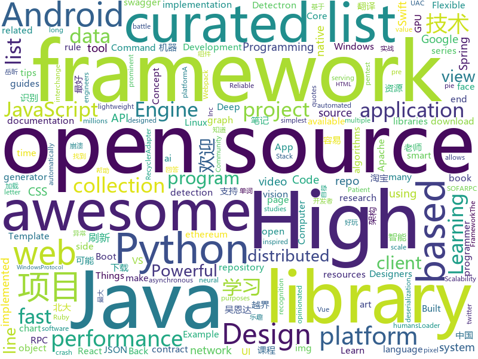

# 2018-05-03
See what the GitHub community is most excited about today.

## python
* [PRNet](https://github.com/YadiraF/PRNet)(**333 stars today**): The source code of 'Joint 3D Face Reconstruction and Dense Alignment with Position Map Regression Network'.
* [WinPwnage](https://github.com/rootm0s/WinPwnage)(**283 stars today**): 💻Elevate, UAC bypass, persistence, privilege escalation, dll hijack techniques
* [catt](https://github.com/skorokithakis/catt)(**284 stars today**): Cast All The Things allows you to send videos from many, many online sources to your Chromecast.
* [monkey](https://github.com/guardicore/monkey)(**174 stars today**): Infection Monkey - An automated pentest tool
* [Bad-Pdf](https://github.com/deepzec/Bad-Pdf)(**90 stars today**): Steal NTLM Hashes with Bad-PDF
* [models](https://github.com/tensorflow/models)(**68 stars today**): Models and examples built with TensorFlow
* [passphrase-wordlist](https://github.com/initstring/passphrase-wordlist)(**75 stars today**): Passphrase wordlist and hashcat rules for offline cracking of long, complex passwords
* [awesome-python](https://github.com/vinta/awesome-python)(**63 stars today**): A curated list of awesome Python frameworks, libraries, software and resources
* [HelloGitHub](https://github.com/521xueweihan/HelloGitHub)(**65 stars today**): 分享 GitHub 上好玩、容易上手的项目，帮你找到编程的乐趣。欢迎推荐、自荐项目，让更多人知道你的项目⭐️
* [faceai](https://github.com/vipstone/faceai)(**61 stars today**): 一款优秀的人脸、视频、文字：检测、识别的智能AI项目。
* [CVE-2018-9995_dvr_credentials](https://github.com/ezelf/CVE-2018-9995_dvr_credentials)(**60 stars today**): (CVE-2018-9995) Get DVR Credentials
* [Detectron.pytorch](https://github.com/roytseng-tw/Detectron.pytorch)(**57 stars today**): A pytorch implementation of Detectron. Both training from scratch and inferring directly from pretrained Detectron weights are available.
* [flask](https://github.com/pallets/flask)(**55 stars today**): The Python micro framework for building web applications.
* [keras](https://github.com/keras-team/keras)(**44 stars today**): Deep Learning for humans
* [SpookFlare](https://github.com/hlldz/SpookFlare)(**49 stars today**): Loader, dropper generator with multiple features for bypassing client-side and network-side countermeasures.
* [s2cnn](https://github.com/jonas-koehler/s2cnn)(**44 stars today**): Spherical CNNs
* [Detectron](https://github.com/facebookresearch/Detectron)(**41 stars today**): FAIR's research platform for object detection research, implementing popular algorithms like Mask R-CNN and RetinaNet.
* [face_recognition](https://github.com/ageitgey/face_recognition)(**43 stars today**): The world's simplest facial recognition api for Python and the command line
* [pipenv](https://github.com/pypa/pipenv)(**45 stars today**): Python Development Workflow for Humans.
* [youtube-dl](https://github.com/rg3/youtube-dl)(**40 stars today**): Command-line program to download videos from YouTube.com and other video sites
* [MachineLearning](https://github.com/apachecn/MachineLearning)(**38 stars today**): Machine Learning in Action（机器学习实战）
* [system-design-primer](https://github.com/donnemartin/system-design-primer)(**38 stars today**): Learn how to design large-scale systems. Prep for the system design interview. Includes Anki flashcards.
* [django](https://github.com/django/django)(**35 stars today**): The Web framework for perfectionists with deadlines.
* [home-assistant](https://github.com/home-assistant/home-assistant)(**33 stars today**): 🏡Open-source home automation platform running on Python 3
* [public-apis](https://github.com/toddmotto/public-apis)(**34 stars today**): A collective list of public JSON APIs for use in web development.

## java
* [AutoEx](https://github.com/BolexLiu/AutoEx)(**78 stars today**): 🌞帮助Android开发者，让项目在崩溃时从异常堆栈中，自动寻找Stack Overflow的回答。
* [java-design-patterns](https://github.com/iluwatar/java-design-patterns)(**64 stars today**): Design patterns implemented in Java
* [spring-boot](https://github.com/spring-projects/spring-boot)(**54 stars today**): Spring Boot
* [Java-Interview](https://github.com/crossoverJie/Java-Interview)(**55 stars today**): 👨‍🎓Java related : basic, concurrent, algorithm
* [proxyee-down](https://github.com/monkeyWie/proxyee-down)(**54 stars today**): http下载工具，基于http代理，支持多连接分块下载
* [okdownload](https://github.com/lingochamp/okdownload)(**53 stars today**): A Reliable, Flexible, Fast and Powerful download engine.
* [halo](https://github.com/ruibaby/halo)(**48 stars today**): Halo可能是最好的Java博客系统😉
* [graal](https://github.com/oracle/graal)(**51 stars today**): GraalVM: Run Programs Faster Anywhere🚀
* [elasticsearch](https://github.com/elastic/elasticsearch)(**43 stars today**): Open Source, Distributed, RESTful Search Engine
* [SmartRefreshLayout](https://github.com/scwang90/SmartRefreshLayout)(**41 stars today**): 🔥下拉刷新、上拉加载、二级刷新、淘宝二楼、RefreshLayout、OverScroll，Android智能下拉刷新框架，支持越界回弹、越界拖动，具有极强的扩展性，集成了几十种炫酷的Header和 Footer。
* [spring-framework](https://github.com/spring-projects/spring-framework)(**36 stars today**): Spring Framework
* [tutorials](https://github.com/eugenp/tutorials)(**30 stars today**): The "REST With Spring" Course:
* [sofa-rpc](https://github.com/alipay/sofa-rpc)(**36 stars today**): SOFARPC is a high-performance, high-extensibility, production-level Java RPC framework.
* [incubator-dubbo](https://github.com/apache/incubator-dubbo)(**34 stars today**): Apache Dubbo (incubating) is a high-performance, java based, open source RPC framework.
* [ViewPump](https://github.com/InflationX/ViewPump)(**39 stars today**): View Inflation you can intercept.
* [Java](https://github.com/TheAlgorithms/Java)(**34 stars today**): All Algorithms implemented in Java
* [incubator-weex](https://github.com/apache/incubator-weex)(**35 stars today**): Mirror of Apache Weex
* [iockids](https://github.com/pyloque/iockids)(**34 stars today**): DI framework for kids of you
* [sharding-jdbc](https://github.com/shardingjdbc/sharding-jdbc)(**35 stars today**): Distributed database middleware
* [MPAndroidChart](https://github.com/PhilJay/MPAndroidChart)(**28 stars today**): A powerful🚀Android chart view / graph view library, supporting line- bar- pie- radar- bubble- and candlestick charts as well as scaling, dragging and animations.
* [runelite](https://github.com/runelite/runelite)(**16 stars today**): Open source Old School RuneScape client
* [guava](https://github.com/google/guava)(**28 stars today**): Google core libraries for Java
* [retrofit](https://github.com/square/retrofit)(**26 stars today**): Type-safe HTTP client for Android and Java by Square, Inc.
* [RxJava](https://github.com/ReactiveX/RxJava)(**28 stars today**): RxJava – Reactive Extensions for the JVM – a library for composing asynchronous and event-based programs using observable sequences for the Java VM.
* [BaseRecyclerViewAdapterHelper](https://github.com/CymChad/BaseRecyclerViewAdapterHelper)(**26 stars today**): BRVAH:Powerful and flexible RecyclerAdapter

## unknown
* [architect-awesome](https://github.com/xingshaocheng/architect-awesome)(**1,969 stars today**): 后端架构师技术图谱
* [chinese-programmer-wrong-pronunciation](https://github.com/shimohq/chinese-programmer-wrong-pronunciation)(**531 stars today**): 中国程序员容易发音错误的单词
* [css-protips](https://github.com/AllThingsSmitty/css-protips)(**334 stars today**): A collection of tips to help take your CSS skills pro
* [awesome-scalability](https://github.com/binhnguyennus/awesome-scalability)(**328 stars today**): 💯An updated and curated list of High Scalability, High Availability, High Stability, High Performance, and High Intelligence Back-end Designs. Concepts are explained in the articles of prominent engineers and credible references. Case studies are from battle-tested systems serving millions to billions of users⭐️
* [Interview-Notebook](https://github.com/CyC2018/Interview-Notebook)(**269 stars today**): 📚技术面试需要掌握的基础知识整理，欢迎编辑~
* [architecture.of.internet-product](https://github.com/davideuler/architecture.of.internet-product)(**122 stars today**): 互联网公司技术架构，微信/淘宝/腾讯/阿里/美团点评/百度/微博/Google/Facebook/Amazon/eBay的架构，欢迎PR补充
* [the-bread-code](https://github.com/hendricius/the-bread-code)(**128 stars today**): Learn how to master the art of baking the programmer way.
* [swift](https://github.com/tensorflow/swift)(**111 stars today**): Swift for TensorFlow documentation repository.
* [You-Dont-Know-JS](https://github.com/getify/You-Dont-Know-JS)(**105 stars today**): A book series on JavaScript. @YDKJS on twitter.
* [gitignore](https://github.com/github/gitignore)(**95 stars today**): A collection of useful .gitignore templates
* [awesome-open-source-organizations](https://github.com/Mayeu/awesome-open-source-organizations)(**86 stars today**): A list of organizations that have open sourced everything they do
* [project-based-learning](https://github.com/tuvtran/project-based-learning)(**76 stars today**): Curated list of project-based tutorials
* [awesome](https://github.com/sindresorhus/awesome)(**69 stars today**): 😎Curated list of awesome lists
* [free-programming-books](https://github.com/EbookFoundation/free-programming-books)(**65 stars today**): 📚Freely available programming books
* [awesome-vue](https://github.com/vuejs/awesome-vue)(**62 stars today**): 🎉A curated list of awesome things related to Vue.js
* [subliminal](https://github.com/gaearon/subliminal)(**62 stars today**): An opinionated minimalistic VS Code theme for JavaScript
* [Front-End-Design-Checklist](https://github.com/thedaviddias/Front-End-Design-Checklist)(**50 stars today**): 💎The Design Checklist for Creative Web Designers and Patient Front-End Developers
* [react-native-guide](https://github.com/reactnativecn/react-native-guide)(**50 stars today**): React Native指南汇集了各类react-native学习资源、开源App和组件
* [gold-miner](https://github.com/xitu/gold-miner)(**44 stars today**): 🥇掘金翻译计划，可能是世界最大最好的英译中技术社区，最懂读者和译者的翻译平台：
* [ReLaXed-examples](https://github.com/RelaxedJS/ReLaXed-examples)(**43 stars today**): Example projects for ReLaXed, the PDF edition framework: letter, slide, poster, report, and more.
* [SwiftTips](https://github.com/JohnSundell/SwiftTips)(**41 stars today**): A collection of Swift tips & tricks that I've shared on Twitter
* [windows10_ntfs_crash_dos](https://github.com/mtivadar/windows10_ntfs_crash_dos)(**35 stars today**): PoC for a NTFS crash that I discovered, in various Windows versions
* [baidu-netdisk-downloaderx](https://github.com/b3log/baidu-netdisk-downloaderx)(**36 stars today**): ⚡️百度网盘不限速下载器 BND
* [HTMLX](https://github.com/Rich-Harris/HTMLX)(**35 stars today**): One Template to rule them all
* [awesome-computer-vision](https://github.com/jbhuang0604/awesome-computer-vision)(**33 stars today**): A curated list of awesome computer vision resources

## c++
* [tensorflow](https://github.com/tensorflow/tensorflow)(**130 stars today**): Computation using data flow graphs for scalable machine learning
* [pytorch](https://github.com/pytorch/pytorch)(**73 stars today**): Tensors and Dynamic neural networks in Python with strong GPU acceleration
* [electron](https://github.com/electron/electron)(**67 stars today**): Build cross platform desktop apps with JavaScript, HTML, and CSS
* [eos](https://github.com/EOSIO/eos)(**63 stars today**): An open source smart contract platform
* [vnote](https://github.com/tamlok/vnote)(**65 stars today**): A Vim-inspired note-taking application that knows programmers and Markdown better.
* [ELF](https://github.com/pytorch/ELF)(**59 stars today**): ELF: a platform for game research
* [foundationdb](https://github.com/apple/foundationdb)(**60 stars today**): FoundationDB - the open source, distributed, transactional key-value store
* [SSIDCard](https://github.com/sansansisi/SSIDCard)(**58 stars today**): iOS中国二代身份证号扫描识别
* [opencv](https://github.com/opencv/opencv)(**45 stars today**): Open Source Computer Vision Library
* [bitcoin](https://github.com/bitcoin/bitcoin)(**43 stars today**): Bitcoin Core integration/staging tree
* [Rea](https://github.com/im95able/Rea)(**49 stars today**): Lightweight library of data structures implemented in C++11, designed for constant time insertion, erasure, lookup, and fastest possible iteration.
* [meshoptimizer](https://github.com/zeux/meshoptimizer)(**47 stars today**): Mesh optimization library that makes indexed meshes more GPU-friendly
* [libui-node](https://github.com/parro-it/libui-node)(**41 stars today**): Node bindings for libui, an awesome native UI library for Unix, OSX and Windows
* [protobuf](https://github.com/google/protobuf)(**34 stars today**): Protocol Buffers - Google's data interchange format
* [tesseract](https://github.com/tesseract-ocr/tesseract)(**32 stars today**): Tesseract Open Source OCR Engine (main repository)
* [swift](https://github.com/apple/swift)(**29 stars today**): The Swift Programming Language
* [aseprite](https://github.com/aseprite/aseprite)(**31 stars today**): Animated sprite editor & pixel art tool (Windows, macOS, Linux)
* [miximus](https://github.com/barryWhiteHat/miximus)(**28 stars today**): A proof of concept trustless ethereum mixer
* [dxvk](https://github.com/doitsujin/dxvk)(**29 stars today**): Vulkan-based D3D11 implementation for Linux / Wine
* [Open3D](https://github.com/Open-3D/Open3D)(**28 stars today**): Open3D: The Community version
* [caffe](https://github.com/BVLC/caffe)(**22 stars today**): Caffe: a fast open framework for deep learning.
* [grpc](https://github.com/grpc/grpc)(**24 stars today**): The C based gRPC (C++, Python, Ruby, Objective-C, PHP, C#)
* [TorchCraft](https://github.com/TorchCraft/TorchCraft)(**26 stars today**): Connecting Torch to StarCraft
* [napajs](https://github.com/Microsoft/napajs)(**26 stars today**): Napa.js: a multi-threaded JavaScript runtime
* [solidity](https://github.com/ethereum/solidity)(**23 stars today**): Solidity, the Contract-Oriented Programming Language

## html
* [Xin-Yue](https://github.com/sikaozhe1997/Xin-Yue)(**135 stars today**): 岳昕：致北大师生与北大外国语学院的一封公开信
* [SMART-CSS-GRID](https://github.com/vladocar/SMART-CSS-GRID)(**92 stars today**): SMART CSS GRID - CSS Framework
* [Coursera-ML-AndrewNg-Notes](https://github.com/fengdu78/Coursera-ML-AndrewNg-Notes)(**74 stars today**): 吴恩达老师的机器学习课程个人笔记
* [deeplearning_ai_books](https://github.com/fengdu78/deeplearning_ai_books)(**73 stars today**): deeplearning.ai（吴恩达老师的深度学习课程笔记及资源）
* [picojs](https://github.com/tehnokv/picojs)(**50 stars today**): A face detection library in 200 lines of JavaScript
* [stocks](https://github.com/toddwschneider/stocks)(**48 stars today**): A free, lightweight, blazing-fast static page to get stock quotes using the IEX API
* [nanoscope](https://github.com/uber/nanoscope)(**44 stars today**): An extremely accurate Android method tracing tool.
* [testing-distributed-systems](https://github.com/asatarin/testing-distributed-systems)(**41 stars today**): Curated list of resources on testing distributed systems
* [WebFundamentals](https://github.com/google/WebFundamentals)(**41 stars today**): Best practices for modern web development
* [generator-jhipster](https://github.com/jhipster/generator-jhipster)(**30 stars today**): Open Source application generator for creating Spring Boot + Angular/React projects in seconds!
* [awesome-mac](https://github.com/jaywcjlove/awesome-mac)(**25 stars today**):  This repo is a collection of awesome Mac applications and tools for developers and designers.
* [img-2](https://github.com/RevillWeb/img-2)(**26 stars today**): Replace  elements with  to automatically pre-cache images and improve page performance.
* [styleguide](https://github.com/google/styleguide)(**22 stars today**): Style guides for Google-originated open-source projects
* [SF-zh](https://github.com/Coq-zh/SF-zh)(**23 stars today**): 《软件基础》中文版
* [portainer](https://github.com/portainer/portainer)(**22 stars today**): Simple management UI for Docker
* [fastText](https://github.com/facebookresearch/fastText)(**21 stars today**): Library for fast text representation and classification.
* [Spoon-Knife](https://github.com/octocat/Spoon-Knife)(****): This repo is for demonstration purposes only.
* [EIPs](https://github.com/ethereum/EIPs)(**15 stars today**): The Ethereum Improvement Proposal repository
* [core](https://github.com/stackblitz/core)(**14 stars today**): Online IDE powered by VS Code⚡️
* [resume](https://github.com/acro5piano/resume)(**14 stars today**): Resume of Kazuya Gosho. Built with Webpack + Pug + PostCSS
* [electron-api-demos](https://github.com/electron/electron-api-demos)(**10 stars today**): Explore the Electron APIs
* [learning-area](https://github.com/mdn/learning-area)(**5 stars today**): Github repo for the MDN Learning Area.
* [swagger-codegen](https://github.com/swagger-api/swagger-codegen)(**9 stars today**): swagger-codegen contains a template-driven engine to generate documentation, API clients and server stubs in different languages by parsing your OpenAPI / Swagger definition.
* [be-a-deletist](https://github.com/charlesrt/be-a-deletist)(**11 stars today**): A series of advice and guides for the privacy conscious and the minimalists; trying to reduce their digital data footprint, become anonymous, and make time.
* [gson](https://github.com/google/gson)(**10 stars today**): A Java serialization/deserialization library to convert Java Objects into JSON and back

## WordCloud

