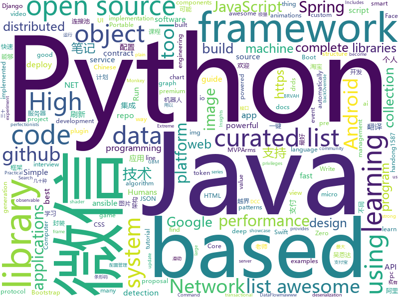

# 2018-05-16
See what the GitHub community is most excited about today.

## python
* [Chinese-Word-Vectors](https://github.com/Embedding/Chinese-Word-Vectors)(**277 stars today**): 100+ Chinese Word Vectors 上百种预训练中文词向量
* [Crunch](https://github.com/chrissimpkins/Crunch)(**167 stars today**): Insane(ly slow but wicked good) PNG image optimization
* [Learning-to-See-in-the-Dark](https://github.com/cchen156/Learning-to-See-in-the-Dark)(**112 stars today**): 
* [models](https://github.com/tensorflow/models)(**67 stars today**): Models and examples built with TensorFlow
* [meethub](https://github.com/iyanuashiri/meethub)(**68 stars today**): This is a Python/Django based event management system. A meetup clone.
* [awesome-python](https://github.com/vinta/awesome-python)(**51 stars today**): A curated list of awesome Python frameworks, libraries, software and resources
* [keras](https://github.com/keras-team/keras)(**38 stars today**): Deep Learning for humans
* [django](https://github.com/django/django)(**41 stars today**): The Web framework for perfectionists with deadlines.
* [ansible](https://github.com/ansible/ansible)(**32 stars today**): Ansible is a radically simple IT automation platform that makes your applications and systems easier to deploy. Avoid writing scripts or custom code to deploy and update your applications — automate in a language that approaches plain English, using SSH, with no agents to install on remote systems. https://docs.ansible.com/ansible/
* [pipenv](https://github.com/pypa/pipenv)(**44 stars today**): Python Development Workflow for Humans.
* [youtube-dl](https://github.com/rg3/youtube-dl)(**42 stars today**): Command-line program to download videos from YouTube.com and other video sites
* [generative-compression](https://github.com/Justin-Tan/generative-compression)(**40 stars today**): TensorFlow Implementation of Generative Adversarial Networks for Extreme Learned Image Compression
* [public-apis](https://github.com/toddmotto/public-apis)(**38 stars today**): A collective list of public JSON APIs for use in web development.
* [system-design-primer](https://github.com/donnemartin/system-design-primer)(**36 stars today**): Learn how to design large-scale systems. Prep for the system design interview. Includes Anki flashcards.
* [scrapy](https://github.com/scrapy/scrapy)(**36 stars today**): Scrapy, a fast high-level web crawling & scraping framework for Python.
* [requests](https://github.com/requests/requests)(**31 stars today**): Python HTTP Requests for Humans™✨🍰✨
* [PRNet](https://github.com/YadiraF/PRNet)(**29 stars today**): The source code of 'Joint 3D Face Reconstruction and Dense Alignment with Position Map Regression Network'.
* [flask](https://github.com/pallets/flask)(**28 stars today**): The Python micro framework for building web applications.
* [awesome-machine-learning](https://github.com/josephmisiti/awesome-machine-learning)(**27 stars today**): A curated list of awesome Machine Learning frameworks, libraries and software.
* [cadquery](https://github.com/dcowden/cadquery)(**29 stars today**): CadQuery-- a parametric cad script framework
* [pandas](https://github.com/pandas-dev/pandas)(**24 stars today**): Flexible and powerful data analysis / manipulation library for Python, providing labeled data structures similar to R data.frame objects, statistical functions, and much more
* [monkey](https://github.com/guardicore/monkey)(**27 stars today**): Infection Monkey - An automated pentest tool
* [scikit-learn](https://github.com/scikit-learn/scikit-learn)(**22 stars today**): scikit-learn: machine learning in Python
* [ItChat](https://github.com/littlecodersh/ItChat)(**24 stars today**): A complete and graceful API for Wechat. 微信个人号接口、微信机器人及命令行微信，三十行即可自定义个人号机器人。
* [labelImg](https://github.com/tzutalin/labelImg)(**21 stars today**): 🤘LabelImg is a graphical image annotation tool and label object bounding boxes in images

## java
* [openzaly](https://github.com/akaxincom/openzaly)(**109 stars today**): openzaly 是 Akaxin 的服务器源代码，用以搭建私有聊天服务器。
* [spring-boot](https://github.com/spring-projects/spring-boot)(**60 stars today**): Spring Boot
* [java-design-patterns](https://github.com/iluwatar/java-design-patterns)(**42 stars today**): Design patterns implemented in Java
* [MarkNote](https://github.com/Shouheng88/MarkNote)(**51 stars today**): 📑马克笔记：一款支持Markdown语法的Android端笔记应用
* [RxJava](https://github.com/ReactiveX/RxJava)(**39 stars today**): RxJava – Reactive Extensions for the JVM – a library for composing asynchronous and event-based programs using observable sequences for the Java VM.
* [elasticsearch](https://github.com/elastic/elasticsearch)(**35 stars today**): Open Source, Distributed, RESTful Search Engine
* [guava](https://github.com/google/guava)(**36 stars today**): Google core libraries for Java
* [SmartRefreshLayout](https://github.com/scwang90/SmartRefreshLayout)(**36 stars today**): 🔥下拉刷新、上拉加载、二级刷新、淘宝二楼、RefreshLayout、OverScroll，Android智能下拉刷新框架，支持越界回弹、越界拖动，具有极强的扩展性，集成了几十种炫酷的Header和 Footer。
* [weixin-java-tools](https://github.com/Wechat-Group/weixin-java-tools)(**31 stars today**): 可能是目前最好最全的微信Java开发工具包，支持包括微信支付、开放平台、小程序、企业号和公众号等的开发
* [spring-framework](https://github.com/spring-projects/spring-framework)(**31 stars today**): Spring Framework
* [apollo](https://github.com/ctripcorp/apollo)(**32 stars today**): Apollo（阿波罗）是携程框架部门研发的分布式配置中心，能够集中化管理应用不同环境、不同集群的配置，配置修改后能够实时推送到应用端，并且具备规范的权限、流程治理等特性，适用于微服务配置管理场景。
* [tutorials](https://github.com/eugenp/tutorials)(**26 stars today**): The "REST With Spring" Course:
* [ArmsComponent](https://github.com/JessYanCoding/ArmsComponent)(**36 stars today**): A complete android componentization solution, powered by MVPArms (MVPArms 官方快速组件化方案).
* [runelite](https://github.com/runelite/runelite)(**18 stars today**): Open source Old School RuneScape client
* [Java](https://github.com/TheAlgorithms/Java)(**30 stars today**): All Algorithms implemented in Java
* [SSM](https://github.com/crossoverJie/SSM)(**29 stars today**): 💕build SSM from 0 👉🏽👉🏽 distributed micro service.
* [incubator-dubbo](https://github.com/apache/incubator-dubbo)(**23 stars today**): Apache Dubbo (incubating) is a high-performance, java based, open source RPC framework.
* [spring-boot-examples](https://github.com/ityouknow/spring-boot-examples)(**27 stars today**): about learning Spring Boot via examples. Spring Boot 技术栈示例代码，快速简单上手教程。
* [BaseRecyclerViewAdapterHelper](https://github.com/CymChad/BaseRecyclerViewAdapterHelper)(**28 stars today**): BRVAH:Powerful and flexible RecyclerAdapter
* [material-components-android](https://github.com/material-components/material-components-android)(**28 stars today**): Modular and customizable Material Design UI components for Android
* [RxTools](https://github.com/vondear/RxTools)(**27 stars today**): Android开发人员不得不收集的工具类集合 | 支付宝支付 | 微信支付（统一下单） | 微信分享 | Zip4j压缩（支持分卷压缩与加密） | 一键集成UCrop选择圆形头像 | 一键集成二维码和条形码的扫描与生成 | 常用Dialog | WebView的封装可播放视频 | 仿斗鱼滑动验证码 | Toast封装 | 震动 | GPS | Location定位 | 图片缩放 | Exif 图片添加地理位置信息（经纬度） | 蛛网等级 | 颜色选择器 | 编译运行一下说不定会找到惊喜
* [interviews](https://github.com/kdn251/interviews)(**26 stars today**): Everything you need to know to get the job.
* [MPAndroidChart](https://github.com/PhilJay/MPAndroidChart)(**22 stars today**): A powerful🚀Android chart view / graph view library, supporting line- bar- pie- radar- bubble- and candlestick charts as well as scaling, dragging and animations.
* [druid](https://github.com/alibaba/druid)(**22 stars today**): ♨️为监控而生的数据库连接池！阿里云DRDS(https://www.aliyun.com/product/drds )、阿里巴巴TDDL 连接池powered by Druid
* [graal](https://github.com/oracle/graal)(**23 stars today**): GraalVM: Run Programs Faster Anywhere🚀

## unknown
* [build-your-own-x](https://github.com/danistefanovic/build-your-own-x)(**1,670 stars today**): 🤓Build your own (insert technology here)
* [Hackintosh-Installer-University](https://github.com/huangyz0918/Hackintosh-Installer-University)(**533 stars today**): open source tutorial & information collector for hackintosh installation.💻➕🍎
* [architect-awesome](https://github.com/xingshaocheng/architect-awesome)(**469 stars today**): 后端架构师技术图谱
* [architecture.of.internet-product](https://github.com/davideuler/architecture.of.internet-product)(**255 stars today**): 互联网公司技术架构，微信/淘宝/微博/腾讯/阿里/美团点评/百度/Google/Facebook/Amazon/eBay的架构，欢迎PR补充
* [Interview-Notebook](https://github.com/CyC2018/Interview-Notebook)(**141 stars today**): 📚技术面试需要掌握的基础知识整理，欢迎编辑~
* [awesome-object-detection](https://github.com/amusi/awesome-object-detection)(**135 stars today**): Awesome Object Detection based on handong1587 github: https://handong1587.github.io/deep_learning/2015/10/09/object-detection.html
* [css-protips](https://github.com/AllThingsSmitty/css-protips)(**114 stars today**): A collection of tips to help take your CSS skills pro
* [proposal-blocks](https://github.com/domenic/proposal-blocks)(**103 stars today**): A proposal for a new syntactic construct for serializable blocks of JavaScript code
* [awesome-scalability](https://github.com/binhnguyennus/awesome-scalability)(**99 stars today**): High Scalability, High Availability, High Stability, High Performance, and High Intelligence Back-End Design Patterns
* [gitignore](https://github.com/github/gitignore)(**71 stars today**): A collection of useful .gitignore templates
* [awesome](https://github.com/sindresorhus/awesome)(**87 stars today**): 😎Curated list of awesome lists
* [chinese-programmer-wrong-pronunciation](https://github.com/shimohq/chinese-programmer-wrong-pronunciation)(**83 stars today**): 中国程序员容易发音错误的单词
* [You-Dont-Know-JS](https://github.com/getify/You-Dont-Know-JS)(**74 stars today**): A book series on JavaScript. @YDKJS on twitter.
* [kubernetes-the-hard-way](https://github.com/kelseyhightower/kubernetes-the-hard-way)(**76 stars today**): Bootstrap Kubernetes the hard way on Google Cloud Platform. No scripts.
* [project-based-learning](https://github.com/tuvtran/project-based-learning)(**71 stars today**): Curated list of project-based tutorials
* [coding-interview-university](https://github.com/jwasham/coding-interview-university)(**55 stars today**): A complete computer science study plan to become a software engineer.
* [free-programming-books](https://github.com/EbookFoundation/free-programming-books)(**54 stars today**): 📚Freely available programming books
* [nocode](https://github.com/kelseyhightower/nocode)(**50 stars today**): The best way to write secure and reliable applications. Write nothing; deploy nowhere.
* [awesome-flutter](https://github.com/Solido/awesome-flutter)(**50 stars today**): A curated list of awesome Flutter components, plugins, tutorials and best apps
* [awesome-vue](https://github.com/vuejs/awesome-vue)(**43 stars today**): 🎉A curated list of awesome things related to Vue.js
* [android-architecture](https://github.com/googlesamples/android-architecture)(**41 stars today**): A collection of samples to discuss and showcase different architectural tools and patterns for Android apps.
* [re_lab](https://github.com/cboin/re_lab)(**35 stars today**): A portable reverse engineering environment using docker.
* [crwdtoken](https://github.com/conda-ag/crwdtoken)(**34 stars today**): The CRWDToken is the inherent utility token of the CRWD Network. It is an ERC20 standard token that is utilized by various services in the network and has fluctuating value based on market trading price.
* [gold-miner](https://github.com/xitu/gold-miner)(**30 stars today**): 🥇掘金翻译计划，可能是世界最大最好的英译中技术社区，最懂读者和译者的翻译平台：
* [FES](https://github.com/topepo/FES)(**32 stars today**): Code and Resources for "Feature Engineering and Selection: A Practical Approach for Predictive Models" by Kuhn and Johnson

## c++
* [tensorflow](https://github.com/tensorflow/tensorflow)(**130 stars today**): Computation using data flow graphs for scalable machine learning
* [cppinsights](https://github.com/andreasfertig/cppinsights)(**107 stars today**): C++ Insights - See your source code with the eyes of a compiler
* [PhoenixGo](https://github.com/Tencent/PhoenixGo)(**97 stars today**): Go AI program which implement the AlphaGo Zero paper
* [CVE-2018-8897](https://github.com/can1357/CVE-2018-8897)(**65 stars today**): Arbitrary code execution with kernel privileges using CVE-2018-8897.
* [bitcoin](https://github.com/bitcoin/bitcoin)(**46 stars today**): Bitcoin Core integration/staging tree
* [electron](https://github.com/electron/electron)(**54 stars today**): Build cross platform desktop apps with JavaScript, HTML, and CSS
* [pytorch](https://github.com/pytorch/pytorch)(**45 stars today**): Tensors and Dynamic neural networks in Python with strong GPU acceleration
* [eos](https://github.com/EOSIO/eos)(**46 stars today**): An open source smart contract platform
* [opencv](https://github.com/opencv/opencv)(**35 stars today**): Open Source Computer Vision Library
* [cosmos](https://github.com/OpenGenus/cosmos)(**47 stars today**): Algorithms that run our universe | Your personal library of every algorithm and data structure code that you will ever encounter | Ask us anything at our forum
* [completely-unscientific-benchmarks](https://github.com/frol/completely-unscientific-benchmarks)(**36 stars today**): Naive performance comparison of a few programming languages (JavaScript, Kotlin, Rust, Swift, Nim, Python, Go, Haskell, D, C++, Java, C#, Object Pascal, Ada)
* [protobuf](https://github.com/google/protobuf)(**32 stars today**): Protocol Buffers - Google's data interchange format
* [Tars](https://github.com/Tencent/Tars)(**31 stars today**): Tars is a highly performance rpc framework based on naming service using tars protocol and provides a semi-automatic operation platform.
* [MeshSync](https://github.com/unity3d-jp/MeshSync)(**24 stars today**): synchronize meshes and animations from DCC tools to Unity. supported tools: Maya, Blender, Metasequoia, xismo
* [solidity](https://github.com/ethereum/solidity)(**21 stars today**): Solidity, the Contract-Oriented Programming Language
* [grpc](https://github.com/grpc/grpc)(**20 stars today**): The C based gRPC (C++, Python, Ruby, Objective-C, PHP, C#)
* [caffe](https://github.com/BVLC/caffe)(**20 stars today**): Caffe: a fast open framework for deep learning.
* [DeepSpeech](https://github.com/mozilla/DeepSpeech)(**21 stars today**): A TensorFlow implementation of Baidu's DeepSpeech architecture
* [ELF](https://github.com/pytorch/ELF)(**21 stars today**): ELF: a platform for game research
* [dosbox-crt](https://github.com/mattiasgustavsson/dosbox-crt)(**22 stars today**): DOSbox with my custom CRT emulation shader added to it. A pre-built binary bundled with some game demos can be found here: https://mattiasgustavsson.itch.io/dosbox-crt
* [foundationdb](https://github.com/apple/foundationdb)(**18 stars today**): FoundationDB - the open source, distributed, transactional key-value store
* [swift](https://github.com/apple/swift)(**18 stars today**): The Swift Programming Language
* [openpose](https://github.com/CMU-Perceptual-Computing-Lab/openpose)(**17 stars today**): OpenPose: Real-time multi-person keypoint detection library for body, face, and hands estimation
* [xgboost](https://github.com/dmlc/xgboost)(**15 stars today**): Scalable, Portable and Distributed Gradient Boosting (GBDT, GBRT or GBM) Library, for Python, R, Java, Scala, C++ and more. Runs on single machine, Hadoop, Spark, Flink and DataFlow
* [kakoune](https://github.com/mawww/kakoune)(**17 stars today**): mawww's experiment for a better code editor

## html
* [openapi-generator](https://github.com/OpenAPITools/openapi-generator)(**74 stars today**): OpenAPI Generator allows generation of API client libraries (SDK generation), server stubs, documentation and configuration automatically given an OpenAPI Spec
* [styleguide](https://github.com/google/styleguide)(**50 stars today**): Style guides for Google-originated open-source projects
* [AdminLTE](https://github.com/almasaeed2010/AdminLTE)(**39 stars today**): AdminLTE - Free Premium Admin control Panel Theme Based On Bootstrap 3.x
* [fastText](https://github.com/facebookresearch/fastText)(**28 stars today**): Library for fast text representation and classification.
* [awesome-mac](https://github.com/jaywcjlove/awesome-mac)(**25 stars today**):  This repo is a collection of awesome Mac applications and tools for developers and designers.
* [Coursera-ML-AndrewNg-Notes](https://github.com/fengdu78/Coursera-ML-AndrewNg-Notes)(**19 stars today**): 吴恩达老师的机器学习课程个人笔记
* [deeplearning_ai_books](https://github.com/fengdu78/deeplearning_ai_books)(**21 stars today**): deeplearning.ai（吴恩达老师的深度学习课程笔记及资源）
* [Spoon-Knife](https://github.com/octocat/Spoon-Knife)(****): This repo is for demonstration purposes only.
* [Image-shadow](https://github.com/tunguskha/Image-shadow)(**19 stars today**): Simple and small Javascript plugin to display the shadow of an image!
* [portainer](https://github.com/portainer/portainer)(**17 stars today**): Simple management UI for Docker
* [EIPs](https://github.com/ethereum/EIPs)(**15 stars today**): The Ethereum Improvement Proposal repository
* [gson](https://github.com/google/gson)(**15 stars today**): A Java serialization/deserialization library to convert Java Objects into JSON and back
* [react-app-rewired](https://github.com/timarney/react-app-rewired)(**13 stars today**): Override create-react-app webpack configs without ejecting
* [electron-api-demos](https://github.com/electron/electron-api-demos)(**10 stars today**): Explore the Electron APIs
* [p0tools](https://github.com/google/p0tools)(**11 stars today**): Project Zero Docs and Tools
* [cs231n.github.io](https://github.com/cs231n/cs231n.github.io)(**11 stars today**): Public facing notes page
* [requests-html](https://github.com/kennethreitz/requests-html)(**10 stars today**): Pythonic HTML Parsing for Humans™
* [node-interview](https://github.com/ElemeFE/node-interview)(**10 stars today**): How to pass the Node.js interview of ElemeFE.
* [github](https://github.com/phodal/github)(**10 stars today**): GitHub 漫游指南- a Chinese ebook on how to build a good build on Github. Explore the users' behavior. Find some thing interest.
* [img-2](https://github.com/RevillWeb/img-2)(**9 stars today**): Replace  elements with  to automatically pre-cache images and improve page performance.
* [django-beginners-guide](https://github.com/pythonzhichan/django-beginners-guide)(**9 stars today**): A Complete Beginner's Guide to Django 翻译计划
* [ionicons](https://github.com/ionic-team/ionicons)(**9 stars today**): The premium icon font for Ionic
* [dotnet](https://github.com/Microsoft/dotnet)(**9 stars today**): This repo is the official home of .NET on GitHub. It's a great starting point to find many .NET OSS projects from Microsoft and the community, including many that are part of the .NET Foundation.
* [smart-contract-best-practices](https://github.com/ConsenSys/smart-contract-best-practices)(**8 stars today**): A guide to smart contract security best practices
* [sass-loader](https://github.com/webpack-contrib/sass-loader)(**9 stars today**): Compiles Sass to CSS

## WordCloud

