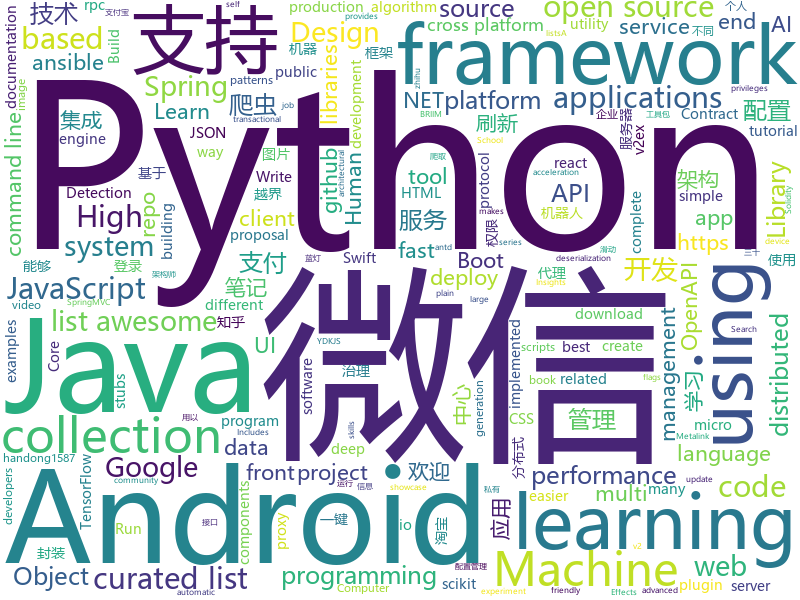

# 2018-05-17
See what the GitHub community is most excited about today.

## python
* [Crunch](https://github.com/chrissimpkins/Crunch)(**346 stars today**): Insane(ly slow but wicked good) PNG image optimization
* [Chinese-Word-Vectors](https://github.com/Embedding/Chinese-Word-Vectors)(**253 stars today**): 100+ Chinese Word Vectors 上百种预训练中文词向量
* [Learning-to-See-in-the-Dark](https://github.com/cchen156/Learning-to-See-in-the-Dark)(**134 stars today**): 
* [models](https://github.com/tensorflow/models)(**79 stars today**): Models and examples built with TensorFlow
* [wavegan](https://github.com/chrisdonahue/wavegan)(**68 stars today**): WaveGAN: using GANs to synthesize raw audio
* [keras](https://github.com/keras-team/keras)(**42 stars today**): Deep Learning for humans
* [awesome-python](https://github.com/vinta/awesome-python)(**48 stars today**): A curated list of awesome Python frameworks, libraries, software and resources
* [public-apis](https://github.com/toddmotto/public-apis)(**48 stars today**): A collective list of public JSON APIs for use in web development.
* [pipenv](https://github.com/pypa/pipenv)(**40 stars today**): Python Development Workflow for Humans.
* [flask](https://github.com/pallets/flask)(**36 stars today**): The Python micro framework for building web applications.
* [youtube-dl](https://github.com/rg3/youtube-dl)(**38 stars today**): Command-line program to download videos from YouTube.com and other video sites
* [hands_on_Ml_with_Sklearn_and_TF](https://github.com/apachecn/hands_on_Ml_with_Sklearn_and_TF)(**35 stars today**): OReilly Hands On Machine Learning with Scikit Learn and TensorFlow (Sklearn与TensorFlow机器学习实用指南)
* [meethub](https://github.com/iyanuashiri/meethub)(**36 stars today**): This is a Python/Django based event management system. A meetup clone.
* [shiv](https://github.com/linkedin/shiv)(**38 stars today**): shiv is a command line utility for building fully self contained Python zipapps as outlined in PEP 441, but with all their dependencies included.
* [django](https://github.com/django/django)(**27 stars today**): The Web framework for perfectionists with deadlines.
* [ansible](https://github.com/ansible/ansible)(**22 stars today**): Ansible is a radically simple IT automation platform that makes your applications and systems easier to deploy. Avoid writing scripts or custom code to deploy and update your applications — automate in a language that approaches plain English, using SSH, with no agents to install on remote systems. https://docs.ansible.com/ansible/
* [you-get](https://github.com/soimort/you-get)(**32 stars today**): ⏬Dumb downloader that scrapes the web
* [ItChat](https://github.com/littlecodersh/ItChat)(**32 stars today**): A complete and graceful API for Wechat. 微信个人号接口、微信机器人及命令行微信，三十行即可自定义个人号机器人。
* [MachineLearning](https://github.com/apachecn/MachineLearning)(**29 stars today**): Machine Learning in Action（机器学习实战）
* [XX-Net](https://github.com/XX-net/XX-Net)(**29 stars today**): a web proxy tool
* [requests](https://github.com/requests/requests)(**29 stars today**): Python HTTP Requests for Humans™✨🍰✨
* [proxy_pool](https://github.com/jhao104/proxy_pool)(**30 stars today**): Python爬虫代理IP池(proxy pool)
* [system-design-primer](https://github.com/donnemartin/system-design-primer)(**25 stars today**): Learn how to design large-scale systems. Prep for the system design interview. Includes Anki flashcards.
* [scikit-learn](https://github.com/scikit-learn/scikit-learn)(**22 stars today**): scikit-learn: machine learning in Python
* [Telenav.AI](https://github.com/Telenav/Telenav.AI)(**28 stars today**): Telenav.AI competition public repository

## java
* [runelite](https://github.com/runelite/runelite)(**128 stars today**): Open source Old School RuneScape client
* [openzaly](https://github.com/akaxincom/openzaly)(**78 stars today**): openzaly 是 Akaxin 的服务器源代码，用以搭建私有聊天服务器。
* [proxyee-down](https://github.com/monkeyWie/proxyee-down)(**73 stars today**): http下载工具，基于http代理，支持多连接分块下载
* [MarkNote](https://github.com/Shouheng88/MarkNote)(**73 stars today**): 📑马克笔记：一款支持Markdown语法的Android端笔记应用
* [java-design-patterns](https://github.com/iluwatar/java-design-patterns)(**60 stars today**): Design patterns implemented in Java
* [spring-boot](https://github.com/spring-projects/spring-boot)(**45 stars today**): Spring Boot
* [Java-Interview](https://github.com/crossoverJie/Java-Interview)(**46 stars today**): 👨‍🎓Java related : basic, concurrent, algorithm
* [material-components-android](https://github.com/material-components/material-components-android)(**39 stars today**): Modular and customizable Material Design UI components for Android
* [weixin-java-tools](https://github.com/Wechat-Group/weixin-java-tools)(**36 stars today**): 可能是目前最好最全的微信Java开发工具包，支持包括微信支付、开放平台、小程序、企业号和公众号等的开发
* [tutorials](https://github.com/eugenp/tutorials)(**21 stars today**): The "REST With Spring" Course:
* [apollo](https://github.com/ctripcorp/apollo)(**35 stars today**): Apollo（阿波罗）是携程框架部门研发的分布式配置中心，能够集中化管理应用不同环境、不同集群的配置，配置修改后能够实时推送到应用端，并且具备规范的权限、流程治理等特性，适用于微服务配置管理场景。
* [incubator-dubbo](https://github.com/apache/incubator-dubbo)(**27 stars today**): Apache Dubbo (incubating) is a high-performance, java based, open source RPC framework.
* [elasticsearch](https://github.com/elastic/elasticsearch)(**28 stars today**): Open Source, Distributed, RESTful Search Engine
* [Java](https://github.com/TheAlgorithms/Java)(**28 stars today**): All Algorithms implemented in Java
* [spring-boot-examples](https://github.com/ityouknow/spring-boot-examples)(**28 stars today**): about learning Spring Boot via examples. Spring Boot 技术栈示例代码，快速简单上手教程。
* [okhttp](https://github.com/square/okhttp)(**29 stars today**): An HTTP+HTTP/2 client for Android and Java applications.
* [spring-framework](https://github.com/spring-projects/spring-framework)(**25 stars today**): Spring Framework
* [SmartRefreshLayout](https://github.com/scwang90/SmartRefreshLayout)(**29 stars today**): 🔥下拉刷新、上拉加载、二级刷新、淘宝二楼、RefreshLayout、OverScroll，Android智能下拉刷新框架，支持越界回弹、越界拖动，具有极强的扩展性，集成了几十种炫酷的Header和 Footer。
* [AndroidUtilCode](https://github.com/Blankj/AndroidUtilCode)(**25 stars today**): 🔥Android developers should collect the following utils(updating).
* [interviews](https://github.com/kdn251/interviews)(**26 stars today**): Everything you need to know to get the job.
* [lottie-android](https://github.com/airbnb/lottie-android)(**26 stars today**): Render After Effects animations natively on Android and iOS, Web, and React Native
* [SSM](https://github.com/crossoverJie/SSM)(**23 stars today**): 💕build SSM from 0 👉🏽👉🏽 distributed micro service.
* [zheng](https://github.com/shuzheng/zheng)(**21 stars today**): 基于Spring+SpringMVC+Mybatis分布式敏捷开发系统架构，提供整套公共微服务服务模块：集中权限管理（单点登录）、内容管理、支付中心、用户管理（支持第三方登录）、微信平台、存储系统、配置中心、日志分析、任务和通知等，支持服务治理、监控和追踪，努力为中小型企业打造全方位J2EE企业级开发解决方案。
* [guava](https://github.com/google/guava)(**23 stars today**): Google core libraries for Java
* [RxTools](https://github.com/vondear/RxTools)(**25 stars today**): Android开发人员不得不收集的工具类集合 | 支付宝支付 | 微信支付（统一下单） | 微信分享 | Zip4j压缩（支持分卷压缩与加密） | 一键集成UCrop选择圆形头像 | 一键集成二维码和条形码的扫描与生成 | 常用Dialog | WebView的封装可播放视频 | 仿斗鱼滑动验证码 | Toast封装 | 震动 | GPS | Location定位 | 图片缩放 | Exif 图片添加地理位置信息（经纬度） | 蛛网等级 | 颜色选择器 | 编译运行一下说不定会找到惊喜

## unknown
* [build-your-own-x](https://github.com/danistefanovic/build-your-own-x)(**2,729 stars today**): 🤓Build your own (insert technology here)
* [Hackintosh-Installer-University](https://github.com/huangyz0918/Hackintosh-Installer-University)(**322 stars today**): open source tutorial & information collector for hackintosh installation.💻➕🍎
* [architect-awesome](https://github.com/xingshaocheng/architect-awesome)(**292 stars today**): 后端架构师技术图谱
* [architecture.of.internet-product](https://github.com/davideuler/architecture.of.internet-product)(**258 stars today**): 互联网公司技术架构，微信/淘宝/微博/腾讯/阿里/美团点评/百度/Google/Facebook/Amazon/eBay的架构，欢迎PR补充
* [Interview-Notebook](https://github.com/CyC2018/Interview-Notebook)(**107 stars today**): 📚技术面试需要掌握的基础知识整理，欢迎编辑~
* [organization-overview](https://github.com/javascript-machine-learning/organization-overview)(**116 stars today**): 👇Overview of all the resources of BRIIM: JavaScript in Machine Learning
* [gitignore](https://github.com/github/gitignore)(**79 stars today**): A collection of useful .gitignore templates
* [awesome-object-detection](https://github.com/amusi/awesome-object-detection)(**83 stars today**): Awesome Object Detection based on handong1587 github: https://handong1587.github.io/deep_learning/2015/10/09/object-detection.html
* [You-Dont-Know-JS](https://github.com/getify/You-Dont-Know-JS)(**82 stars today**): A book series on JavaScript. @YDKJS on twitter.
* [awesome](https://github.com/sindresorhus/awesome)(**81 stars today**): 😎Curated list of awesome lists
* [coding-interview-university](https://github.com/jwasham/coding-interview-university)(**64 stars today**): A complete computer science study plan to become a software engineer.
* [css-protips](https://github.com/AllThingsSmitty/css-protips)(**66 stars today**): A collection of tips to help take your CSS skills pro
* [free-programming-books](https://github.com/EbookFoundation/free-programming-books)(**58 stars today**): 📚Freely available programming books
* [awesome-vue](https://github.com/vuejs/awesome-vue)(**52 stars today**): 🎉A curated list of awesome things related to Vue.js
* [forum](https://github.com/getlantern/forum)(**44 stars today**): 蓝灯(Lantern)官方论坛
* [project-based-learning](https://github.com/tuvtran/project-based-learning)(**41 stars today**): Curated list of project-based tutorials
* [nocode](https://github.com/kelseyhightower/nocode)(**37 stars today**): The best way to write secure and reliable applications. Write nothing; deploy nowhere.
* [awesome-scalability](https://github.com/binhnguyennus/awesome-scalability)(**35 stars today**): High Scalability, High Availability, High Stability, High Performance, and High Intelligence Back-End Design Patterns
* [awesome-flutter](https://github.com/Solido/awesome-flutter)(**36 stars today**): A curated list of awesome Flutter components, plugins, tutorials and best apps
* [kubecon18-eu](https://github.com/cloudyuga/kubecon18-eu)(**36 stars today**): 
* [proposal-blocks](https://github.com/domenic/proposal-blocks)(**34 stars today**): A proposal for a new syntactic construct for serializable blocks of JavaScript code
* [Free-Python-Books](https://github.com/TechBookHunter/Free-Python-Books)(**24 stars today**): A curated collection of free eBooks about Python
* [android-architecture](https://github.com/googlesamples/android-architecture)(**25 stars today**): A collection of samples to discuss and showcase different architectural tools and patterns for Android apps.
* [kubernetes-the-hard-way](https://github.com/kelseyhightower/kubernetes-the-hard-way)(**26 stars today**): Bootstrap Kubernetes the hard way on Google Cloud Platform. No scripts.
* [awesome-android-ui](https://github.com/wasabeef/awesome-android-ui)(**24 stars today**): A curated list of awesome Android UI/UX libraries

## c++
* [tensorflow](https://github.com/tensorflow/tensorflow)(**151 stars today**): Computation using data flow graphs for scalable machine learning
* [PacVim](https://github.com/jmoon018/PacVim)(**170 stars today**): 
* [PhoenixGo](https://github.com/Tencent/PhoenixGo)(**73 stars today**): Go AI program which implement the AlphaGo Zero paper
* [cosmos](https://github.com/OpenGenus/cosmos)(**63 stars today**): Algorithms that run our universe | Your personal library of every algorithm and data structure code that you will ever encounter | Ask us anything at our forum
* [bitcoin](https://github.com/bitcoin/bitcoin)(**51 stars today**): Bitcoin Core integration/staging tree
* [electron](https://github.com/electron/electron)(**52 stars today**): Build cross platform desktop apps with JavaScript, HTML, and CSS
* [pytorch](https://github.com/pytorch/pytorch)(**46 stars today**): Tensors and Dynamic neural networks in Python with strong GPU acceleration
* [cppinsights](https://github.com/andreasfertig/cppinsights)(**50 stars today**): C++ Insights - See your source code with the eyes of a compiler
* [opencv](https://github.com/opencv/opencv)(**36 stars today**): Open Source Computer Vision Library
* [eos](https://github.com/EOSIO/eos)(**37 stars today**): An open source smart contract platform
* [protobuf](https://github.com/google/protobuf)(**33 stars today**): Protocol Buffers - Google's data interchange format
* [aria2](https://github.com/aria2/aria2)(**30 stars today**): aria2 is a lightweight multi-protocol & multi-source, cross platform download utility operated in command-line. It supports HTTP/HTTPS, FTP, SFTP, BitTorrent and Metalink.
* [envoy](https://github.com/envoyproxy/envoy)(**25 stars today**): C++ front/service proxy
* [grpc](https://github.com/grpc/grpc)(**24 stars today**): The C based gRPC (C++, Python, Ruby, Objective-C, PHP, C#)
* [CVE-2018-8897](https://github.com/can1357/CVE-2018-8897)(**25 stars today**): Arbitrary code execution with kernel privileges using CVE-2018-8897.
* [caffe](https://github.com/BVLC/caffe)(**18 stars today**): Caffe: a fast open framework for deep learning.
* [kakoune](https://github.com/mawww/kakoune)(**22 stars today**): mawww's experiment for a better code editor
* [swift](https://github.com/apple/swift)(**20 stars today**): The Swift Programming Language
* [godot](https://github.com/godotengine/godot)(**20 stars today**): Godot Engine – Multi-platform 2D and 3D game engine
* [completely-unscientific-benchmarks](https://github.com/frol/completely-unscientific-benchmarks)(**21 stars today**): Naive performance comparison of a few programming languages (JavaScript, Kotlin, Rust, Swift, Nim, Python, Go, Haskell, D, C++, Java, C#, Object Pascal, Ada)
* [solidity](https://github.com/ethereum/solidity)(**18 stars today**): Solidity, the Contract-Oriented Programming Language
* [foundationdb](https://github.com/apple/foundationdb)(**20 stars today**): FoundationDB - the open source, distributed, transactional key-value store
* [RedisDesktopManager](https://github.com/uglide/RedisDesktopManager)(**19 stars today**): 🔧Cross-platform GUI management tool for Redis
* [xgboost](https://github.com/dmlc/xgboost)(**17 stars today**): Scalable, Portable and Distributed Gradient Boosting (GBDT, GBRT or GBM) Library, for Python, R, Java, Scala, C++ and more. Runs on single machine, Hadoop, Spark, Flink and DataFlow
* [Tars](https://github.com/Tencent/Tars)(**17 stars today**): Tars is a highly performance rpc framework based on naming service using tars protocol and provides a semi-automatic operation platform.

## html
* [openapi-generator](https://github.com/OpenAPITools/openapi-generator)(**52 stars today**): OpenAPI Generator allows generation of API client libraries (SDK generation), server stubs, documentation and configuration automatically given an OpenAPI Spec (v2, v3)
* [styleguide](https://github.com/google/styleguide)(**28 stars today**): Style guides for Google-originated open-source projects
* [awesome-mac](https://github.com/jaywcjlove/awesome-mac)(**28 stars today**):  This repo is a collection of awesome Mac applications and tools for developers and designers.
* [fastText](https://github.com/facebookresearch/fastText)(**25 stars today**): Library for fast text representation and classification.
* [deeplearning_ai_books](https://github.com/fengdu78/deeplearning_ai_books)(**20 stars today**): deeplearning.ai（吴恩达老师的深度学习课程笔记及资源）
* [redes](https://github.com/la9una/redes)(**23 stars today**): Apuntes sobre redes
* [Spoon-Knife](https://github.com/octocat/Spoon-Knife)(****): This repo is for demonstration purposes only.
* [morning-ui](https://github.com/Morning-UI/morning-ui)(**17 stars today**): modern efficient user interface, using human-friendly HTML
* [pyspider](https://github.com/h2pl/pyspider)(**14 stars today**): 知乎爬虫和v2ex爬虫的实现。使用python的pyspider爬虫进行开发，主要爬取知乎的问题和评论，以及v2ex的帖子。数据转储到mysql数据库，用于zhihu项目的使用。
* [gson](https://github.com/google/gson)(**13 stars today**): A Java serialization/deserialization library to convert Java Objects into JSON and back
* [portainer](https://github.com/portainer/portainer)(**14 stars today**): Simple management UI for Docker
* [react-app-rewired](https://github.com/timarney/react-app-rewired)(**15 stars today**): Override create-react-app webpack configs without ejecting
* [swagger-codegen](https://github.com/swagger-api/swagger-codegen)(**14 stars today**): swagger-codegen contains a template-driven engine to generate documentation, API clients and server stubs in different languages by parsing your OpenAPI / Swagger definition.
* [Image-shadow](https://github.com/tunguskha/Image-shadow)(**14 stars today**): Simple and small Javascript plugin to display the shadow of an image!
* [ng-alain](https://github.com/cipchk/ng-alain)(**11 stars today**): ng-zorro-antd admin panel front-end framework
* [electron-api-demos](https://github.com/electron/electron-api-demos)(**12 stars today**): Explore the Electron APIs
* [EIPs](https://github.com/ethereum/EIPs)(**13 stars today**): The Ethereum Improvement Proposal repository
* [elixir-companies](https://github.com/doomspork/elixir-companies)(**5 stars today**): A list of companies currently using Elixir in production.
* [ionicons](https://github.com/ionic-team/ionicons)(**11 stars today**): The premium icon font for Ionic
* [foundation-sites](https://github.com/zurb/foundation-sites)(**10 stars today**): The most advanced responsive front-end framework in the world. Quickly create prototypes and production code for sites that work on any kind of device.
* [hyperHTML](https://github.com/WebReflection/hyperHTML)(**10 stars today**): A Fast & Light Virtual DOM Alternative
* [cs231n.github.io](https://github.com/cs231n/cs231n.github.io)(**8 stars today**): Public facing notes page
* [flag-icon-css](https://github.com/lipis/flag-icon-css)(**9 stars today**): 🎏A collection of all country flags in SVG — plus the CSS for easier integration
* [dotnet](https://github.com/Microsoft/dotnet)(**9 stars today**): This repo is the official home of .NET on GitHub. It's a great starting point to find many .NET OSS projects from Microsoft and the community, including many that are part of the .NET Foundation.
* [elasticsearch-definitive-guide](https://github.com/elasticsearch-cn/elasticsearch-definitive-guide)(**8 stars today**): 欢迎加QQ群：109764489，贡献力量！

## WordCloud

