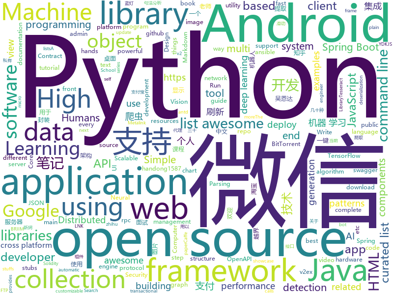

# 2018-05-18
See what the GitHub community is most excited about today.

## python
* [Crunch](https://github.com/chrissimpkins/Crunch)(**303 stars today**): Insane(ly slow but wicked good) PNG image optimization
* [edgedb](https://github.com/edgedb/edgedb)(**240 stars today**): The next generation object-relational database.
* [Chinese-Word-Vectors](https://github.com/Embedding/Chinese-Word-Vectors)(**140 stars today**): 100+ Chinese Word Vectors 上百种预训练中文词向量
* [Learning-to-See-in-the-Dark](https://github.com/cchen156/Learning-to-See-in-the-Dark)(**132 stars today**): 
* [models](https://github.com/tensorflow/models)(**89 stars today**): Models and examples built with TensorFlow
* [examples](https://github.com/pytorch/examples)(**98 stars today**): A set of examples around pytorch in Vision, Text, Reinforcement Learning, etc.
* [keras](https://github.com/keras-team/keras)(**50 stars today**): Deep Learning for humans
* [awesome-python](https://github.com/vinta/awesome-python)(**57 stars today**): A curated list of awesome Python frameworks, libraries, software and resources
* [public-apis](https://github.com/toddmotto/public-apis)(**53 stars today**): A collective list of public JSON APIs for use in web development.
* [flask](https://github.com/pallets/flask)(**45 stars today**): The Python micro framework for building web applications.
* [hands_on_Ml_with_Sklearn_and_TF](https://github.com/apachecn/hands_on_Ml_with_Sklearn_and_TF)(**40 stars today**): OReilly Hands On Machine Learning with Scikit Learn and TensorFlow (Sklearn与TensorFlow机器学习实用指南)
* [django](https://github.com/django/django)(**35 stars today**): The Web framework for perfectionists with deadlines.
* [pipenv](https://github.com/pypa/pipenv)(**39 stars today**): Python Development Workflow for Humans.
* [MachineLearning](https://github.com/apachecn/MachineLearning)(**34 stars today**): Machine Learning in Action（机器学习实战）
* [Telenav.AI](https://github.com/Telenav/Telenav.AI)(**37 stars today**): Telenav.AI competition public repository
* [ansible](https://github.com/ansible/ansible)(**26 stars today**): Ansible is a radically simple IT automation platform that makes your applications and systems easier to deploy. Avoid writing scripts or custom code to deploy and update your applications — automate in a language that approaches plain English, using SSH, with no agents to install on remote systems. https://docs.ansible.com/ansible/
* [ItChat](https://github.com/littlecodersh/ItChat)(**33 stars today**): A complete and graceful API for Wechat. 微信个人号接口、微信机器人及命令行微信，三十行即可自定义个人号机器人。
* [you-get](https://github.com/soimort/you-get)(**32 stars today**): ⏬Dumb downloader that scrapes the web
* [AutoLine](https://github.com/small99/AutoLine)(**28 stars today**): AutoLine是一个通用的自动化测试开源平台
* [youtube-dl](https://github.com/rg3/youtube-dl)(**31 stars today**): Command-line program to download videos from YouTube.com and other video sites
* [LnkParse](https://github.com/silascutler/LnkParse)(**29 stars today**): Windows Shortcut file (LNK) parser
* [shiv](https://github.com/linkedin/shiv)(**29 stars today**): shiv is a command line utility for building fully self contained Python zipapps as outlined in PEP 441, but with all their dependencies included.
* [pandas](https://github.com/pandas-dev/pandas)(**23 stars today**): Flexible and powerful data analysis / manipulation library for Python, providing labeled data structures similar to R data.frame objects, statistical functions, and much more
* [cpython](https://github.com/python/cpython)(**22 stars today**): The Python programming language
* [requests](https://github.com/requests/requests)(**27 stars today**): Python HTTP Requests for Humans™✨🍰✨

## java
* [runelite](https://github.com/runelite/runelite)(**99 stars today**): Open source Old School RuneScape client
* [UETool](https://github.com/eleme/UETool)(**78 stars today**): Show/edit any view's attributions on the screen.
* [proxyee-down](https://github.com/monkeyWie/proxyee-down)(**69 stars today**): http下载工具，基于http代理，支持多连接分块下载
* [spring-boot](https://github.com/spring-projects/spring-boot)(**55 stars today**): Spring Boot
* [java-design-patterns](https://github.com/iluwatar/java-design-patterns)(**48 stars today**): Design patterns implemented in Java
* [incubator-dubbo](https://github.com/apache/incubator-dubbo)(**46 stars today**): Apache Dubbo (incubating) is a high-performance, java based, open source RPC framework.
* [CleanArchitectureManifest](https://github.com/ImangazalievM/CleanArchitectureManifest)(**50 stars today**): Description of the main principles and rules for building an Android application using Clean Architecture approach
* [material-components-android](https://github.com/material-components/material-components-android)(**47 stars today**): Modular and customizable Material Design UI components for Android
* [openzaly](https://github.com/akaxincom/openzaly)(**42 stars today**): openzaly 是 Akaxin 的服务器源代码，用以搭建私有聊天服务器。
* [weixin-java-tools](https://github.com/Wechat-Group/weixin-java-tools)(**39 stars today**): 可能是目前最好最全的微信Java开发工具包，支持包括微信支付、开放平台、小程序、企业号和公众号等的开发
* [elasticsearch](https://github.com/elastic/elasticsearch)(**39 stars today**): Open Source, Distributed, RESTful Search Engine
* [spring-framework](https://github.com/spring-projects/spring-framework)(**33 stars today**): Spring Framework
* [MarkNote](https://github.com/Shouheng88/MarkNote)(**39 stars today**): 📑马克笔记：一款支持Markdown语法的Android端笔记应用
* [Jantent](https://github.com/JayTange/Jantent)(**31 stars today**): 用spring boot开发的web系统
* [RxTools](https://github.com/vondear/RxTools)(**34 stars today**): Android开发人员不得不收集的工具类集合 | 支付宝支付 | 微信支付（统一下单） | 微信分享 | Zip4j压缩（支持分卷压缩与加密） | 一键集成UCrop选择圆形头像 | 一键集成二维码和条形码的扫描与生成 | 常用Dialog | WebView的封装可播放视频 | 仿斗鱼滑动验证码 | Toast封装 | 震动 | GPS | Location定位 | 图片缩放 | Exif 图片添加地理位置信息（经纬度） | 蛛网等级 | 颜色选择器 | 编译运行一下说不定会找到惊喜
* [Java-Interview](https://github.com/crossoverJie/Java-Interview)(**34 stars today**): 👨‍🎓Java related : basic, concurrent, algorithm
* [spring-boot-examples](https://github.com/ityouknow/spring-boot-examples)(**32 stars today**): about learning Spring Boot via examples. Spring Boot 技术栈示例代码，快速简单上手教程。
* [SmartRefreshLayout](https://github.com/scwang90/SmartRefreshLayout)(**32 stars today**): 🔥下拉刷新、上拉加载、二级刷新、淘宝二楼、RefreshLayout、OverScroll，Android智能下拉刷新框架，支持越界回弹、越界拖动，具有极强的扩展性，集成了几十种炫酷的Header和 Footer。
* [tutorials](https://github.com/eugenp/tutorials)(**22 stars today**): The "REST With Spring" Course:
* [HanLP](https://github.com/hankcs/HanLP)(**32 stars today**): 自然语言处理 中文分词 词性标注 命名实体识别 依存句法分析 关键词提取 新词发现 短语提取 自动摘要 文本分类 拼音简繁
* [MPAndroidChart](https://github.com/PhilJay/MPAndroidChart)(**30 stars today**): A powerful🚀Android chart view / graph view library, supporting line- bar- pie- radar- bubble- and candlestick charts as well as scaling, dragging and animations.
* [VirtualXposed](https://github.com/android-hacker/VirtualXposed)(**30 stars today**): A Simple App to use Xposed without root or unlock the bootloader(or modify system image etc).
* [AndroidUtilCode](https://github.com/Blankj/AndroidUtilCode)(**27 stars today**): 🔥Android developers should collect the following utils(updating).
* [guava](https://github.com/google/guava)(**24 stars today**): Google core libraries for Java
* [okhttp](https://github.com/square/okhttp)(**26 stars today**): An HTTP+HTTP/2 client for Android and Java applications.

## unknown
* [build-your-own-x](https://github.com/danistefanovic/build-your-own-x)(**2,061 stars today**): 🤓Build your own (insert technology here)
* [architect-awesome](https://github.com/xingshaocheng/architect-awesome)(**344 stars today**): 后端架构师技术图谱
* [architecture.of.internet-product](https://github.com/davideuler/architecture.of.internet-product)(**257 stars today**): 互联网公司技术架构，微信/淘宝/微博/腾讯/阿里/美团点评/百度/Google/Facebook/Amazon/eBay的架构，欢迎PR补充
* [Hackintosh-Installer-University](https://github.com/huangyz0918/Hackintosh-Installer-University)(**145 stars today**): open source tutorial & information collector for hackintosh installation.💻➕🍎
* [Interview-Notebook](https://github.com/CyC2018/Interview-Notebook)(**119 stars today**): 📚技术面试需要掌握的基础知识整理，欢迎编辑~
* [awesome-scalability](https://github.com/binhnguyennus/awesome-scalability)(**106 stars today**): High Scalability, High Availability, High Stability, High Performance, and High Intelligence Back-End Design Patterns
* [awesome](https://github.com/sindresorhus/awesome)(**93 stars today**): 😎Curated list of awesome lists
* [You-Dont-Know-JS](https://github.com/getify/You-Dont-Know-JS)(**82 stars today**): A book series on JavaScript. @YDKJS on twitter.
* [coding-interview-university](https://github.com/jwasham/coding-interview-university)(**72 stars today**): A complete computer science study plan to become a software engineer.
* [gitignore](https://github.com/github/gitignore)(**53 stars today**): A collection of useful .gitignore templates
* [every-programmer-should-know](https://github.com/mtdvio/every-programmer-should-know)(**70 stars today**): A collection of (mostly) technical things every software developer should know
* [organization-overview](https://github.com/javascript-machine-learning/organization-overview)(**66 stars today**): 👇Overview of all the resources of BRIIM: JavaScript in Machine Learning
* [awesome-vue](https://github.com/vuejs/awesome-vue)(**61 stars today**): 🎉A curated list of awesome things related to Vue.js
* [awesome-security](https://github.com/sbilly/awesome-security)(**53 stars today**): A collection of awesome software, libraries, documents, books, resources and cools stuffs about security.
* [free-programming-books](https://github.com/EbookFoundation/free-programming-books)(**50 stars today**): 📚Freely available programming books
* [developer-roadmap](https://github.com/kamranahmedse/developer-roadmap)(**53 stars today**): Roadmap to becoming a web developer in 2018
* [Front-end-Developer-Interview-Questions](https://github.com/h5bp/Front-end-Developer-Interview-Questions)(**36 stars today**): A list of helpful front-end related questions you can use to interview potential candidates, test yourself or completely ignore.
* [css-protips](https://github.com/AllThingsSmitty/css-protips)(**38 stars today**): A collection of tips to help take your CSS skills pro
* [nocode](https://github.com/kelseyhightower/nocode)(**37 stars today**): The best way to write secure and reliable applications. Write nothing; deploy nowhere.
* [awesome-flutter](https://github.com/Solido/awesome-flutter)(**35 stars today**): A curated list of awesome Flutter components, plugins, tutorials and best apps
* [OWASP-Web-Checklist](https://github.com/0xRadi/OWASP-Web-Checklist)(**33 stars today**): OWASP Web Application Security Testing Checklist
* [forum](https://github.com/getlantern/forum)(**29 stars today**): 蓝灯(Lantern)官方论坛
* [awesome-object-detection](https://github.com/amusi/awesome-object-detection)(**29 stars today**): Awesome Object Detection based on handong1587 github: https://handong1587.github.io/deep_learning/2015/10/09/object-detection.html
* [awesome-offer](https://github.com/lietoumai/awesome-offer)(**30 stars today**): 关于职位/面试/谈Offer/程序员职场生涯等
* [android-architecture](https://github.com/googlesamples/android-architecture)(**27 stars today**): A collection of samples to discuss and showcase different architectural tools and patterns for Android apps.

## c++
* [tensorflow](https://github.com/tensorflow/tensorflow)(**153 stars today**): Computation using data flow graphs for scalable machine learning
* [PacVim](https://github.com/jmoon018/PacVim)(**140 stars today**): 
* [electron](https://github.com/electron/electron)(**63 stars today**): Build cross platform desktop apps with JavaScript, HTML, and CSS
* [pytorch](https://github.com/pytorch/pytorch)(**46 stars today**): Tensors and Dynamic neural networks in Python with strong GPU acceleration
* [protobuf](https://github.com/google/protobuf)(**47 stars today**): Protocol Buffers - Google's data interchange format
* [glow](https://github.com/pytorch/glow)(**49 stars today**): Compiler for Neural Network hardware accelerators
* [bitcoin](https://github.com/bitcoin/bitcoin)(**38 stars today**): Bitcoin Core integration/staging tree
* [opencv](https://github.com/opencv/opencv)(**27 stars today**): Open Source Computer Vision Library
* [tesseract](https://github.com/tesseract-ocr/tesseract)(**34 stars today**): Tesseract Open Source OCR Engine (main repository)
* [cosmos](https://github.com/OpenGenus/cosmos)(**33 stars today**): Algorithms that run our universe | Your personal library of every algorithm and data structure code that you will ever encounter | Ask us anything at our forum
* [eos](https://github.com/EOSIO/eos)(**29 stars today**): An open source smart contract platform
* [PhoenixGo](https://github.com/Tencent/PhoenixGo)(**30 stars today**): Go AI program which implement the AlphaGo Zero paper
* [caffe](https://github.com/BVLC/caffe)(**27 stars today**): Caffe: a fast open framework for deep learning.
* [aria2](https://github.com/aria2/aria2)(**27 stars today**): aria2 is a lightweight multi-protocol & multi-source, cross platform download utility operated in command-line. It supports HTTP/HTTPS, FTP, SFTP, BitTorrent and Metalink.
* [grpc](https://github.com/grpc/grpc)(**24 stars today**): The C based gRPC (C++, Python, Ruby, Objective-C, PHP, C#)
* [solidity](https://github.com/ethereum/solidity)(**24 stars today**): Solidity, the Contract-Oriented Programming Language
* [navicat-keygen](https://github.com/DoubleLabyrinth/navicat-keygen)(**21 stars today**): A keygen for Navicat
* [foundationdb](https://github.com/apple/foundationdb)(**19 stars today**): FoundationDB - the open source, distributed, transactional key-value store
* [RedisDesktopManager](https://github.com/uglide/RedisDesktopManager)(**19 stars today**): 🔧Cross-platform GUI management tool for Redis
* [openpose](https://github.com/CMU-Perceptual-Computing-Lab/openpose)(**16 stars today**): OpenPose: Real-time multi-person keypoint detection library for body, face, and hands estimation
* [Tars](https://github.com/Tencent/Tars)(**18 stars today**): Tars is a highly performance rpc framework based on naming service using tars protocol and provides a semi-automatic operation platform.
* [TrafficMonitor](https://github.com/zhongyang219/TrafficMonitor)(**17 stars today**): 这是一个用于显示当前网速、CPU及内存利用率的桌面悬浮窗软件，并支持任务栏显示，支持更换皮肤。
* [eventpp](https://github.com/wqking/eventpp)(**18 stars today**): Event Dispatcher and callback list for C++
* [xgboost](https://github.com/dmlc/xgboost)(**13 stars today**): Scalable, Portable and Distributed Gradient Boosting (GBDT, GBRT or GBM) Library, for Python, R, Java, Scala, C++ and more. Runs on single machine, Hadoop, Spark, Flink and DataFlow
* [qBittorrent-Enhanced-Edition](https://github.com/c0re100/qBittorrent-Enhanced-Edition)(**16 stars today**): qBittorrent BitTorrent client (Enhanced Edition)

## html
* [styleguide](https://github.com/google/styleguide)(**25 stars today**): Style guides for Google-originated open-source projects
* [openapi-generator](https://github.com/OpenAPITools/openapi-generator)(**23 stars today**): OpenAPI Generator allows generation of API client libraries (SDK generation), server stubs, documentation and configuration automatically given an OpenAPI Spec (v2, v3)
* [Coursera-ML-AndrewNg-Notes](https://github.com/fengdu78/Coursera-ML-AndrewNg-Notes)(**20 stars today**): 吴恩达老师的机器学习课程个人笔记
* [deeplearning_ai_books](https://github.com/fengdu78/deeplearning_ai_books)(**19 stars today**): deeplearning.ai（吴恩达老师的深度学习课程笔记及资源）
* [fastText](https://github.com/facebookresearch/fastText)(**19 stars today**): Library for fast text representation and classification.
* [Spoon-Knife](https://github.com/octocat/Spoon-Knife)(****): This repo is for demonstration purposes only.
* [awesome-mac](https://github.com/jaywcjlove/awesome-mac)(**17 stars today**):  This repo is a collection of awesome Mac applications and tools for developers and designers.
* [EIPs](https://github.com/ethereum/EIPs)(**14 stars today**): The Ethereum Improvement Proposal repository
* [zenbot](https://github.com/DeviaVir/zenbot)(**15 stars today**): Zenbot is a command-line cryptocurrency trading bot using Node.js and MongoDB.
* [portainer](https://github.com/portainer/portainer)(**16 stars today**): Simple management UI for Docker
* [trpl-zh-cn](https://github.com/KaiserY/trpl-zh-cn)(**14 stars today**): Rust 程序设计语言（第二版）
* [requests-html](https://github.com/kennethreitz/requests-html)(**14 stars today**): Pythonic HTML Parsing for Humans™
* [ng-alain](https://github.com/cipchk/ng-alain)(**11 stars today**): ng-zorro-antd admin panel front-end framework
* [gson](https://github.com/google/gson)(**13 stars today**): A Java serialization/deserialization library to convert Java Objects into JSON and back
* [intro.js](https://github.com/usablica/intro.js)(**12 stars today**): A better way for new feature introduction and step-by-step users guide for your website and project.
* [twofactorauth](https://github.com/2factorauth/twofactorauth)(**8 stars today**): List of sites with two factor auth support which includes SMS, email, phone calls, hardware, and software.
* [pyspider](https://github.com/h2pl/pyspider)(**10 stars today**): 知乎爬虫和v2ex爬虫的实现。使用python的pyspider爬虫进行开发，主要爬取知乎的问题和评论，以及v2ex的帖子。数据转储到mysql数据库，用于zhihu项目的使用。
* [swagger-codegen](https://github.com/swagger-api/swagger-codegen)(**8 stars today**): swagger-codegen contains a template-driven engine to generate documentation, API clients and server stubs in different languages by parsing your OpenAPI / Swagger definition.
* [electron-api-demos](https://github.com/electron/electron-api-demos)(**7 stars today**): Explore the Electron APIs
* [polymer](https://github.com/Polymer/polymer)(**8 stars today**): Build modern apps using web components
* [turndown](https://github.com/domchristie/turndown)(**8 stars today**): 🛏An HTML to Markdown converter written in JavaScript
* [morning-ui](https://github.com/Morning-UI/morning-ui)(**8 stars today**): 🚀现代、高效、友善的桌面组件库
* [ionicons](https://github.com/ionic-team/ionicons)(**7 stars today**): The premium icon font for Ionic
* [coreui-free-bootstrap-admin-template](https://github.com/coreui/coreui-free-bootstrap-admin-template)(**6 stars today**): CoreUI is free bootstrap admin template
* [patchwork](https://github.com/jlord/patchwork)(****): All the Git-it Workshop completers!

## WordCloud

