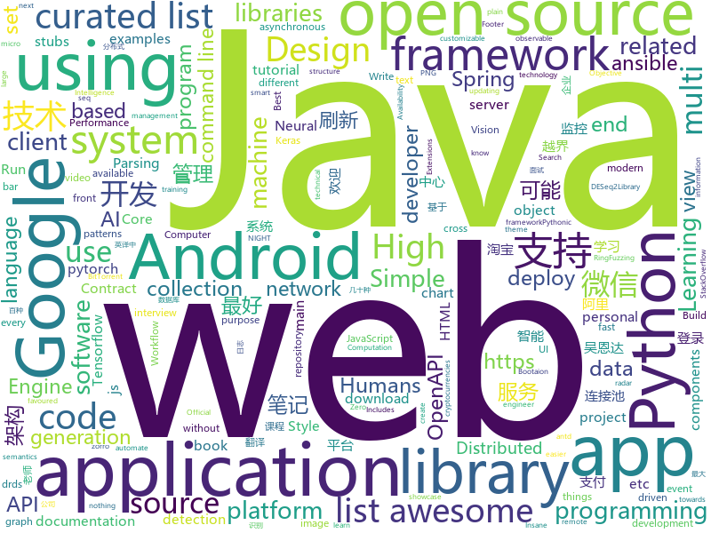

# 2018-05-19
See what the GitHub community is most excited about today.

## python
* [easy-tensorflow](https://github.com/easy-tensorflow/easy-tensorflow)(**399 stars today**): Simple and comprehensive tutorials in TensorFlow
* [Chinese-Word-Vectors](https://github.com/Embedding/Chinese-Word-Vectors)(**183 stars today**): 100+ Chinese Word Vectors 上百种预训练中文词向量
* [edgedb](https://github.com/edgedb/edgedb)(**191 stars today**): The next generation object-relational database.
* [Crunch](https://github.com/chrissimpkins/Crunch)(**163 stars today**): Insane(ly slow but wicked good) PNG image optimization
* [Learning-to-See-in-the-Dark](https://github.com/cchen156/Learning-to-See-in-the-Dark)(**132 stars today**): 
* [models](https://github.com/tensorflow/models)(**75 stars today**): Models and examples built with TensorFlow
* [arl](https://github.com/kaxap/arl)(**94 stars today**): lists of most popular repositories for most favoured programming languages (according to StackOverflow)
* [awesome-python](https://github.com/vinta/awesome-python)(**72 stars today**): A curated list of awesome Python frameworks, libraries, software and resources
* [pipenv](https://github.com/pypa/pipenv)(**55 stars today**): Python Development Workflow for Humans.
* [public-apis](https://github.com/toddmotto/public-apis)(**44 stars today**): A collective list of public JSON APIs for use in web development.
* [keras](https://github.com/keras-team/keras)(**32 stars today**): Deep Learning for humans
* [faceai](https://github.com/vipstone/faceai)(**38 stars today**): 一款优秀的人脸、视频、文字：检测、识别的智能AI项目。
* [ansible](https://github.com/ansible/ansible)(**30 stars today**): Ansible is a radically simple IT automation platform that makes your applications and systems easier to deploy. Avoid writing scripts or custom code to deploy and update your applications — automate in a language that approaches plain English, using SSH, with no agents to install on remote systems. https://docs.ansible.com/ansible/
* [examples](https://github.com/pytorch/examples)(**34 stars today**): A set of examples around pytorch in Vision, Text, Reinforcement Learning, etc.
* [django](https://github.com/django/django)(**34 stars today**): The Web framework for perfectionists with deadlines.
* [tqdm](https://github.com/tqdm/tqdm)(**40 stars today**): A fast, extensible progress bar for Python and CLI
* [system-design-primer](https://github.com/donnemartin/system-design-primer)(**33 stars today**): Learn how to design large-scale systems. Prep for the system design interview. Includes Anki flashcards.
* [youtube-dl](https://github.com/rg3/youtube-dl)(**36 stars today**): Command-line program to download videos from YouTube.com and other video sites
* [flask](https://github.com/pallets/flask)(**34 stars today**): The Python micro framework for building web applications.
* [algo](https://github.com/trailofbits/algo)(**36 stars today**): Set up a personal IPSEC VPN in the cloud
* [Mask_RCNN](https://github.com/matterport/Mask_RCNN)(**28 stars today**): Mask R-CNN for object detection and instance segmentation on Keras and TensorFlow
* [AttGAN-Tensorflow](https://github.com/LynnHo/AttGAN-Tensorflow)(**34 stars today**): AttGAN Tensorflow Arbitrary Facial Attribute Editing: Only Change What You Want
* [scikit-learn](https://github.com/scikit-learn/scikit-learn)(**29 stars today**): scikit-learn: machine learning in Python
* [awesome-machine-learning](https://github.com/josephmisiti/awesome-machine-learning)(**29 stars today**): A curated list of awesome Machine Learning frameworks, libraries and software.
* [you-get](https://github.com/soimort/you-get)(**29 stars today**): ⏬Dumb downloader that scrapes the web

## java
* [bundletool](https://github.com/google/bundletool)(**176 stars today**): 
* [UETool](https://github.com/eleme/UETool)(**135 stars today**): Show/edit any view's attributions on the screen.
* [proxyee-down](https://github.com/monkeyWie/proxyee-down)(**61 stars today**): http下载工具，基于http代理，支持多连接分块下载
* [spring-boot](https://github.com/spring-projects/spring-boot)(**52 stars today**): Spring Boot
* [aion](https://github.com/aionnetwork/aion)(**54 stars today**): aion network
* [halo](https://github.com/ruibaby/halo)(**47 stars today**): Halo可能是最好的Java博客系统😉
* [runelite](https://github.com/runelite/runelite)(**27 stars today**): Open source Old School RuneScape client
* [weixin-java-tools](https://github.com/Wechat-Group/weixin-java-tools)(**42 stars today**): 可能是目前最好最全的微信Java开发工具包，支持包括微信支付、开放平台、小程序、企业号和公众号等的开发
* [java-design-patterns](https://github.com/iluwatar/java-design-patterns)(**41 stars today**): Design patterns implemented in Java
* [zheng](https://github.com/shuzheng/zheng)(**34 stars today**): 基于Spring+SpringMVC+Mybatis分布式敏捷开发系统架构，提供整套公共微服务服务模块：集中权限管理（单点登录）、内容管理、支付中心、用户管理（支持第三方登录）、微信平台、存储系统、配置中心、日志分析、任务和通知等，支持服务治理、监控和追踪，努力为中小型企业打造全方位J2EE企业级开发解决方案。
* [Java-Interview](https://github.com/crossoverJie/Java-Interview)(**36 stars today**): 👨‍🎓Java related : basic, concurrent, algorithm
* [elasticsearch](https://github.com/elastic/elasticsearch)(**34 stars today**): Open Source, Distributed, RESTful Search Engine
* [material-components-android](https://github.com/material-components/material-components-android)(**37 stars today**): Modular and customizable Material Design UI components for Android
* [spring-framework](https://github.com/spring-projects/spring-framework)(**30 stars today**): Spring Framework
* [incubator-dubbo](https://github.com/apache/incubator-dubbo)(**29 stars today**): Apache Dubbo (incubating) is a high-performance, java based, open source RPC framework.
* [SmartRefreshLayout](https://github.com/scwang90/SmartRefreshLayout)(**29 stars today**): 🔥下拉刷新、上拉加载、二级刷新、淘宝二楼、RefreshLayout、OverScroll，Android智能下拉刷新框架，支持越界回弹、越界拖动，具有极强的扩展性，集成了几十种炫酷的Header和 Footer。
* [tutorials](https://github.com/eugenp/tutorials)(**19 stars today**): The "REST With Spring" Course:
* [RxJava](https://github.com/ReactiveX/RxJava)(**28 stars today**): RxJava – Reactive Extensions for the JVM – a library for composing asynchronous and event-based programs using observable sequences for the Java VM.
* [guava](https://github.com/google/guava)(**26 stars today**): Google core libraries for Java
* [AndroidUtilCode](https://github.com/Blankj/AndroidUtilCode)(**29 stars today**): 🔥Android developers should collect the following utils(updating).
* [VirtualXposed](https://github.com/android-hacker/VirtualXposed)(**28 stars today**): A Simple App to use Xposed without root or unlock the bootloader(or modify system image etc).
* [netty](https://github.com/netty/netty)(**24 stars today**): Netty project - an event-driven asynchronous network application framework
* [okhttp](https://github.com/square/okhttp)(**24 stars today**): An HTTP+HTTP/2 client for Android and Java applications.
* [MPAndroidChart](https://github.com/PhilJay/MPAndroidChart)(**22 stars today**): A powerful🚀Android chart view / graph view library, supporting line- bar- pie- radar- bubble- and candlestick charts as well as scaling, dragging and animations.
* [druid](https://github.com/alibaba/druid)(**24 stars today**): ♨️为监控而生的数据库连接池！阿里云DRDS(https://www.aliyun.com/product/drds )、阿里巴巴TDDL 连接池powered by Druid

## unknown
* [build-your-own-x](https://github.com/danistefanovic/build-your-own-x)(**1,682 stars today**): 🤓Build your own (insert technology here)
* [architecture.of.internet-product](https://github.com/davideuler/architecture.of.internet-product)(**373 stars today**): 互联网公司技术架构，微信/淘宝/微博/腾讯/阿里/美团点评/百度/Google/Facebook/Amazon/eBay的架构，欢迎PR补充
* [architect-awesome](https://github.com/xingshaocheng/architect-awesome)(**349 stars today**): 后端架构师技术图谱
* [Interview-Notebook](https://github.com/CyC2018/Interview-Notebook)(**159 stars today**): 📚技术面试需要掌握的基础知识整理，欢迎编辑~
* [night-owl-vscode-theme](https://github.com/sdras/night-owl-vscode-theme)(**92 stars today**): 🌌NIGHT OWL: A VS Code dark theme for contrast for nighttime coding
* [awesome](https://github.com/sindresorhus/awesome)(**83 stars today**): 😎Curated list of awesome lists
* [gitignore](https://github.com/github/gitignore)(**53 stars today**): A collection of useful .gitignore templates
* [You-Dont-Know-JS](https://github.com/getify/You-Dont-Know-JS)(**64 stars today**): A book series on JavaScript. @YDKJS on twitter.
* [Android-IO18](https://github.com/karntrehan/Android-IO18)(**64 stars today**): A summary of all the important Android related launches, talks, discussions at the Google I/O 2018
* [coding-interview-university](https://github.com/jwasham/coding-interview-university)(**50 stars today**): A complete computer science study plan to become a software engineer.
* [every-programmer-should-know](https://github.com/mtdvio/every-programmer-should-know)(**56 stars today**): A collection of (mostly) technical things every software developer should know
* [free-programming-books](https://github.com/EbookFoundation/free-programming-books)(**51 stars today**): 📚Freely available programming books
* [developer-roadmap](https://github.com/kamranahmedse/developer-roadmap)(**55 stars today**): Roadmap to becoming a web developer in 2018
* [awesome-vue](https://github.com/vuejs/awesome-vue)(**50 stars today**): 🎉A curated list of awesome things related to Vue.js
* [awesome-scalability](https://github.com/binhnguyennus/awesome-scalability)(**44 stars today**): High Scalability, High Availability, High Stability, High Performance, and High Intelligence Back-End Design Patterns
* [OWASP-Web-Checklist](https://github.com/0xRadi/OWASP-Web-Checklist)(**36 stars today**): OWASP Web Application Security Testing Checklist
* [forum](https://github.com/getlantern/forum)(**36 stars today**): 蓝灯(Lantern)官方论坛
* [nocode](https://github.com/kelseyhightower/nocode)(**35 stars today**): The best way to write secure and reliable applications. Write nothing; deploy nowhere.
* [Hackintosh-Installer-University](https://github.com/huangyz0918/Hackintosh-Installer-University)(**34 stars today**): open source tutorial & information collector for hackintosh installation.💻➕🍎
* [Front-end-Developer-Interview-Questions](https://github.com/h5bp/Front-end-Developer-Interview-Questions)(**29 stars today**): A list of helpful front-end related questions you can use to interview potential candidates, test yourself or completely ignore.
* [tgik](https://github.com/heptio/tgik)(**32 stars today**): Official repository for Heptio TGIK!
* [android-architecture](https://github.com/googlesamples/android-architecture)(**25 stars today**): A collection of samples to discuss and showcase different architectural tools and patterns for Android apps.
* [awesome-flutter](https://github.com/Solido/awesome-flutter)(**27 stars today**): A curated list of awesome Flutter resources
* [blog](https://github.com/ProtoTeam/blog)(**27 stars today**): 蚂蚁数据体验技术团队的文章仓库
* [gold-miner](https://github.com/xitu/gold-miner)(**26 stars today**): 🥇掘金翻译计划，可能是世界最大最好的英译中技术社区，最懂读者和译者的翻译平台：

## c++
* [tensorflow](https://github.com/tensorflow/tensorflow)(**150 stars today**): Computation using data flow graphs for scalable machine learning
* [rust-qt-binding-generator](https://github.com/KDE/rust-qt-binding-generator)(**176 stars today**): Generate bindings to use Rust code in Qt and QML
* [mud](https://github.com/hugoam/mud)(**125 stars today**): an all-purpose c++ app prototyping library, focused towards live graphical apps and games
* [cve-2018-8120](https://github.com/bigric3/cve-2018-8120)(**65 stars today**): 
* [electron](https://github.com/electron/electron)(**59 stars today**): Build cross platform desktop apps with JavaScript, HTML, and CSS
* [bitcoin](https://github.com/bitcoin/bitcoin)(**50 stars today**): Bitcoin Core integration/staging tree
* [protobuf](https://github.com/google/protobuf)(**48 stars today**): Protocol Buffers - Google's data interchange format
* [PacVim](https://github.com/jmoon018/PacVim)(**52 stars today**): 
* [PhoenixGo](https://github.com/Tencent/PhoenixGo)(**45 stars today**): Go AI program which implement the AlphaGo Zero paper
* [opencv](https://github.com/opencv/opencv)(**34 stars today**): Open Source Computer Vision Library
* [pytorch](https://github.com/pytorch/pytorch)(**41 stars today**): Tensors and Dynamic neural networks in Python with strong GPU acceleration
* [eos](https://github.com/EOSIO/eos)(**40 stars today**): An open source smart contract platform
* [glow](https://github.com/pytorch/glow)(**43 stars today**): Compiler for Neural Network hardware accelerators
* [apollo](https://github.com/ApolloAuto/apollo)(**32 stars today**): An open autonomous driving platform
* [cosmos](https://github.com/OpenGenus/cosmos)(**29 stars today**): Algorithms that run our universe | Your personal library of every algorithm and data structure code that you will ever encounter | Ask us anything at our forum
* [tesseract](https://github.com/tesseract-ocr/tesseract)(**29 stars today**): Tesseract Open Source OCR Engine (main repository)
* [horovod](https://github.com/uber/horovod)(**27 stars today**): Distributed training framework for TensorFlow, Keras, and PyTorch.
* [cppinsights](https://github.com/andreasfertig/cppinsights)(**28 stars today**): C++ Insights - See your source code with the eyes of a compiler
* [xgboost](https://github.com/dmlc/xgboost)(**24 stars today**): Scalable, Portable and Distributed Gradient Boosting (GBDT, GBRT or GBM) Library, for Python, R, Java, Scala, C++ and more. Runs on single machine, Hadoop, Spark, Flink and DataFlow
* [aria2](https://github.com/aria2/aria2)(**25 stars today**): aria2 is a lightweight multi-protocol & multi-source, cross platform download utility operated in command-line. It supports HTTP/HTTPS, FTP, SFTP, BitTorrent and Metalink.
* [solidity](https://github.com/ethereum/solidity)(**20 stars today**): Solidity, the Contract-Oriented Programming Language
* [godot](https://github.com/godotengine/godot)(**20 stars today**): Godot Engine – Multi-platform 2D and 3D game engine
* [openpose](https://github.com/CMU-Perceptual-Computing-Lab/openpose)(**19 stars today**): OpenPose: Real-time multi-person keypoint detection library for body, face, and hands estimation
* [swift](https://github.com/apple/swift)(**19 stars today**): The Swift Programming Language
* [grpc](https://github.com/grpc/grpc)(**16 stars today**): The C based gRPC (C++, Python, Ruby, Objective-C, PHP, C#)

## html
* [Coursera-ML-AndrewNg-Notes](https://github.com/fengdu78/Coursera-ML-AndrewNg-Notes)(**32 stars today**): 吴恩达老师的机器学习课程个人笔记
* [deeplearning_ai_books](https://github.com/fengdu78/deeplearning_ai_books)(**30 stars today**): deeplearning.ai（吴恩达老师的深度学习课程笔记及资源）
* [styleguide](https://github.com/google/styleguide)(**19 stars today**): Style guides for Google-originated open-source projects
* [blog](https://github.com/MuYunyun/blog)(**24 stars today**): 前端笔记
* [go101](https://github.com/go101/go101)(**21 stars today**): A book focusing on Go syntax/semantics and all kinds of details.
* [Spoon-Knife](https://github.com/octocat/Spoon-Knife)(****): This repo is for demonstration purposes only.
* [openapi-generator](https://github.com/OpenAPITools/openapi-generator)(**15 stars today**): OpenAPI Generator allows generation of API client libraries (SDK generation), server stubs, documentation and configuration automatically given an OpenAPI Spec (v2, v3)
* [rna-seq-star-deseq2](https://github.com/snakemake-workflows/rna-seq-star-deseq2)(**16 stars today**): RNA-seq workflow using STAR and DESeq2
* [fastText](https://github.com/facebookresearch/fastText)(**14 stars today**): Library for fast text representation and classification.
* [portainer](https://github.com/portainer/portainer)(**15 stars today**): Simple management UI for Docker
* [swagger-codegen](https://github.com/swagger-api/swagger-codegen)(**11 stars today**): swagger-codegen contains a template-driven engine to generate documentation, API clients and server stubs in different languages by parsing your OpenAPI / Swagger definition.
* [polymer](https://github.com/Polymer/polymer)(**12 stars today**): Build modern apps using web components
* [nodejs-ex](https://github.com/sclorg/nodejs-ex)(****): node.js example
* [fonts](https://github.com/google/fonts)(**9 stars today**): Font files available from Google Fonts
* [kotlinbyexample.github.io](https://github.com/kotlinbyexample/kotlinbyexample.github.io)(**7 stars today**): Kotlin By Example
* [zenbot](https://github.com/DeviaVir/zenbot)(**9 stars today**): Zenbot is a command-line cryptocurrency trading bot using Node.js and MongoDB.
* [react-app-rewired](https://github.com/timarney/react-app-rewired)(**10 stars today**): Override create-react-app webpack configs without ejecting
* [cryptocurrency-icons](https://github.com/cjdowner/cryptocurrency-icons)(**8 stars today**): A set of icons for all the main cryptocurrencies and altcoins, in a range of styles and sizes.
* [WebFundamentals](https://github.com/google/WebFundamentals)(**9 stars today**): Best practices for modern web development
* [ocamlverse.github.io](https://github.com/OCamlverse/ocamlverse.github.io)(**8 stars today**): Documentation of everything relevant in the OCaml world
* [primeng](https://github.com/primefaces/primeng)(**7 stars today**): UI Components for Angular
* [ng-alain](https://github.com/cipchk/ng-alain)(**8 stars today**): ng-zorro-antd admin panel front-end framework
* [requests-html](https://github.com/kennethreitz/requests-html)(**7 stars today**): Pythonic HTML Parsing for Humans™
* [webring](https://github.com/XXIIVV/webring)(**6 stars today**): Just A Web Ring
* [BFuzz](https://github.com/RootUp/BFuzz)(**7 stars today**): Fuzzing Browsers

## WordCloud

