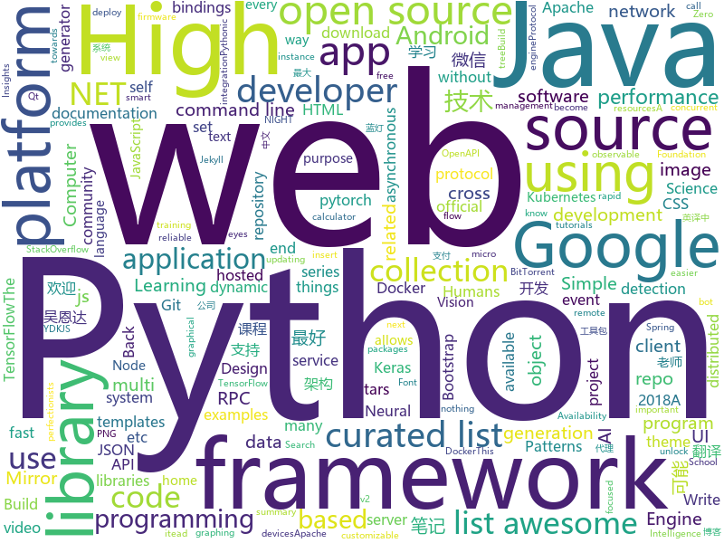

# 2018-05-20
See what the GitHub community is most excited about today.

## python
* [easy-tensorflow](https://github.com/easy-tensorflow/easy-tensorflow)(**398 stars today**): Simple and comprehensive tutorials in TensorFlow
* [Chinese-Word-Vectors](https://github.com/Embedding/Chinese-Word-Vectors)(**80 stars today**): 100+ Chinese Word Vectors 上百种预训练中文词向量
* [models](https://github.com/tensorflow/models)(**66 stars today**): Models and examples built with TensorFlow
* [edgedb](https://github.com/edgedb/edgedb)(**81 stars today**): The next generation object-relational database.
* [Crunch](https://github.com/chrissimpkins/Crunch)(**69 stars today**): Insane(ly slow but wicked good) PNG image optimization
* [awesome-python](https://github.com/vinta/awesome-python)(**39 stars today**): A curated list of awesome Python frameworks, libraries, software and resources
* [keras](https://github.com/keras-team/keras)(**30 stars today**): Deep Learning for humans
* [Learning-to-See-in-the-Dark](https://github.com/cchen156/Learning-to-See-in-the-Dark)(**37 stars today**): 
* [bnn](https://github.com/matpalm/bnn)(**35 stars today**): bee detection conv net for a rasp pi on side of a hive
* [dynaconf](https://github.com/rochacbruno/dynaconf)(**31 stars today**): The dynamic configurator for your Python Project
* [arl](https://github.com/kaxap/arl)(**30 stars today**): lists of most popular repositories for most favoured programming languages (according to StackOverflow)
* [youtube-dl](https://github.com/rg3/youtube-dl)(**28 stars today**): Command-line program to download videos from YouTube.com and other video sites
* [examples](https://github.com/pytorch/examples)(**26 stars today**): A set of examples around pytorch in Vision, Text, Reinforcement Learning, etc.
* [pipenv](https://github.com/pypa/pipenv)(**28 stars today**): Python Development Workflow for Humans.
* [public-apis](https://github.com/toddmotto/public-apis)(**26 stars today**): A collective list of public JSON APIs for use in web development.
* [tqdm](https://github.com/tqdm/tqdm)(**21 stars today**): A fast, extensible progress bar for Python and CLI
* [flask](https://github.com/pallets/flask)(**20 stars today**): The Python micro framework for building web applications.
* [faceai](https://github.com/vipstone/faceai)(**19 stars today**): 一款优秀的人脸、视频、文字：检测、识别的智能AI项目。
* [cpython](https://github.com/python/cpython)(**16 stars today**): The Python programming language
* [Mask_RCNN](https://github.com/matterport/Mask_RCNN)(**17 stars today**): Mask R-CNN for object detection and instance segmentation on Keras and TensorFlow
* [django](https://github.com/django/django)(**15 stars today**): The Web framework for perfectionists with deadlines.
* [deepo](https://github.com/ufoym/deepo)(**19 stars today**): A series of Docker images (and their generator) that allows you to quickly set up your deep learning research environment.
* [home-assistant](https://github.com/home-assistant/home-assistant)(**17 stars today**): 🏡Open-source home automation platform running on Python 3
* [you-get](https://github.com/soimort/you-get)(**16 stars today**): ⏬Dumb downloader that scrapes the web
* [XX-Net](https://github.com/XX-net/XX-Net)(**18 stars today**): a web proxy tool

## java
* [proxyee-down](https://github.com/monkeyWie/proxyee-down)(**63 stars today**): http下载工具，基于http代理，支持多连接分块下载
* [bundletool](https://github.com/google/bundletool)(**56 stars today**): 
* [UETool](https://github.com/eleme/UETool)(**45 stars today**): Show/edit any view's attributions on the screen.
* [runelite](https://github.com/runelite/runelite)(**20 stars today**): Open source Old School RuneScape client
* [spring-boot](https://github.com/spring-projects/spring-boot)(**28 stars today**): Spring Boot
* [Java-Interview](https://github.com/crossoverJie/Java-Interview)(**25 stars today**): 👨‍🎓Java related : basic, concurrent, algorithm
* [java-design-patterns](https://github.com/iluwatar/java-design-patterns)(**23 stars today**): Design patterns implemented in Java
* [para](https://github.com/Erudika/para)(**24 stars today**): Open source back-end server for web, mobile and IoT. The backend for busy developers. (self-hosted or hosted)
* [tutorials](https://github.com/eugenp/tutorials)(**12 stars today**): The "REST With Spring" Course:
* [weixin-java-tools](https://github.com/Wechat-Group/weixin-java-tools)(**20 stars today**): 可能是目前最好最全的微信Java开发工具包，支持包括微信支付、开放平台、小程序、企业号和公众号等的开发
* [material-components-android](https://github.com/material-components/material-components-android)(**20 stars today**): Modular and customizable Material Design UI components for Android
* [spring-framework](https://github.com/spring-projects/spring-framework)(**17 stars today**): Spring Framework
* [elasticsearch](https://github.com/elastic/elasticsearch)(**17 stars today**): Open Source, Distributed, RESTful Search Engine
* [AndroidUtilCode](https://github.com/Blankj/AndroidUtilCode)(**17 stars today**): 🔥Android developers should collect the following utils(updating).
* [netty](https://github.com/netty/netty)(**16 stars today**): Netty project - an event-driven asynchronous network application framework
* [mastalab](https://github.com/stom79/mastalab)(**18 stars today**): Mastalab - Mastodon client for Android devices
* [incubator-dubbo](https://github.com/apache/incubator-dubbo)(**12 stars today**): Apache Dubbo (incubating) is a high-performance, java based, open source RPC framework.
* [hadoop](https://github.com/apache/hadoop)(**15 stars today**): Mirror of Apache Hadoop
* [halo](https://github.com/ruibaby/halo)(**14 stars today**): Halo可能是最好的Java博客系统😉
* [okhttp](https://github.com/square/okhttp)(**12 stars today**): An HTTP+HTTP/2 client for Android and Java applications.
* [VirtualXposed](https://github.com/android-hacker/VirtualXposed)(**13 stars today**): A Simple App to use Xposed without root or unlock the bootloader(or modify system image etc).
* [kafka](https://github.com/apache/kafka)(**10 stars today**): Mirror of Apache Kafka
* [quickstart-android](https://github.com/firebase/quickstart-android)(**10 stars today**): Firebase Quickstart Samples for Android
* [RxJava](https://github.com/ReactiveX/RxJava)(**11 stars today**): RxJava – Reactive Extensions for the JVM – a library for composing asynchronous and event-based programs using observable sequences for the Java VM.
* [motan](https://github.com/weibocom/motan)(**11 stars today**): A cross-language remote procedure call(RPC) framework for rapid development of high performance distributed services.

## unknown
* [build-your-own-x](https://github.com/danistefanovic/build-your-own-x)(**841 stars today**): 🤓Build your own (insert technology here)
* [architecture.of.internet-product](https://github.com/davideuler/architecture.of.internet-product)(**181 stars today**): 互联网公司技术架构，微信/淘宝/微博/腾讯/阿里/美团点评/百度/Google/Facebook/Amazon/eBay的架构，欢迎PR补充
* [architect-awesome](https://github.com/xingshaocheng/architect-awesome)(**174 stars today**): 后端架构师技术图谱
* [Interview-Notebook](https://github.com/CyC2018/Interview-Notebook)(**109 stars today**): 📚技术面试需要掌握的基础知识整理，欢迎编辑~
* [computer-science](https://github.com/ossu/computer-science)(**69 stars today**): 🎓Path to a free self-taught education in Computer Science!
* [awesome](https://github.com/sindresorhus/awesome)(**57 stars today**): 😎Curated list of awesome lists
* [developer-roadmap](https://github.com/kamranahmedse/developer-roadmap)(**44 stars today**): Roadmap to becoming a web developer in 2018
* [gitignore](https://github.com/github/gitignore)(**28 stars today**): A collection of useful .gitignore templates
* [You-Dont-Know-JS](https://github.com/getify/You-Dont-Know-JS)(**40 stars today**): A book series on JavaScript. @YDKJS on twitter.
* [kubernetes-the-hard-way](https://github.com/kelseyhightower/kubernetes-the-hard-way)(**40 stars today**): Bootstrap Kubernetes the hard way on Google Cloud Platform. No scripts.
* [free-programming-books](https://github.com/EbookFoundation/free-programming-books)(**34 stars today**): 📚Freely available programming books
* [coding-interview-university](https://github.com/jwasham/coding-interview-university)(**31 stars today**): A complete computer science study plan to become a software engineer.
* [awesome-scalability](https://github.com/binhnguyennus/awesome-scalability)(**35 stars today**): High Scalability, High Availability, High Stability, High Performance, and High Intelligence Back-End Design Patterns
* [night-owl-vscode-theme](https://github.com/sdras/night-owl-vscode-theme)(**34 stars today**): 🌌NIGHT OWL: A VS Code dark theme for contrast for nighttime coding
* [awesome-vue](https://github.com/vuejs/awesome-vue)(**30 stars today**): 🎉A curated list of awesome things related to Vue.js
* [forum](https://github.com/getlantern/forum)(**23 stars today**): 蓝灯(Lantern)官方论坛
* [awesome-flutter](https://github.com/Solido/awesome-flutter)(**23 stars today**): A curated list of awesome Flutter resources
* [p1xt-guides](https://github.com/P1xt/p1xt-guides)(**22 stars today**): Programming curricula
* [gold-miner](https://github.com/xitu/gold-miner)(**20 stars today**): 🥇掘金翻译计划，可能是世界最大最好的英译中技术社区，最懂读者和译者的翻译平台：
* [awesome-nodejs](https://github.com/sindresorhus/awesome-nodejs)(**20 stars today**): ⚡️Delightful Node.js packages and resources
* [every-programmer-should-know](https://github.com/mtdvio/every-programmer-should-know)(**19 stars today**): A collection of (mostly) technical things every software developer should know
* [awesome-docker](https://github.com/veggiemonk/awesome-docker)(**19 stars today**): 🐳A curated list of Docker resources and projects
* [Android-IO18](https://github.com/karntrehan/Android-IO18)(**19 stars today**): A summary of all the important Android related launches, talks, discussions at the Google I/O 2018
* [css-protips](https://github.com/AllThingsSmitty/css-protips)(**18 stars today**): A collection of tips to help take your CSS skills pro
* [nocode](https://github.com/kelseyhightower/nocode)(**18 stars today**): The best way to write secure and reliable applications. Write nothing; deploy nowhere.

## c++
* [mud](https://github.com/hugoam/mud)(**231 stars today**): an all-purpose c++ app prototyping library, focused towards live graphical apps and games
* [tensorflow](https://github.com/tensorflow/tensorflow)(**128 stars today**): Computation using data flow graphs for scalable machine learning
* [rust-qt-binding-generator](https://github.com/KDE/rust-qt-binding-generator)(**60 stars today**): Generate bindings to use Rust code in Qt and QML
* [epsilon](https://github.com/numworks/epsilon)(**51 stars today**): Modern graphing calculator operating system.
* [Tars](https://github.com/Tencent/Tars)(**46 stars today**): Tars is a highly performance rpc framework based on naming service using tars protocol and provides a semi-automatic operation platform.
* [bitcoin](https://github.com/bitcoin/bitcoin)(**32 stars today**): Bitcoin Core integration/staging tree
* [electron](https://github.com/electron/electron)(**38 stars today**): Build cross platform desktop apps with JavaScript, HTML, and CSS
* [eos](https://github.com/EOSIO/eos)(**27 stars today**): An open source smart contract platform
* [pytorch](https://github.com/pytorch/pytorch)(**29 stars today**): Tensors and Dynamic neural networks in Python with strong GPU acceleration
* [opencv](https://github.com/opencv/opencv)(**19 stars today**): Open Source Computer Vision Library
* [PhoenixGo](https://github.com/Tencent/PhoenixGo)(**20 stars today**): Go AI program which implement the AlphaGo Zero paper
* [tesseract](https://github.com/tesseract-ocr/tesseract)(**18 stars today**): Tesseract Open Source OCR Engine (main repository)
* [godot](https://github.com/godotengine/godot)(**19 stars today**): Godot Engine – Multi-platform 2D and 3D game engine
* [protobuf](https://github.com/google/protobuf)(**17 stars today**): Protocol Buffers - Google's data interchange format
* [cosmos](https://github.com/OpenGenus/cosmos)(**18 stars today**): Algorithms that run our universe | Your personal library of every algorithm and data structure code that you will ever encounter | Ask us anything at our forum
* [horovod](https://github.com/uber/horovod)(**16 stars today**): Distributed training framework for TensorFlow, Keras, and PyTorch.
* [swift](https://github.com/apple/swift)(**13 stars today**): The Swift Programming Language
* [libui-node](https://github.com/parro-it/libui-node)(**16 stars today**): Node bindings for libui, an awesome native UI library for Unix, OSX and Windows
* [PacVim](https://github.com/jmoon018/PacVim)(**16 stars today**): 
* [glow](https://github.com/pytorch/glow)(**16 stars today**): Compiler for Neural Network hardware accelerators
* [apollo](https://github.com/ApolloAuto/apollo)(**14 stars today**): An open autonomous driving platform
* [Sonoff-Tasmota](https://github.com/arendst/Sonoff-Tasmota)(**15 stars today**): Provide ESP8266 based itead Sonoff with Web, MQTT and OTA firmware using Arduino IDE or PlatformIO
* [aria2](https://github.com/aria2/aria2)(**14 stars today**): aria2 is a lightweight multi-protocol & multi-source, cross platform download utility operated in command-line. It supports HTTP/HTTPS, FTP, SFTP, BitTorrent and Metalink.
* [v8](https://github.com/v8/v8)(**13 stars today**): The official mirror of the V8 Git repository
* [cppinsights](https://github.com/andreasfertig/cppinsights)(**12 stars today**): C++ Insights - See your source code with the eyes of a compiler

## html
* [Coursera-ML-AndrewNg-Notes](https://github.com/fengdu78/Coursera-ML-AndrewNg-Notes)(**24 stars today**): 吴恩达老师的机器学习课程个人笔记
* [blog](https://github.com/MuYunyun/blog)(**22 stars today**): 前端笔记
* [deeplearning_ai_books](https://github.com/fengdu78/deeplearning_ai_books)(**15 stars today**): deeplearning.ai（吴恩达老师的深度学习课程笔记及资源）
* [fastText](https://github.com/facebookresearch/fastText)(**18 stars today**): Library for fast text representation and classification.
* [polymer](https://github.com/Polymer/polymer)(**11 stars today**): Build modern apps using web components
* [styleguide](https://github.com/google/styleguide)(**10 stars today**): Style guides for Google-originated open-source projects
* [openapi-generator](https://github.com/OpenAPITools/openapi-generator)(**9 stars today**): OpenAPI Generator allows generation of API client libraries (SDK generation), server stubs, documentation and configuration automatically given an OpenAPI Spec (v2, v3)
* [portainer](https://github.com/portainer/portainer)(**8 stars today**): Simple management UI for Docker
* [dotnet](https://github.com/Microsoft/dotnet)(**9 stars today**): This repo is the official home of .NET on GitHub. It's a great starting point to find many .NET OSS projects from Microsoft and the community, including many that are part of the .NET Foundation.
* [react-app-rewired](https://github.com/timarney/react-app-rewired)(**9 stars today**): Override create-react-app webpack configs without ejecting
* [Spoon-Knife](https://github.com/octocat/Spoon-Knife)(****): This repo is for demonstration purposes only.
* [EIPs](https://github.com/ethereum/EIPs)(**8 stars today**): The Ethereum Improvement Proposal repository
* [gson](https://github.com/google/gson)(**7 stars today**): A Java serialization/deserialization library to convert Java Objects into JSON and back
* [articles](https://github.com/noahlam/articles)(**7 stars today**): 
* [zenbot](https://github.com/DeviaVir/zenbot)(**6 stars today**): Zenbot is a command-line cryptocurrency trading bot using Node.js and MongoDB.
* [fonts](https://github.com/google/fonts)(**5 stars today**): Font files available from Google Fonts
* [dashboards](https://github.com/keen/dashboards)(**5 stars today**): Responsive dashboard templates for Bootstrap📊✨
* [flag-icon-css](https://github.com/lipis/flag-icon-css)(**6 stars today**): 🎏A collection of all country flags in SVG — plus the CSS for easier integration
* [requests-html](https://github.com/kennethreitz/requests-html)(**5 stars today**): Pythonic HTML Parsing for Humans™
* [frontend](https://github.com/guardian/frontend)(**5 stars today**): Source for theguardian.com
* [patchwork](https://github.com/jlord/patchwork)(****): All the Git-it Workshop completers!
* [website](https://github.com/kubernetes/website)(****): Kubernetes website and documentation repo:
* [devdocs](https://github.com/magento/devdocs)(****): Magento Developer Documentation
* [roll20-character-sheets](https://github.com/Roll20/roll20-character-sheets)(****): Character sheet templates created by the community for use in Roll20.
* [mzlogin.github.io](https://github.com/mzlogin/mzlogin.github.io)(****): 🙊My Blog / Jekyll Themes

## WordCloud

