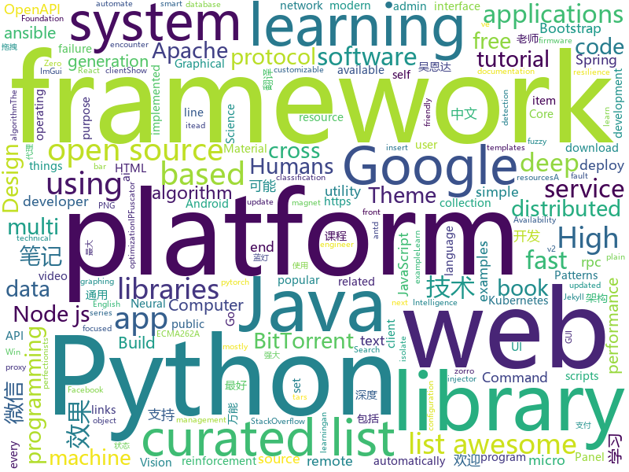

# 2018-05-21
See what the GitHub community is most excited about today.

## python
* [easy-tensorflow](https://github.com/easy-tensorflow/easy-tensorflow)(**237 stars today**): Simple and comprehensive tutorials in TensorFlow
* [edgedb](https://github.com/edgedb/edgedb)(**141 stars today**): The next generation object-relational database.
* [models](https://github.com/tensorflow/models)(**55 stars today**): Models and examples built with TensorFlow
* [awesome-python](https://github.com/vinta/awesome-python)(**44 stars today**): A curated list of awesome Python frameworks, libraries, software and resources
* [public-apis](https://github.com/toddmotto/public-apis)(**46 stars today**): A collective list of public JSON APIs for use in web development.
* [Chinese-Word-Vectors](https://github.com/Embedding/Chinese-Word-Vectors)(**43 stars today**): 100+ Chinese Word Vectors 上百种预训练中文词向量
* [angr](https://github.com/angr/angr)(**45 stars today**): A powerful and user-friendly binary analysis platform!
* [scikit-learn](https://github.com/scikit-learn/scikit-learn)(**32 stars today**): scikit-learn: machine learning in Python
* [pipenv](https://github.com/pypa/pipenv)(**32 stars today**): Python Development Workflow for Humans.
* [youtube-dl](https://github.com/rg3/youtube-dl)(**29 stars today**): Command-line program to download videos from YouTube.com and other video sites
* [dedupe](https://github.com/dedupeio/dedupe)(**33 stars today**): 🆔A python library for accurate and scaleable fuzzy matching, record deduplication and entity-resolution.
* [django](https://github.com/django/django)(**23 stars today**): The Web framework for perfectionists with deadlines.
* [flask](https://github.com/pallets/flask)(**26 stars today**): The Python micro framework for building web applications.
* [keras](https://github.com/keras-team/keras)(**25 stars today**): Deep Learning for humans
* [requests](https://github.com/requests/requests)(**27 stars today**): Python HTTP Requests for Humans™✨🍰✨
* [ubelt](https://github.com/Erotemic/ubelt)(**26 stars today**): A Python utility belt. Extra batteries included!
* [Crunch](https://github.com/chrissimpkins/Crunch)(**25 stars today**): Insane(ly slow but wicked good) PNG image optimization
* [IPFuscator](https://github.com/vysec/IPFuscator)(**25 stars today**): IPFuscator - A tool to automatically generate alternative IP representations
* [awesome-machine-learning](https://github.com/josephmisiti/awesome-machine-learning)(**20 stars today**): A curated list of awesome Machine Learning frameworks, libraries and software.
* [examples](https://github.com/pytorch/examples)(**20 stars today**): A set of examples around pytorch in Vision, Text, Reinforcement Learning, etc.
* [tqdm](https://github.com/tqdm/tqdm)(**21 stars today**): A fast, extensible progress bar for Python and CLI
* [gym](https://github.com/openai/gym)(**17 stars today**): A toolkit for developing and comparing reinforcement learning algorithms.
* [XX-Net](https://github.com/XX-net/XX-Net)(**19 stars today**): a web proxy tool
* [arl](https://github.com/kaxap/arl)(**19 stars today**): lists of most popular repositories for most favoured programming languages (according to StackOverflow)
* [ansible](https://github.com/ansible/ansible)(**13 stars today**): Ansible is a radically simple IT automation platform that makes your applications and systems easier to deploy. Avoid writing scripts or custom code to deploy and update your applications — automate in a language that approaches plain English, using SSH, with no agents to install on remote systems. https://docs.ansible.com/ansible/

## java
* [proxyee-down](https://github.com/monkeyWie/proxyee-down)(**41 stars today**): http下载工具，基于http代理，支持多连接分块下载
* [spring-boot](https://github.com/spring-projects/spring-boot)(**38 stars today**): Spring Boot
* [java-design-patterns](https://github.com/iluwatar/java-design-patterns)(**25 stars today**): Design patterns implemented in Java
* [spring-framework](https://github.com/spring-projects/spring-framework)(**24 stars today**): Spring Framework
* [Java-Interview](https://github.com/crossoverJie/Java-Interview)(**24 stars today**): 👨‍🎓Java related : basic, concurrent, algorithm
* [tutorials](https://github.com/eugenp/tutorials)(**15 stars today**): The "REST With Spring" Course:
* [runelite](https://github.com/runelite/runelite)(**11 stars today**): Open source Old School RuneScape client
* [UETool](https://github.com/eleme/UETool)(**22 stars today**): Show/edit any view's attributions on the screen.
* [weixin-java-tools](https://github.com/Wechat-Group/weixin-java-tools)(**19 stars today**): 可能是目前最好最全的微信Java开发工具包，支持包括微信支付、开放平台、小程序、企业号和公众号等的开发
* [bundletool](https://github.com/google/bundletool)(**19 stars today**): 
* [elasticsearch](https://github.com/elastic/elasticsearch)(**15 stars today**): Open Source, Distributed, RESTful Search Engine
* [kafka](https://github.com/apache/kafka)(**13 stars today**): Mirror of Apache Kafka
* [hadoop](https://github.com/apache/hadoop)(**12 stars today**): Mirror of Apache Hadoop
* [Hystrix](https://github.com/Netflix/Hystrix)(**15 stars today**): Hystrix is a latency and fault tolerance library designed to isolate points of access to remote systems, services and 3rd party libraries, stop cascading failure and enable resilience in complex distributed systems where failure is inevitable.
* [bt](https://github.com/atomashpolskiy/bt)(**13 stars today**): Java BitTorrent library with DHT, magnet links, encryption and more
* [Java](https://github.com/TheAlgorithms/Java)(**12 stars today**): All Algorithms implemented in Java
* [okhttp](https://github.com/square/okhttp)(**13 stars today**): An HTTP+HTTP/2 client for Android and Java applications.
* [SSM](https://github.com/crossoverJie/SSM)(**14 stars today**): 💕build SSM from 0 👉🏽👉🏽 distributed micro service.
* [EasyXRecyclerView](https://github.com/zhou-you/EasyXRecyclerView)(**13 stars today**): 主要提供了简单易用强大的RecyclerView库，包括自定义刷新加载效果、极简通用的万能适配器Adapter、万能分割线、多种分组效果、常见状态页面、item动画效果、添加多个header和footer、侧滑、拖拽、Sticky（黏性）效果、多item布局等,各模块之间灵活、解耦、通用、又能相互组合使用。
* [incubator-dubbo](https://github.com/apache/incubator-dubbo)(**9 stars today**): Apache Dubbo (incubating) is a high-performance, java based, open source RPC framework.
* [material-components-android](https://github.com/material-components/material-components-android)(**11 stars today**): Modular and customizable Material Design UI components for Android
* [quickstart-android](https://github.com/firebase/quickstart-android)(**11 stars today**): Firebase Quickstart Samples for Android
* [dagger](https://github.com/google/dagger)(**12 stars today**): A fast dependency injector for Android and Java.
* [nomulus](https://github.com/google/nomulus)(**12 stars today**): Top-level domain name registry service on Google App Engine
* [guava](https://github.com/google/guava)(**11 stars today**): Google core libraries for Java

## unknown
* [build-your-own-x](https://github.com/danistefanovic/build-your-own-x)(**730 stars today**): 🤓Build your own (insert technology here)
* [architect-awesome](https://github.com/xingshaocheng/architect-awesome)(**218 stars today**): 后端架构师技术图谱
* [awesome-docker](https://github.com/veggiemonk/awesome-docker)(**197 stars today**): 🐳A curated list of Docker resources and projects
* [architecture.of.internet-product](https://github.com/davideuler/architecture.of.internet-product)(**117 stars today**): 互联网公司技术架构，微信/淘宝/微博/腾讯/阿里/美团点评/百度/Google/Facebook/Amazon/eBay的架构，欢迎PR补充
* [computer-science](https://github.com/ossu/computer-science)(**116 stars today**): 🎓Path to a free self-taught education in Computer Science!
* [Interview-Notebook](https://github.com/CyC2018/Interview-Notebook)(**85 stars today**): 📚技术面试需要掌握的基础知识整理，欢迎编辑~
* [p1xt-guides](https://github.com/P1xt/p1xt-guides)(**76 stars today**): Programming curricula
* [developer-roadmap](https://github.com/kamranahmedse/developer-roadmap)(**54 stars today**): Roadmap to becoming a web developer in 2018
* [awesome](https://github.com/sindresorhus/awesome)(**46 stars today**): 😎Curated list of awesome lists
* [You-Dont-Know-JS](https://github.com/getify/You-Dont-Know-JS)(**39 stars today**): A book series on JavaScript. @YDKJS on twitter.
* [coding-interview-university](https://github.com/jwasham/coding-interview-university)(**38 stars today**): A complete computer science study plan to become a software engineer.
* [gitignore](https://github.com/github/gitignore)(**34 stars today**): A collection of useful .gitignore templates
* [free-programming-books](https://github.com/EbookFoundation/free-programming-books)(**36 stars today**): 📚Freely available programming books
* [night-owl-vscode-theme](https://github.com/sdras/night-owl-vscode-theme)(**40 stars today**): 🌌NIGHT OWL: A VS Code dark theme for contrast for nighttime coding
* [awesome-scalability](https://github.com/binhnguyennus/awesome-scalability)(**31 stars today**): High Scalability, High Availability, High Stability, High Performance, and High Intelligence Back-End Design Patterns
* [awesome-vue](https://github.com/vuejs/awesome-vue)(**32 stars today**): 🎉A curated list of awesome things related to Vue.js
* [choerodon](https://github.com/choerodon/choerodon)(**27 stars today**): The open source PaaS for Kubernetes.
* [kubernetes-the-hard-way](https://github.com/kelseyhightower/kubernetes-the-hard-way)(**28 stars today**): Bootstrap Kubernetes the hard way on Google Cloud Platform. No scripts.
* [awesome-flutter](https://github.com/Solido/awesome-flutter)(**28 stars today**): A curated list of awesome Flutter resources
* [trackerslist](https://github.com/ngosang/trackerslist)(**26 stars today**): An updated list of public BitTorrent trackers
* [awesome-eli5](https://github.com/swapagarwal/awesome-eli5)(**26 stars today**): 👶Tech "explained" Like you're Five! git.io/eli5
* [forum](https://github.com/getlantern/forum)(**20 stars today**): 蓝灯(Lantern)官方论坛
* [gold-miner](https://github.com/xitu/gold-miner)(**17 stars today**): 🥇掘金翻译计划，可能是世界最大最好的英译中技术社区，最懂读者和译者的翻译平台：
* [react-redux-links](https://github.com/markerikson/react-redux-links)(**19 stars today**): Curated tutorial and resource links I've collected on React, Redux, ES6, and more
* [every-programmer-should-know](https://github.com/mtdvio/every-programmer-should-know)(**18 stars today**): A collection of (mostly) technical things every software developer should know

## c++
* [tensorflow](https://github.com/tensorflow/tensorflow)(**90 stars today**): Computation using data flow graphs for scalable machine learning
* [mud](https://github.com/hugoam/mud)(**86 stars today**): an all-purpose c++ app prototyping library, focused towards live graphical apps and games
* [sakura](https://github.com/sakura-editor/sakura)(**42 stars today**): SourceForgeからの移行検証中。VS2017ビルド確認済。
* [pytorch](https://github.com/pytorch/pytorch)(**31 stars today**): Tensors and Dynamic neural networks in Python with strong GPU acceleration
* [opencv](https://github.com/opencv/opencv)(**22 stars today**): Open Source Computer Vision Library
* [electron](https://github.com/electron/electron)(**29 stars today**): Build cross platform desktop apps with JavaScript, HTML, and CSS
* [cosmos](https://github.com/OpenGenus/cosmos)(**27 stars today**): Algorithms that run our universe | Your personal library of every algorithm and data structure code that you will ever encounter | Ask us anything at our forum
* [bitcoin](https://github.com/bitcoin/bitcoin)(**20 stars today**): Bitcoin Core integration/staging tree
* [Tars](https://github.com/Tencent/Tars)(**22 stars today**): Tars is a highly performance rpc framework based on naming service using tars protocol and provides a semi-automatic operation platform.
* [epsilon](https://github.com/numworks/epsilon)(**22 stars today**): Modern graphing calculator operating system.
* [eos](https://github.com/EOSIO/eos)(**19 stars today**): An open source smart contract platform
* [aria2](https://github.com/aria2/aria2)(**20 stars today**): aria2 is a lightweight multi-protocol & multi-source, cross platform download utility operated in command-line. It supports HTTP/HTTPS, FTP, SFTP, BitTorrent and Metalink.
* [CVE-2018-8120](https://github.com/unamer/CVE-2018-8120)(**17 stars today**): CVE-2018-8120 Windows LPE exploit
* [plaidml](https://github.com/plaidml/plaidml)(**19 stars today**): PlaidML is a framework for making deep learning work everywhere.
* [grpc](https://github.com/grpc/grpc)(**17 stars today**): The C based gRPC (C++, Python, Ruby, Objective-C, PHP, C#)
* [yue](https://github.com/yue/yue)(**18 stars today**): A library for creating native cross-platform GUI apps
* [osquery](https://github.com/facebook/osquery)(**17 stars today**): SQL powered operating system instrumentation, monitoring, and analytics.
* [PacVim](https://github.com/jmoon018/PacVim)(**17 stars today**): 
* [protobuf](https://github.com/google/protobuf)(**16 stars today**): Protocol Buffers - Google's data interchange format
* [Sonoff-Tasmota](https://github.com/arendst/Sonoff-Tasmota)(**13 stars today**): Provide ESP8266 based itead Sonoff with Web, MQTT and OTA firmware using Arduino IDE or PlatformIO
* [caffe](https://github.com/BVLC/caffe)(**12 stars today**): Caffe: a fast open framework for deep learning.
* [PhoenixGo](https://github.com/Tencent/PhoenixGo)(**13 stars today**): Go AI program which implement the AlphaGo Zero paper
* [imgui](https://github.com/ocornut/imgui)(**13 stars today**): Dear ImGui: Bloat-free Immediate Mode Graphical User interface for C++ with minimal dependencies
* [ELF](https://github.com/pytorch/ELF)(**13 stars today**): ELF: a platform for game research
* [openpose](https://github.com/CMU-Perceptual-Computing-Lab/openpose)(**11 stars today**): OpenPose: Real-time multi-person keypoint detection library for body, face, and hands estimation

## html
* [Coursera-ML-AndrewNg-Notes](https://github.com/fengdu78/Coursera-ML-AndrewNg-Notes)(**30 stars today**): 吴恩达老师的机器学习课程个人笔记
* [deeplearning_ai_books](https://github.com/fengdu78/deeplearning_ai_books)(**28 stars today**): deeplearning.ai（吴恩达老师的深度学习课程笔记及资源）
* [Spoon-Knife](https://github.com/octocat/Spoon-Knife)(****): This repo is for demonstration purposes only.
* [Minimus](https://github.com/hamedbaatour/Minimus)(**16 stars today**): A fully featured production ready Angular 6 weather app tutorial project
* [AdminLTE](https://github.com/almasaeed2010/AdminLTE)(**13 stars today**): AdminLTE - Free Premium Admin control Panel Theme Based On Bootstrap 3.x
* [blog](https://github.com/MuYunyun/blog)(**12 stars today**): 前端笔记
* [styleguide](https://github.com/google/styleguide)(**9 stars today**): Style guides for Google-originated open-source projects
* [portainer](https://github.com/portainer/portainer)(**7 stars today**): Simple management UI for Docker
* [fonts](https://github.com/google/fonts)(**6 stars today**): Font files available from Google Fonts
* [requests-html](https://github.com/kennethreitz/requests-html)(**6 stars today**): Pythonic HTML Parsing for Humans™
* [ng-alain](https://github.com/cipchk/ng-alain)(**6 stars today**): ng-zorro-antd admin panel front-end framework
* [fastText](https://github.com/facebookresearch/fastText)(**6 stars today**): Library for fast text representation and classification.
* [ecma262](https://github.com/tc39/ecma262)(**6 stars today**): Status, process, and documents for ECMA262
* [go101](https://github.com/go101/go101)(**6 stars today**): A book focusing on Go syntax/semantics and all kinds of details.
* [openapi-generator](https://github.com/OpenAPITools/openapi-generator)(**5 stars today**): OpenAPI Generator allows generation of API client libraries (SDK generation), server stubs, documentation and configuration automatically given an OpenAPI Spec (v2, v3)
* [nodejs-ex](https://github.com/sclorg/nodejs-ex)(****): node.js example
* [learnyounode](https://github.com/workshopper/learnyounode)(**5 stars today**): Learn You The Node.js For Much Win! An intro to Node.js via a set of self-guided workshops.
* [polymer](https://github.com/Polymer/polymer)(**5 stars today**): Build modern apps using web components
* [simple-icons](https://github.com/simple-icons/simple-icons)(**5 stars today**): SVG icons for popular brands
* [nndl.github.io](https://github.com/nndl/nndl.github.io)(**5 stars today**): 《神经网络与深度学习》 Neural Network and Deep Learning
* [MobX-Docs-CN](https://github.com/SangKa/MobX-Docs-CN)(**5 stars today**): MobX 中文文档
* [altair](https://github.com/vegawidget/altair)(**5 stars today**): R interface to 'Altair'
* [qiubaiying.github.io](https://github.com/qiubaiying/qiubaiying.github.io)(****): BY Blog ->
* [jekyll-material-theme](https://github.com/jameshamann/jekyll-material-theme)(****): A Jekyll Theme based on Material Design using Materialize.
* [ethereum-org](https://github.com/ethereum/ethereum-org)(****): Ethereum Foundation website

## WordCloud

