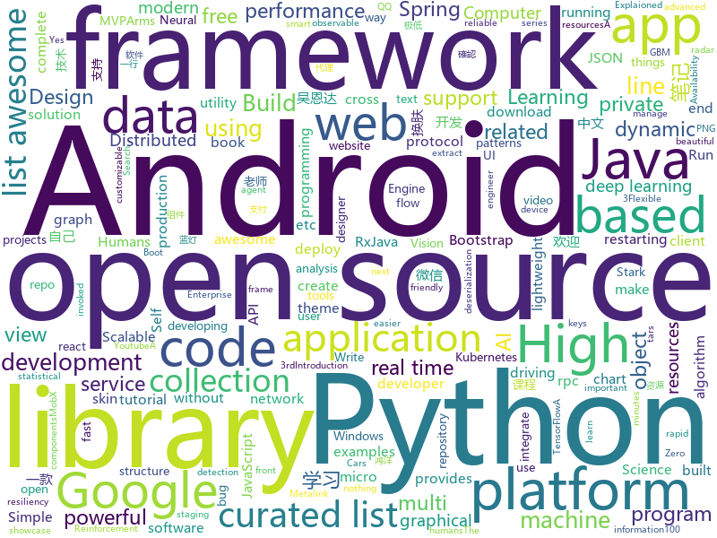

# 2018-05-22
See what the GitHub community is most excited about today.

## python
* [youCanCodeAGif](https://github.com/1-Sisyphe/youCanCodeAGif)(**400 stars today**): Can you make an High Quality Gif from A to Z only by coding? Yes. Do you want to, though?
* [easy-tensorflow](https://github.com/easy-tensorflow/easy-tensorflow)(**255 stars today**): Simple and comprehensive tutorials in TensorFlow
* [angr](https://github.com/angr/angr)(**181 stars today**): A powerful and user-friendly binary analysis platform!
* [models](https://github.com/tensorflow/models)(**66 stars today**): Models and examples built with TensorFlow
* [chirp](https://github.com/9b/chirp)(**89 stars today**): Interface to manage and centralize Google Alert information
* [Chinese-Word-Vectors](https://github.com/Embedding/Chinese-Word-Vectors)(**74 stars today**): 100+ Chinese Word Vectors 上百种预训练中文词向量
* [keras](https://github.com/keras-team/keras)(**60 stars today**): Deep Learning for humans
* [edgedb](https://github.com/edgedb/edgedb)(**68 stars today**): The next generation object-relational database.
* [awesome-python](https://github.com/vinta/awesome-python)(**57 stars today**): A curated list of awesome Python frameworks, libraries, software and resources
* [Learning-to-See-in-the-Dark](https://github.com/cchen156/Learning-to-See-in-the-Dark)(**56 stars today**): 
* [public-apis](https://github.com/toddmotto/public-apis)(**52 stars today**): A collective list of public JSON APIs for use in web development.
* [windows_sshagent_extract](https://github.com/ropnop/windows_sshagent_extract)(**47 stars today**): PoC code to extract private keys from Windows 10's built in ssh-agent service
* [youtube-dl](https://github.com/rg3/youtube-dl)(**40 stars today**): Command-line program to download videos from YouTube.com and other video sites
* [Crunch](https://github.com/chrissimpkins/Crunch)(**43 stars today**): Insane(ly slow but wicked good) PNG image optimization
* [ubelt](https://github.com/Erotemic/ubelt)(**40 stars today**): A Python utility belt. Extra batteries included!
* [pipenv](https://github.com/pypa/pipenv)(**38 stars today**): Python Development Workflow for Humans.
* [django](https://github.com/django/django)(**28 stars today**): The Web framework for perfectionists with deadlines.
* [SRGAN_Wasserstein](https://github.com/JustinhoCHN/SRGAN_Wasserstein)(**31 stars today**): Apply Waseerstein GAN into SRGAN, a deep learning super resolution model
* [flask](https://github.com/pallets/flask)(**31 stars today**): The Python micro framework for building web applications.
* [self_driving_cars_explained](https://github.com/llSourcell/self_driving_cars_explained)(**30 stars today**): This is the code for "Self Driving Cars Explaioned" by Siraj Raval on Youtube
* [examples](https://github.com/pytorch/examples)(**27 stars today**): A set of examples around pytorch in Vision, Text, Reinforcement Learning, etc.
* [scikit-learn](https://github.com/scikit-learn/scikit-learn)(**29 stars today**): scikit-learn: machine learning in Python
* [home-assistant](https://github.com/home-assistant/home-assistant)(**29 stars today**): 🏡Open-source home automation platform running on Python 3
* [pandas](https://github.com/pandas-dev/pandas)(**23 stars today**): Flexible and powerful data analysis / manipulation library for Python, providing labeled data structures similar to R data.frame objects, statistical functions, and much more
* [requests](https://github.com/requests/requests)(**24 stars today**): Python HTTP Requests for Humans™✨🍰✨

## java
* [UETool](https://github.com/eleme/UETool)(**170 stars today**): Show/edit any view's attributions on the screen.
* [ArmsComponent](https://github.com/JessYanCoding/ArmsComponent)(**88 stars today**): A complete android componentization solution, powered by MVPArms (MVPArms 官方快速组件化方案).
* [Stark](https://github.com/ximsfei/Stark)(**74 stars today**): Stark is a hot-fix framework for Android. It supports swapping new implementations of classes without restarting a running Android application, and updated Android resources (icons, layout, etc) while only restarting the Android Activity. Most importantly, there is no private API invoked in Stark.
* [proxyee-down](https://github.com/monkeyWie/proxyee-down)(**68 stars today**): http下载工具，基于http代理，支持多连接分块下载
* [MVPArms](https://github.com/JessYanCoding/MVPArms)(**62 stars today**): A common architecture for Android applications developing based on MVP, integrates many open source projects (like Dagger2、Rxjava、Retrofit ...), to make your developing quicker and easier.
* [spring-boot](https://github.com/spring-projects/spring-boot)(**48 stars today**): Spring Boot
* [MeiWidgetView](https://github.com/HpWens/MeiWidgetView)(**58 stars today**): 一款汇总了郭霖，鸿洋，以及自己平时收集的自定义控件集合库
* [weixin-java-tools](https://github.com/Wechat-Group/weixin-java-tools)(**44 stars today**): 可能是目前最好最全的微信Java开发工具包，支持包括微信支付、开放平台、小程序、企业号和公众号等的开发
* [Signal-Android](https://github.com/signalapp/Signal-Android)(**42 stars today**): A private messenger for Android.
* [Java-Interview](https://github.com/crossoverJie/Java-Interview)(**38 stars today**): 👨‍🎓Java related : basic, concurrent, algorithm
* [tutorials](https://github.com/eugenp/tutorials)(**23 stars today**): The "REST With Spring" Course:
* [material-components-android](https://github.com/material-components/material-components-android)(**35 stars today**): Modular and customizable Material Design UI components for Android
* [Android-skin-support](https://github.com/ximsfei/Android-skin-support)(**34 stars today**): Android-skin-support is an easy to use dynamic skin framework for Android, Only one line of code to integrate it.一款用心去做的Android 换肤框架, 极低的学习成本, 极好的用户体验. 一行代码就可以实现换肤, 你值得拥有!!!
* [java-design-patterns](https://github.com/iluwatar/java-design-patterns)(**30 stars today**): Design patterns implemented in Java
* [zuul](https://github.com/Netflix/zuul)(**33 stars today**): Zuul is a gateway service that provides dynamic routing, monitoring, resiliency, security, and more.
* [elasticsearch](https://github.com/elastic/elasticsearch)(**29 stars today**): Open Source, Distributed, RESTful Search Engine
* [MPAndroidChart](https://github.com/PhilJay/MPAndroidChart)(**31 stars today**): A powerful🚀Android chart view / graph view library, supporting line- bar- pie- radar- bubble- and candlestick charts as well as scaling, dragging and animations.
* [spring-framework](https://github.com/spring-projects/spring-framework)(**24 stars today**): Spring Framework
* [incubator-dubbo](https://github.com/apache/incubator-dubbo)(**24 stars today**): Apache Dubbo (incubating) is a high-performance, java based, open source RPC framework.
* [GAE-RCE](https://github.com/ezequielpereira/GAE-RCE)(**30 stars today**): Google App Engine - Remote Code Execution bug ($36k bug bounty)
* [runelite](https://github.com/runelite/runelite)(**16 stars today**): Open source Old School RuneScape client
* [bundletool](https://github.com/google/bundletool)(**29 stars today**): 
* [SSM](https://github.com/crossoverJie/SSM)(**23 stars today**): 💕build SSM from 0 👉🏽👉🏽 distributed micro service.
* [RxJava](https://github.com/ReactiveX/RxJava)(**28 stars today**): RxJava – Reactive Extensions for the JVM – a library for composing asynchronous and event-based programs using observable sequences for the Java VM.
* [okhttp](https://github.com/square/okhttp)(**24 stars today**): An HTTP+HTTP/2 client for Android and Java applications.

## unknown
* [build-your-own-x](https://github.com/danistefanovic/build-your-own-x)(**1,213 stars today**): 🤓Build your own (insert technology here)
* [architect-awesome](https://github.com/xingshaocheng/architect-awesome)(**295 stars today**): 后端架构师技术图谱
* [awesome-docker](https://github.com/veggiemonk/awesome-docker)(**323 stars today**): 🐳A curated list of Docker resources and projects
* [Interview-Notebook](https://github.com/CyC2018/Interview-Notebook)(**152 stars today**): 📚技术面试需要掌握的基础知识整理，欢迎编辑~
* [computer-science](https://github.com/ossu/computer-science)(**143 stars today**): 🎓Path to a free self-taught education in Computer Science!
* [You-Dont-Know-JS](https://github.com/getify/You-Dont-Know-JS)(**82 stars today**): A book series on JavaScript. @YDKJS on twitter.
* [gitignore](https://github.com/github/gitignore)(**66 stars today**): A collection of useful .gitignore templates
* [nocode](https://github.com/kelseyhightower/nocode)(**79 stars today**): The best way to write secure and reliable applications. Write nothing; deploy nowhere.
* [free-programming-books](https://github.com/EbookFoundation/free-programming-books)(**62 stars today**): 📚Freely available programming books
* [awesome](https://github.com/sindresorhus/awesome)(**65 stars today**): 😎Curated list of awesome lists
* [coding-interview-university](https://github.com/jwasham/coding-interview-university)(**57 stars today**): A complete computer science study plan to become a software engineer.
* [acmer-qualification-code](https://github.com/songtianyi/acmer-qualification-code)(**54 stars today**): acmer入门级算法模板
* [developer-roadmap](https://github.com/kamranahmedse/developer-roadmap)(**52 stars today**): Roadmap to becoming a web developer in 2018
* [machine-learning-yearning](https://github.com/xiaqunfeng/machine-learning-yearning)(**47 stars today**): Translation of <Machine Learning Yearning> by Andrew NG
* [awesome-vue](https://github.com/vuejs/awesome-vue)(**44 stars today**): 🎉A curated list of awesome things related to Vue.js
* [forum](https://github.com/getlantern/forum)(**42 stars today**): 蓝灯(Lantern)官方论坛
* [awesome-scalability](https://github.com/binhnguyennus/awesome-scalability)(**43 stars today**): High Scalability, High Availability, High Stability, High Performance, and High Intelligence Back-End Design Patterns
* [awesome-flutter](https://github.com/Solido/awesome-flutter)(**38 stars today**): A curated list of awesome Flutter resources
* [easy-tips](https://github.com/shiyangzhaoa/easy-tips)(**36 stars today**): 炒鸡简单知识点，除了排序都是自己手写的，只提供思路，不保证质量==
* [awesome-react](https://github.com/enaqx/awesome-react)(**34 stars today**): A collection of awesome things regarding React ecosystem.
* [kubernetes-the-hard-way](https://github.com/kelseyhightower/kubernetes-the-hard-way)(**32 stars today**): Bootstrap Kubernetes the hard way on Google Cloud Platform. No scripts.
* [Android-IO18](https://github.com/karntrehan/Android-IO18)(**33 stars today**): A summary of all the important Android related launches, talks, discussions at the Google I/O 2018
* [choerodon](https://github.com/choerodon/choerodon)(**30 stars today**): The open source PaaS for Kubernetes.
* [night-owl-vscode-theme](https://github.com/sdras/night-owl-vscode-theme)(**29 stars today**): 🌌NIGHT OWL: A VS Code dark theme for contrast for nighttime coding
* [android-architecture](https://github.com/googlesamples/android-architecture)(**28 stars today**): A collection of samples to discuss and showcase different architectural tools and patterns for Android apps.

## c++
* [tensorflow](https://github.com/tensorflow/tensorflow)(**137 stars today**): Computation using data flow graphs for scalable machine learning
* [Tars](https://github.com/Tencent/Tars)(**86 stars today**): Tars is a highly performance rpc framework based on naming service using tars protocol and provides a semi-automatic operation platform.
* [opencv](https://github.com/opencv/opencv)(**43 stars today**): Open Source Computer Vision Library
* [sakura](https://github.com/sakura-editor/sakura)(**55 stars today**): SourceForgeからの移行検証中。VS2017ビルド確認済。
* [electron](https://github.com/electron/electron)(**47 stars today**): Build cross platform desktop apps with JavaScript, HTML, and CSS
* [bitcoin](https://github.com/bitcoin/bitcoin)(**41 stars today**): Bitcoin Core integration/staging tree
* [eos](https://github.com/EOSIO/eos)(**44 stars today**): An open source smart contract platform
* [mud](https://github.com/hugoam/mud)(**46 stars today**): c++ toolkit for rapid development of live graphical apps and games
* [CVE-2018-8120](https://github.com/unamer/CVE-2018-8120)(**41 stars today**): CVE-2018-8120 Windows LPE exploit
* [pytorch](https://github.com/pytorch/pytorch)(**31 stars today**): Tensors and Dynamic neural networks in Python with strong GPU acceleration
* [protobuf](https://github.com/google/protobuf)(**32 stars today**): Protocol Buffers - Google's data interchange format
* [grpc](https://github.com/grpc/grpc)(**30 stars today**): The C based gRPC (C++, Python, Ruby, Objective-C, PHP, C#)
* [PhoenixGo](https://github.com/Tencent/PhoenixGo)(**27 stars today**): Go AI program which implement the AlphaGo Zero paper
* [cosmos](https://github.com/OpenGenus/cosmos)(**27 stars today**): Algorithms that run our universe | Your personal library of every algorithm and data structure code that you will ever encounter | Ask us anything at our forum
* [LiteFlowNet](https://github.com/twhui/LiteFlowNet)(**26 stars today**): LiteFlowNet: A Lightweight Convolutional Neural Network for Optical Flow Estimation, CVPR18 (Spotlight)
* [swift](https://github.com/apple/swift)(**24 stars today**): The Swift Programming Language
* [PacVim](https://github.com/jmoon018/PacVim)(**24 stars today**): 
* [tesseract](https://github.com/tesseract-ocr/tesseract)(**20 stars today**): Tesseract Open Source OCR Engine (main repository)
* [imgui](https://github.com/ocornut/imgui)(**22 stars today**): Dear ImGui: Bloat-free Immediate Mode Graphical User interface for C++ with minimal dependencies
* [bsf](https://github.com/GameFoundry/bsf)(**23 stars today**): Modern C++14 library for the development of real-time graphical applications
* [aria2](https://github.com/aria2/aria2)(**22 stars today**): aria2 is a lightweight multi-protocol & multi-source, cross platform download utility operated in command-line. It supports HTTP/HTTPS, FTP, SFTP, BitTorrent and Metalink.
* [xgboost](https://github.com/dmlc/xgboost)(**18 stars today**): Scalable, Portable and Distributed Gradient Boosting (GBDT, GBRT or GBM) Library, for Python, R, Java, Scala, C++ and more. Runs on single machine, Hadoop, Spark, Flink and DataFlow
* [caffe](https://github.com/BVLC/caffe)(**17 stars today**): Caffe: a fast open framework for deep learning.
* [openpose](https://github.com/CMU-Perceptual-Computing-Lab/openpose)(**19 stars today**): OpenPose: Real-time multi-person keypoint detection library for body, face, and hands estimation
* [apollo](https://github.com/ApolloAuto/apollo)(**17 stars today**): An open autonomous driving platform

## html
* [Coursera-ML-AndrewNg-Notes](https://github.com/fengdu78/Coursera-ML-AndrewNg-Notes)(**47 stars today**): 吴恩达老师的机器学习课程个人笔记
* [deeplearning_ai_books](https://github.com/fengdu78/deeplearning_ai_books)(**42 stars today**): deeplearning.ai（吴恩达老师的深度学习课程笔记及资源）
* [CLRS](https://github.com/walkccc/CLRS)(**33 stars today**): Solutions to Introduction to Algorithms 3rd
* [the-power-of-prolog](https://github.com/triska/the-power-of-prolog)(**31 stars today**): Introduction to modern Prolog
* [Spoon-Knife](https://github.com/octocat/Spoon-Knife)(****): This repo is for demonstration purposes only.
* [awesome-mac](https://github.com/jaywcjlove/awesome-mac)(**27 stars today**):  This repo is a collection of awesome Mac applications and tools for developers and designers.
* [SF-zh](https://github.com/Coq-zh/SF-zh)(**26 stars today**): 《软件基础》中文版
* [fastText](https://github.com/facebookresearch/fastText)(**23 stars today**): Library for fast text representation and classification.
* [AdminLTE](https://github.com/almasaeed2010/AdminLTE)(**21 stars today**): AdminLTE - Free Premium Admin control Panel Theme Based On Bootstrap 3.x
* [blog](https://github.com/MuYunyun/blog)(**20 stars today**): 前端笔记
* [portainer](https://github.com/portainer/portainer)(**20 stars today**): Simple management UI for Docker
* [polymer](https://github.com/Polymer/polymer)(**19 stars today**): Build modern apps using web components
* [MobX-Docs-CN](https://github.com/SangKa/MobX-Docs-CN)(**18 stars today**): MobX 中文文档
* [styleguide](https://github.com/google/styleguide)(**15 stars today**): Style guides for Google-originated open-source projects
* [articles](https://github.com/noahlam/articles)(**16 stars today**): 
* [Minimus](https://github.com/hamedbaatour/Minimus)(**13 stars today**): A fully featured production ready Angular 6 weather app tutorial project
* [pipeline](https://github.com/PipelineAI/pipeline)(**10 stars today**): PipelineAI: Real-Time Enterprise AI Platform
* [gson](https://github.com/google/gson)(**11 stars today**): A Java serialization/deserialization library to convert Java Objects into JSON and back
* [electron-api-demos](https://github.com/electron/electron-api-demos)(**9 stars today**): Explore the Electron APIs
* [react-app-rewired](https://github.com/timarney/react-app-rewired)(**10 stars today**): Override create-react-app webpack configs without ejecting
* [WebFundamentals](https://github.com/google/WebFundamentals)(**9 stars today**): Best practices for modern web development
* [hugo-academic](https://github.com/gcushen/hugo-academic)(**6 stars today**): The website designer for Hugo. Build and deploy a beautiful website in minutes🚀
* [EIPs](https://github.com/ethereum/EIPs)(**7 stars today**): The Ethereum Improvement Proposal repository
* [elasticsearch-definitive-guide](https://github.com/elasticsearch-cn/elasticsearch-definitive-guide)(**8 stars today**): 欢迎加QQ群：109764489，贡献力量！
* [foundation-sites](https://github.com/zurb/foundation-sites)(**8 stars today**): The most advanced responsive front-end framework in the world. Quickly create prototypes and production code for sites that work on any kind of device.

## WordCloud

