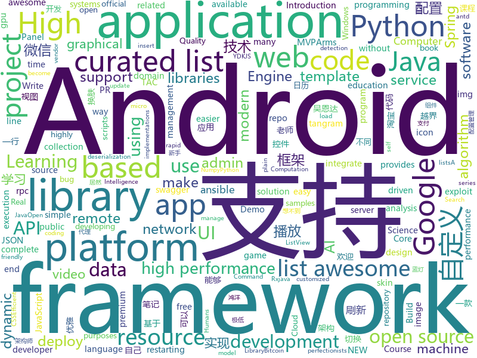

# 2018-05-23
See what the GitHub community is most excited about today.

## python
* [youCanCodeAGif](https://github.com/1-Sisyphe/youCanCodeAGif)(**420 stars today**): Can you make an High Quality Gif from A to Z only by coding? Yes. Do you want to, though?
* [easy-tensorflow](https://github.com/easy-tensorflow/easy-tensorflow)(**168 stars today**): Simple and comprehensive tutorials in TensorFlow
* [models](https://github.com/tensorflow/models)(**90 stars today**): Models and examples built with TensorFlow
* [Learning-to-See-in-the-Dark](https://github.com/cchen156/Learning-to-See-in-the-Dark)(**84 stars today**): 
* [keras](https://github.com/keras-team/keras)(**49 stars today**): Deep Learning for humans
* [Chinese-Word-Vectors](https://github.com/Embedding/Chinese-Word-Vectors)(**59 stars today**): 100+ Chinese Word Vectors 上百种预训练中文词向量
* [youtube-dl](https://github.com/rg3/youtube-dl)(**57 stars today**): Command-line program to download videos from YouTube.com and other video sites
* [weirdAAL](https://github.com/carnal0wnage/weirdAAL)(**51 stars today**): WeirdAAL (AWS Attack Library)
* [awesome-python](https://github.com/vinta/awesome-python)(**46 stars today**): A curated list of awesome Python frameworks, libraries, software and resources
* [public-apis](https://github.com/toddmotto/public-apis)(**45 stars today**): A collective list of public JSON APIs for use in web development.
* [scikit-learn](https://github.com/scikit-learn/scikit-learn)(**37 stars today**): scikit-learn: machine learning in Python
* [cpython](https://github.com/python/cpython)(**37 stars today**): The Python programming language
* [flask](https://github.com/pallets/flask)(**36 stars today**): The Python micro framework for building web applications.
* [django](https://github.com/django/django)(**37 stars today**): The Web framework for perfectionists with deadlines.
* [Crunch](https://github.com/chrissimpkins/Crunch)(**43 stars today**): Insane(ly slow but wicked good) PNG image optimization
* [chirp](https://github.com/9b/chirp)(**41 stars today**): Interface to manage and centralize Google Alert information
* [requests](https://github.com/requests/requests)(**36 stars today**): Python HTTP Requests for Humans™✨🍰✨
* [SmoothLife](https://github.com/duckythescientist/SmoothLife)(**39 stars today**): Continuous Domain Game of Life in Python with Numpy
* [gym-duckietown](https://github.com/duckietown/gym-duckietown)(**37 stars today**): 
* [Python-100-Days](https://github.com/jackfrued/Python-100-Days)(**32 stars today**): Python - 100天从新手到大师
* [angr](https://github.com/angr/angr)(**35 stars today**): A powerful and user-friendly binary analysis platform!
* [PwnAuth](https://github.com/fireeye/PwnAuth)(**33 stars today**): 
* [ansible](https://github.com/ansible/ansible)(**24 stars today**): Ansible is a radically simple IT automation platform that makes your applications and systems easier to deploy. Avoid writing scripts or custom code to deploy and update your applications — automate in a language that approaches plain English, using SSH, with no agents to install on remote systems. https://docs.ansible.com/ansible/
* [awesome-machine-learning](https://github.com/josephmisiti/awesome-machine-learning)(**28 stars today**): A curated list of awesome Machine Learning frameworks, libraries and software.
* [faceswap](https://github.com/deepfakes/faceswap)(**28 stars today**): Non official project based on original /r/Deepfakes thread. Many thanks to him!

## java
* [UETool](https://github.com/eleme/UETool)(**163 stars today**): Show/edit any view's attributions on the screen.
* [CalendarView](https://github.com/huanghaibin-dev/CalendarView)(**127 stars today**): Android上一个优雅、万能自定义UI、支持周视图、自定义周起始、性能高效的日历控件，支持热插拔实现的UI定制！支持标记、自定义颜色、农历、自定义月视图各种显示模式等。Canvas绘制，速度快、占用内存低，你真的想不到日历居然还可以如此优雅！An elegant, highly customized and high-performance Calendar Widget on Android.
* [zuul](https://github.com/Netflix/zuul)(**113 stars today**): Zuul is a gateway service that provides dynamic routing, monitoring, resiliency, security, and more.
* [MeiWidgetView](https://github.com/HpWens/MeiWidgetView)(**71 stars today**): 一款汇总了郭霖，鸿洋，以及自己平时收集的自定义控件集合库
* [spring-boot](https://github.com/spring-projects/spring-boot)(**52 stars today**): Spring Boot
* [java-design-patterns](https://github.com/iluwatar/java-design-patterns)(**57 stars today**): Design patterns implemented in Java
* [ArmsComponent](https://github.com/JessYanCoding/ArmsComponent)(**50 stars today**): A complete android componentization solution, powered by MVPArms (MVPArms 官方快速组件化方案).
* [dkplayer](https://github.com/dueeeke/dkplayer)(**48 stars today**): 基于IjkPlayer的视频播放器，支持直播点播，悬浮窗播放，广告播放，边播边缓存；支持重力感应自动全屏；完美实现ListView和RecyclerView列表播放；支持清晰度切换；支持一行代码切换MediaPlayer和ExoPlayer；模仿抖音效果demo；Android O PiP demo
* [Stark](https://github.com/ximsfei/Stark)(**46 stars today**): Stark is a hot-fix framework for Android. It supports swapping new implementations of classes without restarting a running Android application, and updated Android resources (icons, layout, etc) while only restarting the Android Activity. Most importantly, there is no private API invoked in Stark.
* [proxyee-down](https://github.com/monkeyWie/proxyee-down)(**42 stars today**): http下载工具，基于http代理，支持多连接分块下载
* [GAE-RCE](https://github.com/ezequielpereira/GAE-RCE)(**46 stars today**): Google App Engine - Remote Code Execution bug ($36k bug bounty)
* [guava](https://github.com/google/guava)(**40 stars today**): Google core libraries for Java
* [elasticsearch](https://github.com/elastic/elasticsearch)(**36 stars today**): Open Source, Distributed, RESTful Search Engine
* [tac](https://github.com/alibaba/tac)(**41 stars today**): The TAC (Tiny API Cloud) is a server-side solution with tangram. Of course, it also supports the use of secession from tangram; TAC is not a platform, nor a framework, but a development model.
* [spring-framework](https://github.com/spring-projects/spring-framework)(**31 stars today**): Spring Framework
* [SmartRefreshLayout](https://github.com/scwang90/SmartRefreshLayout)(**34 stars today**): 🔥下拉刷新、上拉加载、二级刷新、淘宝二楼、RefreshLayout、OverScroll，Android智能下拉刷新框架，支持越界回弹、越界拖动，具有极强的扩展性，集成了几十种炫酷的Header和 Footer。
* [incubator-dubbo](https://github.com/apache/incubator-dubbo)(**32 stars today**): Apache Dubbo (incubating) is a high-performance, java based, open source RPC framework.
* [MVPArms](https://github.com/JessYanCoding/MVPArms)(**38 stars today**): A common architecture for Android applications developing based on MVP, integrates many open source projects (like Dagger2、Rxjava、Retrofit ...), to make your developing quicker and easier.
* [tutorials](https://github.com/eugenp/tutorials)(**24 stars today**): The "REST With Spring" Course:
* [Android-skin-support](https://github.com/ximsfei/Android-skin-support)(**35 stars today**): Android-skin-support is an easy to use dynamic skin framework for Android, Only one line of code to integrate it.一款用心去做的Android 换肤框架, 极低的学习成本, 极好的用户体验. 一行代码就可以实现换肤, 你值得拥有!!!
* [pai](https://github.com/Microsoft/pai)(**31 stars today**): Resource scheduling and cluster management for AI
* [weixin-java-tools](https://github.com/Wechat-Group/weixin-java-tools)(**29 stars today**): 可能是目前最好最全的微信Java开发工具包，支持包括微信支付、开放平台、小程序、企业号和公众号等的开发
* [netty](https://github.com/netty/netty)(**30 stars today**): Netty project - an event-driven asynchronous network application framework
* [apollo](https://github.com/ctripcorp/apollo)(**29 stars today**): Apollo（阿波罗）是携程框架部门研发的分布式配置中心，能够集中化管理应用不同环境、不同集群的配置，配置修改后能够实时推送到应用端，并且具备规范的权限、流程治理等特性，适用于微服务配置管理场景。
* [Java-Interview](https://github.com/crossoverJie/Java-Interview)(**28 stars today**): 👨‍🎓Java related : basic, concurrent, algorithm

## unknown
* [build-your-own-x](https://github.com/danistefanovic/build-your-own-x)(**1,480 stars today**): 🤓Build your own (insert technology here)
* [architect-awesome](https://github.com/xingshaocheng/architect-awesome)(**270 stars today**): 后端架构师技术图谱
* [awesome-docker](https://github.com/veggiemonk/awesome-docker)(**190 stars today**): 🐳A curated list of Docker resources and projects
* [architecture.of.internet-product](https://github.com/davideuler/architecture.of.internet-product)(**143 stars today**): 互联网公司技术架构，微信/淘宝/微博/腾讯/阿里/美团点评/百度/Google/Facebook/Amazon/eBay的架构，欢迎PR补充
* [computer-science](https://github.com/ossu/computer-science)(**143 stars today**): 🎓Path to a free self-taught education in Computer Science!
* [Interview-Notebook](https://github.com/CyC2018/Interview-Notebook)(**129 stars today**): 📚技术面试需要掌握的基础知识整理，欢迎编辑~
* [gitignore](https://github.com/github/gitignore)(**62 stars today**): A collection of useful .gitignore templates
* [awesome](https://github.com/sindresorhus/awesome)(**71 stars today**): 😎Curated list of awesome lists
* [You-Dont-Know-JS](https://github.com/getify/You-Dont-Know-JS)(**64 stars today**): A book series on JavaScript. @YDKJS on twitter.
* [awesome-vue](https://github.com/vuejs/awesome-vue)(**60 stars today**): 🎉A curated list of awesome things related to Vue.js
* [kubernetes-the-hard-way](https://github.com/kelseyhightower/kubernetes-the-hard-way)(**59 stars today**): Bootstrap Kubernetes the hard way on Google Cloud Platform. No scripts.
* [coding-interview-university](https://github.com/jwasham/coding-interview-university)(**55 stars today**): A complete computer science study plan to become a software engineer.
* [free-programming-books](https://github.com/EbookFoundation/free-programming-books)(**51 stars today**): 📚Freely available programming books
* [Windows-RCE-exploits](https://github.com/smgorelik/Windows-RCE-exploits)(**55 stars today**): The exploit samples database is a repository for **RCE** (remote code execution) exploits and Proof-of-Concepts for **WINDOWS**, the samples are uploaded for education purposes for red and blue teams.
* [awesome-public-datasets](https://github.com/awesomedata/awesome-public-datasets)(**50 stars today**): A topic-centric list of high-quality open datasets in public domains. Propose NEW data ☛☛☛PR☛☛☛
* [developer-roadmap](https://github.com/kamranahmedse/developer-roadmap)(**48 stars today**): Roadmap to becoming a web developer in 2018
* [acmer-qualification-code](https://github.com/songtianyi/acmer-qualification-code)(**48 stars today**): acmer入门级算法模板
* [PHPConChina](https://github.com/ThinkDevelopers/PHPConChina)(**41 stars today**): 
* [awesome-flutter](https://github.com/Solido/awesome-flutter)(**37 stars today**): Quickly find available resources to grow your Flutter projects !
* [easy-tips](https://github.com/shiyangzhaoa/easy-tips)(**38 stars today**): 炒鸡简单知识点，除了排序都是自己手写的，只提供思路，不保证质量==
* [awesome-scalability](https://github.com/binhnguyennus/awesome-scalability)(**39 stars today**): High Scalability, High Availability, High Stability, High Performance, and High Intelligence Back-End Design Patterns
* [nocode](https://github.com/kelseyhightower/nocode)(**37 stars today**): The best way to write secure and reliable applications. Write nothing; deploy nowhere.
* [awesome-cve-poc](https://github.com/qazbnm456/awesome-cve-poc)(**32 stars today**): ✍️A curated list of CVE PoCs.
* [blog](https://github.com/fouber/blog)(**36 stars today**): 没事写写文章，喜欢的话请点star，想订阅点watch，千万别fork！
* [forum](https://github.com/getlantern/forum)(**34 stars today**): 蓝灯(Lantern)官方论坛

## c++
* [tensorflow](https://github.com/tensorflow/tensorflow)(**113 stars today**): Computation using data flow graphs for scalable machine learning
* [PhoenixGo](https://github.com/Tencent/PhoenixGo)(**100 stars today**): Go AI program which implement the AlphaGo Zero paper
* [bsf](https://github.com/GameFoundry/bsf)(**106 stars today**): Modern C++14 library for the development of real-time graphical applications
* [ELF](https://github.com/pytorch/ELF)(**91 stars today**): ELF: a platform for game research
* [electron](https://github.com/electron/electron)(**69 stars today**): Build cross platform desktop apps with JavaScript, HTML, and CSS
* [scanner](https://github.com/scanner-research/scanner)(**68 stars today**): Efficient video analysis at scale
* [pytorch](https://github.com/pytorch/pytorch)(**57 stars today**): Tensors and Dynamic neural networks in Python with strong GPU acceleration
* [opencv](https://github.com/opencv/opencv)(**39 stars today**): Open Source Computer Vision Library
* [bitcoin](https://github.com/bitcoin/bitcoin)(**46 stars today**): Bitcoin Core integration/staging tree
* [eos](https://github.com/EOSIO/eos)(**41 stars today**): An open source smart contract platform
* [Tars](https://github.com/Tencent/Tars)(**39 stars today**): Tars is a highly performance rpc framework based on naming service using tars protocol and provides a semi-automatic operation platform.
* [katran](https://github.com/facebookincubator/katran)(**41 stars today**): A high performance layer 4 load balancer
* [protobuf](https://github.com/google/protobuf)(**38 stars today**): Protocol Buffers - Google's data interchange format
* [openpose](https://github.com/CMU-Perceptual-Computing-Lab/openpose)(**33 stars today**): OpenPose: Real-time multi-person keypoint detection library for body, face, and hands estimation
* [tvm](https://github.com/dmlc/tvm)(**26 stars today**): Open deep learning compiler stack for cpu, gpu and specialized accelerators
* [cosmos](https://github.com/OpenGenus/cosmos)(**26 stars today**): Algorithms that run our universe | Your personal library of every algorithm and data structure code that you will ever encounter | Ask us anything at our forum
* [PacVim](https://github.com/jmoon018/PacVim)(**25 stars today**): 
* [fmt](https://github.com/fmtlib/fmt)(**27 stars today**): A modern formatting library
* [mud](https://github.com/hugoam/mud)(**27 stars today**): c++ toolkit for rapid development of live graphical apps and games
* [libui-node](https://github.com/parro-it/libui-node)(**27 stars today**): Node bindings for libui, an awesome native UI library for Unix, OSX and Windows
* [grpc](https://github.com/grpc/grpc)(**18 stars today**): The C based gRPC (C++, Python, Ruby, Objective-C, PHP, C#)
* [apollo](https://github.com/ApolloAuto/apollo)(**18 stars today**): An open autonomous driving platform
* [CVE-2018-8120](https://github.com/unamer/CVE-2018-8120)(**17 stars today**): CVE-2018-8120 Windows LPE exploit
* [v8](https://github.com/v8/v8)(**19 stars today**): The official mirror of the V8 Git repository
* [tesseract](https://github.com/tesseract-ocr/tesseract)(**16 stars today**): Tesseract Open Source OCR Engine (main repository)

## html
* [the-power-of-prolog](https://github.com/triska/the-power-of-prolog)(**117 stars today**): Introduction to modern Prolog
* [img-2](https://github.com/RevillWeb/img-2)(**44 stars today**): Replace  elements with  to automatically pre-cache images and improve page performance.
* [deeplearning_ai_books](https://github.com/fengdu78/deeplearning_ai_books)(**37 stars today**): deeplearning.ai（吴恩达老师的深度学习课程笔记及资源）
* [Coursera-ML-AndrewNg-Notes](https://github.com/fengdu78/Coursera-ML-AndrewNg-Notes)(**29 stars today**): 吴恩达老师的机器学习课程个人笔记
* [AdminLTE](https://github.com/almasaeed2010/AdminLTE)(**23 stars today**): AdminLTE - Free Premium Admin control Panel Theme Based On Bootstrap 3.x
* [Spoon-Knife](https://github.com/octocat/Spoon-Knife)(****): This repo is for demonstration purposes only.
* [SF-zh](https://github.com/Coq-zh/SF-zh)(**22 stars today**): 《软件基础》中文版
* [eNMS](https://github.com/afourmy/eNMS)(**21 stars today**): A vendor-agnostic NMS for graphical network automation
* [portainer](https://github.com/portainer/portainer)(**18 stars today**): Simple management UI for Docker
* [fastText](https://github.com/facebookresearch/fastText)(**15 stars today**): Library for fast text representation and classification.
* [polymer](https://github.com/Polymer/polymer)(**14 stars today**): Build modern apps using web components
* [ng-alain](https://github.com/cipchk/ng-alain)(**13 stars today**): ng-zorro-antd admin panel front-end framework
* [gson](https://github.com/google/gson)(**11 stars today**): A Java serialization/deserialization library to convert Java Objects into JSON and back
* [react-app-rewired](https://github.com/timarney/react-app-rewired)(**12 stars today**): Override create-react-app webpack configs without ejecting
* [awesome-mac](https://github.com/jaywcjlove/awesome-mac)(**10 stars today**):  This repo is a collection of awesome Mac applications and tools for developers and designers.
* [articles](https://github.com/noahlam/articles)(**11 stars today**): 
* [proposal-top-level-await](https://github.com/tc39/proposal-top-level-await)(**10 stars today**): top-level `await` proposal for ECMAScript (stage 2)
* [ionicons](https://github.com/ionic-team/ionicons)(**9 stars today**): The premium icon font for Ionic
* [ecma262](https://github.com/tc39/ecma262)(**9 stars today**): Status, process, and documents for ECMA262
* [Adminator-admin-dashboard](https://github.com/puikinsh/Adminator-admin-dashboard)(**8 stars today**): Adminator is a easy to use and well design admin dashboard template for web apps, websites, services and more
* [electron-api-demos](https://github.com/electron/electron-api-demos)(**8 stars today**): Explore the Electron APIs
* [go101](https://github.com/go101/go101)(**8 stars today**): A book focusing on Go syntax/semantics and all kinds of details.
* [swagger-codegen](https://github.com/swagger-api/swagger-codegen)(**6 stars today**): swagger-codegen contains a template-driven engine to generate documentation, API clients and server stubs in different languages by parsing your OpenAPI / Swagger definition.
* [game-of-life](https://github.com/wakaleo/game-of-life)(****): Demo application for the 'Jenkins: The Definitive Guide' book
* [CLRS](https://github.com/walkccc/CLRS)(**8 stars today**): Solutions to Introduction to Algorithms 3rd

## WordCloud

