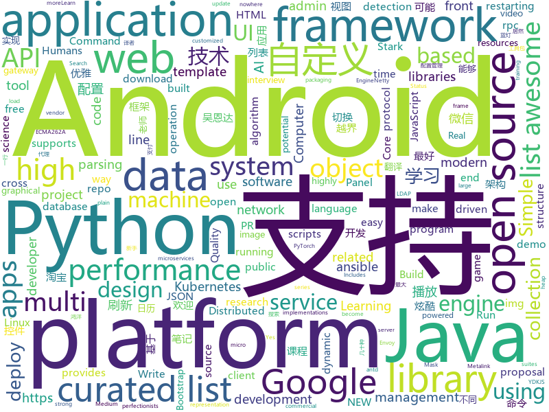

# 2018-05-24
See what the GitHub community is most excited about today.

## python
* [Python-100-Days](https://github.com/jackfrued/Python-100-Days)(**240 stars today**): Python - 100天从新手到大师
* [easy-tensorflow](https://github.com/easy-tensorflow/easy-tensorflow)(**212 stars today**): Simple and comprehensive tutorials in TensorFlow
* [models](https://github.com/tensorflow/models)(**86 stars today**): Models and examples built with TensorFlow
* [youCanCodeAGif](https://github.com/1-Sisyphe/youCanCodeAGif)(**114 stars today**): Can you make an High Quality Gif from A to Z only by coding? Yes. Do you want to, though?
* [Crunch](https://github.com/chrissimpkins/Crunch)(**70 stars today**): Insane(ly slow but wicked good) PNG image optimization
* [Learning-to-See-in-the-Dark](https://github.com/cchen156/Learning-to-See-in-the-Dark)(**65 stars today**): 
* [awesome-python](https://github.com/vinta/awesome-python)(**64 stars today**): A curated list of awesome Python frameworks, libraries, software and resources
* [youtube-dl](https://github.com/rg3/youtube-dl)(**56 stars today**): Command-line program to download videos from YouTube.com and other video sites
* [keras](https://github.com/keras-team/keras)(**46 stars today**): Deep Learning for humans
* [pipenv](https://github.com/pypa/pipenv)(**41 stars today**): Python Development Workflow for Humans.
* [poetry](https://github.com/sdispater/poetry)(**43 stars today**): Python dependency management and packaging made easy.
* [flask](https://github.com/pallets/flask)(**37 stars today**): The Python micro framework for building web applications.
* [SleuthQL](https://github.com/RhinoSecurityLabs/SleuthQL)(**39 stars today**): Python3 Burp History parsing tool to discover potential SQL injection points. To be used in tandem with SQLmap.
* [edgedb](https://github.com/edgedb/edgedb)(**39 stars today**): The next generation object-relational database.
* [ansible](https://github.com/ansible/ansible)(**28 stars today**): Ansible is a radically simple IT automation platform that makes your applications and systems easier to deploy. Avoid writing scripts or custom code to deploy and update your applications — automate in a language that approaches plain English, using SSH, with no agents to install on remote systems. https://docs.ansible.com/ansible/
* [LDAPPER](https://github.com/shellster/LDAPPER)(**37 stars today**): AD LDAP Command Line Searching that doesn't suck.
* [django](https://github.com/django/django)(**30 stars today**): The Web framework for perfectionists with deadlines.
* [scikit-learn](https://github.com/scikit-learn/scikit-learn)(**31 stars today**): scikit-learn: machine learning in Python
* [pandas](https://github.com/pandas-dev/pandas)(**31 stars today**): Flexible and powerful data analysis / manipulation library for Python, providing labeled data structures similar to R data.frame objects, statistical functions, and much more
* [system-design-primer](https://github.com/donnemartin/system-design-primer)(**33 stars today**): Learn how to design large-scale systems. Prep for the system design interview. Includes Anki flashcards.
* [ambassador](https://github.com/datawire/ambassador)(**32 stars today**): open source Kubernetes-native API gateway for microservices built on the Envoy Proxy
* [Detectron](https://github.com/facebookresearch/Detectron)(**26 stars today**): FAIR's research platform for object detection research, implementing popular algorithms like Mask R-CNN and RetinaNet.
* [public-apis](https://github.com/toddmotto/public-apis)(**29 stars today**): A collective list of public JSON APIs for use in web development.
* [awesome-machine-learning](https://github.com/josephmisiti/awesome-machine-learning)(**29 stars today**): A curated list of awesome Machine Learning frameworks, libraries and software.
* [Chinese-Word-Vectors](https://github.com/Embedding/Chinese-Word-Vectors)(**25 stars today**): 100+ Chinese Word Vectors 上百种预训练中文词向量

## java
* [UETool](https://github.com/eleme/UETool)(**235 stars today**): Show/edit any view's attributions on the screen.
* [zuul](https://github.com/Netflix/zuul)(**172 stars today**): Zuul is a gateway service that provides dynamic routing, monitoring, resiliency, security, and more.
* [LayoutManagerGroup](https://github.com/DingMouRen/LayoutManagerGroup)(**164 stars today**): 👉自定义LayoutManager，炫酷列表
* [micronaut-core](https://github.com/micronaut-projects/micronaut-core)(**143 stars today**): Micronaut Application Framework
* [coffee-gb](https://github.com/trekawek/coffee-gb)(**130 stars today**): Gameboy emulator in Java 8.
* [CalendarView](https://github.com/huanghaibin-dev/CalendarView)(**119 stars today**): Android上一个优雅、万能自定义UI、支持周视图、自定义周起始、性能高效的日历控件，支持热插拔实现的UI定制！支持标记、自定义颜色、农历、自定义月视图各种显示模式等。Canvas绘制，速度快、占用内存低，你真的想不到日历居然还可以如此优雅！An elegant, highly customized and high-performance Calendar Widget on Android.
* [proxyee-down](https://github.com/monkeyWie/proxyee-down)(**91 stars today**): http下载工具，基于http代理，支持多连接分块下载
* [dkplayer](https://github.com/dueeeke/dkplayer)(**83 stars today**): 基于IjkPlayer的视频播放器，支持直播点播，悬浮窗播放，广告播放，边播边缓存；支持重力感应自动全屏；完美实现ListView和RecyclerView列表播放；支持清晰度切换；支持一行代码切换MediaPlayer和ExoPlayer；模仿抖音效果demo；Android O PiP demo
* [spring-boot](https://github.com/spring-projects/spring-boot)(**46 stars today**): Spring Boot
* [strimzi](https://github.com/strimzi/strimzi)(**56 stars today**): Apache Kafka running on Kubernetes and OpenShift
* [MeiWidgetView](https://github.com/HpWens/MeiWidgetView)(**48 stars today**): 一款汇总了郭霖，鸿洋，以及自己平时收集的自定义控件集合库
* [incubator-dubbo](https://github.com/apache/incubator-dubbo)(**39 stars today**): Apache Dubbo (incubating) is a high-performance, java based, open source RPC framework.
* [Stark](https://github.com/ximsfei/Stark)(**43 stars today**): Stark is a hot-fix framework for Android. It supports swapping new implementations of classes without restarting a running Android application, and updated Android resources (icons, layout, etc) while only restarting the Android Activity. Most importantly, there is no private API invoked in Stark.
* [tutorials](https://github.com/eugenp/tutorials)(**25 stars today**): The "REST With Spring" Course:
* [guava](https://github.com/google/guava)(**37 stars today**): Google core libraries for Java
* [weixin-java-tools](https://github.com/Wechat-Group/weixin-java-tools)(**37 stars today**): 可能是目前最好最全的微信Java开发工具包，支持包括微信支付、开放平台、小程序、企业号和公众号等的开发
* [elasticsearch](https://github.com/elastic/elasticsearch)(**33 stars today**): Open Source, Distributed, RESTful Search Engine
* [netty](https://github.com/netty/netty)(**32 stars today**): Netty project - an event-driven asynchronous network application framework
* [sharding-sphere](https://github.com/sharding-sphere/sharding-sphere)(**30 stars today**): Distributed database middleware
* [material-components-android](https://github.com/material-components/material-components-android)(**30 stars today**): Modular and customizable Material Design UI components for Android
* [AndroidUtilCode](https://github.com/Blankj/AndroidUtilCode)(**28 stars today**): 🔥Android developers should collect the following utils(updating).
* [SmartRefreshLayout](https://github.com/scwang90/SmartRefreshLayout)(**27 stars today**): 🔥下拉刷新、上拉加载、二级刷新、淘宝二楼、RefreshLayout、OverScroll，Android智能下拉刷新框架，支持越界回弹、越界拖动，具有极强的扩展性，集成了几十种炫酷的Header和 Footer。
* [apollo](https://github.com/ctripcorp/apollo)(**26 stars today**): Apollo（阿波罗）是携程框架部门研发的分布式配置中心，能够集中化管理应用不同环境、不同集群的配置，配置修改后能够实时推送到应用端，并且具备规范的权限、流程治理等特性，适用于微服务配置管理场景。
* [Java-Interview](https://github.com/crossoverJie/Java-Interview)(**26 stars today**): 👨‍🎓Java related : basic, concurrent, algorithm
* [pai](https://github.com/Microsoft/pai)(**26 stars today**): Resource scheduling and cluster management for AI

## unknown
* [build-your-own-x](https://github.com/danistefanovic/build-your-own-x)(**1,078 stars today**): 🤓Build your own (insert technology here)
* [architect-awesome](https://github.com/xingshaocheng/architect-awesome)(**254 stars today**): 后端架构师技术图谱
* [architecture.of.internet-product](https://github.com/davideuler/architecture.of.internet-product)(**174 stars today**): 互联网公司技术架构，微信/淘宝/微博/腾讯/阿里/美团点评/百度/Google/Facebook/Amazon/eBay的架构，欢迎PR补充
* [PHPConChina](https://github.com/ThinkDevelopers/PHPConChina)(**160 stars today**): 
* [awesome-docker](https://github.com/veggiemonk/awesome-docker)(**138 stars today**): 🐳A curated list of Docker resources and projects
* [Interview-Notebook](https://github.com/CyC2018/Interview-Notebook)(**115 stars today**): 📚技术面试需要掌握的基础知识整理，欢迎编辑~
* [You-Dont-Know-JS](https://github.com/getify/You-Dont-Know-JS)(**87 stars today**): A book series on JavaScript. @YDKJS on twitter.
* [gitignore](https://github.com/github/gitignore)(**76 stars today**): A collection of useful .gitignore templates
* [awesome](https://github.com/sindresorhus/awesome)(**85 stars today**): 😎Curated list of awesome lists
* [design](https://github.com/basechainio/design)(**82 stars today**): Everything you need to know about basechain is here.
* [coding-interview-university](https://github.com/jwasham/coding-interview-university)(**67 stars today**): A complete computer science study plan to become a software engineer.
* [awesome-vue](https://github.com/vuejs/awesome-vue)(**63 stars today**): 🎉A curated list of awesome things related to Vue.js
* [free-programming-books](https://github.com/EbookFoundation/free-programming-books)(**58 stars today**): 📚Freely available programming books
* [awesome-public-datasets](https://github.com/awesomedata/awesome-public-datasets)(**61 stars today**): A topic-centric list of high-quality open datasets in public domains. Propose NEW data ☛☛☛PR☛☛☛
* [computer-science](https://github.com/ossu/computer-science)(**55 stars today**): 🎓Path to a free self-taught education in Computer Science!
* [developer-roadmap](https://github.com/kamranahmedse/developer-roadmap)(**55 stars today**): Roadmap to becoming a web developer in 2018
* [forum](https://github.com/getlantern/forum)(**52 stars today**): 蓝灯(Lantern)官方论坛
* [blog](https://github.com/fouber/blog)(**46 stars today**): 没事写写文章，喜欢的话请点star，想订阅点watch，千万别fork！
* [blog-contest-may-mayhem](https://github.com/laravel/blog-contest-may-mayhem)(**43 stars today**): 
* [nocode](https://github.com/kelseyhightower/nocode)(**41 stars today**): The best way to write secure and reliable applications. Write nothing; deploy nowhere.
* [gold-miner](https://github.com/xitu/gold-miner)(**38 stars today**): 🥇掘金翻译计划，可能是世界最大最好的英译中技术社区，最懂读者和译者的翻译平台：
* [Front-end-Developer-Interview-Questions](https://github.com/h5bp/Front-end-Developer-Interview-Questions)(**39 stars today**): A list of helpful front-end related questions you can use to interview potential candidates, test yourself or completely ignore.
* [realworld](https://github.com/gothinkster/realworld)(**30 stars today**): "The mother of all demo apps" — Exemplary fullstack Medium.com clone powered by React, Angular, Node, Django, and many more🏅
* [Red-Teaming-Toolkit](https://github.com/infosecn1nja/Red-Teaming-Toolkit)(**26 stars today**): A collection of open source and commercial tools that aid in red team operations.
* [kubernetes-the-hard-way](https://github.com/kelseyhightower/kubernetes-the-hard-way)(**27 stars today**): Bootstrap Kubernetes the hard way on Google Cloud Platform. No scripts.

## c++
* [katran](https://github.com/facebookincubator/katran)(**273 stars today**): A high performance layer 4 load balancer
* [tensorflow](https://github.com/tensorflow/tensorflow)(**176 stars today**): Computation using data flow graphs for scalable machine learning
* [bsf](https://github.com/GameFoundry/bsf)(**144 stars today**): Modern C++14 library for the development of real-time graphical applications
* [electron](https://github.com/electron/electron)(**55 stars today**): Build cross platform desktop apps with JavaScript, HTML, and CSS
* [PhoenixGo](https://github.com/Tencent/PhoenixGo)(**45 stars today**): Go AI program which implement the AlphaGo Zero paper
* [bitcoin](https://github.com/bitcoin/bitcoin)(**32 stars today**): Bitcoin Core integration/staging tree
* [opencv](https://github.com/opencv/opencv)(**33 stars today**): Open Source Computer Vision Library
* [heaptrack](https://github.com/KDE/heaptrack)(**42 stars today**): A heap memory profiler for Linux
* [pytorch](https://github.com/pytorch/pytorch)(**38 stars today**): Tensors and Dynamic neural networks in Python with strong GPU acceleration
* [eos](https://github.com/EOSIO/eos)(**34 stars today**): An open source smart contract platform
* [Tars](https://github.com/Tencent/Tars)(**31 stars today**): Tars is a highly performance rpc framework based on naming service using tars protocol and provides a semi-automatic operation platform.
* [openpose](https://github.com/CMU-Perceptual-Computing-Lab/openpose)(**29 stars today**): OpenPose: Real-time multi-person keypoint detection library for body, face, and hands estimation
* [grpc](https://github.com/grpc/grpc)(**30 stars today**): The C based gRPC (C++, Python, Ruby, Objective-C, PHP, C#)
* [tesseract](https://github.com/tesseract-ocr/tesseract)(**28 stars today**): Tesseract Open Source OCR Engine (main repository)
* [fmt](https://github.com/fmtlib/fmt)(**27 stars today**): A modern formatting library
* [ELF](https://github.com/pytorch/ELF)(**24 stars today**): ELF: a platform for game research
* [protobuf](https://github.com/google/protobuf)(**21 stars today**): Protocol Buffers - Google's data interchange format
* [libgo](https://github.com/yyzybb537/libgo)(**22 stars today**): Go-style concurrency in C++11
* [apollo](https://github.com/ApolloAuto/apollo)(**20 stars today**): An open autonomous driving platform
* [cosmos](https://github.com/OpenGenus/cosmos)(**21 stars today**): Algorithms that run our universe | Your personal library of every algorithm and data structure code that you will ever encounter | Ask us anything at our forum
* [horovod](https://github.com/uber/horovod)(**21 stars today**): Distributed training framework for TensorFlow, Keras, and PyTorch.
* [aria2](https://github.com/aria2/aria2)(**21 stars today**): aria2 is a lightweight multi-protocol & multi-source, cross platform download utility operated in command-line. It supports HTTP/HTTPS, FTP, SFTP, BitTorrent and Metalink.
* [envoy](https://github.com/envoyproxy/envoy)(**20 stars today**): C++ front/service proxy
* [xgboost](https://github.com/dmlc/xgboost)(**18 stars today**): Scalable, Portable and Distributed Gradient Boosting (GBDT, GBRT or GBM) Library, for Python, R, Java, Scala, C++ and more. Runs on single machine, Hadoop, Spark, Flink and DataFlow
* [godot](https://github.com/godotengine/godot)(**17 stars today**): Godot Engine – Multi-platform 2D and 3D game engine

## html
* [Coursera-ML-AndrewNg-Notes](https://github.com/fengdu78/Coursera-ML-AndrewNg-Notes)(**44 stars today**): 吴恩达老师的机器学习课程个人笔记
* [img-2](https://github.com/RevillWeb/img-2)(**44 stars today**): Replace  elements with  to automatically pre-cache images and improve page performance.
* [AdminLTE](https://github.com/almasaeed2010/AdminLTE)(**28 stars today**): AdminLTE - Free Premium Admin control Panel Theme Based On Bootstrap 3.x
* [deeplearning_ai_books](https://github.com/fengdu78/deeplearning_ai_books)(**28 stars today**): deeplearning.ai（吴恩达老师的深度学习课程笔记及资源）
* [gson](https://github.com/google/gson)(**25 stars today**): A Java serialization/deserialization library to convert Java Objects into JSON and back
* [awesome-mac](https://github.com/jaywcjlove/awesome-mac)(**22 stars today**):  This repo is a collection of awesome Mac applications and tools for developers and designers.
* [the-power-of-prolog](https://github.com/triska/the-power-of-prolog)(**21 stars today**): Introduction to modern Prolog
* [fastText](https://github.com/facebookresearch/fastText)(**17 stars today**): Library for fast text representation and classification.
* [Spoon-Knife](https://github.com/octocat/Spoon-Knife)(****): This repo is for demonstration purposes only.
* [ng-alain](https://github.com/cipchk/ng-alain)(**13 stars today**): ng-zorro-antd admin panel front-end framework
* [styleguide](https://github.com/google/styleguide)(**9 stars today**): Style guides for Google-originated open-source projects
* [Hyphenopoly](https://github.com/mnater/Hyphenopoly)(**14 stars today**): JavaScript polyfill for client-side hyphenation
* [swagger-codegen](https://github.com/swagger-api/swagger-codegen)(**13 stars today**): swagger-codegen contains a template-driven engine to generate documentation, API clients and server stubs in different languages by parsing your OpenAPI / Swagger definition.
* [portainer](https://github.com/portainer/portainer)(**11 stars today**): Simple management UI for Docker
* [requests-html](https://github.com/kennethreitz/requests-html)(**12 stars today**): Pythonic HTML Parsing for Humans™
* [polymer](https://github.com/Polymer/polymer)(**11 stars today**): Build modern apps using web components
* [Adminator-admin-dashboard](https://github.com/puikinsh/Adminator-admin-dashboard)(**9 stars today**): Adminator is a easy to use and well design admin dashboard template for web apps, websites, services and more
* [core](https://github.com/stackblitz/core)(**11 stars today**): Online IDE powered by VS Code⚡️
* [linux-command](https://github.com/jaywcjlove/linux-command)(**10 stars today**): Linux命令大全搜索工具，内容包含Linux命令手册、详解、学习、搜集。https://git.io/linux
* [typedoc](https://github.com/TypeStrong/typedoc)(**10 stars today**): Documentation generator for TypeScript projects.
* [proposal-top-level-await](https://github.com/tc39/proposal-top-level-await)(**10 stars today**): top-level `await` proposal for ECMAScript (stage 2)
* [ecma262](https://github.com/tc39/ecma262)(**9 stars today**): Status, process, and documents for ECMA262
* [eNMS](https://github.com/afourmy/eNMS)(**9 stars today**): A vendor-agnostic NMS for graphical network automation
* [EIPs](https://github.com/ethereum/EIPs)(**8 stars today**): The Ethereum Improvement Proposal repository
* [web-platform-tests](https://github.com/w3c/web-platform-tests)(**8 stars today**): Test suites for Web-platform specs — including WHATWG, W3C, and others

## WordCloud

