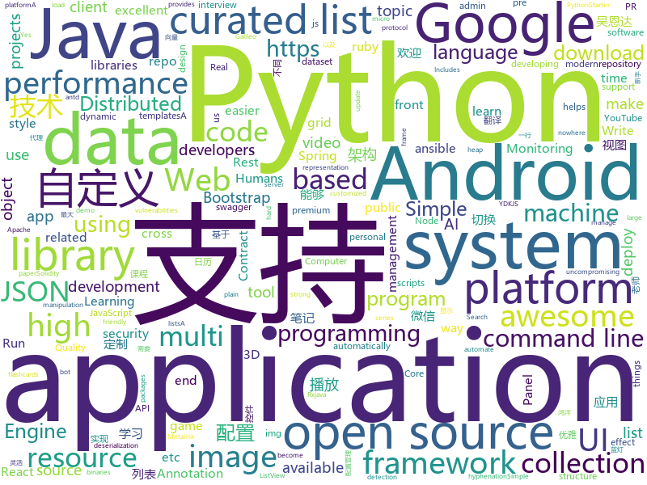

# 2018-05-25
See what the GitHub community is most excited about today.

## python
* [Python-100-Days](https://github.com/jackfrued/Python-100-Days)(**216 stars today**): Python - 100天从新手到大师
* [easy-tensorflow](https://github.com/easy-tensorflow/easy-tensorflow)(**132 stars today**): Simple and comprehensive tutorials in TensorFlow
* [models](https://github.com/tensorflow/models)(**81 stars today**): Models and examples built with TensorFlow
* [semi-auto-image-annotation-tool](https://github.com/virajmavani/semi-auto-image-annotation-tool)(**76 stars today**): Semi Automatic Image Annotation Toolbox: A tool which helps you in annotating images by suggesting you annotations for 80 object classes using a pre-trained model
* [public-apis](https://github.com/toddmotto/public-apis)(**64 stars today**): A collective list of public JSON APIs for use in web development.
* [keras](https://github.com/keras-team/keras)(**52 stars today**): Deep Learning for humans
* [black](https://github.com/ambv/black)(**63 stars today**): The uncompromising Python code formatter
* [scikit-learn](https://github.com/scikit-learn/scikit-learn)(**45 stars today**): scikit-learn: machine learning in Python
* [youtube-8m](https://github.com/google/youtube-8m)(**44 stars today**): Starter code for working with the YouTube-8M dataset.
* [awesome-python](https://github.com/vinta/awesome-python)(**46 stars today**): A curated list of awesome Python frameworks, libraries, software and resources
* [flask](https://github.com/pallets/flask)(**40 stars today**): The Python micro framework for building web applications.
* [algo](https://github.com/trailofbits/algo)(**42 stars today**): Set up a personal IPSEC VPN in the cloud
* [django](https://github.com/django/django)(**32 stars today**): The Web framework for perfectionists with deadlines.
* [Galileo](https://github.com/m4ll0k/Galileo)(**33 stars today**): Galileo - Web Application Audit Framework
* [ansible](https://github.com/ansible/ansible)(**27 stars today**): Ansible is a radically simple IT automation platform that makes your applications and systems easier to deploy. Avoid writing scripts or custom code to deploy and update your applications — automate in a language that approaches plain English, using SSH, with no agents to install on remote systems. https://docs.ansible.com/ansible/
* [cpython](https://github.com/python/cpython)(**27 stars today**): The Python programming language
* [youCanCodeAGif](https://github.com/1-Sisyphe/youCanCodeAGif)(**33 stars today**): Can you make an High Quality Gif from A to Z only by coding? Yes. Do you want to, though?
* [requests](https://github.com/requests/requests)(**28 stars today**): Python HTTP Requests for Humans™✨🍰✨
* [you-get](https://github.com/soimort/you-get)(**27 stars today**): ⏬Dumb downloader that scrapes the web
* [pipenv](https://github.com/pypa/pipenv)(**30 stars today**): Python Development Workflow for Humans.
* [Chinese-Word-Vectors](https://github.com/Embedding/Chinese-Word-Vectors)(**27 stars today**): 100+ Chinese Word Vectors 上百种预训练中文词向量
* [system-design-primer](https://github.com/donnemartin/system-design-primer)(**28 stars today**): Learn how to design large-scale systems. Prep for the system design interview. Includes Anki flashcards.
* [youtube-dl](https://github.com/rg3/youtube-dl)(**28 stars today**): Command-line program to download videos from YouTube.com and other video sites
* [pandas](https://github.com/pandas-dev/pandas)(**25 stars today**): Flexible and powerful data analysis / manipulation library for Python, providing labeled data structures similar to R data.frame objects, statistical functions, and much more
* [httpie](https://github.com/jakubroztocil/httpie)(****): Modern command line HTTP client – user-friendly curl alternative with intuitive UI, JSON support, syntax highlighting, wget-like downloads, extensions, etc. https://httpie.org

## java
* [coffee-gb](https://github.com/trekawek/coffee-gb)(**280 stars today**): Gameboy emulator in Java 8.
* [micronaut-core](https://github.com/micronaut-projects/micronaut-core)(**221 stars today**): Micronaut Application Framework
* [LayoutManagerGroup](https://github.com/DingMouRen/LayoutManagerGroup)(**222 stars today**): 👉自定义LayoutManager，炫酷列表
* [UETool](https://github.com/eleme/UETool)(**179 stars today**): Show/edit any view's attributions on the screen.
* [zuul](https://github.com/Netflix/zuul)(**119 stars today**): Zuul is a gateway service that provides dynamic routing, monitoring, resiliency, security, and more.
* [RxImagePicker](https://github.com/qingmei2/RxImagePicker)(**104 stars today**): 🌟支持RxJava2、灵活可高度定制的Android图片选择架构，提供了微信和知乎主题的UI支持。
* [VirtualXposed](https://github.com/android-hacker/VirtualXposed)(**89 stars today**): A Simple App to use Xposed without root or unlock the bootloader(or modify system image etc).
* [CalendarView](https://github.com/huanghaibin-dev/CalendarView)(**69 stars today**): Android上一个优雅、万能自定义UI、支持周视图、自定义周起始、性能高效的日历控件，支持热插拔实现的UI定制！支持标记、自定义颜色、农历、自定义月视图各种显示模式等。Canvas绘制，速度快、占用内存低，你真的想不到日历居然还可以如此优雅！An elegant, highly customized and high-performance Calendar Widget on Android.
* [proxyee-down](https://github.com/monkeyWie/proxyee-down)(**61 stars today**): http下载工具，基于http代理，支持多连接分块下载
* [incubator-dubbo](https://github.com/apache/incubator-dubbo)(**40 stars today**): Apache Dubbo (incubating) is a high-performance, java based, open source RPC framework.
* [spring-boot](https://github.com/spring-projects/spring-boot)(**35 stars today**): Spring Boot
* [incubator-skywalking](https://github.com/apache/incubator-skywalking)(**43 stars today**): A distributed tracing system, and APM ( Application Performance Monitoring )
* [elasticsearch](https://github.com/elastic/elasticsearch)(**41 stars today**): Open Source, Distributed, RESTful Search Engine
* [sharding-sphere](https://github.com/sharding-sphere/sharding-sphere)(**41 stars today**): Distributed database middleware
* [java-design-patterns](https://github.com/iluwatar/java-design-patterns)(**36 stars today**): Design patterns implemented in Java
* [dkplayer](https://github.com/dueeeke/dkplayer)(**40 stars today**): 基于IjkPlayer的视频播放器，支持直播点播，悬浮窗播放，广告播放，边播边缓存；支持重力感应自动全屏；完美实现ListView和RecyclerView列表播放；支持清晰度切换；支持一行代码切换MediaPlayer和ExoPlayer；模仿抖音效果demo；Android O PiP demo
* [apollo](https://github.com/ctripcorp/apollo)(**37 stars today**): Apollo（阿波罗）是携程框架部门研发的分布式配置中心，能够集中化管理应用不同环境、不同集群的配置，配置修改后能够实时推送到应用端，并且具备规范的权限、流程治理等特性，适用于微服务配置管理场景。
* [MeiWidgetView](https://github.com/HpWens/MeiWidgetView)(**39 stars today**): 一款汇总了郭霖，鸿洋，以及自己平时收集的自定义控件集合库
* [Matisse](https://github.com/zhihu/Matisse)(**35 stars today**): 🎆A well-designed local image and video selector for Android
* [lottie-android](https://github.com/airbnb/lottie-android)(**33 stars today**): Render After Effects animations natively on Android and iOS, Web, and React Native
* [MVPArms](https://github.com/JessYanCoding/MVPArms)(**32 stars today**): A common architecture for Android applications developing based on MVP, integrates many open source projects (like Dagger2、Rxjava、Retrofit ...), to make your developing quicker and easier.
* [AndroidUtilCode](https://github.com/Blankj/AndroidUtilCode)(**30 stars today**): 🔥Android developers should collect the following utils(updating).
* [tutorials](https://github.com/eugenp/tutorials)(**24 stars today**): The "REST With Spring" Course:
* [Signal-Android](https://github.com/signalapp/Signal-Android)(**30 stars today**): A private messenger for Android.
* [guava](https://github.com/google/guava)(**33 stars today**): Google core libraries for Java

## unknown
* [build-your-own-x](https://github.com/danistefanovic/build-your-own-x)(**780 stars today**): 🤓Build your own (insert technology here)
* [architect-awesome](https://github.com/xingshaocheng/architect-awesome)(**260 stars today**): 后端架构师技术图谱
* [architecture.of.internet-product](https://github.com/davideuler/architecture.of.internet-product)(**164 stars today**): 互联网公司技术架构，微信/淘宝/微博/腾讯/阿里/美团点评/百度/Google/Facebook/Amazon/eBay的架构，欢迎PR补充
* [Interview-Notebook](https://github.com/CyC2018/Interview-Notebook)(**134 stars today**): 📚技术面试需要掌握的基础知识整理，欢迎编辑~
* [awesome-docker](https://github.com/veggiemonk/awesome-docker)(**112 stars today**): 🐳A curated list of Docker resources and projects
* [awesome](https://github.com/sindresorhus/awesome)(**80 stars today**): 😎Curated list of awesome lists
* [You-Dont-Know-JS](https://github.com/getify/You-Dont-Know-JS)(**77 stars today**): A book series on JavaScript. @YDKJS on twitter.
* [gitignore](https://github.com/github/gitignore)(**60 stars today**): A collection of useful .gitignore templates
* [awesome-ruby-china](https://github.com/liukun-lk/awesome-ruby-china)(**77 stars today**): A collection of excellent topics. https://ruby-china.org/topics/excellent
* [awesome-vue](https://github.com/vuejs/awesome-vue)(**65 stars today**): 🎉A curated list of awesome things related to Vue.js
* [awesome-public-datasets](https://github.com/awesomedata/awesome-public-datasets)(**58 stars today**): A topic-centric list of high-quality open datasets in public domains. Propose NEW data ☛☛☛PR☛☛☛
* [free-programming-books](https://github.com/EbookFoundation/free-programming-books)(**49 stars today**): 📚Freely available programming books
* [nocode](https://github.com/kelseyhightower/nocode)(**50 stars today**): The best way to write secure and reliable applications. Write nothing; deploy nowhere.
* [PHPConChina](https://github.com/ThinkDevelopers/PHPConChina)(**45 stars today**): 
* [blog-contest-may-mayhem](https://github.com/laravel/blog-contest-may-mayhem)(**40 stars today**): 
* [coding-interview-university](https://github.com/jwasham/coding-interview-university)(**34 stars today**): A complete computer science study plan to become a software engineer.
* [kubernetes-the-hard-way](https://github.com/kelseyhightower/kubernetes-the-hard-way)(**34 stars today**): Bootstrap Kubernetes the hard way on Google Cloud Platform. No scripts.
* [awesome-nodejs](https://github.com/sindresorhus/awesome-nodejs)(**34 stars today**): ⚡️Delightful Node.js packages and resources
* [gold-miner](https://github.com/xitu/gold-miner)(**33 stars today**): 🥇掘金翻译计划，可能是世界最大最好的英译中技术社区，最懂读者和译者的翻译平台：
* [Front-end-Developer-Interview-Questions](https://github.com/h5bp/Front-end-Developer-Interview-Questions)(**29 stars today**): A list of helpful front-end related questions you can use to interview potential candidates, test yourself or completely ignore.
* [forum](https://github.com/getlantern/forum)(**28 stars today**): 蓝灯(Lantern)官方论坛
* [awesome-flutter](https://github.com/Solido/awesome-flutter)(**30 stars today**): Quickly find available resources to grow your Flutter projects !
* [Functional-Programming-For-The-Rest-of-Us-Cn](https://github.com/justinyhuang/Functional-Programming-For-The-Rest-of-Us-Cn)(**28 stars today**): 文章《Functional Programming For The Rest of Us》的中文翻译
* [awesome-react](https://github.com/enaqx/awesome-react)(**28 stars today**): A collection of awesome things regarding React ecosystem.
* [3D-Machine-Learning](https://github.com/timzhang642/3D-Machine-Learning)(**27 stars today**): A resource repository for 3D machine learning

## c++
* [tensorflow](https://github.com/tensorflow/tensorflow)(**173 stars today**): Computation using data flow graphs for scalable machine learning
* [katran](https://github.com/facebookincubator/katran)(**171 stars today**): A high performance layer 4 load balancer
* [bsf](https://github.com/GameFoundry/bsf)(**156 stars today**): Modern C++14 library for the development of real-time graphical applications
* [opencv](https://github.com/opencv/opencv)(**44 stars today**): Open Source Computer Vision Library
* [pytorch](https://github.com/pytorch/pytorch)(**45 stars today**): Tensors and Dynamic neural networks in Python with strong GPU acceleration
* [electron](https://github.com/electron/electron)(**45 stars today**): Build cross platform desktop apps with JavaScript, HTML, and CSS
* [bitcoin](https://github.com/bitcoin/bitcoin)(**39 stars today**): Bitcoin Core integration/staging tree
* [eos](https://github.com/EOSIO/eos)(**37 stars today**): An open source smart contract platform
* [heaptrack](https://github.com/KDE/heaptrack)(**31 stars today**): A heap memory profiler for Linux
* [libgo](https://github.com/yyzybb537/libgo)(**28 stars today**): Go-style concurrency in C++11
* [protobuf](https://github.com/google/protobuf)(**27 stars today**): Protocol Buffers - Google's data interchange format
* [ELF](https://github.com/pytorch/ELF)(**26 stars today**): ELF: a platform for game research
* [tesseract](https://github.com/tesseract-ocr/tesseract)(**27 stars today**): Tesseract Open Source OCR Engine (main repository)
* [grpc](https://github.com/grpc/grpc)(**24 stars today**): The C based gRPC (C++, Python, Ruby, Objective-C, PHP, C#)
* [json](https://github.com/nlohmann/json)(**23 stars today**): JSON for Modern C++
* [aria2](https://github.com/aria2/aria2)(**23 stars today**): aria2 is a lightweight multi-protocol & multi-source, cross platform download utility operated in command-line. It supports HTTP/HTTPS, FTP, SFTP, BitTorrent and Metalink.
* [aseprite](https://github.com/aseprite/aseprite)(**22 stars today**): Animated sprite editor & pixel art tool (Windows, macOS, Linux)
* [DeepSpeech](https://github.com/mozilla/DeepSpeech)(**20 stars today**): A TensorFlow implementation of Baidu's DeepSpeech architecture
* [openpose](https://github.com/CMU-Perceptual-Computing-Lab/openpose)(**19 stars today**): OpenPose: Real-time multi-person keypoint detection library for body, face, and hands estimation
* [cosmos](https://github.com/OpenGenus/cosmos)(**20 stars today**): Algorithms that run our universe | Your personal library of every algorithm and data structure code that you will ever encounter | Ask us anything at our forum
* [xgboost](https://github.com/dmlc/xgboost)(**18 stars today**): Scalable, Portable and Distributed Gradient Boosting (GBDT, GBRT or GBM) Library, for Python, R, Java, Scala, C++ and more. Runs on single machine, Hadoop, Spark, Flink and DataFlow
* [v8](https://github.com/v8/v8)(**19 stars today**): The official mirror of the V8 Git repository
* [godot](https://github.com/godotengine/godot)(**17 stars today**): Godot Engine – Multi-platform 2D and 3D game engine
* [PhoenixGo](https://github.com/Tencent/PhoenixGo)(**18 stars today**): Go AI program which implement the AlphaGo Zero paper
* [solidity](https://github.com/ethereum/solidity)(**17 stars today**): Solidity, the Contract-Oriented Programming Language

## html
* [Coursera-ML-AndrewNg-Notes](https://github.com/fengdu78/Coursera-ML-AndrewNg-Notes)(**44 stars today**): 吴恩达老师的机器学习课程个人笔记
* [deeplearning_ai_books](https://github.com/fengdu78/deeplearning_ai_books)(**26 stars today**): deeplearning.ai（吴恩达老师的深度学习课程笔记及资源）
* [AdminLTE](https://github.com/almasaeed2010/AdminLTE)(**27 stars today**): AdminLTE - Free Premium Admin control Panel Theme Based On Bootstrap 3.x
* [fastText](https://github.com/facebookresearch/fastText)(**23 stars today**): Library for fast text representation and classification.
* [GTFOBins.github.io](https://github.com/GTFOBins/GTFOBins.github.io)(**25 stars today**): Curated list of Unix binaries that can be exploited to bypass system security restrictions
* [styleguide](https://github.com/google/styleguide)(**21 stars today**): Style guides for Google-originated open-source projects
* [logo_builder](https://github.com/launchaco/logo_builder)(**21 stars today**): Free AI powered logo builder
* [Spoon-Knife](https://github.com/octocat/Spoon-Knife)(****): This repo is for demonstration purposes only.
* [swagger-codegen](https://github.com/swagger-api/swagger-codegen)(**19 stars today**): swagger-codegen contains a template-driven engine to generate documentation, API clients and server stubs in different languages by parsing your OpenAPI / Swagger definition.
* [img-2](https://github.com/RevillWeb/img-2)(**18 stars today**): Replace  elements with  to automatically pre-cache images and improve page performance.
* [awesome-mac](https://github.com/jaywcjlove/awesome-mac)(**16 stars today**):  This repo is a collection of awesome Mac applications and tools for developers and designers.
* [GridLayoutMotion](https://github.com/codrops/GridLayoutMotion)(**16 stars today**): A retro-style grid layout with a playful motion hover effect on the grid items.
* [Flaskerizer](https://github.com/brettvanderwerff/Flaskerizer)(**16 stars today**): A program that automatically creates Flask apps from Bootstrap templates
* [gson](https://github.com/google/gson)(**14 stars today**): A Java serialization/deserialization library to convert Java Objects into JSON and back
* [the-power-of-prolog](https://github.com/triska/the-power-of-prolog)(**13 stars today**): Introduction to modern Prolog
* [Hyphenopoly](https://github.com/mnater/Hyphenopoly)(**13 stars today**): JavaScript polyfill for client-side hyphenation
* [portainer](https://github.com/portainer/portainer)(**12 stars today**): Simple management UI for Docker
* [ng-alain](https://github.com/cipchk/ng-alain)(**11 stars today**): ng-zorro-antd admin panel front-end framework
* [ionicons](https://github.com/ionic-team/ionicons)(**11 stars today**): The premium icon font for Ionic
* [electron-api-demos](https://github.com/electron/electron-api-demos)(**10 stars today**): Explore the Electron APIs
* [EIPs](https://github.com/ethereum/EIPs)(**9 stars today**): The Ethereum Improvement Proposal repository
* [fonts](https://github.com/google/fonts)(**10 stars today**): Font files available from Google Fonts
* [ecma262](https://github.com/tc39/ecma262)(**9 stars today**): Status, process, and documents for ECMA262
* [archerysec](https://github.com/archerysec/archerysec)(**10 stars today**): Open Source Vulnerability Assessment and Management helps developers and pentesters to perform scans and manage vulnerabilities.
* [zenbot](https://github.com/DeviaVir/zenbot)(**8 stars today**): Zenbot is a command-line cryptocurrency trading bot using Node.js and MongoDB.

## WordCloud

