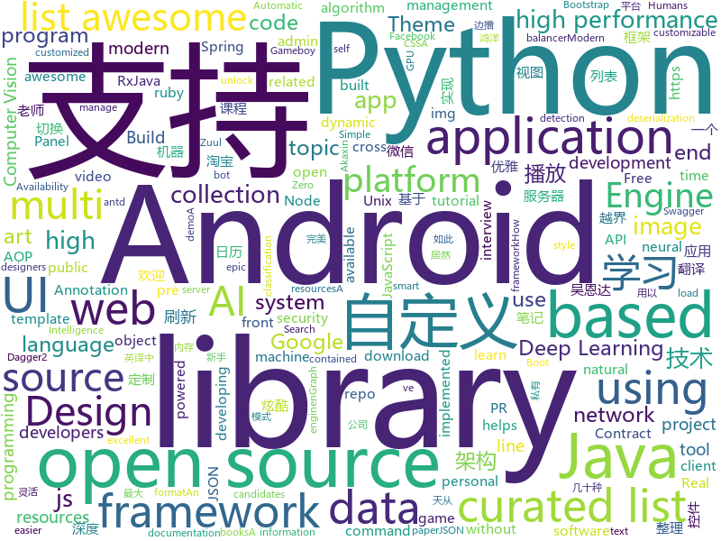

# 2018-05-26
See what the GitHub community is most excited about today.

## python
* [black](https://github.com/ambv/black)(**477 stars today**): The uncompromising Python code formatter
* [easy-tensorflow](https://github.com/easy-tensorflow/easy-tensorflow)(**208 stars today**): Simple and comprehensive tutorials in TensorFlow
* [nlp-architect](https://github.com/NervanaSystems/nlp-architect)(**195 stars today**): NLP Architect by Intel AI Lab: Python library for exploring the state-of-the-art deep learning topologies and techniques for natural language processing and natural language understanding
* [Python-100-Days](https://github.com/jackfrued/Python-100-Days)(**175 stars today**): Python - 100天从新手到大师
* [models](https://github.com/tensorflow/models)(**70 stars today**): Models and examples built with TensorFlow
* [awesome-python](https://github.com/vinta/awesome-python)(**50 stars today**): A curated list of awesome Python frameworks, libraries, software and resources
* [public-apis](https://github.com/toddmotto/public-apis)(**48 stars today**): A collective list of public JSON APIs for use in web development.
* [keras](https://github.com/keras-team/keras)(**40 stars today**): Deep Learning for humans
* [tapioca](https://github.com/CERTCC/tapioca)(**48 stars today**): CERT Tapioca for MITM network analysis
* [flask](https://github.com/pallets/flask)(**39 stars today**): The Python micro framework for building web applications.
* [you-get](https://github.com/soimort/you-get)(**41 stars today**): ⏬Dumb downloader that scrapes the web
* [cpython](https://github.com/python/cpython)(**29 stars today**): The Python programming language
* [retro](https://github.com/openai/retro)(**35 stars today**): Retro Games in Gym
* [routersploit](https://github.com/threat9/routersploit)(**33 stars today**): Exploitation Framework for Embedded Devices
* [scikit-learn](https://github.com/scikit-learn/scikit-learn)(**28 stars today**): scikit-learn: machine learning in Python
* [youtube-dl](https://github.com/rg3/youtube-dl)(**33 stars today**): Command-line program to download videos from YouTube.com and other video sites
* [django](https://github.com/django/django)(**28 stars today**): The Web framework for perfectionists with deadlines.
* [ImageAI](https://github.com/OlafenwaMoses/ImageAI)(**27 stars today**): A python library built to empower developers to build applications and systems with self-contained Computer Vision capabilities
* [semi-auto-image-annotation-tool](https://github.com/virajmavani/semi-auto-image-annotation-tool)(**32 stars today**): Anno-Mage: A Semi Automatic Image Annotation Tool which helps you in annotating images by suggesting you annotations for 80 object classes using a pre-trained model
* [skorch](https://github.com/dnouri/skorch)(**32 stars today**): A scikit-learn compatible neural network library that wraps pytorch
* [Galileo](https://github.com/m4ll0k/Galileo)(**30 stars today**): Galileo - Web Application Audit Framework
* [Learning-to-See-in-the-Dark](https://github.com/cchen156/Learning-to-See-in-the-Dark)(**30 stars today**): 
* [pipenv](https://github.com/pypa/pipenv)(**30 stars today**): Python Development Workflow for Humans.
* [algo](https://github.com/trailofbits/algo)(**29 stars today**): Set up a personal IPSEC VPN in the cloud
* [home-assistant](https://github.com/home-assistant/home-assistant)(**23 stars today**): 🏡Open-source home automation platform running on Python 3

## java
* [LayoutManagerGroup](https://github.com/DingMouRen/LayoutManagerGroup)(**205 stars today**): 👉自定义LayoutManager，炫酷列表
* [coffee-gb](https://github.com/trekawek/coffee-gb)(**165 stars today**): Gameboy emulator in Java 8.
* [UETool](https://github.com/eleme/UETool)(**87 stars today**): Show/edit any view's attributions on the screen.
* [micronaut-core](https://github.com/micronaut-projects/micronaut-core)(**73 stars today**): Micronaut Application Framework
* [proxyee-down](https://github.com/proxyee-down-org/proxyee-down)(**65 stars today**): http下载工具，基于http代理，支持多连接分块下载
* [zuul](https://github.com/Netflix/zuul)(**61 stars today**): Zuul is a gateway service that provides dynamic routing, monitoring, resiliency, security, and more.
* [openzaly](https://github.com/akaxincom/openzaly)(**57 stars today**): openzaly 是 Akaxin 的服务器源代码，用以搭建私有聊天服务器。
* [spring-boot](https://github.com/spring-projects/spring-boot)(**47 stars today**): Spring Boot
* [RxImagePicker](https://github.com/qingmei2/RxImagePicker)(**54 stars today**): 🌟支持RxJava2、灵活可高度定制的Android图片选择架构，提供了微信和知乎主题的UI支持。
* [fingen](https://github.com/YoshiOne/fingen)(**46 stars today**): Универсальное андроид-приложение для учета доходов и расходов со встроенным парсером смс.
* [java-design-patterns](https://github.com/iluwatar/java-design-patterns)(**40 stars today**): Design patterns implemented in Java
* [XAOP](https://github.com/xuexiangjys/XAOP)(**48 stars today**): 一个轻量级的AOP(Android)应用框架。囊括了最实用的AOP应用。
* [CalendarView](https://github.com/huanghaibin-dev/CalendarView)(**44 stars today**): Android上一个优雅、万能自定义UI、支持周视图、自定义周起始、性能高效的日历控件，支持热插拔实现的UI定制！支持标记、自定义颜色、农历、自定义月视图各种显示模式等。Canvas绘制，速度快、占用内存低，你真的想不到日历居然还可以如此优雅！An elegant, highly customized and high-performance Calendar Widget on Android.
* [material-components-android](https://github.com/material-components/material-components-android)(**42 stars today**): Modular and customizable Material Design UI components for Android
* [SmartRefreshLayout](https://github.com/scwang90/SmartRefreshLayout)(**40 stars today**): 🔥下拉刷新、上拉加载、二级刷新、淘宝二楼、RefreshLayout、OverScroll，Android智能下拉刷新框架，支持越界回弹、越界拖动，具有极强的扩展性，集成了几十种炫酷的Header和 Footer。
* [MVPArms](https://github.com/JessYanCoding/MVPArms)(**38 stars today**): A common architecture for Android applications developing based on MVP, integrates many open source projects (like Dagger2、Rxjava、Retrofit ...), to make your developing quicker and easier.
* [tutorials](https://github.com/eugenp/tutorials)(**26 stars today**): The "REST With Spring" Course:
* [Java](https://github.com/TheAlgorithms/Java)(**30 stars today**): All Algorithms implemented in Java
* [incubator-dubbo](https://github.com/apache/incubator-dubbo)(**30 stars today**): Apache Dubbo (incubating) is a high-performance, java based, open source RPC framework.
* [VirtualXposed](https://github.com/android-hacker/VirtualXposed)(**34 stars today**): A Simple App to use Xposed without root or unlock the bootloader(or modify system image etc).
* [dkplayer](https://github.com/dueeeke/dkplayer)(**33 stars today**): 基于IjkPlayer的视频播放器，支持直播点播，悬浮窗播放，广告播放，边播边缓存；支持重力感应自动全屏；完美实现ListView和RecyclerView列表播放；支持清晰度切换；支持一行代码切换MediaPlayer和ExoPlayer；模仿抖音效果demo；Android O PiP demo
* [Signal-Android](https://github.com/signalapp/Signal-Android)(**28 stars today**): A private messenger for Android.
* [MeiWidgetView](https://github.com/HpWens/MeiWidgetView)(**29 stars today**): 一款汇总了郭霖，鸿洋，以及自己平时收集的自定义控件集合库
* [RxJava](https://github.com/ReactiveX/RxJava)(**28 stars today**): RxJava – Reactive Extensions for the JVM – a library for composing asynchronous and event-based programs using observable sequences for the Java VM.
* [elasticsearch](https://github.com/elastic/elasticsearch)(**23 stars today**): Open Source, Distributed, RESTful Search Engine

## unknown
* [build-your-own-x](https://github.com/danistefanovic/build-your-own-x)(**576 stars today**): 🤓Build your own (insert technology here)
* [architect-awesome](https://github.com/xingshaocheng/architect-awesome)(**230 stars today**): 后端架构师技术图谱
* [architecture.of.internet-product](https://github.com/davideuler/architecture.of.internet-product)(**143 stars today**): 互联网公司技术架构，微信/淘宝/微博/腾讯/阿里/美团点评/百度/Google/Facebook/Amazon/eBay的架构，欢迎PR补充
* [Interview-Notebook](https://github.com/CyC2018/Interview-Notebook)(**135 stars today**): 📚技术面试需要掌握的基础知识整理，欢迎编辑~
* [manager-readme](https://github.com/yoshiori/manager-readme)(**146 stars today**): 
* [playbook](https://github.com/avito-tech/playbook)(**113 stars today**): AvitoTech team playbook
* [awesome](https://github.com/sindresorhus/awesome)(**67 stars today**): 😎Curated list of awesome lists
* [Hackintosh-Installer-University](https://github.com/huangyz0918/Hackintosh-Installer-University)(**66 stars today**): open source tutorial & information collector for hackintosh installation.💻➕🍎
* [You-Dont-Know-JS](https://github.com/getify/You-Dont-Know-JS)(**63 stars today**): A book series on JavaScript. @YDKJS on twitter.
* [gitignore](https://github.com/github/gitignore)(**51 stars today**): A collection of useful .gitignore templates
* [awesome-vue](https://github.com/vuejs/awesome-vue)(**56 stars today**): 🎉A curated list of awesome things related to Vue.js
* [free-programming-books](https://github.com/EbookFoundation/free-programming-books)(**46 stars today**): 📚Freely available programming books
* [coding-interview-university](https://github.com/jwasham/coding-interview-university)(**46 stars today**): A complete computer science study plan to become a software engineer.
* [daily-paper-computer-vision](https://github.com/amusi/daily-paper-computer-vision)(**46 stars today**): 记录每天整理的计算机视觉/深度学习/机器学习相关方向的论文
* [awesome-flutter](https://github.com/Solido/awesome-flutter)(**47 stars today**): Quickly find available resources to grow your Flutter projects !
* [gold-miner](https://github.com/xitu/gold-miner)(**41 stars today**): 🥇掘金翻译计划，可能是世界最大最好的英译中技术社区，最懂读者和译者的翻译平台：
* [forum](https://github.com/getlantern/forum)(**39 stars today**): 蓝灯(Lantern)官方论坛
* [awesome-docker](https://github.com/veggiemonk/awesome-docker)(**39 stars today**): 🐳A curated list of Docker resources and projects
* [awesome-public-datasets](https://github.com/awesomedata/awesome-public-datasets)(**39 stars today**): A topic-centric list of high-quality open datasets in public domains. Propose NEW data ☛☛☛PR☛☛☛
* [Front-end-Developer-Interview-Questions](https://github.com/h5bp/Front-end-Developer-Interview-Questions)(**33 stars today**): A list of helpful front-end related questions you can use to interview potential candidates, test yourself or completely ignore.
* [awesome-ruby-china](https://github.com/liukun-lk/awesome-ruby-china)(**35 stars today**): A collection of excellent topics. https://ruby-china.org/topics/excellent
* [awesome-scalability](https://github.com/binhnguyennus/awesome-scalability)(**32 stars today**): High Scalability, High Availability, High Stability, High Performance, and High Intelligence Back-End Design Patterns
* [project-based-learning](https://github.com/tuvtran/project-based-learning)(**29 stars today**): Curated list of project-based tutorials
* [SwiftTips](https://github.com/JohnSundell/SwiftTips)(**27 stars today**): A collection of Swift tips & tricks that I've shared on Twitter
* [awesome-computer-vision](https://github.com/jbhuang0604/awesome-computer-vision)(**23 stars today**): A curated list of awesome computer vision resources

## c++
* [tensorflow](https://github.com/tensorflow/tensorflow)(**118 stars today**): Computation using data flow graphs for scalable machine learning
* [electron](https://github.com/electron/electron)(**55 stars today**): Build cross platform desktop apps with JavaScript, HTML, and CSS
* [katran](https://github.com/facebookincubator/katran)(**56 stars today**): A high performance layer 4 load balancer
* [bsf](https://github.com/GameFoundry/bsf)(**53 stars today**): Modern C++14 library for the development of real-time graphical applications
* [bitcoin](https://github.com/bitcoin/bitcoin)(**39 stars today**): Bitcoin Core integration/staging tree
* [opencv](https://github.com/opencv/opencv)(**36 stars today**): Open Source Computer Vision Library
* [protobuf](https://github.com/google/protobuf)(**39 stars today**): Protocol Buffers - Google's data interchange format
* [eos](https://github.com/EOSIO/eos)(**34 stars today**): An open source smart contract platform
* [pytorch](https://github.com/pytorch/pytorch)(**31 stars today**): Tensors and Dynamic neural networks in Python with strong GPU acceleration
* [aseprite](https://github.com/aseprite/aseprite)(**33 stars today**): Animated sprite editor & pixel art tool (Windows, macOS, Linux)
* [tesseract](https://github.com/tesseract-ocr/tesseract)(**29 stars today**): Tesseract Open Source OCR Engine (main repository)
* [grpc](https://github.com/grpc/grpc)(**25 stars today**): The C based gRPC (C++, Python, Ruby, Objective-C, PHP, C#)
* [aria2](https://github.com/aria2/aria2)(**27 stars today**): aria2 is a lightweight multi-protocol & multi-source, cross platform download utility operated in command-line. It supports HTTP/HTTPS, FTP, SFTP, BitTorrent and Metalink.
* [PhoenixGo](https://github.com/Tencent/PhoenixGo)(**24 stars today**): Go AI program which implement the AlphaGo Zero paper
* [json](https://github.com/nlohmann/json)(**22 stars today**): JSON for Modern C++
* [godot](https://github.com/godotengine/godot)(**22 stars today**): Godot Engine – Multi-platform 2D and 3D game engine
* [ngraph](https://github.com/NervanaSystems/ngraph)(**23 stars today**): nGraph is an open source C++ library, compiler and runtime for Deep Learning frameworks
* [libui-node](https://github.com/parro-it/libui-node)(**22 stars today**): Node bindings for libui, an awesome native UI library for Unix, OSX and Windows
* [apollo](https://github.com/ApolloAuto/apollo)(**20 stars today**): An open autonomous driving platform
* [cosmos](https://github.com/OpenGenus/cosmos)(**21 stars today**): Algorithms that run our universe | Your personal library of every algorithm and data structure code that you will ever encounter | Ask us anything at our forum
* [vsc-material-theme](https://github.com/equinusocio/vsc-material-theme)(**21 stars today**): Material Theme, the most epic theme for Visual Studio Code
* [openpose](https://github.com/CMU-Perceptual-Computing-Lab/openpose)(**16 stars today**): OpenPose: Real-time multi-person keypoint detection library for body, face, and hands estimation
* [v8](https://github.com/v8/v8)(**18 stars today**): The official mirror of the V8 Git repository
* [solidity](https://github.com/ethereum/solidity)(**17 stars today**): Solidity, the Contract-Oriented Programming Language
* [libgo](https://github.com/yyzybb537/libgo)(**16 stars today**): Go-style concurrency in C++11

## html
* [GTFOBins.github.io](https://github.com/GTFOBins/GTFOBins.github.io)(**41 stars today**): Curated list of Unix binaries that can be exploited to bypass system security restrictions
* [Coursera-ML-AndrewNg-Notes](https://github.com/fengdu78/Coursera-ML-AndrewNg-Notes)(**33 stars today**): 吴恩达老师的机器学习课程个人笔记
* [deeplearning_ai_books](https://github.com/fengdu78/deeplearning_ai_books)(**30 stars today**): deeplearning.ai（吴恩达老师的深度学习课程笔记及资源）
* [awesome-mac](https://github.com/jaywcjlove/awesome-mac)(**28 stars today**):  This repo is a collection of awesome Mac applications and tools for developers and designers.
* [AdminLTE](https://github.com/almasaeed2010/AdminLTE)(**23 stars today**): AdminLTE - Free Premium Admin control Panel Theme Based On Bootstrap 3.x
* [styleguide](https://github.com/google/styleguide)(**20 stars today**): Style guides for Google-originated open-source projects
* [archerysec](https://github.com/archerysec/archerysec)(**19 stars today**): Open Source Vulnerability Assessment and Management helps developers and pentesters to perform scans and manage vulnerabilities.
* [Spoon-Knife](https://github.com/octocat/Spoon-Knife)(****): This repo is for demonstration purposes only.
* [fastText](https://github.com/facebookresearch/fastText)(**16 stars today**): Library for fast text representation and classification.
* [core](https://github.com/stackblitz/core)(**16 stars today**): Online IDE powered by VS Code⚡️
* [gson](https://github.com/google/gson)(**15 stars today**): A Java serialization/deserialization library to convert Java Objects into JSON and back
* [swagger-codegen](https://github.com/swagger-api/swagger-codegen)(**15 stars today**): swagger-codegen contains a template-driven engine to generate documentation, API clients and server stubs in different languages by parsing your OpenAPI / Swagger definition.
* [polymer](https://github.com/Polymer/polymer)(**16 stars today**): Build modern apps using web components
* [img-2](https://github.com/RevillWeb/img-2)(**16 stars today**): Replace  elements with  to automatically pre-cache images and improve page performance.
* [EIPs](https://github.com/ethereum/EIPs)(**15 stars today**): The Ethereum Improvement Proposal repository
* [portainer](https://github.com/portainer/portainer)(**14 stars today**): Simple management UI for Docker
* [nodejs-ex](https://github.com/sclorg/nodejs-ex)(****): node.js example
* [react-app-rewired](https://github.com/timarney/react-app-rewired)(**15 stars today**): Override create-react-app webpack configs without ejecting
* [Hyphenopoly](https://github.com/mnater/Hyphenopoly)(**13 stars today**): JavaScript polyfill for client-side hyphenation
* [ng-alain](https://github.com/cipchk/ng-alain)(**12 stars today**): ng-zorro-antd admin panel front-end framework
* [node-interview](https://github.com/ElemeFE/node-interview)(**10 stars today**): How to pass the Node.js interview of ElemeFE.
* [awesome-creative-coding](https://github.com/terkelg/awesome-creative-coding)(**11 stars today**): 🎨Creative Coding: Generative Art, Data visualization, Interaction Design, Resources.
* [logo_builder](https://github.com/launchaco/logo_builder)(**9 stars today**): Free AI powered logo builder
* [the-power-of-prolog](https://github.com/triska/the-power-of-prolog)(**10 stars today**): Introduction to modern Prolog
* [zenbot](https://github.com/DeviaVir/zenbot)(**10 stars today**): Zenbot is a command-line cryptocurrency trading bot using Node.js and MongoDB.

## WordCloud

