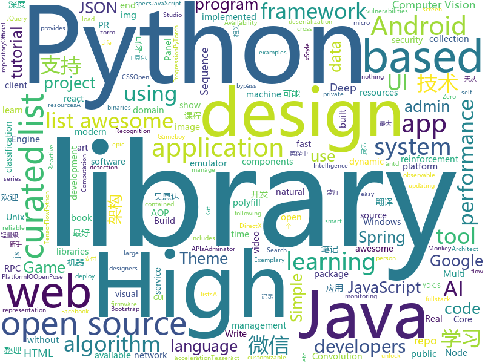

# 2018-05-27
See what the GitHub community is most excited about today.

## python
* [black](https://github.com/ambv/black)(**503 stars today**): The uncompromising Python code formatter
* [monkey](https://github.com/guardicore/monkey)(**252 stars today**): Infection Monkey - An automated pentest tool
* [SmoothLife](https://github.com/duckythescientist/SmoothLife)(**199 stars today**): Continuous Domain Game of Life in Python with Numpy
* [nlp-architect](https://github.com/NervanaSystems/nlp-architect)(**180 stars today**): NLP Architect by Intel AI Lab: Python library for exploring the state-of-the-art deep learning topologies and techniques for natural language processing and natural language understanding
* [retro](https://github.com/openai/retro)(**147 stars today**): Retro Games in Gym
* [easy-tensorflow](https://github.com/easy-tensorflow/easy-tensorflow)(**70 stars today**): Simple and comprehensive tutorials in TensorFlow
* [models](https://github.com/tensorflow/models)(**46 stars today**): Models and examples built with TensorFlow
* [Python-100-Days](https://github.com/jackfrued/Python-100-Days)(**47 stars today**): Python - 100天从新手到大师
* [RLSeq2Seq](https://github.com/yaserkl/RLSeq2Seq)(**45 stars today**): Deep Reinforcement Learning For Sequence to Sequence Models
* [awesome-python](https://github.com/vinta/awesome-python)(**40 stars today**): A curated list of awesome Python frameworks, libraries, software and resources
* [ImageAI](https://github.com/OlafenwaMoses/ImageAI)(**39 stars today**): A python library built to empower developers to build applications and systems with self-contained Computer Vision capabilities
* [youtube-dl](https://github.com/rg3/youtube-dl)(**37 stars today**): Command-line program to download videos from YouTube.com and other video sites
* [label-refinery](https://github.com/hessamb/label-refinery)(**36 stars today**): Label Refinery: Improving ImageNet Classification through Label Progression
* [R2Plus1D-PyTorch](https://github.com/irhumshafkat/R2Plus1D-PyTorch)(**35 stars today**): PyTorch implementation of the R2Plus1D convolution based ResNet architecture described in the paper "A Closer Look at Spatiotemporal Convolutions for Action Recognition"
* [public-apis](https://github.com/toddmotto/public-apis)(**31 stars today**): A collective list of public JSON APIs for use in web development.
* [AI_For_Music_Composition](https://github.com/llSourcell/AI_For_Music_Composition)(**30 stars today**): This is the code for "AI for Music Composition" by Siraj Raval on Youtube
* [django](https://github.com/django/django)(**24 stars today**): The Web framework for perfectionists with deadlines.
* [keras](https://github.com/keras-team/keras)(**25 stars today**): Deep Learning for humans
* [flask](https://github.com/pallets/flask)(**27 stars today**): The Python micro framework for building web applications.
* [you-get](https://github.com/soimort/you-get)(**26 stars today**): ⏬Dumb downloader that scrapes the web
* [Emojinator](https://github.com/akshaybahadur21/Emojinator)(**23 stars today**): A simple emoji classifier for humans.
* [scikit-learn](https://github.com/scikit-learn/scikit-learn)(**18 stars today**): scikit-learn: machine learning in Python
* [tapioca](https://github.com/CERTCC/tapioca)(**25 stars today**): CERT Tapioca for MITM network analysis
* [gym](https://github.com/openai/gym)(**22 stars today**): A toolkit for developing and comparing reinforcement learning algorithms.
* [system-design-primer](https://github.com/donnemartin/system-design-primer)(**21 stars today**): Learn how to design large-scale systems. Prep for the system design interview. Includes Anki flashcards.

## java
* [proxyee-down](https://github.com/proxyee-down-org/proxyee-down)(**61 stars today**): http下载工具，基于http代理，支持多连接分块下载
* [LayoutManagerGroup](https://github.com/DingMouRen/LayoutManagerGroup)(**54 stars today**): 👉自定义LayoutManager，炫酷列表
* [coffee-gb](https://github.com/trekawek/coffee-gb)(**34 stars today**): Gameboy emulator in Java 8.
* [java-design-patterns](https://github.com/iluwatar/java-design-patterns)(**27 stars today**): Design patterns implemented in Java
* [Signal-Android](https://github.com/signalapp/Signal-Android)(**27 stars today**): A private messenger for Android.
* [spring-boot](https://github.com/spring-projects/spring-boot)(**22 stars today**): Spring Boot
* [zuul](https://github.com/Netflix/zuul)(**24 stars today**): Zuul is a gateway service that provides dynamic routing, monitoring, resiliency, security, and more.
* [spring-framework](https://github.com/spring-projects/spring-framework)(**13 stars today**): Spring Framework
* [Java](https://github.com/TheAlgorithms/Java)(**20 stars today**): All Algorithms implemented in Java
* [guava](https://github.com/google/guava)(**20 stars today**): Google core libraries for Java
* [RxJava](https://github.com/ReactiveX/RxJava)(**20 stars today**): RxJava – Reactive Extensions for the JVM – a library for composing asynchronous and event-based programs using observable sequences for the Java VM.
* [tutorials](https://github.com/eugenp/tutorials)(**12 stars today**): The "REST With Spring" Course:
* [elasticsearch](https://github.com/elastic/elasticsearch)(**17 stars today**): Open Source, Distributed, RESTful Search Engine
* [VirtualXposed](https://github.com/android-hacker/VirtualXposed)(**18 stars today**): A Simple App to use Xposed without root or unlock the bootloader(or modify system image etc).
* [AndroidUtilCode](https://github.com/Blankj/AndroidUtilCode)(**15 stars today**): 🔥Android developers should collect the following utils(updating).
* [weixin-java-tools](https://github.com/Wechat-Group/weixin-java-tools)(**13 stars today**): 可能是目前最好最全的微信Java开发工具包，支持包括微信支付、开放平台、小程序、企业号和公众号等的开发
* [UETool](https://github.com/eleme/UETool)(**16 stars today**): Show/edit any view's attributions on the screen.
* [micronaut-core](https://github.com/micronaut-projects/micronaut-core)(**15 stars today**): Micronaut Application Framework
* [incubator-dubbo](https://github.com/apache/incubator-dubbo)(**14 stars today**): Apache Dubbo (incubating) is a high-performance, java based, open source RPC framework.
* [XAOP](https://github.com/xuexiangjys/XAOP)(**13 stars today**): 一个轻量级的AOP(Android)应用框架。囊括了最实用的AOP应用。
* [okhttp](https://github.com/square/okhttp)(**12 stars today**): An HTTP+HTTP/2 client for Android and Java applications.
* [material-components-android](https://github.com/material-components/material-components-android)(**12 stars today**): Modular and customizable Material Design UI components for Android
* [RxImagePicker](https://github.com/qingmei2/RxImagePicker)(**12 stars today**): 🌟支持RxJava2、灵活可高度定制的Android图片选择架构，提供了微信和知乎主题的UI支持。
* [fastjson](https://github.com/alibaba/fastjson)(**10 stars today**): 🚄A fast JSON parser/generator for Java
* [hadoop](https://github.com/apache/hadoop)(**10 stars today**): Mirror of Apache Hadoop

## unknown
* [build-your-own-x](https://github.com/danistefanovic/build-your-own-x)(**333 stars today**): 🤓Build your own (insert technology here)
* [architect-awesome](https://github.com/xingshaocheng/architect-awesome)(**120 stars today**): 后端架构师技术图谱
* [architecture.of.internet-product](https://github.com/davideuler/architecture.of.internet-product)(**97 stars today**): 互联网公司技术架构，微信/淘宝/微博/腾讯/阿里/美团点评/百度/Google/Facebook/Amazon/eBay的架构，欢迎PR补充
* [awesome-public-datasets](https://github.com/awesomedata/awesome-public-datasets)(**76 stars today**): A topic-centric list of high-quality open datasets in public domains. Propose NEW data ☛☛☛PR☛☛☛
* [free-programming-books](https://github.com/EbookFoundation/free-programming-books)(**46 stars today**): 📚Freely available programming books
* [awesome](https://github.com/sindresorhus/awesome)(**45 stars today**): 😎Curated list of awesome lists
* [gitignore](https://github.com/github/gitignore)(**32 stars today**): A collection of useful .gitignore templates
* [Hackintosh-Installer-University](https://github.com/huangyz0918/Hackintosh-Installer-University)(**44 stars today**): open source tutorial & information collector for hackintosh installation.💻➕🍎
* [playbook](https://github.com/avito-tech/playbook)(**43 stars today**): AvitoTech team playbook
* [daily-paper-computer-vision](https://github.com/amusi/daily-paper-computer-vision)(**40 stars today**): 记录每天整理的计算机视觉/深度学习/机器学习相关方向的论文
* [coding-interview-university](https://github.com/jwasham/coding-interview-university)(**37 stars today**): A complete computer science study plan to become a software engineer.
* [You-Dont-Know-JS](https://github.com/getify/You-Dont-Know-JS)(**39 stars today**): A book series on JavaScript. @YDKJS on twitter.
* [Interview-Notebook](https://github.com/CyC2018/Interview-Notebook)(**39 stars today**): 📚技术面试需要掌握的基础知识整理，欢迎编辑~
* [jest-cheat-sheet](https://github.com/sapegin/jest-cheat-sheet)(**38 stars today**): Jest cheat sheet
* [awesome-docker](https://github.com/veggiemonk/awesome-docker)(**29 stars today**): 🐳A curated list of Docker resources and projects
* [awesome-vue](https://github.com/vuejs/awesome-vue)(**28 stars today**): 🎉A curated list of awesome things related to Vue.js
* [forum](https://github.com/getlantern/forum)(**25 stars today**): 蓝灯(Lantern)官方论坛
* [awesome-computer-vision](https://github.com/jbhuang0604/awesome-computer-vision)(**22 stars today**): A curated list of awesome computer vision resources
* [manager-readme](https://github.com/yoshiori/manager-readme)(**22 stars today**): 
* [gold-miner](https://github.com/xitu/gold-miner)(**21 stars today**): 🥇掘金翻译计划，可能是世界最大最好的英译中技术社区，最懂读者和译者的翻译平台：
* [awesome-scalability](https://github.com/binhnguyennus/awesome-scalability)(**20 stars today**): High Scalability, High Availability, High Stability, High Performance, and High Intelligence Back-End Design Patterns
* [nocode](https://github.com/kelseyhightower/nocode)(**20 stars today**): The best way to write secure and reliable applications. Write nothing; deploy nowhere.
* [awesome-nodejs](https://github.com/sindresorhus/awesome-nodejs)(**18 stars today**): ⚡️Delightful Node.js packages and resources
* [project-based-learning](https://github.com/tuvtran/project-based-learning)(**18 stars today**): Curated list of project-based tutorials
* [realworld](https://github.com/gothinkster/realworld)(**18 stars today**): "The mother of all demo apps" — Exemplary fullstack Medium.com clone powered by React, Angular, Node, Django, and many more🏅

## c++
* [tensorflow](https://github.com/tensorflow/tensorflow)(**90 stars today**): Computation using data flow graphs for scalable machine learning
* [nanorpc](https://github.com/tdv/nanorpc)(**34 stars today**): nanorpc - lightweight RPC in pure C++ 17
* [bitcoin](https://github.com/bitcoin/bitcoin)(**26 stars today**): Bitcoin Core integration/staging tree
* [bsf](https://github.com/GameFoundry/bsf)(**30 stars today**): Modern C++14 library for the development of real-time graphical applications
* [electron](https://github.com/electron/electron)(**27 stars today**): Build cross platform desktop apps with JavaScript, HTML, and CSS
* [opencv](https://github.com/opencv/opencv)(**16 stars today**): Open Source Computer Vision Library
* [eos](https://github.com/EOSIO/eos)(**19 stars today**): An open source smart contract platform
* [aseprite](https://github.com/aseprite/aseprite)(**21 stars today**): Animated sprite editor & pixel art tool (Windows, macOS, Linux)
* [cosmos](https://github.com/OpenGenus/cosmos)(**19 stars today**): Algorithms that run our universe | Your personal library of every algorithm and data structure code that you will ever encounter | Ask us anything at our forum
* [pytorch](https://github.com/pytorch/pytorch)(**13 stars today**): Tensors and Dynamic neural networks in Python with strong GPU acceleration
* [tesseract](https://github.com/tesseract-ocr/tesseract)(**15 stars today**): Tesseract Open Source OCR Engine (main repository)
* [katran](https://github.com/facebookincubator/katran)(**14 stars today**): A high performance layer 4 load balancer
* [json](https://github.com/nlohmann/json)(**14 stars today**): JSON for Modern C++
* [cutter](https://github.com/radareorg/cutter)(**13 stars today**): A Qt and C++ GUI for radare2 reverse engineering framework
* [Sonoff-Tasmota](https://github.com/arendst/Sonoff-Tasmota)(**11 stars today**): Provide ESP8266 based itead Sonoff with Web, MQTT and OTA firmware using Arduino IDE or PlatformIO
* [openpose](https://github.com/CMU-Perceptual-Computing-Lab/openpose)(**11 stars today**): OpenPose: Real-time multi-person keypoint detection library for body, face, and hands estimation
* [vsc-material-theme](https://github.com/equinusocio/vsc-material-theme)(**12 stars today**): Material Theme, the most epic theme for Visual Studio Code
* [grpc](https://github.com/grpc/grpc)(**11 stars today**): The C based gRPC (C++, Python, Ruby, Objective-C, PHP, C#)
* [PhoenixGo](https://github.com/Tencent/PhoenixGo)(**11 stars today**): Go AI program which implement the AlphaGo Zero paper
* [apollo](https://github.com/ApolloAuto/apollo)(**10 stars today**): An open autonomous driving platform
* [cmder](https://github.com/cmderdev/cmder)(**10 stars today**): Lovely console emulator package for Windows
* [PacVim](https://github.com/jmoon018/PacVim)(**11 stars today**): 
* [glTF-DXViewer](https://github.com/Microsoft/glTF-DXViewer)(**11 stars today**): Sample to show import and DirectX rendering for glTF files
* [godot](https://github.com/godotengine/godot)(**10 stars today**): Godot Engine – Multi-platform 2D and 3D game engine
* [libui-node](https://github.com/parro-it/libui-node)(**10 stars today**): Node bindings for libui, an awesome native UI library for Unix, OSX and Windows

## html
* [Coursera-ML-AndrewNg-Notes](https://github.com/fengdu78/Coursera-ML-AndrewNg-Notes)(**30 stars today**): 吴恩达老师的机器学习课程个人笔记
* [deeplearning_ai_books](https://github.com/fengdu78/deeplearning_ai_books)(**28 stars today**): deeplearning.ai（吴恩达老师的深度学习课程笔记及资源）
* [patternfly](https://github.com/patternfly/patternfly)(**30 stars today**): This repo contains instructions and the HTML, CSS, and JQuery for the PatternFly project.
* [GTFOBins.github.io](https://github.com/GTFOBins/GTFOBins.github.io)(**29 stars today**): Curated list of Unix binaries that can be exploited to bypass system security restrictions
* [awesome-mac](https://github.com/jaywcjlove/awesome-mac)(**18 stars today**):  This repo is a collection of awesome Mac applications and tools for developers and designers.
* [AdminLTE](https://github.com/almasaeed2010/AdminLTE)(**14 stars today**): AdminLTE - Free Premium Admin control Panel Theme Based On Bootstrap 3.x
* [styleguide](https://github.com/google/styleguide)(**14 stars today**): Style guides for Google-originated open-source projects
* [patchwork](https://github.com/jlord/patchwork)(****): All the Git-it Workshop completers!
* [img-2](https://github.com/RevillWeb/img-2)(**14 stars today**): Replace  elements with  to automatically pre-cache images and improve page performance.
* [fastText](https://github.com/facebookresearch/fastText)(**11 stars today**): Library for fast text representation and classification.
* [archerysec](https://github.com/archerysec/archerysec)(**11 stars today**): Open Source Vulnerability Assessment and Management helps developers and pentesters to perform scans and manage vulnerabilities.
* [Hyphenopoly](https://github.com/mnater/Hyphenopoly)(**11 stars today**): JavaScript polyfill for client-side hyphenation
* [Spoon-Knife](https://github.com/octocat/Spoon-Knife)(****): This repo is for demonstration purposes only.
* [electron-api-demos](https://github.com/electron/electron-api-demos)(**10 stars today**): Explore the Electron APIs
* [Adminator-admin-dashboard](https://github.com/puikinsh/Adminator-admin-dashboard)(**9 stars today**): Adminator is a easy to use and well design admin dashboard template for web apps, websites, services and more
* [EIPs](https://github.com/ethereum/EIPs)(**8 stars today**): The Ethereum Improvement Proposal repository
* [Top10](https://github.com/OWASP/Top10)(**7 stars today**): Official OWASP Top 10 Document Repository
* [webcomponentsjs](https://github.com/webcomponents/webcomponentsjs)(**7 stars today**): A suite of polyfills supporting the HTML Web Components specs
* [GoJS](https://github.com/NorthwoodsSoftware/GoJS)(**7 stars today**): JavaScript diagramming library for interactive flowcharts, org charts, design tools, planning tools, visual languages.
* [portainer](https://github.com/portainer/portainer)(**6 stars today**): Simple management UI for Docker
* [react-app-rewired](https://github.com/timarney/react-app-rewired)(**6 stars today**): Override create-react-app webpack configs without ejecting
* [ng-alain](https://github.com/cipchk/ng-alain)(**5 stars today**): ng-zorro-antd admin panel front-end framework
* [gson](https://github.com/google/gson)(**6 stars today**): A Java serialization/deserialization library to convert Java Objects into JSON and back
* [polymer](https://github.com/Polymer/polymer)(**6 stars today**): Build modern apps using web components
* [fonts](https://github.com/google/fonts)(**6 stars today**): Font files available from Google Fonts

## WordCloud

