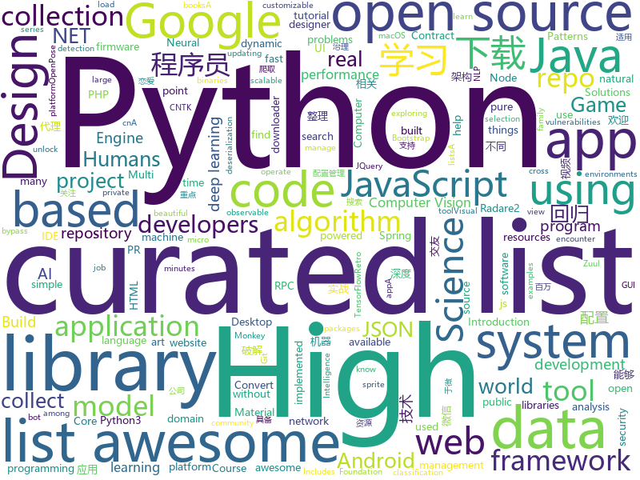

# 2018-05-28
See what the GitHub community is most excited about today.

## python
* [scylla](https://github.com/imWildCat/scylla)(**212 stars today**): Intelligent proxy pool for Humans™，为人类设计的智能代理池
* [black](https://github.com/ambv/black)(**169 stars today**): The uncompromising Python code formatter
* [nlp-architect](https://github.com/NervanaSystems/nlp-architect)(**137 stars today**): NLP Architect by Intel AI Lab: Python library for exploring the state-of-the-art deep learning topologies and techniques for natural language processing and natural language understanding
* [monkey](https://github.com/guardicore/monkey)(**110 stars today**): Infection Monkey - An automated pentest tool
* [yellowbrick](https://github.com/DistrictDataLabs/yellowbrick)(**111 stars today**): Visual analysis and diagnostic tools to facilitate machine learning model selection.
* [SmoothLife](https://github.com/duckythescientist/SmoothLife)(**79 stars today**): Continuous Domain Game of Life in Python with Numpy
* [python-spider](https://github.com/Jack-Cherish/python-spider)(**62 stars today**): 🌈Python3网络爬虫实战：VIP视频破解助手；GEETEST验证码破解；小说、动漫下载；手机APP爬取；财务报表入库；火车票抢票；抖音APP视频下载；百万英雄辅助；网易云音乐批量下载
* [models](https://github.com/tensorflow/models)(**46 stars today**): Models and examples built with TensorFlow
* [retro](https://github.com/openai/retro)(**61 stars today**): Retro Games in Gym
* [easy-tensorflow](https://github.com/easy-tensorflow/easy-tensorflow)(**44 stars today**): Simple and comprehensive tutorials in TensorFlow
* [awesome-python](https://github.com/vinta/awesome-python)(**41 stars today**): A curated list of awesome Python frameworks, libraries, software and resources
* [pypykatz](https://github.com/skelsec/pypykatz)(**44 stars today**): Mimikatz implementation in pure Python
* [MEAnalyzer](https://github.com/platomav/MEAnalyzer)(**38 stars today**): Intel Engine Firmware Analysis Tool
* [nano](https://github.com/UltimateHackers/nano)(**34 stars today**): Nano is a family of PHP web shells which are code golfed for stealth.
* [keras](https://github.com/keras-team/keras)(**26 stars today**): Deep Learning for humans
* [ImageAI](https://github.com/OlafenwaMoses/ImageAI)(**24 stars today**): A python library built to empower developers to build applications and systems with self-contained Computer Vision capabilities
* [flask](https://github.com/pallets/flask)(**25 stars today**): The Python micro framework for building web applications.
* [non-stationary_texture_syn](https://github.com/jessemelpolio/non-stationary_texture_syn)(**24 stars today**): Code used for texture synthesis using GAN
* [system-design-primer](https://github.com/donnemartin/system-design-primer)(**23 stars today**): Learn how to design large-scale systems. Prep for the system design interview. Includes Anki flashcards.
* [public-apis](https://github.com/toddmotto/public-apis)(**23 stars today**): A collective list of public JSON APIs for use in web development.
* [Emojinator](https://github.com/akshaybahadur21/Emojinator)(**18 stars today**): A simple emoji classifier for humans.
* [MMdnn](https://github.com/Microsoft/MMdnn)(**22 stars today**): MMdnn is a set of tools to help users inter-operate among different deep learning frameworks. E.g. model conversion and visualization. Convert models between Caffe, Keras, MXNet, Tensorflow, CNTK, PyTorch Onnx and CoreML.
* [you-get](https://github.com/soimort/you-get)(**20 stars today**): ⏬Dumb downloader that scrapes the web
* [gym](https://github.com/openai/gym)(**21 stars today**): A toolkit for developing and comparing reinforcement learning algorithms.
* [pipenv](https://github.com/pypa/pipenv)(**21 stars today**): Python Development Workflow for Humans.

## java
* [proxyee-down](https://github.com/proxyee-down-org/proxyee-down)(**83 stars today**): http下载工具，基于http代理，支持多连接分块下载
* [MyExample](https://github.com/whsgzcy/MyExample)(**57 stars today**): 
* [zuul](https://github.com/Netflix/zuul)(**48 stars today**): Zuul is a gateway service that provides dynamic routing, monitoring, resiliency, security, and more.
* [collect](https://github.com/opendatakit/collect)(**40 stars today**): ODK Collect is an Android app for filling out forms. It's been used to collect billions of data points in challenging environments around the world. Contribute and make the world a better place!✨📋✨
* [Signal-Android](https://github.com/signalapp/Signal-Android)(**36 stars today**): A private messenger for Android.
* [java-design-patterns](https://github.com/iluwatar/java-design-patterns)(**30 stars today**): Design patterns implemented in Java
* [spring-boot](https://github.com/spring-projects/spring-boot)(**25 stars today**): Spring Boot
* [LayoutManagerGroup](https://github.com/DingMouRen/LayoutManagerGroup)(**26 stars today**): 👉自定义LayoutManager，炫酷列表
* [Java](https://github.com/TheAlgorithms/Java)(**22 stars today**): All Algorithms implemented in Java
* [material-components-android](https://github.com/material-components/material-components-android)(**21 stars today**): Modular and customizable Material Design UI components for Android
* [tutorials](https://github.com/eugenp/tutorials)(**12 stars today**): The "REST With Spring" Course:
* [interviews](https://github.com/kdn251/interviews)(**20 stars today**): Everything you need to know to get the job.
* [guava](https://github.com/google/guava)(**19 stars today**): Google core libraries for Java
* [incubator-dubbo](https://github.com/apache/incubator-dubbo)(**15 stars today**): Apache Dubbo (incubating) is a high-performance, java based, open source RPC framework.
* [spring-framework](https://github.com/spring-projects/spring-framework)(**15 stars today**): Spring Framework
* [VirtualXposed](https://github.com/android-hacker/VirtualXposed)(**18 stars today**): A Simple App to use Xposed without root or unlock the bootloader(or modify system image etc).
* [apollo](https://github.com/ctripcorp/apollo)(**18 stars today**): Apollo（阿波罗）是携程框架部门研发的分布式配置中心，能够集中化管理应用不同环境、不同集群的配置，配置修改后能够实时推送到应用端，并且具备规范的权限、流程治理等特性，适用于微服务配置管理场景。
* [elasticsearch](https://github.com/elastic/elasticsearch)(**16 stars today**): Open Source, Distributed, RESTful Search Engine
* [UETool](https://github.com/eleme/UETool)(**17 stars today**): Show/edit any view's attributions on the screen.
* [micronaut-core](https://github.com/micronaut-projects/micronaut-core)(**14 stars today**): Micronaut Application Framework
* [hadoop](https://github.com/apache/hadoop)(**12 stars today**): Mirror of Apache Hadoop
* [AndroidUtilCode](https://github.com/Blankj/AndroidUtilCode)(**12 stars today**): 🔥Android developers should collect the following utils(updating).
* [fastjson](https://github.com/alibaba/fastjson)(**13 stars today**): 🚄A fast JSON parser/generator for Java
* [RxJava](https://github.com/ReactiveX/RxJava)(**12 stars today**): RxJava – Reactive Extensions for the JVM – a library for composing asynchronous and event-based programs using observable sequences for the Java VM.
* [LintCode](https://github.com/awangdev/LintCode)(**11 stars today**): Java Solutions to problems on LintCode/LeetCode

## unknown
* [build-your-own-x](https://github.com/danistefanovic/build-your-own-x)(**322 stars today**): 🤓Build your own (insert technology here)
* [awesome-public-datasets](https://github.com/awesomedata/awesome-public-datasets)(**122 stars today**): A topic-centric list of high-quality open datasets in public domains. Propose NEW data ☛☛☛PR☛☛☛
* [architecture.of.internet-product](https://github.com/davideuler/architecture.of.internet-product)(**59 stars today**): 互联网公司技术架构，微信/淘宝/微博/腾讯/阿里/美团点评/百度/Google/Facebook/Amazon/eBay的架构，欢迎PR补充
* [architect-awesome](https://github.com/xingshaocheng/architect-awesome)(**54 stars today**): 后端架构师技术图谱
* [lover-awesome](https://github.com/xixinjiejie/lover-awesome)(**58 stars today**): 重点解决程序员交友、程序员恋爱、程序员相亲、程序员找对象的问题，真正开源交友。我是细心姐姐。 微信搜索关注《大确幸》，有爱有行动。http://daquexing.cn
* [awesome-radare2](https://github.com/dukebarman/awesome-radare2)(**56 stars today**): A curated list of awesome projects, articles and the other materials powered by Radare2
* [awesome](https://github.com/sindresorhus/awesome)(**50 stars today**): 😎Curated list of awesome lists
* [DataSciComp](https://github.com/iphysresearch/DataSciComp)(**49 stars today**): A collection of popular Data Science Competitions
* [gitignore](https://github.com/github/gitignore)(**37 stars today**): A collection of useful .gitignore templates
* [You-Dont-Know-JS](https://github.com/getify/You-Dont-Know-JS)(**42 stars today**): A book series on JavaScript. @YDKJS on twitter.
* [Interview-Notebook](https://github.com/CyC2018/Interview-Notebook)(**40 stars today**): 📚技术面试需要掌握的基础知识整理，欢迎编辑~
* [coding-interview-university](https://github.com/jwasham/coding-interview-university)(**41 stars today**): A complete computer science study plan to become a software engineer.
* [awesome-computer-vision](https://github.com/jbhuang0604/awesome-computer-vision)(**44 stars today**): A curated list of awesome computer vision resources
* [what-to-code](https://github.com/joereynolds/what-to-code)(**44 stars today**): Ideas for things to program
* [free-programming-books](https://github.com/EbookFoundation/free-programming-books)(**39 stars today**): 📚Freely available programming books
* [compsci-answers](https://github.com/robotlolita/compsci-answers)(**34 stars today**): A collection of answers I gave on Quora, categorised and easier to find
* [awesome-vue](https://github.com/vuejs/awesome-vue)(**30 stars today**): 🎉A curated list of awesome things related to Vue.js
* [haskell-symbol-search-cheatsheet](https://github.com/takenobu-hs/haskell-symbol-search-cheatsheet)(**31 stars today**): Haskell/GHC symbol search cheatsheet
* [Hackintosh-Installer-University](https://github.com/huangyz0918/Hackintosh-Installer-University)(**28 stars today**): open source tutorial & information collector for hackintosh installation.💻➕🍎
* [daily-paper-computer-vision](https://github.com/amusi/daily-paper-computer-vision)(**24 stars today**): 记录每天整理的计算机视觉/深度学习/机器学习相关方向的论文
* [Awesome-Chinese-NLP](https://github.com/crownpku/Awesome-Chinese-NLP)(**23 stars today**): A curated list of resources for Chinese NLP 中文自然语言处理相关资料
* [awesome-scalability](https://github.com/binhnguyennus/awesome-scalability)(**22 stars today**): High Scalability, High Availability, High Stability, High Performance, and High Intelligence Back-End Design Patterns
* [awesome-courses](https://github.com/prakhar1989/awesome-courses)(**19 stars today**): 📚List of awesome university courses for learning Computer Science!
* [awesome-datascience](https://github.com/bulutyazilim/awesome-datascience)(**18 stars today**): 📝An awesome Data Science repository to learn and apply for real world problems.
* [awesome-nodejs](https://github.com/sindresorhus/awesome-nodejs)(**18 stars today**): ⚡️Delightful Node.js packages and resources

## c++
* [tensorflow](https://github.com/tensorflow/tensorflow)(**83 stars today**): Computation using data flow graphs for scalable machine learning
* [opencv](https://github.com/opencv/opencv)(**19 stars today**): Open Source Computer Vision Library
* [pytorch](https://github.com/pytorch/pytorch)(**23 stars today**): Tensors and Dynamic neural networks in Python with strong GPU acceleration
* [electron](https://github.com/electron/electron)(**22 stars today**): Build cross platform desktop apps with JavaScript, HTML, and CSS
* [solidity](https://github.com/ethereum/solidity)(**23 stars today**): Solidity, the Contract-Oriented Programming Language
* [tesseract](https://github.com/tesseract-ocr/tesseract)(**22 stars today**): Tesseract Open Source OCR Engine (main repository)
* [bitcoin](https://github.com/bitcoin/bitcoin)(**19 stars today**): Bitcoin Core integration/staging tree
* [grpc](https://github.com/grpc/grpc)(**18 stars today**): The C based gRPC (C++, Python, Ruby, Objective-C, PHP, C#)
* [tdesktop](https://github.com/telegramdesktop/tdesktop)(**17 stars today**): Telegram Desktop messaging app
* [cutter](https://github.com/radareorg/cutter)(**17 stars today**): A Qt and C++ GUI for radare2 reverse engineering framework
* [godot](https://github.com/godotengine/godot)(**15 stars today**): Godot Engine – Multi-platform 2D and 3D game engine
* [bsf](https://github.com/GameFoundry/bsf)(**15 stars today**): Modern C++14 library for the development of real-time graphical applications
* [nanorpc](https://github.com/tdv/nanorpc)(**16 stars today**): nanorpc - lightweight RPC in pure C++ 17
* [eos](https://github.com/EOSIO/eos)(**14 stars today**): An open source smart contract platform
* [openpose](https://github.com/CMU-Perceptual-Computing-Lab/openpose)(**14 stars today**): OpenPose: Real-time multi-person keypoint detection library for body, face, and hands estimation
* [modern-cpp-tutorial](https://github.com/changkun/modern-cpp-tutorial)(**14 stars today**): 📚C++11/14/17 On the Fly
* [apollo](https://github.com/ApolloAuto/apollo)(**14 stars today**): An open autonomous driving platform
* [protobuf](https://github.com/google/protobuf)(**14 stars today**): Protocol Buffers - Google's data interchange format
* [glow](https://github.com/pytorch/glow)(**14 stars today**): Compiler for Neural Network hardware accelerators
* [CLRS](https://github.com/gzc/CLRS)(**13 stars today**): 📓Solutions to Introduction to Algorithms
* [aseprite](https://github.com/aseprite/aseprite)(**13 stars today**): Animated sprite editor & pixel art tool (Windows, macOS, Linux)
* [cosmos](https://github.com/OpenGenus/cosmos)(**13 stars today**): Algorithms that run our universe | Your personal library of every algorithm and data structure code that you will ever encounter | Ask us anything at our forum
* [PhoenixGo](https://github.com/Tencent/PhoenixGo)(**12 stars today**): Go AI program which implement the AlphaGo Zero paper
* [katran](https://github.com/facebookincubator/katran)(**12 stars today**): A high performance layer 4 load balancer
* [Sonoff-Tasmota](https://github.com/arendst/Sonoff-Tasmota)(**12 stars today**): Provide ESP8266 based itead Sonoff with Web, MQTT and OTA firmware using Arduino IDE or PlatformIO

## html
* [patternfly](https://github.com/patternfly/patternfly)(**45 stars today**): This repo contains instructions and the HTML, CSS, and JQuery for the PatternFly project.
* [archerysec](https://github.com/archerysec/archerysec)(**23 stars today**): Open Source Vulnerability Assessment and Management helps developers and pentesters to perform scans and manage vulnerabilities.
* [GTFOBins.github.io](https://github.com/GTFOBins/GTFOBins.github.io)(**22 stars today**): Curated list of Unix binaries that can be exploited to bypass system security restrictions
* [deeplearning_ai_books](https://github.com/fengdu78/deeplearning_ai_books)(**15 stars today**): deeplearning.ai（吴恩达老师的深度学习课程笔记及资源）
* [awesome-mac](https://github.com/jaywcjlove/awesome-mac)(**15 stars today**):  This repo is a collection of awesome Mac applications and tools for developers and designers.
* [AdminLTE](https://github.com/almasaeed2010/AdminLTE)(**11 stars today**): AdminLTE - Free Premium Admin control Panel Theme Based On Bootstrap 3.x
* [Spoon-Knife](https://github.com/octocat/Spoon-Knife)(****): This repo is for demonstration purposes only.
* [core](https://github.com/stackblitz/core)(**11 stars today**): Online IDE powered by VS Code⚡️
* [styleguide](https://github.com/google/styleguide)(**10 stars today**): Style guides for Google-originated open-source projects
* [fonts](https://github.com/google/fonts)(**9 stars today**): Font files available from Google Fonts
* [zenbot](https://github.com/DeviaVir/zenbot)(**9 stars today**): Zenbot is a command-line cryptocurrency trading bot using Node.js and MongoDB.
* [Hyphenopoly](https://github.com/mnater/Hyphenopoly)(**8 stars today**): JavaScript polyfill for client-side hyphenation
* [Top10](https://github.com/OWASP/Top10)(**7 stars today**): Official OWASP Top 10 Document Repository
* [Machine-Learning](https://github.com/Jack-Cherish/Machine-Learning)(**6 stars today**): ⚡️机器学习实战（Python3）：kNN、决策树、贝叶斯、逻辑回归、SVM、线性回归、树回归
* [hugo-academic](https://github.com/gcushen/hugo-academic)(**5 stars today**): The website designer for Hugo. Build and deploy a beautiful website in minutes🚀
* [fastText](https://github.com/facebookresearch/fastText)(**7 stars today**): Library for fast text representation and classification.
* [dotnet](https://github.com/Microsoft/dotnet)(**6 stars today**): This repo is the official home of .NET on GitHub. It's a great starting point to find many .NET OSS projects from Microsoft and the community, including many that are part of the .NET Foundation.
* [gson](https://github.com/google/gson)(**6 stars today**): A Java serialization/deserialization library to convert Java Objects into JSON and back
* [portainer](https://github.com/portainer/portainer)(**5 stars today**): Simple management UI for Docker
* [fend-project-memory-game](https://github.com/udacity/fend-project-memory-game)(****): 
* [react-app-rewired](https://github.com/timarney/react-app-rewired)(**6 stars today**): Override create-react-app webpack configs without ejecting
* [node-ytdl-core](https://github.com/fent/node-ytdl-core)(**6 stars today**): Youtube downloader in javascript.
* [the-power-of-prolog](https://github.com/triska/the-power-of-prolog)(**6 stars today**): Introduction to modern Prolog
* [patchwork](https://github.com/jlord/patchwork)(****): All the Git-it Workshop completers!
* [awesome-angular](https://github.com/gdi2290/awesome-angular)(**5 stars today**): 📄A curated list of awesome Angular resources by @TipeIO

## WordCloud

