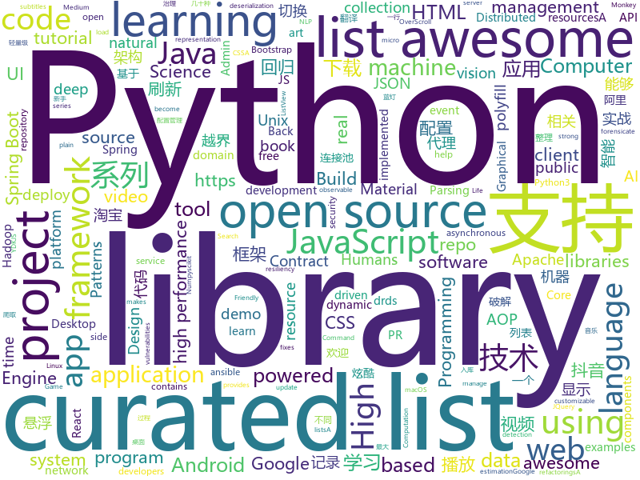

# 2018-05-29
See what the GitHub community is most excited about today.

## python
* [Douyin-Bot](https://github.com/wangshub/Douyin-Bot)(**438 stars today**): Python 抖音机器人，论如何在抖音上找到漂亮小姐姐？😍
* [scylla](https://github.com/imWildCat/scylla)(**342 stars today**): Intelligent proxy pool for Humans™，为人类设计的智能代理池
* [python-spider](https://github.com/Jack-Cherish/python-spider)(**240 stars today**): 🌈Python3网络爬虫实战：VIP视频破解助手；GEETEST验证码破解；小说、动漫下载；手机APP爬取；财务报表入库；火车票抢票；抖音APP视频下载；百万英雄辅助；网易云音乐批量下载
* [yellowbrick](https://github.com/DistrictDataLabs/yellowbrick)(**184 stars today**): Visual analysis and diagnostic tools to facilitate machine learning model selection.
* [black](https://github.com/ambv/black)(**169 stars today**): The uncompromising Python code formatter
* [nlp-architect](https://github.com/NervanaSystems/nlp-architect)(**143 stars today**): NLP Architect by Intel AI Lab: Python library for exploring the state-of-the-art deep learning topologies and techniques for natural language processing and natural language understanding
* [Python-100-Days](https://github.com/jackfrued/Python-100-Days)(**109 stars today**): Python - 100天从新手到大师
* [monkey](https://github.com/guardicore/monkey)(**94 stars today**): Infection Monkey - An automated pentest tool
* [models](https://github.com/tensorflow/models)(**69 stars today**): Models and examples built with TensorFlow
* [awesome-machine-learning](https://github.com/josephmisiti/awesome-machine-learning)(**62 stars today**): A curated list of awesome Machine Learning frameworks, libraries and software.
* [keras](https://github.com/keras-team/keras)(**53 stars today**): Deep Learning for humans
* [pypykatz](https://github.com/skelsec/pypykatz)(**56 stars today**): Mimikatz implementation in pure Python
* [public-apis](https://github.com/toddmotto/public-apis)(**48 stars today**): A collective list of public JSON APIs for use in web development.
* [Terminator](https://github.com/MohamedNourTN/Terminator)(**38 stars today**): Terminator metasploit payload generator
* [awesome-python](https://github.com/vinta/awesome-python)(**37 stars today**): A curated list of awesome Python frameworks, libraries, software and resources
* [docker-explorer](https://github.com/google/docker-explorer)(**41 stars today**): A tool to help forensicate offline docker acquisitions
* [django](https://github.com/django/django)(**29 stars today**): The Web framework for perfectionists with deadlines.
* [non-stationary_texture_syn](https://github.com/jessemelpolio/non-stationary_texture_syn)(**35 stars today**): Code used for texture synthesis using GAN
* [easy-tensorflow](https://github.com/easy-tensorflow/easy-tensorflow)(**35 stars today**): Simple and comprehensive tutorials in TensorFlow
* [flask](https://github.com/pallets/flask)(**33 stars today**): The Python micro framework for building web applications.
* [Python-Learning](https://github.com/chihaiyishen/Python-Learning)(**26 stars today**): 这里是「痴海」公众号，记录自己学习 python 的过程。
* [youtube-dl](https://github.com/rg3/youtube-dl)(**31 stars today**): Command-line program to download videos from YouTube.com and other video sites
* [SmoothLife](https://github.com/duckythescientist/SmoothLife)(**33 stars today**): Continuous Domain Game of Life in Python with Numpy
* [scikit-learn](https://github.com/scikit-learn/scikit-learn)(**30 stars today**): scikit-learn: machine learning in Python
* [ansible](https://github.com/ansible/ansible)(**24 stars today**): Ansible is a radically simple IT automation platform that makes your applications and systems easier to deploy. Avoid writing scripts or custom code to deploy and update your applications — automate in a language that approaches plain English, using SSH, with no agents to install on remote systems. https://docs.ansible.com/ansible/

## java
* [LayoutManagerGroup](https://github.com/DingMouRen/LayoutManagerGroup)(**146 stars today**): 👉自定义LayoutManager，炫酷列表
* [proxyee-down](https://github.com/proxyee-down-org/proxyee-down)(**123 stars today**): http下载工具，基于http代理，支持多连接分块下载
* [spring-boot-examples](https://github.com/ityouknow/spring-boot-examples)(**106 stars today**): about learning Spring Boot via examples. Spring Boot 技术栈示例代码，快速简单上手教程。
* [zuul](https://github.com/Netflix/zuul)(**63 stars today**): Zuul is a gateway service that provides dynamic routing, monitoring, resiliency, security, and more.
* [incubator-dubbo](https://github.com/apache/incubator-dubbo)(**42 stars today**): Apache Dubbo (incubating) is a high-performance, java based, open source RPC framework.
* [UETool](https://github.com/eleme/UETool)(**52 stars today**): Show/edit any view's attributions on the screen.
* [spring-boot](https://github.com/spring-projects/spring-boot)(**37 stars today**): Spring Boot
* [Java](https://github.com/TheAlgorithms/Java)(**41 stars today**): All Algorithms implemented in Java
* [java-design-patterns](https://github.com/iluwatar/java-design-patterns)(**35 stars today**): Design patterns implemented in Java
* [Signal-Android](https://github.com/signalapp/Signal-Android)(**37 stars today**): A private messenger for Android.
* [apollo](https://github.com/ctripcorp/apollo)(**37 stars today**): Apollo（阿波罗）是携程框架部门研发的分布式配置中心，能够集中化管理应用不同环境、不同集群的配置，配置修改后能够实时推送到应用端，并且具备规范的权限、流程治理等特性，适用于微服务配置管理场景。
* [elasticsearch](https://github.com/elastic/elasticsearch)(**30 stars today**): Open Source, Distributed, RESTful Search Engine
* [SmartRefreshLayout](https://github.com/scwang90/SmartRefreshLayout)(**33 stars today**): 🔥下拉刷新、上拉加载、二级刷新、淘宝二楼、RefreshLayout、OverScroll，Android智能下拉刷新框架，支持越界回弹、越界拖动，具有极强的扩展性，集成了几十种炫酷的Header和 Footer。
* [material-components-android](https://github.com/material-components/material-components-android)(**33 stars today**): Modular and customizable Material Design UI components for Android
* [tutorials](https://github.com/eugenp/tutorials)(**17 stars today**): The "REST With Spring" Course:
* [dkplayer](https://github.com/dueeeke/dkplayer)(**28 stars today**): 基于IjkPlayer的视频播放器，支持直播点播，悬浮窗播放，广告播放，边播边缓存；支持重力感应自动全屏；完美实现ListView和RecyclerView列表播放；支持清晰度切换；支持一行代码切换MediaPlayer和ExoPlayer；模仿抖音效果demo；Android O PiP demo
* [guava](https://github.com/google/guava)(**25 stars today**): Google core libraries for Java
* [spring-framework](https://github.com/spring-projects/spring-framework)(**24 stars today**): Spring Framework
* [RxJava](https://github.com/ReactiveX/RxJava)(**27 stars today**): RxJava – Reactive Extensions for the JVM – a library for composing asynchronous and event-based programs using observable sequences for the Java VM.
* [pai](https://github.com/Microsoft/pai)(**25 stars today**): Resource scheduling and cluster management for AI
* [hadoop](https://github.com/apache/hadoop)(**23 stars today**): Mirror of Apache Hadoop
* [XAOP](https://github.com/xuexiangjys/XAOP)(**27 stars today**): 一个轻量级的AOP(Android)应用框架。囊括了最实用的AOP应用。
* [netty](https://github.com/netty/netty)(**23 stars today**): Netty project - an event-driven asynchronous network application framework
* [interviews](https://github.com/kdn251/interviews)(**25 stars today**): Everything you need to know to get the job.
* [druid](https://github.com/alibaba/druid)(**23 stars today**): ♨️为监控而生的数据库连接池！阿里云DRDS(https://www.aliyun.com/product/drds )、阿里巴巴TDDL 连接池powered by Druid

## unknown
* [build-your-own-x](https://github.com/danistefanovic/build-your-own-x)(**482 stars today**): 🤓Build your own (insert technology here)
* [awesome-public-datasets](https://github.com/awesomedata/awesome-public-datasets)(**199 stars today**): A topic-centric list of high-quality open datasets in public domains. Propose NEW data ☛☛☛PR☛☛☛
* [architecture.of.internet-product](https://github.com/davideuler/architecture.of.internet-product)(**175 stars today**): 互联网公司技术架构，微信/淘宝/微博/腾讯/阿里/美团点评/百度/Google/Facebook/Amazon/eBay的架构，欢迎PR补充
* [architect-awesome](https://github.com/xingshaocheng/architect-awesome)(**159 stars today**): 后端架构师技术图谱
* [Interview-Notebook](https://github.com/CyC2018/Interview-Notebook)(**84 stars today**): 📚技术面试需要掌握的基础知识整理，欢迎编辑~
* [coding-interview-university](https://github.com/jwasham/coding-interview-university)(**78 stars today**): A complete computer science study plan to become a software engineer.
* [awesome](https://github.com/sindresorhus/awesome)(**76 stars today**): 😎Curated list of awesome lists
* [awesome-computer-vision](https://github.com/jbhuang0604/awesome-computer-vision)(**69 stars today**): A curated list of awesome computer vision resources
* [You-Dont-Know-JS](https://github.com/getify/You-Dont-Know-JS)(**60 stars today**): A book series on JavaScript. @YDKJS on twitter.
* [daily-paper-computer-vision](https://github.com/amusi/daily-paper-computer-vision)(**62 stars today**): 记录每天整理的计算机视觉/深度学习/机器学习相关方向的论文
* [gitignore](https://github.com/github/gitignore)(**47 stars today**): A collection of useful .gitignore templates
* [awesome-radare2](https://github.com/dukebarman/awesome-radare2)(**57 stars today**): A curated list of awesome projects, articles and the other materials powered by Radare2
* [Hackintosh-Installer-University](https://github.com/huangyz0918/Hackintosh-Installer-University)(**56 stars today**): open source tutorial & information collector for hackintosh installation.💻➕🍎
* [awesome-vue](https://github.com/vuejs/awesome-vue)(**54 stars today**): 🎉A curated list of awesome things related to Vue.js
* [free-programming-books](https://github.com/EbookFoundation/free-programming-books)(**46 stars today**): 📚Freely available programming books
* [awesome-roslyn](https://github.com/ironcev/awesome-roslyn)(**48 stars today**): A curated list of awesome Roslyn books, tutorials, open source projects, analyzers, code fixes, and refactorings
* [Awesome-Chinese-NLP](https://github.com/crownpku/Awesome-Chinese-NLP)(**38 stars today**): A curated list of resources for Chinese NLP 中文自然语言处理相关资料
* [awesome-datascience](https://github.com/bulutyazilim/awesome-datascience)(**39 stars today**): 📝An awesome Data Science repository to learn and apply for real world problems.
* [CS231N_17_KOR_SUB](https://github.com/insurgent92/CS231N_17_KOR_SUB)(**39 stars today**): CS231N 2017 video subtitles translation project for Korean Computer Science students
* [weekly](https://github.com/dt-fe/weekly)(**31 stars today**): 前端精读周刊
* [awesome-scalability](https://github.com/binhnguyennus/awesome-scalability)(**32 stars today**): High Scalability, High Availability, High Stability, High Performance, and High Intelligence Back-End Design Patterns
* [realworld](https://github.com/gothinkster/realworld)(**31 stars today**): "The mother of all demo apps" — Exemplary fullstack Medium.com clone powered by React, Angular, Node, Django, and many more🏅
* [forum](https://github.com/getlantern/forum)(**25 stars today**): 蓝灯(Lantern)官方论坛
* [Blog](https://github.com/mqyqingfeng/Blog)(**25 stars today**): 冴羽写博客的地方，预计写四个系列：JavaScript深入系列、JavaScript专题系列、ES6系列、React系列。
* [gold-miner](https://github.com/xitu/gold-miner)(**24 stars today**): 🥇掘金翻译计划，可能是世界最大最好的英译中技术社区，最懂读者和译者的翻译平台：

## c++
* [tensorflow](https://github.com/tensorflow/tensorflow)(**123 stars today**): Computation using data flow graphs for scalable machine learning
* [bitcoin](https://github.com/bitcoin/bitcoin)(**40 stars today**): Bitcoin Core integration/staging tree
* [opencv](https://github.com/opencv/opencv)(**35 stars today**): Open Source Computer Vision Library
* [eos](https://github.com/EOSIO/eos)(**30 stars today**): An open source smart contract platform
* [tesseract](https://github.com/tesseract-ocr/tesseract)(**32 stars today**): Tesseract Open Source OCR Engine (main repository)
* [electron](https://github.com/electron/electron)(**27 stars today**): Build cross platform desktop apps with JavaScript, HTML, and CSS
* [katran](https://github.com/facebookincubator/katran)(**29 stars today**): A high performance layer 4 load balancer
* [pytorch](https://github.com/pytorch/pytorch)(**26 stars today**): Tensors and Dynamic neural networks in Python with strong GPU acceleration
* [PhoenixGo](https://github.com/Tencent/PhoenixGo)(**23 stars today**): Go AI program which implement the AlphaGo Zero paper
* [protobuf](https://github.com/google/protobuf)(**22 stars today**): Protocol Buffers - Google's data interchange format
* [solidity](https://github.com/ethereum/solidity)(**23 stars today**): Solidity, the Contract-Oriented Programming Language
* [TrafficMonitor](https://github.com/zhongyang219/TrafficMonitor)(**23 stars today**): 这是一个用于显示当前网速、CPU及内存利用率的桌面悬浮窗软件，并支持任务栏显示，支持更换皮肤。
* [swift](https://github.com/apple/swift)(**22 stars today**): The Swift Programming Language
* [Anakin](https://github.com/PaddlePaddle/Anakin)(**21 stars today**): 
* [libui-node](https://github.com/parro-it/libui-node)(**22 stars today**): Node bindings for libui, an awesome native UI library for Unix, OSX and Windows
* [xgboost](https://github.com/dmlc/xgboost)(**20 stars today**): Scalable, Portable and Distributed Gradient Boosting (GBDT, GBRT or GBM) Library, for Python, R, Java, Scala, C++ and more. Runs on single machine, Hadoop, Spark, Flink and DataFlow
* [bsf](https://github.com/GameFoundry/bsf)(**21 stars today**): Modern C++14 library for the development of real-time graphical applications
* [grpc](https://github.com/grpc/grpc)(**18 stars today**): The C based gRPC (C++, Python, Ruby, Objective-C, PHP, C#)
* [aseprite](https://github.com/aseprite/aseprite)(**18 stars today**): Animated sprite editor & pixel art tool (Windows, macOS, Linux)
* [apollo](https://github.com/ApolloAuto/apollo)(**14 stars today**): An open autonomous driving platform
* [imgui](https://github.com/ocornut/imgui)(**17 stars today**): Dear ImGui: Bloat-free Immediate Mode Graphical User interface for C++ with minimal dependencies
* [envoy](https://github.com/envoyproxy/envoy)(**16 stars today**): C++ front/service proxy
* [openpose](https://github.com/CMU-Perceptual-Computing-Lab/openpose)(**15 stars today**): OpenPose: Real-time multi-person keypoint detection library for body, face, and hands estimation
* [googletest](https://github.com/google/googletest)(**14 stars today**): Google Test
* [tdesktop](https://github.com/telegramdesktop/tdesktop)(**15 stars today**): Telegram Desktop messaging app

## html
* [archerysec](https://github.com/archerysec/archerysec)(**36 stars today**): Open Source Vulnerability Assessment and Management helps developers and pentesters to perform scans and manage vulnerabilities.
* [styleguide](https://github.com/google/styleguide)(**24 stars today**): Style guides for Google-originated open-source projects
* [favorites-web](https://github.com/cloudfavorites/favorites-web)(**26 stars today**): 云收藏 Spring Boot 2.0 开源项目
* [AdminLTE](https://github.com/almasaeed2010/AdminLTE)(**19 stars today**): AdminLTE - Free Premium Admin control Panel Theme Based On Bootstrap 3.x
* [GTFOBins.github.io](https://github.com/GTFOBins/GTFOBins.github.io)(**18 stars today**): Curated list of Unix binaries that can be exploited to bypass system security restrictions
* [patternfly](https://github.com/patternfly/patternfly)(**18 stars today**): This repo contains instructions and the HTML, CSS, and JQuery for the PatternFly project.
* [Spoon-Knife](https://github.com/octocat/Spoon-Knife)(****): This repo is for demonstration purposes only.
* [fastText](https://github.com/facebookresearch/fastText)(**16 stars today**): Library for fast text representation and classification.
* [gson](https://github.com/google/gson)(**15 stars today**): A Java serialization/deserialization library to convert Java Objects into JSON and back
* [awesome-mac](https://github.com/jaywcjlove/awesome-mac)(**16 stars today**):  This repo is a collection of awesome Mac applications and tools for developers and designers.
* [requests-html](https://github.com/kennethreitz/requests-html)(**14 stars today**): Pythonic HTML Parsing for Humans™
* [ESP8266-Led-Matrix-Web-Draw](https://github.com/witnessmenow/ESP8266-Led-Matrix-Web-Draw)(**15 stars today**): Draw on your LED Matrix using a webinterface
* [JavaScript30](https://github.com/wesbos/JavaScript30)(**9 stars today**): 30 Day Vanilla JS Challenge
* [gentelella](https://github.com/puikinsh/gentelella)(**10 stars today**): Free Bootstrap 3 Admin Template
* [webcomponentsjs](https://github.com/webcomponents/webcomponentsjs)(**10 stars today**): A suite of polyfills supporting the HTML Web Components specs
* [mikutap](https://github.com/HFIProgramming/mikutap)(**8 stars today**): A Mainland China Friendly and independent version extracted from https://aidn.jp/mikutap
* [mxgraph](https://github.com/jgraph/mxgraph)(**10 stars today**): mxGraph is a fully client side JavaScript diagramming library
* [Machine-Learning](https://github.com/Jack-Cherish/Machine-Learning)(**6 stars today**): ⚡️机器学习实战（Python3）：kNN、决策树、贝叶斯、逻辑回归、SVM、线性回归、树回归
* [EIPs](https://github.com/ethereum/EIPs)(**9 stars today**): The Ethereum Improvement Proposal repository
* [swagger-codegen](https://github.com/swagger-api/swagger-codegen)(**9 stars today**): swagger-codegen contains a template-driven engine to generate documentation, API clients and server stubs in different languages by parsing your OpenAPI / Swagger definition.
* [polymer](https://github.com/Polymer/polymer)(**8 stars today**): Build modern apps using web components
* [core](https://github.com/stackblitz/core)(**8 stars today**): Online IDE powered by VS Code⚡️
* [Hyphenopoly](https://github.com/mnater/Hyphenopoly)(**8 stars today**): JavaScript polyfill for client-side hyphenation
* [portainer](https://github.com/portainer/portainer)(**8 stars today**): Simple management UI for Docker
* [SMART-CSS-GRID](https://github.com/vladocar/SMART-CSS-GRID)(**8 stars today**): SMART CSS GRID - CSS Framework

## WordCloud

