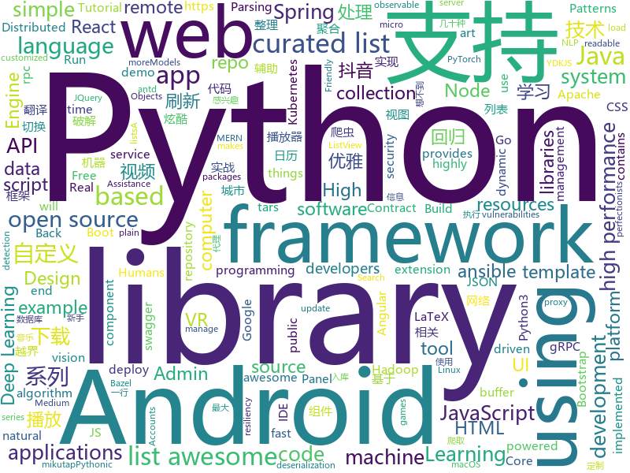

# 2018-05-30
See what the GitHub community is most excited about today.

## python
* [Douyin-Bot](https://github.com/wangshub/Douyin-Bot)(**1,003 stars today**): Python 抖音机器人，论如何在抖音上找到漂亮小姐姐？😍
* [python-spider](https://github.com/Jack-Cherish/python-spider)(**243 stars today**): 🌈Python3网络爬虫实战：VIP视频破解助手；GEETEST验证码破解；小说、动漫下载；手机APP爬取；财务报表入库；火车票抢票；抖音APP视频下载；百万英雄辅助；网易云音乐批量下载
* [Python-100-Days](https://github.com/jackfrued/Python-100-Days)(**195 stars today**): Python - 100天从新手到大师
* [scylla](https://github.com/imWildCat/scylla)(**192 stars today**): Intelligent proxy pool for Humans™
* [colossus](https://github.com/lucperkins/colossus)(**154 stars today**): Colossus — An example microservice architecture for Kubernetes using Bazel, Go, Java, Docker, Kubernetes, Minikube, Gazelle, gRPC, and more
* [models](https://github.com/tensorflow/models)(**99 stars today**): Models and examples built with TensorFlow
* [yellowbrick](https://github.com/DistrictDataLabs/yellowbrick)(**122 stars today**): Visual analysis and diagnostic tools to facilitate machine learning model selection.
* [black](https://github.com/ambv/black)(**107 stars today**): The uncompromising Python code formatter
* [nlp-architect](https://github.com/NervanaSystems/nlp-architect)(**70 stars today**): NLP Architect by Intel AI Lab: Python library for exploring the state-of-the-art deep learning topologies and techniques for natural language processing and natural language understanding
* [Learning-to-See-in-the-Dark](https://github.com/cchen156/Learning-to-See-in-the-Dark)(**66 stars today**): 
* [awesome-python](https://github.com/vinta/awesome-python)(**60 stars today**): A curated list of awesome Python frameworks, libraries, software and resources
* [keras](https://github.com/keras-team/keras)(**44 stars today**): Deep Learning for humans
* [public-apis](https://github.com/toddmotto/public-apis)(**51 stars today**): A collective list of public JSON APIs for use in web development.
* [wechat_jump_game](https://github.com/wangshub/wechat_jump_game)(**46 stars today**): 微信《跳一跳》Python 辅助
* [awesome-machine-learning](https://github.com/josephmisiti/awesome-machine-learning)(**44 stars today**): A curated list of awesome Machine Learning frameworks, libraries and software.
* [peda](https://github.com/longld/peda)(**48 stars today**): PEDA - Python Exploit Development Assistance for GDB
* [sugartex](https://github.com/kiwi0fruit/sugartex)(**49 stars today**): SugarTeX is a more readable LaTeX language extension and transcompiler to LaTeX.
* [flask](https://github.com/pallets/flask)(**41 stars today**): The Python micro framework for building web applications.
* [pytorch-tutorial](https://github.com/yunjey/pytorch-tutorial)(**41 stars today**): PyTorch Tutorial for Deep Learning Researchers
* [spotify-playlist-generator](https://github.com/mileshenrichs/spotify-playlist-generator)(**41 stars today**): A scheduled Python script that scrapes new song titles and builds🔥playlists through the Spotify API
* [django](https://github.com/django/django)(**36 stars today**): The Web framework for perfectionists with deadlines.
* [face_recognition](https://github.com/ageitgey/face_recognition)(**34 stars today**): The world's simplest facial recognition api for Python and the command line
* [pwnedOrNot](https://github.com/thewhiteh4t/pwnedOrNot)(**35 stars today**): Python Script to Find Passwords for Compromised Email Accounts using haveibeenpwned API
* [house-renting](https://github.com/kezhenxu94/house-renting)(**36 stars today**): 租房信息聚合分析，目前聚合了 58 同城，豆瓣，链家 的上百个城市地区，可选择只扒取你感兴趣的城市。
* [ansible](https://github.com/ansible/ansible)(**25 stars today**): Ansible is a radically simple IT automation platform that makes your applications and systems easier to deploy. Avoid writing scripts or custom code to deploy and update your applications — automate in a language that approaches plain English, using SSH, with no agents to install on remote systems. https://docs.ansible.com/ansible/

## java
* [LayoutManagerGroup](https://github.com/DingMouRen/LayoutManagerGroup)(**126 stars today**): 👉自定义LayoutManager，炫酷列表
* [Andromeda](https://github.com/iqiyi/Andromeda)(**72 stars today**): Andromeda simplifies local/remote communication for Android modularization
* [proxyee-down](https://github.com/proxyee-down-org/proxyee-down)(**69 stars today**): http下载工具，基于http代理，支持多连接分块下载
* [spring-boot-examples](https://github.com/ityouknow/spring-boot-examples)(**59 stars today**): about learning Spring Boot via examples. Spring Boot 技术栈示例代码，快速简单上手教程。
* [Java](https://github.com/TheAlgorithms/Java)(**52 stars today**): All Algorithms implemented in Java
* [spring-boot](https://github.com/spring-projects/spring-boot)(**43 stars today**): Spring Boot
* [zuul](https://github.com/Netflix/zuul)(**48 stars today**): Zuul is a gateway service that provides dynamic routing, monitoring, resiliency, security, and more.
* [incubator-dubbo](https://github.com/apache/incubator-dubbo)(**37 stars today**): Apache Dubbo (incubating) is a high-performance, java based, open source RPC framework.
* [dkplayer](https://github.com/dueeeke/dkplayer)(**38 stars today**): 基于IjkPlayer的视频播放器，支持直播点播，悬浮窗播放，广告播放，边播边缓存；支持重力感应自动全屏；完美实现ListView和RecyclerView列表播放；支持清晰度切换；支持一行代码切换MediaPlayer和ExoPlayer；模仿抖音效果demo；Android O PiP demo
* [guava](https://github.com/google/guava)(**33 stars today**): Google core libraries for Java
* [PlayerBase](https://github.com/jiajunhui/PlayerBase)(**34 stars today**): The basic library of Android player will process complex business components. The access is simple。Android播放器基础库，专注于组件的高复用性和组件间的低耦合，轻松处理复杂业务。
* [Signal-Android](https://github.com/signalapp/Signal-Android)(**34 stars today**): A private messenger for Android.
* [tutorials](https://github.com/eugenp/tutorials)(**24 stars today**): The "REST With Spring" Course:
* [AndroidUtilCode](https://github.com/Blankj/AndroidUtilCode)(**31 stars today**): 🔥Android developers should collect the following utils(updating).
* [UETool](https://github.com/eleme/UETool)(**34 stars today**): Show/edit any view's attributions on the screen.
* [SmartRefreshLayout](https://github.com/scwang90/SmartRefreshLayout)(**30 stars today**): 🔥下拉刷新、上拉加载、二级刷新、淘宝二楼、RefreshLayout、OverScroll，Android智能下拉刷新框架，支持越界回弹、越界拖动，具有极强的扩展性，集成了几十种炫酷的Header和 Footer。
* [java-design-patterns](https://github.com/iluwatar/java-design-patterns)(**29 stars today**): Design patterns implemented in Java
* [RxJava](https://github.com/ReactiveX/RxJava)(**31 stars today**): RxJava – Reactive Extensions for the JVM – a library for composing asynchronous and event-based programs using observable sequences for the Java VM.
* [spring-framework](https://github.com/spring-projects/spring-framework)(**22 stars today**): Spring Framework
* [elasticsearch](https://github.com/elastic/elasticsearch)(**23 stars today**): Open Source, Distributed, RESTful Search Engine
* [DelegationAdapter](https://github.com/xuehuayous/DelegationAdapter)(**30 stars today**): 一种优雅的方式来使用RecyclerView
* [interviews](https://github.com/kdn251/interviews)(**28 stars today**): Everything you need to know to get the job.
* [VirtualXposed](https://github.com/android-hacker/VirtualXposed)(**26 stars today**): A Simple App to use Xposed without root or unlock the bootloader(or modify system image etc).
* [CalendarView](https://github.com/huanghaibin-dev/CalendarView)(**27 stars today**): Android上一个优雅、万能自定义UI、支持周视图、自定义周起始、性能高效的日历控件，支持热插拔实现的UI定制！支持标记、自定义颜色、农历、自定义月视图各种显示模式等。Canvas绘制，速度快、占用内存低，你真的想不到日历居然还可以如此优雅！An elegant, highly customized and high-performance Calendar Widget on Android.
* [hadoop](https://github.com/apache/hadoop)(**20 stars today**): Mirror of Apache Hadoop

## unknown
* [build-your-own-x](https://github.com/danistefanovic/build-your-own-x)(**625 stars today**): 🤓Build your own (insert technology here)
* [Learn_Deep_Learning_in_6_Weeks](https://github.com/llSourcell/Learn_Deep_Learning_in_6_Weeks)(**264 stars today**): This is the Curriculum for "Learn Deep Learning in 6 Weeks" by Siraj Raval on Youtube
* [architect-awesome](https://github.com/xingshaocheng/architect-awesome)(**176 stars today**): 后端架构师技术图谱
* [Interview-Notebook](https://github.com/CyC2018/Interview-Notebook)(**93 stars today**): 📚技术面试需要掌握的基础知识整理，欢迎编辑~
* [awesome](https://github.com/sindresorhus/awesome)(**78 stars today**): 😎Curated list of awesome lists
* [You-Dont-Know-JS](https://github.com/getify/You-Dont-Know-JS)(**74 stars today**): A book series on JavaScript. @YDKJS on twitter.
* [gitignore](https://github.com/github/gitignore)(**63 stars today**): A collection of useful .gitignore templates
* [daily-paper-computer-vision](https://github.com/amusi/daily-paper-computer-vision)(**72 stars today**): 记录每天整理的计算机视觉/深度学习/机器学习相关方向的论文
* [coding-interview-university](https://github.com/jwasham/coding-interview-university)(**67 stars today**): A complete computer science study plan to become a software engineer.
* [free-programming-books](https://github.com/EbookFoundation/free-programming-books)(**62 stars today**): 📚Freely available programming books
* [awesome-scalability](https://github.com/binhnguyennus/awesome-scalability)(**52 stars today**): High Scalability, High Availability, High Stability, High Performance, and High Intelligence Back-End Design Patterns
* [awesome-vue](https://github.com/vuejs/awesome-vue)(**50 stars today**): 🎉A curated list of awesome things related to Vue.js
* [eos-bp-nodes-security-checklist](https://github.com/slowmist/eos-bp-nodes-security-checklist)(**49 stars today**): EOS bp nodes security checklist（EOS超级节点安全执行指南）
* [awesome-computer-vision](https://github.com/jbhuang0604/awesome-computer-vision)(**42 stars today**): A curated list of awesome computer vision resources
* [awesome-list](https://github.com/component-driven/awesome-list)(**39 stars today**): Curated list of links on component-driven developmnent and design systems
* [gold-miner](https://github.com/xitu/gold-miner)(**32 stars today**): 🥇掘金翻译计划，可能是世界最大最好的英译中技术社区，最懂读者和译者的翻译平台：
* [Learn-MERN-stack-hacks](https://github.com/rosariorussell/Learn-MERN-stack-hacks)(**34 stars today**): An organized repository of diagrams, references, and cheatsheets for MERN stack web development
* [weekly](https://github.com/dt-fe/weekly)(**30 stars today**): 前端精读周刊
* [awesome-nodejs](https://github.com/sindresorhus/awesome-nodejs)(**28 stars today**): ⚡️Delightful Node.js packages and resources
* [realworld](https://github.com/gothinkster/realworld)(**27 stars today**): "The mother of all demo apps" — Exemplary fullstack Medium.com clone powered by React, Angular, Node, Django, and many more🏅
* [Awesome-Chinese-NLP](https://github.com/crownpku/Awesome-Chinese-NLP)(**24 stars today**): A curated list of resources for Chinese NLP 中文自然语言处理相关资料
* [Hackintosh-Installer-University](https://github.com/huangyz0918/Hackintosh-Installer-University)(**26 stars today**): open source tutorial & information collector for hackintosh installation.💻➕🍎
* [Blog](https://github.com/mqyqingfeng/Blog)(**25 stars today**): 冴羽写博客的地方，预计写四个系列：JavaScript深入系列、JavaScript专题系列、ES6系列、React系列。
* [awesome-react](https://github.com/enaqx/awesome-react)(**25 stars today**): A collection of awesome things regarding React ecosystem.
* [awesome-python-cn](https://github.com/jobbole/awesome-python-cn)(**20 stars today**): Python资源大全中文版，包括：Web框架、网络爬虫、模板引擎、数据库、数据可视化、图片处理等，由伯乐在线持续更新。

## c++
* [flat_hash_map](https://github.com/skarupke/flat_hash_map)(**257 stars today**): A very fast hashtable
* [tensorflow](https://github.com/tensorflow/tensorflow)(**126 stars today**): Computation using data flow graphs for scalable machine learning
* [eos](https://github.com/EOSIO/eos)(**66 stars today**): An open source smart contract platform
* [electron](https://github.com/electron/electron)(**51 stars today**): Build cross platform desktop apps with JavaScript, HTML, and CSS
* [array](https://github.com/foonathan/array)(**52 stars today**): contiguous container library - arrays with customizable allocation, small buffer optimization and more
* [Anakin](https://github.com/PaddlePaddle/Anakin)(**39 stars today**): 
* [protobuf](https://github.com/google/protobuf)(**41 stars today**): Protocol Buffers - Google's data interchange format
* [bitcoin](https://github.com/bitcoin/bitcoin)(**33 stars today**): Bitcoin Core integration/staging tree
* [opencv](https://github.com/opencv/opencv)(**26 stars today**): Open Source Computer Vision Library
* [pytorch](https://github.com/pytorch/pytorch)(**33 stars today**): Tensors and Dynamic neural networks in Python with strong GPU acceleration
* [tesseract](https://github.com/tesseract-ocr/tesseract)(**30 stars today**): Tesseract Open Source OCR Engine (main repository)
* [apollo](https://github.com/ApolloAuto/apollo)(**21 stars today**): An open autonomous driving platform
* [grpc](https://github.com/grpc/grpc)(**20 stars today**): The C based gRPC (C++, Python, Ruby, Objective-C, PHP, C#)
* [katran](https://github.com/facebookincubator/katran)(**26 stars today**): A high performance layer 4 load balancer
* [bsf](https://github.com/GameFoundry/bsf)(**23 stars today**): Modern C++14 library for the development of real-time graphical applications
* [aseprite](https://github.com/aseprite/aseprite)(**22 stars today**): Animated sprite editor & pixel art tool (Windows, macOS, Linux)
* [ALVR](https://github.com/polygraphene/ALVR)(**22 stars today**): ALVR - Air Light VR is an opensource remote VR display for Gear VR and Oculus Go. You can play SteamVR games in your standalone headset.
* [Tars](https://github.com/Tencent/Tars)(**17 stars today**): Tars is a highly performance rpc framework based on naming service using tars protocol and provides a semi-automatic operation platform.
* [openpose](https://github.com/CMU-Perceptual-Computing-Lab/openpose)(**18 stars today**): OpenPose: Real-time multi-person keypoint detection library for body, face, and hands estimation
* [Sonoff-Tasmota](https://github.com/arendst/Sonoff-Tasmota)(**16 stars today**): Provide ESP8266 based itead Sonoff with Web, MQTT and OTA firmware using Arduino IDE or PlatformIO
* [xgboost](https://github.com/dmlc/xgboost)(**13 stars today**): Scalable, Portable and Distributed Gradient Boosting (GBDT, GBRT or GBM) Library, for Python, R, Java, Scala, C++ and more. Runs on single machine, Hadoop, Spark, Flink and DataFlow
* [qBittorrent](https://github.com/qbittorrent/qBittorrent)(**13 stars today**): qBittorrent BitTorrent client
* [solidity](https://github.com/ethereum/solidity)(**13 stars today**): Solidity, the Contract-Oriented Programming Language
* [DeepSpeech](https://github.com/mozilla/DeepSpeech)(**13 stars today**): A TensorFlow implementation of Baidu's DeepSpeech architecture
* [cosmos](https://github.com/OpenGenus/cosmos)(**15 stars today**): Algorithms that run our universe | Your personal library of every algorithm and data structure code that you will ever encounter | Ask us anything at our forum

## html
* [archerysec](https://github.com/archerysec/archerysec)(**78 stars today**): Open Source Vulnerability Assessment and Management helps developers and pentesters to perform scans and manage vulnerabilities.
* [flexy](https://github.com/vladocar/flexy)(**32 stars today**): Flexy is minimal CSS framework made with Flex
* [landgreen.github.io](https://github.com/landgreen/landgreen.github.io)(**34 stars today**): Landgreen's public site
* [styleguide](https://github.com/google/styleguide)(**25 stars today**): Style guides for Google-originated open-source projects
* [AdminLTE](https://github.com/almasaeed2010/AdminLTE)(**25 stars today**): AdminLTE - Free Premium Admin control Panel Theme Based On Bootstrap 3.x
* [Spoon-Knife](https://github.com/octocat/Spoon-Knife)(****): This repo is for demonstration purposes only.
* [fastText](https://github.com/facebookresearch/fastText)(**21 stars today**): Library for fast text representation and classification.
* [mikutap](https://github.com/HFIProgramming/mikutap)(**18 stars today**): A Mainland China Friendly and independent version extracted from https://aidn.jp/mikutap
* [requests-html](https://github.com/kennethreitz/requests-html)(**17 stars today**): Pythonic HTML Parsing for Humans™
* [JavaScript30](https://github.com/wesbos/JavaScript30)(**5 stars today**): 30 Day Vanilla JS Challenge
* [ctf_writeup](https://github.com/balsn/ctf_writeup)(**15 stars today**): CTF writeups from Balsn
* [awesome-mac](https://github.com/jaywcjlove/awesome-mac)(**14 stars today**):  This repo is a collection of awesome Mac applications and tools for developers and designers.
* [swagger-codegen](https://github.com/swagger-api/swagger-codegen)(**13 stars today**): swagger-codegen contains a template-driven engine to generate documentation, API clients and server stubs in different languages by parsing your OpenAPI / Swagger definition.
* [portainer](https://github.com/portainer/portainer)(**14 stars today**): Simple management UI for Docker
* [electron-api-demos](https://github.com/electron/electron-api-demos)(**13 stars today**): Explore the Electron APIs
* [gson](https://github.com/google/gson)(**13 stars today**): A Java serialization/deserialization library to convert Java Objects into JSON and back
* [Machine-Learning](https://github.com/Jack-Cherish/Machine-Learning)(**9 stars today**): ⚡️机器学习实战（Python3）：kNN、决策树、贝叶斯、逻辑回归、SVM、线性回归、树回归
* [EIPs](https://github.com/ethereum/EIPs)(**9 stars today**): The Ethereum Improvement Proposal repository
* [core](https://github.com/stackblitz/core)(**10 stars today**): Online IDE powered by VS Code⚡️
* [patchwork](https://github.com/jlord/patchwork)(****): All the Git-it Workshop completers!
* [ng-alain](https://github.com/cipchk/ng-alain)(**9 stars today**): ng-zorro-antd admin panel front-end framework
* [awesome-angular](https://github.com/gdi2290/awesome-angular)(**9 stars today**): 📄A curated list of awesome Angular resources by @TipeIO
* [polymer](https://github.com/Polymer/polymer)(**9 stars today**): Build modern apps using web components
* [patternfly](https://github.com/patternfly/patternfly)(**9 stars today**): This repo contains instructions and the HTML, CSS, and JQuery for the PatternFly project.
* [gentelella](https://github.com/puikinsh/gentelella)(**8 stars today**): Free Bootstrap 3 Admin Template

## WordCloud

