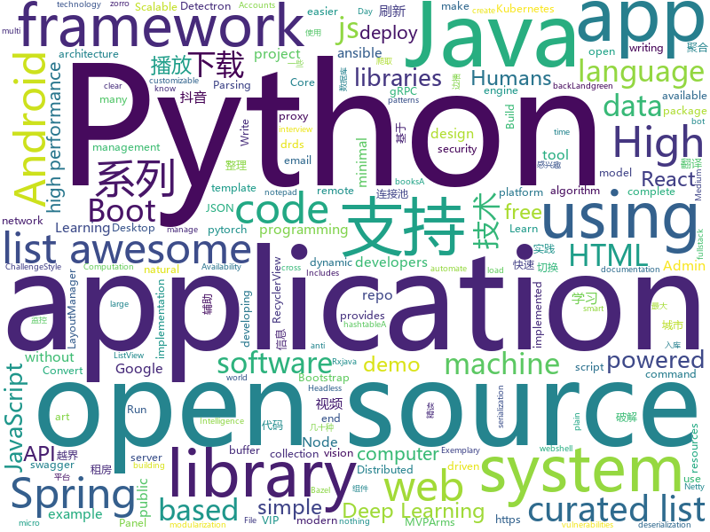

# 2018-05-31
See what the GitHub community is most excited about today.

## python
* [Douyin-Bot](https://github.com/wangshub/Douyin-Bot)(**618 stars today**): Python 抖音机器人，论如何在抖音上找到漂亮小姐姐？😍
* [colossus](https://github.com/lucperkins/colossus)(**313 stars today**): Colossus — An example microservice architecture for Kubernetes using Bazel, Go, Java, Docker, Kubernetes, Minikube, Gazelle, gRPC, and more
* [python-spider](https://github.com/Jack-Cherish/python-spider)(**215 stars today**): 🌈Python3网络爬虫实战：VIP视频破解助手；GEETEST验证码破解；小说、动漫下载；手机APP爬取；财务报表入库；火车票抢票；抖音APP视频下载；百万英雄辅助；网易云音乐批量下载
* [Python-100-Days](https://github.com/jackfrued/Python-100-Days)(**156 stars today**): Python - 100天从新手到大师
* [models](https://github.com/tensorflow/models)(**90 stars today**): Models and examples built with TensorFlow
* [house-renting](https://github.com/kezhenxu94/house-renting)(**103 stars today**): 租房信息聚合分析，目前聚合了 58 同城，豆瓣，链家 的上百个城市地区的租房信息，可选择只扒取你感兴趣的城市。
* [PyTorch-YOLOv3](https://github.com/eriklindernoren/PyTorch-YOLOv3)(**97 stars today**): Minimal PyTorch implementation of YOLOv3
* [black](https://github.com/ambv/black)(**83 stars today**): The uncompromising Python code formatter
* [scylla](https://github.com/imWildCat/scylla)(**69 stars today**): Intelligent proxy pool for Humans™
* [mitmproxy](https://github.com/mitmproxy/mitmproxy)(**67 stars today**): An interactive TLS-capable intercepting HTTP proxy for penetration testers and software developers.
* [Learning-to-See-in-the-Dark](https://github.com/cchen156/Learning-to-See-in-the-Dark)(**60 stars today**): 
* [awesome-python](https://github.com/vinta/awesome-python)(**59 stars today**): A curated list of awesome Python frameworks, libraries, software and resources
* [public-apis](https://github.com/toddmotto/public-apis)(**56 stars today**): A collective list of public JSON APIs for use in web development.
* [awesome-machine-learning](https://github.com/josephmisiti/awesome-machine-learning)(**52 stars today**): A curated list of awesome Machine Learning frameworks, libraries and software.
* [keras](https://github.com/keras-team/keras)(**45 stars today**): Deep Learning for humans
* [wechat_jump_game](https://github.com/wangshub/wechat_jump_game)(**42 stars today**): 微信《跳一跳》Python 辅助
* [pwnedOrNot](https://github.com/thewhiteh4t/pwnedOrNot)(**45 stars today**): Python Script to Find Passwords for Compromised Email Accounts using haveibeenpwned API
* [nlp-architect](https://github.com/NervanaSystems/nlp-architect)(**45 stars today**): NLP Architect by Intel AI Lab: Python library for exploring the state-of-the-art deep learning topologies and techniques for natural language processing and natural language understanding
* [yellowbrick](https://github.com/DistrictDataLabs/yellowbrick)(**43 stars today**): Visual analysis and diagnostic tools to facilitate machine learning model selection.
* [face_recognition](https://github.com/ageitgey/face_recognition)(**40 stars today**): The world's simplest facial recognition api for Python and the command line
* [Detectron.pytorch](https://github.com/roytseng-tw/Detectron.pytorch)(**41 stars today**): A pytorch implementation of Detectron. Both training from scratch and inferring directly from pretrained Detectron weights are available.
* [system-design-primer](https://github.com/donnemartin/system-design-primer)(**40 stars today**): Learn how to design large-scale systems. Prep for the system design interview. Includes Anki flashcards.
* [ansible](https://github.com/ansible/ansible)(**28 stars today**): Ansible is a radically simple IT automation platform that makes your applications and systems easier to deploy. Avoid writing scripts or custom code to deploy and update your applications — automate in a language that approaches plain English, using SSH, with no agents to install on remote systems. https://docs.ansible.com/ansible/
* [studyFiles](https://github.com/threerocks/studyFiles)(**33 stars today**): 一些经典且高质量的电子书分享
* [flask](https://github.com/pallets/flask)(**31 stars today**): The Python micro framework for building web applications.

## java
* [Andromeda](https://github.com/iqiyi/Andromeda)(**436 stars today**): Andromeda simplifies local/remote communication for Android modularization
* [LayoutManagerGroup](https://github.com/DingMouRen/LayoutManagerGroup)(**242 stars today**): 👉Customize the LayoutManager of RecyclerView(自定义LayoutManager)
* [vjtools](https://github.com/vipshop/vjtools)(**200 stars today**): The VIP's java code standard, libraries and tools
* [MVPArms](https://github.com/JessYanCoding/MVPArms)(**115 stars today**): A common architecture for Android applications developing based on MVP, integrates many open source projects (like Dagger2、Rxjava、Retrofit ...), to make your developing quicker and easier.
* [proxyee-down](https://github.com/proxyee-down-org/proxyee-down)(**71 stars today**): http下载工具，基于http代理，支持多连接分块下载
* [ArmsComponent](https://github.com/JessYanCoding/ArmsComponent)(**66 stars today**): A complete android componentization solution, powered by MVPArms (MVPArms 官方快速组件化方案).
* [spring-boot](https://github.com/spring-projects/spring-boot)(**56 stars today**): Spring Boot
* [Java](https://github.com/TheAlgorithms/Java)(**57 stars today**): All Algorithms implemented in Java
* [spring-boot-examples](https://github.com/ityouknow/spring-boot-examples)(**52 stars today**): about learning Spring Boot via examples. Spring Boot 技术栈示例代码，快速简单上手教程。
* [DelegationAdapter](https://github.com/xuehuayous/DelegationAdapter)(**49 stars today**): 一种优雅的方式来使用RecyclerView
* [java-design-patterns](https://github.com/iluwatar/java-design-patterns)(**42 stars today**): Design patterns implemented in Java
* [interviews](https://github.com/kdn251/interviews)(**40 stars today**): Everything you need to know to get the job.
* [guava](https://github.com/google/guava)(**39 stars today**): Google core libraries for Java
* [incubator-dubbo](https://github.com/apache/incubator-dubbo)(**33 stars today**): Apache Dubbo (incubating) is a high-performance, java based, open source RPC framework.
* [memShell](https://github.com/rebeyond/memShell)(**32 stars today**): a webshell resides in the memory of java web server
* [druid](https://github.com/alibaba/druid)(**33 stars today**): ♨️为监控而生的数据库连接池！阿里云DRDS(https://www.aliyun.com/product/drds )、阿里巴巴TDDL 连接池powered by Druid
* [zuul](https://github.com/Netflix/zuul)(**36 stars today**): Zuul is a gateway service that provides dynamic routing, monitoring, resiliency, security, and more.
* [elasticsearch](https://github.com/elastic/elasticsearch)(**27 stars today**): Open Source, Distributed, RESTful Search Engine
* [tutorials](https://github.com/eugenp/tutorials)(**17 stars today**): The "REST With Spring" Course:
* [micronaut-core](https://github.com/micronaut-projects/micronaut-core)(**30 stars today**): Micronaut Application Framework
* [springboot-learning-example](https://github.com/JeffLi1993/springboot-learning-example)(**25 stars today**): spring boot 实践学习案例，是 spring boot 初学者及核心技术巩固的最佳实践。
* [netty](https://github.com/netty/netty)(**27 stars today**): Netty project - an event-driven asynchronous network application framework
* [dkplayer](https://github.com/dueeeke/dkplayer)(**27 stars today**): 基于IjkPlayer的视频播放器，支持直播点播，悬浮窗播放，广告播放，边播边缓存；支持重力感应自动全屏；完美实现ListView和RecyclerView列表播放；支持清晰度切换；支持一行代码切换MediaPlayer和ExoPlayer；模仿抖音效果demo；Android O PiP demo
* [SmartRefreshLayout](https://github.com/scwang90/SmartRefreshLayout)(**26 stars today**): 🔥下拉刷新、上拉加载、二级刷新、淘宝二楼、RefreshLayout、OverScroll，Android智能下拉刷新框架，支持越界回弹、越界拖动，具有极强的扩展性，集成了几十种炫酷的Header和 Footer。
* [VirtualXposed](https://github.com/android-hacker/VirtualXposed)(**25 stars today**): A Simple App to use Xposed without root or unlock the bootloader(or modify system image etc).

## unknown
* [build-your-own-x](https://github.com/danistefanovic/build-your-own-x)(**406 stars today**): 🤓Build your own (insert technology here)
* [Learn_Deep_Learning_in_6_Weeks](https://github.com/llSourcell/Learn_Deep_Learning_in_6_Weeks)(**316 stars today**): This is the Curriculum for "Learn Deep Learning in 6 Weeks" by Siraj Raval on Youtube
* [architect-awesome](https://github.com/xingshaocheng/architect-awesome)(**139 stars today**): 后端架构师技术图谱
* [gitignore](https://github.com/github/gitignore)(**61 stars today**): A collection of useful .gitignore templates
* [Interview-Notebook](https://github.com/CyC2018/Interview-Notebook)(**69 stars today**): 📚技术面试需要掌握的基础知识整理，欢迎编辑~
* [awesome](https://github.com/sindresorhus/awesome)(**72 stars today**): 😎Curated list of awesome lists
* [coding-interview-university](https://github.com/jwasham/coding-interview-university)(**60 stars today**): A complete computer science study plan to become a software engineer.
* [You-Dont-Know-JS](https://github.com/getify/You-Dont-Know-JS)(**61 stars today**): A book series on JavaScript. @YDKJS on twitter.
* [awesome-vue](https://github.com/vuejs/awesome-vue)(**60 stars today**): 🎉A curated list of awesome things related to Vue.js
* [free-programming-books](https://github.com/EbookFoundation/free-programming-books)(**47 stars today**): 📚Freely available programming books
* [awesome-public-datasets](https://github.com/awesomedata/awesome-public-datasets)(**40 stars today**): A topic-centric list of high-quality open datasets in public domains. Propose NEW data ☛☛☛PR☛☛☛
* [mak](https://github.com/inns/mak)(**41 stars today**): A universal notepad.
* [awesome-scalability](https://github.com/binhnguyennus/awesome-scalability)(**32 stars today**): High Scalability, High Availability, High Stability, High Performance, and High Intelligence Back-End Design Patterns
* [awesome-flutter](https://github.com/Solido/awesome-flutter)(**33 stars today**): All Flutter resources to start and develop your projects !
* [Blog](https://github.com/mqyqingfeng/Blog)(**29 stars today**): 冴羽写博客的地方，预计写四个系列：JavaScript深入系列、JavaScript专题系列、ES6系列、React系列。
* [gold-miner](https://github.com/xitu/gold-miner)(**32 stars today**): 🥇掘金翻译计划，可能是世界最大最好的英译中技术社区，最懂读者和译者的翻译平台：
* [awesome-computer-vision](https://github.com/jbhuang0604/awesome-computer-vision)(**26 stars today**): A curated list of awesome computer vision resources
* [forum](https://github.com/getlantern/forum)(**25 stars today**): 蓝灯(Lantern)官方论坛
* [awesome-nodejs](https://github.com/sindresorhus/awesome-nodejs)(**28 stars today**): ⚡️Delightful Node.js packages and resources
* [nocode](https://github.com/kelseyhightower/nocode)(**27 stars today**): The best way to write secure and reliable applications. Write nothing; deploy nowhere.
* [realworld](https://github.com/gothinkster/realworld)(**28 stars today**): "The mother of all demo apps" — Exemplary fullstack Medium.com clone powered by React, Angular, Node, Django, and many more🏅
* [wiki](https://github.com/ethereum/wiki)(**23 stars today**): The Ethereum Wiki -
* [analysis-of-anti-analysis](https://github.com/yellowbyte/analysis-of-anti-analysis)(**25 stars today**): writings on anti-reverse engineering
* [weekly](https://github.com/dt-fe/weekly)(**24 stars today**): 前端精读周刊
* [daily-paper-computer-vision](https://github.com/amusi/daily-paper-computer-vision)(**22 stars today**): 记录每天整理的计算机视觉/深度学习/机器学习相关方向的论文

## c++
* [tensorflow](https://github.com/tensorflow/tensorflow)(**142 stars today**): Computation using data flow graphs for scalable machine learning
* [flat_hash_map](https://github.com/skarupke/flat_hash_map)(**126 stars today**): A very fast hashtable
* [katran](https://github.com/facebookincubator/katran)(**99 stars today**): A high performance layer 4 load balancer
* [eos](https://github.com/EOSIO/eos)(**67 stars today**): An open source smart contract platform
* [zig](https://github.com/ziglang/zig)(**56 stars today**): robust, optimal, and clear programming language
* [electron](https://github.com/electron/electron)(**43 stars today**): Build cross platform desktop apps with JavaScript, HTML, and CSS
* [bitcoin](https://github.com/bitcoin/bitcoin)(**38 stars today**): Bitcoin Core integration/staging tree
* [opencv](https://github.com/opencv/opencv)(**31 stars today**): Open Source Computer Vision Library
* [pytorch](https://github.com/pytorch/pytorch)(**36 stars today**): Tensors and Dynamic neural networks in Python with strong GPU acceleration
* [protobuf](https://github.com/google/protobuf)(**38 stars today**): Protocol Buffers - Google's data interchange format
* [openpose](https://github.com/CMU-Perceptual-Computing-Lab/openpose)(**28 stars today**): OpenPose: Real-time multi-person keypoint detection library for body, face, and hands estimation
* [grpc](https://github.com/grpc/grpc)(**28 stars today**): The C based gRPC (C++, Python, Ruby, Objective-C, PHP, C#)
* [aseprite](https://github.com/aseprite/aseprite)(**29 stars today**): Animated sprite editor & pixel art tool (Windows, macOS, Linux)
* [xgboost](https://github.com/dmlc/xgboost)(**24 stars today**): Scalable, Portable and Distributed Gradient Boosting (GBDT, GBRT or GBM) Library, for Python, R, Java, Scala, C++ and more. Runs on single machine, Hadoop, Spark, Flink and DataFlow
* [array](https://github.com/foonathan/array)(**27 stars today**): contiguous container library - arrays with customizable allocation, small buffer optimization and more
* [LAN-Share](https://github.com/abdularis/LAN-Share)(**26 stars today**): LAN File transfer with C++ Qt
* [tesseract](https://github.com/tesseract-ocr/tesseract)(**20 stars today**): Tesseract Open Source OCR Engine (main repository)
* [imgui](https://github.com/ocornut/imgui)(**18 stars today**): Dear ImGui: Bloat-free Immediate Mode Graphical User interface for C++ with minimal dependencies
* [cmder](https://github.com/cmderdev/cmder)(**20 stars today**): Lovely console emulator package for Windows
* [Anakin](https://github.com/PaddlePaddle/Anakin)(**18 stars today**): 
* [cosmos](https://github.com/OpenGenus/cosmos)(**19 stars today**): Algorithms that run our universe | Your personal library of every algorithm and data structure code that you will ever encounter | Ask us anything at our forum
* [swift](https://github.com/apple/swift)(**18 stars today**): The Swift Programming Language
* [tdesktop](https://github.com/telegramdesktop/tdesktop)(**15 stars today**): Telegram Desktop messaging app
* [apollo](https://github.com/ApolloAuto/apollo)(**14 stars today**): An open autonomous driving platform
* [json](https://github.com/nlohmann/json)(**13 stars today**): JSON for Modern C++

## html
* [archerysec](https://github.com/archerysec/archerysec)(**38 stars today**): Open Source Vulnerability Assessment and Management helps developers and pentesters to perform scans and manage vulnerabilities.
* [AdminLTE](https://github.com/almasaeed2010/AdminLTE)(**31 stars today**): AdminLTE - Free Premium Admin control Panel Theme Based On Bootstrap 3.x
* [JavaScript30](https://github.com/wesbos/JavaScript30)(**13 stars today**): 30 Day Vanilla JS Challenge
* [styleguide](https://github.com/google/styleguide)(**17 stars today**): Style guides for Google-originated open-source projects
* [research](https://github.com/struct/research)(**17 stars today**): A repo for various research
* [requests-html](https://github.com/kennethreitz/requests-html)(**17 stars today**): Pythonic HTML Parsing for Humans™
* [gson](https://github.com/google/gson)(**13 stars today**): A Java serialization/deserialization library to convert Java Objects into JSON and back
* [landgreen.github.io](https://github.com/landgreen/landgreen.github.io)(**14 stars today**): Landgreen's public site
* [ng-alain](https://github.com/cipchk/ng-alain)(**11 stars today**): ng-zorro-antd admin panel front-end framework
* [portainer](https://github.com/portainer/portainer)(**13 stars today**): Simple management UI for Docker
* [react-app-rewired](https://github.com/timarney/react-app-rewired)(**13 stars today**): Override create-react-app webpack configs without ejecting
* [responsive-html-email-template](https://github.com/leemunroe/responsive-html-email-template)(**11 stars today**): A free simple responsive HTML email template
* [flexy](https://github.com/vladocar/flexy)(**12 stars today**): Flexy is minimal CSS framework made with Flex
* [awesome-mac](https://github.com/jaywcjlove/awesome-mac)(**12 stars today**):  This repo is a collection of awesome Mac applications and tools for developers and designers.
* [swagger-codegen](https://github.com/swagger-api/swagger-codegen)(**11 stars today**): swagger-codegen contains a template-driven engine to generate documentation, API clients and server stubs in different languages by parsing your OpenAPI / Swagger definition.
* [Spoon-Knife](https://github.com/octocat/Spoon-Knife)(****): This repo is for demonstration purposes only.
* [polymer](https://github.com/Polymer/polymer)(**11 stars today**): Build modern apps using web components
* [gentelella](https://github.com/puikinsh/gentelella)(**8 stars today**): Free Bootstrap 3 Admin Template
* [electron-api-demos](https://github.com/electron/electron-api-demos)(**9 stars today**): Explore the Electron APIs
* [core](https://github.com/stackblitz/core)(**9 stars today**): Online IDE powered by VS Code⚡️
* [pdf2htmlEX](https://github.com/coolwanglu/pdf2htmlEX)(**6 stars today**): Convert PDF to HTML without losing text or format.
* [zenbot](https://github.com/DeviaVir/zenbot)(**8 stars today**): Zenbot is a command-line cryptocurrency trading bot using Node.js and MongoDB.
* [web-profiler-bundle](https://github.com/symfony/web-profiler-bundle)(**8 stars today**): The WebProfilerBundle provides detailed technical information about each request execution and displays it in both the web debug toolbar and the profiler.
* [phantomjs](https://github.com/ariya/phantomjs)(**7 stars today**): Scriptable Headless Browser
* [GTFOBins.github.io](https://github.com/GTFOBins/GTFOBins.github.io)(**6 stars today**): Curated list of Unix binaries that can be exploited to bypass system security restrictions

## WordCloud

