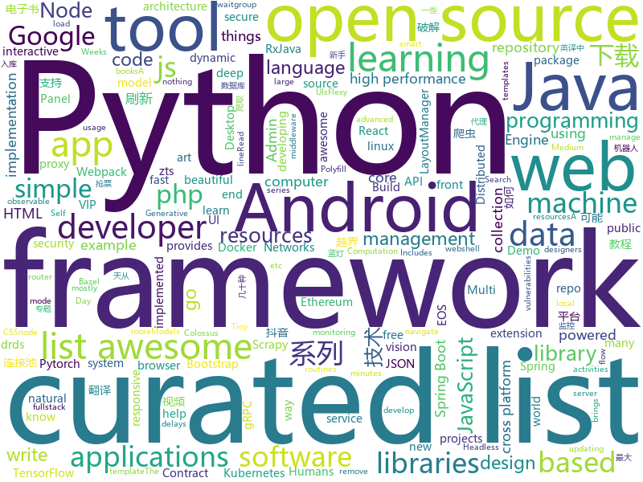

# 2018-06-01
See what the GitHub community is most excited about today.

## python
* [Douyin-Bot](https://github.com/wangshub/Douyin-Bot)(**391 stars today**): Python 抖音机器人，论如何在抖音上找到漂亮小姐姐？😍
* [python-spider](https://github.com/Jack-Cherish/python-spider)(**142 stars today**): 🌈Python3网络爬虫实战：VIP视频破解助手；GEETEST验证码破解；小说、动漫下载；手机APP爬取；财务报表入库；火车票抢票；抖音APP视频下载；百万英雄辅助；网易云音乐批量下载
* [colossus](https://github.com/lucperkins/colossus)(**97 stars today**): Colossus — An example microservice architecture for Kubernetes using Bazel, Go, Java, Docker, Kubernetes, Minikube, Gazelle, gRPC, and more
* [models](https://github.com/tensorflow/models)(**68 stars today**): Models and examples built with TensorFlow
* [house-renting](https://github.com/kezhenxu94/house-renting)(**87 stars today**): 如何租到靠谱的房子？Scrapy 爬虫帮你一网打尽各平台租房信息！可能也是 Scrapy 的最佳实践了！
* [scylla](https://github.com/imWildCat/scylla)(**84 stars today**): Intelligent proxy pool for Humans™
* [black](https://github.com/ambv/black)(**77 stars today**): The uncompromising Python code formatter
* [Python-100-Days](https://github.com/jackfrued/Python-100-Days)(**67 stars today**): Python - 100天从新手到大师
* [mitmproxy](https://github.com/mitmproxy/mitmproxy)(**70 stars today**): An interactive TLS-capable intercepting HTTP proxy for penetration testers and software developers.
* [kitten](https://github.com/hoffa/kitten)(**64 stars today**): 😽Tiny multi-server automation tool
* [keras](https://github.com/keras-team/keras)(**48 stars today**): Deep Learning for humans
* [face_recognition](https://github.com/ageitgey/face_recognition)(**43 stars today**): The world's simplest facial recognition api for Python and the command line
* [datasheets](https://github.com/Squarespace/datasheets)(**53 stars today**): Read data from, write data to, and modify the formatting of Google Sheets
* [studyFiles](https://github.com/threerocks/studyFiles)(**45 stars today**): 一些经典且高质量的电子书分享
* [flask](https://github.com/pallets/flask)(**46 stars today**): The Python micro framework for building web applications.
* [awesome-python](https://github.com/vinta/awesome-python)(**44 stars today**): A curated list of awesome Python frameworks, libraries, software and resources
* [awesome-machine-learning](https://github.com/josephmisiti/awesome-machine-learning)(**39 stars today**): A curated list of awesome Machine Learning frameworks, libraries and software.
* [public-apis](https://github.com/toddmotto/public-apis)(**39 stars today**): A collective list of public JSON APIs for use in web development.
* [Self-Attention-GAN](https://github.com/heykeetae/Self-Attention-GAN)(**39 stars today**): Pytorch implementation of Self-Attention Generative Adversarial Networks (SAGAN)
* [nlp-architect](https://github.com/NervanaSystems/nlp-architect)(**38 stars today**): NLP Architect by Intel AI Lab: Python library for exploring the state-of-the-art deep learning topologies and techniques for natural language processing and natural language understanding
* [PyTorch-YOLOv3](https://github.com/eriklindernoren/PyTorch-YOLOv3)(**35 stars today**): Minimal PyTorch implementation of YOLOv3
* [yellowbrick](https://github.com/DistrictDataLabs/yellowbrick)(**37 stars today**): Visual analysis and diagnostic tools to facilitate machine learning model selection.
* [Learning-to-See-in-the-Dark](https://github.com/cchen156/Learning-to-See-in-the-Dark)(**34 stars today**): 
* [scikit-learn](https://github.com/scikit-learn/scikit-learn)(**27 stars today**): scikit-learn: machine learning in Python
* [system-design-primer](https://github.com/donnemartin/system-design-primer)(**33 stars today**): Learn how to design large-scale systems. Prep for the system design interview. Includes Anki flashcards.

## java
* [Andromeda](https://github.com/iqiyi/Andromeda)(**245 stars today**): Andromeda simplifies local/remote communication for Android modularization
* [vjtools](https://github.com/vipshop/vjtools)(**126 stars today**): The VIP's java code standard, libraries and tools
* [LayoutManagerGroup](https://github.com/DingMouRen/LayoutManagerGroup)(**84 stars today**): 👉Customize the LayoutManager of RecyclerView(自定义LayoutManager)
* [proxyee-down](https://github.com/proxyee-down-org/proxyee-down)(**67 stars today**): http下载工具，基于http代理，支持多连接分块下载
* [MVPArms](https://github.com/JessYanCoding/MVPArms)(**44 stars today**): A common architecture for Android applications developing based on MVP, integrates many open source projects (like Dagger2、Rxjava、Retrofit ...), to make your developing quicker and easier.
* [Java](https://github.com/TheAlgorithms/Java)(**37 stars today**): All Algorithms implemented in Java
* [druid](https://github.com/alibaba/druid)(**39 stars today**): ♨️为监控而生的数据库连接池！阿里云DRDS(https://www.aliyun.com/product/drds )、阿里巴巴TDDL 连接池powered by Druid
* [java-design-patterns](https://github.com/iluwatar/java-design-patterns)(**37 stars today**): Design patterns implemented in Java
* [incubator-dubbo](https://github.com/apache/incubator-dubbo)(**35 stars today**): Apache Dubbo (incubating) is a high-performance, java based, open source RPC framework.
* [tutorials](https://github.com/eugenp/tutorials)(**23 stars today**): The "REST With Spring" Course:
* [spring-boot](https://github.com/spring-projects/spring-boot)(**32 stars today**): Spring Boot
* [mypy-PyCharm-plugin](https://github.com/dropbox/mypy-PyCharm-plugin)(**38 stars today**): A simple plugin that allows running mypy from PyCharm and navigate between errors
* [spring-framework](https://github.com/spring-projects/spring-framework)(**31 stars today**): Spring Framework
* [fastjson](https://github.com/alibaba/fastjson)(**34 stars today**): 🚄A fast JSON parser/generator for Java
* [zuul](https://github.com/Netflix/zuul)(**36 stars today**): Zuul is a gateway service that provides dynamic routing, monitoring, resiliency, security, and more.
* [elasticsearch](https://github.com/elastic/elasticsearch)(**27 stars today**): Open Source, Distributed, RESTful Search Engine
* [AndroidUtilCode](https://github.com/Blankj/AndroidUtilCode)(**30 stars today**): 🔥Android developers should collect the following utils(updating).
* [spring-boot-examples](https://github.com/ityouknow/spring-boot-examples)(**25 stars today**): about learning Spring Boot via examples. Spring Boot 技术栈示例代码，快速简单上手教程。
* [RxJava](https://github.com/ReactiveX/RxJava)(**28 stars today**): RxJava – Reactive Extensions for the JVM – a library for composing asynchronous and event-based programs using observable sequences for the Java VM.
* [SmartRefreshLayout](https://github.com/scwang90/SmartRefreshLayout)(**28 stars today**): 🔥下拉刷新、上拉加载、二级刷新、淘宝二楼、RefreshLayout、OverScroll，Android智能下拉刷新框架，支持越界回弹、越界拖动，具有极强的扩展性，集成了几十种炫酷的Header和 Footer。
* [ARouter](https://github.com/alibaba/ARouter)(**26 stars today**): An android router middleware that help app navigating to activities and custom services.
* [guava](https://github.com/google/guava)(**28 stars today**): Google core libraries for Java
* [interviews](https://github.com/kdn251/interviews)(**25 stars today**): Everything you need to know to get the job.
* [memShell](https://github.com/rebeyond/memShell)(**24 stars today**): a webshell resides in the memory of java web server
* [sofa-boot](https://github.com/alipay/sofa-boot)(**24 stars today**): SOFABoot is a framework that enhances Spring Boot and fully compatible with it, provides readiness check, class isolation, etc.

## unknown
* [build-your-own-x](https://github.com/danistefanovic/build-your-own-x)(**341 stars today**): 🤓Build your own (insert technology here)
* [Learn_Deep_Learning_in_6_Weeks](https://github.com/llSourcell/Learn_Deep_Learning_in_6_Weeks)(**171 stars today**): This is the Curriculum for "Learn Deep Learning in 6 Weeks" by Siraj Raval on Youtube
* [architect-awesome](https://github.com/xingshaocheng/architect-awesome)(**152 stars today**): 后端架构师技术图谱
* [You-Dont-Know-JS](https://github.com/getify/You-Dont-Know-JS)(**81 stars today**): A book series on JavaScript. @YDKJS on twitter.
* [Interview-Notebook](https://github.com/CyC2018/Interview-Notebook)(**65 stars today**): 📚技术面试需要掌握的基础知识整理，欢迎编辑~
* [awesome-vue](https://github.com/vuejs/awesome-vue)(**73 stars today**): 🎉A curated list of awesome things related to Vue.js
* [awesome](https://github.com/sindresorhus/awesome)(**67 stars today**): 😎Curated list of awesome lists
* [gitignore](https://github.com/github/gitignore)(**47 stars today**): A collection of useful .gitignore templates
* [free-programming-books](https://github.com/EbookFoundation/free-programming-books)(**56 stars today**): 📚Freely available programming books
* [coding-interview-university](https://github.com/jwasham/coding-interview-university)(**51 stars today**): A complete computer science study plan to become a software engineer.
* [gold-miner](https://github.com/xitu/gold-miner)(**47 stars today**): 🥇掘金翻译计划，可能是世界最大最好的英译中技术社区，最懂读者和译者的翻译平台：
* [eos-bp-nodes-security-checklist](https://github.com/slowmist/eos-bp-nodes-security-checklist)(**38 stars today**): EOS bp nodes security checklist（EOS超级节点安全执行指南）
* [awesome-nodejs](https://github.com/sindresorhus/awesome-nodejs)(**34 stars today**): ⚡️Delightful Node.js packages and resources
* [forum](https://github.com/getlantern/forum)(**34 stars today**): 蓝灯(Lantern)官方论坛
* [awesome-public-datasets](https://github.com/awesomedata/awesome-public-datasets)(**34 stars today**): A topic-centric list of high-quality open datasets in public domains. Propose NEW data ☛☛☛PR☛☛☛
* [awesome-computer-vision](https://github.com/jbhuang0604/awesome-computer-vision)(**32 stars today**): A curated list of awesome computer vision resources
* [awesome-flutter](https://github.com/Solido/awesome-flutter)(**29 stars today**): All Flutter resources to start and develop your projects !
* [awesome-android-ui](https://github.com/wasabeef/awesome-android-ui)(**27 stars today**): A curated list of awesome Android UI/UX libraries
* [awesome-php](https://github.com/ziadoz/awesome-php)(**27 stars today**): A curated list of amazingly awesome PHP libraries, resources and shiny things.
* [awesome-docker](https://github.com/veggiemonk/awesome-docker)(**25 stars today**): 🐳A curated list of Docker resources and projects
* [nocode](https://github.com/kelseyhightower/nocode)(**25 stars today**): The best way to write secure and reliable applications. Write nothing; deploy nowhere.
* [every-programmer-should-know](https://github.com/mtdvio/every-programmer-should-know)(**24 stars today**): A collection of (mostly) technical things every software developer should know
* [realworld](https://github.com/gothinkster/realworld)(**24 stars today**): "The mother of all demo apps" — Exemplary fullstack Medium.com clone powered by React, Angular, Node, Django, and many more🏅
* [wiki](https://github.com/ethereum/wiki)(**24 stars today**): The Ethereum Wiki
* [Blog](https://github.com/mqyqingfeng/Blog)(**23 stars today**): 冴羽写博客的地方，预计写四个系列：JavaScript深入系列、JavaScript专题系列、ES6系列、React系列。

## c++
* [tensorflow](https://github.com/tensorflow/tensorflow)(**126 stars today**): Computation using data flow graphs for scalable machine learning
* [katran](https://github.com/facebookincubator/katran)(**104 stars today**): A high performance layer 4 load balancer
* [eos](https://github.com/EOSIO/eos)(**52 stars today**): An open source smart contract platform
* [bitcoin](https://github.com/bitcoin/bitcoin)(**46 stars today**): Bitcoin Core integration/staging tree
* [opencv](https://github.com/opencv/opencv)(**38 stars today**): Open Source Computer Vision Library
* [electron](https://github.com/electron/electron)(**44 stars today**): Build cross platform desktop apps with JavaScript, HTML, and CSS
* [pytorch](https://github.com/pytorch/pytorch)(**36 stars today**): Tensors and Dynamic neural networks in Python with strong GPU acceleration
* [protobuf](https://github.com/google/protobuf)(**35 stars today**): Protocol Buffers - Google's data interchange format
* [flat_hash_map](https://github.com/skarupke/flat_hash_map)(**33 stars today**): A very fast hashtable
* [tesseract](https://github.com/tesseract-ocr/tesseract)(**30 stars today**): Tesseract Open Source OCR Engine (main repository)
* [grpc](https://github.com/grpc/grpc)(**26 stars today**): The C based gRPC (C++, Python, Ruby, Objective-C, PHP, C#)
* [swift](https://github.com/apple/swift)(**24 stars today**): The Swift Programming Language
* [phpgo](https://github.com/birdwyx/phpgo)(**27 stars today**): PHPGO: A php extension that brings into php the go core features: go routines, channel, select, mutex, waitgroup, timer and scheduler... now supports php5.5 to 7.2 on linux, for both cli and fastcgi, zts and non-zts mode usage
* [ponyc](https://github.com/ponylang/ponyc)(**26 stars today**): 🐴Pony is an open-source, actor-model, capabilities-secure, high performance programming language
* [aseprite](https://github.com/aseprite/aseprite)(**19 stars today**): Animated sprite editor & pixel art tool (Windows, macOS, Linux)
* [godot](https://github.com/godotengine/godot)(**20 stars today**): Godot Engine – Multi-platform 2D and 3D game engine
* [xgboost](https://github.com/dmlc/xgboost)(**16 stars today**): Scalable, Portable and Distributed Gradient Boosting (GBDT, GBRT or GBM) Library, for Python, R, Java, Scala, C++ and more. Runs on single machine, Hadoop, Spark, Flink and DataFlow
* [Anakin](https://github.com/PaddlePaddle/Anakin)(**18 stars today**): 
* [v8](https://github.com/v8/v8)(**18 stars today**): The official mirror of the V8 Git repository
* [RedisDesktopManager](https://github.com/uglide/RedisDesktopManager)(**18 stars today**): 🔧Cross-platform GUI management tool for Redis
* [solidity](https://github.com/ethereum/solidity)(**16 stars today**): Solidity, the Contract-Oriented Programming Language
* [cmder](https://github.com/cmderdev/cmder)(**18 stars today**): Lovely console emulator package for Windows
* [DeepSpeech](https://github.com/mozilla/DeepSpeech)(**14 stars today**): A TensorFlow implementation of Baidu's DeepSpeech architecture
* [nw.js](https://github.com/nwjs/nw.js)(**15 stars today**): Call all Node.js modules directly from DOM/WebWorker and enable a new way of writing applications with all Web technologies.
* [tdesktop](https://github.com/telegramdesktop/tdesktop)(**16 stars today**): Telegram Desktop messaging app

## html
* [Spina](https://github.com/SpinaCMS/Spina)(**26 stars today**): Spina CMS
* [AdminLTE](https://github.com/almasaeed2010/AdminLTE)(**19 stars today**): AdminLTE - Free Premium Admin control Panel Theme Based On Bootstrap 3.x
* [awesome-mac](https://github.com/jaywcjlove/awesome-mac)(**18 stars today**):  This repo is a collection of awesome Mac applications and tools for developers and designers.
* [portainer](https://github.com/portainer/portainer)(**17 stars today**): Simple management UI for Docker
* [JavaScript30](https://github.com/wesbos/JavaScript30)(**11 stars today**): 30 Day Vanilla JS Challenge
* [Spoon-Knife](https://github.com/octocat/Spoon-Knife)(****): This repo is for demonstration purposes only.
* [requests-html](https://github.com/kennethreitz/requests-html)(**13 stars today**): Pythonic HTML Parsing for Humans™
* [styleguide](https://github.com/google/styleguide)(**13 stars today**): Style guides for Google-originated open-source projects
* [pib](https://github.com/oraoto/pib)(**13 stars today**): PHP in Browser (powered by WebAssembly)
* [fastclick](https://github.com/ftlabs/fastclick)(**12 stars today**): Polyfill to remove click delays on browsers with touch UIs
* [flexy](https://github.com/vladocar/flexy)(**12 stars today**): Flexy is minimal CSS framework made with Flex
* [gentelella](https://github.com/puikinsh/gentelella)(**9 stars today**): Free Bootstrap 3 Admin Template
* [archerysec](https://github.com/archerysec/archerysec)(**10 stars today**): Open Source Vulnerability Assessment and Management helps developers and pentesters to perform scans and manage vulnerabilities.
* [phantomjs](https://github.com/ariya/phantomjs)(**9 stars today**): Scriptable Headless Browser
* [foundation-sites](https://github.com/zurb/foundation-sites)(**9 stars today**): The most advanced responsive front-end framework in the world. Quickly create prototypes and production code for sites that work on any kind of device.
* [beautiful-jekyll](https://github.com/daattali/beautiful-jekyll)(**6 stars today**): ✨Build a beautiful and simple website in literally minutes. Demo at http://deanattali.com/beautiful-jekyll
* [GoJS](https://github.com/NorthwoodsSoftware/GoJS)(**8 stars today**): JavaScript diagramming library for interactive flowcharts, org charts, design tools, planning tools, visual languages.
* [responsive-html-email-template](https://github.com/leemunroe/responsive-html-email-template)(**6 stars today**): A free simple responsive HTML email template
* [EIPs](https://github.com/ethereum/EIPs)(**6 stars today**): The Ethereum Improvement Proposal repository
* [dive-into-webpack](https://github.com/gwuhaolin/dive-into-webpack)(**7 stars today**): 全面的Webpack教程《深入浅出Webpack》电子书
* [sass-loader](https://github.com/webpack-contrib/sass-loader)(**8 stars today**): Compiles Sass to CSS
* [nodejs-ex](https://github.com/sclorg/nodejs-ex)(****): node.js example
* [ng-alain](https://github.com/cipchk/ng-alain)(**7 stars today**): ng-zorro-antd admin panel front-end framework
* [WebFundamentals](https://github.com/google/WebFundamentals)(**6 stars today**): Best practices for modern web development
* [capacitor](https://github.com/ionic-team/capacitor)(**6 stars today**): Build cross-platform Native Progressive Web Apps for iOS, Android, and the web⚡️

## WordCloud

