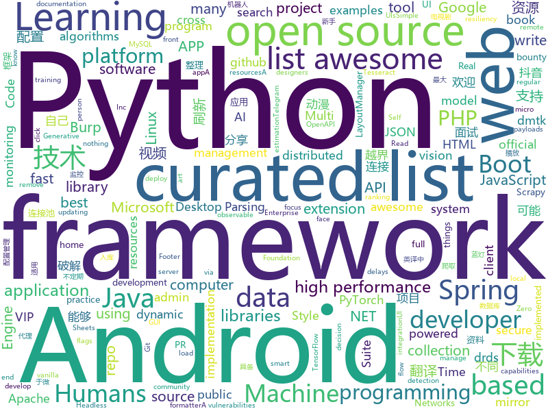

# 2018-06-02
See what the GitHub community is most excited about today.

## python
* [Douyin-Bot](https://github.com/wangshub/Douyin-Bot)(**273 stars today**): Python 抖音机器人，论如何在抖音上找到漂亮小姐姐？😍
* [scylla](https://github.com/imWildCat/scylla)(**163 stars today**): Intelligent proxy pool for Humans™
* [models](https://github.com/tensorflow/models)(**63 stars today**): Models and examples built with TensorFlow
* [Self-Attention-GAN](https://github.com/heykeetae/Self-Attention-GAN)(**80 stars today**): Pytorch implementation of Self-Attention Generative Adversarial Networks (SAGAN)
* [python-spider](https://github.com/Jack-Cherish/python-spider)(**64 stars today**): 🌈Python3网络爬虫实战：VIP视频破解助手；GEETEST验证码破解；小说、动漫下载；手机APP爬取；财务报表入库；火车票抢票；抖音APP视频下载；百万英雄辅助；网易云音乐批量下载
* [whipFTP](https://github.com/RainingComputers/whipFTP)(**65 stars today**): GUI FTP/SFTP client
* [black](https://github.com/ambv/black)(**66 stars today**): The uncompromising Python code formatter
* [awesome-python](https://github.com/vinta/awesome-python)(**55 stars today**): A curated list of awesome Python frameworks, libraries, software and resources
* [keras](https://github.com/keras-team/keras)(**47 stars today**): Deep Learning for humans
* [studyFiles](https://github.com/threerocks/studyFiles)(**49 stars today**): 一些经典且高质量的电子书分享
* [awesome-machine-learning](https://github.com/josephmisiti/awesome-machine-learning)(**49 stars today**): A curated list of awesome Machine Learning frameworks, libraries and software.
* [django](https://github.com/django/django)(**36 stars today**): The Web framework for perfectionists with deadlines.
* [datasheets](https://github.com/Squarespace/datasheets)(**43 stars today**): Read data from, write data to, and modify the formatting of Google Sheets
* [home-assistant](https://github.com/home-assistant/home-assistant)(**36 stars today**): 🏡Open-source home automation platform running on Python 3
* [public-apis](https://github.com/toddmotto/public-apis)(**37 stars today**): A collective list of public JSON APIs for use in web development.
* [face_recognition](https://github.com/ageitgey/face_recognition)(**36 stars today**): The world's simplest facial recognition api for Python and the command line
* [PyTorch-YOLOv3](https://github.com/eriklindernoren/PyTorch-YOLOv3)(**34 stars today**): Minimal PyTorch implementation of YOLOv3
* [flask](https://github.com/pallets/flask)(**33 stars today**): The Python micro framework for building web applications.
* [Python-100-Days](https://github.com/jackfrued/Python-100-Days)(**34 stars today**): Python - 100天从新手到大师
* [sentry](https://github.com/getsentry/sentry)(**35 stars today**): Sentry is cross-platform application monitoring, with a focus on error reporting.
* [Crunch](https://github.com/chrissimpkins/Crunch)(**34 stars today**): Insane(ly slow but wicked good) PNG image optimization
* [pipenv](https://github.com/pypa/pipenv)(**33 stars today**): Python Development Workflow for Humans.
* [cpython](https://github.com/python/cpython)(**26 stars today**): The Python programming language
* [house-renting](https://github.com/kezhenxu94/house-renting)(**31 stars today**): Possibly the best practice of Scrapy (可能是 Scrapy 的最佳实践)
* [Learning-to-See-in-the-Dark](https://github.com/cchen156/Learning-to-See-in-the-Dark)(**30 stars today**): 

## java
* [vjtools](https://github.com/vipshop/vjtools)(**197 stars today**): The vip.com's java coding standard, libraries and tools
* [Andromeda](https://github.com/iqiyi/Andromeda)(**139 stars today**): Andromeda simplifies local/remote communication for Android modularization
* [java-design-patterns](https://github.com/iluwatar/java-design-patterns)(**53 stars today**): Design patterns implemented in Java
* [VideoWorld_Android](https://github.com/123lxw123/VideoWorld_Android)(**54 stars today**): 影视天地（Android 客户端），涵盖电影、电视剧、综艺节目、动漫、游戏五大类别的资源。整合两大资源搜索引擎，连接互联网千万数量级的资源库。支持视频资源在线播放、边下边播，不限速下载，不等待播放。
* [spring-boot](https://github.com/spring-projects/spring-boot)(**44 stars today**): Spring Boot
* [LayoutManagerGroup](https://github.com/DingMouRen/LayoutManagerGroup)(**47 stars today**): 👉Customize the LayoutManager of RecyclerView(自定义LayoutManager)
* [proxyee-down](https://github.com/proxyee-down-org/proxyee-down)(**40 stars today**): http下载工具，基于http代理，支持多连接分块下载
* [druid](https://github.com/alibaba/druid)(**37 stars today**): ♨️为监控而生的数据库连接池！阿里云DRDS(https://www.aliyun.com/product/drds )、阿里巴巴TDDL 连接池powered by Druid
* [elasticsearch](https://github.com/elastic/elasticsearch)(**32 stars today**): Open Source, Distributed, RESTful Search Engine
* [TicktockMusic](https://github.com/Lauzy/TicktockMusic)(**32 stars today**): Material Design Music Player
* [spring-boot-examples](https://github.com/ityouknow/spring-boot-examples)(**30 stars today**): about learning Spring Boot via examples. Spring Boot 技术栈示例代码，快速简单上手教程。
* [apollo](https://github.com/ctripcorp/apollo)(**31 stars today**): Apollo（阿波罗）是携程框架部门研发的分布式配置中心，能够集中化管理应用不同环境、不同集群的配置，配置修改后能够实时推送到应用端，并且具备规范的权限、流程治理等特性，适用于微服务配置管理场景。
* [interviews](https://github.com/kdn251/interviews)(**31 stars today**): Everything you need to know to get the job.
* [incubator-dubbo](https://github.com/apache/incubator-dubbo)(**28 stars today**): Apache Dubbo (incubating) is a high-performance, java based, open source RPC framework.
* [RxJava](https://github.com/ReactiveX/RxJava)(**30 stars today**): RxJava – Reactive Extensions for the JVM – a library for composing asynchronous and event-based programs using observable sequences for the Java VM.
* [spring-framework](https://github.com/spring-projects/spring-framework)(**24 stars today**): Spring Framework
* [AndroidUtilCode](https://github.com/Blankj/AndroidUtilCode)(**26 stars today**): 🔥Android developers should collect the following utils(updating).
* [Java](https://github.com/TheAlgorithms/Java)(**24 stars today**): All Algorithms implemented in Java
* [tutorials](https://github.com/eugenp/tutorials)(**16 stars today**): The "REST With Spring" Course:
* [BurpBounty](https://github.com/wagiro/BurpBounty)(**25 stars today**): Burp Bounty is a extension of Burp Suite that improve an active and passive scanner by yourself. This extension requires Burp Suite Pro.
* [retrofit](https://github.com/square/retrofit)(**24 stars today**): Type-safe HTTP client for Android and Java by Square, Inc.
* [hadoop](https://github.com/apache/hadoop)(**22 stars today**): Mirror of Apache Hadoop
* [fastjson](https://github.com/alibaba/fastjson)(**22 stars today**): 🚄A fast JSON parser/generator for Java
* [zuul](https://github.com/Netflix/zuul)(**21 stars today**): Zuul is a gateway service that provides dynamic routing, monitoring, resiliency, security, and more.
* [SmartRefreshLayout](https://github.com/scwang90/SmartRefreshLayout)(**22 stars today**): 🔥下拉刷新、上拉加载、二级刷新、淘宝二楼、RefreshLayout、OverScroll，Android智能下拉刷新框架，支持越界回弹、越界拖动，具有极强的扩展性，集成了几十种炫酷的Header和 Footer。

## unknown
* [build-your-own-x](https://github.com/danistefanovic/build-your-own-x)(**280 stars today**): 🤓Build your own (insert technology here)
* [Learn_Deep_Learning_in_6_Weeks](https://github.com/llSourcell/Learn_Deep_Learning_in_6_Weeks)(**160 stars today**): This is the Curriculum for "Learn Deep Learning in 6 Weeks" by Siraj Raval on Youtube
* [architect-awesome](https://github.com/xingshaocheng/architect-awesome)(**102 stars today**): 后端架构师技术图谱
* [full-speed-python-chinese](https://github.com/HuberTRoy/full-speed-python-chinese)(**107 stars today**): full-speed-python 进击的Python
* [awesome](https://github.com/sindresorhus/awesome)(**75 stars today**): 😎Curated list of awesome lists
* [PHP-Interview](https://github.com/xianyunyh/PHP-Interview)(**68 stars today**): 这个项目是自己准备PHP面试整理的资料。包括PHP、MySQL、Linux、计算机网络等资料。方便自己以后查阅，会不定期更新，欢迎提交pr，如果错误，请指出，谢谢
* [Interview-Notebook](https://github.com/CyC2018/Interview-Notebook)(**65 stars today**): 📚技术面试需要掌握的基础知识整理，欢迎编辑~
* [gitignore](https://github.com/github/gitignore)(**51 stars today**): A collection of useful .gitignore templates
* [You-Dont-Know-JS](https://github.com/getify/You-Dont-Know-JS)(**57 stars today**): A book series on JavaScript. @YDKJS on twitter.
* [coding-interview-university](https://github.com/jwasham/coding-interview-university)(**50 stars today**): A complete computer science study plan to become a software engineer.
* [developer-roadmap](https://github.com/kamranahmedse/developer-roadmap)(**49 stars today**): Roadmap to becoming a web developer in 2018
* [awesome-vue](https://github.com/vuejs/awesome-vue)(**48 stars today**): 🎉A curated list of awesome things related to Vue.js
* [free-programming-books](https://github.com/EbookFoundation/free-programming-books)(**42 stars today**): 📚Freely available programming books
* [forum](https://github.com/getlantern/forum)(**41 stars today**): 蓝灯(Lantern)官方论坛
* [bugbounty-cheatsheet](https://github.com/EdOverflow/bugbounty-cheatsheet)(**31 stars today**): A list of interesting payloads, tips and tricks for bug bounty hunters.
* [yu-writer.site](https://github.com/ivarptr/yu-writer.site)(**29 stars today**): 
* [y-translation](https://github.com/yued-fe/y-translation)(**28 stars today**): 阅文集团前端翻译项目
* [awesome-php](https://github.com/ziadoz/awesome-php)(**29 stars today**): A curated list of amazingly awesome PHP libraries, resources and shiny things.
* [awesome-flutter](https://github.com/Solido/awesome-flutter)(**27 stars today**): All Flutter resources to start and develop your projects !
* [awesome-public-datasets](https://github.com/awesomedata/awesome-public-datasets)(**25 stars today**): A topic-centric list of high-quality open datasets in public domains. Propose NEW data ☛☛☛PR☛☛☛
* [gold-miner](https://github.com/xitu/gold-miner)(**24 stars today**): 🥇掘金翻译计划，可能是世界最大最好的英译中技术社区，最懂读者和译者的翻译平台：
* [awesome-computer-vision](https://github.com/jbhuang0604/awesome-computer-vision)(**22 stars today**): A curated list of awesome computer vision resources
* [awesome-android-ui](https://github.com/wasabeef/awesome-android-ui)(**22 stars today**): A curated list of awesome Android UI/UX libraries
* [nocode](https://github.com/kelseyhightower/nocode)(**24 stars today**): The best way to write secure and reliable applications. Write nothing; deploy nowhere.
* [share_ppt](https://github.com/rfyiamcool/share_ppt)(**22 stars today**): 🚗我个人曾经做过的技术分享...

## c++
* [katran](https://github.com/facebookincubator/katran)(**210 stars today**): A high performance layer 4 load balancer
* [tensorflow](https://github.com/tensorflow/tensorflow)(**117 stars today**): Computation using data flow graphs for scalable machine learning
* [horovod](https://github.com/uber/horovod)(**78 stars today**): Distributed training framework for TensorFlow, Keras, and PyTorch.
* [eos](https://github.com/EOSIO/eos)(**52 stars today**): An open source smart contract platform
* [electron](https://github.com/electron/electron)(**52 stars today**): Build cross platform desktop apps with JavaScript, HTML, and CSS
* [bitcoin](https://github.com/bitcoin/bitcoin)(**42 stars today**): Bitcoin Core integration/staging tree
* [pytorch](https://github.com/pytorch/pytorch)(**37 stars today**): Tensors and Dynamic neural networks in Python with strong GPU acceleration
* [protobuf](https://github.com/google/protobuf)(**36 stars today**): Protocol Buffers - Google's data interchange format
* [anbox](https://github.com/anbox/anbox)(**34 stars today**): Anbox is a container-based approach to boot a full Android system on a regular GNU/Linux system
* [opencv](https://github.com/opencv/opencv)(**23 stars today**): Open Source Computer Vision Library
* [v8](https://github.com/v8/v8)(**32 stars today**): The official mirror of the V8 Git repository
* [aseprite](https://github.com/aseprite/aseprite)(**32 stars today**): Animated sprite editor & pixel art tool (Windows, macOS, Linux)
* [tesseract](https://github.com/tesseract-ocr/tesseract)(**29 stars today**): Tesseract Open Source OCR Engine (main repository)
* [grpc](https://github.com/grpc/grpc)(**25 stars today**): The C based gRPC (C++, Python, Ruby, Objective-C, PHP, C#)
* [openpose](https://github.com/CMU-Perceptual-Computing-Lab/openpose)(**22 stars today**): OpenPose: Real-time multi-person keypoint detection library for body, face, and hands estimation
* [tdesktop](https://github.com/telegramdesktop/tdesktop)(**23 stars today**): Telegram Desktop messaging app
* [flat_hash_map](https://github.com/skarupke/flat_hash_map)(**23 stars today**): A very fast hashtable
* [faiss](https://github.com/facebookresearch/faiss)(**18 stars today**): A library for efficient similarity search and clustering of dense vectors.
* [swift](https://github.com/apple/swift)(**16 stars today**): The Swift Programming Language
* [PhoenixGo](https://github.com/Tencent/PhoenixGo)(**15 stars today**): Go AI program which implement the AlphaGo Zero paper
* [googletest](https://github.com/google/googletest)(**15 stars today**): Google Test
* [libgo](https://github.com/yyzybb537/libgo)(**16 stars today**): Go-style concurrency in C++11
* [ponyc](https://github.com/ponylang/ponyc)(**15 stars today**): 🐴Pony is an open-source, actor-model, capabilities-secure, high performance programming language
* [LightGBM](https://github.com/Microsoft/LightGBM)(**14 stars today**): A fast, distributed, high performance gradient boosting (GBDT, GBRT, GBM or MART) framework based on decision tree algorithms, used for ranking, classification and many other machine learning tasks. It is under the umbrella of the DMTK(http://github.com/microsoft/dmtk) project of Microsoft.
* [godot](https://github.com/godotengine/godot)(**13 stars today**): Godot Engine – Multi-platform 2D and 3D game engine

## html
* [windows-syscalls](https://github.com/j00ru/windows-syscalls)(**76 stars today**): Windows System Call Tables (NT/2000/XP/2003/Vista/2008/7/2012/8/10)
* [doufen](https://github.com/tabris17/doufen)(**34 stars today**): 
* [Spina](https://github.com/SpinaCMS/Spina)(**23 stars today**): Spina CMS
* [Spoon-Knife](https://github.com/octocat/Spoon-Knife)(****): This repo is for demonstration purposes only.
* [awesome-mac](https://github.com/jaywcjlove/awesome-mac)(**19 stars today**):  This repo is a collection of awesome Mac applications and tools for developers and designers.
* [styleguide](https://github.com/google/styleguide)(**16 stars today**): Style guides for Google-originated open-source projects
* [swagger-codegen](https://github.com/swagger-api/swagger-codegen)(**12 stars today**): swagger-codegen contains a template-driven engine to generate documentation, API clients and server stubs in different languages by parsing your OpenAPI / Swagger definition.
* [phantomjs](https://github.com/ariya/phantomjs)(**14 stars today**): Scriptable Headless Browser
* [brutaldon](https://github.com/jfmcbrayer/brutaldon)(**12 stars today**): A brutalist web interface for Mastodon
* [EIPs](https://github.com/ethereum/EIPs)(**10 stars today**): The Ethereum Improvement Proposal repository
* [fastclick](https://github.com/ftlabs/fastclick)(**11 stars today**): Polyfill to remove click delays on browsers with touch UIs
* [portainer](https://github.com/portainer/portainer)(**10 stars today**): Simple management UI for Docker
* [gentelella](https://github.com/puikinsh/gentelella)(**8 stars today**): Free Bootstrap 3 Admin Template
* [dotnet](https://github.com/Microsoft/dotnet)(**10 stars today**): This repo is the official home of .NET on GitHub. It's a great starting point to find many .NET OSS projects from Microsoft and the community, including many that are part of the .NET Foundation.
* [requests-html](https://github.com/kennethreitz/requests-html)(**9 stars today**): Pythonic HTML Parsing for Humans™
* [ng-alain](https://github.com/cipchk/ng-alain)(**8 stars today**): ng-zorro-antd admin panel front-end framework
* [core](https://github.com/stackblitz/core)(**9 stars today**): Online IDE powered by VS Code⚡️
* [WebFundamentals](https://github.com/google/WebFundamentals)(**6 stars today**): Best practices for modern web development
* [GyoiThon](https://github.com/gyoisamurai/GyoiThon)(**7 stars today**): GyoiThon is a growing penetration test tool using Machine Learning.
* [flag-icon-css](https://github.com/lipis/flag-icon-css)(**7 stars today**): 🎏A collection of all country flags in SVG — plus the CSS for easier integration
* [primeng](https://github.com/primefaces/primeng)(**6 stars today**): UI Components for Angular
* [ecma262](https://github.com/tc39/ecma262)(**7 stars today**): Status, process, and documents for ECMA262
* [rellax](https://github.com/dixonandmoe/rellax)(**7 stars today**): Lightweight, vanilla javascript parallax library
* [pipeline](https://github.com/PipelineAI/pipeline)(**7 stars today**): PipelineAI: Real-Time Enterprise AI Platform
* [archerysec](https://github.com/archerysec/archerysec)(**6 stars today**): Open Source Vulnerability Assessment and Management helps developers and pentesters to perform scans and manage vulnerabilities.

## WordCloud

