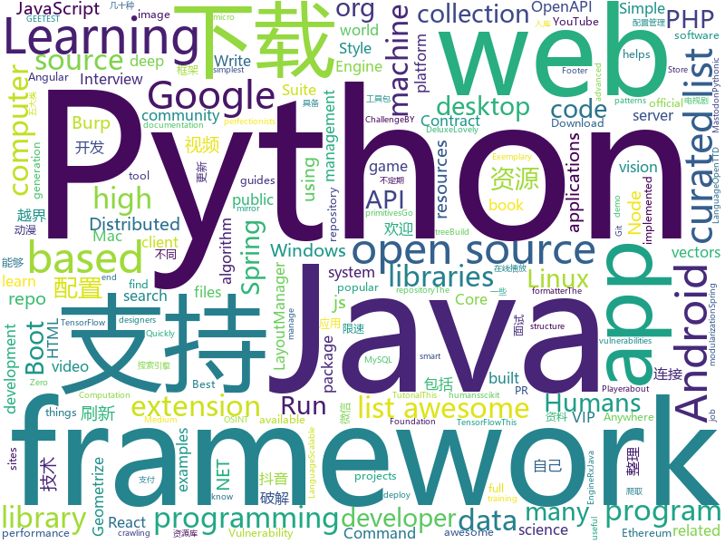

# 2018-06-03
See what the GitHub community is most excited about today.

## python
* [Douyin-Bot](https://github.com/wangshub/Douyin-Bot)(**91 stars today**): Python 抖音机器人，论如何在抖音上找到漂亮小姐姐？😍
* [scylla](https://github.com/imWildCat/scylla)(**60 stars today**): Intelligent proxy pool for Humans™
* [skiptracer](https://github.com/xillwillx/skiptracer)(**49 stars today**): OSINT python webscaping framework
* [models](https://github.com/tensorflow/models)(**37 stars today**): Models and examples built with TensorFlow
* [art-of-hacking](https://github.com/The-Art-of-Hacking/art-of-hacking)(**50 stars today**): This repository includes resources related to ethical hacking / penetration testing, digital forensics and incident response (DFIR), vulnerability research, exploit development, reverse engineering, and more.
* [arl](https://github.com/kaxap/arl)(**44 stars today**): lists of most popular repositories for most favoured programming languages (according to StackOverflow)
* [youtube-dl](https://github.com/rg3/youtube-dl)(**37 stars today**): Command-line program to download videos from YouTube.com and other video sites
* [keras](https://github.com/keras-team/keras)(**30 stars today**): Deep Learning for humans
* [scikit-learn](https://github.com/scikit-learn/scikit-learn)(**32 stars today**): scikit-learn: machine learning in Python
* [keras-applications](https://github.com/keras-team/keras-applications)(**34 stars today**): Reference implementations of popular deep learning models.
* [public-apis](https://github.com/toddmotto/public-apis)(**32 stars today**): A collective list of public JSON APIs for use in web development.
* [Chinese-Word-Vectors](https://github.com/Embedding/Chinese-Word-Vectors)(**32 stars today**): 100+ Chinese Word Vectors 上百种预训练中文词向量
* [python-spider](https://github.com/Jack-Cherish/python-spider)(**25 stars today**): 🌈Python3网络爬虫实战：VIP视频破解助手；GEETEST验证码破解；小说、动漫下载；手机APP爬取；财务报表入库；火车票抢票；抖音APP视频下载；百万英雄辅助；网易云音乐批量下载
* [black](https://github.com/ambv/black)(**29 stars today**): The uncompromising Python code formatter
* [face_recognition](https://github.com/ageitgey/face_recognition)(**25 stars today**): The world's simplest facial recognition api for Python and the command line
* [awesome-machine-learning](https://github.com/josephmisiti/awesome-machine-learning)(**25 stars today**): A curated list of awesome Machine Learning frameworks, libraries and software.
* [flask](https://github.com/pallets/flask)(**24 stars today**): The Python micro framework for building web applications.
* [django](https://github.com/django/django)(**20 stars today**): The Web framework for perfectionists with deadlines.
* [hosts](https://github.com/StevenBlack/hosts)(**24 stars today**): Extending and consolidating hosts files from several well-curated sources like adaway.org, mvps.org, malwaredomainlist.com, someonewhocares.org, and potentially others. You can optionally invoke extensions to block additional sites by category.
* [requests](https://github.com/requests/requests)(**21 stars today**): Python HTTP Requests for Humans™✨🍰✨
* [cowrie](https://github.com/micheloosterhof/cowrie)(**22 stars today**): Cowrie SSH/Telnet Honeypot
* [studyFiles](https://github.com/threerocks/studyFiles)(**19 stars today**): 一些经典且高质量的电子书分享
* [scrapy](https://github.com/scrapy/scrapy)(**18 stars today**): Scrapy, a fast high-level web crawling & scraping framework for Python.
* [IPSRC](https://github.com/jmercouris/IPSRC)(**21 stars today**): IPSRC helps you find your server from anywhere.
* [Crunch](https://github.com/chrissimpkins/Crunch)(**20 stars today**): Insane(ly slow but wicked good) PNG image optimization

## java
* [vjtools](https://github.com/vipshop/vjtools)(**42 stars today**): The vip.com's java coding standard, libraries and tools
* [java-design-patterns](https://github.com/iluwatar/java-design-patterns)(**41 stars today**): Design patterns implemented in Java
* [VideoWorld_Android](https://github.com/123lxw123/VideoWorld_Android)(**31 stars today**): 影视天地（Android 客户端），涵盖电影、电视剧、综艺节目、动漫、游戏五大类别的资源。整合两大资源搜索引擎，连接互联网千万数量级的资源库。支持视频资源在线播放、边下边播，不限速下载，不等待播放。
* [proxyee-down](https://github.com/proxyee-down-org/proxyee-down)(**32 stars today**): http下载工具，基于http代理，支持多连接分块下载
* [interviews](https://github.com/kdn251/interviews)(**28 stars today**): Everything you need to know to get the job.
* [Andromeda](https://github.com/iqiyi/Andromeda)(**24 stars today**): Andromeda simplifies local/remote communication for Android modularization
* [spring-boot](https://github.com/spring-projects/spring-boot)(**20 stars today**): Spring Boot
* [spring-framework](https://github.com/spring-projects/spring-framework)(**19 stars today**): Spring Framework
* [elasticsearch](https://github.com/elastic/elasticsearch)(**19 stars today**): Open Source, Distributed, RESTful Search Engine
* [RxJava](https://github.com/ReactiveX/RxJava)(**18 stars today**): RxJava – Reactive Extensions for the JVM – a library for composing asynchronous and event-based programs using observable sequences for the Java VM.
* [incubator-dubbo](https://github.com/apache/incubator-dubbo)(**16 stars today**): Apache Dubbo (incubating) is a high-performance, java based, open source RPC framework.
* [LayoutManagerGroup](https://github.com/DingMouRen/LayoutManagerGroup)(**19 stars today**): 👉Customize the LayoutManager of RecyclerView(自定义LayoutManager)
* [Java](https://github.com/TheAlgorithms/Java)(**15 stars today**): All Algorithms implemented in Java
* [SmartRefreshLayout](https://github.com/scwang90/SmartRefreshLayout)(**17 stars today**): 🔥下拉刷新、上拉加载、二级刷新、淘宝二楼、RefreshLayout、OverScroll，Android智能下拉刷新框架，支持越界回弹、越界拖动，具有极强的扩展性，集成了几十种炫酷的Header和 Footer。
* [retrofit](https://github.com/square/retrofit)(**15 stars today**): Type-safe HTTP client for Android and Java by Square, Inc.
* [tutorials](https://github.com/eugenp/tutorials)(**9 stars today**): The "REST With Spring" Course:
* [weixin-java-tools](https://github.com/Wechat-Group/weixin-java-tools)(**12 stars today**): 可能是目前最好最全的微信Java开发工具包，支持包括微信支付、开放平台、小程序、企业号和公众号等的开发
* [TicktockMusic](https://github.com/Lauzy/TicktockMusic)(**15 stars today**): Material Design Music Player
* [spring-boot-examples](https://github.com/ityouknow/spring-boot-examples)(**13 stars today**): about learning Spring Boot via examples. Spring Boot 技术栈示例代码，快速简单上手教程。
* [BurpBounty](https://github.com/wagiro/BurpBounty)(**13 stars today**): Burp Bounty is a extension of Burp Suite that improve an active and passive scanner by yourself. This extension requires Burp Suite Pro.
* [apollo](https://github.com/ctripcorp/apollo)(**12 stars today**): Apollo（阿波罗）是携程框架部门研发的分布式配置中心，能够集中化管理应用不同环境、不同集群的配置，配置修改后能够实时推送到应用端，并且具备规范的权限、流程治理等特性，适用于微服务配置管理场景。
* [interview](https://github.com/mission-peace/interview)(**11 stars today**): Interview questions
* [guava](https://github.com/google/guava)(**13 stars today**): Google core libraries for Java
* [graal](https://github.com/oracle/graal)(**13 stars today**): GraalVM: Run Programs Faster Anywhere🚀
* [YalpStore](https://github.com/yeriomin/YalpStore)(**13 stars today**): Download apks from Google Play Store

## unknown
* [build-your-own-x](https://github.com/danistefanovic/build-your-own-x)(**234 stars today**): 🤓Build your own (insert technology here)
* [architect-awesome](https://github.com/xingshaocheng/architect-awesome)(**98 stars today**): 后端架构师技术图谱
* [Learn_Deep_Learning_in_6_Weeks](https://github.com/llSourcell/Learn_Deep_Learning_in_6_Weeks)(**68 stars today**): This is the Curriculum for "Learn Deep Learning in 6 Weeks" by Siraj Raval on Youtube
* [Interview-Notebook](https://github.com/CyC2018/Interview-Notebook)(**48 stars today**): 📚技术面试需要掌握的基础知识整理，欢迎编辑~
* [awesome](https://github.com/sindresorhus/awesome)(**51 stars today**): 😎Curated list of awesome lists
* [gitignore](https://github.com/github/gitignore)(**38 stars today**): A collection of useful .gitignore templates
* [You-Dont-Know-JS](https://github.com/getify/You-Dont-Know-JS)(**42 stars today**): A book series on JavaScript. @YDKJS on twitter.
* [free-programming-books](https://github.com/EbookFoundation/free-programming-books)(**34 stars today**): 📚Freely available programming books
* [awesome-vue](https://github.com/vuejs/awesome-vue)(**33 stars today**): 🎉A curated list of awesome things related to Vue.js
* [coding-interview-university](https://github.com/jwasham/coding-interview-university)(**31 stars today**): A complete computer science study plan to become a software engineer.
* [developer-roadmap](https://github.com/kamranahmedse/developer-roadmap)(**29 stars today**): Roadmap to becoming a web developer in 2018
* [awesome-react](https://github.com/enaqx/awesome-react)(**23 stars today**): A collection of awesome things regarding React ecosystem.
* [awesome-public-datasets](https://github.com/awesomedata/awesome-public-datasets)(**25 stars today**): A topic-centric list of high-quality open datasets in public domains. Propose NEW data ☛☛☛PR☛☛☛
* [PHP-Interview](https://github.com/xianyunyh/PHP-Interview)(**20 stars today**): 这个项目是自己准备PHP面试整理的资料。包括PHP、MySQL、Linux、计算机网络等资料。方便自己以后查阅，会不定期更新，欢迎提交pr，如果错误，请指出，谢谢
* [forum](https://github.com/getlantern/forum)(**22 stars today**): 蓝灯(Lantern)官方论坛
* [front-end-Doc](https://github.com/mgbq/front-end-Doc)(**19 stars today**): 前端文档汇总（觉得对您有用的话，别忘了给点个赞哦^_^ ！）
* [full-speed-python-chinese](https://github.com/HuberTRoy/full-speed-python-chinese)(**22 stars today**): full-speed-python 进击的Python
* [awesome-flutter](https://github.com/Solido/awesome-flutter)(**20 stars today**): All Flutter resources to start and develop your projects !
* [awesome-computer-vision](https://github.com/jbhuang0604/awesome-computer-vision)(**17 stars today**): A curated list of awesome computer vision resources
* [high-speed-downloader](https://github.com/high-speed-downloader/high-speed-downloader)(**18 stars today**): 百度网盘不限速下载 支持Windows和Mac 2018年1月16日更新
* [nocode](https://github.com/kelseyhightower/nocode)(**17 stars today**): The best way to write secure and reliable applications. Write nothing; deploy nowhere.
* [wiki](https://github.com/ethereum/wiki)(**15 stars today**): The Ethereum Wiki
* [awesome-nodejs](https://github.com/sindresorhus/awesome-nodejs)(**15 stars today**): ⚡️Delightful Node.js packages and resources
* [papers-we-love](https://github.com/papers-we-love/papers-we-love)(**15 stars today**): Papers from the computer science community to read and discuss.
* [realworld](https://github.com/gothinkster/realworld)(**15 stars today**): "The mother of all demo apps" — Exemplary fullstack Medium.com clone powered by React, Angular, Node, Django, and many more🏅

## c++
* [horovod](https://github.com/uber/horovod)(**97 stars today**): Distributed training framework for TensorFlow, Keras, and PyTorch.
* [tensorflow](https://github.com/tensorflow/tensorflow)(**78 stars today**): Computation using data flow graphs for scalable machine learning
* [katran](https://github.com/facebookincubator/katran)(**77 stars today**): A high performance layer 4 load balancer
* [eos](https://github.com/EOSIO/eos)(**53 stars today**): An open source smart contract platform
* [bitcoin](https://github.com/bitcoin/bitcoin)(**29 stars today**): Bitcoin Core integration/staging tree
* [electron](https://github.com/electron/electron)(**32 stars today**): Build cross platform desktop apps with JavaScript, HTML, and CSS
* [opencv](https://github.com/opencv/opencv)(**20 stars today**): Open Source Computer Vision Library
* [tesseract](https://github.com/tesseract-ocr/tesseract)(**23 stars today**): Tesseract Open Source OCR Engine (main repository)
* [faiss](https://github.com/facebookresearch/faiss)(**22 stars today**): A library for efficient similarity search and clustering of dense vectors.
* [protobuf](https://github.com/google/protobuf)(**19 stars today**): Protocol Buffers - Google's data interchange format
* [pytorch](https://github.com/pytorch/pytorch)(**17 stars today**): Tensors and Dynamic neural networks in Python with strong GPU acceleration
* [aseprite](https://github.com/aseprite/aseprite)(**18 stars today**): Animated sprite editor & pixel art tool (Windows, macOS, Linux)
* [v8](https://github.com/v8/v8)(**17 stars today**): The official mirror of the V8 Git repository
* [grpc](https://github.com/grpc/grpc)(**16 stars today**): The C based gRPC (C++, Python, Ruby, Objective-C, PHP, C#)
* [geometrize](https://github.com/Tw1ddle/geometrize)(**15 stars today**): 🔳Geometrize is a desktop app that geometrizes images into geometric primitives
* [PhoenixGo](https://github.com/Tencent/PhoenixGo)(**13 stars today**): Go AI program which implement the AlphaGo Zero paper
* [cosmos](https://github.com/OpenGenus/cosmos)(**14 stars today**): Algorithms that run our universe | Your personal library of every algorithm and data structure code that you will ever encounter | Ask us anything at our forum
* [anbox](https://github.com/anbox/anbox)(**13 stars today**): Anbox is a container-based approach to boot a full Android system on a regular GNU/Linux system
* [tdesktop](https://github.com/telegramdesktop/tdesktop)(**12 stars today**): Telegram Desktop messaging app
* [godot](https://github.com/godotengine/godot)(**10 stars today**): Godot Engine – Multi-platform 2D and 3D game engine
* [swift](https://github.com/apple/swift)(**10 stars today**): The Swift Programming Language
* [OpenTTD](https://github.com/OpenTTD/OpenTTD)(**12 stars today**): OpenTTD is an open source simulation game based upon Transport Tycoon Deluxe
* [cmder](https://github.com/cmderdev/cmder)(**11 stars today**): Lovely console emulator package for Windows
* [solidity](https://github.com/ethereum/solidity)(**10 stars today**): Solidity, the Contract-Oriented Programming Language
* [xgboost](https://github.com/dmlc/xgboost)(**8 stars today**): Scalable, Portable and Distributed Gradient Boosting (GBDT, GBRT or GBM) Library, for Python, R, Java, Scala, C++ and more. Runs on single machine, Hadoop, Spark, Flink and DataFlow

## html
* [doufen](https://github.com/tabris17/doufen)(**18 stars today**): 将你的豆瓣帐号数据备份到本地并支持脱机浏览
* [Coursera-ML-AndrewNg-Notes](https://github.com/fengdu78/Coursera-ML-AndrewNg-Notes)(**15 stars today**): 吴恩达老师的机器学习课程个人笔记
* [awesome-mac](https://github.com/jaywcjlove/awesome-mac)(**16 stars today**):  This repo is a collection of awesome Mac applications and tools for developers and designers.
* [openapi-generator](https://github.com/OpenAPITools/openapi-generator)(**16 stars today**): OpenAPI Generator allows generation of API client libraries (SDK generation), server stubs, documentation and configuration automatically given an OpenAPI Spec (v2, v3)
* [styleguide](https://github.com/google/styleguide)(**12 stars today**): Style guides for Google-originated open-source projects
* [JavaScript30](https://github.com/wesbos/JavaScript30)(**10 stars today**): 30 Day Vanilla JS Challenge
* [qiubaiying.github.io](https://github.com/qiubaiying/qiubaiying.github.io)(**6 stars today**): BY Blog ->
* [windows-syscalls](https://github.com/j00ru/windows-syscalls)(**10 stars today**): Windows System Call Tables (NT/2000/XP/2003/Vista/2008/7/2012/8/10)
* [Spoon-Knife](https://github.com/octocat/Spoon-Knife)(****): This repo is for demonstration purposes only.
* [WebFundamentals](https://github.com/google/WebFundamentals)(**8 stars today**): Best practices for modern web development
* [archerysec](https://github.com/archerysec/archerysec)(**8 stars today**): Open Source Vulnerability Assessment and Management helps developers and pentesters to perform scans and manage vulnerabilities.
* [portainer](https://github.com/portainer/portainer)(**7 stars today**): Simple management UI for Docker
* [foundation-sites](https://github.com/zurb/foundation-sites)(**7 stars today**): The most advanced responsive front-end framework in the world. Quickly create prototypes and production code for sites that work on any kind of device.
* [EIPs](https://github.com/ethereum/EIPs)(**6 stars today**): The Ethereum Improvement Proposal repository
* [fonts](https://github.com/google/fonts)(**7 stars today**): Font files available from Google Fonts
* [Spina](https://github.com/SpinaCMS/Spina)(**7 stars today**): Spina CMS
* [brutaldon](https://github.com/jfmcbrayer/brutaldon)(**7 stars today**): A brutalist web interface for Mastodon
* [requests-html](https://github.com/kennethreitz/requests-html)(**6 stars today**): Pythonic HTML Parsing for Humans™
* [SB-Admin-BS4-Angular-6](https://github.com/start-angular/SB-Admin-BS4-Angular-6)(**5 stars today**): Simple Dashboard Admin App built using Angular 6 and Bootstrap 4
* [javascript-tutorial-en](https://github.com/iliakan/javascript-tutorial-en)(**5 stars today**): Modern JavaScript Tutorial
* [dotnet](https://github.com/Microsoft/dotnet)(**5 stars today**): This repo is the official home of .NET on GitHub. It's a great starting point to find many .NET OSS projects from Microsoft and the community, including many that are part of the .NET Foundation.
* [node-interview](https://github.com/ElemeFE/node-interview)(**5 stars today**): How to pass the Node.js interview of ElemeFE.
* [ecma262](https://github.com/tc39/ecma262)(**5 stars today**): Status, process, and documents for ECMA262
* [sass-loader](https://github.com/webpack-contrib/sass-loader)(**5 stars today**): Compiles Sass to CSS
* [frontend-nanodegree-styleguide](https://github.com/udacity/frontend-nanodegree-styleguide)(****): Official FEND style guides

## WordCloud

