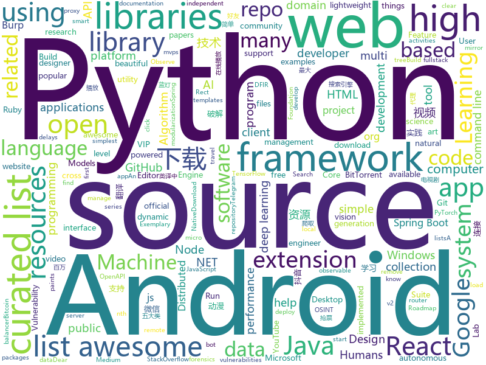

# 2018-06-04
See what the GitHub community is most excited about today.

## python
* [Douyin-Bot](https://github.com/wangshub/Douyin-Bot)(**71 stars today**): Python 抖音机器人，论如何在抖音上找到漂亮小姐姐？😍
* [keras-applications](https://github.com/keras-team/keras-applications)(**62 stars today**): Reference implementations of popular deep learning models.
* [models](https://github.com/tensorflow/models)(**49 stars today**): Models and examples built with TensorFlow
* [art-of-hacking](https://github.com/The-Art-of-Hacking/art-of-hacking)(**60 stars today**): This repository includes resources related to ethical hacking / penetration testing, digital forensics and incident response (DFIR), vulnerability research, exploit development, reverse engineering, and more.
* [awesome-python](https://github.com/vinta/awesome-python)(**53 stars today**): A curated list of awesome Python frameworks, libraries, software and resources
* [wechat_friends](https://github.com/yangxuanxc/wechat_friends)(**42 stars today**): 微信好友信息分析并可视化以及自动回复微信消息
* [public-apis](https://github.com/toddmotto/public-apis)(**43 stars today**): A collective list of public JSON APIs for use in web development.
* [youtube-dl](https://github.com/rg3/youtube-dl)(**36 stars today**): Command-line program to download videos from YouTube.com and other video sites
* [black](https://github.com/ambv/black)(**37 stars today**): The uncompromising Python code formatter
* [scrapy](https://github.com/scrapy/scrapy)(**32 stars today**): Scrapy, a fast high-level web crawling & scraping framework for Python.
* [awesome-machine-learning](https://github.com/josephmisiti/awesome-machine-learning)(**28 stars today**): A curated list of awesome Machine Learning frameworks, libraries and software.
* [pipenv](https://github.com/pypa/pipenv)(**28 stars today**): Python Development Workflow for Humans.
* [arl](https://github.com/kaxap/arl)(**29 stars today**): lists of most popular repositories for most favoured programming languages (according to StackOverflow)
* [scylla](https://github.com/imWildCat/scylla)(**30 stars today**): Intelligent proxy pool for Humans™
* [face_recognition](https://github.com/ageitgey/face_recognition)(**25 stars today**): The world's simplest facial recognition api for Python and the command line
* [nlp-architect](https://github.com/NervanaSystems/nlp-architect)(**28 stars today**): NLP Architect by Intel AI Lab: Python library for exploring the state-of-the-art deep learning topologies and techniques for natural language processing and natural language understanding
* [keras](https://github.com/keras-team/keras)(**24 stars today**): Deep Learning for humans
* [cowrie](https://github.com/micheloosterhof/cowrie)(**27 stars today**): Cowrie SSH/Telnet Honeypot
* [onedrive-sync-client](https://github.com/gzxu/onedrive-sync-client)(**27 stars today**): OneDrive Client with Two-way Synchronizing Feature
* [python-spider](https://github.com/Jack-Cherish/python-spider)(**25 stars today**): 🌈Python3网络爬虫实战：VIP视频破解助手；GEETEST验证码破解；小说、动漫下载；手机APP爬取；财务报表入库；火车票抢票；抖音APP视频下载；百万英雄辅助；网易云音乐批量下载
* [django](https://github.com/django/django)(**22 stars today**): The Web framework for perfectionists with deadlines.
* [featuretools](https://github.com/Featuretools/featuretools)(**25 stars today**): automated feature engineering
* [flask](https://github.com/pallets/flask)(**19 stars today**): The Python micro framework for building web applications.
* [skiptracer](https://github.com/xillwillx/skiptracer)(**20 stars today**): OSINT python webscaping framework
* [hosts](https://github.com/StevenBlack/hosts)(**20 stars today**): Extending and consolidating hosts files from several well-curated sources like adaway.org, mvps.org, malwaredomainlist.com, someonewhocares.org, and potentially others. You can optionally invoke extensions to block additional sites by category.

## java
* [java-design-patterns](https://github.com/iluwatar/java-design-patterns)(**42 stars today**): Design patterns implemented in Java
* [dslabs](https://github.com/emichael/dslabs)(**39 stars today**): Distributed Systems Labs and Framework
* [proxyee-down](https://github.com/proxyee-down-org/proxyee-down)(**32 stars today**): http下载工具，基于http代理，支持多连接分块下载
* [interviews](https://github.com/kdn251/interviews)(**32 stars today**): Everything you need to know to get the job.
* [Andromeda](https://github.com/iqiyi/Andromeda)(**31 stars today**): Andromeda simplifies local/remote communication for Android modularization
* [spring-framework](https://github.com/spring-projects/spring-framework)(**20 stars today**): Spring Framework
* [PhotoEditor](https://github.com/burhanrashid52/PhotoEditor)(**20 stars today**): A Photo Editor library with simple, easy support for image editing using paints,text,emoji and Sticker like stories.
* [vjtools](https://github.com/vipshop/vjtools)(**19 stars today**): The vip.com's java coding standard, libraries and tools
* [Java](https://github.com/TheAlgorithms/Java)(**17 stars today**): All Algorithms implemented in Java
* [elasticsearch](https://github.com/elastic/elasticsearch)(**19 stars today**): Open Source, Distributed, RESTful Search Engine
* [RxJava](https://github.com/ReactiveX/RxJava)(**17 stars today**): RxJava – Reactive Extensions for the JVM – a library for composing asynchronous and event-based programs using observable sequences for the Java VM.
* [VideoWorld_Android](https://github.com/123lxw123/VideoWorld_Android)(**16 stars today**): 影视天地（Android 客户端），涵盖电影、电视剧、综艺节目、动漫、游戏五大类别的资源。整合两大资源搜索引擎，连接互联网千万数量级的资源库。支持视频资源在线播放、边下边播，不限速下载，不等待播放。
* [interview](https://github.com/mission-peace/interview)(**16 stars today**): Interview questions
* [spring-boot](https://github.com/spring-projects/spring-boot)(**14 stars today**): Spring Boot
* [springboot-learning-example](https://github.com/JeffLi1993/springboot-learning-example)(**15 stars today**): spring boot 实践学习案例，是 spring boot 初学者及核心技术巩固的最佳实践。
* [incubator-dubbo](https://github.com/apache/incubator-dubbo)(**13 stars today**): Apache Dubbo (incubating) is a high-performance, java based, open source RPC framework.
* [guava](https://github.com/google/guava)(**13 stars today**): Google core libraries for Java
* [ARouter](https://github.com/alibaba/ARouter)(**13 stars today**): An android router middleware that help app navigating to activities and custom services.
* [okhttp](https://github.com/square/okhttp)(**12 stars today**): An HTTP+HTTP/2 client for Android and Java applications.
* [BurpBounty](https://github.com/wagiro/BurpBounty)(**14 stars today**): Burp Bounty is a extension of Burp Suite that improve an active and passive scanner by yourself. This extension requires Burp Suite Pro.
* [tutorials](https://github.com/eugenp/tutorials)(**7 stars today**): The "REST With Spring" Course:
* [BeesAndroid](https://github.com/BeesAndroid/BeesAndroid)(**14 stars today**): The project aims to help more Android engineers understand the Android system and master the Android system by providing a series of tools and methods.
* [spring-boot-examples](https://github.com/ityouknow/spring-boot-examples)(**12 stars today**): about learning Spring Boot via examples. Spring Boot 技术栈示例代码，快速简单上手教程。
* [lottie-android](https://github.com/airbnb/lottie-android)(**9 stars today**): Render After Effects animations natively on Android and iOS, Web, and React Native
* [YalpStore](https://github.com/yeriomin/YalpStore)(**12 stars today**): Download apks from Google Play Store

## unknown
* [IF_MS_BUYS_GITHUB_IMMA_OUT](https://github.com/upend/IF_MS_BUYS_GITHUB_IMMA_OUT)(**313 stars today**): Microsoft and GitHub have held acquisition talks. Star this repo to keep GitHub independent.
* [react-typescript-cheatsheet](https://github.com/sw-yx/react-typescript-cheatsheet)(**268 stars today**): a cheatsheet for react users using typescript with react for the first (or nth!) time
* [build-your-own-x](https://github.com/danistefanovic/build-your-own-x)(**190 stars today**): 🤓Build your own (insert technology here)
* [architect-awesome](https://github.com/xingshaocheng/architect-awesome)(**65 stars today**): 后端架构师技术图谱
* [awesome](https://github.com/sindresorhus/awesome)(**60 stars today**): 😎Curated list of awesome lists
* [coding-interview-university](https://github.com/jwasham/coding-interview-university)(**48 stars today**): A complete computer science study plan to become a software engineer.
* [Learn_Deep_Learning_in_6_Weeks](https://github.com/llSourcell/Learn_Deep_Learning_in_6_Weeks)(**46 stars today**): This is the Curriculum for "Learn Deep Learning in 6 Weeks" by Siraj Raval on Youtube
* [Interview-Notebook](https://github.com/CyC2018/Interview-Notebook)(**34 stars today**): 📚技术面试需要掌握的基础知识整理，欢迎编辑~
* [developer-roadmap](https://github.com/kamranahmedse/developer-roadmap)(**40 stars today**): Roadmap to becoming a web developer in 2018
* [gitignore](https://github.com/github/gitignore)(**32 stars today**): A collection of useful .gitignore templates
* [realworld](https://github.com/gothinkster/realworld)(**35 stars today**): "The mother of all demo apps" — Exemplary fullstack Medium.com clone powered by React, Angular, Node, Django, and many more🏅
* [awesome-vue](https://github.com/vuejs/awesome-vue)(**31 stars today**): 🎉A curated list of awesome things related to Vue.js
* [awesome-flutter](https://github.com/Solido/awesome-flutter)(**26 stars today**): All Flutter resources to start and develop your projects !
* [free-programming-books](https://github.com/EbookFoundation/free-programming-books)(**23 stars today**): 📚Freely available programming books
* [awesome-public-datasets](https://github.com/awesomedata/awesome-public-datasets)(**23 stars today**): A topic-centric list of high-quality open datasets in public domains. Propose NEW data ☛☛☛PR☛☛☛
* [awesome-react](https://github.com/enaqx/awesome-react)(**21 stars today**): A collection of awesome things regarding React ecosystem.
* [awesome-computer-vision](https://github.com/jbhuang0604/awesome-computer-vision)(**20 stars today**): A curated list of awesome computer vision resources
* [forum](https://github.com/getlantern/forum)(**20 stars today**): 蓝灯(Lantern)官方论坛
* [awesome-neuroscience](https://github.com/analyticalmonk/awesome-neuroscience)(**21 stars today**): A curated list of awesome neuroscience libraries, software and any content related to the domain.
* [papers-we-love](https://github.com/papers-we-love/papers-we-love)(**19 stars today**): Papers from the computer science community to read and discuss.
* [ddd-dynamic](https://github.com/valignatev/ddd-dynamic)(**19 stars today**): Domain Driven Design in Python, Ruby and other dynamic languages resources
* [awesome-nodejs](https://github.com/sindresorhus/awesome-nodejs)(**17 stars today**): ⚡️Delightful Node.js packages and resources
* [trackerslist](https://github.com/ngosang/trackerslist)(**16 stars today**): An updated list of public BitTorrent trackers
* [awesome-machine-learning-on-source-code](https://github.com/src-d/awesome-machine-learning-on-source-code)(**16 stars today**): Interesting links & research papers related to Machine Learning applied to source code (MLonCode)
* [gold-miner](https://github.com/xitu/gold-miner)(**15 stars today**): 🥇掘金翻译计划，可能是世界最大最好的英译中技术社区，最懂读者和译者的翻译平台：

## c++
* [horovod](https://github.com/uber/horovod)(**198 stars today**): Distributed training framework for TensorFlow, Keras, and PyTorch.
* [eos](https://github.com/EOSIO/eos)(**105 stars today**): An open source smart contract platform
* [tensorflow](https://github.com/tensorflow/tensorflow)(**84 stars today**): Computation using data flow graphs for scalable machine learning
* [katran](https://github.com/facebookincubator/katran)(**43 stars today**): A high performance layer 4 load balancer
* [bitcoin](https://github.com/bitcoin/bitcoin)(**31 stars today**): Bitcoin Core integration/staging tree
* [electron](https://github.com/electron/electron)(**31 stars today**): Build cross platform desktop apps with JavaScript, HTML, and CSS
* [pytorch](https://github.com/pytorch/pytorch)(**19 stars today**): Tensors and Dynamic neural networks in Python with strong GPU acceleration
* [protobuf](https://github.com/google/protobuf)(**16 stars today**): Protocol Buffers - Google's data interchange format
* [opencv](https://github.com/opencv/opencv)(**11 stars today**): Open Source Computer Vision Library
* [aseprite](https://github.com/aseprite/aseprite)(**16 stars today**): Animated sprite editor & pixel art tool (Windows, macOS, Linux)
* [cosmos](https://github.com/OpenGenus/cosmos)(**16 stars today**): Algorithms that run our universe | Your personal library of every algorithm and data structure code that you will ever encounter | Ask us anything at our forum
* [aria2](https://github.com/aria2/aria2)(**15 stars today**): aria2 is a lightweight multi-protocol & multi-source, cross platform download utility operated in command-line. It supports HTTP/HTTPS, FTP, SFTP, BitTorrent and Metalink.
* [grpc](https://github.com/grpc/grpc)(**15 stars today**): The C based gRPC (C++, Python, Ruby, Objective-C, PHP, C#)
* [TranslucentTB](https://github.com/TranslucentTB/TranslucentTB)(**15 stars today**): A lightweight utility that makes the Windows taskbar translucent/transparent.
* [PhoenixGo](https://github.com/Tencent/PhoenixGo)(**12 stars today**): Go AI program which implement the AlphaGo Zero paper
* [zig](https://github.com/ziglang/zig)(**13 stars today**): robust, optimal, and clear programming language
* [godot](https://github.com/godotengine/godot)(**12 stars today**): Godot Engine – Multi-platform 2D and 3D game engine
* [fmt](https://github.com/fmtlib/fmt)(**13 stars today**): A modern formatting library
* [xgboost](https://github.com/dmlc/xgboost)(**12 stars today**): Scalable, Portable and Distributed Gradient Boosting (GBDT, GBRT or GBM) Library, for Python, R, Java, Scala, C++ and more. Runs on single machine, Hadoop, Spark, Flink and DataFlow
* [AirSim](https://github.com/Microsoft/AirSim)(**12 stars today**): Open source simulator based on Unreal Engine for autonomous vehicles from Microsoft AI & Research
* [griddb_nosql](https://github.com/griddb/griddb_nosql)(**11 stars today**): high performance, high scalability and high reliability database for big data
* [imgui](https://github.com/ocornut/imgui)(**10 stars today**): Dear ImGui: Bloat-free Immediate Mode Graphical User interface for C++ with minimal dependencies
* [v8](https://github.com/v8/v8)(**9 stars today**): The official mirror of the V8 Git repository
* [tdesktop](https://github.com/telegramdesktop/tdesktop)(**10 stars today**): Telegram Desktop messaging app
* [apollo](https://github.com/ApolloAuto/apollo)(**9 stars today**): An open autonomous driving platform

## html
* [taiwan-travel-level](https://github.com/tpai/taiwan-travel-level)(**32 stars today**): How many place you live since you are kid? Show me your taiwan travel level!
* [observe-rect](https://github.com/reach/observe-rect)(**28 stars today**): Observe the Rect of a DOM Element
* [patchwork](https://github.com/jlord/patchwork)(****): All the Git-it Workshop completers!
* [Winds](https://github.com/GetStream/Winds)(**12 stars today**): A Beautiful Open Source RSS & Podcast App
* [archerysec](https://github.com/archerysec/archerysec)(**11 stars today**): Open Source Vulnerability Assessment and Management helps developers and pentesters to perform scans and manage vulnerabilities.
* [JavaScript30](https://github.com/wesbos/JavaScript30)(**7 stars today**): 30 Day Vanilla JS Challenge
* [Coursera-ML-AndrewNg-Notes](https://github.com/fengdu78/Coursera-ML-AndrewNg-Notes)(**8 stars today**): 吴恩达老师的机器学习课程个人笔记
* [awesome-mac](https://github.com/jaywcjlove/awesome-mac)(**9 stars today**):  This repo is a collection of awesome Mac applications and tools for developers and designers.
* [EIPs](https://github.com/ethereum/EIPs)(**10 stars today**): The Ethereum Improvement Proposal repository
* [Spoon-Knife](https://github.com/octocat/Spoon-Knife)(****): This repo is for demonstration purposes only.
* [core](https://github.com/stackblitz/core)(**9 stars today**): Online IDE powered by VS Code⚡️
* [windows-syscalls](https://github.com/j00ru/windows-syscalls)(**9 stars today**): Windows System Call Tables (NT/2000/XP/2003/Vista/2008/7/2012/8/10)
* [brutaldon](https://github.com/jfmcbrayer/brutaldon)(**9 stars today**): A brutalist web interface for Mastodon
* [gentelella](https://github.com/puikinsh/gentelella)(**7 stars today**): Free Bootstrap 3 Admin Template
* [fastclick](https://github.com/ftlabs/fastclick)(**8 stars today**): Polyfill to remove click delays on browsers with touch UIs
* [fonts](https://github.com/google/fonts)(**7 stars today**): Font files available from Google Fonts
* [openapi-generator](https://github.com/OpenAPITools/openapi-generator)(**7 stars today**): OpenAPI Generator allows generation of API client libraries (SDK generation), server stubs, documentation and configuration automatically given an OpenAPI Spec (v2, v3)
* [ecma262](https://github.com/tc39/ecma262)(**6 stars today**): Status, process, and documents for ECMA262
* [mkdocs-material](https://github.com/squidfunk/mkdocs-material)(**5 stars today**): A Material Design theme for MkDocs
* [zenbot](https://github.com/DeviaVir/zenbot)(**5 stars today**): Zenbot is a command-line cryptocurrency trading bot using Node.js and MongoDB.
* [hugo-academic](https://github.com/gcushen/hugo-academic)(**5 stars today**): The website designer for Hugo. Build and deploy a beautiful website in minutes🚀
* [responsive-html-email-template](https://github.com/leemunroe/responsive-html-email-template)(**6 stars today**): A free simple responsive HTML email template
* [requests-html](https://github.com/kennethreitz/requests-html)(**5 stars today**): Pythonic HTML Parsing for Humans™
* [dotnet](https://github.com/Microsoft/dotnet)(**5 stars today**): This repo is the official home of .NET on GitHub. It's a great starting point to find many .NET OSS projects from Microsoft and the community, including many that are part of the .NET Foundation.
* [portainer](https://github.com/portainer/portainer)(**5 stars today**): Simple management UI for Docker

## WordCloud

