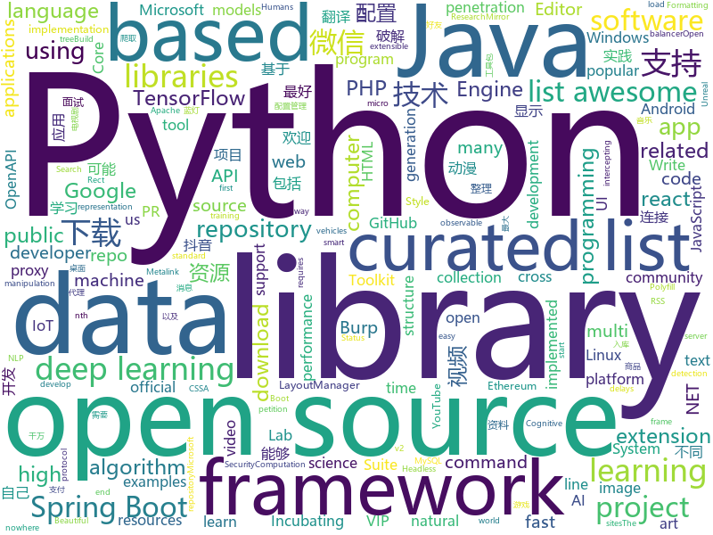

# 2018-06-05
See what the GitHub community is most excited about today.

## python
* [Douyin-Bot](https://github.com/wangshub/Douyin-Bot)(**231 stars today**): Python 抖音机器人，论如何在抖音上找到漂亮小姐姐？😍
* [models](https://github.com/tensorflow/models)(**82 stars today**): Models and examples built with TensorFlow
* [wechat_friends](https://github.com/yangxuanxc/wechat_friends)(**74 stars today**): 微信好友信息分析并可视化以及自动回复微信消息
* [art-of-hacking](https://github.com/The-Art-of-Hacking/art-of-hacking)(**71 stars today**): This repository includes resources related to ethical hacking / penetration testing, digital forensics and incident response (DFIR), vulnerability research, exploit development, reverse engineering, and more.
* [awesome-python](https://github.com/vinta/awesome-python)(**58 stars today**): A curated list of awesome Python frameworks, libraries, software and resources
* [keras](https://github.com/keras-team/keras)(**50 stars today**): Deep Learning for humans
* [arl](https://github.com/kaxap/arl)(**57 stars today**): lists of most popular repositories for most favoured programming languages (according to StackOverflow)
* [python-spider](https://github.com/Jack-Cherish/python-spider)(**49 stars today**): 🌈Python3网络爬虫实战：VIP视频破解助手；GEETEST验证码破解；小说、动漫下载；手机APP爬取；财务报表入库；火车票抢票；抖音APP视频下载；百万英雄辅助；网易云音乐批量下载
* [public-apis](https://github.com/toddmotto/public-apis)(**49 stars today**): A collective list of public JSON APIs for use in web development.
* [black](https://github.com/ambv/black)(**50 stars today**): The uncompromising Python code formatter
* [face_recognition](https://github.com/ageitgey/face_recognition)(**41 stars today**): The world's simplest facial recognition api for Python and the command line
* [scikit-learn](https://github.com/scikit-learn/scikit-learn)(**35 stars today**): scikit-learn: machine learning in Python
* [scylla](https://github.com/imWildCat/scylla)(**39 stars today**): Intelligent proxy pool for Humans™
* [awesome-machine-learning](https://github.com/josephmisiti/awesome-machine-learning)(**38 stars today**): A curated list of awesome Machine Learning frameworks, libraries and software.
* [mitmproxy](https://github.com/mitmproxy/mitmproxy)(**38 stars today**): An interactive TLS-capable intercepting HTTP proxy for penetration testers and software developers.
* [Crunch](https://github.com/chrissimpkins/Crunch)(**37 stars today**): Insane(ly slow but wicked good) PNG image optimization
* [studyFiles](https://github.com/threerocks/studyFiles)(**33 stars today**): 一些经典且高质量的电子书分享
* [youtube-dl](https://github.com/rg3/youtube-dl)(**33 stars today**): Command-line program to download videos from YouTube.com and other video sites
* [flask](https://github.com/pallets/flask)(**31 stars today**): The Python micro framework for building web applications.
* [gym](https://github.com/openai/gym)(**30 stars today**): A toolkit for developing and comparing reinforcement learning algorithms.
* [nlp-architect](https://github.com/NervanaSystems/nlp-architect)(**31 stars today**): NLP Architect by Intel AI Lab: Python library for exploring the state-of-the-art deep learning topologies and techniques for natural language processing and natural language understanding
* [tqdm](https://github.com/tqdm/tqdm)(**29 stars today**): A fast, extensible progress bar for Python and CLI
* [keras-applications](https://github.com/keras-team/keras-applications)(**28 stars today**): Reference implementations of popular deep learning models.
* [cpython](https://github.com/python/cpython)(**21 stars today**): The Python programming language
* [pandas](https://github.com/pandas-dev/pandas)(**21 stars today**): Flexible and powerful data analysis / manipulation library for Python, providing labeled data structures similar to R data.frame objects, statistical functions, and much more

## java
* [z_comic_new](https://github.com/zhhr1122/z_comic_new)(**185 stars today**): 一款采用MVP模式的设计的仿造腾讯漫画的APP
* [vjtools](https://github.com/vipshop/vjtools)(**169 stars today**): The vip.com's java coding standard, libraries and tools
* [Andromeda](https://github.com/iqiyi/Andromeda)(**92 stars today**): Andromeda simplifies local/remote communication for Android modularization
* [PhotoEditor](https://github.com/burhanrashid52/PhotoEditor)(**92 stars today**): A Photo Editor library with simple, easy support for image editing using paints,text,emoji and Sticker like stories.
* [LayoutManagerGroup](https://github.com/DingMouRen/LayoutManagerGroup)(**85 stars today**): 👉Customize the LayoutManager of RecyclerView(自定义LayoutManager)
* [java-design-patterns](https://github.com/iluwatar/java-design-patterns)(**65 stars today**): Design patterns implemented in Java
* [jesper_seckill](https://github.com/zaiyunduan123/jesper_seckill)(**65 stars today**): 🐎基于Springboot高并发商品限时秒杀系统
* [interviews](https://github.com/kdn251/interviews)(**57 stars today**): Everything you need to know to get the job.
* [apollo](https://github.com/ctripcorp/apollo)(**49 stars today**): Apollo（阿波罗）是携程框架部门研发的分布式配置中心，能够集中化管理应用不同环境、不同集群的配置，配置修改后能够实时推送到应用端，并且具备规范的权限、流程治理等特性，适用于微服务配置管理场景。
* [proxyee-down](https://github.com/proxyee-down-org/proxyee-down)(**47 stars today**): http下载工具，基于http代理，支持多连接分块下载
* [spring-boot](https://github.com/spring-projects/spring-boot)(**38 stars today**): Spring Boot
* [dslabs](https://github.com/emichael/dslabs)(**48 stars today**): Distributed Systems Labs and Framework
* [spring-framework](https://github.com/spring-projects/spring-framework)(**42 stars today**): Spring Framework
* [elasticsearch](https://github.com/elastic/elasticsearch)(**34 stars today**): Open Source, Distributed, RESTful Search Engine
* [weixin-java-tools](https://github.com/Wechat-Group/weixin-java-tools)(**34 stars today**): 可能是目前最好最全的微信Java开发工具包，支持包括微信支付、开放平台、小程序、企业号和公众号等的开发
* [RxJava](https://github.com/ReactiveX/RxJava)(**38 stars today**): RxJava – Reactive Extensions for the JVM – a library for composing asynchronous and event-based programs using observable sequences for the Java VM.
* [VideoWorld_Android](https://github.com/123lxw123/VideoWorld_Android)(**34 stars today**): 影视天地（Android 客户端），涵盖电影、电视剧、综艺节目、动漫、游戏五大类别的资源。整合两大资源搜索引擎，连接互联网千万数量级的资源库。支持视频资源在线播放、边下边播，不限速下载，不等待播放。
* [BurpBounty](https://github.com/wagiro/BurpBounty)(**35 stars today**): Burp Bounty is a extension of Burp Suite that improve an active and passive scanner by yourself. This extension requires Burp Suite Pro.
* [spring-boot-examples](https://github.com/ityouknow/spring-boot-examples)(**32 stars today**): about learning Spring Boot via examples. Spring Boot 技术栈示例代码，快速简单上手教程。
* [Java-Interview](https://github.com/crossoverJie/Java-Interview)(**32 stars today**): 👨‍🎓Java related : basic, concurrent, algorithm
* [incubator-dubbo](https://github.com/apache/incubator-dubbo)(**29 stars today**): Apache Dubbo (incubating) is a high-performance, java based, open source RPC framework.
* [YalpStore](https://github.com/yeriomin/YalpStore)(**32 stars today**): Download apks from Google Play Store
* [springboot-learning-example](https://github.com/JeffLi1993/springboot-learning-example)(**28 stars today**): spring boot 实践学习案例，是 spring boot 初学者及核心技术巩固的最佳实践。
* [Java](https://github.com/TheAlgorithms/Java)(**24 stars today**): All Algorithms implemented in Java
* [guava](https://github.com/google/guava)(**28 stars today**): Google core libraries for Java

## unknown
* [IF_MS_BUYS_GITHUB_IMMA_OUT](https://github.com/upend/IF_MS_BUYS_GITHUB_IMMA_OUT)(**1,383 stars today**): GitHub has sold us out. This is the GitHub Evacuation Center.
* [build-your-own-x](https://github.com/danistefanovic/build-your-own-x)(**375 stars today**): 🤓Build your own (insert technology here)
* [react-typescript-cheatsheet](https://github.com/sw-yx/react-typescript-cheatsheet)(**202 stars today**): a cheatsheet for react users using typescript with react for the first (or nth!) time
* [architect-awesome](https://github.com/xingshaocheng/architect-awesome)(**180 stars today**): 后端架构师技术图谱
* [Interview-Notebook](https://github.com/CyC2018/Interview-Notebook)(**85 stars today**): 📚技术面试需要掌握的基础知识整理，欢迎编辑~
* [gitignore](https://github.com/github/gitignore)(**63 stars today**): A collection of useful .gitignore templates
* [awesome](https://github.com/sindresorhus/awesome)(**80 stars today**): 😎Curated list of awesome lists
* [free-programming-books](https://github.com/EbookFoundation/free-programming-books)(**60 stars today**): 📚Freely available programming books
* [coding-interview-university](https://github.com/jwasham/coding-interview-university)(**43 stars today**): A complete computer science study plan to become a software engineer.
* [awesome-vue](https://github.com/vuejs/awesome-vue)(**49 stars today**): 🎉A curated list of awesome things related to Vue.js
* [developer-roadmap](https://github.com/kamranahmedse/developer-roadmap)(**41 stars today**): Roadmap to becoming a web developer in 2018
* [forum](https://github.com/getlantern/forum)(**41 stars today**): 蓝灯(Lantern)官方论坛
* [tttable](https://github.com/leeper/tttable)(**41 stars today**): Defining a grammar of tables
* [petition](https://github.com/independent-github/petition)(**26 stars today**): Developers petition for an independent Github
* [awesome-eventstorming](https://github.com/mariuszgil/awesome-eventstorming)(**35 stars today**): Awesome EventStorming
* [gold-miner](https://github.com/xitu/gold-miner)(**32 stars today**): 🥇掘金翻译计划，可能是世界最大最好的英译中技术社区，最懂读者和译者的翻译平台：
* [awesome-public-datasets](https://github.com/awesomedata/awesome-public-datasets)(**31 stars today**): A topic-centric list of high-quality open datasets in public domains. Propose NEW data ☛☛☛PR☛☛☛
* [papers-we-love](https://github.com/papers-we-love/papers-we-love)(**32 stars today**): Papers from the computer science community to read and discuss.
* [wiki](https://github.com/ethereum/wiki)(**31 stars today**): The Ethereum Wiki
* [awesome-flutter](https://github.com/Solido/awesome-flutter)(**30 stars today**): All Flutter resources to start and develop your projects !
* [project-based-learning](https://github.com/tuvtran/project-based-learning)(**27 stars today**): Curated list of project-based tutorials
* [nocode](https://github.com/kelseyhightower/nocode)(**29 stars today**): The best way to write secure and reliable applications. Write nothing; deploy nowhere.
* [Learn_Deep_Learning_in_6_Weeks](https://github.com/llSourcell/Learn_Deep_Learning_in_6_Weeks)(**28 stars today**): This is the Curriculum for "Learn Deep Learning in 6 Weeks" by Siraj Raval on Youtube
* [PHP-Interview](https://github.com/xianyunyh/PHP-Interview)(**26 stars today**): 这个项目是自己准备PHP面试整理的资料。包括PHP、MySQL、Linux、计算机网络等资料。方便自己以后查阅，会不定期更新，欢迎提交pr，如果错误，请指出，谢谢
* [IoTSecurity101](https://github.com/V33RU/IoTSecurity101)(**26 stars today**): From IoT Pentesting to IoT Security

## c++
* [tensorflow](https://github.com/tensorflow/tensorflow)(**120 stars today**): Computation using data flow graphs for scalable machine learning
* [eos](https://github.com/EOSIO/eos)(**127 stars today**): An open source smart contract platform
* [horovod](https://github.com/uber/horovod)(**85 stars today**): Distributed training framework for TensorFlow, Keras, and PyTorch.
* [bitcoin](https://github.com/bitcoin/bitcoin)(**61 stars today**): Bitcoin Core integration/staging tree
* [electron](https://github.com/electron/electron)(**65 stars today**): Build cross platform desktop apps with JavaScript, HTML, and CSS
* [katran](https://github.com/facebookincubator/katran)(**62 stars today**): A high performance layer 4 load balancer
* [opencv](https://github.com/opencv/opencv)(**36 stars today**): Open Source Computer Vision Library
* [protobuf](https://github.com/google/protobuf)(**36 stars today**): Protocol Buffers - Google's data interchange format
* [pytorch](https://github.com/pytorch/pytorch)(**37 stars today**): Tensors and Dynamic neural networks in Python with strong GPU acceleration
* [aseprite](https://github.com/aseprite/aseprite)(**40 stars today**): Animated sprite editor & pixel art tool (Windows, macOS, Linux)
* [SoACode-Public](https://github.com/RegrowthStudios/SoACode-Public)(**37 stars today**): Public repository for all the game code for Seed of Andromeda.
* [TrafficMonitor](https://github.com/zhongyang219/TrafficMonitor)(**35 stars today**): 这是一个用于显示当前网速、CPU及内存利用率的桌面悬浮窗软件，并支持任务栏显示，支持更换皮肤。
* [tesseract](https://github.com/tesseract-ocr/tesseract)(**30 stars today**): Tesseract Open Source OCR Engine (main repository)
* [caffe](https://github.com/BVLC/caffe)(**26 stars today**): Caffe: a fast open framework for deep learning.
* [aria2](https://github.com/aria2/aria2)(**30 stars today**): aria2 is a lightweight multi-protocol & multi-source, cross platform download utility operated in command-line. It supports HTTP/HTTPS, FTP, SFTP, BitTorrent and Metalink.
* [v8](https://github.com/v8/v8)(**27 stars today**): The official mirror of the V8 Git repository
* [CNTK](https://github.com/Microsoft/CNTK)(**20 stars today**): Microsoft Cognitive Toolkit (CNTK), an open source deep-learning toolkit
* [spdlog](https://github.com/gabime/spdlog)(**20 stars today**): Fast C++ logging library.
* [openpose](https://github.com/CMU-Perceptual-Computing-Lab/openpose)(**15 stars today**): OpenPose: Real-time multi-person keypoint detection library for body, face, and hands estimation
* [pprintpp](https://github.com/tfc/pprintpp)(**19 stars today**): Typesafe Python Style Printf Formatting for C++
* [grpc](https://github.com/grpc/grpc)(**17 stars today**): The C based gRPC (C++, Python, Ruby, Objective-C, PHP, C#)
* [AirSim](https://github.com/Microsoft/AirSim)(**17 stars today**): Open source simulator based on Unreal Engine for autonomous vehicles from Microsoft AI & Research
* [incubator-singa](https://github.com/apache/incubator-singa)(**18 stars today**): Mirror of Apache Singa (Incubating)
* [DeepSpeech](https://github.com/mozilla/DeepSpeech)(**17 stars today**): A TensorFlow implementation of Baidu's DeepSpeech architecture
* [cosmos](https://github.com/OpenGenus/cosmos)(**16 stars today**): Algorithms that run our universe | Your personal library of every algorithm and data structure code that you will ever encounter | Ask us anything at our forum

## html
* [favorites-web](https://github.com/cloudfavorites/favorites-web)(**105 stars today**): 云收藏 Spring Boot 2.0 开源项目
* [Winds](https://github.com/GetStream/Winds)(**21 stars today**): A Beautiful Open Source RSS & Podcast App
* [react-app-rewired](https://github.com/timarney/react-app-rewired)(**20 stars today**): Override create-react-app webpack configs without ejecting
* [portainer](https://github.com/portainer/portainer)(**19 stars today**): Simple management UI for Docker
* [observe-rect](https://github.com/reach/observe-rect)(**19 stars today**): Observe the Rect of a DOM Element
* [dotnet](https://github.com/Microsoft/dotnet)(**16 stars today**): This repo is the official home of .NET on GitHub. It's a great starting point to find many .NET OSS projects from Microsoft and the community, including many that are part of the .NET Foundation.
* [styleguide](https://github.com/google/styleguide)(**13 stars today**): Style guides for Google-originated open-source projects
* [Coursera-ML-AndrewNg-Notes](https://github.com/fengdu78/Coursera-ML-AndrewNg-Notes)(**14 stars today**): 吴恩达老师的机器学习课程个人笔记
* [fastText](https://github.com/facebookresearch/fastText)(**15 stars today**): Library for fast text representation and classification.
* [fastclick](https://github.com/ftlabs/fastclick)(**13 stars today**): Polyfill to remove click delays on browsers with touch UIs
* [Spoon-Knife](https://github.com/octocat/Spoon-Knife)(****): This repo is for demonstration purposes only.
* [taiwan-travel-level](https://github.com/tpai/taiwan-travel-level)(**13 stars today**): How many place you live since you are kid? Show me your taiwan travel level!
* [phantomjs](https://github.com/ariya/phantomjs)(**11 stars today**): Scriptable Headless Browser
* [node-interview](https://github.com/ElemeFE/node-interview)(**10 stars today**): How to pass the Node.js interview of ElemeFE.
* [openapi-generator](https://github.com/OpenAPITools/openapi-generator)(**9 stars today**): OpenAPI Generator allows generation of API client libraries (SDK generation), server stubs, documentation and configuration automatically given an OpenAPI Spec (v2, v3)
* [EIPs](https://github.com/ethereum/EIPs)(**8 stars today**): The Ethereum Improvement Proposal repository
* [awesome-mac](https://github.com/jaywcjlove/awesome-mac)(**10 stars today**):  This repo is a collection of awesome Mac applications and tools for developers and designers.
* [windows-syscalls](https://github.com/j00ru/windows-syscalls)(**9 stars today**): Windows System Call Tables (NT/2000/XP/2003/Vista/2008/7/2012/8/10)
* [primeng](https://github.com/primefaces/primeng)(**9 stars today**): UI Components for Angular
* [javascript-tutorial-en](https://github.com/iliakan/javascript-tutorial-en)(**9 stars today**): Modern JavaScript Tutorial
* [electron-api-demos](https://github.com/electron/electron-api-demos)(**6 stars today**): Explore the Electron APIs
* [wysiwyg-editor](https://github.com/froala/wysiwyg-editor)(**8 stars today**): A beautifully designed WYSIWYG HTML Editor based on HTML5.
* [ecma262](https://github.com/tc39/ecma262)(**7 stars today**): Status, process, and documents for ECMA262
* [ng-alain](https://github.com/cipchk/ng-alain)(**7 stars today**): ng-zorro-antd admin panel front-end framework
* [Spina](https://github.com/SpinaCMS/Spina)(**7 stars today**): Spina CMS

## WordCloud

