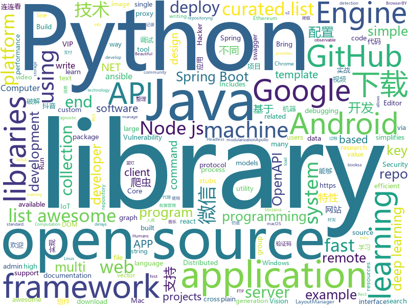

# 2018-06-06
See what the GitHub community is most excited about today.

## python
* [Douyin-Bot](https://github.com/wangshub/Douyin-Bot)(**195 stars today**): Python 抖音机器人，论如何在抖音上找到漂亮小姐姐？😍
* [models](https://github.com/tensorflow/models)(**80 stars today**): Models and examples built with TensorFlow
* [XSStrike](https://github.com/UltimateHackers/XSStrike)(**95 stars today**): XSS Scanner equipped with powerful fuzzing engine & intelligent payload generator
* [awesome-python](https://github.com/vinta/awesome-python)(**62 stars today**): A curated list of awesome Python frameworks, libraries, software and resources
* [public-apis](https://github.com/toddmotto/public-apis)(**62 stars today**): A collective list of public JSON APIs for use in web development.
* [magnitude](https://github.com/plasticityai/magnitude)(**61 stars today**): A fast, efficient universal vector embedding utility package.
* [keras](https://github.com/keras-team/keras)(**50 stars today**): Deep Learning for humans
* [art-of-hacking](https://github.com/The-Art-of-Hacking/art-of-hacking)(**54 stars today**): This repository includes resources related to ethical hacking / penetration testing, digital forensics and incident response (DFIR), vulnerability research, exploit development, reverse engineering, and more.
* [Auto-Lianliankan](https://github.com/TheThreeDog/Auto-Lianliankan)(**46 stars today**): 基于python图像识别实现的连连看外挂，可实现QQ连连看秒破
* [python-spider](https://github.com/Jack-Cherish/python-spider)(**43 stars today**): 🌈Python3网络爬虫实战：VIP视频破解助手；GEETEST验证码破解；小说、动漫下载；手机APP爬取；财务报表入库；火车票抢票；抖音APP视频下载；百万英雄辅助；网易云音乐批量下载
* [youtube-dl](https://github.com/rg3/youtube-dl)(**46 stars today**): Command-line program to download videos from YouTube.com and other video sites
* [pytorch-for-numpy-users](https://github.com/wkentaro/pytorch-for-numpy-users)(**47 stars today**): PyTorch for Numpy users.
* [ChromeController](https://github.com/fake-name/ChromeController)(**46 stars today**): An interface to manage and control a remote chrome instance via the Chrome Debugging Protocol interface.
* [Crunch](https://github.com/chrissimpkins/Crunch)(**44 stars today**): Insane(ly slow but wicked good) PNG image optimization
* [MachineLearning](https://github.com/apachecn/MachineLearning)(**34 stars today**): Machine Learning in Action（机器学习实战）
* [face_recognition](https://github.com/ageitgey/face_recognition)(**35 stars today**): The world's simplest facial recognition api for Python and the command line
* [scikit-learn](https://github.com/scikit-learn/scikit-learn)(**36 stars today**): scikit-learn: machine learning in Python
* [black](https://github.com/ambv/black)(**39 stars today**): The uncompromising Python code formatter
* [scylla](https://github.com/imWildCat/scylla)(**39 stars today**): Intelligent proxy pool for Humans™
* [ansible](https://github.com/ansible/ansible)(**28 stars today**): Ansible is a radically simple IT automation platform that makes your applications and systems easier to deploy. Avoid writing scripts or custom code to deploy and update your applications — automate in a language that approaches plain English, using SSH, with no agents to install on remote systems. https://docs.ansible.com/ansible/
* [cpython](https://github.com/python/cpython)(**28 stars today**): The Python programming language
* [XX-Net](https://github.com/XX-net/XX-Net)(**32 stars today**): a web proxy tool
* [system-design-primer](https://github.com/donnemartin/system-design-primer)(**33 stars today**): Learn how to design large-scale systems. Prep for the system design interview. Includes Anki flashcards.
* [awesome-machine-learning](https://github.com/josephmisiti/awesome-machine-learning)(**31 stars today**): A curated list of awesome Machine Learning frameworks, libraries and software.
* [wechat_friends](https://github.com/yangxuanxc/wechat_friends)(**30 stars today**): 微信好友信息分析并可视化以及自动回复微信消息

## java
* [LayoutManagerGroup](https://github.com/DingMouRen/LayoutManagerGroup)(**185 stars today**): 👉Customize the LayoutManager of RecyclerView(自定义LayoutManager)
* [vjtools](https://github.com/vipshop/vjtools)(**171 stars today**): The vip.com's java coding standard, libraries and tools
* [PlayerBase](https://github.com/jiajunhui/PlayerBase)(**151 stars today**): The basic library of Android player will process complex business components. The access is simple。Android播放器基础库，专注于播放视图组件的高复用性和组件间的低耦合，轻松处理复杂业务。
* [z_comic_new](https://github.com/zhhr1122/z_comic_new)(**120 stars today**): 一款采用MVP模式的设计的仿造腾讯漫画的APP
* [Andromeda](https://github.com/iqiyi/Andromeda)(**71 stars today**): Andromeda simplifies local/remote communication for Android modularization
* [apollo](https://github.com/ctripcorp/apollo)(**62 stars today**): Apollo（阿波罗）是携程框架部门研发的分布式配置中心，能够集中化管理应用不同环境、不同集群的配置，配置修改后能够实时推送到应用端，并且具备规范的权限、流程治理等特性，适用于微服务配置管理场景。
* [java-design-patterns](https://github.com/iluwatar/java-design-patterns)(**53 stars today**): Design patterns implemented in Java
* [spring-boot](https://github.com/spring-projects/spring-boot)(**46 stars today**): Spring Boot
* [elasticsearch](https://github.com/elastic/elasticsearch)(**44 stars today**): Open Source, Distributed, RESTful Search Engine
* [jesper_seckill](https://github.com/zaiyunduan123/jesper_seckill)(**45 stars today**): 🐎基于Springboot高并发商品限时秒杀系统
* [interviews](https://github.com/kdn251/interviews)(**42 stars today**): Everything you need to know to get the job.
* [proxyee-down](https://github.com/proxyee-down-org/proxyee-down)(**44 stars today**): http下载工具，基于http代理，支持多连接分块下载
* [spring-boot-examples](https://github.com/ityouknow/spring-boot-examples)(**38 stars today**): about learning Spring Boot via examples. Spring Boot 技术栈示例代码，快速简单上手教程。
* [CoolViewPager](https://github.com/HuanHaiLiuXin/CoolViewPager)(**45 stars today**): A Cool ViewPager
* [incubator-dubbo](https://github.com/apache/incubator-dubbo)(**36 stars today**): Apache Dubbo (incubating) is a high-performance, java based, open source RPC framework.
* [spring-framework](https://github.com/spring-projects/spring-framework)(**32 stars today**): Spring Framework
* [capillary](https://github.com/google/capillary)(**42 stars today**): Capillary is a library to simplify the sending of end-to-end encrypted push messages from Java-based application servers to Android clients.
* [guava](https://github.com/google/guava)(**35 stars today**): Google core libraries for Java
* [AndroidUtilCode](https://github.com/Blankj/AndroidUtilCode)(**35 stars today**): 🔥Android developers should collect the following utils(updating).
* [graal](https://github.com/oracle/graal)(**38 stars today**): GraalVM: Run Programs Faster Anywhere🚀
* [tutorials](https://github.com/eugenp/tutorials)(**16 stars today**): The "REST With Spring" Course:
* [weixin-java-tools](https://github.com/Wechat-Group/weixin-java-tools)(**32 stars today**): 可能是目前最好最全的微信Java开发工具包，支持包括微信支付、开放平台、小程序、企业号和公众号等的开发
* [RxJava](https://github.com/ReactiveX/RxJava)(**33 stars today**): RxJava – Reactive Extensions for the JVM – a library for composing asynchronous and event-based programs using observable sequences for the Java VM.
* [PhotoEditor](https://github.com/burhanrashid52/PhotoEditor)(**32 stars today**): A Photo Editor library with simple, easy support for image editing using paints,text,emoji and Sticker like stories.
* [ethereum-graph-debugger](https://github.com/fergarrui/ethereum-graph-debugger)(**30 stars today**): Ethereum solidity graph plain debugger. To have the whole picture when debugging.

## unknown
* [IF_MS_BUYS_GITHUB_IMMA_OUT](https://github.com/upend/IF_MS_BUYS_GITHUB_IMMA_OUT)(**1,559 stars today**): GitHub has sold us out. This is the GitHub Evacuation Center.
* [architect-awesome](https://github.com/xingshaocheng/architect-awesome)(**481 stars today**): 后端架构师技术图谱
* [build-your-own-x](https://github.com/danistefanovic/build-your-own-x)(**452 stars today**): 🤓Build your own (insert technology here)
* [Interview-Notebook](https://github.com/CyC2018/Interview-Notebook)(**207 stars today**): 📚技术面试需要掌握的基础知识整理，欢迎编辑~
* [nocode](https://github.com/kelseyhightower/nocode)(**130 stars today**): The best way to write secure and reliable applications. Write nothing; deploy nowhere.
* [ground_rules](https://github.com/joelparkerhenderson/ground_rules)(**115 stars today**): Ground rules a.k.a. working agreements, team arrangements, shared expectations, and group understandings
* [node-in-debugging](https://github.com/nswbmw/node-in-debugging)(**107 stars today**): 《Node.js 调试指南》是本人整理的从事 Node.js 开发这几年的一些调试经验和思路，希望授人以鱼亦能授人以渔。
* [github-xp](https://github.com/martenbjork/github-xp)(**96 stars today**): Give Github some XP flair🔥
* [awesome](https://github.com/sindresorhus/awesome)(**83 stars today**): 😎Curated list of awesome lists
* [gitignore](https://github.com/github/gitignore)(**70 stars today**): A collection of useful .gitignore templates
* [free-programming-books](https://github.com/EbookFoundation/free-programming-books)(**70 stars today**): 📚Freely available programming books
* [react-typescript-cheatsheet](https://github.com/sw-yx/react-typescript-cheatsheet)(**64 stars today**): a cheatsheet for react users using typescript with react for the first (or nth!) time
* [developer-roadmap](https://github.com/kamranahmedse/developer-roadmap)(**55 stars today**): Roadmap to becoming a web developer in 2018
* [coding-interview-university](https://github.com/jwasham/coding-interview-university)(**54 stars today**): A complete computer science study plan to become a software engineer.
* [IoTSecurity101](https://github.com/V33RU/IoTSecurity101)(**49 stars today**): From IoT Pentesting to IoT Security
* [awesome-vue](https://github.com/vuejs/awesome-vue)(**45 stars today**): 🎉A curated list of awesome things related to Vue.js
* [git-ssb-intro](https://github.com/noffle/git-ssb-intro)(**46 stars today**): 🔧Learn git-ssb: a decentralized GitHub alternative.
* [awesome-flutter](https://github.com/Solido/awesome-flutter)(**41 stars today**): All Flutter resources to start and develop your projects !
* [objectives_and_key_results](https://github.com/joelparkerhenderson/objectives_and_key_results)(**40 stars today**): Objectives and Key Results (OKR) tutorial
* [zip-slip-vulnerability](https://github.com/snyk/zip-slip-vulnerability)(**42 stars today**): Zip Slip Vulnerability (Arbitrary file write through archive extraction)
* [forum](https://github.com/getlantern/forum)(**32 stars today**): 蓝灯(Lantern)官方论坛
* [awesome-eventstorming](https://github.com/mariuszgil/awesome-eventstorming)(**34 stars today**): Awesome EventStorming
* [high-speed-downloader](https://github.com/high-speed-downloader/high-speed-downloader)(**32 stars today**): 百度网盘不限速下载 支持Windows和Mac 2018年1月16日更新
* [turkishnames](https://github.com/mkozturk/turkishnames)(**32 stars today**): Analysis of Turkish names from a large database
* [Blog](https://github.com/berwin/Blog)(**30 stars today**): 记录成长的过程

## c++
* [tensorflow](https://github.com/tensorflow/tensorflow)(**141 stars today**): Computation using data flow graphs for scalable machine learning
* [bgfx](https://github.com/bkaradzic/bgfx)(**95 stars today**): Cross-platform, graphics API agnostic, "Bring Your Own Engine/Framework" style rendering library.
* [electron](https://github.com/electron/electron)(**77 stars today**): Build cross platform desktop apps with JavaScript, HTML, and CSS
* [bitcoin](https://github.com/bitcoin/bitcoin)(**49 stars today**): Bitcoin Core integration/staging tree
* [turicreate](https://github.com/apple/turicreate)(**50 stars today**): Turi Create simplifies the development of custom machine learning models.
* [opencv](https://github.com/opencv/opencv)(**36 stars today**): Open Source Computer Vision Library
* [horovod](https://github.com/uber/horovod)(**45 stars today**): Distributed training framework for TensorFlow, Keras, and PyTorch.
* [aria2](https://github.com/aria2/aria2)(**36 stars today**): aria2 is a lightweight multi-protocol & multi-source, cross platform download utility operated in command-line. It supports HTTP/HTTPS, FTP, SFTP, BitTorrent and Metalink.
* [pytorch](https://github.com/pytorch/pytorch)(**30 stars today**): Tensors and Dynamic neural networks in Python with strong GPU acceleration
* [protobuf](https://github.com/google/protobuf)(**31 stars today**): Protocol Buffers - Google's data interchange format
* [tesseract](https://github.com/tesseract-ocr/tesseract)(**30 stars today**): Tesseract Open Source OCR Engine (main repository)
* [swift](https://github.com/apple/swift)(**29 stars today**): The Swift Programming Language
* [openpose](https://github.com/CMU-Perceptual-Computing-Lab/openpose)(**24 stars today**): OpenPose: Real-time multi-person keypoint detection library for body, face, and hands estimation
* [xgboost](https://github.com/dmlc/xgboost)(**23 stars today**): Scalable, Portable and Distributed Gradient Boosting (GBDT, GBRT or GBM) Library, for Python, R, Java, Scala, C++ and more. Runs on single machine, Hadoop, Spark, Flink and DataFlow
* [aseprite](https://github.com/aseprite/aseprite)(**21 stars today**): Animated sprite editor & pixel art tool (Windows, macOS, Linux)
* [katran](https://github.com/facebookincubator/katran)(**20 stars today**): A high performance layer 4 load balancer
* [USD](https://github.com/PixarAnimationStudios/USD)(**20 stars today**): Universal Scene Description
* [faiss](https://github.com/facebookresearch/faiss)(**19 stars today**): A library for efficient similarity search and clustering of dense vectors.
* [nw.js](https://github.com/nwjs/nw.js)(**18 stars today**): Call all Node.js modules directly from DOM/WebWorker and enable a new way of writing applications with all Web technologies.
* [leveldb](https://github.com/google/leveldb)(**18 stars today**): LevelDB is a fast key-value storage library written at Google that provides an ordered mapping from string keys to string values.
* [caffe](https://github.com/BVLC/caffe)(**16 stars today**): Caffe: a fast open framework for deep learning.
* [cmder](https://github.com/cmderdev/cmder)(**18 stars today**): Lovely console emulator package for Windows
* [CNTK](https://github.com/Microsoft/CNTK)(**15 stars today**): Microsoft Cognitive Toolkit (CNTK), an open source deep-learning toolkit
* [AliceVision](https://github.com/alicevision/AliceVision)(**17 stars today**): Photogrammetric Computer Vision Framework
* [Anakin](https://github.com/PaddlePaddle/Anakin)(**13 stars today**): 

## html
* [sing-app](https://github.com/flatlogic/sing-app)(**180 stars today**): Free and open-source admin dashboard template built with Bootstrap 4
* [hello](https://github.com/natfriedman/hello)(**97 stars today**): 👋Hello, GitHub
* [browserless](https://github.com/joelgriffith/browserless)(**68 stars today**): Chrome as a service in docker. Bring your own cloud or hardware.
* [favorites-web](https://github.com/cloudfavorites/favorites-web)(**51 stars today**): 云收藏 Spring Boot 2.0 开源项目
* [Coursera-ML-AndrewNg-Notes](https://github.com/fengdu78/Coursera-ML-AndrewNg-Notes)(**27 stars today**): 吴恩达老师的机器学习课程个人笔记
* [Winds](https://github.com/GetStream/Winds)(**36 stars today**): A Beautiful Open Source RSS & Podcast App
* [styleguide](https://github.com/google/styleguide)(**23 stars today**): Style guides for Google-originated open-source projects
* [awesome-mac](https://github.com/jaywcjlove/awesome-mac)(**24 stars today**):  This repo is a collection of awesome Mac applications and tools for developers and designers.
* [Spoon-Knife](https://github.com/octocat/Spoon-Knife)(****): This repo is for demonstration purposes only.
* [css10](https://github.com/Kyubyong/css10)(**23 stars today**): CSS10: A Collection of Single Speaker Speech Datasets for 10 Languages
* [fastclick](https://github.com/ftlabs/fastclick)(**19 stars today**): Polyfill to remove click delays on browsers with touch UIs
* [fastText](https://github.com/facebookresearch/fastText)(**18 stars today**): Library for fast text representation and classification.
* [openapi-generator](https://github.com/OpenAPITools/openapi-generator)(**16 stars today**): OpenAPI Generator allows generation of API client libraries (SDK generation), server stubs, documentation and configuration automatically given an OpenAPI Spec (v2, v3)
* [swagger-codegen](https://github.com/swagger-api/swagger-codegen)(**12 stars today**): swagger-codegen contains a template-driven engine to generate documentation, API clients and server stubs in different languages by parsing your OpenAPI / Swagger definition.
* [dotnet](https://github.com/Microsoft/dotnet)(**14 stars today**): This repo is the official home of .NET on GitHub. It's a great starting point to find many .NET OSS projects from Microsoft and the community, including many that are part of the .NET Foundation.
* [nodejs-ex](https://github.com/sclorg/nodejs-ex)(****): node.js example
* [Anti-Anti-Spider](https://github.com/luyishisi/Anti-Anti-Spider)(**9 stars today**): 越来越多的网站具有反爬虫特性，有的用图片隐藏关键数据，有的使用反人类的验证码，建立反反爬虫的代码仓库，通过与不同特性的网站做斗争（无恶意）提高技术。（欢迎提交难以采集的网站）（因工作原因，项目暂停）
* [EIPs](https://github.com/ethereum/EIPs)(**10 stars today**): The Ethereum Improvement Proposal repository
* [ng-alain](https://github.com/cipchk/ng-alain)(**9 stars today**): ng-zorro-antd admin panel front-end framework
* [ecma262](https://github.com/tc39/ecma262)(**10 stars today**): Status, process, and documents for ECMA262
* [observe-rect](https://github.com/reach/observe-rect)(**10 stars today**): Observe the Rect of a DOM Element
* [THC-Archive](https://github.com/vanhauser-thc/THC-Archive)(**8 stars today**): All releases of the security research group (a.k.a. hackers) The Hacker's Choice
* [fonts](https://github.com/google/fonts)(**9 stars today**): Font files available from Google Fonts
* [phantomjs](https://github.com/ariya/phantomjs)(**8 stars today**): Scriptable Headless Browser
* [qiubaiying.github.io](https://github.com/qiubaiying/qiubaiying.github.io)(**5 stars today**): BY Blog ->

## WordCloud

