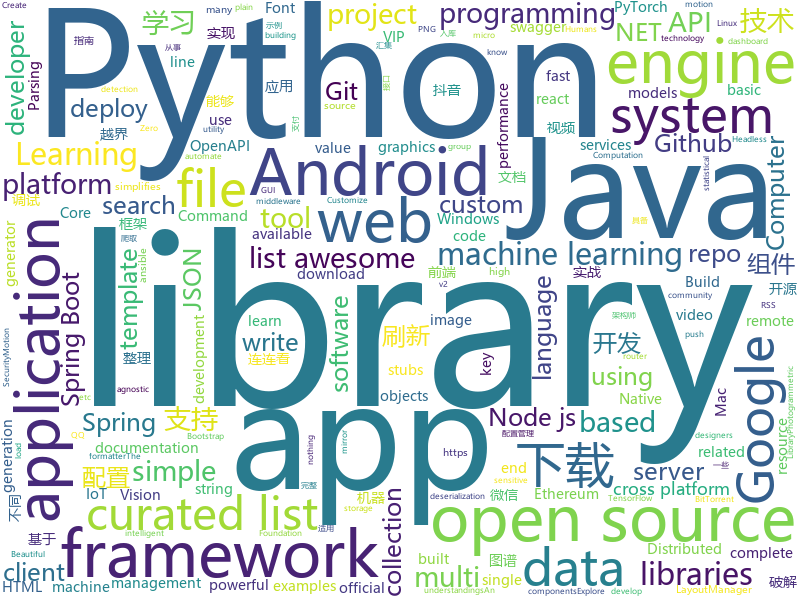

# 2018-06-07
See what the GitHub community is most excited about today.

## python
* [mlflow](https://github.com/databricks/mlflow)(**416 stars today**): Open source platform for the complete machine learning lifecycle
* [binarytree](https://github.com/joowani/binarytree)(**271 stars today**): Python Library for Studying Binary Trees
* [Douyin-Bot](https://github.com/wangshub/Douyin-Bot)(**142 stars today**): Python 抖音机器人，论如何在抖音上找到漂亮小姐姐？😍
* [models](https://github.com/tensorflow/models)(**88 stars today**): Models and examples built with TensorFlow
* [XSStrike](https://github.com/s0md3v/XSStrike)(**97 stars today**): XSS Scanner equipped with powerful fuzzing engine & intelligent payload generator
* [Auto-Lianliankan](https://github.com/TheThreeDog/Auto-Lianliankan)(**81 stars today**): 基于python图像识别实现的连连看外挂，可实现QQ连连看秒破
* [zero-shot-gcn](https://github.com/JudyYe/zero-shot-gcn)(**64 stars today**): Zero-Shot Learning with GCN (CVPR 2018)
* [awesome-python](https://github.com/vinta/awesome-python)(**57 stars today**): A curated list of awesome Python frameworks, libraries, software and resources
* [keras](https://github.com/keras-team/keras)(**54 stars today**): Deep Learning for humans
* [public-apis](https://github.com/toddmotto/public-apis)(**51 stars today**): A collective list of public JSON APIs for use in web development.
* [black](https://github.com/ambv/black)(**53 stars today**): The uncompromising Python code formatter
* [flask](https://github.com/pallets/flask)(**46 stars today**): The Python micro framework for building web applications.
* [youtube-dl](https://github.com/rg3/youtube-dl)(**45 stars today**): Command-line program to download videos from YouTube.com and other video sites
* [python-spider](https://github.com/Jack-Cherish/python-spider)(**42 stars today**): 🌈Python3网络爬虫实战：VIP视频破解助手；GEETEST验证码破解；小说、动漫下载；手机APP爬取；财务报表入库；火车票抢票；抖音APP视频下载；百万英雄辅助；网易云音乐批量下载
* [pytorch-for-numpy-users](https://github.com/wkentaro/pytorch-for-numpy-users)(**45 stars today**): PyTorch for Numpy users.
* [scikit-learn](https://github.com/scikit-learn/scikit-learn)(**35 stars today**): scikit-learn: machine learning in Python
* [Crunch](https://github.com/chrissimpkins/Crunch)(**42 stars today**): Insane(ly slow but wicked good) PNG image optimization
* [awesome-machine-learning](https://github.com/josephmisiti/awesome-machine-learning)(**37 stars today**): A curated list of awesome Machine Learning frameworks, libraries and software.
* [Github-Hunter](https://github.com/Hell0W0rld0/Github-Hunter)(**34 stars today**): This tool is for sensitive information searching on Github.
* [MachineLearning](https://github.com/apachecn/MachineLearning)(**37 stars today**): Machine Learning in Action（机器学习实战）
* [django](https://github.com/django/django)(**26 stars today**): The Web framework for perfectionists with deadlines.
* [pandas](https://github.com/pandas-dev/pandas)(**28 stars today**): Flexible and powerful data analysis / manipulation library for Python, providing labeled data structures similar to R data.frame objects, statistical functions, and much more
* [cpython](https://github.com/python/cpython)(**21 stars today**): The Python programming language
* [ansible](https://github.com/ansible/ansible)(**22 stars today**): Ansible is a radically simple IT automation platform that makes your applications and systems easier to deploy. Avoid writing scripts or custom code to deploy and update your applications — automate in a language that approaches plain English, using SSH, with no agents to install on remote systems. https://docs.ansible.com/ansible/
* [diskover](https://github.com/shirosaidev/diskover)(**29 stars today**): File system crawler, disk space usage, file search engine and file system analytics powered by Elasticsearch

## java
* [vjtools](https://github.com/vipshop/vjtools)(**430 stars today**): The vip.com's java coding standard, libraries and tools
* [PlayerBase](https://github.com/jiajunhui/PlayerBase)(**116 stars today**): The basic library of Android player will process complex business components. The access is simple。Android播放器基础库，专注于播放视图组件的高复用性和组件间的低耦合，轻松处理复杂业务。
* [capillary](https://github.com/google/capillary)(**114 stars today**): Capillary is a library to simplify the sending of end-to-end encrypted push messages from Java-based application servers to Android clients.
* [LayoutManagerGroup](https://github.com/DingMouRen/LayoutManagerGroup)(**99 stars today**): 👉Customize the LayoutManager of RecyclerView(自定义LayoutManager)
* [java-design-patterns](https://github.com/iluwatar/java-design-patterns)(**71 stars today**): Design patterns implemented in Java
* [CoolViewPager](https://github.com/HuanHaiLiuXin/CoolViewPager)(**72 stars today**): A Cool ViewPager
* [weixin-java-tools](https://github.com/Wechat-Group/weixin-java-tools)(**60 stars today**): 可能是目前最好最全的微信Java开发工具包，支持包括微信支付、开放平台、小程序、企业号和公众号等的开发
* [spring-boot](https://github.com/spring-projects/spring-boot)(**55 stars today**): Spring Boot
* [proxyee-down](https://github.com/proxyee-down-org/proxyee-down)(**56 stars today**): http下载工具，基于http代理，支持多连接分块下载
* [z_comic_new](https://github.com/zhhr1122/z_comic_new)(**50 stars today**): 一款采用MVP模式的设计的仿造腾讯漫画的APP
* [APIJSON](https://github.com/TommyLemon/APIJSON)(**53 stars today**): 🚀后端接口和文档自动化，前端(客户端) 定制返回JSON的数据和结构！
* [Andromeda](https://github.com/iqiyi/Andromeda)(**52 stars today**): Andromeda simplifies local/remote communication for Android modularization
* [apollo](https://github.com/ctripcorp/apollo)(**48 stars today**): Apollo（阿波罗）是携程框架部门研发的分布式配置中心，能够集中化管理应用不同环境、不同集群的配置，配置修改后能够实时推送到应用端，并且具备规范的权限、流程治理等特性，适用于微服务配置管理场景。
* [Java-Interview](https://github.com/crossoverJie/Java-Interview)(**47 stars today**): 👨‍🎓Java related : basic, concurrent, algorithm
* [tutorials](https://github.com/eugenp/tutorials)(**32 stars today**): The "REST With Spring" Course:
* [VirtualXposed](https://github.com/android-hacker/VirtualXposed)(**42 stars today**): A Simple App to use Xposed without root or unlock the bootloader(or modify system image etc).
* [SmartRefreshLayout](https://github.com/scwang90/SmartRefreshLayout)(**38 stars today**): 🔥下拉刷新、上拉加载、二级刷新、淘宝二楼、RefreshLayout、OverScroll，Android智能下拉刷新框架，支持越界回弹、越界拖动，具有极强的扩展性，集成了几十种炫酷的Header和 Footer。
* [elasticsearch](https://github.com/elastic/elasticsearch)(**28 stars today**): Open Source, Distributed, RESTful Search Engine
* [incubator-dubbo](https://github.com/apache/incubator-dubbo)(**29 stars today**): Apache Dubbo (incubating) is a high-performance, java based, open source RPC framework.
* [AndroidUtilCode](https://github.com/Blankj/AndroidUtilCode)(**28 stars today**): 🔥Android developers should collect the following utils(updating).
* [spring-framework](https://github.com/spring-projects/spring-framework)(**28 stars today**): Spring Framework
* [interviews](https://github.com/kdn251/interviews)(**33 stars today**): Everything you need to know to get the job.
* [guava](https://github.com/google/guava)(**29 stars today**): Google core libraries for Java
* [ARouter](https://github.com/alibaba/ARouter)(**29 stars today**): An android router middleware that help app navigating to activities and custom services.
* [spring-boot-examples](https://github.com/ityouknow/spring-boot-examples)(**24 stars today**): about learning Spring Boot via examples. Spring Boot 技术栈示例代码，快速简单上手教程。

## unknown
* [github-xp](https://github.com/martenbjork/github-xp)(**1,119 stars today**): Give Github some XP flair🔥
* [architect-awesome](https://github.com/xingshaocheng/architect-awesome)(**394 stars today**): 后端架构师技术图谱
* [build-your-own-x](https://github.com/danistefanovic/build-your-own-x)(**434 stars today**): 🤓Build your own (insert technology here)
* [Interview-Notebook](https://github.com/CyC2018/Interview-Notebook)(**178 stars today**): 📚技术面试需要掌握的基础知识整理，欢迎编辑~
* [ground_rules](https://github.com/joelparkerhenderson/ground_rules)(**130 stars today**): Ground rules a.k.a. working agreements, team arrangements, shared expectations, and group understandings
* [gitpub](https://github.com/git-federation/gitpub)(**128 stars today**): An extenstion to ActivityPub for web-based Git services federation.
* [nocode](https://github.com/kelseyhightower/nocode)(**117 stars today**): The best way to write secure and reliable applications. Write nothing; deploy nowhere.
* [awesome](https://github.com/sindresorhus/awesome)(**97 stars today**): 😎Curated list of awesome lists
* [gitignore](https://github.com/github/gitignore)(**63 stars today**): A collection of useful .gitignore templates
* [free-programming-books](https://github.com/EbookFoundation/free-programming-books)(**75 stars today**): 📚Freely available programming books
* [zip-slip-vulnerability](https://github.com/snyk/zip-slip-vulnerability)(**71 stars today**): Zip Slip Vulnerability (Arbitrary file write through archive extraction)
* [coding-interview-university](https://github.com/jwasham/coding-interview-university)(**54 stars today**): A complete computer science study plan to become a software engineer.
* [developer-roadmap](https://github.com/kamranahmedse/developer-roadmap)(**51 stars today**): Roadmap to becoming a web developer in 2018
* [Awesome-Japanese](https://github.com/yudataguy/Awesome-Japanese)(**51 stars today**): Awesome Japanese learning resource
* [awesome-vue](https://github.com/vuejs/awesome-vue)(**47 stars today**): 🎉A curated list of awesome things related to Vue.js
* [node-in-debugging](https://github.com/nswbmw/node-in-debugging)(**42 stars today**): 《Node.js 调试指南》是本人整理的从事 Node.js 开发这几年的一些调试经验和思路，希望授人以鱼亦能授人以渔。
* [awesome-flutter](https://github.com/Solido/awesome-flutter)(**40 stars today**): All Flutter resources to start and develop your projects !
* [IoTSecurity101](https://github.com/V33RU/IoTSecurity101)(**30 stars today**): From IoT Pentesting to IoT Security
* [MOPS](https://github.com/toadstorm/MOPS)(**31 stars today**): Motion OPerators for Houdini, a motion graphics toolkit.
* [Project-Based-Tutorials-in-C](https://github.com/rby90/Project-Based-Tutorials-in-C)(**28 stars today**): A curated list of project-based tutorials in C
* [Learn_Deep_Learning_in_6_Weeks](https://github.com/llSourcell/Learn_Deep_Learning_in_6_Weeks)(**26 stars today**): This is the Curriculum for "Learn Deep Learning in 6 Weeks" by Siraj Raval on Youtube
* [wiki](https://github.com/ethereum/wiki)(**26 stars today**): The Ethereum Wiki
* [awesome-eventstorming](https://github.com/mariuszgil/awesome-eventstorming)(**26 stars today**): Awesome EventStorming
* [high-speed-downloader](https://github.com/high-speed-downloader/high-speed-downloader)(**24 stars today**): 百度网盘不限速下载 支持Windows和Mac 2018年1月16日更新
* [react-native-guide](https://github.com/reactnativecn/react-native-guide)(**25 stars today**): React Native指南汇集了各类react-native学习资源、开源App和组件

## c++
* [tensorflow](https://github.com/tensorflow/tensorflow)(**156 stars today**): Computation using data flow graphs for scalable machine learning
* [electron](https://github.com/electron/electron)(**71 stars today**): Build cross platform desktop apps with JavaScript, HTML, and CSS
* [Gource](https://github.com/acaudwell/Gource)(**57 stars today**): software version control visualization
* [bitcoin](https://github.com/bitcoin/bitcoin)(**46 stars today**): Bitcoin Core integration/staging tree
* [bgfx](https://github.com/bkaradzic/bgfx)(**48 stars today**): Cross-platform, graphics API agnostic, "Bring Your Own Engine/Framework" style rendering library.
* [tesseract](https://github.com/tesseract-ocr/tesseract)(**41 stars today**): Tesseract Open Source OCR Engine (main repository)
* [pytorch](https://github.com/pytorch/pytorch)(**42 stars today**): Tensors and Dynamic neural networks in Python with strong GPU acceleration
* [opencv](https://github.com/opencv/opencv)(**32 stars today**): Open Source Computer Vision Library
* [AliceVision](https://github.com/alicevision/AliceVision)(**34 stars today**): Photogrammetric Computer Vision Framework
* [protobuf](https://github.com/google/protobuf)(**33 stars today**): Protocol Buffers - Google's data interchange format
* [aseprite](https://github.com/aseprite/aseprite)(**33 stars today**): Animated sprite editor & pixel art tool (Windows, macOS, Linux)
* [swift](https://github.com/apple/swift)(**30 stars today**): The Swift Programming Language
* [RedisDesktopManager](https://github.com/uglide/RedisDesktopManager)(**24 stars today**): 🔧Cross-platform GUI management tool for Redis
* [horovod](https://github.com/uber/horovod)(**23 stars today**): Distributed training framework for TensorFlow, Keras, and PyTorch.
* [turicreate](https://github.com/apple/turicreate)(**23 stars today**): Turi Create simplifies the development of custom machine learning models.
* [openpose](https://github.com/CMU-Perceptual-Computing-Lab/openpose)(**21 stars today**): OpenPose: Real-time multi-person keypoint detection library for body, face, and hands estimation
* [aria2](https://github.com/aria2/aria2)(**22 stars today**): aria2 is a lightweight multi-protocol & multi-source, cross platform download utility operated in command-line. It supports HTTP/HTTPS, FTP, SFTP, BitTorrent and Metalink.
* [cmder](https://github.com/cmderdev/cmder)(**22 stars today**): Lovely console emulator package for Windows
* [xgboost](https://github.com/dmlc/xgboost)(**18 stars today**): Scalable, Portable and Distributed Gradient Boosting (GBDT, GBRT or GBM) Library, for Python, R, Java, Scala, C++ and more. Runs on single machine, Hadoop, Spark, Flink and DataFlow
* [v8](https://github.com/v8/v8)(**18 stars today**): The official mirror of the V8 Git repository
* [leveldb](https://github.com/google/leveldb)(**19 stars today**): LevelDB is a fast key-value storage library written at Google that provides an ordered mapping from string keys to string values.
* [katran](https://github.com/facebookincubator/katran)(**18 stars today**): A high performance layer 4 load balancer
* [godot](https://github.com/godotengine/godot)(**18 stars today**): Godot Engine – Multi-platform 2D and 3D game engine
* [solidity](https://github.com/ethereum/solidity)(**17 stars today**): Solidity, the Contract-Oriented Programming Language
* [faiss](https://github.com/facebookresearch/faiss)(**16 stars today**): A library for efficient similarity search and clustering of dense vectors.

## html
* [sing-app](https://github.com/flatlogic/sing-app)(**207 stars today**): Free and open-source admin dashboard template built with Bootstrap 4
* [Coursera-ML-AndrewNg-Notes](https://github.com/fengdu78/Coursera-ML-AndrewNg-Notes)(**84 stars today**): 吴恩达老师的机器学习课程个人笔记
* [css10](https://github.com/Kyubyong/css10)(**35 stars today**): CSS10: A Collection of Single Speaker Speech Datasets for 10 Languages
* [styleguide](https://github.com/google/styleguide)(**25 stars today**): Style guides for Google-originated open-source projects
* [knowledge](https://github.com/f2e-awesome/knowledge)(**26 stars today**): 文档着重构建一个完整的「前端技术架构图谱」，方便 F2E 学习与进阶。
* [favorites-web](https://github.com/cloudfavorites/favorites-web)(**25 stars today**): 云收藏 Spring Boot 2.0 开源项目
* [Winds](https://github.com/GetStream/Winds)(**27 stars today**): A Beautiful Open Source RSS & Podcast App
* [fastText](https://github.com/facebookresearch/fastText)(**22 stars today**): Library for fast text representation and classification.
* [Spoon-Knife](https://github.com/octocat/Spoon-Knife)(****): This repo is for demonstration purposes only.
* [awesome-mac](https://github.com/jaywcjlove/awesome-mac)(**18 stars today**):  This repo is a collection of awesome Mac applications and tools for developers and designers.
* [dotnet](https://github.com/Microsoft/dotnet)(**15 stars today**): This repo is the official home of .NET on GitHub. It's a great starting point to find many .NET OSS projects from Microsoft and the community, including many that are part of the .NET Foundation.
* [swagger-codegen](https://github.com/swagger-api/swagger-codegen)(**14 stars today**): swagger-codegen contains a template-driven engine to generate documentation, API clients and server stubs in different languages by parsing your OpenAPI / Swagger definition.
* [portainer](https://github.com/portainer/portainer)(**15 stars today**): Simple management UI for Docker
* [phantomjs](https://github.com/ariya/phantomjs)(**13 stars today**): Scriptable Headless Browser
* [gson](https://github.com/google/gson)(**12 stars today**): A Java serialization/deserialization library to convert Java Objects into JSON and back
* [patchwork](https://github.com/jlord/patchwork)(****): All the Git-it Workshop completers!
* [polymer](https://github.com/Polymer/polymer)(**13 stars today**): Build modern apps using web components
* [electron-api-demos](https://github.com/electron/electron-api-demos)(**12 stars today**): Explore the Electron APIs
* [node-interview](https://github.com/ElemeFE/node-interview)(**12 stars today**): How to pass the Node.js interview of ElemeFE.
* [hello](https://github.com/natfriedman/hello)(**12 stars today**): 👋Hello, GitHub
* [xpc](https://github.com/guyecode/xpc)(**12 stars today**): 
* [EIPs](https://github.com/ethereum/EIPs)(**9 stars today**): The Ethereum Improvement Proposal repository
* [openapi-generator](https://github.com/OpenAPITools/openapi-generator)(**11 stars today**): OpenAPI Generator allows generation of API client libraries (SDK generation), server stubs, documentation and configuration automatically given an OpenAPI Spec (v2, v3)
* [requests-html](https://github.com/kennethreitz/requests-html)(**9 stars today**): Pythonic HTML Parsing for Humans™
* [fonts](https://github.com/google/fonts)(**10 stars today**): Font files available from Google Fonts

## WordCloud

