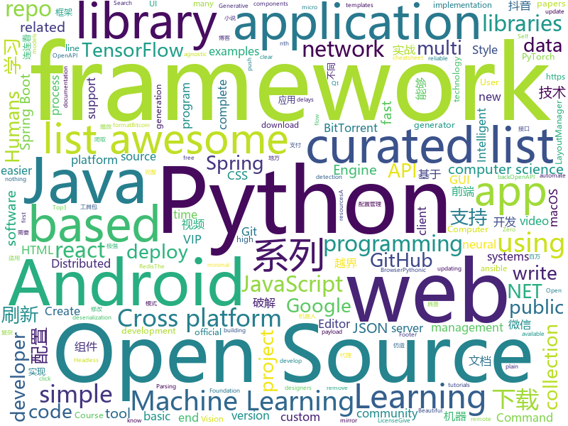

# 2018-06-08
See what the GitHub community is most excited about today.

## python
* [mlflow](https://github.com/databricks/mlflow)(**262 stars today**): Open source platform for the complete machine learning lifecycle
* [MarzipanTool](https://github.com/zhuowei/MarzipanTool)(**133 stars today**): Tools for running iOSMac apps on macOS 10.14 Beta
* [models](https://github.com/tensorflow/models)(**88 stars today**): Models and examples built with TensorFlow
* [binarytree](https://github.com/joowani/binarytree)(**119 stars today**): Python Library for Studying Binary Trees
* [Auto-Lianliankan](https://github.com/TheThreeDog/Auto-Lianliankan)(**102 stars today**): 基于python图像识别实现的连连看外挂，可实现QQ连连看秒破
* [Douyin-Bot](https://github.com/wangshub/Douyin-Bot)(**71 stars today**): Python 抖音机器人，论如何在抖音上找到漂亮小姐姐？😍
* [2018-IJCAI-top3](https://github.com/luoda888/2018-IJCAI-top3)(**56 stars today**): This 2018 IJCAI alimama Top3 Code
* [keras](https://github.com/keras-team/keras)(**46 stars today**): Deep Learning for humans
* [awesome-python](https://github.com/vinta/awesome-python)(**53 stars today**): A curated list of awesome Python frameworks, libraries, software and resources
* [public-apis](https://github.com/toddmotto/public-apis)(**50 stars today**): A collective list of public JSON APIs for use in web development.
* [zero-shot-gcn](https://github.com/JudyYe/zero-shot-gcn)(**47 stars today**): Zero-Shot Learning with GCN (CVPR 2018)
* [bindsnet](https://github.com/Hananel-Hazan/bindsnet)(**44 stars today**): Simulation of spiking neural networks (SNNs) using PyTorch.
* [flask](https://github.com/pallets/flask)(**40 stars today**): The Python micro framework for building web applications.
* [scylla](https://github.com/imWildCat/scylla)(**39 stars today**): Intelligent proxy pool for Humans™
* [django](https://github.com/django/django)(**32 stars today**): The Web framework for perfectionists with deadlines.
* [XSStrike](https://github.com/s0md3v/XSStrike)(**37 stars today**): XSS Scanner equipped with powerful fuzzing engine & intelligent payload generator
* [python-spider](https://github.com/Jack-Cherish/python-spider)(**33 stars today**): 🌈Python3网络爬虫实战：VIP视频破解助手；GEETEST验证码破解；小说、动漫下载；手机APP爬取；财务报表入库；火车票抢票；抖音APP视频下载；百万英雄辅助；网易云音乐批量下载
* [black](https://github.com/ambv/black)(**37 stars today**): The uncompromising Python code formatter
* [ansible](https://github.com/ansible/ansible)(**26 stars today**): Ansible is a radically simple IT automation platform that makes your applications and systems easier to deploy. Avoid writing scripts or custom code to deploy and update your applications — automate in a language that approaches plain English, using SSH, with no agents to install on remote systems. https://docs.ansible.com/ansible/
* [MachineLearning](https://github.com/apachecn/MachineLearning)(**29 stars today**): Machine Learning in Action（机器学习实战）
* [Self-Attention-GAN-Tensorflow](https://github.com/taki0112/Self-Attention-GAN-Tensorflow)(**34 stars today**): Simple Tensorflow implementation of "Self-Attention Generative Adversarial Networks" (SAGAN)
* [scrapy](https://github.com/scrapy/scrapy)(**30 stars today**): Scrapy, a fast high-level web crawling & scraping framework for Python.
* [requests](https://github.com/requests/requests)(**30 stars today**): Python HTTP Requests for Humans™✨🍰✨
* [youtube-dl](https://github.com/rg3/youtube-dl)(**25 stars today**): Command-line program to download videos from YouTube.com and other video sites
* [awesome-machine-learning](https://github.com/josephmisiti/awesome-machine-learning)(**27 stars today**): A curated list of awesome Machine Learning frameworks, libraries and software.

## java
* [vjtools](https://github.com/vipshop/vjtools)(**284 stars today**): The vip.com's java coding standard, libraries and tools
* [PlayerBase](https://github.com/jiajunhui/PlayerBase)(**78 stars today**): The basic library of Android player will process complex business components. The access is simple。Android播放器基础库，专注于播放视图组件的高复用性和组件间的低耦合，轻松处理复杂业务。
* [spring-boot](https://github.com/spring-projects/spring-boot)(**53 stars today**): Spring Boot
* [java-design-patterns](https://github.com/iluwatar/java-design-patterns)(**54 stars today**): Design patterns implemented in Java
* [capillary](https://github.com/google/capillary)(**65 stars today**): Capillary is a library to simplify the sending of end-to-end encrypted push messages from Java-based application servers to Android clients.
* [v9porn](https://github.com/techGay/v9porn)(**54 stars today**): new version
* [Java-Interview](https://github.com/crossoverJie/Java-Interview)(**48 stars today**): 👨‍🎓Java related : basic, concurrent, algorithm
* [proxyee-down](https://github.com/proxyee-down-org/proxyee-down)(**51 stars today**): http下载工具，基于http代理，支持多连接分块下载
* [weixin-java-tools](https://github.com/Wechat-Group/weixin-java-tools)(**48 stars today**): 可能是目前最好最全的微信Java开发工具包，支持包括微信支付、开放平台、小程序、企业号和公众号等的开发
* [LayoutManagerGroup](https://github.com/DingMouRen/LayoutManagerGroup)(**49 stars today**): 👉Customize the LayoutManager of RecyclerView(自定义LayoutManager)
* [tutorials](https://github.com/eugenp/tutorials)(**36 stars today**): The "REST With Spring" Course:
* [apollo](https://github.com/ctripcorp/apollo)(**43 stars today**): Apollo（阿波罗）是携程框架部门研发的分布式配置中心，能够集中化管理应用不同环境、不同集群的配置，配置修改后能够实时推送到应用端，并且具备规范的权限、流程治理等特性，适用于微服务配置管理场景。
* [APIJSON](https://github.com/TommyLemon/APIJSON)(**45 stars today**): 🚀后端接口和文档自动化，前端(客户端) 定制返回JSON的数据和结构！
* [OkNetworkMonitor](https://github.com/linkaipeng/OkNetworkMonitor)(**46 stars today**): A network monitor for okHttp base on stetho.
* [SmartRefreshLayout](https://github.com/scwang90/SmartRefreshLayout)(**39 stars today**): 🔥下拉刷新、上拉加载、二级刷新、淘宝二楼、RefreshLayout、OverScroll，Android智能下拉刷新框架，支持越界回弹、越界拖动，具有极强的扩展性，集成了几十种炫酷的Header和 Footer。
* [graal](https://github.com/oracle/graal)(**40 stars today**): GraalVM: Run Programs Faster Anywhere🚀
* [incubator-dubbo](https://github.com/apache/incubator-dubbo)(**32 stars today**): Apache Dubbo (incubating) is a high-performance, java based, open source RPC framework.
* [elasticsearch](https://github.com/elastic/elasticsearch)(**35 stars today**): Open Source, Distributed, RESTful Search Engine
* [spring-boot-examples](https://github.com/ityouknow/spring-boot-examples)(**33 stars today**): about learning Spring Boot via examples. Spring Boot 技术栈示例代码，快速简单上手教程。
* [z_comic_new](https://github.com/zhhr1122/z_comic_new)(**33 stars today**): 一款采用MVP模式的设计的仿造腾讯漫画的APP
* [interviews](https://github.com/kdn251/interviews)(**33 stars today**): Everything you need to know to get the job.
* [spring-framework](https://github.com/spring-projects/spring-framework)(**27 stars today**): Spring Framework
* [CoolViewPager](https://github.com/HuanHaiLiuXin/CoolViewPager)(**33 stars today**): A Cool ViewPager
* [BiometricPromptCompat](https://github.com/fython/BiometricPromptCompat)(**32 stars today**): Make BiometricPrompt (Android P feature) support all Android 6.0+ devices.
* [AndroidUtilCode](https://github.com/Blankj/AndroidUtilCode)(**27 stars today**): 🔥Android developers should collect the following utils(updating).

## unknown
* [GLWTPL](https://github.com/me-shaon/GLWTPL)(**789 stars today**): "Good Luck With That" Public License
* [github-xp](https://github.com/martenbjork/github-xp)(**589 stars today**): Give Github some XP flair🔥
* [build-your-own-x](https://github.com/danistefanovic/build-your-own-x)(**307 stars today**): 🤓Build your own (insert technology here)
* [Project-Based-Tutorials-in-C](https://github.com/rby90/Project-Based-Tutorials-in-C)(**289 stars today**): A curated list of project-based tutorials in C
* [Alibaba-MIT-Speech](https://github.com/alibaba/Alibaba-MIT-Speech)(**136 stars today**): Alibaba speech technology
* [Interview-Notebook](https://github.com/CyC2018/Interview-Notebook)(**125 stars today**): 📚技术面试需要掌握的基础知识整理，欢迎编辑~
* [gitignore](https://github.com/github/gitignore)(**75 stars today**): A collection of useful .gitignore templates
* [awesome](https://github.com/sindresorhus/awesome)(**80 stars today**): 😎Curated list of awesome lists
* [developer-roadmap](https://github.com/kamranahmedse/developer-roadmap)(**69 stars today**): Roadmap to becoming a web developer in 2018
* [free-programming-books](https://github.com/EbookFoundation/free-programming-books)(**70 stars today**): 📚Freely available programming books
* [gitpub](https://github.com/git-federation/gitpub)(**61 stars today**): An extenstion to ActivityPub for web-based Git services federation.
* [zip-slip-vulnerability](https://github.com/snyk/zip-slip-vulnerability)(**56 stars today**): Zip Slip Vulnerability (Arbitrary file write through archive extraction)
* [data-homicides](https://github.com/washingtonpost/data-homicides)(**54 stars today**): The Washington Post collected data on more than 52,000 criminal homicides over the past decade in 50 of the largest American cities.
* [trackerslist](https://github.com/ngosang/trackerslist)(**55 stars today**): An updated list of public BitTorrent trackers
* [nocode](https://github.com/kelseyhightower/nocode)(**51 stars today**): The best way to write secure and reliable applications. Write nothing; deploy nowhere.
* [awesome-vue](https://github.com/vuejs/awesome-vue)(**46 stars today**): 🎉A curated list of awesome things related to Vue.js
* [coding-interview-university](https://github.com/jwasham/coding-interview-university)(**35 stars today**): A complete computer science study plan to become a software engineer.
* [awesome-flutter](https://github.com/Solido/awesome-flutter)(**33 stars today**): All Flutter resources to start and develop your projects !
* [junior-recruit-scheduler](https://github.com/jojoldu/junior-recruit-scheduler)(**31 stars today**): 주니어 개발자 채용 정보
* [Blog](https://github.com/mqyqingfeng/Blog)(**27 stars today**): 冴羽写博客的地方，预计写四个系列：JavaScript深入系列、JavaScript专题系列、ES6系列、React系列。
* [awesome-machine-learning-on-source-code](https://github.com/src-d/awesome-machine-learning-on-source-code)(**25 stars today**): Interesting links & research papers related to Machine Learning applied to source code (MLonCode)
* [awesome-subreddits](https://github.com/iCHAIT/awesome-subreddits)(**27 stars today**): 📝A curated list of awesome programming subreddits.
* [react-typescript-cheatsheet](https://github.com/sw-yx/react-typescript-cheatsheet)(**26 stars today**): a cheatsheet for react users using typescript with react for the first (or nth!) time
* [awesome-courses](https://github.com/prakhar1989/awesome-courses)(**24 stars today**): 📚List of awesome university courses for learning Computer Science!
* [papers-we-love](https://github.com/papers-we-love/papers-we-love)(**22 stars today**): Papers from the computer science community to read and discuss.

## c++
* [cutter](https://github.com/radareorg/cutter)(**685 stars today**): A Qt and C++ GUI for radare2 reverse engineering framework
* [tensorflow](https://github.com/tensorflow/tensorflow)(**145 stars today**): Computation using data flow graphs for scalable machine learning
* [electron](https://github.com/electron/electron)(**51 stars today**): Build cross platform desktop apps with JavaScript, HTML, and CSS
* [protobuf](https://github.com/google/protobuf)(**46 stars today**): Protocol Buffers - Google's data interchange format
* [bitcoin](https://github.com/bitcoin/bitcoin)(**45 stars today**): Bitcoin Core integration/staging tree
* [Gource](https://github.com/acaudwell/Gource)(**50 stars today**): software version control visualization
* [zig](https://github.com/ziglang/zig)(**49 stars today**): robust, optimal, and clear programming language
* [pytorch](https://github.com/pytorch/pytorch)(**40 stars today**): Tensors and Dynamic neural networks in Python with strong GPU acceleration
* [turicreate](https://github.com/apple/turicreate)(**41 stars today**): Turi Create simplifies the development of custom machine learning models.
* [opencv](https://github.com/opencv/opencv)(**29 stars today**): Open Source Computer Vision Library
* [DeepSpeech](https://github.com/mozilla/DeepSpeech)(**34 stars today**): A TensorFlow implementation of Baidu's DeepSpeech architecture
* [tesseract](https://github.com/tesseract-ocr/tesseract)(**31 stars today**): Tesseract Open Source OCR Engine (main repository)
* [bgfx](https://github.com/bkaradzic/bgfx)(**29 stars today**): Cross-platform, graphics API agnostic, "Bring Your Own Engine/Framework" style rendering library.
* [aseprite](https://github.com/aseprite/aseprite)(**25 stars today**): Animated sprite editor & pixel art tool (Windows, macOS, Linux)
* [swift](https://github.com/apple/swift)(**26 stars today**): The Swift Programming Language
* [openpose](https://github.com/CMU-Perceptual-Computing-Lab/openpose)(**23 stars today**): OpenPose: Real-time multi-person keypoint detection library for body, face, and hands estimation
* [NanoRange](https://github.com/tcbrindle/NanoRange)(**27 stars today**): Range-based goodness for C++14
* [caffe](https://github.com/BVLC/caffe)(**21 stars today**): Caffe: a fast open framework for deep learning.
* [phasar](https://github.com/pdschubert/phasar)(**25 stars today**): A LLVM-based static analysis framework.
* [horovod](https://github.com/uber/horovod)(**23 stars today**): Distributed training framework for TensorFlow, Keras, and PyTorch.
* [RedisDesktopManager](https://github.com/uglide/RedisDesktopManager)(**23 stars today**): 🔧Cross-platform GUI management tool for Redis
* [v8](https://github.com/v8/v8)(**22 stars today**): The official mirror of the V8 Git repository
* [aria2](https://github.com/aria2/aria2)(**21 stars today**): aria2 is a lightweight multi-protocol & multi-source, cross platform download utility operated in command-line. It supports HTTP/HTTPS, FTP, SFTP, BitTorrent and Metalink.
* [imgui](https://github.com/ocornut/imgui)(**19 stars today**): Dear ImGui: Bloat-free Immediate Mode Graphical User interface for C++ with minimal dependencies
* [AliceVision](https://github.com/alicevision/AliceVision)(**17 stars today**): Photogrammetric Computer Vision Framework

## html
* [Coursera-ML-AndrewNg-Notes](https://github.com/fengdu78/Coursera-ML-AndrewNg-Notes)(**41 stars today**): 吴恩达老师的机器学习课程个人笔记
* [awesome-mac](https://github.com/jaywcjlove/awesome-mac)(**25 stars today**):  This repo is a collection of awesome Mac applications and tools for developers and designers.
* [styleguide](https://github.com/google/styleguide)(**22 stars today**): Style guides for Google-originated open-source projects
* [fastText](https://github.com/facebookresearch/fastText)(**21 stars today**): Library for fast text representation and classification.
* [hello](https://github.com/natfriedman/hello)(**16 stars today**): 👋Hello, GitHub
* [depthfirstlearning.com](https://github.com/depthfirstlearning/depthfirstlearning.com)(**16 stars today**): 
* [favorites-web](https://github.com/cloudfavorites/favorites-web)(**15 stars today**): 云收藏 Spring Boot 2.0 开源项目
* [dotnet](https://github.com/Microsoft/dotnet)(**15 stars today**): This repo is the official home of .NET on GitHub. It's a great starting point to find many .NET OSS projects from Microsoft and the community, including many that are part of the .NET Foundation.
* [fastclick](https://github.com/ftlabs/fastclick)(**13 stars today**): Polyfill to remove click delays on browsers with touch UIs
* [knowledge](https://github.com/f2e-awesome/knowledge)(**14 stars today**): 文档着重构建一个完整的「前端技术架构图谱」，方便 F2E 学习与进阶。
* [portainer](https://github.com/portainer/portainer)(**14 stars today**): Simple management UI for Docker
* [ecma262](https://github.com/tc39/ecma262)(**14 stars today**): Status, process, and documents for ECMA262
* [gentelella](https://github.com/puikinsh/gentelella)(**11 stars today**): Free Bootstrap 3 Admin Template
* [Spoon-Knife](https://github.com/octocat/Spoon-Knife)(****): This repo is for demonstration purposes only.
* [gson](https://github.com/google/gson)(**11 stars today**): A Java serialization/deserialization library to convert Java Objects into JSON and back
* [openapi-generator](https://github.com/OpenAPITools/openapi-generator)(**10 stars today**): OpenAPI Generator allows generation of API client libraries (SDK generation), server stubs, documentation and configuration automatically given an OpenAPI Spec (v2, v3)
* [phantomjs](https://github.com/ariya/phantomjs)(**10 stars today**): Scriptable Headless Browser
* [requests-html](https://github.com/kennethreitz/requests-html)(**10 stars today**): Pythonic HTML Parsing for Humans™
* [flag-icon-css](https://github.com/lipis/flag-icon-css)(**10 stars today**): 🎏A collection of all country flags in SVG — plus the CSS for easier integration
* [react-app-rewired](https://github.com/timarney/react-app-rewired)(**10 stars today**): Override create-react-app webpack configs without ejecting
* [javascript-tutorial-en](https://github.com/iliakan/javascript-tutorial-en)(**8 stars today**): Modern JavaScript Tutorial
* [polymer](https://github.com/Polymer/polymer)(**9 stars today**): Build modern apps using web components
* [Winds](https://github.com/GetStream/Winds)(**9 stars today**): A Beautiful Open Source RSS & Podcast App
* [samples](https://github.com/GoogleChrome/samples)(**7 stars today**): A repo containing samples tied to new functionality in each release of Google Chrome.
* [csswg-drafts](https://github.com/w3c/csswg-drafts)(**9 stars today**): CSS Working Group Editor Drafts

## WordCloud

