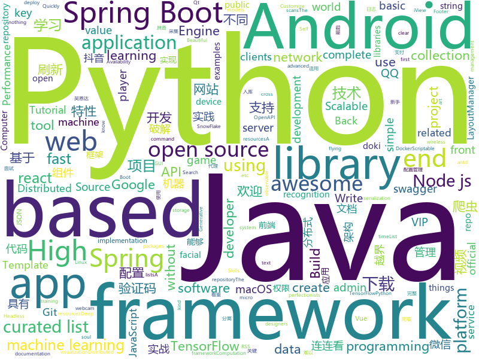

# 2018-06-09
See what the GitHub community is most excited about today.

## python
* [Python-100-Days](https://github.com/jackfrued/Python-100-Days)(**235 stars today**): Python - 100天从新手到大师
* [mlflow](https://github.com/databricks/mlflow)(**107 stars today**): Open source platform for the complete machine learning lifecycle
* [models](https://github.com/tensorflow/models)(**74 stars today**): Models and examples built with TensorFlow
* [Douyin-Bot](https://github.com/wangshub/Douyin-Bot)(**73 stars today**): Python 抖音机器人，论如何在抖音上找到漂亮小姐姐？😍
* [awesome-python](https://github.com/vinta/awesome-python)(**70 stars today**): A curated list of awesome Python frameworks, libraries, software and resources
* [keras](https://github.com/keras-team/keras)(**60 stars today**): Deep Learning for humans
* [Auto-Lianliankan](https://github.com/TheThreeDog/Auto-Lianliankan)(**60 stars today**): 基于python图像识别实现的连连看外挂，可实现QQ连连看秒破
* [python-spider](https://github.com/Jack-Cherish/python-spider)(**55 stars today**): 🌈Python3网络爬虫实战：VIP视频破解助手；GEETEST验证码破解；小说、动漫下载；手机APP爬取；财务报表入库；火车票抢票；抖音APP视频下载；百万英雄辅助；网易云音乐批量下载
* [faceai](https://github.com/vipstone/faceai)(**52 stars today**): 一款入门级的人脸、视频、文字检测以及识别的项目.
* [rules_android](https://github.com/bazelbuild/rules_android)(**51 stars today**): 
* [wifite2](https://github.com/derv82/wifite2)(**48 stars today**): Rewrite of the popular wireless network auditor, "wifite"
* [django](https://github.com/django/django)(**36 stars today**): The Web framework for perfectionists with deadlines.
* [scikit-learn](https://github.com/scikit-learn/scikit-learn)(**36 stars today**): scikit-learn: machine learning in Python
* [scrapy](https://github.com/scrapy/scrapy)(**33 stars today**): Scrapy, a fast high-level web crawling & scraping framework for Python.
* [public-apis](https://github.com/toddmotto/public-apis)(**37 stars today**): A collective list of public JSON APIs for use in web development.
* [MachineLearning](https://github.com/apachecn/MachineLearning)(**32 stars today**): Machine Learning in Action（机器学习实战）
* [flask](https://github.com/pallets/flask)(**34 stars today**): The Python micro framework for building web applications.
* [2018-IJCAI-top3](https://github.com/luoda888/2018-IJCAI-top3)(**30 stars today**): This 2018 IJCAI alimama Top3 Code
* [faceswap](https://github.com/deepfakes/faceswap)(**29 stars today**): Non official project based on original /r/Deepfakes thread. Many thanks to him!
* [geekbangpython](https://github.com/wilsonyin123/geekbangpython)(**32 stars today**): 
* [face_recognition](https://github.com/ageitgey/face_recognition)(**31 stars today**): The world's simplest facial recognition api for Python and the command line
* [Self-Attention-GAN-Tensorflow](https://github.com/taki0112/Self-Attention-GAN-Tensorflow)(**33 stars today**): Simple Tensorflow implementation of "Self-Attention Generative Adversarial Networks" (SAGAN)
* [Face-tracking-with-Anime-characters](https://github.com/Aditya-Khadilkar/Face-tracking-with-Anime-characters)(**32 stars today**): Hello! I have made a Python project where YURI from the game doki doki literature club accesses the webcam and stares directly into the players soul. Hope you enjoy!
* [who-the-hill](https://github.com/newsdev/who-the-hill)(**34 stars today**): Who The Hill: An MMS-based facial recognition service for members of Congress.
* [MarzipanTool](https://github.com/zhuowei/MarzipanTool)(**34 stars today**): Tools for running iOSMac apps on macOS 10.14 Beta

## java
* [Java-Interview](https://github.com/crossoverJie/Java-Interview)(**177 stars today**): 👨‍🎓Java related : basic, concurrent, algorithm
* [vjtools](https://github.com/vipshop/vjtools)(**121 stars today**): The vip.com's java coding standard, libraries and tools
* [java-design-patterns](https://github.com/iluwatar/java-design-patterns)(**103 stars today**): Design patterns implemented in Java
* [proxyee-down](https://github.com/proxyee-down-org/proxyee-down)(**92 stars today**): http下载工具，基于http代理，支持多连接分块下载
* [weixin-java-tools](https://github.com/Wechat-Group/weixin-java-tools)(**90 stars today**): 可能是目前最好最全的微信Java开发工具包，支持包括微信支付、开放平台、小程序、企业号和公众号等的开发
* [apollo](https://github.com/ctripcorp/apollo)(**75 stars today**): Apollo（阿波罗）是携程框架部门研发的分布式配置中心，能够集中化管理应用不同环境、不同集群的配置，配置修改后能够实时推送到应用端，并且具备规范的权限、流程治理等特性，适用于微服务配置管理场景。
* [tutorials](https://github.com/eugenp/tutorials)(**55 stars today**): The "REST With Spring" Course:
* [freddy](https://github.com/nccgroup/freddy)(**60 stars today**): Automatically identify deserialisation issues in Java and .NET applications by using active and passive scans
* [PlayerBase](https://github.com/jiajunhui/PlayerBase)(**58 stars today**): The basic library of Android player will process complex business components. The access is simple。Android播放器基础库，专注于播放视图组件的高复用性和组件间的低耦合，轻松处理复杂业务。
* [spring-boot](https://github.com/spring-projects/spring-boot)(**47 stars today**): Spring Boot
* [elasticsearch](https://github.com/elastic/elasticsearch)(**52 stars today**): Open Source, Distributed, RESTful Search Engine
* [incubator-dubbo](https://github.com/apache/incubator-dubbo)(**47 stars today**): Apache Dubbo (incubating) is a high-performance, java based, open source RPC framework.
* [BiometricPromptCompat](https://github.com/fython/BiometricPromptCompat)(**55 stars today**): Make BiometricPrompt (Android P feature) support all Android 6.0+ devices.
* [interviews](https://github.com/kdn251/interviews)(**41 stars today**): Everything you need to know to get the job.
* [SmartRefreshLayout](https://github.com/scwang90/SmartRefreshLayout)(**39 stars today**): 🔥下拉刷新、上拉加载、二级刷新、淘宝二楼、RefreshLayout、OverScroll，Android智能下拉刷新框架，支持越界回弹、越界拖动，具有极强的扩展性，集成了几十种炫酷的Header和 Footer。
* [ParticlesDrawable](https://github.com/Doctoror/ParticlesDrawable)(**41 stars today**): Draws random flying particles in space forming constellations.
* [v9porn](https://github.com/techGay/v9porn)(**39 stars today**): new version
* [spring-boot-examples](https://github.com/ityouknow/spring-boot-examples)(**34 stars today**): about learning Spring Boot via examples. Spring Boot 技术栈示例代码，快速简单上手教程。
* [LayoutManagerGroup](https://github.com/DingMouRen/LayoutManagerGroup)(**33 stars today**): 👉Customize the LayoutManager of RecyclerView(自定义LayoutManager)
* [RxJava](https://github.com/ReactiveX/RxJava)(**31 stars today**): RxJava – Reactive Extensions for the JVM – a library for composing asynchronous and event-based programs using observable sequences for the Java VM.
* [spring-framework](https://github.com/spring-projects/spring-framework)(**27 stars today**): Spring Framework
* [capillary](https://github.com/google/capillary)(**32 stars today**): Capillary is a library to simplify the sending of end-to-end encrypted push messages from Java-based application servers to Android clients.
* [springboot-learning-example](https://github.com/JeffLi1993/springboot-learning-example)(**25 stars today**): spring boot 实践学习案例，是 spring boot 初学者及核心技术巩固的最佳实践。
* [VirtualXposed](https://github.com/android-hacker/VirtualXposed)(**30 stars today**): A Simple App to use Xposed without root or unlock the bootloader(or modify system image etc).
* [x-boot](https://github.com/Exrick/x-boot)(**28 stars today**): 基于Spring Boot 2.x的前后端分离架构X-Boot 前台：Vue+iView 后台：Spring Boot 2.x/Spring Security/JWT/Spring Data JPA+Mybatis-Plus/Redis/Elasticsearch 分布式限流/同步锁/验证码/SnowFlake雪花算法ID自增 动态权限管理 代码生成 日志记录

## unknown
* [GLWTPL](https://github.com/me-shaon/GLWTPL)(**538 stars today**): "Good Luck With That" Public License
* [Project-Based-Tutorials-in-C](https://github.com/rby90/Project-Based-Tutorials-in-C)(**373 stars today**): A curated list of project-based tutorials in C
* [github-xp](https://github.com/martenbjork/github-xp)(**336 stars today**): Give Github some XP flair🔥
* [build-your-own-x](https://github.com/danistefanovic/build-your-own-x)(**327 stars today**): 🤓Build your own (insert technology here)
* [Alibaba-MIT-Speech](https://github.com/alibaba/Alibaba-MIT-Speech)(**224 stars today**): Alibaba speech technology
* [PHPer](https://github.com/han8gui/PHPer)(**128 stars today**): PHP开发知识结构
* [Interview-Notebook](https://github.com/CyC2018/Interview-Notebook)(**78 stars today**): 📚技术面试需要掌握的基础知识整理，欢迎编辑~
* [awesome](https://github.com/sindresorhus/awesome)(**78 stars today**): 😎Curated list of awesome lists
* [gitignore](https://github.com/github/gitignore)(**60 stars today**): A collection of useful .gitignore templates
* [react-typescript-cheatsheet](https://github.com/sw-yx/react-typescript-cheatsheet)(**72 stars today**): a cheatsheet for react users using typescript with react for the first (or nth!) time
* [XSS-Payloads](https://github.com/RenwaX23/XSS-Payloads)(**67 stars today**): List of XSS Vectors/Payloads
* [free-programming-books](https://github.com/EbookFoundation/free-programming-books)(**61 stars today**): 📚Freely available programming books
* [awesome-vue](https://github.com/vuejs/awesome-vue)(**54 stars today**): 🎉A curated list of awesome things related to Vue.js
* [developer-roadmap](https://github.com/kamranahmedse/developer-roadmap)(**50 stars today**): Roadmap to becoming a web developer in 2018
* [coding-interview-university](https://github.com/jwasham/coding-interview-university)(**41 stars today**): A complete computer science study plan to become a software engineer.
* [wiki](https://github.com/truechain/wiki)(**32 stars today**): truechain Wiki
* [chinese-independent-developer](https://github.com/1c7/chinese-independent-developer)(**48 stars today**): 👩🏿‍💻👨🏾‍💻👩🏼‍💻👨🏽‍💻👩🏻‍💻中国独立开发者项目列表 -- 分享大家都在做什么
* [nocode](https://github.com/kelseyhightower/nocode)(**40 stars today**): The best way to write secure and reliable applications. Write nothing; deploy nowhere.
* [gitpub](https://github.com/git-federation/gitpub)(**33 stars today**): An extenstion to ActivityPub for web-based Git services federation.
* [node-in-debugging](https://github.com/nswbmw/node-in-debugging)(**30 stars today**): 《Node.js 调试指南》
* [puppeteer-api-zh_CN](https://github.com/zhaoqize/puppeteer-api-zh_CN)(**33 stars today**): 📖Puppeteer中文文档📖
* [awesome-nodejs](https://github.com/sindresorhus/awesome-nodejs)(**27 stars today**): ⚡️Delightful Node.js packages and resources
* [awesome-react](https://github.com/enaqx/awesome-react)(**26 stars today**): A collection of awesome things regarding React ecosystem.
* [ios-skills-matrix](https://github.com/BohdanOrlov/ios-skills-matrix)(**27 stars today**): iOS Developer Skills Matrix
* [awesome-scalability](https://github.com/binhnguyennus/awesome-scalability)(**24 stars today**): High Scalability, High Availability, High Stability, High Performance, and High Intelligence Back-End Design Patterns

## c++
* [cutter](https://github.com/radareorg/cutter)(**154 stars today**): A Qt and C++ GUI for radare2 reverse engineering framework
* [tensorflow](https://github.com/tensorflow/tensorflow)(**118 stars today**): Computation using data flow graphs for scalable machine learning
* [phasar](https://github.com/pdschubert/phasar)(**63 stars today**): A LLVM-based static analysis framework.
* [electron](https://github.com/electron/electron)(**57 stars today**): Build cross platform desktop apps with JavaScript, HTML, and CSS
* [opencv](https://github.com/opencv/opencv)(**35 stars today**): Open Source Computer Vision Library
* [pytorch](https://github.com/pytorch/pytorch)(**40 stars today**): Tensors and Dynamic neural networks in Python with strong GPU acceleration
* [bitcoin](https://github.com/bitcoin/bitcoin)(**37 stars today**): Bitcoin Core integration/staging tree
* [godot](https://github.com/godotengine/godot)(**42 stars today**): Godot Engine – Multi-platform 2D and 3D game engine
* [protobuf](https://github.com/google/protobuf)(**36 stars today**): Protocol Buffers - Google's data interchange format
* [zig](https://github.com/ziglang/zig)(**37 stars today**): robust, optimal, and clear programming language
* [aseprite](https://github.com/aseprite/aseprite)(**34 stars today**): Animated sprite editor & pixel art tool (Windows, macOS, Linux)
* [turicreate](https://github.com/apple/turicreate)(**32 stars today**): Turi Create simplifies the development of custom machine learning models.
* [DeepSpeech](https://github.com/mozilla/DeepSpeech)(**28 stars today**): A TensorFlow implementation of Baidu's DeepSpeech architecture
* [tesseract](https://github.com/tesseract-ocr/tesseract)(**23 stars today**): Tesseract Open Source OCR Engine (main repository)
* [swift](https://github.com/apple/swift)(**22 stars today**): The Swift Programming Language
* [FreeReflection](https://github.com/tiann/FreeReflection)(**21 stars today**): Library that lets you use reflection without any restriction above Android P
* [leveldb](https://github.com/google/leveldb)(**21 stars today**): LevelDB is a fast key-value storage library written at Google that provides an ordered mapping from string keys to string values.
* [xgboost](https://github.com/dmlc/xgboost)(**20 stars today**): Scalable, Portable and Distributed Gradient Boosting (GBDT, GBRT or GBM) Library, for Python, R, Java, Scala, C++ and more. Runs on single machine, Hadoop, Spark, Flink and DataFlow
* [v8](https://github.com/v8/v8)(**21 stars today**): The official mirror of the V8 Git repository
* [grpc](https://github.com/grpc/grpc)(**19 stars today**): The C based gRPC (C++, Python, Ruby, Objective-C, PHP, C#)
* [Gource](https://github.com/acaudwell/Gource)(**21 stars today**): software version control visualization
* [horovod](https://github.com/uber/horovod)(**18 stars today**): Distributed training framework for TensorFlow, Keras, and PyTorch.
* [caffe](https://github.com/BVLC/caffe)(**13 stars today**): Caffe: a fast open framework for deep learning.
* [mongo](https://github.com/mongodb/mongo)(**16 stars today**): The MongoDB Database
* [apollo](https://github.com/ApolloAuto/apollo)(**14 stars today**): An open autonomous driving platform

## html
* [Coursera-ML-AndrewNg-Notes](https://github.com/fengdu78/Coursera-ML-AndrewNg-Notes)(**47 stars today**): 吴恩达老师的机器学习课程个人笔记
* [Winds](https://github.com/GetStream/Winds)(**34 stars today**): A Beautiful Open Source RSS & Podcast App
* [knowledge](https://github.com/f2e-awesome/knowledge)(**31 stars today**): 文档着重构建一个完整的「前端技术架构图谱」，方便 F2E 学习与进阶。
* [awesome-mac](https://github.com/jaywcjlove/awesome-mac)(**26 stars today**):  This repo is a collection of awesome Mac applications and tools for developers and designers.
* [fastText](https://github.com/facebookresearch/fastText)(**20 stars today**): Library for fast text representation and classification.
* [Spoon-Knife](https://github.com/octocat/Spoon-Knife)(****): This repo is for demonstration purposes only.
* [react-app-rewired](https://github.com/timarney/react-app-rewired)(**22 stars today**): Override create-react-app webpack configs without ejecting
* [godbasin.github.io](https://github.com/godbasin/godbasin.github.io)(**18 stars today**): 被删前端博客--喜欢请star
* [node-blog](https://github.com/liuxing/node-blog)(**17 stars today**): 🚀《Node.js从入门到上线》A blog build with Koa2.
* [styleguide](https://github.com/google/styleguide)(**15 stars today**): Style guides for Google-originated open-source projects
* [JavaScript30](https://github.com/wesbos/JavaScript30)(**11 stars today**): 30 Day Vanilla JS Challenge
* [portainer](https://github.com/portainer/portainer)(**14 stars today**): Simple management UI for Docker
* [phantomjs](https://github.com/ariya/phantomjs)(**12 stars today**): Scriptable Headless Browser
* [gentelella](https://github.com/puikinsh/gentelella)(**12 stars today**): Free Bootstrap 3 Admin Template
* [favorites-web](https://github.com/cloudfavorites/favorites-web)(**9 stars today**): 云收藏 Spring Boot 2.0 开源项目
* [swagger-codegen](https://github.com/swagger-api/swagger-codegen)(**9 stars today**): swagger-codegen contains a template-driven engine to generate documentation, API clients and server stubs in different languages by parsing your OpenAPI / Swagger definition.
* [electron-api-demos](https://github.com/electron/electron-api-demos)(**11 stars today**): Explore the Electron APIs
* [EIPs](https://github.com/ethereum/EIPs)(**10 stars today**): The Ethereum Improvement Proposal repository
* [Anti-Anti-Spider](https://github.com/luyishisi/Anti-Anti-Spider)(**9 stars today**): 越来越多的网站具有反爬虫特性，有的用图片隐藏关键数据，有的使用反人类的验证码，建立反反爬虫的代码仓库，通过与不同特性的网站做斗争（无恶意）提高技术。（欢迎提交难以采集的网站）（因工作原因，项目暂停）
* [gson](https://github.com/google/gson)(**9 stars today**): A Java serialization/deserialization library to convert Java Objects into JSON and back
* [elasticsearch-definitive-guide](https://github.com/elasticsearch-cn/elasticsearch-definitive-guide)(**9 stars today**): 欢迎加QQ群：109764489，贡献力量！
* [ng-alain](https://github.com/cipchk/ng-alain)(**8 stars today**): ng-zorro-antd admin panel front-end framework
* [foundation-sites](https://github.com/zurb/foundation-sites)(**8 stars today**): The most advanced responsive front-end framework in the world. Quickly create prototypes and production code for sites that work on any kind of device.
* [nodejs-ex](https://github.com/sclorg/nodejs-ex)(****): node.js example
* [javascript-tutorial-en](https://github.com/iliakan/javascript-tutorial-en)(**9 stars today**): Modern JavaScript Tutorial

## WordCloud

