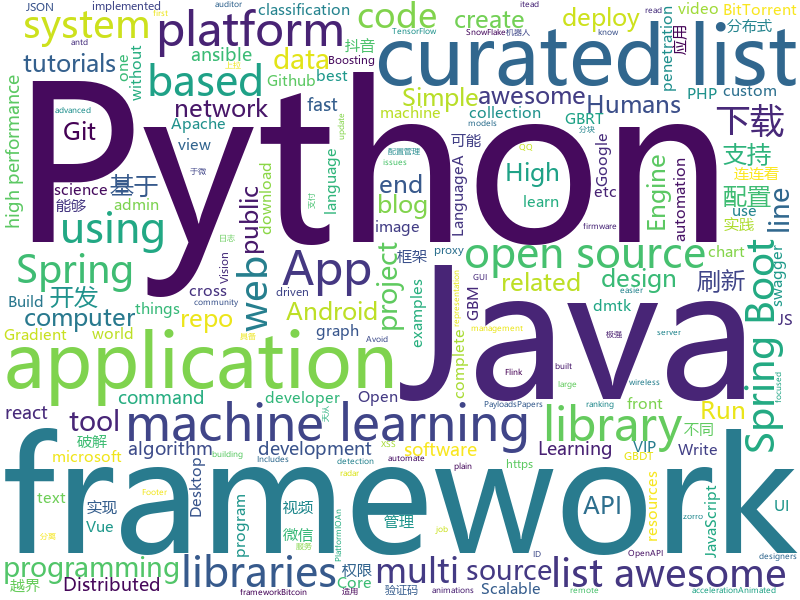

# 2018-06-10
See what the GitHub community is most excited about today.

## python
* [Python-100-Days](https://github.com/jackfrued/Python-100-Days)(**195 stars today**): Python - 100天从新手到大师
* [mlflow](https://github.com/databricks/mlflow)(**64 stars today**): Open source platform for the complete machine learning lifecycle
* [models](https://github.com/tensorflow/models)(**41 stars today**): Models and examples built with TensorFlow
* [wifite2](https://github.com/derv82/wifite2)(**45 stars today**): Rewrite of the popular wireless network auditor, "wifite"
* [awesome-python](https://github.com/vinta/awesome-python)(**42 stars today**): A curated list of awesome Python frameworks, libraries, software and resources
* [Auto-Lianliankan](https://github.com/TheThreeDog/Auto-Lianliankan)(**28 stars today**): 基于python图像识别实现的连连看外挂，可实现QQ连连看秒破
* [public-apis](https://github.com/toddmotto/public-apis)(**29 stars today**): A collective list of public JSON APIs for use in web development.
* [One-Lin3r](https://github.com/D4Vinci/One-Lin3r)(**29 stars today**): Gives you one-liners that aids in penetration testing operations
* [keras](https://github.com/keras-team/keras)(**27 stars today**): Deep Learning for humans
* [home-assistant](https://github.com/home-assistant/home-assistant)(**22 stars today**): 🏡Open-source home automation platform running on Python 3
* [face_recognition](https://github.com/ageitgey/face_recognition)(**21 stars today**): The world's simplest facial recognition api for Python and the command line
* [youtube-dl](https://github.com/rg3/youtube-dl)(**20 stars today**): Command-line program to download videos from YouTube.com and other video sites
* [awesome-machine-learning](https://github.com/josephmisiti/awesome-machine-learning)(**22 stars today**): A curated list of awesome Machine Learning frameworks, libraries and software.
* [cpython](https://github.com/python/cpython)(**17 stars today**): The Python programming language
* [Douyin-Bot](https://github.com/wangshub/Douyin-Bot)(**21 stars today**): Python 抖音机器人，论如何在抖音上找到漂亮小姐姐？😍
* [ansible](https://github.com/ansible/ansible)(**18 stars today**): Ansible is a radically simple IT automation platform that makes your applications and systems easier to deploy. Avoid writing scripts or custom code to deploy and update your applications — automate in a language that approaches plain English, using SSH, with no agents to install on remote systems. https://docs.ansible.com/ansible/
* [scikit-learn](https://github.com/scikit-learn/scikit-learn)(**17 stars today**): scikit-learn: machine learning in Python
* [flask](https://github.com/pallets/flask)(**21 stars today**): The Python micro framework for building web applications.
* [pipenv](https://github.com/pypa/pipenv)(**21 stars today**): Python Development Workflow for Humans.
* [python-spider](https://github.com/Jack-Cherish/python-spider)(**20 stars today**): 🌈Python3网络爬虫实战：VIP视频破解助手；GEETEST验证码破解；小说、动漫下载；手机APP爬取；财务报表入库；火车票抢票；抖音APP视频下载；百万英雄辅助；网易云音乐批量下载
* [XX-Net](https://github.com/XX-net/XX-Net)(**20 stars today**): a web proxy tool
* [Python](https://github.com/geekcomputers/Python)(**15 stars today**): My Python Examples
* [scylla](https://github.com/imWildCat/scylla)(**19 stars today**): Intelligent proxy pool for Humans™
* [system-design-primer](https://github.com/donnemartin/system-design-primer)(**18 stars today**): Learn how to design large-scale systems. Prep for the system design interview. Includes Anki flashcards.
* [examples](https://github.com/pytorch/examples)(**16 stars today**): A set of examples around pytorch in Vision, Text, Reinforcement Learning, etc.

## java
* [Java-Interview](https://github.com/crossoverJie/Java-Interview)(**111 stars today**): 👨‍🎓Java related : basic, concurrent, algorithm
* [proxyee-down](https://github.com/proxyee-down-org/proxyee-down)(**53 stars today**): http下载工具，基于http代理，支持多连接分块下载
* [vjtools](https://github.com/vipshop/vjtools)(**41 stars today**): The vip.com's java coding standard, libraries and tools
* [java-design-patterns](https://github.com/iluwatar/java-design-patterns)(**31 stars today**): Design patterns implemented in Java
* [tutorials](https://github.com/eugenp/tutorials)(**30 stars today**): The "REST With Spring" Course:
* [spring-boot](https://github.com/spring-projects/spring-boot)(**29 stars today**): Spring Boot
* [ParticlesDrawable](https://github.com/Doctoror/ParticlesDrawable)(**31 stars today**): Draws random flying particles in space forming constellations.
* [freddy](https://github.com/nccgroup/freddy)(**31 stars today**): Automatically identify deserialisation issues in Java and .NET applications by using active and passive scans
* [interviews](https://github.com/kdn251/interviews)(**26 stars today**): Everything you need to know to get the job.
* [weixin-java-tools](https://github.com/Wechat-Group/weixin-java-tools)(**25 stars today**): 可能是目前最好最全的微信Java开发工具包，支持包括微信支付、开放平台、小程序、企业号和公众号等的开发
* [spring-framework](https://github.com/spring-projects/spring-framework)(**19 stars today**): Spring Framework
* [elasticsearch](https://github.com/elastic/elasticsearch)(**21 stars today**): Open Source, Distributed, RESTful Search Engine
* [apollo](https://github.com/ctripcorp/apollo)(**16 stars today**): Apollo（阿波罗）是携程框架部门研发的分布式配置中心，能够集中化管理应用不同环境、不同集群的配置，配置修改后能够实时推送到应用端，并且具备规范的权限、流程治理等特性，适用于微服务配置管理场景。
* [springboot-learning-example](https://github.com/JeffLi1993/springboot-learning-example)(**17 stars today**): spring boot 实践学习案例，是 spring boot 初学者及核心技术巩固的最佳实践。
* [incubator-dubbo](https://github.com/apache/incubator-dubbo)(**15 stars today**): Apache Dubbo (incubating) is a high-performance, java based, open source RPC framework.
* [x-boot](https://github.com/Exrick/x-boot)(**19 stars today**): 基于Spring Boot 2.x的前后端分离架构X-Boot 前台：Vue+iView 后台：Spring Boot 2.x/Spring Security/JWT/Spring Data JPA+Mybatis-Plus/Redis/Elasticsearch 分布式限流/同步锁/验证码/SnowFlake雪花算法ID自增 动态权限管理 代码生成 日志记录
* [SmartRefreshLayout](https://github.com/scwang90/SmartRefreshLayout)(**14 stars today**): 🔥下拉刷新、上拉加载、二级刷新、淘宝二楼、RefreshLayout、OverScroll，Android智能下拉刷新框架，支持越界回弹、越界拖动，具有极强的扩展性，集成了几十种炫酷的Header和 Footer。
* [MPAndroidChart](https://github.com/PhilJay/MPAndroidChart)(**16 stars today**): A powerful🚀Android chart view / graph view library, supporting line- bar- pie- radar- bubble- and candlestick charts as well as scaling, dragging and animations.
* [graal](https://github.com/oracle/graal)(**16 stars today**): GraalVM: Run Programs Faster Anywhere🚀
* [netty](https://github.com/netty/netty)(**13 stars today**): Netty project - an event-driven asynchronous network application framework
* [VirtualXposed](https://github.com/android-hacker/VirtualXposed)(**15 stars today**): A Simple App to use Xposed without root or unlock the bootloader(or modify system image etc).
* [Java](https://github.com/TheAlgorithms/Java)(**14 stars today**): All Algorithms implemented in Java
* [hadoop](https://github.com/apache/hadoop)(**12 stars today**): Mirror of Apache Hadoop
* [guava](https://github.com/google/guava)(**13 stars today**): Google core libraries for Java
* [glide](https://github.com/bumptech/glide)(**11 stars today**): An image loading and caching library for Android focused on smooth scrolling

## unknown
* [build-your-own-x](https://github.com/danistefanovic/build-your-own-x)(**796 stars today**): 🤓Build your own (insert technology here)
* [project-based-learning](https://github.com/tuvtran/project-based-learning)(**282 stars today**): Curated list of project-based tutorials
* [GLWTPL](https://github.com/me-shaon/GLWTPL)(**229 stars today**): "Good Luck With That" Public License
* [free-programming-books](https://github.com/EbookFoundation/free-programming-books)(**182 stars today**): 📚Freely available programming books
* [Project-Based-Tutorials-in-C](https://github.com/rby90/Project-Based-Tutorials-in-C)(**182 stars today**): A curated list of project-based tutorials in C
* [github-xp](https://github.com/martenbjork/github-xp)(**122 stars today**): Give Github some XP flair🔥
* [developer-roadmap](https://github.com/kamranahmedse/developer-roadmap)(**102 stars today**): Roadmap to becoming a web developer in 2018
* [the-front-end-knowledge-you-may-not-know](https://github.com/justjavac/the-front-end-knowledge-you-may-not-know)(**72 stars today**): 😇你可能不知道的前端知识点
* [Interview-Notebook](https://github.com/CyC2018/Interview-Notebook)(**55 stars today**): 📚技术面试需要掌握的基础知识整理，欢迎编辑~
* [awesome](https://github.com/sindresorhus/awesome)(**59 stars today**): 😎Curated list of awesome lists
* [gitignore](https://github.com/github/gitignore)(**34 stars today**): A collection of useful .gitignore templates
* [Alibaba-MIT-Speech](https://github.com/alibaba/Alibaba-MIT-Speech)(**39 stars today**): Alibaba speech technology
* [coding-interview-university](https://github.com/jwasham/coding-interview-university)(**30 stars today**): A complete computer science study plan to become a software engineer.
* [PHPer](https://github.com/han8gui/PHPer)(**35 stars today**): PHP开发知识结构
* [awesome-vue](https://github.com/vuejs/awesome-vue)(**33 stars today**): 🎉A curated list of awesome things related to Vue.js
* [react-typescript-cheatsheet](https://github.com/sw-yx/react-typescript-cheatsheet)(**34 stars today**): a cheatsheet for react users using typescript with react for the first (or nth!) time
* [awesome-flutter](https://github.com/Solido/awesome-flutter)(**31 stars today**): An awesome list that curates the best Flutter libraries, tools, tutorials, articles and more.
* [XSS-Payloads](https://github.com/RenwaX23/XSS-Payloads)(**23 stars today**): List of XSS Vectors/Payloads
* [papers-we-love](https://github.com/papers-we-love/papers-we-love)(**26 stars today**): Papers from the computer science community to read and discuss.
* [nocode](https://github.com/kelseyhightower/nocode)(**22 stars today**): The best way to write secure and reliable applications. Write nothing; deploy nowhere.
* [awesome-cpp](https://github.com/fffaraz/awesome-cpp)(**20 stars today**): A curated list of awesome C++ (or C) frameworks, libraries, resources, and shiny things. Inspired by awesome-... stuff.
* [the-art-of-command-line](https://github.com/jlevy/the-art-of-command-line)(**16 stars today**): Master the command line, in one page
* [awesome-scalability](https://github.com/binhnguyennus/awesome-scalability)(**15 stars today**): High Scalability, High Availability, High Stability, High Performance, and High Intelligence Back-End Design Patterns
* [awesome-machine-learning-on-source-code](https://github.com/src-d/awesome-machine-learning-on-source-code)(**14 stars today**): Interesting links & research papers related to Machine Learning applied to source code (MLonCode)
* [trackerslist](https://github.com/ngosang/trackerslist)(**15 stars today**): An updated list of public BitTorrent trackers

## c++
* [tensorflow](https://github.com/tensorflow/tensorflow)(**96 stars today**): Computation using data flow graphs for scalable machine learning
* [electron](https://github.com/electron/electron)(**41 stars today**): Build cross platform desktop apps with JavaScript, HTML, and CSS
* [cutter](https://github.com/radareorg/cutter)(**37 stars today**): A Qt and C++ GUI for radare2 reverse engineering framework
* [bitcoin](https://github.com/bitcoin/bitcoin)(**31 stars today**): Bitcoin Core integration/staging tree
* [opencv](https://github.com/opencv/opencv)(**28 stars today**): Open Source Computer Vision Library
* [pytorch](https://github.com/pytorch/pytorch)(**26 stars today**): Tensors and Dynamic neural networks in Python with strong GPU acceleration
* [aseprite](https://github.com/aseprite/aseprite)(**24 stars today**): Animated sprite editor & pixel art tool (Windows, macOS, Linux)
* [aria2](https://github.com/aria2/aria2)(**20 stars today**): aria2 is a lightweight multi-protocol & multi-source, cross platform download utility operated in command-line. It supports HTTP/HTTPS, FTP, SFTP, BitTorrent and Metalink.
* [godot](https://github.com/godotengine/godot)(**20 stars today**): Godot Engine – Multi-platform 2D and 3D game engine
* [protobuf](https://github.com/google/protobuf)(**17 stars today**): Protocol Buffers - Google's data interchange format
* [tesseract](https://github.com/tesseract-ocr/tesseract)(**16 stars today**): Tesseract Open Source OCR Engine (main repository)
* [turicreate](https://github.com/apple/turicreate)(**17 stars today**): Turi Create simplifies the development of custom machine learning models.
* [caffe](https://github.com/BVLC/caffe)(**14 stars today**): Caffe: a fast open framework for deep learning.
* [xgboost](https://github.com/dmlc/xgboost)(**15 stars today**): Scalable, Portable and Distributed Gradient Boosting (GBDT, GBRT or GBM) Library, for Python, R, Java, Scala, C++ and more. Runs on single machine, Hadoop, Spark, Flink and DataFlow
* [v8](https://github.com/v8/v8)(**14 stars today**): The official mirror of the V8 Git repository
* [solidity](https://github.com/ethereum/solidity)(**14 stars today**): Solidity, the Contract-Oriented Programming Language
* [DeepSpeech](https://github.com/mozilla/DeepSpeech)(**13 stars today**): A TensorFlow implementation of Baidu's DeepSpeech architecture
* [swift](https://github.com/apple/swift)(**13 stars today**): The Swift Programming Language
* [LightGBM](https://github.com/Microsoft/LightGBM)(**11 stars today**): A fast, distributed, high performance gradient boosting (GBDT, GBRT, GBM or MART) framework based on decision tree algorithms, used for ranking, classification and many other machine learning tasks. It is under the umbrella of the DMTK(http://github.com/microsoft/dmtk) project of Microsoft.
* [openpose](https://github.com/CMU-Perceptual-Computing-Lab/openpose)(**12 stars today**): OpenPose: Real-time multi-person keypoint detection library for body, face, and hands estimation
* [Sonoff-Tasmota](https://github.com/arendst/Sonoff-Tasmota)(**11 stars today**): Provide ESP8266 based itead Sonoff with Web, MQTT and OTA firmware using Arduino IDE or PlatformIO
* [apollo](https://github.com/ApolloAuto/apollo)(**10 stars today**): An open autonomous driving platform
* [grpc](https://github.com/grpc/grpc)(**9 stars today**): The C based gRPC (C++, Python, Ruby, Objective-C, PHP, C#)
* [tdesktop](https://github.com/telegramdesktop/tdesktop)(**10 stars today**): Telegram Desktop messaging app
* [cosmos](https://github.com/OpenGenus/cosmos)(**9 stars today**): Algorithms that run our universe | Your personal library of every algorithm and data structure code that you will ever encounter | Ask us anything at our forum

## html
* [Winds](https://github.com/GetStream/Winds)(**28 stars today**): A Beautiful Open Source RSS & Podcast App
* [node-blog](https://github.com/liuxing/node-blog)(**19 stars today**): 🚀《Node.js从入门到上线》A blog build with Koa2.
* [awesome-mac](https://github.com/jaywcjlove/awesome-mac)(**18 stars today**):  This repo is a collection of awesome Mac applications and tools for developers and designers.
* [JavaScript30](https://github.com/wesbos/JavaScript30)(**8 stars today**): 30 Day Vanilla JS Challenge
* [fastText](https://github.com/facebookresearch/fastText)(**13 stars today**): Library for fast text representation and classification.
* [styleguide](https://github.com/google/styleguide)(**10 stars today**): Style guides for Google-originated open-source projects
* [javascript-tutorial-en](https://github.com/iliakan/javascript-tutorial-en)(**9 stars today**): Modern JavaScript Tutorial
* [TranslatorX](https://github.com/pingfangx/TranslatorX)(**9 stars today**): JetBrains 系列软件汉化包
* [react-app-rewired](https://github.com/timarney/react-app-rewired)(**10 stars today**): Override create-react-app webpack configs without ejecting
* [electron-api-demos](https://github.com/electron/electron-api-demos)(**9 stars today**): Explore the Electron APIs
* [gentelella](https://github.com/puikinsh/gentelella)(**7 stars today**): Free Bootstrap 3 Admin Template
* [course-git-blog-project](https://github.com/udacity/course-git-blog-project)(****): Sample repo of a blog for the Git course
* [gson](https://github.com/google/gson)(**7 stars today**): A Java serialization/deserialization library to convert Java Objects into JSON and back
* [Spoon-Knife](https://github.com/octocat/Spoon-Knife)(****): This repo is for demonstration purposes only.
* [portainer](https://github.com/portainer/portainer)(**7 stars today**): Simple management UI for Docker
* [foundation-sites](https://github.com/zurb/foundation-sites)(**6 stars today**): The most advanced responsive front-end framework in the world. Quickly create prototypes and production code for sites that work on any kind of device.
* [EIPs](https://github.com/ethereum/EIPs)(**6 stars today**): The Ethereum Improvement Proposal repository
* [GyoiThon](https://github.com/gyoisamurai/GyoiThon)(**5 stars today**): GyoiThon is a growing penetration test tool using Machine Learning.
* [favorites-web](https://github.com/cloudfavorites/favorites-web)(**5 stars today**): 云收藏 Spring Boot 2.0 开源项目
* [swagger-codegen](https://github.com/swagger-api/swagger-codegen)(**5 stars today**): swagger-codegen contains a template-driven engine to generate documentation, API clients and server stubs in different languages by parsing your OpenAPI / Swagger definition.
* [primeng](https://github.com/primefaces/primeng)(**5 stars today**): UI Components for Angular
* [ng-alain](https://github.com/cipchk/ng-alain)(**5 stars today**): ng-zorro-antd admin panel front-end framework
* [patchwork](https://github.com/jlord/patchwork)(****): All the Git-it Workshop completers!
* [qiubaiying.github.io](https://github.com/qiubaiying/qiubaiying.github.io)(****): BY Blog ->
* [fend-project-memory-game](https://github.com/udacity/fend-project-memory-game)(****): 

## WordCloud

