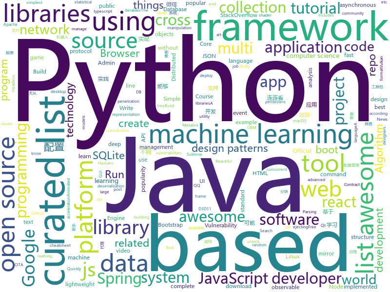

# 2018-06-11
See what the GitHub community is most excited about today.

## python
* [Python-100-Days](https://github.com/jackfrued/Python-100-Days)(**129 stars today**): Python - 100天从新手到大师
* [polyaxon](https://github.com/polyaxon/polyaxon)(**123 stars today**): An open source platform for reproducible machine learning at scale
* [models](https://github.com/tensorflow/models)(**57 stars today**): Models and examples built with TensorFlow
* [HN_SO_analysis](https://github.com/dgwozdz/HN_SO_analysis)(**56 stars today**): Does popularity of technology on StackOverflow (SO) influence popularity of a post about this technology on Hacker News (HN)?
* [Auto-Lianliankan](https://github.com/TheThreeDog/Auto-Lianliankan)(**39 stars today**): 基于python图像识别实现的连连看外挂，可实现QQ连连看秒破
* [keras](https://github.com/keras-team/keras)(**37 stars today**): Deep Learning for humans
* [awesome-python](https://github.com/vinta/awesome-python)(**37 stars today**): A curated list of awesome Python frameworks, libraries, software and resources
* [mlflow](https://github.com/databricks/mlflow)(**38 stars today**): Open source platform for the complete machine learning lifecycle
* [DevilYuan](https://github.com/moyuanz/DevilYuan)(**29 stars today**): DevilYuan股票量化系统
* [Douyin-Bot](https://github.com/wangshub/Douyin-Bot)(**31 stars today**): Python 抖音机器人，论如何在抖音上找到漂亮小姐姐？😍
* [wifite2](https://github.com/derv82/wifite2)(**30 stars today**): Rewrite of the popular wireless network auditor, "wifite"
* [system-design-primer](https://github.com/donnemartin/system-design-primer)(**25 stars today**): Learn how to design large-scale systems. Prep for the system design interview. Includes Anki flashcards.
* [ChromeREPL](https://github.com/acarabott/ChromeREPL)(**30 stars today**): A Sublime Text plugin to execute JavaScript in Google Chrome
* [awesome-machine-learning](https://github.com/josephmisiti/awesome-machine-learning)(**26 stars today**): A curated list of awesome Machine Learning frameworks, libraries and software.
* [face_recognition](https://github.com/ageitgey/face_recognition)(**22 stars today**): The world's simplest facial recognition api for Python and the command line
* [youtube-dl](https://github.com/rg3/youtube-dl)(**25 stars today**): Command-line program to download videos from YouTube.com and other video sites
* [python-patterns](https://github.com/faif/python-patterns)(**24 stars today**): A collection of design patterns/idioms in Python
* [scikit-learn](https://github.com/scikit-learn/scikit-learn)(**18 stars today**): scikit-learn: machine learning in Python
* [django](https://github.com/django/django)(**20 stars today**): The Web framework for perfectionists with deadlines.
* [arl](https://github.com/kaxap/arl)(**22 stars today**): lists of most popular repositories for most favoured programming languages (according to StackOverflow)
* [cpython](https://github.com/python/cpython)(**15 stars today**): The Python programming language
* [public-apis](https://github.com/toddmotto/public-apis)(**18 stars today**): A collective list of public JSON APIs for use in web development.
* [MachineLearning](https://github.com/apachecn/MachineLearning)(**17 stars today**): Machine Learning in Action（机器学习实战）
* [Python](https://github.com/geekcomputers/Python)(**16 stars today**): My Python Examples
* [pandas](https://github.com/pandas-dev/pandas)(**14 stars today**): Flexible and powerful data analysis / manipulation library for Python, providing labeled data structures similar to R data.frame objects, statistical functions, and much more

## java
* [Java-Interview](https://github.com/crossoverJie/Java-Interview)(**63 stars today**): 👨‍🎓Java related : basic, concurrent, algorithm
* [proxyee-down](https://github.com/proxyee-down-org/proxyee-down)(**38 stars today**): http下载工具，基于http代理，支持多连接分块下载
* [java-design-patterns](https://github.com/iluwatar/java-design-patterns)(**36 stars today**): Design patterns implemented in Java
* [tutorials](https://github.com/eugenp/tutorials)(**24 stars today**): The "REST With Spring" Course:
* [vjtools](https://github.com/vipshop/vjtools)(**25 stars today**): The vip.com's java coding standard, libraries and tools
* [weixin-java-tools](https://github.com/Wechat-Group/weixin-java-tools)(**24 stars today**): 可能是目前最好最全的微信Java开发工具包，支持包括微信支付、开放平台、小程序、企业号和公众号等的开发
* [spring-boot](https://github.com/spring-projects/spring-boot)(**18 stars today**): Spring Boot
* [spring-framework](https://github.com/spring-projects/spring-framework)(**17 stars today**): Spring Framework
* [springboot-learning-example](https://github.com/JeffLi1993/springboot-learning-example)(**16 stars today**): spring boot 实践学习案例，是 spring boot 初学者及核心技术巩固的最佳实践。
* [apollo](https://github.com/ctripcorp/apollo)(**16 stars today**): Apollo（阿波罗）是携程框架部门研发的分布式配置中心，能够集中化管理应用不同环境、不同集群的配置，配置修改后能够实时推送到应用端，并且具备规范的权限、流程治理等特性，适用于微服务配置管理场景。
* [VirtualXposed](https://github.com/android-hacker/VirtualXposed)(**18 stars today**): A Simple App to use Xposed without root or unlock the bootloader(or modify system image etc).
* [interviews](https://github.com/kdn251/interviews)(**16 stars today**): Everything you need to know to get the job.
* [Java](https://github.com/TheAlgorithms/Java)(**15 stars today**): All Algorithms implemented in Java
* [elasticsearch](https://github.com/elastic/elasticsearch)(**15 stars today**): Open Source, Distributed, RESTful Search Engine
* [incubator-dubbo](https://github.com/apache/incubator-dubbo)(**14 stars today**): Apache Dubbo (incubating) is a high-performance, java based, open source RPC framework.
* [netty](https://github.com/netty/netty)(**14 stars today**): Netty project - an event-driven asynchronous network application framework
* [graal](https://github.com/oracle/graal)(**15 stars today**): GraalVM: Run Programs Faster Anywhere🚀
* [RxJava](https://github.com/ReactiveX/RxJava)(**14 stars today**): RxJava – Reactive Extensions for the JVM – a library for composing asynchronous and event-based programs using observable sequences for the Java VM.
* [hadoop](https://github.com/apache/hadoop)(**12 stars today**): Mirror of Apache Hadoop
* [ParticlesDrawable](https://github.com/Doctoror/ParticlesDrawable)(**13 stars today**): Draws random flying particles in space forming constellations.
* [guava](https://github.com/google/guava)(**9 stars today**): Google core libraries for Java
* [freddy](https://github.com/nccgroup/freddy)(**12 stars today**): Automatically identify deserialisation issues in Java and .NET applications by using active and passive scans
* [jenkins](https://github.com/jenkinsci/jenkins)(**11 stars today**): Jenkins automation server
* [algs4](https://github.com/kevin-wayne/algs4)(**9 stars today**): Algorithms, 4th edition textbook code and libraries
* [litho](https://github.com/facebook/litho)(**11 stars today**): A declarative framework for building efficient UIs on Android.

## unknown
* [awesome-design-patterns](https://github.com/DovAmir/awesome-design-patterns)(**579 stars today**): A curated list of software and architecture related design patterns.
* [build-your-own-x](https://github.com/danistefanovic/build-your-own-x)(**453 stars today**): 🤓Build your own (insert technology here)
* [project-based-learning](https://github.com/tuvtran/project-based-learning)(**300 stars today**): Curated list of project-based tutorials
* [free-programming-books](https://github.com/EbookFoundation/free-programming-books)(**182 stars today**): 📚Freely available programming books
* [GLWTPL](https://github.com/me-shaon/GLWTPL)(**140 stars today**): "Good Luck With That" Public License
* [Project-Based-Tutorials-in-C](https://github.com/rby90/Project-Based-Tutorials-in-C)(**109 stars today**): A curated list of project-based tutorials in C
* [ALZA-Design-Doc](https://github.com/ALZAProject/ALZA-Design-Doc)(**85 stars today**): This repo host all documentations for ALZA
* [github-xp](https://github.com/martenbjork/github-xp)(**91 stars today**): Give Github some XP flair🔥
* [developer-roadmap](https://github.com/kamranahmedse/developer-roadmap)(**79 stars today**): Roadmap to becoming a web developer in 2018
* [awesome](https://github.com/sindresorhus/awesome)(**51 stars today**): 😎Curated list of awesome lists
* [papers-we-love](https://github.com/papers-we-love/papers-we-love)(**40 stars today**): Papers from the computer science community to read and discuss.
* [gitignore](https://github.com/github/gitignore)(**27 stars today**): A collection of useful .gitignore templates
* [coding-interview-university](https://github.com/jwasham/coding-interview-university)(**28 stars today**): A complete computer science study plan to become a software engineer.
* [Interview-Notebook](https://github.com/CyC2018/Interview-Notebook)(**30 stars today**): 📚技术面试需要掌握的基础知识整理，欢迎编辑~
* [react-typescript-cheatsheet](https://github.com/sw-yx/react-typescript-cheatsheet)(**31 stars today**): a cheatsheet for react users using typescript with react for the first (or nth!) time
* [linux-insides-zh](https://github.com/MintCN/linux-insides-zh)(**29 stars today**): Linux 内核揭密
* [the-front-end-knowledge-you-may-not-know](https://github.com/justjavac/the-front-end-knowledge-you-may-not-know)(**27 stars today**): 😇你可能不知道的前端知识点
* [awesome-flutter](https://github.com/Solido/awesome-flutter)(**21 stars today**): An awesome list that curates the best Flutter libraries, tools, tutorials, articles and more.
* [awesome-vue](https://github.com/vuejs/awesome-vue)(**18 stars today**): 🎉A curated list of awesome things related to Vue.js
* [awesome-cpp](https://github.com/fffaraz/awesome-cpp)(**19 stars today**): A curated list of awesome C++ (or C) frameworks, libraries, resources, and shiny things. Inspired by awesome-... stuff.
* [AsiaSecWest-2018-Chakra-vulnerability-and-exploit-bypass-all-system-mitigation](https://github.com/exp-sky/AsiaSecWest-2018-Chakra-vulnerability-and-exploit-bypass-all-system-mitigation)(**18 stars today**): Chakra vulnerability and exploit bypass all system mitigation
* [callbag](https://github.com/callbag/callbag)(**18 stars today**): 👜A standard for JS callbacks that enables lightweight observables and iterables
* [nocode](https://github.com/kelseyhightower/nocode)(**16 stars today**): The best way to write secure and reliable applications. Write nothing; deploy nowhere.
* [awesome-courses](https://github.com/prakhar1989/awesome-courses)(**12 stars today**): 📚List of awesome university courses for learning Computer Science!
* [awesome-react](https://github.com/enaqx/awesome-react)(**14 stars today**): A collection of awesome things regarding React ecosystem.

## c++
* [tensorflow](https://github.com/tensorflow/tensorflow)(**85 stars today**): Computation using data flow graphs for scalable machine learning
* [bitcoin](https://github.com/bitcoin/bitcoin)(**31 stars today**): Bitcoin Core integration/staging tree
* [electron](https://github.com/electron/electron)(**33 stars today**): Build cross platform desktop apps with JavaScript, HTML, and CSS
* [pytorch](https://github.com/pytorch/pytorch)(**22 stars today**): Tensors and Dynamic neural networks in Python with strong GPU acceleration
* [aseprite](https://github.com/aseprite/aseprite)(**24 stars today**): Animated sprite editor & pixel art tool (Windows, macOS, Linux)
* [cutter](https://github.com/radareorg/cutter)(**21 stars today**): A Qt and C++ GUI for radare2 reverse engineering framework
* [godot](https://github.com/godotengine/godot)(**20 stars today**): Godot Engine – Multi-platform 2D and 3D game engine
* [v8](https://github.com/v8/v8)(**17 stars today**): The official mirror of the V8 Git repository
* [opencv](https://github.com/opencv/opencv)(**11 stars today**): Open Source Computer Vision Library
* [napajs](https://github.com/Microsoft/napajs)(**14 stars today**): Napa.js: a multi-threaded JavaScript runtime
* [aria2](https://github.com/aria2/aria2)(**12 stars today**): aria2 is a lightweight multi-protocol & multi-source, cross platform download utility operated in command-line. It supports HTTP/HTTPS, FTP, SFTP, BitTorrent and Metalink.
* [grpc](https://github.com/grpc/grpc)(**13 stars today**): The C based gRPC (C++, Python, Ruby, Objective-C, PHP, C#)
* [Sonoff-Tasmota](https://github.com/arendst/Sonoff-Tasmota)(**12 stars today**): Provide ESP8266 based itead Sonoff with Web, MQTT and OTA firmware using Arduino IDE or PlatformIO
* [caffe](https://github.com/BVLC/caffe)(**11 stars today**): Caffe: a fast open framework for deep learning.
* [tesseract](https://github.com/tesseract-ocr/tesseract)(**12 stars today**): Tesseract Open Source OCR Engine (main repository)
* [turicreate](https://github.com/apple/turicreate)(**12 stars today**): Turi Create simplifies the development of custom machine learning models.
* [sqlitebrowser](https://github.com/sqlitebrowser/sqlitebrowser)(**12 stars today**): Official home of the DB Browser for SQLite (DB4S) project. Previously known as "SQLite Database Browser" and "Database Browser for SQLite". Website at:
* [phasar](https://github.com/secure-software-engineering/phasar)(**12 stars today**): A LLVM-based static analysis framework.
* [cosmos](https://github.com/OpenGenus/cosmos)(**10 stars today**): Algorithms that run our universe | Your personal library of every algorithm and data structure code that you will ever encounter | Ask us anything at our forum
* [xgboost](https://github.com/dmlc/xgboost)(**9 stars today**): Scalable, Portable and Distributed Gradient Boosting (GBDT, GBRT or GBM) Library, for Python, R, Java, Scala, C++ and more. Runs on single machine, Hadoop, Spark, Flink and DataFlow
* [HLSLcc](https://github.com/Unity-Technologies/HLSLcc)(**10 stars today**): DirectX shader bytecode cross compiler
* [cocos2d-x](https://github.com/cocos2d/cocos2d-x)(**9 stars today**): Cocos2d-x is a suite of open-source, cross-platform, game-development tools used by millions of developers all over the world.
* [protobuf](https://github.com/google/protobuf)(**9 stars today**): Protocol Buffers - Google's data interchange format
* [dxvk](https://github.com/doitsujin/dxvk)(**9 stars today**): Vulkan-based D3D11 implementation for Linux / Wine
* [solidity](https://github.com/ethereum/solidity)(**8 stars today**): Solidity, the Contract-Oriented Programming Language

## html
* [node-blog](https://github.com/liuxing/node-blog)(**27 stars today**): 🚀《Node.js从入门到上线》A blog build with Koa2.
* [Winds](https://github.com/GetStream/Winds)(**12 stars today**): A Beautiful Open Source RSS & Podcast App
* [JavaScript30](https://github.com/wesbos/JavaScript30)(**8 stars today**): 30 Day Vanilla JS Challenge
* [GyoiThon](https://github.com/gyoisamurai/GyoiThon)(**11 stars today**): GyoiThon is a growing penetration test tool using Machine Learning.
* [Spoon-Knife](https://github.com/octocat/Spoon-Knife)(****): This repo is for demonstration purposes only.
* [phantomjs](https://github.com/ariya/phantomjs)(**12 stars today**): Scriptable Headless Browser
* [worldmodels.github.io](https://github.com/worldmodels/worldmodels.github.io)(**10 stars today**): World Models
* [styleguide](https://github.com/google/styleguide)(**8 stars today**): Style guides for Google-originated open-source projects
* [gson](https://github.com/google/gson)(**9 stars today**): A Java serialization/deserialization library to convert Java Objects into JSON and back
* [AdminLTE](https://github.com/almasaeed2010/AdminLTE)(**7 stars today**): AdminLTE - Free Premium Admin control Panel Theme Based On Bootstrap 3.x
* [EIPs](https://github.com/ethereum/EIPs)(**9 stars today**): The Ethereum Improvement Proposal repository
* [fastText](https://github.com/facebookresearch/fastText)(**8 stars today**): Library for fast text representation and classification.
* [awesome-mac](https://github.com/jaywcjlove/awesome-mac)(**8 stars today**):  This repo is a collection of awesome Mac applications and tools for developers and designers.
* [portainer](https://github.com/portainer/portainer)(**8 stars today**): Simple management UI for Docker
* [react-app-rewired](https://github.com/timarney/react-app-rewired)(**8 stars today**): Override create-react-app webpack configs without ejecting
* [gentelella](https://github.com/puikinsh/gentelella)(**6 stars today**): Free Bootstrap 3 Admin Template
* [godbasin.github.io](https://github.com/godbasin/godbasin.github.io)(**6 stars today**): 被删前端博客--喜欢请star
* [javascript-tutorial-en](https://github.com/iliakan/javascript-tutorial-en)(**6 stars today**): Modern JavaScript Tutorial
* [favorites-web](https://github.com/cloudfavorites/favorites-web)(**6 stars today**): 云收藏 Spring Boot 2.0 开源项目
* [foundation-sites](https://github.com/zurb/foundation-sites)(**6 stars today**): The most advanced responsive front-end framework in the world. Quickly create prototypes and production code for sites that work on any kind of device.
* [requests-html](https://github.com/kennethreitz/requests-html)(**6 stars today**): Pythonic HTML Parsing for Humans™
* [electron-api-demos](https://github.com/electron/electron-api-demos)(**6 stars today**): Explore the Electron APIs
* [polymer](https://github.com/Polymer/polymer)(**5 stars today**): Build modern apps using web components
* [archerysec](https://github.com/archerysec/archerysec)(**5 stars today**): Open Source Vulnerability Assessment and Management helps developers and pentesters to perform scans and manage vulnerabilities.
* [nodejs-ex](https://github.com/sclorg/nodejs-ex)(****): node.js example

## WordCloud

