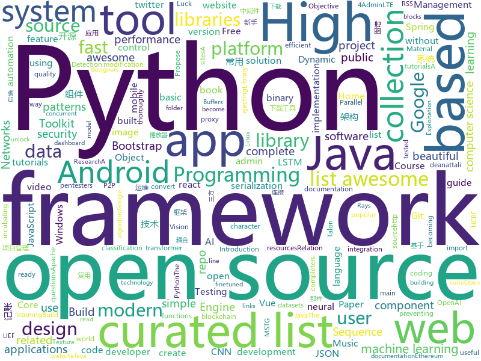

# 2018-06-17
See what the GitHub community is most excited about today.

## python
* [gif-for-cli](https://github.com/google/gif-for-cli)(**295 stars today**): 
* [fairseq](https://github.com/pytorch/fairseq)(**64 stars today**): Facebook AI Research Sequence-to-Sequence Toolkit written in Python.
* [Python-100-Days](https://github.com/jackfrued/Python-100-Days)(**42 stars today**): Python - 100天从新手到大师
* [NCRFpp](https://github.com/jiesutd/NCRFpp)(**40 stars today**): NCRF++, an Open-source Neural Sequence Labeling Toolkit. It includes character LSTM/CNN, word LSTM/CNN and softmax/CRF components.
* [keras](https://github.com/keras-team/keras)(**32 stars today**): Deep Learning for humans
* [awesome-python](https://github.com/vinta/awesome-python)(**33 stars today**): A curated list of awesome Python frameworks, libraries, software and resources
* [Relation-Networks-for-Object-Detection](https://github.com/msracver/Relation-Networks-for-Object-Detection)(**35 stars today**): Relation Networks for Object Detection
* [models](https://github.com/tensorflow/models)(**33 stars today**): Models and examples built with TensorFlow
* [blockchain-python](https://github.com/Carlos-Zen/blockchain-python)(**31 stars today**): A blockchain implementation in Python
* [flask](https://github.com/pallets/flask)(**24 stars today**): The Python micro framework for building web applications.
* [youtube-dl](https://github.com/rg3/youtube-dl)(**23 stars today**): Command-line program to download videos from YouTube.com and other video sites
* [wtfpython](https://github.com/satwikkansal/wtfpython)(**24 stars today**): A collection of surprising Python snippets and lesser-known features.
* [public-apis](https://github.com/toddmotto/public-apis)(**22 stars today**): A collective list of public JSON APIs for use in web development.
* [self-imitation-learning](https://github.com/junhyukoh/self-imitation-learning)(**23 stars today**): 
* [detect-secrets](https://github.com/Yelp/detect-secrets)(**21 stars today**): An enterprise friendly way of detecting and preventing secrets in code.
* [nonoCAPTCHA](https://github.com/mikeyy/nonoCAPTCHA)(**19 stars today**): nonoCAPTCHA - defeating Google's reCAPTCHA one step at a time
* [cpython](https://github.com/python/cpython)(**16 stars today**): The Python programming language
* [home-assistant](https://github.com/home-assistant/home-assistant)(**20 stars today**): 🏡Open-source home automation platform running on Python 3
* [pytorch-openai-transformer-lm](https://github.com/huggingface/pytorch-openai-transformer-lm)(**19 stars today**): A PyTorch implementation of OpenAI's finetuned transformer language model with a script to import the weights pre-trained by OpenAI
* [scikit-learn](https://github.com/scikit-learn/scikit-learn)(**16 stars today**): scikit-learn: machine learning in Python
* [mtprotoproxy](https://github.com/alexbers/mtprotoproxy)(**18 stars today**): Async mtproto proxy for Telegram
* [django](https://github.com/django/django)(**14 stars today**): The Web framework for perfectionists with deadlines.
* [CMSeeK](https://github.com/Tuhinshubhra/CMSeeK)(**18 stars today**): CMS (Content Management Systems) Detection and Exploitation suite
* [mlflow](https://github.com/databricks/mlflow)(**17 stars today**): Open source platform for the complete machine learning lifecycle
* [nesmdb](https://github.com/chrisdonahue/nesmdb)(**17 stars today**): The NES Music Database: use machine learning to compose music for the Nintendo Entertainment System!

## java
* [talon-for-twitter-android](https://github.com/klinker24/talon-for-twitter-android)(**76 stars today**): The Material Design version of my popular Android Talon for Twitter app, 100% open-source
* [proxyee-down](https://github.com/proxyee-down-org/proxyee-down)(**46 stars today**): http下载工具，基于http代理，支持多连接分块下载
* [Dragonfly](https://github.com/alibaba/Dragonfly)(**31 stars today**): Dragonfly is an intelligent P2P based file distribution system.
* [spring-boot](https://github.com/spring-projects/spring-boot)(**23 stars today**): Spring Boot
* [java-design-patterns](https://github.com/iluwatar/java-design-patterns)(**20 stars today**): Design patterns implemented in Java
* [tutorials](https://github.com/eugenp/tutorials)(**16 stars today**): The "REST With Spring" Course:
* [selenium](https://github.com/SeleniumHQ/selenium)(**18 stars today**): A browser automation framework and ecosystem.
* [metacat](https://github.com/Netflix/metacat)(**17 stars today**): 
* [PlayerBase](https://github.com/jiajunhui/PlayerBase)(**17 stars today**): The basic library of Android player will process complex business components. The access is simple。Android播放器基础库，专注于播放视图组件的高复用性和组件间的低耦合，轻松处理复杂业务。
* [vjtools](https://github.com/vipshop/vjtools)(**17 stars today**): The vip.com's java coding standard, libraries and tools
* [MoneyKeeper](https://github.com/Bakumon/MoneyKeeper)(**14 stars today**): 💰「那样记账」——一款纯粹、轻量的记账应用
* [Java-Interview](https://github.com/crossoverJie/Java-Interview)(**14 stars today**): 👨‍🎓Java related : basic, concurrent, algorithm
* [guava](https://github.com/google/guava)(**13 stars today**): Google core libraries for Java
* [mybatis-3](https://github.com/mybatis/mybatis-3)(**13 stars today**): MyBatis SQL mapper framework for Java
* [elasticsearch](https://github.com/elastic/elasticsearch)(**11 stars today**): Open Source, Distributed, RESTful Search Engine
* [litespring](https://github.com/onlyliuxin/litespring)(**8 stars today**): 
* [react-native-navigation](https://github.com/wix/react-native-navigation)(**11 stars today**): A complete native navigation solution for React Native
* [spring-framework](https://github.com/spring-projects/spring-framework)(**11 stars today**): Spring Framework
* [ARouter](https://github.com/alibaba/ARouter)(**11 stars today**): 💪A framework for assisting in the renovation of Android componentization
* [VirtualXposed](https://github.com/android-hacker/VirtualXposed)(**11 stars today**): A simple app to use Xposed without root or unlock the bootloader(or modify system image etc).
* [mpush](https://github.com/mpusher/mpush)(**11 stars today**): MPush开源实时消息推送系统
* [hadoop](https://github.com/apache/hadoop)(**8 stars today**): Mirror of Apache Hadoop
* [glide](https://github.com/bumptech/glide)(**10 stars today**): An image loading and caching library for Android focused on smooth scrolling
* [interview](https://github.com/mission-peace/interview)(**9 stars today**): Interview questions
* [incubator-dubbo](https://github.com/apache/incubator-dubbo)(**8 stars today**): Apache Dubbo (incubating) is a high-performance, java based, open source RPC framework.

## unknown
* [awesome-design-patterns](https://github.com/DovAmir/awesome-design-patterns)(**270 stars today**): A curated list of software and architecture related design patterns.
* [awesome-online-ide](https://github.com/styfle/awesome-online-ide)(**227 stars today**): 🌩️A list of awesome online development environments
* [build-your-own-x](https://github.com/danistefanovic/build-your-own-x)(**101 stars today**): 🤓Build your own (insert technology here)
* [awesome](https://github.com/sindresorhus/awesome)(**67 stars today**): 😎Curated list of awesome lists
* [technology-talk](https://github.com/aalansehaiyang/technology-talk)(**56 stars today**): 汇总java生态圈常用技术框架、开源中间件，系统架构、项目管理、经典架构案例、数据库、常用三方库、线上运维等知识
* [You-Dont-Know-JS](https://github.com/getify/You-Dont-Know-JS)(**38 stars today**): A book series on JavaScript. @YDKJS on twitter.
* [gitignore](https://github.com/github/gitignore)(**31 stars today**): A collection of useful .gitignore templates
* [developer-roadmap](https://github.com/kamranahmedse/developer-roadmap)(**36 stars today**): Roadmap to becoming a web developer in 2018
* [free-programming-books](https://github.com/EbookFoundation/free-programming-books)(**34 stars today**): 📚Freely available programming books
* [Interview-Notebook](https://github.com/CyC2018/Interview-Notebook)(**32 stars today**): 📆准备秋招学习笔记
* [Awesome-Hacking](https://github.com/Hack-with-Github/Awesome-Hacking)(**29 stars today**): A collection of various awesome lists for hackers, pentesters and security researchers
* [vue-patterns](https://github.com/learn-vuejs/vue-patterns)(**29 stars today**): Useful Vue patterns, techniques, tips and tricks and helpful curated links.
* [awesome-vue](https://github.com/vuejs/awesome-vue)(**26 stars today**): 🎉A curated list of awesome things related to Vue.js
* [architect-awesome](https://github.com/xingshaocheng/architect-awesome)(**24 stars today**): 后端架构师技术图谱
* [coding-interview-university](https://github.com/jwasham/coding-interview-university)(**19 stars today**): A complete computer science study plan to become a software engineer.
* [project-based-learning](https://github.com/tuvtran/project-based-learning)(**21 stars today**): Curated list of project-based tutorials
* [Red-Teaming-Toolkit](https://github.com/infosecn1nja/Red-Teaming-Toolkit)(**17 stars today**): A collection of open source and commercial tools that aid in red team operations.
* [awesome-flutter](https://github.com/Solido/awesome-flutter)(**18 stars today**): An awesome list that curates the best Flutter libraries, tools, tutorials, articles and more.
* [GLWTPL](https://github.com/me-shaon/GLWTPL)(**18 stars today**): "Good Luck With That" Public License
* [dovolno](https://github.com/roscom-hvatit/dovolno)(**18 stars today**): Российские разработчики Роскомнадзору
* [Project-Based-Tutorials-in-C](https://github.com/rby90/Project-Based-Tutorials-in-C)(**17 stars today**): A curated list of project-based tutorials in C
* [awesome-courses](https://github.com/prakhar1989/awesome-courses)(**15 stars today**): 📚List of awesome university courses for learning Computer Science!
* [papers-we-love](https://github.com/papers-we-love/papers-we-love)(**16 stars today**): Papers from the computer science community to read and discuss.
* [awesome-scalability](https://github.com/binhnguyennus/awesome-scalability)(**15 stars today**): High Scalability, High Availability, High Stability, High Performance, and High Intelligence Back-End Design Patterns
* [awesome-public-datasets](https://github.com/awesomedata/awesome-public-datasets)(**12 stars today**): A topic-centric list of high-quality open datasets in public domains. Propose NEW data ☛☛☛PR☛☛☛

## c++
* [tensorflow](https://github.com/tensorflow/tensorflow)(**50 stars today**): Computation using data flow graphs for scalable machine learning
* [electron](https://github.com/electron/electron)(**38 stars today**): Build cross platform desktop apps with JavaScript, HTML, and CSS
* [bitcoin](https://github.com/bitcoin/bitcoin)(**29 stars today**): Bitcoin Core integration/staging tree
* [cpp-taskflow](https://github.com/cpp-taskflow/cpp-taskflow)(**31 stars today**): Fast C++ Parallel Programming with Task Dependencies
* [protobuf](https://github.com/google/protobuf)(**23 stars today**): Protocol Buffers - Google's data interchange format
* [pytorch](https://github.com/pytorch/pytorch)(**18 stars today**): Tensors and Dynamic neural networks in Python with strong GPU acceleration
* [opencv](https://github.com/opencv/opencv)(**13 stars today**): Open Source Computer Vision Library
* [katran](https://github.com/facebookincubator/katran)(**15 stars today**): A high performance layer 4 load balancer
* [swift](https://github.com/apple/swift)(**14 stars today**): The Swift Programming Language
* [grpc](https://github.com/grpc/grpc)(**11 stars today**): The C based gRPC (C++, Python, Ruby, Objective-C, PHP, C#)
* [aseprite](https://github.com/aseprite/aseprite)(**12 stars today**): Animated sprite editor & pixel art tool (Windows, macOS, Linux)
* [YaCo](https://github.com/DGA-MI-SSI/YaCo)(**11 stars today**): YaCo is an Hex-Rays IDA plugin. When enabled, multiple users can work simultaneously on the same binary. Any modification done by any user is synchronized through git version control.
* [googletest](https://github.com/google/googletest)(**10 stars today**): Google Test
* [tesseract](https://github.com/tesseract-ocr/tesseract)(**9 stars today**): Tesseract Open Source OCR Engine (main repository)
* [envoy](https://github.com/envoyproxy/envoy)(**10 stars today**): C++ front/service proxy
* [json](https://github.com/nlohmann/json)(**9 stars today**): JSON for Modern C++
* [TranslucentTB](https://github.com/TranslucentTB/TranslucentTB)(**9 stars today**): A lightweight utility that makes the Windows taskbar translucent/transparent.
* [LIEF](https://github.com/lief-project/LIEF)(**9 stars today**): LIEF - Library to Instrument Executable Formats
* [godot](https://github.com/godotengine/godot)(**9 stars today**): Godot Engine – Multi-platform 2D and 3D game engine
* [entt](https://github.com/skypjack/entt)(**9 stars today**): Gaming meets modern C++ - a fast and reliable entity-component system (ECS) and much more
* [CLRS](https://github.com/gzc/CLRS)(**7 stars today**): 📓Solutions to Introduction to Algorithms
* [rpcs3](https://github.com/RPCS3/rpcs3)(**8 stars today**): PS3 emulator/debugger
* [solidity](https://github.com/ethereum/solidity)(**8 stars today**): Solidity, the Contract-Oriented Programming Language
* [AirSim](https://github.com/Microsoft/AirSim)(**7 stars today**): Open source simulator based on Unreal Engine for autonomous vehicles from Microsoft AI & Research
* [dlib](https://github.com/davisking/dlib)(**7 stars today**): A toolkit for making real world machine learning and data analysis applications in C++

## html
* [owasp-mstg](https://github.com/OWASP/owasp-mstg)(**277 stars today**): The Mobile Security Testing Guide (MSTG) is a comprehensive manual for mobile app security testing and reverse engineering.
* [Blot](https://github.com/davidmerfield/Blot)(**81 stars today**): Turns a folder into a website
* [kryo](https://github.com/EsotericSoftware/kryo)(**29 stars today**): Java binary serialization and cloning: fast, efficient, automatic
* [styleguide](https://github.com/google/styleguide)(**10 stars today**): Style guides for Google-originated open-source projects
* [awesome-mac](https://github.com/jaywcjlove/awesome-mac)(**11 stars today**):  This repo is a collection of awesome Mac applications and tools for developers and designers.
* [Winds](https://github.com/GetStream/Winds)(**11 stars today**): A Beautiful Open Source RSS & Podcast App
* [react-app-rewired](https://github.com/timarney/react-app-rewired)(**10 stars today**): Override create-react-app webpack configs without ejecting
* [fastText](https://github.com/facebookresearch/fastText)(**7 stars today**): Library for fast text representation and classification.
* [sing-app](https://github.com/flatlogic/sing-app)(**8 stars today**): Free and open-source admin dashboard template built with Bootstrap 4
* [AdminLTE](https://github.com/almasaeed2010/AdminLTE)(**6 stars today**): AdminLTE - Free Premium Admin control Panel Theme Based On Bootstrap 3.x
* [Spoon-Knife](https://github.com/octocat/Spoon-Knife)(****): This repo is for demonstration purposes only.
* [design-blocks](https://github.com/froala/design-blocks)(**7 stars today**): A set of 170+ Bootstrap based design blocks ready to be used to create clean modern websites.
* [two-stream-dyntex-synth](https://github.com/ryersonvisionlab/two-stream-dyntex-synth)(**7 stars today**): Code for the paper "Two-Stream Convolutional Networks for Dynamic Texture Synthesis". Presented at CVPR '18.
* [es6-features](https://github.com/rse/es6-features)(**5 stars today**): ECMAScript 6: Feature Overview & Comparison
* [Titanium-Lambda](https://github.com/JimTheMan/Titanium-Lambda)(**6 stars today**): Easy to maintain, blazingly fast, and thoroughly tested Lambda functions in NodeJs.
* [patchwork](https://github.com/jlord/patchwork)(****): All the Git-it Workshop completers!
* [polymer](https://github.com/Polymer/polymer)(**5 stars today**): Build modern apps using web components
* [gson](https://github.com/google/gson)(**5 stars today**): A Java serialization/deserialization library to convert Java Objects into JSON and back
* [portainer](https://github.com/portainer/portainer)(**5 stars today**): Simple management UI for Docker
* [learning-area](https://github.com/mdn/learning-area)(****): Github repo for the MDN Learning Area.
* [fend-project-memory-game](https://github.com/udacity/fend-project-memory-game)(****): 
* [beautiful-jekyll](https://github.com/daattali/beautiful-jekyll)(****): ✨Build a beautiful and simple website in literally minutes. Demo at http://deanattali.com/beautiful-jekyll
* [home-assistant.github.io](https://github.com/home-assistant/home-assistant.github.io)(****): 📘Home Assistant User documentation
* [ethereum-org](https://github.com/ethereum/ethereum-org)(****): Ethereum Foundation website
* [docs](https://github.com/cockroachdb/docs)(****): CockroachDB user documentation

## WordCloud

