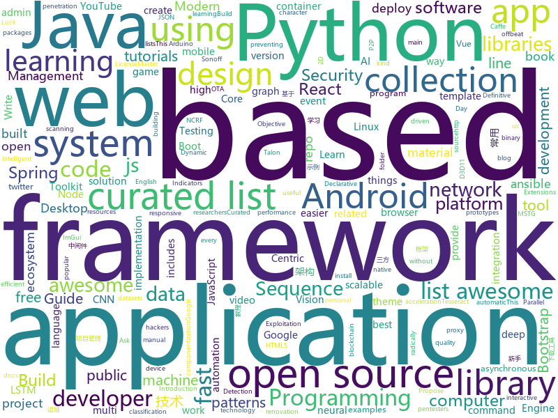

# 2018-06-18
See what the GitHub community is most excited about today.

## python
* [gif-for-cli](https://github.com/google/gif-for-cli)(**164 stars today**): 
* [lemongraph](https://github.com/NationalSecurityAgency/lemongraph)(**157 stars today**): Log-based transactional graph engine
* [awesome-python](https://github.com/vinta/awesome-python)(**64 stars today**): A curated list of awesome Python frameworks, libraries, software and resources
* [masonite](https://github.com/MasoniteFramework/masonite)(**56 stars today**): The Modern And Developer Centric Python Web Framework
* [Python-100-Days](https://github.com/jackfrued/Python-100-Days)(**40 stars today**): Python - 100天从新手到大师
* [keras](https://github.com/keras-team/keras)(**33 stars today**): Deep Learning for humans
* [fairseq](https://github.com/pytorch/fairseq)(**35 stars today**): Facebook AI Research Sequence-to-Sequence Toolkit written in Python.
* [models](https://github.com/tensorflow/models)(**26 stars today**): Models and examples built with TensorFlow
* [Relation-Networks-for-Object-Detection](https://github.com/msracver/Relation-Networks-for-Object-Detection)(**35 stars today**): Relation Networks for Object Detection
* [CMSeeK](https://github.com/Tuhinshubhra/CMSeeK)(**34 stars today**): CMS (Content Management Systems) Detection and Exploitation suite
* [youtube-dl](https://github.com/rg3/youtube-dl)(**30 stars today**): Command-line program to download videos from YouTube.com and other video sites
* [detect-secrets](https://github.com/Yelp/detect-secrets)(**31 stars today**): An enterprise friendly way of detecting and preventing secrets in code.
* [NCRFpp](https://github.com/jiesutd/NCRFpp)(**26 stars today**): NCRF++, an Open-source Neural Sequence Labeling Toolkit. It includes character LSTM/CNN, word LSTM/CNN and softmax/CRF components.
* [public-apis](https://github.com/toddmotto/public-apis)(**25 stars today**): A collective list of public JSON APIs for use in web development.
* [flask](https://github.com/pallets/flask)(**24 stars today**): The Python micro framework for building web applications.
* [django](https://github.com/django/django)(**20 stars today**): The Web framework for perfectionists with deadlines.
* [wtfpython](https://github.com/satwikkansal/wtfpython)(**22 stars today**): A collection of surprising Python snippets and lesser-known features.
* [blockchain-python](https://github.com/Carlos-Zen/blockchain-python)(**21 stars today**): A blockchain implementation in Python
* [scikit-learn](https://github.com/scikit-learn/scikit-learn)(**19 stars today**): scikit-learn: machine learning in Python
* [ImageAI](https://github.com/OlafenwaMoses/ImageAI)(**18 stars today**): A python library built to empower developers to build applications and systems with self-contained Computer Vision capabilities
* [hendrix](https://github.com/hendrix/hendrix)(**20 stars today**): A python web server focused on async and offbeat network traffic. Named for the thought, "who is a 'twisted' Django R?" (though it works with any WSGI app).
* [awesome-machine-learning](https://github.com/josephmisiti/awesome-machine-learning)(**18 stars today**): A curated list of awesome Machine Learning frameworks, libraries and software.
* [ansible](https://github.com/ansible/ansible)(**14 stars today**): Ansible is a radically simple IT automation platform that makes your applications and systems easier to deploy. Avoid writing scripts or custom code to deploy and update your applications — automate in a language that approaches plain English, using SSH, with no agents to install on remote systems. https://docs.ansible.com/ansible/
* [mitmproxy](https://github.com/mitmproxy/mitmproxy)(**16 stars today**): An interactive TLS-capable intercepting HTTP proxy for penetration testers and software developers.
* [system-design-primer](https://github.com/donnemartin/system-design-primer)(**12 stars today**): Learn how to design large-scale systems. Prep for the system design interview. Includes Anki flashcards.

## java
* [talon-for-twitter-android](https://github.com/klinker24/talon-for-twitter-android)(**76 stars today**): The Material Design version of my popular Android Talon for Twitter app, 100% open-source
* [proxyee-down](https://github.com/proxyee-down-org/proxyee-down)(**61 stars today**): http下载工具，基于http代理，支持多连接分块下载
* [titus-control-plane](https://github.com/Netflix/titus-control-plane)(**42 stars today**): Titus is the Netflix Container Management Platform that manages containers and provides integrations to the infrastructure ecosystem.
* [dotsindicator](https://github.com/tommybuonomo/dotsindicator)(**32 stars today**): Three material Dots Indicators for view pagers in Android !
* [spring-boot](https://github.com/spring-projects/spring-boot)(**21 stars today**): Spring Boot
* [selenium](https://github.com/SeleniumHQ/selenium)(**21 stars today**): A browser automation framework and ecosystem.
* [java-design-patterns](https://github.com/iluwatar/java-design-patterns)(**21 stars today**): Design patterns implemented in Java
* [ARouter](https://github.com/alibaba/ARouter)(**20 stars today**): 💪A framework for assisting in the renovation of Android componentization
* [guava](https://github.com/google/guava)(**16 stars today**): Google core libraries for Java
* [Dragonfly](https://github.com/alibaba/Dragonfly)(**17 stars today**): Dragonfly is an intelligent P2P based file distribution system.
* [tutorials](https://github.com/eugenp/tutorials)(**7 stars today**): The "REST With Spring" Course:
* [RxJava](https://github.com/ReactiveX/RxJava)(**15 stars today**): RxJava – Reactive Extensions for the JVM – a library for composing asynchronous and event-based programs using observable sequences for the Java VM.
* [netty](https://github.com/netty/netty)(**13 stars today**): Netty project - an event-driven asynchronous network application framework
* [AndroidUtilCode](https://github.com/Blankj/AndroidUtilCode)(**12 stars today**): 🔥Android developers should collect the following utils(updating).
* [react-native-navigation](https://github.com/wix/react-native-navigation)(**12 stars today**): A complete native navigation solution for React Native
* [okhttp](https://github.com/square/okhttp)(**10 stars today**): An HTTP+HTTP/2 client for Android and Java applications.
* [spring-boot-examples](https://github.com/ityouknow/spring-boot-examples)(**9 stars today**): about learning Spring Boot via examples. Spring Boot 技术栈示例代码，快速简单上手教程。
* [elasticsearch](https://github.com/elastic/elasticsearch)(**9 stars today**): Open Source, Distributed, RESTful Search Engine
* [metacat](https://github.com/Netflix/metacat)(**10 stars today**): 
* [incubator-dubbo](https://github.com/apache/incubator-dubbo)(**8 stars today**): Apache Dubbo (incubating) is a high-performance, java based, open source RPC framework.
* [litespring](https://github.com/onlyliuxin/litespring)(**6 stars today**): 
* [libgdx](https://github.com/libgdx/libgdx)(**9 stars today**): Desktop/Android/HTML5/iOS Java game development framework
* [zxing](https://github.com/zxing/zxing)(**9 stars today**): ZXing ("Zebra Crossing") barcode scanning library for Java, Android
* [bazel](https://github.com/bazelbuild/bazel)(**8 stars today**): a fast, scalable, multi-language and extensible build system
* [interview](https://github.com/mission-peace/interview)(**7 stars today**): Interview questions

## unknown
* [awesome-design-patterns](https://github.com/DovAmir/awesome-design-patterns)(**261 stars today**): A curated list of software and architecture related design patterns.
* [awesome-online-ide](https://github.com/styfle/awesome-online-ide)(**146 stars today**): 🌩️A list of awesome online development environments
* [build-your-own-x](https://github.com/danistefanovic/build-your-own-x)(**136 stars today**): 🤓Build your own (insert technology here)
* [awesome](https://github.com/sindresorhus/awesome)(**83 stars today**): 😎Curated list of awesome lists
* [AI_Freelancing](https://github.com/llSourcell/AI_Freelancing)(**49 stars today**): This is the code for "How to Do Freelance AI Programming" By Siraj Raval on Youtube
* [awesome-web-security](https://github.com/qazbnm456/awesome-web-security)(**52 stars today**): 🐶A curated list of Web Security materials and resources.
* [gitignore](https://github.com/github/gitignore)(**42 stars today**): A collection of useful .gitignore templates
* [awesome-vue](https://github.com/vuejs/awesome-vue)(**34 stars today**): 🎉A curated list of awesome things related to Vue.js
* [You-Dont-Know-JS](https://github.com/getify/You-Dont-Know-JS)(**27 stars today**): A book series on JavaScript. @YDKJS on twitter.
* [free-programming-books](https://github.com/EbookFoundation/free-programming-books)(**26 stars today**): 📚Freely available programming books
* [Interview-Notebook](https://github.com/CyC2018/Interview-Notebook)(**25 stars today**): 📆准备秋招学习笔记
* [architect-awesome](https://github.com/xingshaocheng/architect-awesome)(**24 stars today**): 后端架构师技术图谱
* [Awesome-Hacking](https://github.com/Hack-with-Github/Awesome-Hacking)(**23 stars today**): A collection of various awesome lists for hackers, pentesters and security researchers
* [project-based-learning](https://github.com/tuvtran/project-based-learning)(**23 stars today**): Curated list of project-based tutorials
* [technology-talk](https://github.com/aalansehaiyang/technology-talk)(**21 stars today**): 汇总java生态圈常用技术框架、开源中间件，系统架构、项目管理、经典架构案例、数据库、常用三方库、线上运维等知识
* [papers-we-love](https://github.com/papers-we-love/papers-we-love)(**21 stars today**): Papers from the computer science community to read and discuss.
* [Project-Based-Tutorials-in-C](https://github.com/rby90/Project-Based-Tutorials-in-C)(**19 stars today**): A curated list of project-based tutorials in C
* [awesome-public-datasets](https://github.com/awesomedata/awesome-public-datasets)(**18 stars today**): A topic-centric list of high-quality open datasets in public domains. Propose NEW data ☛☛☛PR☛☛☛
* [nocode](https://github.com/kelseyhightower/nocode)(**18 stars today**): The best way to write secure and reliable applications. Write nothing; deploy nowhere.
* [awesome-react](https://github.com/enaqx/awesome-react)(**15 stars today**): A collection of awesome things regarding React ecosystem.
* [awesome-nodejs](https://github.com/sindresorhus/awesome-nodejs)(**15 stars today**): ⚡️Delightful Node.js packages and resources
* [vue-patterns](https://github.com/learn-vuejs/vue-patterns)(**16 stars today**): Useful Vue patterns, techniques, tips and tricks and helpful curated links.
* [awesome-flutter](https://github.com/Solido/awesome-flutter)(**15 stars today**): An awesome list that curates the best Flutter libraries, tools, tutorials, articles and more.
* [GLWTPL](https://github.com/me-shaon/GLWTPL)(**14 stars today**): "Good Luck With That" Public License
* [the-art-of-command-line](https://github.com/jlevy/the-art-of-command-line)(**13 stars today**): Master the command line, in one page

## c++
* [zapcc](https://github.com/yrnkrn/zapcc)(**119 stars today**): zapcc is a caching C++ compiler based on clang, designed to perform faster compilations
* [tensorflow](https://github.com/tensorflow/tensorflow)(**65 stars today**): Computation using data flow graphs for scalable machine learning
* [electron](https://github.com/electron/electron)(**30 stars today**): Build cross platform desktop apps with JavaScript, HTML, and CSS
* [opencv](https://github.com/opencv/opencv)(**23 stars today**): Open Source Computer Vision Library
* [cpp-taskflow](https://github.com/cpp-taskflow/cpp-taskflow)(**26 stars today**): Fast C++ Parallel Programming with Task Dependencies
* [bitcoin](https://github.com/bitcoin/bitcoin)(**19 stars today**): Bitcoin Core integration/staging tree
* [aseprite](https://github.com/aseprite/aseprite)(**19 stars today**): Animated sprite editor & pixel art tool (Windows, macOS, Linux)
* [pytorch](https://github.com/pytorch/pytorch)(**17 stars today**): Tensors and Dynamic neural networks in Python with strong GPU acceleration
* [tesseract](https://github.com/tesseract-ocr/tesseract)(**17 stars today**): Tesseract Open Source OCR Engine (main repository)
* [caffe](https://github.com/BVLC/caffe)(**15 stars today**): Caffe: a fast open framework for deep learning.
* [protobuf](https://github.com/google/protobuf)(**14 stars today**): Protocol Buffers - Google's data interchange format
* [json](https://github.com/nlohmann/json)(**13 stars today**): JSON for Modern C++
* [CLRS](https://github.com/gzc/CLRS)(**11 stars today**): 📓Solutions to Introduction to Algorithms
* [godot](https://github.com/godotengine/godot)(**12 stars today**): Godot Engine – Multi-platform 2D and 3D game engine
* [tdesktop](https://github.com/telegramdesktop/tdesktop)(**12 stars today**): Telegram Desktop messaging app
* [dxvk](https://github.com/doitsujin/dxvk)(**12 stars today**): Vulkan-based D3D11 implementation for Linux / Wine
* [grpc](https://github.com/grpc/grpc)(**11 stars today**): The C based gRPC (C++, Python, Ruby, Objective-C, PHP, C#)
* [Sonoff-Tasmota](https://github.com/arendst/Sonoff-Tasmota)(**9 stars today**): Provide ESP8266 based itead Sonoff with Web, MQTT and OTA firmware using Arduino IDE or PlatformIO
* [cosmos](https://github.com/OpenGenus/cosmos)(**10 stars today**): Algorithms that run our universe | Your personal library of every algorithm and data structure code that you will ever encounter | Ask us anything at our forum
* [swift](https://github.com/apple/swift)(**10 stars today**): The Swift Programming Language
* [imgui](https://github.com/ocornut/imgui)(**10 stars today**): Dear ImGui: Bloat-free Immediate Mode Graphical User interface for C++ with minimal dependencies
* [flat_hash_map](https://github.com/skarupke/flat_hash_map)(**9 stars today**): A very fast hashtable
* [devilution](https://github.com/galaxyhaxz/devilution)(**9 stars today**): Diablo devolved - magic behind the 1996 computer game
* [navicat-keygen](https://github.com/DoubleLabyrinth/navicat-keygen)(**8 stars today**): A keygen for Navicat Premium
* [solidity](https://github.com/ethereum/solidity)(**8 stars today**): Solidity, the Contract-Oriented Programming Language

## html
* [owasp-mstg](https://github.com/OWASP/owasp-mstg)(**181 stars today**): The Mobile Security Testing Guide (MSTG) is a comprehensive manual for mobile app security testing and reverse engineering.
* [component](https://github.com/reactions/component)(**53 stars today**): Declarative version of React.Component
* [Blot](https://github.com/davidmerfield/Blot)(**29 stars today**): Turns a folder into a website
* [styleguide](https://github.com/google/styleguide)(**16 stars today**): Style guides for Google-originated open-source projects
* [react-app-rewired](https://github.com/timarney/react-app-rewired)(**13 stars today**): Override create-react-app webpack configs without ejecting
* [Winds](https://github.com/GetStream/Winds)(**12 stars today**): A Beautiful Open Source RSS & Podcast App
* [AdminLTE](https://github.com/almasaeed2010/AdminLTE)(**9 stars today**): AdminLTE - Free Premium Admin control Panel Theme Based On Bootstrap 3.x
* [JavaScript30](https://github.com/wesbos/JavaScript30)(**5 stars today**): 30 Day Vanilla JS Challenge
* [cs231n.github.io](https://github.com/cs231n/cs231n.github.io)(**7 stars today**): Public facing notes page
* [awesome-mac](https://github.com/jaywcjlove/awesome-mac)(**8 stars today**):  This repo is a collection of awesome Mac applications and tools for developers and designers.
* [fastText](https://github.com/facebookresearch/fastText)(**6 stars today**): Library for fast text representation and classification.
* [phantomjs](https://github.com/ariya/phantomjs)(**6 stars today**): Scriptable Headless Browser
* [flag-icon-css](https://github.com/lipis/flag-icon-css)(**6 stars today**): 🎏A collection of all country flags in SVG — plus the CSS for easier integration
* [portainer](https://github.com/portainer/portainer)(**6 stars today**): Simple management UI for Docker
* [zenbot](https://github.com/DeviaVir/zenbot)(**6 stars today**): Zenbot is a command-line cryptocurrency trading bot using Node.js and MongoDB.
* [kryo](https://github.com/EsotericSoftware/kryo)(**6 stars today**): Java binary serialization and cloning: fast, efficient, automatic
* [Spoon-Knife](https://github.com/octocat/Spoon-Knife)(****): This repo is for demonstration purposes only.
* [startbootstrap](https://github.com/BlackrockDigital/startbootstrap)(**5 stars today**): A library of free and open source Bootstrap themes and templates
* [foundation-sites](https://github.com/zurb/foundation-sites)(**5 stars today**): The most advanced responsive front-end framework in the world. Quickly create prototypes and production code for sites that work on any kind of device.
* [polymer](https://github.com/Polymer/polymer)(**5 stars today**): Build modern apps using web components
* [sing-app](https://github.com/flatlogic/sing-app)(**5 stars today**): Free and open-source admin dashboard template built with Bootstrap 4
* [course-git-blog-project](https://github.com/udacity/course-git-blog-project)(****): Sample repo of a blog for the Git course
* [nodejs-ex](https://github.com/sclorg/nodejs-ex)(****): node.js example
* [game-of-life](https://github.com/wakaleo/game-of-life)(****): Demo application for the 'Jenkins: The Definitive Guide' book
* [first-pr](https://github.com/ituring/first-pr)(****): 《GitHub实践入门》实验用仓库

## WordCloud

