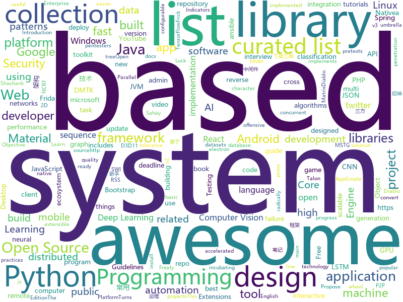

# 2018-06-19
See what the GitHub community is most excited about today.

## python
* [gif-for-cli](https://github.com/google/gif-for-cli)(**178 stars today**): 
* [lemongraph](https://github.com/NationalSecurityAgency/lemongraph)(**152 stars today**): Log-based transactional graph engine
* [amodem](https://github.com/romanz/amodem)(**125 stars today**): Audio MODEM Communication Library in Python
* [awesome-python](https://github.com/vinta/awesome-python)(**69 stars today**): A curated list of awesome Python frameworks, libraries, software and resources
* [models](https://github.com/tensorflow/models)(**43 stars today**): Models and examples built with TensorFlow
* [frick](https://github.com/iGio90/frick)(**64 stars today**): Frick is a kick ass frida cli for reverse engineer inspired by the epic GDB init gef by @hugsy, with commands design similar to uDdbg.
* [Relation-Networks-for-Object-Detection](https://github.com/msracver/Relation-Networks-for-Object-Detection)(**52 stars today**): Relation Networks for Object Detection
* [house](https://github.com/nccgroup/house)(**48 stars today**): A runtime mobile application analysis toolkit with a Web GUI, powered by Frida, written in Python.
* [Python-100-Days](https://github.com/jackfrued/Python-100-Days)(**40 stars today**): Python - 100天从新手到大师
* [system-design-primer](https://github.com/donnemartin/system-design-primer)(**34 stars today**): Learn how to design large-scale systems. Prep for the system design interview. Includes Anki flashcards.
* [dlwin](https://github.com/philferriere/dlwin)(**38 stars today**): GPU-accelerated Deep Learning on Windows 10 native
* [public-apis](https://github.com/toddmotto/public-apis)(**34 stars today**): A collective list of public JSON APIs for use in web development.
* [keras](https://github.com/keras-team/keras)(**31 stars today**): Deep Learning for humans
* [CppCoreGuidelines](https://github.com/isocpp/CppCoreGuidelines)(**34 stars today**): The C++ Core Guidelines are a set of tried-and-true guidelines, rules, and best practices about coding in C++
* [ImageAI](https://github.com/OlafenwaMoses/ImageAI)(**30 stars today**): A python library built to empower developers to build applications and systems with self-contained Computer Vision capabilities
* [ansible](https://github.com/ansible/ansible)(**24 stars today**): Ansible is a radically simple IT automation platform that makes your applications and systems easier to deploy. Avoid writing scripts or custom code to deploy and update your applications — automate in a language that approaches plain English, using SSH, with no agents to install on remote systems. https://docs.ansible.com/ansible/
* [BeRoot](https://github.com/AlessandroZ/BeRoot)(**26 stars today**): Privilege Escalation Project - Windows / Linux / Mac
* [youtube-dl](https://github.com/rg3/youtube-dl)(**24 stars today**): Command-line program to download videos from YouTube.com and other video sites
* [mitmproxy](https://github.com/mitmproxy/mitmproxy)(**26 stars today**): An interactive TLS-capable intercepting HTTP proxy for penetration testers and software developers.
* [cpython](https://github.com/python/cpython)(**21 stars today**): The Python programming language
* [flask](https://github.com/pallets/flask)(**23 stars today**): The Python micro framework for building web applications.
* [NCRFpp](https://github.com/jiesutd/NCRFpp)(**25 stars today**): NCRF++, an Open-source Neural Sequence Labeling Toolkit. It includes character LSTM/CNN, word LSTM/CNN and softmax/CRF components.
* [wtfpython](https://github.com/satwikkansal/wtfpython)(**23 stars today**): A collection of surprising Python snippets and lesser-known features.
* [python-patterns](https://github.com/faif/python-patterns)(**21 stars today**): A collection of design patterns/idioms in Python
* [django](https://github.com/django/django)(**18 stars today**): The Web framework for perfectionists with deadlines.

## java
* [dotsindicator](https://github.com/tommybuonomo/dotsindicator)(**88 stars today**): Three material Dots Indicators for view pagers in Android !
* [talon-for-twitter-android](https://github.com/klinker24/talon-for-twitter-android)(**58 stars today**): The Material Design version of my popular Android Talon for Twitter app, 100% open-source
* [proxyee-down](https://github.com/proxyee-down-org/proxyee-down)(**49 stars today**): http下载工具，基于http代理，支持多连接分块下载
* [TheGlowingLoader](https://github.com/varunest/TheGlowingLoader)(**48 stars today**): TheGlowingLoader is the highly configurable library to indicate progress and is natively created for Android Platform. It is an implementation of a design composed by Shashank Sahay.
* [vision4j-collection](https://github.com/vision4j/vision4j-collection)(**34 stars today**): Collection of computer vision models, ready to be included in a JVM project
* [java-design-patterns](https://github.com/iluwatar/java-design-patterns)(**31 stars today**): Design patterns implemented in Java
* [spring-boot](https://github.com/spring-projects/spring-boot)(**29 stars today**): Spring Boot
* [tutorials](https://github.com/eugenp/tutorials)(**12 stars today**): The "REST With Spring" Course:
* [metacat](https://github.com/Netflix/metacat)(**18 stars today**): 
* [RxJava](https://github.com/ReactiveX/RxJava)(**16 stars today**): RxJava – Reactive Extensions for the JVM – a library for composing asynchronous and event-based programs using observable sequences for the Java VM.
* [elasticsearch](https://github.com/elastic/elasticsearch)(**14 stars today**): Open Source, Distributed, RESTful Search Engine
* [react-native-navigation](https://github.com/wix/react-native-navigation)(**15 stars today**): A complete native navigation solution for React Native
* [bazel](https://github.com/bazelbuild/bazel)(**15 stars today**): a fast, scalable, multi-language and extensible build system
* [Dragonfly](https://github.com/alibaba/Dragonfly)(**16 stars today**): Dragonfly is an intelligent P2P based file distribution system.
* [guava](https://github.com/google/guava)(**13 stars today**): Google core libraries for Java
* [interview](https://github.com/mission-peace/interview)(**13 stars today**): Interview questions
* [selenium](https://github.com/SeleniumHQ/selenium)(**13 stars today**): A browser automation framework and ecosystem.
* [spring-framework](https://github.com/spring-projects/spring-framework)(**11 stars today**): Spring Framework
* [dbeaver](https://github.com/dbeaver/dbeaver)(**14 stars today**): Free universal database tool and SQL client
* [jenkins](https://github.com/jenkinsci/jenkins)(**10 stars today**): Jenkins automation server
* [incubator-dubbo](https://github.com/apache/incubator-dubbo)(**9 stars today**): Apache Dubbo (incubating) is a high-performance, java based, open source RPC framework.
* [Hystrix](https://github.com/Netflix/Hystrix)(**12 stars today**): Hystrix is a latency and fault tolerance library designed to isolate points of access to remote systems, services and 3rd party libraries, stop cascading failure and enable resilience in complex distributed systems where failure is inevitable.
* [Java-Interview](https://github.com/crossoverJie/Java-Interview)(**11 stars today**): 👨‍🎓Java related : basic, concurrent, algorithm
* [retrofit](https://github.com/square/retrofit)(**11 stars today**): Type-safe HTTP client for Android and Java by Square, Inc.
* [ballerina-lang](https://github.com/ballerina-platform/ballerina-lang)(**11 stars today**): Ballerina is a new programming language for integration built on a sequence diagram metaphor.

## unknown
* [awesome-design-patterns](https://github.com/DovAmir/awesome-design-patterns)(**296 stars today**): A curated list of software and architecture related design patterns.
* [technology-talk](https://github.com/aalansehaiyang/technology-talk)(**169 stars today**): 汇总java生态圈常用技术框架、开源中间件，系统架构、项目管理、经典架构案例、数据库、常用三方库、线上运维等知识
* [awesome-online-ide](https://github.com/styfle/awesome-online-ide)(**151 stars today**): 🌩️A list of awesome online development environments
* [build-your-own-x](https://github.com/danistefanovic/build-your-own-x)(**110 stars today**): 🤓Build your own (insert technology here)
* [awesome](https://github.com/sindresorhus/awesome)(**82 stars today**): 😎Curated list of awesome lists
* [You-Dont-Know-JS](https://github.com/getify/You-Dont-Know-JS)(**61 stars today**): A book series on JavaScript. @YDKJS on twitter.
* [gitignore](https://github.com/github/gitignore)(**49 stars today**): A collection of useful .gitignore templates
* [Project-Based-Tutorials-in-C](https://github.com/rby90/Project-Based-Tutorials-in-C)(**46 stars today**): A curated list of project-based tutorials in C
* [free-programming-books](https://github.com/EbookFoundation/free-programming-books)(**43 stars today**): 📚Freely available programming books
* [awesome-web-security](https://github.com/qazbnm456/awesome-web-security)(**35 stars today**): 🐶A curated list of Web Security materials and resources.
* [Awesome-Hacking](https://github.com/Hack-with-Github/Awesome-Hacking)(**37 stars today**): A collection of various awesome lists for hackers, pentesters and security researchers
* [awesome-vue](https://github.com/vuejs/awesome-vue)(**34 stars today**): 🎉A curated list of awesome things related to Vue.js
* [Interview-Notebook](https://github.com/CyC2018/Interview-Notebook)(**29 stars today**): 📆准备秋招学习笔记
* [awesome-react](https://github.com/enaqx/awesome-react)(**30 stars today**): A collection of awesome things regarding React ecosystem.
* [awesome-public-datasets](https://github.com/awesomedata/awesome-public-datasets)(**28 stars today**): A topic-centric list of high-quality open datasets in public domains. Propose NEW data ☛☛☛PR☛☛☛
* [AI_Freelancing](https://github.com/llSourcell/AI_Freelancing)(**28 stars today**): This is the code for "How to Do Freelance AI Programming" By Siraj Raval on Youtube
* [architect-awesome](https://github.com/xingshaocheng/architect-awesome)(**22 stars today**): 后端架构师技术图谱
* [telegram-list](https://github.com/goq/telegram-list)(**21 stars today**): List of telegram groups, channels & bots // Список интересных групп, каналов и ботов телеграма // Список чатов для программистов
* [project-based-learning](https://github.com/tuvtran/project-based-learning)(**20 stars today**): Curated list of project-based tutorials
* [awesome-flutter](https://github.com/Solido/awesome-flutter)(**21 stars today**): An awesome list that curates the best Flutter libraries, tools, tutorials, articles and more.
* [awesome-interpretable-machine-learning](https://github.com/lopusz/awesome-interpretable-machine-learning)(**22 stars today**): 
* [GLWTPL](https://github.com/me-shaon/GLWTPL)(**20 stars today**): "Good Luck With That" Public License
* [papers-we-love](https://github.com/papers-we-love/papers-we-love)(**17 stars today**): Papers from the computer science community to read and discuss.
* [awesome-interview-questions](https://github.com/MaximAbramchuck/awesome-interview-questions)(**16 stars today**): A curated awesome list of lists of interview questions. Feel free to contribute!🎓
* [ios-skills-matrix](https://github.com/BohdanOrlov/ios-skills-matrix)(**16 stars today**): iOS Developer Skills Matrix

## c++
* [devilution](https://github.com/galaxyhaxz/devilution)(**496 stars today**): Diablo devolved - magic behind the 1996 computer game
* [zapcc](https://github.com/yrnkrn/zapcc)(**299 stars today**): zapcc is a caching C++ compiler based on clang, designed to perform faster compilations
* [tensorflow](https://github.com/tensorflow/tensorflow)(**58 stars today**): Computation using data flow graphs for scalable machine learning
* [bitcoin](https://github.com/bitcoin/bitcoin)(**32 stars today**): Bitcoin Core integration/staging tree
* [opencv](https://github.com/opencv/opencv)(**21 stars today**): Open Source Computer Vision Library
* [electron](https://github.com/electron/electron)(**28 stars today**): Build cross platform desktop apps with JavaScript, HTML, and CSS
* [cpp-taskflow](https://github.com/cpp-taskflow/cpp-taskflow)(**29 stars today**): Fast C++ Parallel Programming with Task Dependencies
* [aseprite](https://github.com/aseprite/aseprite)(**26 stars today**): Animated sprite editor & pixel art tool (Windows, macOS, Linux)
* [protobuf](https://github.com/google/protobuf)(**23 stars today**): Protocol Buffers - Google's data interchange format
* [pytorch](https://github.com/pytorch/pytorch)(**21 stars today**): Tensors and Dynamic neural networks in Python with strong GPU acceleration
* [freeablo](https://github.com/wheybags/freeablo)(**21 stars today**): Modern reimplementation of the Diablo 1 game engine
* [dive-into-ml-system](https://github.com/wepe/dive-into-ml-system)(**20 stars today**): Dive into machine learning system, start from reinventing the wheel.
* [tesseract](https://github.com/tesseract-ocr/tesseract)(**17 stars today**): Tesseract Open Source OCR Engine (main repository)
* [googletest](https://github.com/google/googletest)(**15 stars today**): Google Test
* [godot](https://github.com/godotengine/godot)(**15 stars today**): Godot Engine – Multi-platform 2D and 3D game engine
* [tdesktop](https://github.com/telegramdesktop/tdesktop)(**14 stars today**): Telegram Desktop messaging app
* [grpc](https://github.com/grpc/grpc)(**12 stars today**): The C based gRPC (C++, Python, Ruby, Objective-C, PHP, C#)
* [apollo](https://github.com/ApolloAuto/apollo)(**12 stars today**): An open autonomous driving platform
* [yoga](https://github.com/facebook/yoga)(**13 stars today**): Yoga is a cross-platform layout engine which implements Flexbox. Follow https://twitter.com/yogalayout for updates.
* [php-opencv](https://github.com/hihozhou/php-opencv)(**13 stars today**): PHP extensions for OpenCV
* [LightGBM](https://github.com/Microsoft/LightGBM)(**12 stars today**): A fast, distributed, high performance gradient boosting (GBDT, GBRT, GBM or MART) framework based on decision tree algorithms, used for ranking, classification and many other machine learning tasks. It is under the umbrella of the DMTK(http://github.com/microsoft/dmtk) project of Microsoft.
* [swift](https://github.com/apple/swift)(**10 stars today**): The Swift Programming Language
* [dxvk](https://github.com/doitsujin/dxvk)(**12 stars today**): Vulkan-based D3D11 implementation for Linux / Wine
* [solidity](https://github.com/ethereum/solidity)(**10 stars today**): Solidity, the Contract-Oriented Programming Language
* [rocksdb](https://github.com/facebook/rocksdb)(**11 stars today**): A library that provides an embeddable, persistent key-value store for fast storage.

## html
* [owasp-mstg](https://github.com/OWASP/owasp-mstg)(**133 stars today**): The Mobile Security Testing Guide (MSTG) is a comprehensive manual for mobile app security testing and reverse engineering.
* [styleguide](https://github.com/google/styleguide)(**22 stars today**): Style guides for Google-originated open-source projects
* [Spoon-Knife](https://github.com/octocat/Spoon-Knife)(****): This repo is for demonstration purposes only.
* [Winds](https://github.com/GetStream/Winds)(**14 stars today**): A Beautiful Open Source RSS & Podcast App
* [portainer](https://github.com/portainer/portainer)(**13 stars today**): Simple management UI for Docker
* [PhishingPretexts](https://github.com/L4bF0x/PhishingPretexts)(**12 stars today**): A library of pretexts to use on offensive phishing engagements.
* [awesome-mac](https://github.com/jaywcjlove/awesome-mac)(**10 stars today**):  This repo is a collection of awesome Mac applications and tools for developers and designers.
* [fastText](https://github.com/facebookresearch/fastText)(**11 stars today**): Library for fast text representation and classification.
* [pipeline](https://github.com/PipelineAI/pipeline)(**10 stars today**): PipelineAI: Real-Time Enterprise AI Platform
* [Blot](https://github.com/davidmerfield/Blot)(**10 stars today**): Turns a folder into a website
* [swi-web-prolog](https://github.com/Web-Prolog/swi-web-prolog)(**10 stars today**): A proof-of-concept SWI-Prolog implementation of Web Prolog
* [gson](https://github.com/google/gson)(**9 stars today**): A Java serialization/deserialization library to convert Java Objects into JSON and back
* [ai-deadlines](https://github.com/abhshkdz/ai-deadlines)(**9 stars today**): ⏰AI conference deadline countdowns
* [sing-app](https://github.com/flatlogic/sing-app)(**9 stars today**): Free and open-source admin dashboard template built with Bootstrap 4
* [openapi-generator](https://github.com/OpenAPITools/openapi-generator)(**7 stars today**): OpenAPI Generator allows generation of API client libraries (SDK generation), server stubs, documentation and configuration automatically given an OpenAPI Spec (v2, v3)
* [gentelella](https://github.com/puikinsh/gentelella)(**8 stars today**): Free Bootstrap 3 Admin Template
* [component](https://github.com/reactions/component)(**8 stars today**): Declarative version of React.Component
* [summer-institute](https://github.com/compsocialscience/summer-institute)(**7 stars today**): 
* [CLRS](https://github.com/walkccc/CLRS)(**5 stars today**): Solutions to Introduction to Algorithms Third Edition
* [ckeditor-dev](https://github.com/ckeditor/ckeditor-dev)(**7 stars today**): The development repository of CKEditor 4.
* [mkdocs-material](https://github.com/squidfunk/mkdocs-material)(**5 stars today**): A Material Design theme for MkDocs
* [flexboxgrid](https://github.com/kristoferjoseph/flexboxgrid)(**6 stars today**): Grid based on CSS3 flexbox
* [blog_os](https://github.com/phil-opp/blog_os)(**6 stars today**): Writing an OS in Rust
* [interactive-machine-learning-list](https://github.com/stared/interactive-machine-learning-list)(**6 stars today**): A collaborative list of interactive Machine Learning, Deep Learning and Stats websites
* [sapper-studio](https://github.com/sveltejs/sapper-studio)(**6 stars today**): An electron app for building Sapper projects

## WordCloud

