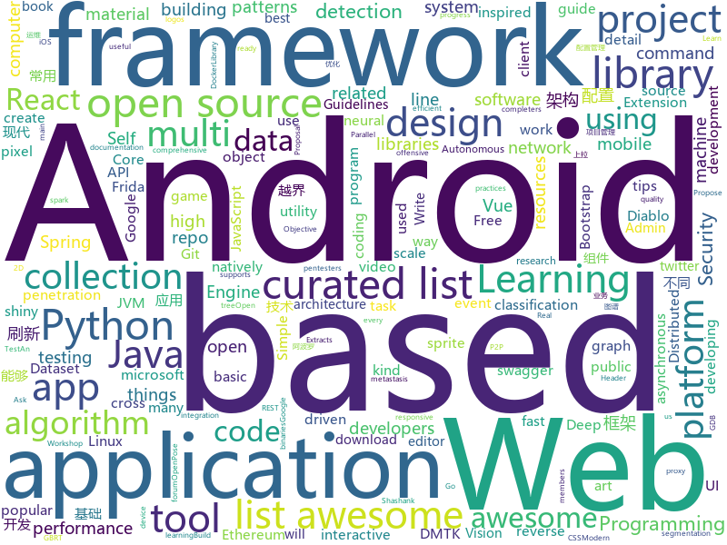

# 2018-06-20
See what the GitHub community is most excited about today.

## python
* [public-apis](https://github.com/toddmotto/public-apis)(**197 stars today**): A collective list of public JSON APIs for use in web development.
* [pytorch_geometric](https://github.com/rusty1s/pytorch_geometric)(**194 stars today**): Geometric Deep Learning Extension Library for PyTorch
* [gif-for-cli](https://github.com/google/gif-for-cli)(**127 stars today**): 
* [models](https://github.com/tensorflow/models)(**78 stars today**): Models and examples built with TensorFlow
* [NCRF](https://github.com/baidu-research/NCRF)(**86 stars today**): Cancer metastasis detection with neural conditional random field (NCRF)
* [SNIPER](https://github.com/mahyarnajibi/SNIPER)(**74 stars today**): SNIPER is an efficient multi-scale object detection algorithm
* [ban-vqa](https://github.com/jnhwkim/ban-vqa)(**75 stars today**): Bilinear attention networks for visual question answering
* [Python-100-Days](https://github.com/jackfrued/Python-100-Days)(**64 stars today**): Python - 100天从新手到大师
* [awesome-python](https://github.com/vinta/awesome-python)(**61 stars today**): A curated list of awesome Python frameworks, libraries, software and resources
* [SuperPointPretrainedNetwork](https://github.com/MagicLeapResearch/SuperPointPretrainedNetwork)(**52 stars today**): 
* [keras](https://github.com/keras-team/keras)(**42 stars today**): Deep Learning for humans
* [robosat](https://github.com/mapbox/robosat)(**47 stars today**): Semantic segmentation on aerial and satellite imagery. Extracts features such as: buildings, parking lots, roads, water
* [CppCoreGuidelines](https://github.com/isocpp/CppCoreGuidelines)(**44 stars today**): The C++ Core Guidelines are a set of tried-and-true guidelines, rules, and best practices about coding in C++
* [Detectron](https://github.com/facebookresearch/Detectron)(**39 stars today**): FAIR's research platform for object detection research, implementing popular algorithms like Mask R-CNN and RetinaNet.
* [frick](https://github.com/iGio90/frick)(**44 stars today**): frick is a kick ass frida cli for reverse engineer inspired by the epic GDB init gef by @hugsy, with commands design similar to uDdbg.
* [mitmproxy](https://github.com/mitmproxy/mitmproxy)(**41 stars today**): An interactive TLS-capable intercepting HTTP proxy for penetration testers and software developers.
* [lemongraph](https://github.com/NationalSecurityAgency/lemongraph)(**38 stars today**): Log-based transactional graph engine
* [youtube-dl](https://github.com/rg3/youtube-dl)(**36 stars today**): Command-line program to download videos from YouTube.com and other video sites
* [flask](https://github.com/pallets/flask)(**32 stars today**): The Python micro framework for building web applications.
* [cpython](https://github.com/python/cpython)(**28 stars today**): The Python programming language
* [house](https://github.com/nccgroup/house)(**36 stars today**): A runtime mobile application analysis toolkit with a Web GUI, powered by Frida, written in Python.
* [detect-secrets](https://github.com/Yelp/detect-secrets)(**34 stars today**): An enterprise friendly way of detecting and preventing secrets in code.
* [system-design-primer](https://github.com/donnemartin/system-design-primer)(**33 stars today**): Learn how to design large-scale systems. Prep for the system design interview. Includes Anki flashcards.
* [django](https://github.com/django/django)(**25 stars today**): The Web framework for perfectionists with deadlines.
* [black](https://github.com/ambv/black)(**32 stars today**): The uncompromising Python code formatter

## java
* [dotsindicator](https://github.com/tommybuonomo/dotsindicator)(**113 stars today**): Three material Dots Indicators for view pagers in Android !
* [talon-for-twitter-android](https://github.com/klinker24/talon-for-twitter-android)(**70 stars today**): The Material Design version of my popular Android Talon for Twitter app, 100% open-source
* [dimens_sw](https://github.com/ladingwu/dimens_sw)(**62 stars today**): Android UI适配方案
* [PlayerBase](https://github.com/jiajunhui/PlayerBase)(**51 stars today**): The basic library of Android player will process complex business components. The access is simple。Android播放器基础库，专注于播放视图组件的高复用性和组件间的低耦合，轻松处理复杂业务。
* [TheGlowingLoader](https://github.com/varunest/TheGlowingLoader)(**51 stars today**): TheGlowingLoader is the highly configurable library to indicate progress and is natively created for Android Platform. It is an implementation of a design composed by Shashank Sahay.
* [tutorials](https://github.com/eugenp/tutorials)(**24 stars today**): The "REST With Spring" Course:
* [spring-boot](https://github.com/spring-projects/spring-boot)(**38 stars today**): Spring Boot
* [java-design-patterns](https://github.com/iluwatar/java-design-patterns)(**38 stars today**): Design patterns implemented in Java
* [RxJava](https://github.com/ReactiveX/RxJava)(**34 stars today**): RxJava – Reactive Extensions for the JVM – a library for composing asynchronous and event-based programs using observable sequences for the Java VM.
* [AndroidUtilCode](https://github.com/Blankj/AndroidUtilCode)(**30 stars today**): 🔥Android developers should collect the following utils(updating).
* [elasticsearch](https://github.com/elastic/elasticsearch)(**25 stars today**): Open Source, Distributed, RESTful Search Engine
* [Dragonfly](https://github.com/alibaba/Dragonfly)(**30 stars today**): Dragonfly is an intelligent P2P based file distribution system.
* [metacat](https://github.com/Netflix/metacat)(**28 stars today**): 
* [incubator-dubbo](https://github.com/apache/incubator-dubbo)(**24 stars today**): Apache Dubbo (incubating) is a high-performance, java based, open source RPC framework.
* [spring-framework](https://github.com/spring-projects/spring-framework)(**23 stars today**): Spring Framework
* [MVPArms](https://github.com/JessYanCoding/MVPArms)(**25 stars today**): A common architecture for Android applications developing based on MVP, integrates many open source projects (like Dagger2、Rxjava、Retrofit ...), to make your developing quicker and easier.
* [vision4j-collection](https://github.com/vision4j/vision4j-collection)(**24 stars today**): Collection of computer vision models, ready to be included in a JVM project
* [vjtools](https://github.com/vipshop/vjtools)(**23 stars today**): The vip.com's java coding standard, libraries and tools
* [ARouter](https://github.com/alibaba/ARouter)(**26 stars today**): 💪A framework for assisting in the renovation of Android componentization
* [apollo](https://github.com/ctripcorp/apollo)(**25 stars today**): Apollo（阿波罗）是携程框架部门研发的分布式配置中心，能够集中化管理应用不同环境、不同集群的配置，配置修改后能够实时推送到应用端，并且具备规范的权限、流程治理等特性，适用于微服务配置管理场景。
* [lottie-android](https://github.com/airbnb/lottie-android)(**24 stars today**): Render After Effects animations natively on Android and iOS, Web, and React Native
* [Java-Interview](https://github.com/crossoverJie/Java-Interview)(**24 stars today**): 👨‍🎓Java related : basic, concurrent, algorithm
* [SmartRefreshLayout](https://github.com/scwang90/SmartRefreshLayout)(**22 stars today**): 🔥下拉刷新、上拉加载、二级刷新、淘宝二楼、RefreshLayout、OverScroll，Android智能下拉刷新框架，支持越界回弹、越界拖动，具有极强的扩展性，集成了几十种炫酷的Header和 Footer。
* [okhttp](https://github.com/square/okhttp)(**23 stars today**): An HTTP+HTTP/2 client for Android and Java applications.
* [netty](https://github.com/netty/netty)(**21 stars today**): Netty project - an event-driven asynchronous network application framework

## unknown
* [openlogos](https://github.com/arasatasaygin/openlogos)(**485 stars today**): Free logos for open source projects
* [architect-awesome](https://github.com/xingshaocheng/architect-awesome)(**425 stars today**): 后端架构师技术图谱
* [awesome-design-patterns](https://github.com/DovAmir/awesome-design-patterns)(**413 stars today**): A curated list of software and architecture related design patterns.
* [Interview-Notebook](https://github.com/CyC2018/Interview-Notebook)(**269 stars today**): 📆准备秋招学习笔记
* [build-your-own-x](https://github.com/danistefanovic/build-your-own-x)(**286 stars today**): 🤓Build your own (insert technology here)
* [technology-talk](https://github.com/aalansehaiyang/technology-talk)(**163 stars today**): 汇总java生态圈常用技术框架、开源中间件，系统架构、项目管理、经典架构案例、数据库、常用三方库、线上运维等知识
* [awesome-online-ide](https://github.com/styfle/awesome-online-ide)(**112 stars today**): 🌩️A list of awesome online development environments
* [Web-Series](https://github.com/wxyyxc1992/Web-Series)(**87 stars today**): 📚现代 Web 开发，现代 Web 开发导论 | 基础篇 | 进阶篇 | 架构优化篇 | React 篇 | Vue 篇
* [awesome](https://github.com/sindresorhus/awesome)(**73 stars today**): 😎Curated list of awesome lists
* [gitignore](https://github.com/github/gitignore)(**55 stars today**): A collection of useful .gitignore templates
* [You-Dont-Know-JS](https://github.com/getify/You-Dont-Know-JS)(**67 stars today**): A book series on JavaScript. @YDKJS on twitter.
* [Penetration-Testing](https://github.com/Kinimiwar/Penetration-Testing)(**60 stars today**): List of awesome penetration testing resources, tools and other shiny things
* [Awesome-Hacking](https://github.com/Hack-with-Github/Awesome-Hacking)(**51 stars today**): A collection of various awesome lists for hackers, pentesters and security researchers
* [vue-patterns](https://github.com/learn-vuejs/vue-patterns)(**51 stars today**): Useful Vue patterns, techniques, tips and tricks and helpful curated links.
* [free-programming-books](https://github.com/EbookFoundation/free-programming-books)(**47 stars today**): 📚Freely available programming books
* [remote](https://github.com/alinebastos/remote)(**45 stars today**): Jobs and Tips for remote work
* [Project-Based-Tutorials-in-C](https://github.com/rby90/Project-Based-Tutorials-in-C)(**42 stars today**): A curated list of project-based tutorials in C
* [awesome-vue](https://github.com/vuejs/awesome-vue)(**41 stars today**): 🎉A curated list of awesome things related to Vue.js
* [awesome-public-datasets](https://github.com/awesomedata/awesome-public-datasets)(**39 stars today**): A topic-centric list of high-quality open datasets in public domains. Propose NEW data ☛☛☛PR☛☛☛
* [awesome-web-security](https://github.com/qazbnm456/awesome-web-security)(**32 stars today**): 🐶A curated list of Web Security materials and resources.
* [awesome-react](https://github.com/enaqx/awesome-react)(**29 stars today**): A collection of awesome things regarding React ecosystem.
* [nocode](https://github.com/kelseyhightower/nocode)(**27 stars today**): The best way to write secure and reliable applications. Write nothing; deploy nowhere.
* [spark-summit-north-america-2018-06](https://github.com/397090770/spark-summit-north-america-2018-06)(**23 stars today**): spark-summit-north-america-2018-06, More detail please visit
* [awesome-cpp](https://github.com/fffaraz/awesome-cpp)(**24 stars today**): A curated list of awesome C++ (or C) frameworks, libraries, resources, and shiny things. Inspired by awesome-... stuff.
* [awesome-interpretable-machine-learning](https://github.com/lopusz/awesome-interpretable-machine-learning)(**24 stars today**): 

## c++
* [devilution](https://github.com/galaxyhaxz/devilution)(**1,636 stars today**): Diablo devolved - magic behind the 1996 computer game
* [LibreSprite](https://github.com/LibreSprite/LibreSprite)(**263 stars today**): Animated sprite editor & pixel art tool -- Fork of the last GPLv2 commit of Aseprite
* [zapcc](https://github.com/yrnkrn/zapcc)(**152 stars today**): zapcc is a caching C++ compiler based on clang, designed to perform faster compilations
* [tensorflow](https://github.com/tensorflow/tensorflow)(**102 stars today**): Computation using data flow graphs for scalable machine learning
* [electron](https://github.com/electron/electron)(**50 stars today**): Build cross platform desktop apps with JavaScript, HTML, and CSS
* [freeablo](https://github.com/wheybags/freeablo)(**53 stars today**): Modern reimplementation of the Diablo 1 game engine
* [bitcoin](https://github.com/bitcoin/bitcoin)(**39 stars today**): Bitcoin Core integration/staging tree
* [opencv](https://github.com/opencv/opencv)(**33 stars today**): Open Source Computer Vision Library
* [aseprite](https://github.com/aseprite/aseprite)(**42 stars today**): Animated sprite editor & pixel art tool (Windows, macOS, Linux)
* [pytorch](https://github.com/pytorch/pytorch)(**33 stars today**): Tensors and Dynamic neural networks in Python with strong GPU acceleration
* [protobuf](https://github.com/google/protobuf)(**29 stars today**): Protocol Buffers - Google's data interchange format
* [grpc](https://github.com/grpc/grpc)(**26 stars today**): The C based gRPC (C++, Python, Ruby, Objective-C, PHP, C#)
* [tesseract](https://github.com/tesseract-ocr/tesseract)(**24 stars today**): Tesseract Open Source OCR Engine (main repository)
* [BOLT](https://github.com/facebookincubator/BOLT)(**25 stars today**): Binary Optimization and Layout Tool - A linux command-line utility used for optimizing performance of binaries
* [ICE-BA](https://github.com/baidu/ICE-BA)(**18 stars today**): 
* [googletest](https://github.com/google/googletest)(**16 stars today**): Google Test
* [apollo](https://github.com/ApolloAuto/apollo)(**15 stars today**): An open autonomous driving platform
* [v8](https://github.com/v8/v8)(**18 stars today**): The official mirror of the V8 Git repository
* [solidity](https://github.com/ethereum/solidity)(**17 stars today**): Solidity, the Contract-Oriented Programming Language
* [cosmos](https://github.com/OpenGenus/cosmos)(**17 stars today**): Algorithms that run our universe | Your personal library of every algorithm and data structure code that you will ever encounter | Ask us anything at our forum
* [openpose](https://github.com/CMU-Perceptual-Computing-Lab/openpose)(**17 stars today**): OpenPose: Real-time multi-person keypoint detection library for body, face, and hands estimation
* [cpp-taskflow](https://github.com/cpp-taskflow/cpp-taskflow)(**17 stars today**): Fast C++ Parallel Programming with Task Dependencies
* [godot](https://github.com/godotengine/godot)(**15 stars today**): Godot Engine – Multi-platform 2D and 3D game engine
* [aria2](https://github.com/aria2/aria2)(**16 stars today**): aria2 is a lightweight multi-protocol & multi-source, cross platform download utility operated in command-line. It supports HTTP/HTTPS, FTP, SFTP, BitTorrent and Metalink.
* [LightGBM](https://github.com/Microsoft/LightGBM)(**13 stars today**): A fast, distributed, high performance gradient boosting (GBDT, GBRT, GBM or MART) framework based on decision tree algorithms, used for ranking, classification and many other machine learning tasks. It is under the umbrella of the DMTK(http://github.com/microsoft/dmtk) project of Microsoft.

## html
* [ice-linkedin](https://github.com/antiboredom/ice-linkedin)(**49 stars today**): Dataset of LinkedIn members who work for ICE
* [owasp-mstg](https://github.com/OWASP/owasp-mstg)(**52 stars today**): The Mobile Security Testing Guide (MSTG) is a comprehensive manual for mobile app security testing and reverse engineering.
* [Winds](https://github.com/GetStream/Winds)(**47 stars today**): A Beautiful Open Source RSS & Podcast App
* [styleguide](https://github.com/google/styleguide)(**25 stars today**): Style guides for Google-originated open-source projects
* [interactive-machine-learning-list](https://github.com/stared/interactive-machine-learning-list)(**25 stars today**): A collaborative list of interactive Machine Learning, Deep Learning and Stats websites
* [CLRS](https://github.com/walkccc/CLRS)(**24 stars today**): Solutions to Introduction to Algorithms Third Edition
* [sapper-studio](https://github.com/sveltejs/sapper-studio)(**24 stars today**): An electron app for building Sapper projects
* [awesome-mac](https://github.com/jaywcjlove/awesome-mac)(**21 stars today**):  This repo is a collection of awesome Mac applications and tools for developers and designers.
* [AdminLTE](https://github.com/almasaeed2010/AdminLTE)(**15 stars today**): AdminLTE - Free Premium Admin control Panel Theme Based On Bootstrap 3.x
* [Spoon-Knife](https://github.com/octocat/Spoon-Knife)(****): This repo is for demonstration purposes only.
* [PhishingPretexts](https://github.com/L4bF0x/PhishingPretexts)(**15 stars today**): A library of pretexts to use on offensive phishing engagements.
* [swagger-codegen](https://github.com/swagger-api/swagger-codegen)(**10 stars today**): swagger-codegen contains a template-driven engine to generate documentation, API clients and server stubs in different languages by parsing your OpenAPI / Swagger definition.
* [gentelella](https://github.com/puikinsh/gentelella)(**13 stars today**): Free Bootstrap 3 Admin Template
* [learning-area](https://github.com/mdn/learning-area)(**6 stars today**): Github repo for the MDN Learning Area.
* [portainer](https://github.com/portainer/portainer)(**13 stars today**): Simple management UI for Docker
* [fastText](https://github.com/facebookresearch/fastText)(**12 stars today**): Library for fast text representation and classification.
* [go101](https://github.com/go101/go101)(**12 stars today**): A book focusing on Go syntax/semantics and all kinds of details.
* [phantomjs](https://github.com/ariya/phantomjs)(**10 stars today**): Scriptable Headless Browser
* [foundation-sites](https://github.com/zurb/foundation-sites)(**9 stars today**): The most advanced responsive front-end framework in the world. Quickly create prototypes and production code for sites that work on any kind of device.
* [react-app-rewired](https://github.com/timarney/react-app-rewired)(**10 stars today**): Override create-react-app webpack configs without ejecting
* [patchwork](https://github.com/jlord/patchwork)(****): All the Git-it Workshop completers!
* [EIPs](https://github.com/ethereum/EIPs)(**8 stars today**): The Ethereum Improvement Proposal repository
* [polymer](https://github.com/Polymer/polymer)(**9 stars today**): Build modern apps using web components
* [artonomous](https://github.com/simondlr/artonomous)(**10 stars today**): A Self-Owning, Self-Sustaining, Self-Improving Autonomous Artist Using the Ethereum Blockchain
* [Blot](https://github.com/davidmerfield/Blot)(**9 stars today**): Turns a folder into a website

## WordCloud

