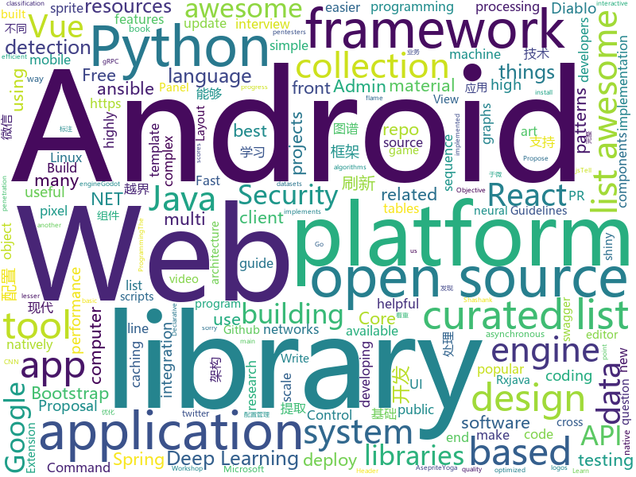

# 2018-06-21
See what the GitHub community is most excited about today.

## python
* [public-apis](https://github.com/toddmotto/public-apis)(**296 stars today**): A collective list of public JSON APIs for use in web development.
* [vibora](https://github.com/vibora-io/vibora)(**246 stars today**): Fast, asynchronous and sexy Python web framework.
* [models](https://github.com/tensorflow/models)(**75 stars today**): Models and examples built with TensorFlow
* [pytorch_geometric](https://github.com/rusty1s/pytorch_geometric)(**82 stars today**): Geometric Deep Learning Extension Library for PyTorch
* [Python-100-Days](https://github.com/jackfrued/Python-100-Days)(**79 stars today**): Python - 100天从新手到大师
* [keras](https://github.com/keras-team/keras)(**57 stars today**): Deep Learning for humans
* [awesome-python](https://github.com/vinta/awesome-python)(**61 stars today**): A curated list of awesome Python frameworks, libraries, software and resources
* [SuperPointPretrainedNetwork](https://github.com/MagicLeapResearch/SuperPointPretrainedNetwork)(**56 stars today**): 
* [Detectron](https://github.com/facebookresearch/Detectron)(**49 stars today**): FAIR's research platform for object detection research, implementing popular algorithms like Mask R-CNN and RetinaNet.
* [SNIPER](https://github.com/mahyarnajibi/SNIPER)(**49 stars today**): SNIPER is an efficient multi-scale object detection algorithm
* [NCRF](https://github.com/baidu-research/NCRF)(**49 stars today**): Cancer metastasis detection with neural conditional random field (NCRF)
* [youtube-dl](https://github.com/rg3/youtube-dl)(**47 stars today**): Command-line program to download videos from YouTube.com and other video sites
* [ban-vqa](https://github.com/jnhwkim/ban-vqa)(**38 stars today**): Bilinear attention networks for visual question answering
* [magic-wormhole](https://github.com/warner/magic-wormhole)(**40 stars today**): get things from one computer to another, safely
* [apex](https://github.com/NVIDIA/apex)(**39 stars today**): A PyTorch Extension
* [programming-talks](https://github.com/hellerve/programming-talks)(**38 stars today**): Awesome & Interesting Talks concerning Programming
* [gif-for-cli](https://github.com/google/gif-for-cli)(**38 stars today**): 
* [django](https://github.com/django/django)(**27 stars today**): The Web framework for perfectionists with deadlines.
* [wtfpython](https://github.com/satwikkansal/wtfpython)(**32 stars today**): A collection of surprising Python snippets and lesser-known features.
* [footballNotifier](https://github.com/c-mnzs/footballNotifier)(**35 stars today**): A Python application that sends you a SMS when the football team you support scores.
* [system-design-primer](https://github.com/donnemartin/system-design-primer)(**30 stars today**): Learn how to design large-scale systems. Prep for the system design interview. Includes Anki flashcards.
* [ansible](https://github.com/ansible/ansible)(**26 stars today**): Ansible is a radically simple IT automation platform that makes your applications and systems easier to deploy. Avoid writing scripts or custom code to deploy and update your applications — automate in a language that approaches plain English, using SSH, with no agents to install on remote systems. https://docs.ansible.com/ansible/
* [flask](https://github.com/pallets/flask)(**28 stars today**): The Python micro framework for building web applications.
* [CppCoreGuidelines](https://github.com/isocpp/CppCoreGuidelines)(**29 stars today**): The C++ Core Guidelines are a set of tried-and-true guidelines, rules, and best practices about coding in C++
* [black](https://github.com/ambv/black)(**28 stars today**): The uncompromising Python code formatter

## java
* [epoxy](https://github.com/airbnb/epoxy)(**136 stars today**): Epoxy is an Android library for building complex screens in a RecyclerView
* [dotsindicator](https://github.com/tommybuonomo/dotsindicator)(**132 stars today**): Three material Dots Indicators for view pagers in Android !
* [ballerina-lang](https://github.com/ballerina-platform/ballerina-lang)(**126 stars today**): Ballerina is a new programming language for integration built on a sequence diagram metaphor.
* [react-native-gesture-handler](https://github.com/kmagiera/react-native-gesture-handler)(**63 stars today**): Declarative API exposing platform native touch and gesture system to React Native.
* [spring-boot](https://github.com/spring-projects/spring-boot)(**48 stars today**): Spring Boot
* [TheGlowingLoader](https://github.com/varunest/TheGlowingLoader)(**49 stars today**): TheGlowingLoader is the highly configurable library to indicate progress and is natively created for Android Platform. It is an implementation of a design composed by Shashank Sahay.
* [tutorials](https://github.com/eugenp/tutorials)(**31 stars today**): The "REST With Spring" Course:
* [dimens_sw](https://github.com/ladingwu/dimens_sw)(**45 stars today**): Android UI适配方案
* [java-design-patterns](https://github.com/iluwatar/java-design-patterns)(**37 stars today**): Design patterns implemented in Java
* [incubator-dubbo](https://github.com/apache/incubator-dubbo)(**28 stars today**): Apache Dubbo (incubating) is a high-performance, java based, open source RPC framework.
* [apollo](https://github.com/ctripcorp/apollo)(**28 stars today**): Apollo（阿波罗）是携程框架部门研发的分布式配置中心，能够集中化管理应用不同环境、不同集群的配置，配置修改后能够实时推送到应用端，并且具备规范的权限、流程治理等特性，适用于微服务配置管理场景。
* [spring-framework](https://github.com/spring-projects/spring-framework)(**30 stars today**): Spring Framework
* [AndroidUtilCode](https://github.com/Blankj/AndroidUtilCode)(**27 stars today**): 🔥Android developers should collect the following utils(updating).
* [SmartRefreshLayout](https://github.com/scwang90/SmartRefreshLayout)(**30 stars today**): 🔥下拉刷新、上拉加载、二级刷新、淘宝二楼、RefreshLayout、OverScroll，Android智能下拉刷新框架，支持越界回弹、越界拖动，具有极强的扩展性，集成了几十种炫酷的Header和 Footer。
* [jmc-flame-view](https://github.com/thegreystone/jmc-flame-view)(**31 stars today**): View for Mission Control for rendering stack traces as flame graphs.
* [RxJava](https://github.com/ReactiveX/RxJava)(**28 stars today**): RxJava – Reactive Extensions for the JVM – a library for composing asynchronous and event-based programs using observable sequences for the Java VM.
* [PlayerBase](https://github.com/jiajunhui/PlayerBase)(**27 stars today**): The basic library of Android player will process complex business components. The access is simple。Android播放器基础库，专注于播放视图组件的高复用性和组件间的低耦合，轻松处理复杂业务。
* [vjtools](https://github.com/vipshop/vjtools)(**25 stars today**): The vip.com's java coding standard, libraries and tools
* [MVPArms](https://github.com/JessYanCoding/MVPArms)(**23 stars today**): A common architecture for Android applications developing based on MVP, integrates many open source projects (like Dagger2、Rxjava、Retrofit ...), to make your developing quicker and easier.
* [talon-for-twitter-android](https://github.com/klinker24/talon-for-twitter-android)(**24 stars today**): The Material Design version of my popular Android Talon for Twitter app, 100% open-source
* [HanLP](https://github.com/hankcs/HanLP)(**24 stars today**): 自然语言处理 中文分词 词性标注 命名实体识别 依存句法分析 关键词提取 新词发现 短语提取 自动摘要 文本分类 拼音简繁
* [retrofit](https://github.com/square/retrofit)(**23 stars today**): Type-safe HTTP client for Android and Java by Square, Inc.
* [lottie-android](https://github.com/airbnb/lottie-android)(**23 stars today**): Render After Effects animations natively on Android and iOS, Web, and React Native
* [glide](https://github.com/bumptech/glide)(**24 stars today**): An image loading and caching library for Android focused on smooth scrolling
* [weixin-java-tools](https://github.com/Wechat-Group/weixin-java-tools)(**23 stars today**): 可能是目前最好最全的微信Java开发工具包，支持包括微信支付、开放平台、小程序、企业号和公众号等的开发

## unknown
* [openlogos](https://github.com/arasatasaygin/openlogos)(**632 stars today**): Free logos for open source projects
* [architect-awesome](https://github.com/xingshaocheng/architect-awesome)(**350 stars today**): 后端架构师技术图谱
* [Interview-Notebook](https://github.com/CyC2018/Interview-Notebook)(**271 stars today**): 📆准备秋招学习笔记
* [awesome-design-patterns](https://github.com/DovAmir/awesome-design-patterns)(**280 stars today**): A curated list of software and architecture related design patterns.
* [Web-Series](https://github.com/wxyyxc1992/Web-Series)(**266 stars today**): 📚现代 Web 开发，现代 Web 开发导论 | 基础篇 | 进阶篇 | 架构优化篇 | React 篇 | Vue 篇
* [build-your-own-x](https://github.com/danistefanovic/build-your-own-x)(**243 stars today**): 🤓Build your own (insert technology here)
* [awesome](https://github.com/sindresorhus/awesome)(**89 stars today**): 😎Curated list of awesome lists
* [gitignore](https://github.com/github/gitignore)(**62 stars today**): A collection of useful .gitignore templates
* [debugging-stories](https://github.com/danluu/debugging-stories)(**80 stars today**): A collection of debugging stories. PRs welcome (sorry for the backlog) :-)
* [free-programming-books](https://github.com/EbookFoundation/free-programming-books)(**56 stars today**): 📚Freely available programming books
* [cpp20_in_TTs](https://github.com/tvaneerd/cpp20_in_TTs)(**56 stars today**): C++20 features described in Before/After tables ("Tony Tables")
* [Penetration-Testing](https://github.com/Kinimiwar/Penetration-Testing)(**46 stars today**): List of awesome penetration testing resources, tools and other shiny things
* [awesome-vue](https://github.com/vuejs/awesome-vue)(**48 stars today**): 🎉A curated list of awesome things related to Vue.js
* [microsoft-drop-ice](https://github.com/selfagency/microsoft-drop-ice)(**35 stars today**): Tell Microsoft to drop ICE as a client or lose us as Github users
* [awesome-flutter](https://github.com/Solido/awesome-flutter)(**36 stars today**): An awesome list that curates the best Flutter libraries, tools, tutorials, articles and more.
* [kubernetes-the-hard-way](https://github.com/kelseyhightower/kubernetes-the-hard-way)(**35 stars today**): Bootstrap Kubernetes the hard way on Google Cloud Platform. No scripts.
* [nocode](https://github.com/kelseyhightower/nocode)(**32 stars today**): The best way to write secure and reliable applications. Write nothing; deploy nowhere.
* [Awesome-Hacking](https://github.com/Hack-with-Github/Awesome-Hacking)(**30 stars today**): A collection of various awesome lists for hackers, pentesters and security researchers
* [awesome-nlp](https://github.com/keon/awesome-nlp)(**24 stars today**): 📖A curated list of resources dedicated to Natural Language Processing (NLP)
* [awesome-public-datasets](https://github.com/awesomedata/awesome-public-datasets)(**22 stars today**): A topic-centric list of high-quality open datasets in public domains. Propose NEW data ☛☛☛PR☛☛☛
* [awesome-cpp](https://github.com/fffaraz/awesome-cpp)(**23 stars today**): A curated list of awesome C++ (or C) frameworks, libraries, resources, and shiny things. Inspired by awesome-... stuff.
* [Front-end-Developer-Interview-Questions](https://github.com/h5bp/Front-end-Developer-Interview-Questions)(**20 stars today**): A list of helpful front-end related questions you can use to interview potential candidates, test yourself or completely ignore.
* [awesome-web-security](https://github.com/qazbnm456/awesome-web-security)(**22 stars today**): 🐶A curated list of Web Security materials and resources.
* [awesome-interpretable-machine-learning](https://github.com/lopusz/awesome-interpretable-machine-learning)(**22 stars today**): 
* [vue-patterns](https://github.com/learn-vuejs/vue-patterns)(**20 stars today**): Useful Vue patterns, techniques, tips and tricks and helpful curated links.

## c++
* [devilution](https://github.com/galaxyhaxz/devilution)(**932 stars today**): Diablo devolved - magic behind the 1996 computer game
* [BOLT](https://github.com/facebookincubator/BOLT)(**300 stars today**): Binary Optimization and Layout Tool - A linux command-line utility used for optimizing performance of binaries
* [DALI](https://github.com/NVIDIA/DALI)(**160 stars today**): A library containing both highly optimized building blocks and an execution engine for data pre-processing in deep learning applications
* [tensorflow](https://github.com/tensorflow/tensorflow)(**100 stars today**): Computation using data flow graphs for scalable machine learning
* [synergy-core](https://github.com/symless/synergy-core)(**80 stars today**): Open source core of Synergy, the keyboard and mouse sharing tool
* [LibreSprite](https://github.com/LibreSprite/LibreSprite)(**77 stars today**): Animated sprite editor & pixel art tool -- Fork of the last GPLv2 commit of Aseprite
* [yoga](https://github.com/facebook/yoga)(**69 stars today**): Yoga is a cross-platform layout engine which implements Flexbox. Follow https://twitter.com/yogalayout for updates.
* [zapcc](https://github.com/yrnkrn/zapcc)(**63 stars today**): zapcc is a caching C++ compiler based on clang, designed to perform faster compilations
* [electron](https://github.com/electron/electron)(**55 stars today**): Build cross platform desktop apps with JavaScript, HTML, and CSS
* [protobuf](https://github.com/google/protobuf)(**50 stars today**): Protocol Buffers - Google's data interchange format
* [ICE-BA](https://github.com/baidu/ICE-BA)(**41 stars today**): 
* [opencv](https://github.com/opencv/opencv)(**31 stars today**): Open Source Computer Vision Library
* [CMONGO](https://github.com/Tencent/CMONGO)(**45 stars today**): MongoDB for Tencent Cloud
* [tesseract](https://github.com/tesseract-ocr/tesseract)(**39 stars today**): Tesseract Open Source OCR Engine (main repository)
* [bitcoin](https://github.com/bitcoin/bitcoin)(**32 stars today**): Bitcoin Core integration/staging tree
* [pytorch](https://github.com/pytorch/pytorch)(**30 stars today**): Tensors and Dynamic neural networks in Python with strong GPU acceleration
* [freeablo](https://github.com/wheybags/freeablo)(**30 stars today**): Modern reimplementation of the Diablo 1 game engine
* [PacVim](https://github.com/jmoon018/PacVim)(**26 stars today**): 
* [godot](https://github.com/godotengine/godot)(**23 stars today**): Godot Engine – Multi-platform 2D and 3D game engine
* [openpose](https://github.com/CMU-Perceptual-Computing-Lab/openpose)(**19 stars today**): OpenPose: Real-time multi-person keypoint detection library for body, face, and hands estimation
* [aseprite](https://github.com/aseprite/aseprite)(**23 stars today**): Animated sprite editor & pixel art tool (Windows, macOS, Linux)
* [barrier](https://github.com/debauchee/barrier)(**20 stars today**): Open-source KVM software
* [envoy](https://github.com/envoyproxy/envoy)(**20 stars today**): C++ front/service proxy
* [DeepSpeech](https://github.com/mozilla/DeepSpeech)(**18 stars today**): A TensorFlow implementation of Baidu's DeepSpeech architecture
* [grpc](https://github.com/grpc/grpc)(**16 stars today**): The C based gRPC (C++, Python, Ruby, Objective-C, PHP, C#)

## html
* [knowledge](https://github.com/f2e-awesome/knowledge)(**57 stars today**): 文档着重构建一个完整的「前端技术架构图谱」，方便 F2E 学习与进阶。
* [async-local-storage](https://github.com/domenic/async-local-storage)(**55 stars today**): A proposal for an async local storage API for the web
* [Winds](https://github.com/GetStream/Winds)(**41 stars today**): A Beautiful Open Source RSS & Podcast App
* [styleguide](https://github.com/google/styleguide)(**27 stars today**): Style guides for Google-originated open-source projects
* [AdminLTE](https://github.com/almasaeed2010/AdminLTE)(**18 stars today**): AdminLTE - Free Premium Admin control Panel Theme Based On Bootstrap 3.x
* [fastText](https://github.com/facebookresearch/fastText)(**18 stars today**): Library for fast text representation and classification.
* [owasp-mstg](https://github.com/OWASP/owasp-mstg)(**19 stars today**): The Mobile Security Testing Guide (MSTG) is a comprehensive manual for mobile app security testing and reverse engineering.
* [Spoon-Knife](https://github.com/octocat/Spoon-Knife)(****): This repo is for demonstration purposes only.
* [gentelella](https://github.com/puikinsh/gentelella)(**15 stars today**): Free Bootstrap 3 Admin Template
* [awesome-mac](https://github.com/jaywcjlove/awesome-mac)(**15 stars today**):  This repo is a collection of awesome Mac applications and tools for developers and designers.
* [EIPs](https://github.com/ethereum/EIPs)(**13 stars today**): The Ethereum Improvement Proposal repository
* [Minimal-Notes](https://github.com/vladocar/Minimal-Notes)(**14 stars today**): Minimal Notes web app build with Vue.js
* [portainer](https://github.com/portainer/portainer)(**13 stars today**): Simple management UI for Docker
* [go101](https://github.com/go101/go101)(**13 stars today**): A book focusing on Go syntax/semantics and all kinds of details.
* [swagger-codegen](https://github.com/swagger-api/swagger-codegen)(**9 stars today**): swagger-codegen contains a template-driven engine to generate documentation, API clients and server stubs in different languages by parsing your OpenAPI / Swagger definition.
* [interactive-machine-learning-list](https://github.com/stared/interactive-machine-learning-list)(**11 stars today**): A collaborative list of interactive Machine Learning, Deep Learning and Stats websites
* [sapper-studio](https://github.com/sveltejs/sapper-studio)(**10 stars today**): An electron app for building Sapper projects
* [react-app-rewired](https://github.com/timarney/react-app-rewired)(**9 stars today**): Override create-react-app webpack configs without ejecting
* [PhishingPretexts](https://github.com/L4bF0x/PhishingPretexts)(**9 stars today**): A library of pretexts to use on offensive phishing engagements.
* [fonts](https://github.com/google/fonts)(**9 stars today**): Font files available from Google Fonts
* [primeng](https://github.com/primefaces/primeng)(**9 stars today**): UI Components for Angular
* [patchwork](https://github.com/jlord/patchwork)(****): All the Git-it Workshop completers!
* [ng-alain](https://github.com/cipchk/ng-alain)(**8 stars today**): ng-zorro-antd admin panel front-end framework
* [dotnet](https://github.com/Microsoft/dotnet)(**6 stars today**): This repo is the official home of .NET on GitHub. It's a great starting point to find many .NET OSS projects from Microsoft and the community, including many that are part of the .NET Foundation.
* [phantomjs](https://github.com/ariya/phantomjs)(**7 stars today**): Scriptable Headless Browser

## WordCloud

