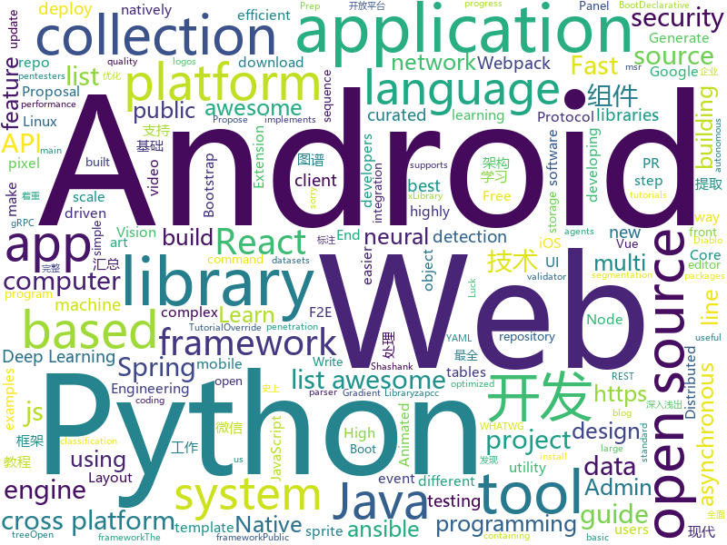

# 2018-06-22
See what the GitHub community is most excited about today.

## python
* [vibora](https://github.com/vibora-io/vibora)(**663 stars today**): Fast, asynchronous and sexy Python web framework.
* [learn_math_fast](https://github.com/llSourcell/learn_math_fast)(**297 stars today**): This is the Curriculum for "How to Learn Mathematics Fast" By Siraj Raval on Youtube
* [decaNLP](https://github.com/salesforce/decaNLP)(**265 stars today**): The Natural Language Decathlon: A Multitask Challenge for NLP
* [public-apis](https://github.com/toddmotto/public-apis)(**135 stars today**): A collective list of public JSON APIs for use in web development.
* [models](https://github.com/tensorflow/models)(**66 stars today**): Models and examples built with TensorFlow
* [strictyaml](https://github.com/crdoconnor/strictyaml)(**85 stars today**): Type-safe YAML parser and validator.
* [NCRF](https://github.com/baidu-research/NCRF)(**63 stars today**): Cancer metastasis detection with neural conditional random field (NCRF)
* [Python-100-Days](https://github.com/jackfrued/Python-100-Days)(**57 stars today**): Python - 100天从新手到大师
* [keras](https://github.com/keras-team/keras)(**46 stars today**): Deep Learning for humans
* [awesome-python](https://github.com/vinta/awesome-python)(**44 stars today**): A curated list of awesome Python frameworks, libraries, software and resources
* [SNIPER](https://github.com/mahyarnajibi/SNIPER)(**49 stars today**): SNIPER is an efficient multi-scale object detection algorithm
* [youtube-dl](https://github.com/rg3/youtube-dl)(**48 stars today**): Command-line program to download videos from YouTube.com and other video sites
* [django](https://github.com/django/django)(**36 stars today**): The Web framework for perfectionists with deadlines.
* [flask](https://github.com/pallets/flask)(**39 stars today**): The Python micro framework for building web applications.
* [ansible](https://github.com/ansible/ansible)(**28 stars today**): Ansible is a radically simple IT automation platform that makes your applications and systems easier to deploy. Avoid writing scripts or custom code to deploy and update your applications — automate in a language that approaches plain English, using SSH, with no agents to install on remote systems. https://docs.ansible.com/ansible/
* [requests](https://github.com/requests/requests)(**35 stars today**): Python HTTP Requests for Humans™✨🍰✨
* [ignite](https://github.com/pytorch/ignite)(**35 stars today**): High-level library to help with training neural networks in PyTorch
* [gif-for-cli](https://github.com/google/gif-for-cli)(**32 stars today**): 
* [wtfpython](https://github.com/satwikkansal/wtfpython)(**30 stars today**): A collection of surprising Python snippets and lesser-known features.
* [system-design-primer](https://github.com/donnemartin/system-design-primer)(**26 stars today**): Learn how to design large-scale systems. Prep for the system design interview. Includes Anki flashcards.
* [SuperPointPretrainedNetwork](https://github.com/MagicLeapResearch/SuperPointPretrainedNetwork)(**27 stars today**): 
* [pytorch_geometric](https://github.com/rusty1s/pytorch_geometric)(**28 stars today**): Geometric Deep Learning Extension Library for PyTorch
* [Mask_RCNN](https://github.com/matterport/Mask_RCNN)(**22 stars today**): Mask R-CNN for object detection and instance segmentation on Keras and TensorFlow
* [boxx](https://github.com/DIYer22/boxx)(**29 stars today**): Tool-box for efficient build and debug in Python. Especially for Scientific Computing and Computer Vision.
* [scikit-learn](https://github.com/scikit-learn/scikit-learn)(**24 stars today**): scikit-learn: machine learning in Python

## java
* [SaveState](https://github.com/PrototypeZ/SaveState)(**117 stars today**): 🍦Generate 'onSaveInstanceState' and 'onRestoreInstanceState' methods for your application automatically
* [epoxy](https://github.com/airbnb/epoxy)(**89 stars today**): Epoxy is an Android library for building complex screens in a RecyclerView
* [CC](https://github.com/luckybilly/CC)(**75 stars today**): 业界首个支持渐进式组件化改造的Android组件化开源框架。Gradually componentize your android project.
* [dotsindicator](https://github.com/tommybuonomo/dotsindicator)(**64 stars today**): Three material Dots Indicators for view pagers in Android !
* [spring-boot](https://github.com/spring-projects/spring-boot)(**45 stars today**): Spring Boot
* [react-native-gesture-handler](https://github.com/kmagiera/react-native-gesture-handler)(**53 stars today**): Declarative API exposing platform native touch and gesture system to React Native.
* [tutorials](https://github.com/eugenp/tutorials)(**34 stars today**): The "REST With Spring" Course:
* [ballerina-lang](https://github.com/ballerina-platform/ballerina-lang)(**46 stars today**): Ballerina is a new programming language for integration built on a sequence diagram metaphor.
* [HanLP](https://github.com/hankcs/HanLP)(**37 stars today**): 自然语言处理 中文分词 词性标注 命名实体识别 依存句法分析 关键词提取 新词发现 短语提取 自动摘要 文本分类 拼音简繁
* [elasticsearch](https://github.com/elastic/elasticsearch)(**32 stars today**): Open Source, Distributed, RESTful Search Engine
* [RxJava](https://github.com/ReactiveX/RxJava)(**34 stars today**): RxJava – Reactive Extensions for the JVM – a library for composing asynchronous and event-based programs using observable sequences for the Java VM.
* [CommonDevKnowledge](https://github.com/AweiLoveAndroid/CommonDevKnowledge)(**33 stars today**): 🔥史上最全的BAT大厂Android面试题汇集，以及常用的Android开发的一些技能点，冷门知识点汇总，开发中遇到的坑汇总等干货。
* [TheGlowingLoader](https://github.com/varunest/TheGlowingLoader)(**33 stars today**): TheGlowingLoader is the highly configurable library to indicate progress and is natively created for Android Platform. It is an implementation of a design composed by Shashank Sahay.
* [AndroidUtilCode](https://github.com/Blankj/AndroidUtilCode)(**29 stars today**): 🔥Android developers should collect the following utils(updating).
* [vjtools](https://github.com/vipshop/vjtools)(**30 stars today**): The vip.com's java coding standard, libraries and tools
* [spring-boot-examples](https://github.com/ityouknow/spring-boot-examples)(**29 stars today**): about learning Spring Boot via examples. Spring Boot 技术栈示例代码，快速简单上手教程。
* [lottie-android](https://github.com/airbnb/lottie-android)(**29 stars today**): Render After Effects animations natively on Android and iOS, Web, and React Native
* [dimens_sw](https://github.com/ladingwu/dimens_sw)(**28 stars today**): Android UI适配方案
* [okhttp](https://github.com/square/okhttp)(**28 stars today**): An HTTP+HTTP/2 client for Android and Java applications.
* [weixin-java-tools](https://github.com/Wechat-Group/weixin-java-tools)(**26 stars today**): 可能是目前最好最全的微信Java开发工具包，支持包括微信支付、开放平台、小程序、企业号和公众号等的开发
* [netty](https://github.com/netty/netty)(**23 stars today**): Netty project - an event-driven asynchronous network application framework
* [PlayerBase](https://github.com/jiajunhui/PlayerBase)(**25 stars today**): The basic library of Android player will process complex business components. The access is simple。Android播放器基础库，专注于播放视图组件的高复用性和组件间的低耦合，轻松处理复杂业务。
* [hmily](https://github.com/yu199195/hmily)(**25 stars today**): TCC分布式事务框架(try,confirm,cancel)
* [MVPArms](https://github.com/JessYanCoding/MVPArms)(**25 stars today**): A common architecture for Android applications developing based on MVP, integrates many open source projects (like Dagger2、Rxjava、Retrofit ...), to make your developing quicker and easier.
* [javamelody](https://github.com/javamelody/javamelody)(**24 stars today**): JavaMelody : monitoring of JavaEE applications

## unknown
* [openlogos](https://github.com/arasatasaygin/openlogos)(**336 stars today**): Free logos for open source projects
* [toml](https://github.com/toml-lang/toml)(**212 stars today**): Tom's Obvious, Minimal Language
* [Web-Series](https://github.com/wxyyxc1992/Web-Series)(**176 stars today**): 📚现代 Web 开发，现代 Web 开发导论 | 基础篇 | 进阶篇 | 架构优化篇 | React 篇 | Vue 篇
* [architect-awesome](https://github.com/xingshaocheng/architect-awesome)(**158 stars today**): 后端架构师技术图谱
* [microsoft-drop-ice](https://github.com/selfagency/microsoft-drop-ice)(**138 stars today**): Tell Microsoft to drop ICE as a client or lose us as Github users
* [build-your-own-x](https://github.com/danistefanovic/build-your-own-x)(**153 stars today**): 🤓Build your own (insert technology here)
* [Interview-Notebook](https://github.com/CyC2018/Interview-Notebook)(**123 stars today**): 📆准备秋招学习笔记
* [developer-roadmap-chinese](https://github.com/goodjack/developer-roadmap-chinese)(**99 stars today**): 2018 年成為 Web 開發人員的路線圖
* [react-native-at-airbnb-jp-translation](https://github.com/react-native-jp/react-native-at-airbnb-jp-translation)(**80 stars today**): 
* [gitignore](https://github.com/github/gitignore)(**60 stars today**): A collection of useful .gitignore templates
* [awesome](https://github.com/sindresorhus/awesome)(**67 stars today**): 😎Curated list of awesome lists
* [awesome-flutter](https://github.com/Solido/awesome-flutter)(**56 stars today**): An awesome list that curates the best Flutter libraries, tools, tutorials, articles and more.
* [coding-interview-university](https://github.com/jwasham/coding-interview-university)(**46 stars today**): A complete computer science study plan to become a software engineer.
* [free-programming-books](https://github.com/EbookFoundation/free-programming-books)(**43 stars today**): 📚Freely available programming books
* [awesome-vue](https://github.com/vuejs/awesome-vue)(**44 stars today**): 🎉A curated list of awesome things related to Vue.js
* [cpp20_in_TTs](https://github.com/tvaneerd/cpp20_in_TTs)(**36 stars today**): C++20 features described in Before/After tables ("Tony Tables")
* [nocode](https://github.com/kelseyhightower/nocode)(**32 stars today**): The best way to write secure and reliable applications. Write nothing; deploy nowhere.
* [Penetration-Testing](https://github.com/Kinimiwar/Penetration-Testing)(**25 stars today**): List of awesome penetration testing resources, tools and other shiny things
* [Awesome-Hacking](https://github.com/Hack-with-Github/Awesome-Hacking)(**26 stars today**): A collection of various awesome lists for hackers, pentesters and security researchers
* [awesome-public-datasets](https://github.com/awesomedata/awesome-public-datasets)(**25 stars today**): A topic-centric list of high-quality open datasets in public domains. Propose NEW data ☛☛☛PR☛☛☛
* [awesome-nodejs](https://github.com/sindresorhus/awesome-nodejs)(**25 stars today**): ⚡️Delightful Node.js packages and resources
* [android-architecture](https://github.com/googlesamples/android-architecture)(**20 stars today**): A collection of samples to discuss and showcase different architectural tools and patterns for Android apps.
* [GLWTPL](https://github.com/me-shaon/GLWTPL)(**23 stars today**): "Good Luck With That" Public License
* [debugging-stories](https://github.com/danluu/debugging-stories)(**24 stars today**): A collection of debugging stories. PRs welcome (sorry for the backlog) :-)
* [programmer-job-blacklist](https://github.com/shengxinjing/programmer-job-blacklist)(**22 stars today**): 🙈程序员找工作黑名单，换工作和当技术合伙人需谨慎啊

## c++
* [devilution](https://github.com/galaxyhaxz/devilution)(**715 stars today**): Diablo devolved - magic behind the 1996 computer game
* [BOLT](https://github.com/facebookincubator/BOLT)(**253 stars today**): Binary Optimization and Layout Tool - A linux command-line utility used for optimizing performance of binaries
* [tensorflow](https://github.com/tensorflow/tensorflow)(**103 stars today**): Computation using data flow graphs for scalable machine learning
* [synergy-core](https://github.com/symless/synergy-core)(**126 stars today**): Open source core of Synergy, the keyboard and mouse sharing tool
* [DALI](https://github.com/NVIDIA/DALI)(**93 stars today**): A library containing both highly optimized building blocks and an execution engine for data pre-processing in deep learning applications
* [electron](https://github.com/electron/electron)(**59 stars today**): Build cross platform desktop apps with JavaScript, HTML, and CSS
* [barrier](https://github.com/debauchee/barrier)(**59 stars today**): Open-source KVM software
* [tesseract](https://github.com/tesseract-ocr/tesseract)(**45 stars today**): Tesseract Open Source OCR Engine (main repository)
* [protobuf](https://github.com/google/protobuf)(**32 stars today**): Protocol Buffers - Google's data interchange format
* [bitcoin](https://github.com/bitcoin/bitcoin)(**27 stars today**): Bitcoin Core integration/staging tree
* [opencv](https://github.com/opencv/opencv)(**21 stars today**): Open Source Computer Vision Library
* [zapcc](https://github.com/yrnkrn/zapcc)(**32 stars today**): zapcc is a caching C++ compiler based on clang, designed to perform faster compilations
* [yoga](https://github.com/facebook/yoga)(**31 stars today**): Yoga is a cross-platform layout engine which implements Flexbox. Follow https://twitter.com/yogalayout for updates.
* [pytorch](https://github.com/pytorch/pytorch)(**23 stars today**): Tensors and Dynamic neural networks in Python with strong GPU acceleration
* [grpc](https://github.com/grpc/grpc)(**22 stars today**): The C based gRPC (C++, Python, Ruby, Objective-C, PHP, C#)
* [aseprite](https://github.com/aseprite/aseprite)(**23 stars today**): Animated sprite editor & pixel art tool (Windows, macOS, Linux)
* [ICE-BA](https://github.com/baidu/ICE-BA)(**21 stars today**): 
* [v8](https://github.com/v8/v8)(**23 stars today**): The official mirror of the V8 Git repository
* [xgboost](https://github.com/dmlc/xgboost)(**20 stars today**): Scalable, Portable and Distributed Gradient Boosting (GBDT, GBRT or GBM) Library, for Python, R, Java, Scala, C++ and more. Runs on single machine, Hadoop, Spark, Flink and DataFlow
* [aria2](https://github.com/aria2/aria2)(**19 stars today**): aria2 is a lightweight multi-protocol & multi-source, cross platform download utility operated in command-line. It supports HTTP/HTTPS, FTP, SFTP, BitTorrent and Metalink.
* [LibreSprite](https://github.com/LibreSprite/LibreSprite)(**19 stars today**): Animated sprite editor & pixel art tool -- Fork of the last GPLv2 commit of Aseprite
* [swift](https://github.com/apple/swift)(**17 stars today**): The Swift Programming Language
* [rocksdb](https://github.com/facebook/rocksdb)(**18 stars today**): A library that provides an embeddable, persistent key-value store for fast storage.
* [HookMsrBySVM](https://github.com/hrbust86/HookMsrBySVM)(**16 stars today**): hook msr by amd svm
* [apollo](https://github.com/ApolloAuto/apollo)(**14 stars today**): An open autonomous driving platform

## html
* [knowledge](https://github.com/f2e-awesome/knowledge)(**56 stars today**): 文档着重构建一个完整的「前端技术架构图谱」，方便 F2E(Front End Engineering又称FEE、F2E) 学习与进阶。
* [Winds](https://github.com/GetStream/Winds)(**37 stars today**): A Beautiful Open Source RSS & Podcast App
* [styleguide](https://github.com/google/styleguide)(**26 stars today**): Style guides for Google-originated open-source projects
* [Spoon-Knife](https://github.com/octocat/Spoon-Knife)(****): This repo is for demonstration purposes only.
* [AdminLTE](https://github.com/almasaeed2010/AdminLTE)(**15 stars today**): AdminLTE - Free Premium Admin control Panel Theme Based On Bootstrap 3.x
* [fastText](https://github.com/facebookresearch/fastText)(**18 stars today**): Library for fast text representation and classification.
* [async-local-storage](https://github.com/domenic/async-local-storage)(**19 stars today**): A proposal for an async local storage API for the web
* [EIPs](https://github.com/ethereum/EIPs)(**16 stars today**): The Ethereum Improvement Proposal repository
* [awesome-mac](https://github.com/jaywcjlove/awesome-mac)(**16 stars today**):  This repo is a collection of awesome Mac applications and tools for developers and designers.
* [gentelella](https://github.com/puikinsh/gentelella)(**13 stars today**): Free Bootstrap 3 Admin Template
* [portainer](https://github.com/portainer/portainer)(**14 stars today**): Simple management UI for Docker
* [swagger-codegen](https://github.com/swagger-api/swagger-codegen)(**13 stars today**): swagger-codegen contains a template-driven engine to generate documentation, API clients and server stubs in different languages by parsing your OpenAPI / Swagger definition.
* [owasp-mstg](https://github.com/OWASP/owasp-mstg)(**12 stars today**): The Mobile Security Testing Guide (MSTG) is a comprehensive manual for mobile app security testing and reverse engineering.
* [phantomjs](https://github.com/ariya/phantomjs)(**10 stars today**): Scriptable Headless Browser
* [smart-contract-best-practices](https://github.com/ConsenSys/smart-contract-best-practices)(**8 stars today**): A guide to smart contract security best practices
* [wpt](https://github.com/web-platform-tests/wpt)(**9 stars today**): Test suites for Web platform specs — including WHATWG, W3C, and others
* [node-blog](https://github.com/liuxing/node-blog)(**7 stars today**): 🚀《Node.js从入门到上线》A blog build with Koa2.
* [ng-alain](https://github.com/cipchk/ng-alain)(**7 stars today**): ng-zorro-antd admin panel front-end framework
* [cs231n.github.io](https://github.com/cs231n/cs231n.github.io)(**7 stars today**): Public facing notes page
* [nodejs-ex](https://github.com/sclorg/nodejs-ex)(****): node.js example
* [intro.js](https://github.com/usablica/intro.js)(**8 stars today**): A better way for new feature introduction and step-by-step users guide for your website and project.
* [javascript-tutorial-en](https://github.com/iliakan/javascript-tutorial-en)(**8 stars today**): Modern JavaScript Tutorial
* [react-app-rewired](https://github.com/timarney/react-app-rewired)(**8 stars today**): Override create-react-app webpack configs without ejecting
* [capacitor](https://github.com/ionic-team/capacitor)(**8 stars today**): Build cross-platform Native Progressive Web Apps for iOS, Android, and the web⚡️
* [dive-into-webpack](https://github.com/gwuhaolin/dive-into-webpack)(**6 stars today**): 全面的Webpack教程《深入浅出Webpack》电子书

## WordCloud

