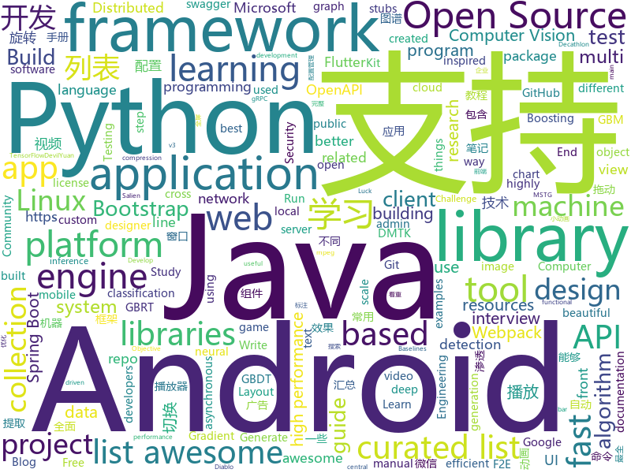

# 2018-06-23
See what the GitHub community is most excited about today.

## python
* [SNIPER](https://github.com/mahyarnajibi/SNIPER)(**517 stars today**): SNIPER is an efficient multi-scale object detection algorithm
* [vibora](https://github.com/vibora-io/vibora)(**475 stars today**): Fast, asynchronous and sexy Python web framework.
* [learn_math_fast](https://github.com/llSourcell/learn_math_fast)(**314 stars today**): This is the Curriculum for "How to Learn Mathematics Fast" By Siraj Raval on Youtube
* [decaNLP](https://github.com/salesforce/decaNLP)(**183 stars today**): The Natural Language Decathlon: A Multitask Challenge for NLP
* [distiller](https://github.com/NervanaSystems/distiller)(**133 stars today**): Neural Network Distiller: a Python package for neural network compression research.
* [SalienCheat](https://github.com/SteamDatabase/SalienCheat)(**87 stars today**): 👽Cheating Salien minigame, the proper way
* [baselines-rudder](https://github.com/ml-jku/baselines-rudder)(**87 stars today**): RUDDER for ATARI games with delayed rewards in OpenAI Baselines package
* [models](https://github.com/tensorflow/models)(**51 stars today**): Models and examples built with TensorFlow
* [DevilYuan](https://github.com/moyuanz/DevilYuan)(**64 stars today**): DevilYuan可视化股票量化系统，支持选股，历史数据自动下载，策略回测及参数优化，实盘交易和常用的统计功能
* [boxx](https://github.com/DIYer22/boxx)(**61 stars today**): Tool-box for efficient build and debug in Python. Especially for Scientific Computing and Computer Vision.
* [public-apis](https://github.com/toddmotto/public-apis)(**55 stars today**): A collective list of public JSON APIs for use in web development.
* [Python-100-Days](https://github.com/jackfrued/Python-100-Days)(**53 stars today**): Python - 100天从新手到大师
* [cozy](https://github.com/CozySynthesizer/cozy)(**49 stars today**): The collection synthesizer
* [awesome-python](https://github.com/vinta/awesome-python)(**45 stars today**): A curated list of awesome Python frameworks, libraries, software and resources
* [ImageAI](https://github.com/OlafenwaMoses/ImageAI)(**41 stars today**): A python library built to empower developers to build applications and systems with self-contained Computer Vision capabilities
* [keras](https://github.com/keras-team/keras)(**33 stars today**): Deep Learning for humans
* [pyCAIR](https://github.com/avidLearnerInProgress/pyCAIR)(**42 stars today**): Content aware image resizing
* [youtube-dl](https://github.com/rg3/youtube-dl)(**37 stars today**): Command-line program to download videos from YouTube.com and other video sites
* [django](https://github.com/django/django)(**34 stars today**): The Web framework for perfectionists with deadlines.
* [localstack](https://github.com/localstack/localstack)(**38 stars today**): 💻A fully functional local AWS cloud stack. Develop and test your cloud apps offline!
* [Detectron](https://github.com/facebookresearch/Detectron)(**32 stars today**): FAIR's research platform for object detection research, implementing popular algorithms like Mask R-CNN and RetinaNet.
* [CVE-2018-0296](https://github.com/yassineaboukir/CVE-2018-0296)(**33 stars today**): Script to test for Cisco ASA path traversal vulnerability (CVE-2018-0296)
* [penetration](https://github.com/w1109790800/penetration)(**30 stars today**): 渗透 超全面的渗透资料💯包含：0day，xss，sql注入，提权……
* [system-design-primer](https://github.com/donnemartin/system-design-primer)(**32 stars today**): Learn how to design large-scale systems. Prep for the system design interview. Includes Anki flashcards.
* [flask](https://github.com/pallets/flask)(**32 stars today**): The Python micro framework for building web applications.

## java
* [Java-Interview](https://github.com/crossoverJie/Java-Interview)(**440 stars today**): 👨‍🎓Java related : basic, concurrent, algorithm
* [SaveState](https://github.com/PrototypeZ/SaveState)(**122 stars today**): 🍦Generate 'onSaveInstanceState' and 'onRestoreInstanceState' methods for your application automatically
* [epoxy](https://github.com/airbnb/epoxy)(**62 stars today**): Epoxy is an Android library for building complex screens in a RecyclerView
* [tutorials](https://github.com/eugenp/tutorials)(**40 stars today**): The "REST With Spring" Course:
* [spring-boot](https://github.com/spring-projects/spring-boot)(**47 stars today**): Spring Boot
* [CommonDevKnowledge](https://github.com/AweiLoveAndroid/CommonDevKnowledge)(**51 stars today**): 🔥史上最全的BAT大厂Android面试题汇集，以及常用的Android开发的一些技能点，冷门知识点汇总，开发中遇到的坑汇总等干货。
* [weixin-java-tools](https://github.com/Wechat-Group/weixin-java-tools)(**45 stars today**): 可能是目前最好最全的微信Java开发工具包，支持包括微信支付、开放平台、小程序、企业号和公众号等的开发
* [CC](https://github.com/luckybilly/CC)(**41 stars today**): 业界首个支持渐进式组件化改造的Android组件化开源框架。Gradually componentize your android project.
* [elasticsearch](https://github.com/elastic/elasticsearch)(**31 stars today**): Open Source, Distributed, RESTful Search Engine
* [spring-framework](https://github.com/spring-projects/spring-framework)(**29 stars today**): Spring Framework
* [HanLP](https://github.com/hankcs/HanLP)(**32 stars today**): 自然语言处理 中文分词 词性标注 命名实体识别 依存句法分析 关键词提取 新词发现 短语提取 自动摘要 文本分类 拼音简繁
* [incubator-dubbo](https://github.com/apache/incubator-dubbo)(**29 stars today**): Apache Dubbo (incubating) is a high-performance, java based, open source RPC framework.
* [apollo](https://github.com/ctripcorp/apollo)(**29 stars today**): Apollo（阿波罗）是携程框架部门研发的分布式配置中心，能够集中化管理应用不同环境、不同集群的配置，配置修改后能够实时推送到应用端，并且具备规范的权限、流程治理等特性，适用于微服务配置管理场景。
* [GSYVideoPlayer](https://github.com/CarGuo/GSYVideoPlayer)(**28 stars today**): 视频播放器（IJKplayer、ExoPlayer、MediaPlayer），HTTPS支持，支持弹幕，支持滤镜、水印、gif截图，片头广告、中间广告，多个同时播放，支持基本的拖动，声音、亮度调节，支持边播边缓存，支持视频本身自带rotation的旋转（90,270之类），重力旋转与手动旋转的同步支持，支持列表播放 ，直接添加控件为封面，列表全屏动画，视频加载速度，列表小窗口支持拖动，动画效果，调整比例，多分辨率切换，支持切换播放器，进度条小窗口预览，列表切换详情页面无缝播放，其他一些小动画效果，rtsp、concat、mpeg。项目解析：
* [RxJava](https://github.com/ReactiveX/RxJava)(**28 stars today**): RxJava – Reactive Extensions for the JVM – a library for composing asynchronous and event-based programs using observable sequences for the Java VM.
* [graal](https://github.com/oracle/graal)(**29 stars today**): GraalVM: Run Programs Faster Anywhere🚀
* [spring-boot-examples](https://github.com/ityouknow/spring-boot-examples)(**23 stars today**): about learning Spring Boot via examples. Spring Boot 技术栈示例代码，快速简单上手教程。
* [vjtools](https://github.com/vipshop/vjtools)(**26 stars today**): The vip.com's java coding standard, libraries and tools
* [Java](https://github.com/TheAlgorithms/Java)(**24 stars today**): All Algorithms implemented in Java
* [okhttp](https://github.com/square/okhttp)(**24 stars today**): An HTTP+HTTP/2 client for Android and Java applications.
* [dotsindicator](https://github.com/tommybuonomo/dotsindicator)(**25 stars today**): Three material Dots Indicators for view pagers in Android !
* [TheGlowingLoader](https://github.com/varunest/TheGlowingLoader)(**24 stars today**): TheGlowingLoader is the highly configurable library to indicate progress and is natively created for Android Platform. It is an implementation of a design composed by Shashank Sahay.
* [glide](https://github.com/bumptech/glide)(**22 stars today**): An image loading and caching library for Android focused on smooth scrolling
* [PermissionsDispatcher](https://github.com/permissions-dispatcher/PermissionsDispatcher)(**23 stars today**): Simple annotation-based API to handle runtime permissions.
* [MPAndroidChart](https://github.com/PhilJay/MPAndroidChart)(**18 stars today**): A powerful🚀Android chart view / graph view library, supporting line- bar- pie- radar- bubble- and candlestick charts as well as scaling, dragging and animations.

## unknown
* [microsoft-drop-ice](https://github.com/selfagency/microsoft-drop-ice)(**152 stars today**): Tell Microsoft to drop ICE as a client or lose us as GitHub users
* [openlogos](https://github.com/arasatasaygin/openlogos)(**176 stars today**): Free logos for open source projects
* [build-your-own-x](https://github.com/danistefanovic/build-your-own-x)(**148 stars today**): 🤓Build your own (insert technology here)
* [architect-awesome](https://github.com/xingshaocheng/architect-awesome)(**117 stars today**): 后端架构师技术图谱
* [Interview-Notebook](https://github.com/CyC2018/Interview-Notebook)(**101 stars today**): 📆准备秋招学习笔记
* [awesome](https://github.com/sindresorhus/awesome)(**69 stars today**): 😎Curated list of awesome lists
* [toml](https://github.com/toml-lang/toml)(**60 stars today**): Tom's Obvious, Minimal Language
* [gitignore](https://github.com/github/gitignore)(**46 stars today**): A collection of useful .gitignore templates
* [awesome-flutter](https://github.com/Solido/awesome-flutter)(**58 stars today**): An awesome list that curates the best Flutter libraries, tools, tutorials, articles and more.
* [free-programming-books](https://github.com/EbookFoundation/free-programming-books)(**46 stars today**): 📚Freely available programming books
* [awesome-machine-learning-interpretability](https://github.com/jphall663/awesome-machine-learning-interpretability)(**45 stars today**): A curated list of awesome machine learning interpretability resources.
* [awesome-vue](https://github.com/vuejs/awesome-vue)(**44 stars today**): 🎉A curated list of awesome things related to Vue.js
* [coding-interview-university](https://github.com/jwasham/coding-interview-university)(**34 stars today**): A complete computer science study plan to become a software engineer.
* [android-architecture](https://github.com/googlesamples/android-architecture)(**28 stars today**): A collection of samples to discuss and showcase different architectural tools and patterns for Android apps.
* [developer-roadmap-chinese](https://github.com/goodjack/developer-roadmap-chinese)(**31 stars today**): 2018 年成為 Web 開發人員的路線圖
* [nocode](https://github.com/kelseyhightower/nocode)(**24 stars today**): The best way to write secure and reliable applications. Write nothing; deploy nowhere.
* [awesome-cpp](https://github.com/fffaraz/awesome-cpp)(**24 stars today**): A curated list of awesome C++ (or C) frameworks, libraries, resources, and shiny things. Inspired by awesome-... stuff.
* [Front-end-Developer-Interview-Questions](https://github.com/h5bp/Front-end-Developer-Interview-Questions)(**20 stars today**): A list of helpful front-end related questions you can use to interview potential candidates, test yourself or completely ignore.
* [GLWTPL](https://github.com/me-shaon/GLWTPL)(**22 stars today**): "Good Luck With That" Public License
* [anti-fascist-mit-license](https://github.com/jamiebuilds/anti-fascist-mit-license)(**22 stars today**): MIT license with additional text to prohibit use by fascists
* [Java-Guide](https://github.com/Snailclimb/Java-Guide)(**21 stars today**): 📖Java面试通关手册（Java学习指南）Java Interview Customs Manual (Java Study Guide)
* [react-native-at-airbnb-jp-translation](https://github.com/react-native-jp/react-native-at-airbnb-jp-translation)(**19 stars today**): 
* [community](https://github.com/fluttercommunity/community)(**19 stars today**): Flutter Community - A central place for all community made Flutter packages.
* [awesome-nodejs](https://github.com/sindresorhus/awesome-nodejs)(**16 stars today**): ⚡️Delightful Node.js packages and resources
* [daily-paper-computer-vision](https://github.com/amusi/daily-paper-computer-vision)(**14 stars today**): 记录每天整理的计算机视觉/深度学习/机器学习相关方向的论文

## c++
* [devilution](https://github.com/galaxyhaxz/devilution)(**444 stars today**): Diablo devolved - magic behind the 1996 computer game
* [tensorflow](https://github.com/tensorflow/tensorflow)(**89 stars today**): Computation using data flow graphs for scalable machine learning
* [BOLT](https://github.com/facebookincubator/BOLT)(**75 stars today**): Binary Optimization and Layout Tool - A linux command-line utility used for optimizing performance of binaries
* [vnote](https://github.com/tamlok/vnote)(**48 stars today**): A Vim-inspired note-taking application that knows programmers and Markdown better.
* [electron](https://github.com/electron/electron)(**44 stars today**): Build cross platform desktop apps with JavaScript, HTML, and CSS
* [menoh](https://github.com/pfnet-research/menoh)(**37 stars today**): Menoh: fast DNN inference library with multiple programming language support
* [DALI](https://github.com/NVIDIA/DALI)(**34 stars today**): A library containing both highly optimized building blocks and an execution engine for data pre-processing in deep learning applications
* [pytorch](https://github.com/pytorch/pytorch)(**27 stars today**): Tensors and Dynamic neural networks in Python with strong GPU acceleration
* [protobuf](https://github.com/google/protobuf)(**29 stars today**): Protocol Buffers - Google's data interchange format
* [opencv](https://github.com/opencv/opencv)(**24 stars today**): Open Source Computer Vision Library
* [bitcoin](https://github.com/bitcoin/bitcoin)(**24 stars today**): Bitcoin Core integration/staging tree
* [aseprite](https://github.com/aseprite/aseprite)(**28 stars today**): Animated sprite editor & pixel art tool (Windows, macOS, Linux)
* [caffe](https://github.com/BVLC/caffe)(**24 stars today**): Caffe: a fast open framework for deep learning.
* [tesseract](https://github.com/tesseract-ocr/tesseract)(**23 stars today**): Tesseract Open Source OCR Engine (main repository)
* [swift](https://github.com/apple/swift)(**20 stars today**): The Swift Programming Language
* [Tengine](https://github.com/OAID/Tengine)(**18 stars today**): Tengine is a lite, high performance, modular inference engine for embedded device
* [openpose](https://github.com/CMU-Perceptual-Computing-Lab/openpose)(**18 stars today**): OpenPose: Real-time multi-person keypoint detection library for body, face, and hands estimation
* [json](https://github.com/nlohmann/json)(**19 stars today**): JSON for Modern C++
* [grpc](https://github.com/grpc/grpc)(**15 stars today**): The C based gRPC (C++, Python, Ruby, Objective-C, PHP, C#)
* [yoga](https://github.com/facebook/yoga)(**19 stars today**): Yoga is a cross-platform layout engine which implements Flexbox. Follow https://twitter.com/yogalayout for updates.
* [godot](https://github.com/godotengine/godot)(**16 stars today**): Godot Engine – Multi-platform 2D and 3D game engine
* [xgboost](https://github.com/dmlc/xgboost)(**15 stars today**): Scalable, Portable and Distributed Gradient Boosting (GBDT, GBRT or GBM) Library, for Python, R, Java, Scala, C++ and more. Runs on single machine, Hadoop, Spark, Flink and DataFlow
* [apollo](https://github.com/ApolloAuto/apollo)(**16 stars today**): An open autonomous driving platform
* [envoy](https://github.com/envoyproxy/envoy)(**17 stars today**): C++ front/service proxy
* [LightGBM](https://github.com/Microsoft/LightGBM)(**14 stars today**): A fast, distributed, high performance gradient boosting (GBDT, GBRT, GBM or MART) framework based on decision tree algorithms, used for ranking, classification and many other machine learning tasks. It is under the umbrella of the DMTK(http://github.com/microsoft/dmtk) project of Microsoft.

## html
* [awesome-mac](https://github.com/jaywcjlove/awesome-mac)(**25 stars today**):  This repo is a collection of awesome Mac applications and tools for developers and designers.
* [stream-ui-kit](https://github.com/htmlstreamofficial/stream-ui-kit)(**25 stars today**): Stream - UI Kit. A beautiful Open Source Bootstrap 4 UI Kit under MIT license for better web!
* [knowledge](https://github.com/f2e-awesome/knowledge)(**23 stars today**): 文档着重构建一个完整的「前端技术架构图谱」，方便 F2E(Front End Engineering又称FEE、F2E) 学习与进阶。
* [styleguide](https://github.com/google/styleguide)(**19 stars today**): Style guides for Google-originated open-source projects
* [Winds](https://github.com/GetStream/Winds)(**23 stars today**): A Beautiful Open Source RSS & Podcast App
* [owasp-mstg](https://github.com/OWASP/owasp-mstg)(**22 stars today**): The Mobile Security Testing Guide (MSTG) is a comprehensive manual for mobile app security testing and reverse engineering.
* [top-hat](https://github.com/ThemesGuide/top-hat)(**19 stars today**): Tophat Themes - Give Bootstrap a custom, stylish look.
* [gentelella](https://github.com/puikinsh/gentelella)(**14 stars today**): Free Bootstrap 3 Admin Template
* [fastText](https://github.com/facebookresearch/fastText)(**14 stars today**): Library for fast text representation and classification.
* [portainer](https://github.com/portainer/portainer)(**14 stars today**): Simple management UI for Docker
* [Spoon-Knife](https://github.com/octocat/Spoon-Knife)(****): This repo is for demonstration purposes only.
* [react-app-rewired](https://github.com/timarney/react-app-rewired)(**11 stars today**): Override create-react-app webpack configs without ejecting
* [linux-command](https://github.com/jaywcjlove/linux-command)(**10 stars today**): Linux命令大全搜索工具，内容包含Linux命令手册、详解、学习、搜集。https://git.io/linux
* [Coursera-ML-AndrewNg-Notes](https://github.com/fengdu78/Coursera-ML-AndrewNg-Notes)(**9 stars today**): 吴恩达老师的机器学习课程个人笔记
* [qiubaiying.github.io](https://github.com/qiubaiying/qiubaiying.github.io)(**6 stars today**): BY Blog ->
* [designchallenge](https://github.com/lukejones/designchallenge)(**9 stars today**): Design challenges created to test the processes and creativity of any designer.
* [go101](https://github.com/go101/go101)(**8 stars today**): A book focusing on Go syntax/semantics and all kinds of details.
* [dive-into-webpack](https://github.com/gwuhaolin/dive-into-webpack)(**8 stars today**): 全面的Webpack教程《深入浅出Webpack》电子书
* [openapi-generator](https://github.com/OpenAPITools/openapi-generator)(**8 stars today**): OpenAPI Generator allows generation of API client libraries (SDK generation), server stubs, documentation and configuration automatically given an OpenAPI Spec (v2, v3)
* [async-local-storage](https://github.com/domenic/async-local-storage)(**8 stars today**): A proposal for an async local storage API for the web
* [intro.js](https://github.com/usablica/intro.js)(**7 stars today**): A better way for new feature introduction and step-by-step users guide for your website and project.
* [swagger-codegen](https://github.com/swagger-api/swagger-codegen)(**5 stars today**): swagger-codegen contains a template-driven engine to generate documentation, API clients and server stubs in different languages by parsing your OpenAPI / Swagger definition.
* [coreui-free-bootstrap-admin-template](https://github.com/coreui/coreui-free-bootstrap-admin-template)(**7 stars today**): CoreUI is free bootstrap admin template
* [course-git-blog-project](https://github.com/udacity/course-git-blog-project)(****): Sample repo of a blog for the Git course
* [primeng](https://github.com/primefaces/primeng)(**7 stars today**): UI Components for Angular

## WordCloud

