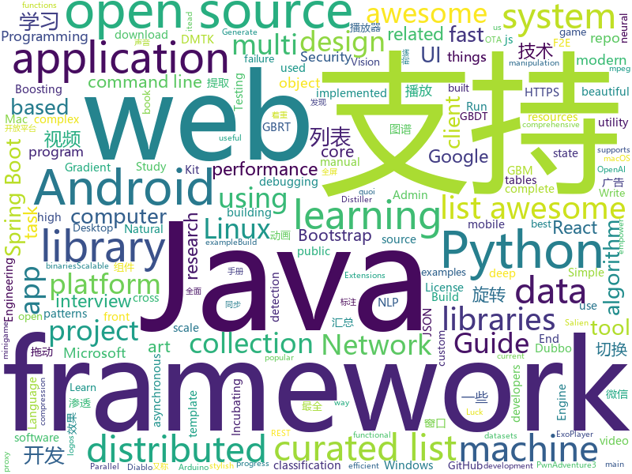

# 2018-06-24
See what the GitHub community is most excited about today.

## python
* [SNIPER](https://github.com/mahyarnajibi/SNIPER)(**197 stars today**): SNIPER is an efficient multi-scale object detection algorithm
* [SalienCheat](https://github.com/SteamDatabase/SalienCheat)(**161 stars today**): 👽Cheating Salien minigame, the proper way
* [vibora](https://github.com/vibora-io/vibora)(**174 stars today**): Fast, asynchronous and sexy Python web framework.
* [learn_math_fast](https://github.com/llSourcell/learn_math_fast)(**146 stars today**): This is the Curriculum for "How to Learn Mathematics Fast" By Siraj Raval on Youtube
* [distiller](https://github.com/NervanaSystems/distiller)(**64 stars today**): Neural Network Distiller: a Python package for neural network compression research.
* [models](https://github.com/tensorflow/models)(**39 stars today**): Models and examples built with TensorFlow
* [decaNLP](https://github.com/salesforce/decaNLP)(**49 stars today**): The Natural Language Decathlon: A Multitask Challenge for NLP
* [ImageAI](https://github.com/OlafenwaMoses/ImageAI)(**40 stars today**): A python library built to empower developers to build applications and systems with self-contained Computer Vision capabilities
* [Python-100-Days](https://github.com/jackfrued/Python-100-Days)(**29 stars today**): Python - 100天从新手到大师
* [penetration](https://github.com/w1109790800/penetration)(**32 stars today**): 渗透 超全面的渗透资料💯包含：0day，xss，sql注入，提权……
* [Fuxi-Scanner](https://github.com/jeffzh3ng/Fuxi-Scanner)(**33 stars today**): Network Security Vulnerability Scanner
* [public-apis](https://github.com/toddmotto/public-apis)(**33 stars today**): A collective list of public JSON APIs for use in web development.
* [keras](https://github.com/keras-team/keras)(**24 stars today**): Deep Learning for humans
* [baselines-rudder](https://github.com/ml-jku/baselines-rudder)(**28 stars today**): RUDDER for ATARI games with delayed rewards in OpenAI Baselines package
* [scikit-learn](https://github.com/scikit-learn/scikit-learn)(**24 stars today**): scikit-learn: machine learning in Python
* [awesome-python](https://github.com/vinta/awesome-python)(**25 stars today**): A curated list of awesome Python frameworks, libraries, software and resources
* [Detectron](https://github.com/facebookresearch/Detectron)(**23 stars today**): FAIR's research platform for object detection research, implementing popular algorithms like Mask R-CNN and RetinaNet.
* [django](https://github.com/django/django)(**18 stars today**): The Web framework for perfectionists with deadlines.
* [flair](https://github.com/zalandoresearch/flair)(**23 stars today**): A very simple framework for state-of-the-art NLP
* [system-design-primer](https://github.com/donnemartin/system-design-primer)(**22 stars today**): Learn how to design large-scale systems. Prep for the system design interview. Includes Anki flashcards.
* [youtube-dl](https://github.com/rg3/youtube-dl)(**20 stars today**): Command-line program to download videos from YouTube.com and other video sites
* [flask](https://github.com/pallets/flask)(**17 stars today**): The Python micro framework for building web applications.
* [pandas](https://github.com/pandas-dev/pandas)(**18 stars today**): Flexible and powerful data analysis / manipulation library for Python, providing labeled data structures similar to R data.frame objects, statistical functions, and much more
* [XX-Net](https://github.com/XX-net/XX-Net)(**16 stars today**): a web proxy tool
* [python-patterns](https://github.com/faif/python-patterns)(**16 stars today**): A collection of design patterns/idioms in Python

## java
* [Java-Interview](https://github.com/crossoverJie/Java-Interview)(**165 stars today**): 👨‍🎓Java related : basic, concurrent, algorithm
* [incubator-dubbo](https://github.com/apache/incubator-dubbo)(**34 stars today**): Apache Dubbo (incubating) is a high-performance, java based, open source RPC framework.
* [CommonDevKnowledge](https://github.com/AweiLoveAndroid/CommonDevKnowledge)(**32 stars today**): 🔥史上最全的BAT大厂Android面试题汇集，以及常用的Android开发的一些技能点，冷门知识点汇总，开发中遇到的坑汇总等干货。
* [java-design-patterns](https://github.com/iluwatar/java-design-patterns)(**28 stars today**): Design patterns implemented in Java
* [tutorials](https://github.com/eugenp/tutorials)(**18 stars today**): The "REST With Spring" Course:
* [spring-boot](https://github.com/spring-projects/spring-boot)(**19 stars today**): Spring Boot
* [SaveState](https://github.com/PrototypeZ/SaveState)(**23 stars today**): 🍦Generate 'onSaveInstanceState' and 'onRestoreInstanceState' methods for your application automatically
* [incubator-dubbo-spring-boot-project](https://github.com/apache/incubator-dubbo-spring-boot-project)(**22 stars today**): Spring Boot Project for Apache Dubbo (Incubating)
* [Java](https://github.com/TheAlgorithms/Java)(**20 stars today**): All Algorithms implemented in Java
* [epoxy](https://github.com/airbnb/epoxy)(**21 stars today**): Epoxy is an Android library for building complex screens in a RecyclerView
* [okhttp](https://github.com/square/okhttp)(**18 stars today**): An HTTP+HTTP/2 client for Android and Java applications.
* [RxJava](https://github.com/ReactiveX/RxJava)(**17 stars today**): RxJava – Reactive Extensions for the JVM – a library for composing asynchronous and event-based programs using observable sequences for the Java VM.
* [Android-Debug-Database](https://github.com/amitshekhariitbhu/Android-Debug-Database)(**15 stars today**): A library for debugging android databases and shared preferences - Make Debugging Great Again
* [GSYVideoPlayer](https://github.com/CarGuo/GSYVideoPlayer)(**15 stars today**): 视频播放器（IJKplayer、ExoPlayer、MediaPlayer），HTTPS支持，支持弹幕，支持滤镜、水印、gif截图，片头广告、中间广告，多个同时播放，支持基本的拖动，声音、亮度调节，支持边播边缓存，支持视频本身自带rotation的旋转（90,270之类），重力旋转与手动旋转的同步支持，支持列表播放 ，直接添加控件为封面，列表全屏动画，视频加载速度，列表小窗口支持拖动，动画效果，调整比例，多分辨率切换，支持切换播放器，进度条小窗口预览，列表切换详情页面无缝播放，其他一些小动画效果，rtsp、concat、mpeg。项目解析：
* [elasticsearch](https://github.com/elastic/elasticsearch)(**13 stars today**): Open Source, Distributed, RESTful Search Engine
* [Hystrix](https://github.com/Netflix/Hystrix)(**14 stars today**): Hystrix is a latency and fault tolerance library designed to isolate points of access to remote systems, services and 3rd party libraries, stop cascading failure and enable resilience in complex distributed systems where failure is inevitable.
* [weixin-java-tools](https://github.com/Wechat-Group/weixin-java-tools)(**12 stars today**): 可能是目前最好最全的微信Java开发工具包，支持包括微信支付、开放平台、小程序、企业号和公众号等的开发
* [spring-boot-admin](https://github.com/codecentric/spring-boot-admin)(**13 stars today**): Admin UI for administration of spring boot applications
* [spring-boot-examples](https://github.com/ityouknow/spring-boot-examples)(**14 stars today**): about learning Spring Boot via examples. Spring Boot 技术栈示例代码，快速简单上手教程。
* [graal](https://github.com/oracle/graal)(**14 stars today**): GraalVM: Run Programs Faster Anywhere🚀
* [guava](https://github.com/google/guava)(**12 stars today**): Google core libraries for Java
* [spring-framework](https://github.com/spring-projects/spring-framework)(**11 stars today**): Spring Framework
* [HanLP](https://github.com/hankcs/HanLP)(**11 stars today**): 自然语言处理 中文分词 词性标注 命名实体识别 依存句法分析 关键词提取 新词发现 短语提取 自动摘要 文本分类 拼音简繁
* [CC](https://github.com/luckybilly/CC)(**12 stars today**): 业界首个支持渐进式组件化改造的Android组件化开源框架。Gradually componentize your android project.
* [react-native-navigation](https://github.com/wix/react-native-navigation)(**11 stars today**): A complete native navigation solution for React Native

## unknown
* [NLP-progress](https://github.com/sebastianruder/NLP-progress)(**416 stars today**): Repository to track the progress in Natural Language Processing (NLP), including the datasets and the current state-of-the-art for the most common NLP tasks.
* [coding-interview-university](https://github.com/jwasham/coding-interview-university)(**103 stars today**): A complete computer science study plan to become a software engineer.
* [microsoft-drop-ice](https://github.com/selfagency/microsoft-drop-ice)(**67 stars today**): Tell Microsoft to drop ICE as a client or lose us as GitHub users
* [openlogos](https://github.com/arasatasaygin/openlogos)(**94 stars today**): Free logos for open source projects
* [build-your-own-x](https://github.com/danistefanovic/build-your-own-x)(**68 stars today**): 🤓Build your own (insert technology here)
* [architect-awesome](https://github.com/xingshaocheng/architect-awesome)(**48 stars today**): 后端架构师技术图谱
* [awesome](https://github.com/sindresorhus/awesome)(**50 stars today**): 😎Curated list of awesome lists
* [gitignore](https://github.com/github/gitignore)(**32 stars today**): A collection of useful .gitignore templates
* [Interview-Notebook](https://github.com/CyC2018/Interview-Notebook)(**32 stars today**): 📆准备秋招学习笔记
* [awesome-flutter](https://github.com/Solido/awesome-flutter)(**27 stars today**): An awesome list that curates the best Flutter libraries, tools, tutorials, articles and more.
* [awesome-vue](https://github.com/vuejs/awesome-vue)(**26 stars today**): 🎉A curated list of awesome things related to Vue.js
* [free-programming-books](https://github.com/EbookFoundation/free-programming-books)(**22 stars today**): 📚Freely available programming books
* [Java-Guide](https://github.com/Snailclimb/Java-Guide)(**18 stars today**): 📖Java面试通关手册（Java学习指南）Java Interview Customs Manual (Java Study Guide)
* [awesome-machine-learning-interpretability](https://github.com/jphall663/awesome-machine-learning-interpretability)(**19 stars today**): A curated list of awesome machine learning interpretability resources.
* [nocode](https://github.com/kelseyhightower/nocode)(**20 stars today**): The best way to write secure and reliable applications. Write nothing; deploy nowhere.
* [cpp20_in_TTs](https://github.com/tvaneerd/cpp20_in_TTs)(**20 stars today**): C++20 features described in Before/After tables ("Tony Tables")
* [Medias_francais](https://github.com/mdiplo/Medias_francais)(**20 stars today**): Qui possède quoi ?
* [Front-end-Developer-Interview-Questions](https://github.com/h5bp/Front-end-Developer-Interview-Questions)(**18 stars today**): A list of helpful front-end related questions you can use to interview potential candidates, test yourself or completely ignore.
* [toml](https://github.com/toml-lang/toml)(**16 stars today**): Tom's Obvious, Minimal Language
* [awesome-cpp](https://github.com/fffaraz/awesome-cpp)(**15 stars today**): A curated list of awesome C++ (or C) frameworks, libraries, resources, and shiny things. Inspired by awesome-... stuff.
* [daily-paper-computer-vision](https://github.com/amusi/daily-paper-computer-vision)(**10 stars today**): 记录每天整理的计算机视觉/深度学习/机器学习相关方向的论文
* [shadowsocksr-android](https://github.com/shadowsocksrr/shadowsocksr-android)(**13 stars today**): A ShadowsocksR client for Android
* [GLWTPL](https://github.com/me-shaon/GLWTPL)(**13 stars today**): "Good Luck With That" Public License
* [useful-tools](https://github.com/shenzekun/useful-tools)(**12 stars today**): 🔨一些有用的工具网站
* [awesome-react](https://github.com/enaqx/awesome-react)(**11 stars today**): A collection of awesome things regarding React ecosystem.

## c++
* [devilution](https://github.com/galaxyhaxz/devilution)(**190 stars today**): Diablo devolved - magic behind the 1996 computer game
* [tensorflow](https://github.com/tensorflow/tensorflow)(**39 stars today**): Computation using data flow graphs for scalable machine learning
* [pytorch](https://github.com/pytorch/pytorch)(**24 stars today**): Tensors and Dynamic neural networks in Python with strong GPU acceleration
* [protobuf](https://github.com/google/protobuf)(**24 stars today**): Protocol Buffers - Google's data interchange format
* [opencv](https://github.com/opencv/opencv)(**18 stars today**): Open Source Computer Vision Library
* [async-profiler](https://github.com/jvm-profiling-tools/async-profiler)(**23 stars today**): Sampling CPU and HEAP profiler for Java featuring AsyncGetCallTrace + perf_events
* [electron](https://github.com/electron/electron)(**18 stars today**): Build cross platform desktop apps with JavaScript, HTML, and CSS
* [bitcoin](https://github.com/bitcoin/bitcoin)(**16 stars today**): Bitcoin Core integration/staging tree
* [aseprite](https://github.com/aseprite/aseprite)(**19 stars today**): Animated sprite editor & pixel art tool (Windows, macOS, Linux)
* [BOLT](https://github.com/facebookincubator/BOLT)(**18 stars today**): Binary Optimization and Layout Tool - A linux command-line utility used for optimizing performance of binaries
* [xgboost](https://github.com/dmlc/xgboost)(**14 stars today**): Scalable, Portable and Distributed Gradient Boosting (GBDT, GBRT or GBM) Library, for Python, R, Java, Scala, C++ and more. Runs on single machine, Hadoop, Spark, Flink and DataFlow
* [caffe](https://github.com/BVLC/caffe)(**14 stars today**): Caffe: a fast open framework for deep learning.
* [PwnAdventure3](https://github.com/LiveOverflow/PwnAdventure3)(**12 stars today**): PwnAdventure3 Server
* [foundationdb](https://github.com/apple/foundationdb)(**12 stars today**): FoundationDB - the open source, distributed, transactional key-value store
* [aria2](https://github.com/aria2/aria2)(**11 stars today**): aria2 is a lightweight multi-protocol & multi-source, cross platform download utility operated in command-line. It supports HTTP/HTTPS, FTP, SFTP, BitTorrent and Metalink.
* [json](https://github.com/nlohmann/json)(**10 stars today**): JSON for Modern C++
* [apollo](https://github.com/ApolloAuto/apollo)(**9 stars today**): An open autonomous driving platform
* [Sonoff-Tasmota](https://github.com/arendst/Sonoff-Tasmota)(**9 stars today**): Provide ESP8266 based itead Sonoff with Web, MQTT and OTA firmware using Arduino IDE or PlatformIO
* [tesseract](https://github.com/tesseract-ocr/tesseract)(**10 stars today**): Tesseract Open Source OCR Engine (main repository)
* [synergy-core](https://github.com/symless/synergy-core)(**10 stars today**): Open source core of Synergy, the keyboard and mouse sharing tool
* [solidity](https://github.com/ethereum/solidity)(**8 stars today**): Solidity, the Contract-Oriented Programming Language
* [cpp-taskflow](https://github.com/cpp-taskflow/cpp-taskflow)(**9 stars today**): Fast C++ Parallel Programming with Task Dependencies
* [godot](https://github.com/godotengine/godot)(**8 stars today**): Godot Engine – Multi-platform 2D and 3D game engine
* [ardupilot](https://github.com/ArduPilot/ardupilot)(**7 stars today**): ArduPlane, ArduCopter, ArduRover source
* [LightGBM](https://github.com/Microsoft/LightGBM)(**8 stars today**): A fast, distributed, high performance gradient boosting (GBDT, GBRT, GBM or MART) framework based on decision tree algorithms, used for ranking, classification and many other machine learning tasks. It is under the umbrella of the DMTK(http://github.com/microsoft/dmtk) project of Microsoft.

## html
* [douyin](https://github.com/lujqme/douyin)(**75 stars today**): 抖音 (WIn/Linux/Mac OS)
* [DanderSpritz_lab](https://github.com/francisck/DanderSpritz_lab)(**55 stars today**): A fully functional DanderSpritz lab in 2 commands
* [stream-ui-kit](https://github.com/htmlstreamofficial/stream-ui-kit)(**35 stars today**): Stream - UI Kit. A beautiful Open Source Bootstrap 4 UI Kit under MIT license for better web!
* [styleguide](https://github.com/google/styleguide)(**24 stars today**): Style guides for Google-originated open-source projects
* [top-hat](https://github.com/ThemesGuide/top-hat)(**14 stars today**): Tophat Themes - Give Bootstrap a custom, stylish look.
* [owasp-mstg](https://github.com/OWASP/owasp-mstg)(**12 stars today**): The Mobile Security Testing Guide (MSTG) is a comprehensive manual for mobile app security testing and reverse engineering.
* [awesome-mac](https://github.com/jaywcjlove/awesome-mac)(**11 stars today**):  This repo is a collection of awesome Mac applications and tools for developers and designers.
* [portainer](https://github.com/portainer/portainer)(**10 stars today**): Simple management UI for Docker
* [Winds](https://github.com/GetStream/Winds)(**10 stars today**): A Beautiful Open Source RSS & Podcast App
* [Spoon-Knife](https://github.com/octocat/Spoon-Knife)(****): This repo is for demonstration purposes only.
* [gentelella](https://github.com/puikinsh/gentelella)(**9 stars today**): Free Bootstrap 3 Admin Template
* [knowledge](https://github.com/f2e-awesome/knowledge)(**7 stars today**): 文档着重构建一个完整的「前端技术架构图谱」，方便 F2E(Front End Engineering又称FEE、F2E) 学习与进阶。
* [react-app-rewired](https://github.com/timarney/react-app-rewired)(**7 stars today**): Override create-react-app webpack configs without ejecting
* [EIPs](https://github.com/ethereum/EIPs)(**6 stars today**): The Ethereum Improvement Proposal repository
* [WebFundamentals](https://github.com/google/WebFundamentals)(**6 stars today**): Best practices for modern web development
* [fastText](https://github.com/facebookresearch/fastText)(**6 stars today**): Library for fast text representation and classification.
* [nodejs-ex](https://github.com/sclorg/nodejs-ex)(****): node.js example
* [polymer](https://github.com/Polymer/polymer)(**6 stars today**): Build modern apps using web components
* [Blot](https://github.com/davidmerfield/Blot)(**5 stars today**): Turns a folder into a website
* [patchwork](https://github.com/jlord/patchwork)(****): All the Git-it Workshop completers!
* [game-of-life](https://github.com/wakaleo/game-of-life)(****): Demo application for the 'Jenkins: The Definitive Guide' book
* [fend-project-memory-game](https://github.com/udacity/fend-project-memory-game)(****): 
* [home-assistant.github.io](https://github.com/home-assistant/home-assistant.github.io)(****): 📘Home Assistant User documentation
* [website](https://github.com/kubernetes/website)(****): Kubernetes website and documentation repo:
* [Rocket.Chat.Electron](https://github.com/RocketChat/Rocket.Chat.Electron)(****): Official OSX, Windows, and Linux Desktop Clients for Rocket.Chat

## WordCloud

