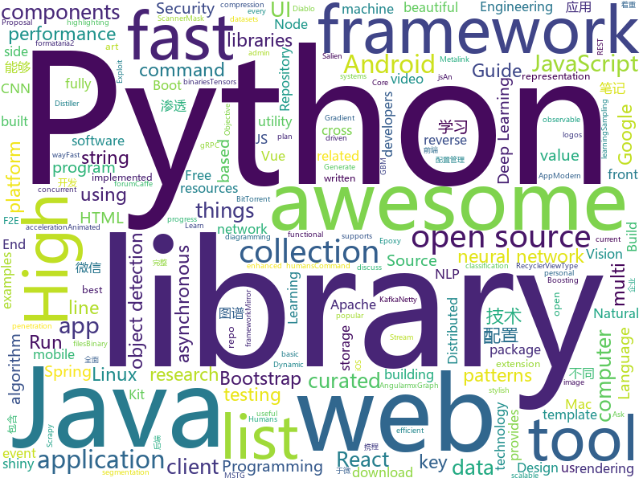

# 2018-06-25
See what the GitHub community is most excited about today.

## python
* [instagram-scraper](https://github.com/meetmangukiya/instagram-scraper)(**219 stars today**): Scrape the Instagram frontend. Inspired from twitter-scrapper by @kennethreitz.
* [SalienCheat](https://github.com/SteamDatabase/SalienCheat)(**133 stars today**): 👽Cheating Salien minigame, the proper way
* [vibora](https://github.com/vibora-io/vibora)(**143 stars today**): Fast, asynchronous and elegant Python web framework.
* [learn_math_fast](https://github.com/llSourcell/learn_math_fast)(**107 stars today**): This is the Curriculum for "How to Learn Mathematics Fast" By Siraj Raval on Youtube
* [Zeratool](https://github.com/ChrisTheCoolHut/Zeratool)(**87 stars today**): Automatic Exploit Generation (AEG) and remote flag capture for exploitable CTF problems
* [SNIPER](https://github.com/mahyarnajibi/SNIPER)(**73 stars today**): SNIPER is an efficient multi-scale object detection algorithm
* [awesome-python](https://github.com/vinta/awesome-python)(**46 stars today**): A curated list of awesome Python frameworks, libraries, software and resources
* [models](https://github.com/tensorflow/models)(**31 stars today**): Models and examples built with TensorFlow
* [pyray](https://github.com/ryu577/pyray)(**41 stars today**): A 3d rendering library written completely in python.
* [tensorlayer](https://github.com/tensorlayer/tensorlayer)(**36 stars today**): Deep Learning for Researchers and Engineers
* [decaNLP](https://github.com/salesforce/decaNLP)(**36 stars today**): The Natural Language Decathlon: A Multitask Challenge for NLP
* [adb-enhanced](https://github.com/ashishb/adb-enhanced)(**34 stars today**): ADB enhanced for developers
* [ImageAI](https://github.com/OlafenwaMoses/ImageAI)(**29 stars today**): A python library built to empower developers to build applications and systems with self-contained Computer Vision capabilities
* [public-apis](https://github.com/toddmotto/public-apis)(**29 stars today**): A collective list of public JSON APIs for use in web development.
* [keras](https://github.com/keras-team/keras)(**24 stars today**): Deep Learning for humans
* [youtube-dl](https://github.com/rg3/youtube-dl)(**25 stars today**): Command-line program to download videos from YouTube.com and other video sites
* [django](https://github.com/django/django)(**21 stars today**): The Web framework for perfectionists with deadlines.
* [distiller](https://github.com/NervanaSystems/distiller)(**23 stars today**): Neural Network Distiller: a Python package for neural network compression research.
* [penetration](https://github.com/w1109790800/penetration)(**23 stars today**): 渗透 超全面的渗透资料💯包含：0day，xss，sql注入，提权……
* [Fuxi-Scanner](https://github.com/jeffzh3ng/Fuxi-Scanner)(**22 stars today**): Network Security Vulnerability Scanner
* [Mask_RCNN](https://github.com/matterport/Mask_RCNN)(**20 stars today**): Mask R-CNN for object detection and instance segmentation on Keras and TensorFlow
* [awesome-blockchain-kor](https://github.com/yunho0130/awesome-blockchain-kor)(**22 stars today**): 모두를 위한 블록체인: 함께 만들어가는 Repository라 생각합니다. Pull Request는 언제든지 환영합니다.
* [Detectron](https://github.com/facebookresearch/Detectron)(**20 stars today**): FAIR's research platform for object detection research, implementing popular algorithms like Mask R-CNN and RetinaNet.
* [scrapy](https://github.com/scrapy/scrapy)(**18 stars today**): Scrapy, a fast high-level web crawling & scraping framework for Python.
* [flask](https://github.com/pallets/flask)(**18 stars today**): The Python micro framework for building web applications.

## java
* [Java-Interview](https://github.com/crossoverJie/Java-Interview)(**114 stars today**): 👨‍🎓Java related : basic, concurrent, algorithm
* [java-design-patterns](https://github.com/iluwatar/java-design-patterns)(**39 stars today**): Design patterns implemented in Java
* [SaveState](https://github.com/PrototypeZ/SaveState)(**38 stars today**): 🍦Generate 'onSaveInstanceState' and 'onRestoreInstanceState' methods for your application automatically
* [spring-boot](https://github.com/spring-projects/spring-boot)(**25 stars today**): Spring Boot
* [spring-framework](https://github.com/spring-projects/spring-framework)(**18 stars today**): Spring Framework
* [incubator-dubbo](https://github.com/apache/incubator-dubbo)(**18 stars today**): Apache Dubbo (incubating) is a high-performance, java based, open source RPC framework.
* [elasticsearch](https://github.com/elastic/elasticsearch)(**19 stars today**): Open Source, Distributed, RESTful Search Engine
* [weixin-java-tools](https://github.com/Wechat-Group/weixin-java-tools)(**17 stars today**): 可能是目前最好最全的微信Java开发工具包，支持包括微信支付、开放平台、小程序、企业号和公众号等的开发
* [tutorials](https://github.com/eugenp/tutorials)(**9 stars today**): The "REST With Spring" Course:
* [eclipse-collections](https://github.com/eclipse/eclipse-collections)(**14 stars today**): The Eclipse Collections Project
* [Java](https://github.com/TheAlgorithms/Java)(**10 stars today**): All Algorithms implemented in Java
* [spring-boot-examples](https://github.com/ityouknow/spring-boot-examples)(**11 stars today**): about learning Spring Boot via examples. Spring Boot 技术栈示例代码，快速简单上手教程。
* [okhttp](https://github.com/square/okhttp)(**13 stars today**): An HTTP+HTTP/2 client for Android and Java applications.
* [graal](https://github.com/oracle/graal)(**13 stars today**): GraalVM: Run Programs Faster Anywhere🚀
* [epoxy](https://github.com/airbnb/epoxy)(**13 stars today**): Epoxy is an Android library for building complex screens in a RecyclerView
* [retrofit](https://github.com/square/retrofit)(**12 stars today**): Type-safe HTTP client for Android and Java by Square, Inc.
* [RxJava](https://github.com/ReactiveX/RxJava)(**12 stars today**): RxJava – Reactive Extensions for the JVM – a library for composing asynchronous and event-based programs using observable sequences for the Java VM.
* [glide](https://github.com/bumptech/glide)(**11 stars today**): An image loading and caching library for Android focused on smooth scrolling
* [material-components-android](https://github.com/material-components/material-components-android)(**11 stars today**): Modular and customizable Material Design UI components for Android
* [kafka](https://github.com/apache/kafka)(**9 stars today**): Mirror of Apache Kafka
* [netty](https://github.com/netty/netty)(**9 stars today**): Netty project - an event-driven asynchronous network application framework
* [rocketmq](https://github.com/apache/rocketmq)(**9 stars today**): Mirror of Apache RocketMQ
* [lottie-android](https://github.com/airbnb/lottie-android)(**9 stars today**): Render After Effects animations natively on Android and iOS, Web, and React Native
* [apollo](https://github.com/ctripcorp/apollo)(**8 stars today**): Apollo（阿波罗）是携程框架部门研发的分布式配置中心，能够集中化管理应用不同环境、不同集群的配置，配置修改后能够实时推送到应用端，并且具备规范的权限、流程治理等特性，适用于微服务配置管理场景。
* [litespring](https://github.com/onlyliuxin/litespring)(**7 stars today**): 

## unknown
* [NLP-progress](https://github.com/sebastianruder/NLP-progress)(**587 stars today**): Repository to track the progress in Natural Language Processing (NLP), including the datasets and the current state-of-the-art for the most common NLP tasks.
* [coding-interview-university](https://github.com/jwasham/coding-interview-university)(**104 stars today**): A complete computer science study plan to become a software engineer.
* [build-your-own-x](https://github.com/danistefanovic/build-your-own-x)(**98 stars today**): 🤓Build your own (insert technology here)
* [openlogos](https://github.com/arasatasaygin/openlogos)(**87 stars today**): Free logos for open source projects
* [learn](https://github.com/coderplex/learn)(**63 stars today**): Open Source Learning Guides to master your favorite technology
* [Interview-Notebook](https://github.com/CyC2018/Interview-Notebook)(**54 stars today**): 📆准备秋招学习笔记
* [awesome](https://github.com/sindresorhus/awesome)(**45 stars today**): 😎Curated list of awesome lists
* [vue-patterns](https://github.com/learn-vuejs/vue-patterns)(**45 stars today**): Useful Vue patterns, techniques, tips and tricks and helpful curated links.
* [architect-awesome](https://github.com/xingshaocheng/architect-awesome)(**42 stars today**): 后端架构师技术图谱
* [gitignore](https://github.com/github/gitignore)(**29 stars today**): A collection of useful .gitignore templates
* [free-programming-books](https://github.com/EbookFoundation/free-programming-books)(**34 stars today**): 📚Freely available programming books
* [microsoft-drop-ice](https://github.com/selfagency/microsoft-drop-ice)(**19 stars today**): Tell Microsoft to drop ICE as a client or lose us as GitHub users
* [awesome-vue](https://github.com/vuejs/awesome-vue)(**23 stars today**): 🎉A curated list of awesome things related to Vue.js
* [awesome-flutter](https://github.com/Solido/awesome-flutter)(**22 stars today**): An awesome list that curates the best Flutter libraries, tools, tutorials, articles and more.
* [analysis-of-anti-analysis](https://github.com/yellowbyte/analysis-of-anti-analysis)(**22 stars today**): writings on anti-reverse engineering
* [Penetration-Testing](https://github.com/Kinimiwar/Penetration-Testing)(**16 stars today**): List of awesome penetration testing resources, tools and other shiny things
* [awesome-nodejs](https://github.com/sindresorhus/awesome-nodejs)(**17 stars today**): ⚡️Delightful Node.js packages and resources
* [vscode-lit-html](https://github.com/mjbvz/vscode-lit-html)(**16 stars today**): Adds syntax highlighting for html inside of JavaScript and TypeScript tagged template strings
* [awesome-javascript](https://github.com/sorrycc/awesome-javascript)(**15 stars today**): 🐢A collection of awesome browser-side JavaScript libraries, resources and shiny things.
* [awesome-react](https://github.com/enaqx/awesome-react)(**13 stars today**): A collection of awesome things regarding React ecosystem.
* [nodebestpractices](https://github.com/i0natan/nodebestpractices)(**14 stars today**): The largest Node.JS best practices list (June 2018)
* [toml](https://github.com/toml-lang/toml)(**14 stars today**): Tom's Obvious, Minimal Language
* [awesome-react-components](https://github.com/brillout/awesome-react-components)(**13 stars today**): Catalog of React Components & Libraries
* [awesome-scalability](https://github.com/binhnguyennus/awesome-scalability)(**13 stars today**): High Scalability, High Availability, High Stability, High Performance, and High Intelligence Back-End Design Patterns
* [android-architecture](https://github.com/googlesamples/android-architecture)(**10 stars today**): A collection of samples to discuss and showcase different architectural tools and patterns for Android apps.

## c++
* [devilution](https://github.com/galaxyhaxz/devilution)(**155 stars today**): Diablo devolved - magic behind the 1996 computer game
* [jsonnet](https://github.com/google/jsonnet)(**94 stars today**): Jsonnet - The data templating language
* [tensorflow](https://github.com/tensorflow/tensorflow)(**61 stars today**): Computation using data flow graphs for scalable machine learning
* [async-profiler](https://github.com/jvm-profiling-tools/async-profiler)(**33 stars today**): Sampling CPU and HEAP profiler for Java featuring AsyncGetCallTrace + perf_events
* [electron](https://github.com/electron/electron)(**30 stars today**): Build cross platform desktop apps with JavaScript, HTML, and CSS
* [sqlite-parquet-vtable](https://github.com/cldellow/sqlite-parquet-vtable)(**27 stars today**): A SQLite vtable extension to read Parquet files
* [BOLT](https://github.com/facebookincubator/BOLT)(**22 stars today**): Binary Optimization and Layout Tool - A linux command-line utility used for optimizing performance of binaries
* [pytorch](https://github.com/pytorch/pytorch)(**18 stars today**): Tensors and Dynamic neural networks in Python with strong GPU acceleration
* [aseprite](https://github.com/aseprite/aseprite)(**19 stars today**): Animated sprite editor & pixel art tool (Windows, macOS, Linux)
* [bitcoin](https://github.com/bitcoin/bitcoin)(**15 stars today**): Bitcoin Core integration/staging tree
* [xgboost](https://github.com/dmlc/xgboost)(**16 stars today**): Scalable, Portable and Distributed Gradient Boosting (GBDT, GBRT or GBM) Library, for Python, R, Java, Scala, C++ and more. Runs on single machine, Hadoop, Spark, Flink and DataFlow
* [opencv](https://github.com/opencv/opencv)(**15 stars today**): Open Source Computer Vision Library
* [generative-query-network](https://github.com/musyoku/generative-query-network)(**17 stars today**): Neural scene representation and rendering (GQN)
* [leetcode](https://github.com/haoel/leetcode)(**15 stars today**): LeetCode Problems' Solutions
* [apollo](https://github.com/ApolloAuto/apollo)(**14 stars today**): An open autonomous driving platform
* [protobuf](https://github.com/google/protobuf)(**12 stars today**): Protocol Buffers - Google's data interchange format
* [aria2](https://github.com/aria2/aria2)(**13 stars today**): aria2 is a lightweight multi-protocol & multi-source, cross platform download utility operated in command-line. It supports HTTP/HTTPS, FTP, SFTP, BitTorrent and Metalink.
* [swift](https://github.com/apple/swift)(**12 stars today**): The Swift Programming Language
* [cosmos](https://github.com/OpenGenus/cosmos)(**11 stars today**): Algorithms that run our universe | Your personal library of every algorithm and data structure code that you will ever encounter | Ask us anything at our forum
* [caffe](https://github.com/BVLC/caffe)(**11 stars today**): Caffe: a fast open framework for deep learning.
* [rocksdb](https://github.com/facebook/rocksdb)(**12 stars today**): A library that provides an embeddable, persistent key-value store for fast storage.
* [grpc](https://github.com/grpc/grpc)(**12 stars today**): The C based gRPC (C++, Python, Ruby, Objective-C, PHP, C#)
* [leveldb](https://github.com/google/leveldb)(**10 stars today**): LevelDB is a fast key-value storage library written at Google that provides an ordered mapping from string keys to string values.
* [envoy](https://github.com/envoyproxy/envoy)(**11 stars today**): C++ front/service proxy
* [solidity](https://github.com/ethereum/solidity)(**9 stars today**): Solidity, the Contract-Oriented Programming Language

## html
* [douyin](https://github.com/lujqme/douyin)(**42 stars today**): 抖音 (WIn/Linux/Mac OS)
* [stream-ui-kit](https://github.com/htmlstreamofficial/stream-ui-kit)(**21 stars today**): Stream - UI Kit. A beautiful Open Source Bootstrap 4 UI Kit under MIT license for better web!
* [Coursera-ML-AndrewNg-Notes](https://github.com/fengdu78/Coursera-ML-AndrewNg-Notes)(**16 stars today**): 吴恩达老师的机器学习课程个人笔记
* [DanderSpritz_lab](https://github.com/francisck/DanderSpritz_lab)(**19 stars today**): A fully functional DanderSpritz lab in 2 commands
* [awesome-resume](https://github.com/resumejob/awesome-resume)(**20 stars today**): 包含简历常用例句
* [awesome-mac](https://github.com/jaywcjlove/awesome-mac)(**14 stars today**):  This repo is a collection of awesome Mac applications and tools for developers and designers.
* [styleguide](https://github.com/google/styleguide)(**11 stars today**): Style guides for Google-originated open-source projects
* [portainer](https://github.com/portainer/portainer)(**13 stars today**): Simple management UI for Docker
* [Winds](https://github.com/GetStream/Winds)(**12 stars today**): A Beautiful Open Source RSS & Podcast App
* [javascript-tutorial-en](https://github.com/iliakan/javascript-tutorial-en)(**11 stars today**): Modern JavaScript Tutorial
* [fastText](https://github.com/facebookresearch/fastText)(**11 stars today**): Library for fast text representation and classification.
* [owasp-mstg](https://github.com/OWASP/owasp-mstg)(**9 stars today**): The Mobile Security Testing Guide (MSTG) is a comprehensive manual for mobile app security testing and reverse engineering.
* [Spoon-Knife](https://github.com/octocat/Spoon-Knife)(****): This repo is for demonstration purposes only.
* [requests-html](https://github.com/kennethreitz/requests-html)(**7 stars today**): Pythonic HTML Parsing for Humans™
* [coreui-free-bootstrap-admin-template](https://github.com/coreui/coreui-free-bootstrap-admin-template)(**6 stars today**): CoreUI is free bootstrap admin template
* [phantomjs](https://github.com/ariya/phantomjs)(**6 stars today**): Scriptable Headless Browser
* [ecma262](https://github.com/tc39/ecma262)(**7 stars today**): Status, process, and documents for ECMA262
* [primeng](https://github.com/primefaces/primeng)(**7 stars today**): UI Components for Angular
* [mxgraph](https://github.com/jgraph/mxgraph)(**7 stars today**): mxGraph is a fully client side JavaScript diagramming library
* [react-app-rewired](https://github.com/timarney/react-app-rewired)(**6 stars today**): Override create-react-app webpack configs without ejecting
* [hyperHTML](https://github.com/WebReflection/hyperHTML)(**6 stars today**): A Fast & Light Virtual DOM Alternative
* [top-hat](https://github.com/ThemesGuide/top-hat)(**6 stars today**): Tophat Themes - Give Bootstrap a custom, stylish look.
* [EIPs](https://github.com/ethereum/EIPs)(**5 stars today**): The Ethereum Improvement Proposal repository
* [polymer](https://github.com/Polymer/polymer)(**5 stars today**): Build modern apps using web components
* [knowledge](https://github.com/f2e-awesome/knowledge)(**5 stars today**): 文档着重构建一个完整的「前端技术架构图谱」，方便 F2E(Front End Engineering又称FEE、F2E) 学习与进阶。

## WordCloud

