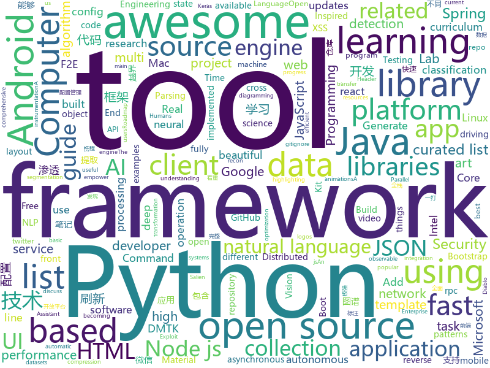

# 2018-06-26
See what the GitHub community is most excited about today.

## python
* [instagram-scraper](https://github.com/meetmangukiya/instagram-scraper)(**232 stars today**): Scrape the Instagram frontend. Inspired from twitter-scraper by @kennethreitz.
* [vibora](https://github.com/vibora-io/vibora)(**227 stars today**): Fast, asynchronous and elegant Python web framework.
* [learn_math_fast](https://github.com/llSourcell/learn_math_fast)(**164 stars today**): This is the Curriculum for "How to Learn Mathematics Fast" By Siraj Raval on Youtube
* [coveragepy](https://github.com/nedbat/coveragepy)(**152 stars today**): Code coverage measurement for Python
* [SalienCheat](https://github.com/SteamDatabase/SalienCheat)(**91 stars today**): 👽Cheating Salien minigame, the proper way
* [Zeratool](https://github.com/ChrisTheCoolHut/Zeratool)(**84 stars today**): Automatic Exploit Generation (AEG) and remote flag capture for exploitable CTF problems
* [SNIPER](https://github.com/mahyarnajibi/SNIPER)(**85 stars today**): SNIPER is an efficient multi-scale object detection algorithm
* [models](https://github.com/tensorflow/models)(**54 stars today**): Models and examples built with TensorFlow
* [decaNLP](https://github.com/salesforce/decaNLP)(**70 stars today**): The Natural Language Decathlon: A Multitask Challenge for NLP
* [deda](https://github.com/dfd-tud/deda)(**62 stars today**): 
* [public-apis](https://github.com/toddmotto/public-apis)(**62 stars today**): A collective list of public JSON APIs for use in web development.
* [img_to_txt](https://github.com/yaochao/img_to_txt)(**57 stars today**): Any image transfer to txt
* [emacs-application-framework](https://github.com/manateelazycat/emacs-application-framework)(**58 stars today**): Emacs application framework
* [Fuxi-Scanner](https://github.com/jeffzh3ng/Fuxi-Scanner)(**49 stars today**): Network Security Vulnerability Scanner
* [adb-enhanced](https://github.com/ashishb/adb-enhanced)(**55 stars today**): ADB enhanced for developers
* [keras](https://github.com/keras-team/keras)(**44 stars today**): Deep Learning for humans
* [termtosvg](https://github.com/nbedos/termtosvg)(**51 stars today**): Record terminal sessions as SVG animations
* [awesome-python](https://github.com/vinta/awesome-python)(**45 stars today**): A curated list of awesome Python frameworks, libraries, software and resources
* [ImageAI](https://github.com/OlafenwaMoses/ImageAI)(**41 stars today**): A python library built to empower developers to build applications and systems with self-contained Computer Vision capabilities
* [distiller](https://github.com/NervanaSystems/distiller)(**41 stars today**): Neural Network Distiller by Intel AI Lab: a Python package for neural network compression research.
* [Python-100-Days](https://github.com/jackfrued/Python-100-Days)(**37 stars today**): Python - 100天从新手到大师
* [youtube-dl](https://github.com/rg3/youtube-dl)(**36 stars today**): Command-line program to download videos from YouTube.com and other video sites
* [penetration](https://github.com/w1109790800/penetration)(**30 stars today**): 渗透 超全面的渗透资料💯包含：0day，xss，sql注入，提权……
* [Mask_RCNN](https://github.com/matterport/Mask_RCNN)(**29 stars today**): Mask R-CNN for object detection and instance segmentation on Keras and TensorFlow
* [nlp-architect](https://github.com/NervanaSystems/nlp-architect)(**32 stars today**): NLP Architect by Intel AI Lab: Python library for exploring the state-of-the-art deep learning topologies and techniques for natural language processing and natural language understanding

## java
* [Java-Interview](https://github.com/crossoverJie/Java-Interview)(**175 stars today**): 👨‍🎓Java related : basic, concurrent, algorithm
* [SaveState](https://github.com/PrototypeZ/SaveState)(**146 stars today**): 🍦Generate 'onSaveInstanceState' and 'onRestoreInstanceState' methods for your application automatically
* [spring-boot](https://github.com/spring-projects/spring-boot)(**46 stars today**): Spring Boot
* [java-design-patterns](https://github.com/iluwatar/java-design-patterns)(**45 stars today**): Design patterns implemented in Java
* [tutorials](https://github.com/eugenp/tutorials)(**29 stars today**): The "REST With Spring" Course:
* [incubator-dubbo](https://github.com/apache/incubator-dubbo)(**38 stars today**): Apache Dubbo (incubating) is a high-performance, java based, open source RPC framework.
* [spring-boot-examples](https://github.com/ityouknow/spring-boot-examples)(**33 stars today**): about learning Spring Boot via examples. Spring Boot 技术栈示例代码，快速简单上手教程。
* [weixin-java-tools](https://github.com/Wechat-Group/weixin-java-tools)(**33 stars today**): 可能是目前最好最全的微信Java开发工具包，支持包括微信支付、开放平台、小程序、企业号和公众号等的开发
* [write-readable-code](https://github.com/biezhi/write-readable-code)(**37 stars today**): 🗾编写可读代码的艺术代码仓库
* [spring-framework](https://github.com/spring-projects/spring-framework)(**27 stars today**): Spring Framework
* [RxJava](https://github.com/ReactiveX/RxJava)(**31 stars today**): RxJava – Reactive Extensions for the JVM – a library for composing asynchronous and event-based programs using observable sequences for the Java VM.
* [jslt](https://github.com/schibsted/jslt)(**31 stars today**): JSON query and transformation language
* [elasticsearch](https://github.com/elastic/elasticsearch)(**25 stars today**): Open Source, Distributed, RESTful Search Engine
* [dotsindicator](https://github.com/tommybuonomo/dotsindicator)(**28 stars today**): Three material Dots Indicators for view pagers in Android !
* [guava](https://github.com/google/guava)(**26 stars today**): Google core libraries for Java
* [HanLP](https://github.com/hankcs/HanLP)(**24 stars today**): 自然语言处理 中文分词 词性标注 命名实体识别 依存句法分析 关键词提取 新词发现 短语提取 自动摘要 文本分类 拼音简繁
* [SmartRefreshLayout](https://github.com/scwang90/SmartRefreshLayout)(**26 stars today**): 🔥下拉刷新、上拉加载、二级刷新、淘宝二楼、RefreshLayout、OverScroll，Android智能下拉刷新框架，支持越界回弹、越界拖动，具有极强的扩展性，集成了几十种炫酷的Header和 Footer。
* [Java](https://github.com/TheAlgorithms/Java)(**24 stars today**): All Algorithms implemented in Java
* [kaixin](https://github.com/i38/kaixin)(**28 stars today**): 快速全栈开发框架
* [apollo](https://github.com/ctripcorp/apollo)(**23 stars today**): Apollo（阿波罗）是携程框架部门研发的分布式配置中心，能够集中化管理应用不同环境、不同集群的配置，配置修改后能够实时推送到应用端，并且具备规范的权限、流程治理等特性，适用于微服务配置管理场景。
* [awesome-ai-services](https://github.com/sekwiatkowski/awesome-ai-services)(**27 stars today**): An overview of the AI-as-a-service landscape
* [epoxy](https://github.com/airbnb/epoxy)(**26 stars today**): Epoxy is an Android library for building complex screens in a RecyclerView
* [material-components-android](https://github.com/material-components/material-components-android)(**26 stars today**): Modular and customizable Material Design UI components for Android
* [retrofit](https://github.com/square/retrofit)(**23 stars today**): Type-safe HTTP client for Android and Java by Square, Inc.
* [rainbow](https://github.com/dbiir/rainbow)(**18 stars today**): A data layout optimization framework for wide tables stored on HDFS. See rainbow's webpage

## unknown
* [NLP-progress](https://github.com/sebastianruder/NLP-progress)(**774 stars today**): Repository to track the progress in Natural Language Processing (NLP), including the datasets and the current state-of-the-art for the most common NLP tasks.
* [build-your-own-x](https://github.com/danistefanovic/build-your-own-x)(**173 stars today**): 🤓Build your own (insert technology here)
* [coding-interview-university](https://github.com/jwasham/coding-interview-university)(**110 stars today**): A complete computer science study plan to become a software engineer.
* [openlogos](https://github.com/arasatasaygin/openlogos)(**111 stars today**): Free logos for open source projects
* [architect-awesome](https://github.com/xingshaocheng/architect-awesome)(**85 stars today**): 后端架构师技术图谱
* [Interview-Notebook](https://github.com/CyC2018/Interview-Notebook)(**80 stars today**): 📆准备秋招学习笔记
* [gitignore](https://github.com/github/gitignore)(**51 stars today**): A collection of useful .gitignore templates
* [awesome](https://github.com/sindresorhus/awesome)(**55 stars today**): 😎Curated list of awesome lists
* [free-programming-books](https://github.com/EbookFoundation/free-programming-books)(**52 stars today**): 📚Freely available programming books
* [awesome-vue](https://github.com/vuejs/awesome-vue)(**47 stars today**): 🎉A curated list of awesome things related to Vue.js
* [awesome-flutter](https://github.com/Solido/awesome-flutter)(**49 stars today**): An awesome list that curates the best Flutter libraries, tools, tutorials, articles and more.
* [contrib](https://github.com/watch-devtube/contrib)(**37 stars today**): DevTube contribution data.
* [android-architecture](https://github.com/googlesamples/android-architecture)(**33 stars today**): A collection of samples to discuss and showcase different architectural tools and patterns for Android apps.
* [microsoft-drop-ice](https://github.com/selfagency/microsoft-drop-ice)(**23 stars today**): Tell Microsoft to drop ICE as a client or lose us as GitHub users
* [react-developer-roadmap](https://github.com/adam-golab/react-developer-roadmap)(**33 stars today**): Roadmap to becoming a React developer in 2018
* [Red-Teaming-Toolkit](https://github.com/infosecn1nja/Red-Teaming-Toolkit)(**27 stars today**): A collection of open source and commercial tools that aid in red team operations.
* [Front-end-Developer-Interview-Questions](https://github.com/h5bp/Front-end-Developer-Interview-Questions)(**25 stars today**): A list of helpful front-end related questions you can use to interview potential candidates, test yourself or completely ignore.
* [Trip-for-android](https://github.com/YubaKevin/Trip-for-android)(**27 stars today**): This is a trip for android.
* [awesome-cpp](https://github.com/fffaraz/awesome-cpp)(**24 stars today**): A curated list of awesome C++ (or C) frameworks, libraries, resources, and shiny things. Inspired by awesome-... stuff.
* [CS-Books](https://github.com/AB1908/CS-Books)(**24 stars today**): A list of textbooks for a Computer Science curriculum.
* [blog](https://github.com/ProtoTeam/blog)(**22 stars today**): 蚂蚁数据体验技术团队的文章仓库
* [vscode-lit-html](https://github.com/mjbvz/vscode-lit-html)(**23 stars today**): Adds syntax highlighting for html inside of JavaScript and TypeScript tagged template strings
* [ReconJSON](https://github.com/ReconJSON/ReconJSON)(**22 stars today**): Recon.json is a project dedicated to creating a flexible and consistent JSON format across popular recon tools.
* [analysis-of-anti-analysis](https://github.com/yellowbyte/analysis-of-anti-analysis)(**21 stars today**): writings on anti-reverse engineering
* [learn](https://github.com/coderplex/learn)(**20 stars today**): Open Source Learning Guides to master your favorite technology

## c++
* [Tars](https://github.com/Tencent/Tars)(**248 stars today**): Tars is a highly performance rpc framework based on naming service using tars protocol and provides a semi-automatic operation platform.
* [devilution](https://github.com/galaxyhaxz/devilution)(**171 stars today**): Diablo devolved - magic behind the 1996 computer game
* [TSeer](https://github.com/Tencent/TSeer)(**141 stars today**): A high available service discovery & registration & fault-tolerance framework
* [tensorflow](https://github.com/tensorflow/tensorflow)(**87 stars today**): Computation using data flow graphs for scalable machine learning
* [jsonnet](https://github.com/google/jsonnet)(**88 stars today**): Jsonnet - The data templating language
* [electron](https://github.com/electron/electron)(**50 stars today**): Build cross platform desktop apps with JavaScript, HTML, and CSS
* [opencv](https://github.com/opencv/opencv)(**40 stars today**): Open Source Computer Vision Library
* [nyaa-nodejs-demo](https://github.com/XadillaX/nyaa-nodejs-demo)(**42 stars today**): Source code of "Node.js: Let's Write a Dozen of C++ Add-ons". 《Node.js：来一打 C++ 扩展》随书源码。
* [prog-fuzz](https://github.com/vegard/prog-fuzz)(**39 stars today**): Compiler/source code fuzzing tool using AFL instrumentation
* [membugtool](https://github.com/joxeankoret/membugtool)(**32 stars today**): A DBI tool to discover heap memory related bugs
* [cpp-taskflow](https://github.com/cpp-taskflow/cpp-taskflow)(**30 stars today**): Fast C++ Parallel Programming with Task Dependencies
* [protobuf](https://github.com/google/protobuf)(**24 stars today**): Protocol Buffers - Google's data interchange format
* [bitcoin](https://github.com/bitcoin/bitcoin)(**20 stars today**): Bitcoin Core integration/staging tree
* [tesseract](https://github.com/tesseract-ocr/tesseract)(**24 stars today**): Tesseract Open Source OCR Engine (main repository)
* [pytorch](https://github.com/pytorch/pytorch)(**20 stars today**): Tensors and Dynamic neural networks in Python with strong GPU acceleration
* [openpose](https://github.com/CMU-Perceptual-Computing-Lab/openpose)(**21 stars today**): OpenPose: Real-time multi-person keypoint detection library for body, face, and hands estimation
* [godot](https://github.com/godotengine/godot)(**19 stars today**): Godot Engine – Multi-platform 2D and 3D game engine
* [swift](https://github.com/apple/swift)(**19 stars today**): The Swift Programming Language
* [carla](https://github.com/carla-simulator/carla)(**20 stars today**): Open-source simulator for autonomous driving research.
* [aseprite](https://github.com/aseprite/aseprite)(**20 stars today**): Animated sprite editor & pixel art tool (Windows, macOS, Linux)
* [LightGBM](https://github.com/Microsoft/LightGBM)(**19 stars today**): A fast, distributed, high performance gradient boosting (GBDT, GBRT, GBM or MART) framework based on decision tree algorithms, used for ranking, classification and many other machine learning tasks. It is under the umbrella of the DMTK(http://github.com/microsoft/dmtk) project of Microsoft.
* [apollo](https://github.com/ApolloAuto/apollo)(**17 stars today**): An open autonomous driving platform
* [yoga](https://github.com/facebook/yoga)(**19 stars today**): Yoga is a cross-platform layout engine which implements Flexbox. Follow https://twitter.com/yogalayout for updates.
* [filezilla-ng](https://github.com/rain-1/filezilla-ng)(**20 stars today**): A fresh and clean fork of the FTP client filezilla
* [caffe](https://github.com/BVLC/caffe)(**18 stars today**): Caffe: a fast open framework for deep learning.

## html
* [awesome-resume](https://github.com/resumejob/awesome-resume)(**70 stars today**): 包含简历常用例句
* [DanderSpritz_lab](https://github.com/francisck/DanderSpritz_lab)(**41 stars today**): A fully functional DanderSpritz lab in 2 commands
* [stream-ui-kit](https://github.com/htmlstreamofficial/stream-ui-kit)(**37 stars today**): Stream - UI Kit. A beautiful Open Source Bootstrap 4 UI Kit under MIT license for better web!
* [douyin](https://github.com/lujqme/douyin)(**36 stars today**): 抖音 桌面版(WIn/Linux/Mac OS)
* [knowledge](https://github.com/f2e-awesome/knowledge)(**32 stars today**): 文档着重构建一个完整的「前端技术架构图谱」，方便 F2E(Front End Engineering又称FEE、F2E) 学习与进阶。
* [styleguide](https://github.com/google/styleguide)(**22 stars today**): Style guides for Google-originated open-source projects
* [fastText](https://github.com/facebookresearch/fastText)(**19 stars today**): Library for fast text representation and classification.
* [requests-html](https://github.com/kennethreitz/requests-html)(**18 stars today**): Pythonic HTML Parsing for Humans™
* [Coursera-ML-AndrewNg-Notes](https://github.com/fengdu78/Coursera-ML-AndrewNg-Notes)(**16 stars today**): 吴恩达老师的机器学习课程个人笔记
* [Spoon-Knife](https://github.com/octocat/Spoon-Knife)(****): This repo is for demonstration purposes only.
* [portainer](https://github.com/portainer/portainer)(**16 stars today**): Simple management UI for Docker
* [react-app-rewired](https://github.com/timarney/react-app-rewired)(**15 stars today**): Override create-react-app webpack configs without ejecting
* [js-xss](https://github.com/leizongmin/js-xss)(**15 stars today**): Sanitize untrusted HTML (to prevent XSS) with a configuration specified by a Whitelist
* [awesome-mac](https://github.com/jaywcjlove/awesome-mac)(**12 stars today**):  This repo is a collection of awesome Mac applications and tools for developers and designers.
* [gentelella](https://github.com/puikinsh/gentelella)(**9 stars today**): Free Bootstrap 3 Admin Template
* [swagger-codegen](https://github.com/swagger-api/swagger-codegen)(**11 stars today**): swagger-codegen contains a template-driven engine to generate documentation, API clients and server stubs in different languages by parsing your OpenAPI / Swagger definition.
* [owasp-mstg](https://github.com/OWASP/owasp-mstg)(**11 stars today**): The Mobile Security Testing Guide (MSTG) is a comprehensive manual for mobile app security testing and reverse engineering.
* [pipeline](https://github.com/PipelineAI/pipeline)(**10 stars today**): PipelineAI: Real-Time Enterprise AI Platform
* [home-assistant-config](https://github.com/frenck/home-assistant-config)(**11 stars today**): 🏠My Home Assistant config & docs (Hass.io based). Be sure to🌟this repository for updates!
* [zenbot](https://github.com/DeviaVir/zenbot)(**9 stars today**): Zenbot is a command-line cryptocurrency trading bot using Node.js and MongoDB.
* [nodejs-ex](https://github.com/sclorg/nodejs-ex)(****): node.js example
* [Winds](https://github.com/GetStream/Winds)(**9 stars today**): A Beautiful Open Source RSS & Podcast App
* [smart-contract-best-practices](https://github.com/ConsenSys/smart-contract-best-practices)(**9 stars today**): A guide to smart contract security best practices
* [phantomjs](https://github.com/ariya/phantomjs)(**7 stars today**): Scriptable Headless Browser
* [mxgraph](https://github.com/jgraph/mxgraph)(**7 stars today**): mxGraph is a fully client side JavaScript diagramming library

## WordCloud

