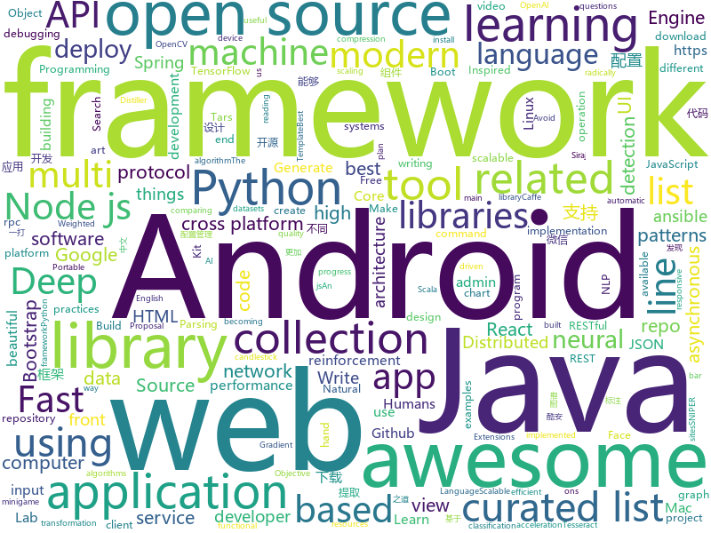

# 2018-06-27
See what the GitHub community is most excited about today.

## python
* [deda](https://github.com/dfd-tud/deda)(**169 stars today**): 
* [vibora](https://github.com/vibora-io/vibora)(**168 stars today**): Fast, asynchronous and elegant Python web framework.
* [instagram-scraper](https://github.com/meetmangukiya/instagram-scraper)(**125 stars today**): Scrape the Instagram frontend. Inspired from twitter-scraper by @kennethreitz.
* [learn_math_fast](https://github.com/llSourcell/learn_math_fast)(**124 stars today**): This is the Curriculum for "How to Learn Mathematics Fast" By Siraj Raval on Youtube
* [darts](https://github.com/quark0/darts)(**101 stars today**): Differentiable architecture search for convolutional and recurrent networks
* [coveragepy](https://github.com/nedbat/coveragepy)(**102 stars today**): Code coverage measurement for Python
* [models](https://github.com/tensorflow/models)(**76 stars today**): Models and examples built with TensorFlow
* [SalienCheat](https://github.com/SteamDatabase/SalienCheat)(**70 stars today**): 👽Cheating Salien minigame, the proper way
* [scalable_agent](https://github.com/deepmind/scalable_agent)(**82 stars today**): A TensorFlow implementation of Scalable Distributed Deep-RL with Importance Weighted Actor-Learner Architectures.
* [keras](https://github.com/keras-team/keras)(**40 stars today**): Deep Learning for humans
* [distiller](https://github.com/NervanaSystems/distiller)(**45 stars today**): Neural Network Distiller by Intel AI Lab: a Python package for neural network compression research.
* [public-apis](https://github.com/toddmotto/public-apis)(**45 stars today**): A collective list of public JSON APIs for use in web development.
* [emacs-application-framework](https://github.com/manateelazycat/emacs-application-framework)(**45 stars today**): Emacs application framework
* [Python-100-Days](https://github.com/jackfrued/Python-100-Days)(**38 stars today**): Python - 100天从新手到大师
* [awesome-python](https://github.com/vinta/awesome-python)(**37 stars today**): A curated list of awesome Python frameworks, libraries, software and resources
* [decaNLP](https://github.com/salesforce/decaNLP)(**38 stars today**): The Natural Language Decathlon: A Multitask Challenge for NLP
* [youtube-dl](https://github.com/rg3/youtube-dl)(**38 stars today**): Command-line program to download videos from YouTube.com and other video sites
* [SNIPER](https://github.com/mahyarnajibi/SNIPER)(**37 stars today**): SNIPER is an efficient multi-scale object detection algorithm
* [django](https://github.com/django/django)(**28 stars today**): The Web framework for perfectionists with deadlines.
* [scikit-learn](https://github.com/scikit-learn/scikit-learn)(**26 stars today**): scikit-learn: machine learning in Python
* [requests](https://github.com/requests/requests)(**29 stars today**): Python HTTP Requests for Humans™✨🍰✨
* [gym](https://github.com/openai/gym)(**27 stars today**): A toolkit for developing and comparing reinforcement learning algorithms.
* [ansible](https://github.com/ansible/ansible)(**22 stars today**): Ansible is a radically simple IT automation platform that makes your applications and systems easier to deploy. Avoid writing scripts or custom code to deploy and update your applications — automate in a language that approaches plain English, using SSH, with no agents to install on remote systems. https://docs.ansible.com/ansible/
* [baselines](https://github.com/openai/baselines)(**28 stars today**): OpenAI Baselines: high-quality implementations of reinforcement learning algorithms
* [flask](https://github.com/pallets/flask)(**26 stars today**): The Python micro framework for building web applications.

## java
* [Java-Interview](https://github.com/crossoverJie/Java-Interview)(**171 stars today**): 👨‍🎓Java related : basic, concurrent, algorithm
* [Android-Debug-Database](https://github.com/amitshekhariitbhu/Android-Debug-Database)(**152 stars today**): A library for debugging android databases and shared preferences - Make Debugging Great Again
* [CC](https://github.com/luckybilly/CC)(**65 stars today**): 业界首个支持渐进式组件化改造的Android组件化开源框架。Gradually componentize your android project.
* [proxyee-down](https://github.com/proxyee-down-org/proxyee-down)(**53 stars today**): http下载工具，基于http代理，支持多连接分块下载
* [java-design-patterns](https://github.com/iluwatar/java-design-patterns)(**52 stars today**): Design patterns implemented in Java
* [SaveState](https://github.com/PrototypeZ/SaveState)(**46 stars today**): 🍦Generate 'onSaveInstanceState' and 'onRestoreInstanceState' methods for your application automatically
* [spring-boot](https://github.com/spring-projects/spring-boot)(**40 stars today**): Spring Boot
* [AndroidUtilCode](https://github.com/Blankj/AndroidUtilCode)(**40 stars today**): 🔥Android developers should collect the following utils(updating).
* [elasticsearch](https://github.com/elastic/elasticsearch)(**37 stars today**): Open Source, Distributed, RESTful Search Engine
* [write-readable-code](https://github.com/biezhi/write-readable-code)(**42 stars today**): 🗾编写可读代码的艺术代码仓库
* [pragmatic-java-engineer](https://github.com/superhj1987/pragmatic-java-engineer)(**38 stars today**): Java工程师修炼之道 - 梳理Java知识体系，沓实架构基础
* [tutorials](https://github.com/eugenp/tutorials)(**23 stars today**): The "REST With Spring" Course:
* [apollo](https://github.com/ctripcorp/apollo)(**34 stars today**): Apollo（阿波罗）是携程框架部门研发的分布式配置中心，能够集中化管理应用不同环境、不同集群的配置，配置修改后能够实时推送到应用端，并且具备规范的权限、流程治理等特性，适用于微服务配置管理场景。
* [incubator-dubbo](https://github.com/apache/incubator-dubbo)(**29 stars today**): Apache Dubbo (incubating) is a high-performance, java based, open source RPC framework.
* [PlusMenu](https://github.com/DuShuYuan/PlusMenu)(**36 stars today**): 仿微博、酷安点击加号揭露动画弹出菜单+背景模糊效果
* [Signal-Android](https://github.com/signalapp/Signal-Android)(**31 stars today**): A private messenger for Android.
* [epoxy](https://github.com/airbnb/epoxy)(**32 stars today**): Epoxy is an Android library for building complex screens in a RecyclerView
* [weixin-java-tools](https://github.com/Wechat-Group/weixin-java-tools)(**30 stars today**): 可能是目前最好最全的微信Java开发工具包，支持包括微信支付、开放平台、小程序、企业号和公众号等的开发
* [spring-framework](https://github.com/spring-projects/spring-framework)(**27 stars today**): Spring Framework
* [MPAndroidChart](https://github.com/PhilJay/MPAndroidChart)(**27 stars today**): A powerful🚀Android chart view / graph view library, supporting line- bar- pie- radar- bubble- and candlestick charts as well as scaling, dragging and animations.
* [guava](https://github.com/google/guava)(**26 stars today**): Google core libraries for Java
* [HanLP](https://github.com/hankcs/HanLP)(**27 stars today**): 自然语言处理 中文分词 词性标注 命名实体识别 依存句法分析 关键词提取 新词发现 短语提取 自动摘要 文本分类 拼音简繁
* [NumberCodeView](https://github.com/linkaipeng/NumberCodeView)(**28 stars today**): A number input view which like input password in alipay or wechat pay.
* [RxJava](https://github.com/ReactiveX/RxJava)(**24 stars today**): RxJava – Reactive Extensions for the JVM – a library for composing asynchronous and event-based programs using observable sequences for the Java VM.
* [jslt](https://github.com/schibsted/jslt)(**25 stars today**): JSON query and transformation language

## unknown
* [NLP-progress](https://github.com/sebastianruder/NLP-progress)(**590 stars today**): Repository to track the progress in Natural Language Processing (NLP), including the datasets and the current state-of-the-art for the most common NLP tasks.
* [build-your-own-x](https://github.com/danistefanovic/build-your-own-x)(**157 stars today**): 🤓Build your own (insert technology here)
* [architect-awesome](https://github.com/xingshaocheng/architect-awesome)(**99 stars today**): 后端架构师技术图谱
* [openlogos](https://github.com/arasatasaygin/openlogos)(**92 stars today**): Free logos for open source projects
* [react-developer-roadmap](https://github.com/adam-golab/react-developer-roadmap)(**85 stars today**): Roadmap to becoming a React developer in 2018
* [Interview-Notebook](https://github.com/CyC2018/Interview-Notebook)(**74 stars today**): 📆准备秋招学习笔记
* [awesome](https://github.com/sindresorhus/awesome)(**79 stars today**): 😎Curated list of awesome lists
* [gitignore](https://github.com/github/gitignore)(**55 stars today**): A collection of useful .gitignore templates
* [contrib](https://github.com/watch-devtube/contrib)(**60 stars today**): DevTube contribution data.
* [coding-interview-university](https://github.com/jwasham/coding-interview-university)(**56 stars today**): A complete computer science study plan to become a software engineer.
* [Red-Teaming-Toolkit](https://github.com/infosecn1nja/Red-Teaming-Toolkit)(**56 stars today**): A collection of open source and commercial tools that aid in red team operations.
* [free-programming-books](https://github.com/EbookFoundation/free-programming-books)(**54 stars today**): 📚Freely available programming books
* [awesome-vue](https://github.com/vuejs/awesome-vue)(**58 stars today**): 🎉A curated list of awesome things related to Vue.js
* [awesome-flutter](https://github.com/Solido/awesome-flutter)(**45 stars today**): An awesome list that curates the best Flutter libraries, tools, tutorials, articles and more.
* [remote-working](https://github.com/greatghoul/remote-working)(**40 stars today**): 收集整理远程工作相关的资料
* [download](https://github.com/getlantern/download)(**33 stars today**): 蓝灯(Lantern)下载
* [android-architecture](https://github.com/googlesamples/android-architecture)(**29 stars today**): A collection of samples to discuss and showcase different architectural tools and patterns for Android apps.
* [nocode](https://github.com/kelseyhightower/nocode)(**30 stars today**): The best way to write secure and reliable applications. Write nothing; deploy nowhere.
* [awesome-cpp](https://github.com/fffaraz/awesome-cpp)(**25 stars today**): A curated list of awesome C++ (or C) frameworks, libraries, resources, and shiny things. Inspired by awesome-... stuff.
* [awesome-react](https://github.com/enaqx/awesome-react)(**25 stars today**): A collection of awesome things regarding React ecosystem.
* [microsoft-drop-ice](https://github.com/selfagency/microsoft-drop-ice)(**18 stars today**): Tell Microsoft to drop ICE as a client or lose us as GitHub users
* [awesome-design-patterns](https://github.com/DovAmir/awesome-design-patterns)(**24 stars today**): A curated list of software and architecture related design patterns.
* [Front-end-Developer-Interview-Questions](https://github.com/h5bp/Front-end-Developer-Interview-Questions)(**22 stars today**): A list of helpful front-end related questions you can use to interview potential candidates, test yourself or completely ignore.
* [nodebestpractices](https://github.com/i0natan/nodebestpractices)(**21 stars today**): The largest Node.JS best practices list (June 2018)
* [restful-api-design-references](https://github.com/aisuhua/restful-api-design-references)(**20 stars today**): RESTful API 设计参考文献列表，可帮助你更加彻底的了解REST风格的接口设计。

## c++
* [Tars](https://github.com/Tencent/Tars)(**130 stars today**): Tars is a highly performance rpc framework based on naming service using tars protocol and provides a semi-automatic operation platform.
* [tensorflow](https://github.com/tensorflow/tensorflow)(**100 stars today**): Computation using data flow graphs for scalable machine learning
* [devilution](https://github.com/galaxyhaxz/devilution)(**107 stars today**): Diablo devolved - magic behind the 1996 computer game
* [TSeer](https://github.com/Tencent/TSeer)(**54 stars today**): A high available service discovery & registration & fault-tolerance framework
* [electron](https://github.com/electron/electron)(**47 stars today**): Build cross platform desktop apps with JavaScript, HTML, and CSS
* [opencv](https://github.com/opencv/opencv)(**35 stars today**): Open Source Computer Vision Library
* [bitcoin](https://github.com/bitcoin/bitcoin)(**34 stars today**): Bitcoin Core integration/staging tree
* [pytorch](https://github.com/pytorch/pytorch)(**33 stars today**): Tensors and Dynamic neural networks in Python with strong GPU acceleration
* [tesseract](https://github.com/tesseract-ocr/tesseract)(**30 stars today**): Tesseract Open Source OCR Engine (main repository)
* [protobuf](https://github.com/google/protobuf)(**29 stars today**): Protocol Buffers - Google's data interchange format
* [openpose](https://github.com/CMU-Perceptual-Computing-Lab/openpose)(**31 stars today**): OpenPose: Real-time multi-person keypoint detection library for body, face, and hands estimation
* [aseprite](https://github.com/aseprite/aseprite)(**31 stars today**): Animated sprite editor & pixel art tool (Windows, macOS, Linux)
* [csv-parser](https://github.com/vincentlaucsb/csv-parser)(**29 stars today**): A modern C++ library for reading, writing, and analyzing CSV (and similar) files.
* [grpc](https://github.com/grpc/grpc)(**25 stars today**): The C based gRPC (C++, Python, Ruby, Objective-C, PHP, C#)
* [swift](https://github.com/apple/swift)(**22 stars today**): The Swift Programming Language
* [xgboost](https://github.com/dmlc/xgboost)(**19 stars today**): Scalable, Portable and Distributed Gradient Boosting (GBDT, GBRT or GBM) Library, for Python, R, Java, Scala, C++ and more. Runs on single machine, Hadoop, Spark, Flink and DataFlow
* [v8](https://github.com/v8/v8)(**19 stars today**): The official mirror of the V8 Git repository
* [envoy](https://github.com/envoyproxy/envoy)(**19 stars today**): C++ front/service proxy
* [aria2](https://github.com/aria2/aria2)(**20 stars today**): aria2 is a lightweight multi-protocol & multi-source, cross platform download utility operated in command-line. It supports HTTP/HTTPS, FTP, SFTP, BitTorrent and Metalink.
* [opencv4nodejs](https://github.com/justadudewhohacks/opencv4nodejs)(**20 stars today**): Asynchronous OpenCV 3.x nodejs bindings with JavaScript and TypeScript API, with examples for: Face Detection, Machine Learning, Deep Neural Nets, Hand Gesture Recognition, Object Tracking, Feature Matching, Image Histogram
* [membugtool](https://github.com/joxeankoret/membugtool)(**18 stars today**): A DBI tool to discover heap memory related bugs
* [json](https://github.com/nlohmann/json)(**16 stars today**): JSON for Modern C++
* [fmt](https://github.com/fmtlib/fmt)(**17 stars today**): A modern formatting library
* [caffe](https://github.com/BVLC/caffe)(**12 stars today**): Caffe: a fast open framework for deep learning.
* [nyaa-nodejs-demo](https://github.com/XadillaX/nyaa-nodejs-demo)(**17 stars today**): Source code of "Node.js: Let's Write a Dozen of C++ Add-ons". 《Node.js：来一打 C++ 扩展》随书源码。

## html
* [stream-ui-kit](https://github.com/htmlstreamofficial/stream-ui-kit)(**37 stars today**): Stream - UI Kit. A beautiful Open Source Bootstrap 4 UI Kit under MIT license for better web!
* [styleguide](https://github.com/google/styleguide)(**28 stars today**): Style guides for Google-originated open-source projects
* [douyin](https://github.com/lujqme/douyin)(**28 stars today**): 抖音 桌面版(WIn/Linux/Mac OS)
* [fastText](https://github.com/facebookresearch/fastText)(**26 stars today**): Library for fast text representation and classification.
* [capacitor](https://github.com/ionic-team/capacitor)(**23 stars today**): Build cross-platform Native Progressive Web Apps for iOS, Android, and the web⚡️
* [ecma402](https://github.com/tc39/ecma402)(**17 stars today**): Status, process, and documents for ECMA 402
* [awesome-mac](https://github.com/jaywcjlove/awesome-mac)(**15 stars today**):  This repo is a collection of awesome Mac applications and tools for developers and designers.
* [awesome-resume](https://github.com/resumejob/awesome-resume)(**16 stars today**): 包含简历常用例句
* [react-app-rewired](https://github.com/timarney/react-app-rewired)(**16 stars today**): Override create-react-app webpack configs without ejecting
* [requests-html](https://github.com/kennethreitz/requests-html)(**15 stars today**): Pythonic HTML Parsing for Humans™
* [learning-area](https://github.com/mdn/learning-area)(**7 stars today**): Github repo for the MDN Learning Area.
* [DanderSpritz_lab](https://github.com/francisck/DanderSpritz_lab)(**14 stars today**): A fully functional DanderSpritz lab in 2 commands
* [portainer](https://github.com/portainer/portainer)(**15 stars today**): Simple management UI for Docker
* [foundation-sites](https://github.com/zurb/foundation-sites)(**13 stars today**): The most advanced responsive front-end framework in the world. Quickly create prototypes and production code for sites that work on any kind of device.
* [js-xss](https://github.com/leizongmin/js-xss)(**13 stars today**): Sanitize untrusted HTML (to prevent XSS) with a configuration specified by a Whitelist
* [EIPs](https://github.com/ethereum/EIPs)(**10 stars today**): The Ethereum Improvement Proposal repository
* [Spoon-Knife](https://github.com/octocat/Spoon-Knife)(****): This repo is for demonstration purposes only.
* [coreui-free-bootstrap-admin-template](https://github.com/coreui/coreui-free-bootstrap-admin-template)(**11 stars today**): CoreUI is free bootstrap admin template
* [zenbot](https://github.com/DeviaVir/zenbot)(**9 stars today**): Zenbot is a command-line cryptocurrency trading bot using Node.js and MongoDB.
* [training-material](https://github.com/galaxyproject/training-material)(****): A collection of Galaxy-related training material
* [swagger-codegen](https://github.com/swagger-api/swagger-codegen)(**10 stars today**): swagger-codegen contains a template-driven engine to generate documentation, API clients and server stubs in different languages by parsing your OpenAPI / Swagger definition.
* [favorites-web](https://github.com/cloudfavorites/favorites-web)(**9 stars today**): 云收藏 Spring Boot 2.0 开源项目
* [Winds](https://github.com/GetStream/Winds)(**9 stars today**): A Beautiful Open Source RSS & Podcast App
* [gentelella](https://github.com/puikinsh/gentelella)(**8 stars today**): Free Bootstrap 3 Admin Template
* [WebFundamentals](https://github.com/google/WebFundamentals)(**7 stars today**): Best practices for modern web development

## WordCloud

