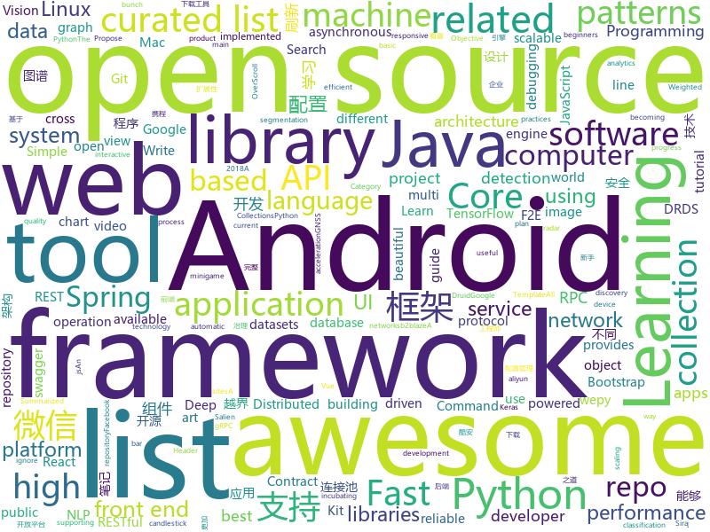

# 2018-06-28
See what the GitHub community is most excited about today.

## python
* [darts](https://github.com/quark0/darts)(**411 stars today**): Differentiable architecture search for convolutional and recurrent networks
* [b2blaze](https://github.com/sibblegp/b2blaze)(**367 stars today**): b2blaze
* [scalable_agent](https://github.com/deepmind/scalable_agent)(**195 stars today**): A TensorFlow implementation of Scalable Distributed Deep-RL with Importance Weighted Actor-Learner Architectures.
* [vibora](https://github.com/vibora-io/vibora)(**143 stars today**): Fast, asynchronous and elegant Python web framework.
* [SalienCheat](https://github.com/SteamDatabase/SalienCheat)(**62 stars today**): 👽Cheating Salien minigame, the proper way
* [deda](https://github.com/dfd-tud/deda)(**94 stars today**): 
* [models](https://github.com/tensorflow/models)(**59 stars today**): Models and examples built with TensorFlow
* [SNIPER](https://github.com/mahyarnajibi/SNIPER)(**66 stars today**): SNIPER is an efficient multi-scale object detection algorithm
* [keras](https://github.com/keras-team/keras)(**53 stars today**): Deep Learning for humans
* [public-apis](https://github.com/toddmotto/public-apis)(**52 stars today**): A collective list of public JSON APIs for use in web development.
* [LeetCode](https://github.com/apachecn/LeetCode)(**49 stars today**): LeetCode 面试题
* [learn_math_fast](https://github.com/llSourcell/learn_math_fast)(**48 stars today**): This is the Curriculum for "How to Learn Mathematics Fast" By Siraj Raval on Youtube
* [instagram-scraper](https://github.com/meetmangukiya/instagram-scraper)(**45 stars today**): Scrape the Instagram frontend. Inspired from twitter-scraper by @kennethreitz.
* [youtube-dl](https://github.com/rg3/youtube-dl)(**41 stars today**): Command-line program to download videos from YouTube.com and other video sites
* [awesome-python](https://github.com/vinta/awesome-python)(**39 stars today**): A curated list of awesome Python frameworks, libraries, software and resources
* [cmr](https://github.com/akanazawa/cmr)(**38 stars today**): Project repo for Learning Category-Specific Mesh Reconstruction from Image Collections
* [Python-100-Days](https://github.com/jackfrued/Python-100-Days)(**36 stars today**): Python - 100天从新手到大师
* [scikit-learn](https://github.com/scikit-learn/scikit-learn)(**27 stars today**): scikit-learn: machine learning in Python
* [django](https://github.com/django/django)(**30 stars today**): The Web framework for perfectionists with deadlines.
* [All-About-the-GAN](https://github.com/hollobit/All-About-the-GAN)(**33 stars today**): All About the GANs(Generative Adversarial Networks) - Summarized lists for GAN
* [flask](https://github.com/pallets/flask)(**28 stars today**): The Python micro framework for building web applications.
* [PyLogger](https://github.com/stoic1979/PyLogger)(**33 stars today**): A singleton logger that will be used globally by the project
* [face_recognition](https://github.com/ageitgey/face_recognition)(**28 stars today**): The world's simplest facial recognition api for Python and the command line
* [robovision](https://github.com/stoic1979/robovision)(**32 stars today**): AI and machine leaning-based computer vision for a robot
* [Mask_RCNN](https://github.com/matterport/Mask_RCNN)(**25 stars today**): Mask R-CNN for object detection and instance segmentation on Keras and TensorFlow

## java
* [Java-Interview](https://github.com/crossoverJie/Java-Interview)(**318 stars today**): 👨‍🎓Java related : basic, concurrent, algorithm
* [pragmatic-java-engineer](https://github.com/superhj1987/pragmatic-java-engineer)(**89 stars today**): Java工程师修炼之道 - 梳理Java知识体系，沓实架构基础
* [Android-Debug-Database](https://github.com/amitshekhariitbhu/Android-Debug-Database)(**63 stars today**): A library for debugging android databases and shared preferences - Make Debugging Great Again
* [java-design-patterns](https://github.com/iluwatar/java-design-patterns)(**53 stars today**): Design patterns implemented in Java
* [LazyKeyboard](https://github.com/onlyloveyd/LazyKeyboard)(**55 stars today**): 🔥🔥字母，符号，数字&自定义安全键盘🔥🔥
* [CC](https://github.com/luckybilly/CC)(**54 stars today**): 业界首个支持渐进式组件化改造的Android组件化开源框架。Gradually componentize your android project.
* [tutorials](https://github.com/eugenp/tutorials)(**36 stars today**): The "REST With Spring" Course:
* [spring-boot](https://github.com/spring-projects/spring-boot)(**41 stars today**): Spring Boot
* [poi-tl](https://github.com/Sayi/poi-tl)(**44 stars today**): Word模板引擎
* [proxyee-down](https://github.com/proxyee-down-org/proxyee-down)(**41 stars today**): http下载工具，基于http代理，支持多连接分块下载
* [PlusMenu](https://github.com/DuShuYuan/PlusMenu)(**39 stars today**): 仿微博、酷安点击加号揭露动画弹出菜单+背景模糊效果
* [CombineBitmap](https://github.com/Othershe/CombineBitmap)(**36 stars today**): Android 仿钉钉、微信 群聊组合头像
* [elasticsearch](https://github.com/elastic/elasticsearch)(**32 stars today**): Open Source, Distributed, RESTful Search Engine
* [incubator-dubbo](https://github.com/apache/incubator-dubbo)(**26 stars today**): Apache Dubbo (incubating) is a high-performance, java based, open source RPC framework.
* [spring-framework](https://github.com/spring-projects/spring-framework)(**26 stars today**): Spring Framework
* [apollo](https://github.com/ctripcorp/apollo)(**31 stars today**): Apollo（阿波罗）是携程框架部门研发的分布式配置中心，能够集中化管理应用不同环境、不同集群的配置，配置修改后能够实时推送到应用端，并且具备规范的权限、流程治理等特性，适用于微服务配置管理场景。
* [glide](https://github.com/bumptech/glide)(**30 stars today**): An image loading and caching library for Android focused on smooth scrolling
* [Java](https://github.com/TheAlgorithms/Java)(**28 stars today**): All Algorithms implemented in Java
* [druid](https://github.com/alibaba/druid)(**25 stars today**): ♨️为监控而生的数据库连接池！阿里云DRDS(https://www.aliyun.com/product/drds )、阿里巴巴TDDL 连接池powered by Druid
* [guava](https://github.com/google/guava)(**28 stars today**): Google core libraries for Java
* [netty](https://github.com/netty/netty)(**25 stars today**): Netty project - an event-driven asynchronous network application framework
* [MPAndroidChart](https://github.com/PhilJay/MPAndroidChart)(**26 stars today**): A powerful🚀Android chart view / graph view library, supporting line- bar- pie- radar- bubble- and candlestick charts as well as scaling, dragging and animations.
* [Signal-Android](https://github.com/signalapp/Signal-Android)(**27 stars today**): A private messenger for Android.
* [weixin-java-tools](https://github.com/Wechat-Group/weixin-java-tools)(**22 stars today**): 可能是目前最好最全的微信Java开发工具包，支持包括微信支付、开放平台、小程序、企业号和公众号等的开发
* [SmartRefreshLayout](https://github.com/scwang90/SmartRefreshLayout)(**20 stars today**): 🔥下拉刷新、上拉加载、二级刷新、淘宝二楼、RefreshLayout、OverScroll，Android智能下拉刷新框架，支持越界回弹、越界拖动，具有极强的扩展性，集成了几十种炫酷的Header和 Footer。

## unknown
* [NLP-progress](https://github.com/sebastianruder/NLP-progress)(**620 stars today**): Repository to track the progress in Natural Language Processing (NLP), including the datasets and the current state-of-the-art for the most common NLP tasks.
* [build-your-own-x](https://github.com/danistefanovic/build-your-own-x)(**129 stars today**): 🤓Build your own (insert technology here)
* [gitignore](https://github.com/github/gitignore)(**73 stars today**): A collection of useful .gitignore templates
* [Knowledge-Base](https://github.com/slowmist/Knowledge-Base)(**88 stars today**): Knowledge Base 慢雾安全团队知识库
* [Interview-Notebook](https://github.com/CyC2018/Interview-Notebook)(**72 stars today**): 📆准备秋招学习笔记
* [awesome](https://github.com/sindresorhus/awesome)(**75 stars today**): 😎Curated list of awesome lists
* [architect-awesome](https://github.com/xingshaocheng/architect-awesome)(**63 stars today**): 后端架构师技术图谱
* [free-programming-books](https://github.com/EbookFoundation/free-programming-books)(**61 stars today**): 📚Freely available programming books
* [linux-kernel-exploitation](https://github.com/xairy/linux-kernel-exploitation)(**65 stars today**): A bunch of links related to Linux kernel exploitation
* [openlogos](https://github.com/arasatasaygin/openlogos)(**64 stars today**): Free logos for open source projects
* [react-developer-roadmap](https://github.com/adam-golab/react-developer-roadmap)(**56 stars today**): Roadmap to becoming a React developer in 2018
* [coding-interview-university](https://github.com/jwasham/coding-interview-university)(**48 stars today**): A complete computer science study plan to become a software engineer.
* [awesome-design-patterns](https://github.com/DovAmir/awesome-design-patterns)(**50 stars today**): A curated list of software and architecture related design patterns.
* [awesome-vue](https://github.com/vuejs/awesome-vue)(**43 stars today**): 🎉A curated list of awesome things related to Vue.js
* [awesome-flutter](https://github.com/Solido/awesome-flutter)(**43 stars today**): An awesome list that curates the best Flutter libraries, tools, tutorials, articles and more.
* [ios-skills-matrix](https://github.com/BohdanOrlov/ios-skills-matrix)(**41 stars today**): iOS Developer Skills Matrix
* [Red-Teaming-Toolkit](https://github.com/infosecn1nja/Red-Teaming-Toolkit)(**37 stars today**): A collection of open source and commercial tools that aid in red team operations.
* [android-architecture](https://github.com/googlesamples/android-architecture)(**28 stars today**): A collection of samples to discuss and showcase different architectural tools and patterns for Android apps.
* [awesome-public-datasets](https://github.com/awesomedata/awesome-public-datasets)(**25 stars today**): A topic-centric list of high-quality open datasets in public domains. Propose NEW data ☛☛☛PR☛☛☛
* [nocode](https://github.com/kelseyhightower/nocode)(**25 stars today**): The best way to write secure and reliable applications. Write nothing; deploy nowhere.
* [awesome-for-beginners](https://github.com/MunGell/awesome-for-beginners)(**25 stars today**): A list of awesome beginners-friendly projects.
* [Front-end-Developer-Interview-Questions](https://github.com/h5bp/Front-end-Developer-Interview-Questions)(**25 stars today**): A list of helpful front-end related questions you can use to interview potential candidates, test yourself or completely ignore.
* [awesome-wepy](https://github.com/aben1188/awesome-wepy)(**23 stars today**): Awesome for wepy ! 微信小程序组件化开发框架wepy开发资源汇总
* [restful-api-design-references](https://github.com/aisuhua/restful-api-design-references)(**19 stars today**): RESTful API 设计参考文献列表，可帮助你更加彻底的了解REST风格的接口设计。
* [GHC-Core-Literature-Review](https://github.com/xnning/GHC-Core-Literature-Review)(**21 stars today**): Literature review of GHC's Core language, System FC

## c++
* [tensorflow](https://github.com/tensorflow/tensorflow)(**108 stars today**): Computation using data flow graphs for scalable machine learning
* [devilution](https://github.com/diasurgical/devilution)(**54 stars today**): Diablo devolved - magic behind the 1996 computer game
* [electron](https://github.com/electron/electron)(**49 stars today**): Build cross platform desktop apps with JavaScript, HTML, and CSS
* [opencv](https://github.com/opencv/opencv)(**38 stars today**): Open Source Computer Vision Library
* [Tars](https://github.com/Tencent/Tars)(**47 stars today**): Tars is a highly performance rpc framework based on naming service using tars protocol and provides a semi-automatic operation platform.
* [aseprite](https://github.com/aseprite/aseprite)(**48 stars today**): Animated sprite editor & pixel art tool (Windows, macOS, Linux)
* [protobuf](https://github.com/google/protobuf)(**42 stars today**): Protocol Buffers - Google's data interchange format
* [openpose](https://github.com/CMU-Perceptual-Computing-Lab/openpose)(**39 stars today**): OpenPose: Real-time multi-person keypoint detection library for body, face, and hands estimation
* [osquery](https://github.com/facebook/osquery)(**42 stars today**): SQL powered operating system instrumentation, monitoring, and analytics.
* [bitcoin](https://github.com/bitcoin/bitcoin)(**31 stars today**): Bitcoin Core integration/staging tree
* [pytorch](https://github.com/pytorch/pytorch)(**28 stars today**): Tensors and Dynamic neural networks in Python with strong GPU acceleration
* [gnss-sdr](https://github.com/gnss-sdr/gnss-sdr)(**29 stars today**): GNSS-SDR, an open source GNSS software defined receiver
* [tesseract](https://github.com/tesseract-ocr/tesseract)(**24 stars today**): Tesseract Open Source OCR Engine (main repository)
* [ThanatosDecryptor](https://github.com/Cisco-Talos/ThanatosDecryptor)(**25 stars today**): 
* [apollo](https://github.com/ApolloAuto/apollo)(**19 stars today**): An open autonomous driving platform
* [solidity](https://github.com/ethereum/solidity)(**20 stars today**): Solidity, the Contract-Oriented Programming Language
* [capnproto](https://github.com/capnproto/capnproto)(**21 stars today**): Cap'n Proto serialization/RPC system - core tools and C++ library
* [swift](https://github.com/apple/swift)(**18 stars today**): The Swift Programming Language
* [rocksdb](https://github.com/facebook/rocksdb)(**18 stars today**): A library that provides an embeddable, persistent key-value store for fast storage.
* [envoy](https://github.com/envoyproxy/envoy)(**18 stars today**): C++ front/service proxy
* [grpc](https://github.com/grpc/grpc)(**15 stars today**): The C based gRPC (C++, Python, Ruby, Objective-C, PHP, C#)
* [v8](https://github.com/v8/v8)(**17 stars today**): The official mirror of the V8 Git repository
* [mysql-5.6](https://github.com/facebook/mysql-5.6)(**17 stars today**): Facebook's branch of the Oracle MySQL v5.6 database. This includes MyRocks.
* [omr](https://github.com/eclipse/omr)(**17 stars today**): Eclipse OMR™ Cross platform components for building reliable, high performance language runtimes
* [TSeer](https://github.com/Tencent/TSeer)(**15 stars today**): A high available service discovery & registration & fault-tolerance framework

## html
* [awesome-resume](https://github.com/resumejob/awesome-resume)(**224 stars today**): 包含简历常用例句
* [react-from-zero](https://github.com/kay-is/react-from-zero)(**55 stars today**): A simple (99% ES2015 less) tutorial for React
* [mimic-bloomberg-menu-no-js](https://github.com/dosyago-coder-0/mimic-bloomberg-menu-no-js)(**43 stars today**): A mimic of the Bloomberg dropdown menu widget without JavaScript
* [douyin](https://github.com/lujqme/douyin)(**40 stars today**): 抖音 桌面版(WIn/Linux/Mac OS)
* [styleguide](https://github.com/google/styleguide)(**23 stars today**): Style guides for Google-originated open-source projects
* [interactive-machine-learning-list](https://github.com/stared/interactive-machine-learning-list)(**23 stars today**): A collaborative list of interactive Machine Learning, Deep Learning and Stats websites
* [awesome-mac](https://github.com/jaywcjlove/awesome-mac)(**21 stars today**):  This repo is a collection of awesome Mac applications and tools for developers and designers.
* [knowledge](https://github.com/f2e-awesome/knowledge)(**20 stars today**): 文档着重构建一个完整的「前端技术架构图谱」，方便 F2E(Front End Engineering又称FEE、F2E) 学习与进阶。
* [reactpatterns.com](https://github.com/chantastic/reactpatterns.com)(**21 stars today**): Patterns for React Developers
* [stream-ui-kit](https://github.com/htmlstreamofficial/stream-ui-kit)(**19 stars today**): Stream - UI Kit. A beautiful Open Source Bootstrap 4 UI Kit under MIT license for better web!
* [fastText](https://github.com/facebookresearch/fastText)(**16 stars today**): Library for fast text representation and classification.
* [Coursera-ML-AndrewNg-Notes](https://github.com/fengdu78/Coursera-ML-AndrewNg-Notes)(**15 stars today**): 吴恩达老师的机器学习课程个人笔记
* [Spoon-Knife](https://github.com/octocat/Spoon-Knife)(****): This repo is for demonstration purposes only.
* [swagger-codegen](https://github.com/swagger-api/swagger-codegen)(**14 stars today**): swagger-codegen contains a template-driven engine to generate documentation, API clients and server stubs in different languages by parsing your OpenAPI / Swagger definition.
* [gentelella](https://github.com/puikinsh/gentelella)(**13 stars today**): Free Bootstrap 3 Admin Template
* [patchwork](https://github.com/jlord/patchwork)(****): All the Git-it Workshop completers!
* [portainer](https://github.com/portainer/portainer)(**14 stars today**): Simple management UI for Docker
* [Winds](https://github.com/GetStream/Winds)(**13 stars today**): A Beautiful Open Source RSS & Podcast App
* [smart-contract-best-practices](https://github.com/ConsenSys/smart-contract-best-practices)(**11 stars today**): A guide to smart contract security best practices
* [favorites-web](https://github.com/cloudfavorites/favorites-web)(**11 stars today**): 云收藏 Spring Boot 2.0 开源项目
* [EIPs](https://github.com/ethereum/EIPs)(**11 stars today**): The Ethereum Improvement Proposal repository
* [polymer](https://github.com/Polymer/polymer)(**11 stars today**): Build modern apps using web components
* [foundation-sites](https://github.com/zurb/foundation-sites)(**9 stars today**): The most advanced responsive front-end framework in the world. Quickly create prototypes and production code for sites that work on any kind of device.
* [learning-area](https://github.com/mdn/learning-area)(**6 stars today**): Github repo for the MDN Learning Area.
* [ecma262](https://github.com/tc39/ecma262)(**8 stars today**): Status, process, and documents for ECMA262

## WordCloud

