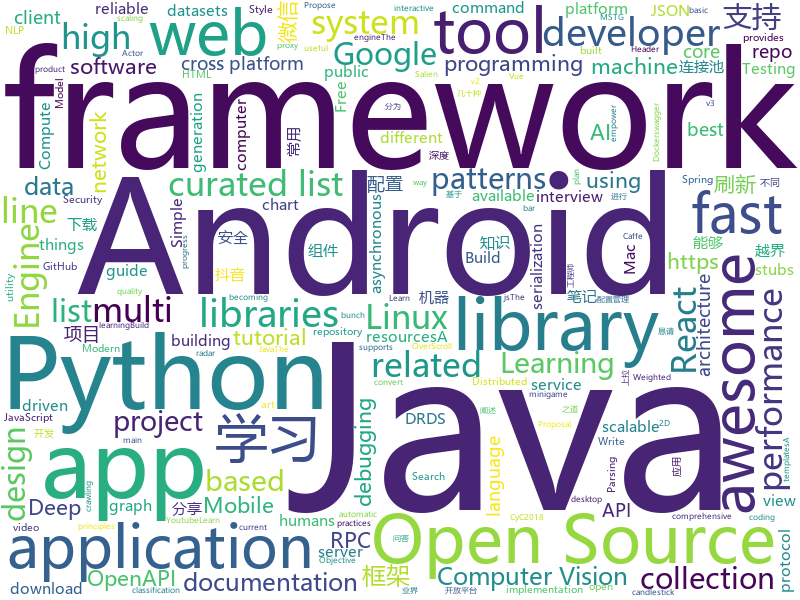

# 2018-06-29
See what the GitHub community is most excited about today.

## python
* [darts](https://github.com/quark0/darts)(**212 stars today**): Differentiable architecture search for convolutional and recurrent networks
* [vibora](https://github.com/vibora-io/vibora)(**139 stars today**): Fast, asynchronous and elegant Python web framework.
* [b2blaze](https://github.com/sibblegp/b2blaze)(**118 stars today**): b2blaze
* [Magic-Unicorn-Tool](https://github.com/LMGsec/Magic-Unicorn-Tool)(**97 stars today**): 
* [HelloGitHub](https://github.com/521xueweihan/HelloGitHub)(**89 stars today**): 分享 GitHub 上好玩、容易上手的项目，帮你找到编程的乐趣。欢迎推荐、自荐项目，让更多人知道你的项目⭐️
* [models](https://github.com/tensorflow/models)(**61 stars today**): Models and examples built with TensorFlow
* [keras](https://github.com/keras-team/keras)(**60 stars today**): Deep Learning for humans
* [SalienCheat](https://github.com/SteamDatabase/SalienCheat)(**51 stars today**): 👽Cheating Salien minigame, the proper way
* [scalable_agent](https://github.com/deepmind/scalable_agent)(**49 stars today**): A TensorFlow implementation of Scalable Distributed Deep-RL with Importance Weighted Actor-Learner Architectures.
* [awesome-python](https://github.com/vinta/awesome-python)(**44 stars today**): A curated list of awesome Python frameworks, libraries, software and resources
* [deda](https://github.com/dfd-tud/deda)(**49 stars today**): 
* [ImageAI](https://github.com/OlafenwaMoses/ImageAI)(**45 stars today**): A python library built to empower developers to build applications and systems with self-contained Computer Vision capabilities
* [django](https://github.com/django/django)(**37 stars today**): The Web framework for perfectionists with deadlines.
* [cpython](https://github.com/python/cpython)(**32 stars today**): The Python programming language
* [youtube-dl](https://github.com/rg3/youtube-dl)(**40 stars today**): Command-line program to download videos from YouTube.com and other video sites
* [flask](https://github.com/pallets/flask)(**36 stars today**): The Python micro framework for building web applications.
* [robovision](https://github.com/stoic1979/robovision)(**37 stars today**): AI and machine leaning-based computer vision for a robot
* [public-apis](https://github.com/toddmotto/public-apis)(**32 stars today**): A collective list of public JSON APIs for use in web development.
* [learn_math_fast](https://github.com/llSourcell/learn_math_fast)(**36 stars today**): This is the Curriculum for "How to Learn Mathematics Fast" By Siraj Raval on Youtube
* [system-design-primer](https://github.com/donnemartin/system-design-primer)(**34 stars today**): Learn how to design large-scale systems. Prep for the system design interview. Includes Anki flashcards.
* [instagram-scraper](https://github.com/meetmangukiya/instagram-scraper)(**32 stars today**): Scrape the Instagram frontend. Inspired from twitter-scraper by @kennethreitz.
* [DCNets](https://github.com/wy1iu/DCNets)(**31 stars today**): Implementation for <Decoupled Networks> in CVPR'18.
* [coveragepy](https://github.com/nedbat/coveragepy)(**33 stars today**): Code coverage measurement for Python
* [scrapy](https://github.com/scrapy/scrapy)(**28 stars today**): Scrapy, a fast high-level web crawling & scraping framework for Python.
* [LeetCode](https://github.com/apachecn/LeetCode)(**29 stars today**): LeetCode 面试题

## java
* [Java-Interview](https://github.com/crossoverJie/Java-Interview)(**199 stars today**): 👨‍🎓Java related : basic, concurrent, algorithm
* [CombineBitmap](https://github.com/Othershe/CombineBitmap)(**112 stars today**): Android 仿钉钉、微信 群聊组合头像
* [pandora](https://github.com/whataa/pandora)(**75 stars today**): an android library for debugging what we care about directly in app.
* [proxyee-down](https://github.com/proxyee-down-org/proxyee-down)(**54 stars today**): http下载工具，基于http代理，支持多连接分块下载
* [pragmatic-java-engineer](https://github.com/superhj1987/pragmatic-java-engineer)(**52 stars today**): Java工程师修炼之道 - 梳理Java知识体系，沓实架构基础
* [LazyKeyboard](https://github.com/onlyloveyd/LazyKeyboard)(**57 stars today**): 🔥🔥字母，符号，数字&自定义安全键盘🔥🔥
* [AndroidUtilCode](https://github.com/Blankj/AndroidUtilCode)(**47 stars today**): 🔥Android developers should collect the following utils(updating).
* [spring-boot](https://github.com/spring-projects/spring-boot)(**40 stars today**): Spring Boot
* [java-design-patterns](https://github.com/iluwatar/java-design-patterns)(**39 stars today**): Design patterns implemented in Java
* [tutorials](https://github.com/eugenp/tutorials)(**26 stars today**): The "REST With Spring" Course:
* [weixin-java-tools](https://github.com/Wechat-Group/weixin-java-tools)(**35 stars today**): 可能是目前最好最全的微信Java开发工具包，支持包括微信支付、开放平台、小程序、企业号和公众号等的开发
* [vjtools](https://github.com/vipshop/vjtools)(**34 stars today**): The vip.com's java coding standard, libraries and tools
* [Android-Debug-Database](https://github.com/amitshekhariitbhu/Android-Debug-Database)(**37 stars today**): A library for debugging android databases and shared preferences - Make Debugging Great Again
* [incubator-dubbo](https://github.com/apache/incubator-dubbo)(**26 stars today**): Apache Dubbo (incubating) is a high-performance, java based, open source RPC framework.
* [elasticsearch](https://github.com/elastic/elasticsearch)(**27 stars today**): Open Source, Distributed, RESTful Search Engine
* [MPAndroidChart](https://github.com/PhilJay/MPAndroidChart)(**30 stars today**): A powerful🚀Android chart view / graph view library, supporting line- bar- pie- radar- bubble- and candlestick charts as well as scaling, dragging and animations.
* [SmartRefreshLayout](https://github.com/scwang90/SmartRefreshLayout)(**25 stars today**): 🔥下拉刷新、上拉加载、二级刷新、淘宝二楼、RefreshLayout、OverScroll，Android智能下拉刷新框架，支持越界回弹、越界拖动，具有极强的扩展性，集成了几十种炫酷的Header和 Footer。
* [okhttp](https://github.com/square/okhttp)(**28 stars today**): An HTTP+HTTP/2 client for Android and Java applications.
* [netty](https://github.com/netty/netty)(**27 stars today**): Netty project - an event-driven asynchronous network application framework
* [douyin-downloader](https://github.com/fly-studio/douyin-downloader)(**29 stars today**): 抖音分享到本APP，自动下载【无水印】的视频
* [guava](https://github.com/google/guava)(**26 stars today**): Google core libraries for Java
* [druid](https://github.com/alibaba/druid)(**23 stars today**): ♨️为监控而生的数据库连接池！阿里云DRDS(https://www.aliyun.com/product/drds )、阿里巴巴TDDL 连接池powered by Druid
* [spring-framework](https://github.com/spring-projects/spring-framework)(**21 stars today**): Spring Framework
* [apollo](https://github.com/ctripcorp/apollo)(**24 stars today**): Apollo（阿波罗）是携程框架部门研发的分布式配置中心，能够集中化管理应用不同环境、不同集群的配置，配置修改后能够实时推送到应用端，并且具备规范的权限、流程治理等特性，适用于微服务配置管理场景。
* [CC](https://github.com/luckybilly/CC)(**23 stars today**): 业界首个支持渐进式组件化改造的Android组件化开源框架。Componentize your android project gradually.

## unknown
* [NLP-progress](https://github.com/sebastianruder/NLP-progress)(**428 stars today**): Repository to track the progress in Natural Language Processing (NLP), including the datasets and the current state-of-the-art for the most common NLP tasks.
* [gitignore](https://github.com/github/gitignore)(**123 stars today**): A collection of useful .gitignore templates
* [linux-kernel-exploitation](https://github.com/xairy/linux-kernel-exploitation)(**137 stars today**): A bunch of links related to Linux kernel exploitation
* [build-your-own-x](https://github.com/danistefanovic/build-your-own-x)(**130 stars today**): 🤓Build your own (insert technology here)
* [Interview-Notebook](https://github.com/CyC2018/Interview-Notebook)(**72 stars today**): 📆准备秋招学习笔记
* [Knowledge-Base](https://github.com/slowmist/Knowledge-Base)(**75 stars today**): Knowledge Base 慢雾安全团队知识库
* [architect-awesome](https://github.com/xingshaocheng/architect-awesome)(**60 stars today**): 后端架构师技术图谱
* [ios-skills-matrix](https://github.com/BohdanOrlov/ios-skills-matrix)(**67 stars today**): iOS Developer Skills Matrix
* [awesome](https://github.com/sindresorhus/awesome)(**64 stars today**): 😎Curated list of awesome lists
* [coding-interview-university](https://github.com/jwasham/coding-interview-university)(**57 stars today**): A complete computer science study plan to become a software engineer.
* [Interview-Notebook-PDF](https://github.com/sjsdfg/Interview-Notebook-PDF)(**53 stars today**): https://github.com/CyC2018/Interview-Notebook PDF版本离线阅读
* [awesome-design-patterns](https://github.com/DovAmir/awesome-design-patterns)(**56 stars today**): A curated list of software and architecture related design patterns.
* [free-programming-books](https://github.com/EbookFoundation/free-programming-books)(**52 stars today**): 📚Freely available programming books
* [awesome-vue](https://github.com/vuejs/awesome-vue)(**49 stars today**): 🎉A curated list of awesome things related to Vue.js
* [nocode](https://github.com/kelseyhightower/nocode)(**34 stars today**): The best way to write secure and reliable applications. Write nothing; deploy nowhere.
* [awesome-flutter](https://github.com/Solido/awesome-flutter)(**33 stars today**): An awesome list that curates the best Flutter libraries, tools, tutorials, articles and more.
* [mace-models](https://github.com/XiaoMi/mace-models)(**32 stars today**): Mobile AI Compute Engine Model Zoo
* [DeepLearning-500-questions](https://github.com/scutan90/DeepLearning-500-questions)(**32 stars today**): 深度学习500问，以问答形式对常用的概率知识、线性代数、机器学习、深度学习、计算机视觉等热点问题进行阐述，以帮助自己及有需要的读者。 全书分为15个章节，近20万字。由于水平有限，书中不妥之处恳请广大读者批评指正。 未完待续............ Tan 2018.06
* [openlogos](https://github.com/arasatasaygin/openlogos)(**31 stars today**): Free logos for open source projects
* [awesome-nodejs](https://github.com/sindresorhus/awesome-nodejs)(**28 stars today**): ⚡️Delightful Node.js packages and resources
* [awesome-public-datasets](https://github.com/awesomedata/awesome-public-datasets)(**30 stars today**): A topic-centric list of high-quality open datasets in public domains. Propose NEW data ☛☛☛PR☛☛☛
* [android-architecture](https://github.com/googlesamples/android-architecture)(**25 stars today**): A collection of samples to discuss and showcase different architectural tools and patterns for Android apps.
* [awesome-react](https://github.com/enaqx/awesome-react)(**27 stars today**): A collection of awesome things regarding React ecosystem.
* [react-developer-roadmap](https://github.com/adam-golab/react-developer-roadmap)(**25 stars today**): Roadmap to becoming a React developer in 2018
* [proposals](https://github.com/tc39/proposals)(**25 stars today**): Tracking ECMAScript Proposals

## c++
* [mace](https://github.com/XiaoMi/mace)(**604 stars today**): Mobile AI Compute Engine
* [tensorflow](https://github.com/tensorflow/tensorflow)(**110 stars today**): Computation using data flow graphs for scalable machine learning
* [electron](https://github.com/electron/electron)(**52 stars today**): Build cross platform desktop apps with JavaScript, HTML, and CSS
* [protobuf](https://github.com/google/protobuf)(**41 stars today**): Protocol Buffers - Google's data interchange format
* [pytorch](https://github.com/pytorch/pytorch)(**41 stars today**): Tensors and Dynamic neural networks in Python with strong GPU acceleration
* [openpose](https://github.com/CMU-Perceptual-Computing-Lab/openpose)(**34 stars today**): OpenPose: Real-time multi-person keypoint detection library for body, face, and hands estimation
* [aseprite](https://github.com/aseprite/aseprite)(**36 stars today**): Animated sprite editor & pixel art tool (Windows, macOS, Linux)
* [opencv](https://github.com/opencv/opencv)(**27 stars today**): Open Source Computer Vision Library
* [devilution](https://github.com/diasurgical/devilution)(**32 stars today**): Diablo devolved - magic behind the 1996 computer game
* [bitcoin](https://github.com/bitcoin/bitcoin)(**29 stars today**): Bitcoin Core integration/staging tree
* [omr](https://github.com/eclipse/omr)(**26 stars today**): Eclipse OMR™ Cross platform components for building reliable, high performance language runtimes
* [Tars](https://github.com/Tencent/Tars)(**22 stars today**): Tars is a highly performance rpc framework based on naming service using tars protocol and provides a semi-automatic operation platform.
* [tesseract](https://github.com/tesseract-ocr/tesseract)(**23 stars today**): Tesseract Open Source OCR Engine (main repository)
* [caffe](https://github.com/BVLC/caffe)(**10 stars today**): Caffe: a fast open framework for deep learning.
* [godot](https://github.com/godotengine/godot)(**20 stars today**): Godot Engine – Multi-platform 2D and 3D game engine
* [v8](https://github.com/v8/v8)(**20 stars today**): The official mirror of the V8 Git repository
* [grpc](https://github.com/grpc/grpc)(**18 stars today**): The C based gRPC (C++, Python, Ruby, Objective-C, PHP, C#)
* [imgui](https://github.com/ocornut/imgui)(**18 stars today**): Dear ImGui: Bloat-free Immediate Mode Graphical User interface for C++ with minimal dependencies
* [rocksdb](https://github.com/facebook/rocksdb)(**17 stars today**): A library that provides an embeddable, persistent key-value store for fast storage.
* [capnproto](https://github.com/capnproto/capnproto)(**16 stars today**): Cap'n Proto serialization/RPC system - core tools and C++ library
* [swift](https://github.com/apple/swift)(**14 stars today**): The Swift Programming Language
* [BOLT](https://github.com/facebookincubator/BOLT)(**16 stars today**): Binary Optimization and Layout Tool - A linux command-line utility used for optimizing performance of binaries
* [envoy](https://github.com/envoyproxy/envoy)(**16 stars today**): C++ front/service proxy
* [modern-cpp-tutorial](https://github.com/changkun/modern-cpp-tutorial)(**15 stars today**): 📚C++11/14/17 On the Fly
* [aria2](https://github.com/aria2/aria2)(**15 stars today**): aria2 is a lightweight multi-protocol & multi-source, cross platform download utility operated in command-line. It supports HTTP/HTTPS, FTP, SFTP, BitTorrent and Metalink.

## html
* [react-from-zero](https://github.com/kay-is/react-from-zero)(**369 stars today**): A simple (99% ES2015 less) tutorial for React
* [awesome-resume](https://github.com/resumejob/awesome-resume)(**149 stars today**): 包含简历常用例句
* [douyin](https://github.com/lujqme/douyin)(**36 stars today**): 抖音 桌面版(WIn/Linux/Mac OS)
* [styleguide](https://github.com/google/styleguide)(**27 stars today**): Style guides for Google-originated open-source projects
* [awesome-mac](https://github.com/jaywcjlove/awesome-mac)(**26 stars today**):  This repo is a collection of awesome Mac applications and tools for developers and designers.
* [javascript-tutorial-en](https://github.com/iliakan/javascript-tutorial-en)(**22 stars today**): Modern JavaScript Tutorial
* [mastering-modular-javascript](https://github.com/mjavascript/mastering-modular-javascript)(**24 stars today**): 📦Module thinking, principles, design patterns and best practices.
* [website](https://github.com/kubernetes/website)(**15 stars today**): Kubernetes website and documentation repo:
* [interactive-machine-learning-list](https://github.com/stared/interactive-machine-learning-list)(**17 stars today**): A collaborative list of interactive Machine Learning, Deep Learning and Stats websites
* [fastText](https://github.com/facebookresearch/fastText)(**15 stars today**): Library for fast text representation and classification.
* [portainer](https://github.com/portainer/portainer)(**16 stars today**): Simple management UI for Docker
* [swagger-codegen](https://github.com/swagger-api/swagger-codegen)(**13 stars today**): swagger-codegen contains a template-driven engine to generate documentation, API clients and server stubs in different languages by parsing your OpenAPI / Swagger definition.
* [Coursera-ML-AndrewNg-Notes](https://github.com/fengdu78/Coursera-ML-AndrewNg-Notes)(**12 stars today**): 吴恩达老师的机器学习课程个人笔记
* [Spoon-Knife](https://github.com/octocat/Spoon-Knife)(****): This repo is for demonstration purposes only.
* [openapi-generator](https://github.com/OpenAPITools/openapi-generator)(**13 stars today**): OpenAPI Generator allows generation of API client libraries (SDK generation), server stubs, documentation and configuration automatically given an OpenAPI Spec (v2, v3)
* [react-app-rewired](https://github.com/timarney/react-app-rewired)(**12 stars today**): Override create-react-app webpack configs without ejecting
* [EIPs](https://github.com/ethereum/EIPs)(**10 stars today**): The Ethereum Improvement Proposal repository
* [frontend-nanodegree-styleguide](https://github.com/udacity/frontend-nanodegree-styleguide)(****): Official FEND style guides
* [Winds](https://github.com/GetStream/Winds)(**11 stars today**): A Beautiful Open Source RSS & Podcast App
* [fonts](https://github.com/google/fonts)(**11 stars today**): Font files available from Google Fonts
* [polymer](https://github.com/Polymer/polymer)(**11 stars today**): Build modern apps using web components
* [gson](https://github.com/google/gson)(**10 stars today**): A Java serialization/deserialization library to convert Java Objects into JSON and back
* [owasp-mstg](https://github.com/OWASP/owasp-mstg)(**9 stars today**): The Mobile Security Testing Guide (MSTG) is a comprehensive manual for mobile app security testing and reverse engineering.
* [ecma262](https://github.com/tc39/ecma262)(**9 stars today**): Status, process, and documents for ECMA262
* [requests-html](https://github.com/kennethreitz/requests-html)(**9 stars today**): Pythonic HTML Parsing for Humans™

## WordCloud

