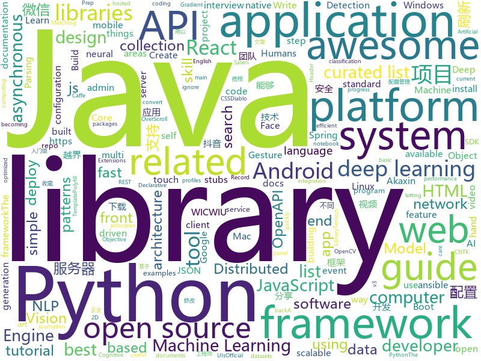

# 2018-06-30
See what the GitHub community is most excited about today.

## python
* [vibora](https://github.com/vibora-io/vibora)(**129 stars today**): Fast, asynchronous and elegant Python web framework.
* [darts](https://github.com/quark0/darts)(**107 stars today**): Differentiable architecture search for convolutional and recurrent networks
* [HelloGitHub](https://github.com/521xueweihan/HelloGitHub)(**79 stars today**): 分享 GitHub 上好玩、容易上手的项目，帮你找到编程的乐趣。欢迎推荐、自荐项目，让更多人知道你的项目⭐️
* [models](https://github.com/tensorflow/models)(**56 stars today**): Models and examples built with TensorFlow
* [world-models](https://github.com/ctallec/world-models)(**68 stars today**): Reimplementation of World-Models (Ha and Schmidhuber 2018) in pytorch
* [faceai](https://github.com/vipstone/faceai)(**62 stars today**): 一款入门级的人脸、视频、文字检测以及识别的项目.
* [SalienCheat](https://github.com/SteamDatabase/SalienCheat)(**44 stars today**): 👽Cheating Salien minigame, the proper way
* [coveragepy](https://github.com/nedbat/coveragepy)(**57 stars today**): Code coverage measurement for Python
* [alexa-skills-kit-sdk-for-python](https://github.com/alexa-labs/alexa-skills-kit-sdk-for-python)(**52 stars today**): The Alexa Skills Kit SDK for Python (Beta) helps you get a skill up and running quickly, letting you focus on skill logic instead of boilerplate code.
* [public-apis](https://github.com/toddmotto/public-apis)(**46 stars today**): A collective list of public JSON APIs for use in web development.
* [Artificial-Intelligence-Deep-Learning-Machine-Learning-Tutorials](https://github.com/TarrySingh/Artificial-Intelligence-Deep-Learning-Machine-Learning-Tutorials)(**36 stars today**): A comprehensive list of Deep Learning / Artificial Intelligence and Machine Learning tutorials - rapidly expanding into areas of AI/Deep Learning / Machine Vision / NLP and industry specific areas such as Automotives, Retail, Pharma, Medicine, Healthcare by Tarry Singh until at-least 2020 until he finishes his Ph.D. (which might end up being int…
* [ImageAI](https://github.com/OlafenwaMoses/ImageAI)(**43 stars today**): A python library built to empower developers to build applications and systems with self-contained Computer Vision capabilities
* [awesome-python](https://github.com/vinta/awesome-python)(**39 stars today**): A curated list of awesome Python frameworks, libraries, software and resources
* [requests](https://github.com/requests/requests)(**38 stars today**): Python HTTP Requests for Humans™✨🍰✨
* [Magic-Unicorn-Tool](https://github.com/LMGsec/Magic-Unicorn-Tool)(**36 stars today**): 
* [flask](https://github.com/pallets/flask)(**35 stars today**): The Python micro framework for building web applications.
* [termtosvg](https://github.com/nbedos/termtosvg)(**38 stars today**): Record terminal sessions as SVG animations
* [Python-100-Days](https://github.com/jackfrued/Python-100-Days)(**31 stars today**): Python - 100天从新手到大师
* [django](https://github.com/django/django)(**30 stars today**): The Web framework for perfectionists with deadlines.
* [youtube-dl](https://github.com/rg3/youtube-dl)(**34 stars today**): Command-line program to download videos from YouTube.com and other video sites
* [keras](https://github.com/keras-team/keras)(**29 stars today**): Deep Learning for humans
* [ansible](https://github.com/ansible/ansible)(**25 stars today**): Ansible is a radically simple IT automation platform that makes your applications and systems easier to deploy. Avoid writing scripts or custom code to deploy and update your applications — automate in a language that approaches plain English, using SSH, with no agents to install on remote systems. https://docs.ansible.com/ansible/
* [system-design-primer](https://github.com/donnemartin/system-design-primer)(**27 stars today**): Learn how to design large-scale systems. Prep for the system design interview. Includes Anki flashcards.
* [scikit-learn](https://github.com/scikit-learn/scikit-learn)(**26 stars today**): scikit-learn: machine learning in Python
* [scalable_agent](https://github.com/deepmind/scalable_agent)(**28 stars today**): A TensorFlow implementation of Scalable Distributed Deep-RL with Importance Weighted Actor-Learner Architectures.

## java
* [Java-Interview](https://github.com/crossoverJie/Java-Interview)(**341 stars today**): 👨‍🎓Java related : basic, concurrent, algorithm
* [CombineBitmap](https://github.com/Othershe/CombineBitmap)(**118 stars today**): Android 仿钉钉、微信 群聊组合头像
* [pandora](https://github.com/whataa/pandora)(**66 stars today**): an android library for debugging what we care about directly in app.
* [bugsnag-android](https://github.com/bugsnag/bugsnag-android)(**60 stars today**): Bugsnag crash reporting for Android apps
* [java-design-patterns](https://github.com/iluwatar/java-design-patterns)(**46 stars today**): Design patterns implemented in Java
* [spring-boot](https://github.com/spring-projects/spring-boot)(**36 stars today**): Spring Boot
* [douyin-downloader](https://github.com/fly-studio/douyin-downloader)(**42 stars today**): 抖音分享到本APP，自动下载【无水印】的视频
* [pragmatic-java-engineer](https://github.com/superhj1987/pragmatic-java-engineer)(**41 stars today**): Java工程师修炼之道 - 梳理Java知识体系，沓实架构基础
* [proxyee-down](https://github.com/proxyee-down-org/proxyee-down)(**38 stars today**): http下载工具，基于http代理，支持多连接分块下载
* [openzaly](https://github.com/akaxincom/openzaly)(**40 stars today**): openzaly 是 Akaxin 的服务器源代码，用以搭建私有聊天服务器。 服务器安装教程：https://www.akaxin.com/docs/install/index.html QQ群: 655249600
* [incubator-dubbo](https://github.com/apache/incubator-dubbo)(**32 stars today**): Apache Dubbo (incubating) is a high-performance, java based, open source RPC framework.
* [LazyKeyboard](https://github.com/onlyloveyd/LazyKeyboard)(**35 stars today**): 🔥🔥字母，符号，数字&自定义安全键盘🔥🔥
* [AndroidUtilCode](https://github.com/Blankj/AndroidUtilCode)(**29 stars today**): 🔥Android developers should collect the following utils(updating).
* [RxJava](https://github.com/ReactiveX/RxJava)(**30 stars today**): RxJava – Reactive Extensions for the JVM – a library for composing asynchronous and event-based programs using observable sequences for the Java VM.
* [SmartRefreshLayout](https://github.com/scwang90/SmartRefreshLayout)(**27 stars today**): 🔥下拉刷新、上拉加载、二级刷新、淘宝二楼、RefreshLayout、OverScroll，Android智能下拉刷新框架，支持越界回弹、越界拖动，具有极强的扩展性，集成了几十种炫酷的Header和 Footer。
* [elasticsearch](https://github.com/elastic/elasticsearch)(**26 stars today**): Open Source, Distributed, RESTful Search Engine
* [lottie-android](https://github.com/airbnb/lottie-android)(**28 stars today**): Render After Effects animations natively on Android and iOS, Web, and React Native
* [guava](https://github.com/google/guava)(**27 stars today**): Google core libraries for Java
* [weixin-java-tools](https://github.com/Wechat-Group/weixin-java-tools)(**23 stars today**): 可能是目前最好最全的微信Java开发工具包，支持包括微信支付、开放平台、小程序、企业号和公众号等的开发
* [react-native-gesture-handler](https://github.com/kmagiera/react-native-gesture-handler)(**25 stars today**): Declarative API exposing platform native touch and gesture system to React Native.
* [netty](https://github.com/netty/netty)(**23 stars today**): Netty project - an event-driven asynchronous network application framework
* [tutorials](https://github.com/eugenp/tutorials)(**14 stars today**): The "REST With Spring" Course:
* [apollo](https://github.com/ctripcorp/apollo)(**20 stars today**): Apollo（阿波罗）是携程框架部门研发的分布式配置中心，能够集中化管理应用不同环境、不同集群的配置，配置修改后能够实时推送到应用端，并且具备规范的权限、流程治理等特性，适用于微服务配置管理场景。
* [eureka](https://github.com/Netflix/eureka)(**19 stars today**): AWS Service registry for resilient mid-tier load balancing and failover.
* [vjtools](https://github.com/vipshop/vjtools)(**22 stars today**): The vip.com's java coding standard, libraries and tools

## unknown
* [NLP-progress](https://github.com/sebastianruder/NLP-progress)(**218 stars today**): Repository to track the progress in Natural Language Processing (NLP), including the datasets and the current state-of-the-art for the most common NLP tasks.
* [build-your-own-x](https://github.com/danistefanovic/build-your-own-x)(**114 stars today**): 🤓Build your own (insert technology here)
* [gitignore](https://github.com/github/gitignore)(**101 stars today**): A collection of useful .gitignore templates
* [linux-kernel-exploitation](https://github.com/xairy/linux-kernel-exploitation)(**99 stars today**): A bunch of links related to Linux kernel exploitation
* [architect-awesome](https://github.com/xingshaocheng/architect-awesome)(**61 stars today**): 后端架构师技术图谱
* [awesome](https://github.com/sindresorhus/awesome)(**65 stars today**): 😎Curated list of awesome lists
* [USBuildingFootprints](https://github.com/Microsoft/USBuildingFootprints)(**66 stars today**): Computer generated building footprints for the United States
* [You-Dont-Know-JS](https://github.com/getify/You-Dont-Know-JS)(**55 stars today**): A book series on JavaScript. @YDKJS on twitter.
* [awesome-design-patterns](https://github.com/DovAmir/awesome-design-patterns)(**55 stars today**): A curated list of software and architecture related design patterns.
* [awesome-vue](https://github.com/vuejs/awesome-vue)(**50 stars today**): 🎉A curated list of awesome things related to Vue.js
* [Interview-Notebook](https://github.com/CyC2018/Interview-Notebook)(**46 stars today**): 📆准备秋招学习笔记
* [free-programming-books](https://github.com/EbookFoundation/free-programming-books)(**46 stars today**): 📚Freely available programming books
* [nocode](https://github.com/kelseyhightower/nocode)(**47 stars today**): The best way to write secure and reliable applications. Write nothing; deploy nowhere.
* [coding-interview-university](https://github.com/jwasham/coding-interview-university)(**38 stars today**): A complete computer science study plan to become a software engineer.
* [react-developer-roadmap](https://github.com/adam-golab/react-developer-roadmap)(**43 stars today**): Roadmap to becoming a React developer in 2018
* [ethereum-developer-tools-list](https://github.com/ConsenSysLabs/ethereum-developer-tools-list)(**40 stars today**): A guide to available tools and platforms for developing on Ethereum.
* [awesome-flutter](https://github.com/Solido/awesome-flutter)(**37 stars today**): An awesome list that curates the best Flutter libraries, tools, tutorials, articles and more.
* [mace-models](https://github.com/XiaoMi/mace-models)(**29 stars today**): Mobile AI Compute Engine Model Zoo
* [ProfileCreator](https://github.com/erikberglund/ProfileCreator)(**32 stars today**): macOS Application to create standard or customized configuration profiles.
* [Knowledge-Base](https://github.com/slowmist/Knowledge-Base)(**28 stars today**): Knowledge Base 慢雾安全团队知识库
* [blog](https://github.com/ProtoTeam/blog)(**27 stars today**): 蚂蚁数据体验技术团队的文章仓库
* [awesome-nodejs](https://github.com/sindresorhus/awesome-nodejs)(**27 stars today**): ⚡️Delightful Node.js packages and resources
* [proposals](https://github.com/tc39/proposals)(**26 stars today**): Tracking ECMAScript Proposals
* [Front-end-Developer-Interview-Questions](https://github.com/h5bp/Front-end-Developer-Interview-Questions)(**25 stars today**): A list of helpful front-end related questions you can use to interview potential candidates, test yourself or completely ignore.
* [awesome-react](https://github.com/enaqx/awesome-react)(**24 stars today**): A collection of awesome things regarding React ecosystem.

## c++
* [mace](https://github.com/XiaoMi/mace)(**651 stars today**): MACE is a deep learning inference framework optimized for mobile heterogeneous computing platforms.
* [tensorflow](https://github.com/tensorflow/tensorflow)(**99 stars today**): Computation using data flow graphs for scalable machine learning
* [envoy](https://github.com/envoyproxy/envoy)(**95 stars today**): C++ front/service proxy
* [protobuf](https://github.com/google/protobuf)(**45 stars today**): Protocol Buffers - Google's data interchange format
* [electron](https://github.com/electron/electron)(**48 stars today**): Build cross platform desktop apps with JavaScript, HTML, and CSS
* [devilution](https://github.com/diasurgical/devilution)(**38 stars today**): Diablo devolved - magic behind the 1996 computer game
* [opencv](https://github.com/opencv/opencv)(**31 stars today**): Open Source Computer Vision Library
* [pytorch](https://github.com/pytorch/pytorch)(**30 stars today**): Tensors and Dynamic neural networks in Python with strong GPU acceleration
* [bitcoin](https://github.com/bitcoin/bitcoin)(**26 stars today**): Bitcoin Core integration/staging tree
* [WICWIU](https://github.com/WICWIU/WICWIU)(**26 stars today**): WICWIU(What I can Create is What I Understand)는 한동대 딥러닝 연구실에서 국내 대학으로는 최초로 공개하는 딥러닝 오픈소스 프레임워크입니다. WICWIU는 모든 API가 C++로 제공되어 메모리 및 성능 최적화에 유리합니다. 또한, 응용시스템의 개발 외에도 프레임워크 자체를 특수한 환경에 맞도록 수정 및 확장이 가능합니다. WICWIU는 Apache2.0 라이선스를 적용해 연구 목적 및 상용 목적으로 제약 없이 활용 가능합니다.
* [aseprite](https://github.com/aseprite/aseprite)(**24 stars today**): Animated sprite editor & pixel art tool (Windows, macOS, Linux)
* [tesseract](https://github.com/tesseract-ocr/tesseract)(**19 stars today**): Tesseract Open Source OCR Engine (main repository)
* [openpose](https://github.com/CMU-Perceptual-Computing-Lab/openpose)(**18 stars today**): OpenPose: Real-time multi-person keypoint detection library for body, face, and hands estimation
* [apollo](https://github.com/ApolloAuto/apollo)(**18 stars today**): An open autonomous driving platform
* [grpc](https://github.com/grpc/grpc)(**16 stars today**): The C based gRPC (C++, Python, Ruby, Objective-C, PHP, C#)
* [caffe](https://github.com/BVLC/caffe)(**15 stars today**): Caffe: a fast open framework for deep learning.
* [modern-cpp-tutorial](https://github.com/changkun/modern-cpp-tutorial)(**17 stars today**): 📚C++11/14/17 On the Fly
* [faiss](https://github.com/facebookresearch/faiss)(**15 stars today**): A library for efficient similarity search and clustering of dense vectors.
* [opencv4nodejs](https://github.com/justadudewhohacks/opencv4nodejs)(**17 stars today**): Asynchronous OpenCV 3.x nodejs bindings with JavaScript and TypeScript API, with examples for: Face Detection, Machine Learning, Deep Neural Nets, Hand Gesture Recognition, Object Tracking, Feature Matching, Image Histogram
* [CNTK](https://github.com/Microsoft/CNTK)(**13 stars today**): Microsoft Cognitive Toolkit (CNTK), an open source deep-learning toolkit
* [v8](https://github.com/v8/v8)(**14 stars today**): The official mirror of the V8 Git repository
* [xgboost](https://github.com/dmlc/xgboost)(**13 stars today**): Scalable, Portable and Distributed Gradient Boosting (GBDT, GBRT or GBM) Library, for Python, R, Java, Scala, C++ and more. Runs on single machine, Hadoop, Spark, Flink and DataFlow
* [mindforger](https://github.com/dvorka/mindforger)(**15 stars today**): Thinking notebook and Markdown IDE.
* [navicat-keygen](https://github.com/DoubleLabyrinth/navicat-keygen)(**13 stars today**): A keygen for Navicat Premium
* [godot](https://github.com/godotengine/godot)(**14 stars today**): Godot Engine – Multi-platform 2D and 3D game engine

## html
* [react-from-zero](https://github.com/kay-is/react-from-zero)(**317 stars today**): A simple (99% ES2015 less) tutorial for React
* [breezy-pdf-lite](https://github.com/danielwestendorf/breezy-pdf-lite)(**187 stars today**): Simplified, self-hosted, version of breezypdf.com. HTML/CSS/JS in, PDF out, via Chrome
* [awesome-resume](https://github.com/resumejob/awesome-resume)(**86 stars today**): 包含简历常用例句
* [douyin](https://github.com/lujqme/douyin)(**23 stars today**): 抖音 桌面版(WIndows/Mac OS)
* [javascript-tutorial-en](https://github.com/iliakan/javascript-tutorial-en)(**23 stars today**): Modern JavaScript Tutorial
* [styleguide](https://github.com/google/styleguide)(**18 stars today**): Style guides for Google-originated open-source projects
* [swagger-codegen](https://github.com/swagger-api/swagger-codegen)(**16 stars today**): swagger-codegen contains a template-driven engine to generate documentation, API clients and server stubs in different languages by parsing your OpenAPI / Swagger definition.
* [fastText](https://github.com/facebookresearch/fastText)(**16 stars today**): Library for fast text representation and classification.
* [portainer](https://github.com/portainer/portainer)(**15 stars today**): Simple management UI for Docker
* [awesome-mac](https://github.com/jaywcjlove/awesome-mac)(**14 stars today**):  This repo is a collection of awesome Mac applications and tools for developers and designers.
* [mastering-modular-javascript](https://github.com/mjavascript/mastering-modular-javascript)(**15 stars today**): 📦Module thinking, principles, design patterns and best practices.
* [Spoon-Knife](https://github.com/octocat/Spoon-Knife)(****): This repo is for demonstration purposes only.
* [requests-html](https://github.com/kennethreitz/requests-html)(**14 stars today**): Pythonic HTML Parsing for Humans™
* [favorites-web](https://github.com/cloudfavorites/favorites-web)(**12 stars today**): 云收藏 Spring Boot 2.0 开源项目
* [gson](https://github.com/google/gson)(**10 stars today**): A Java serialization/deserialization library to convert Java Objects into JSON and back
* [smart-contract-best-practices](https://github.com/ConsenSys/smart-contract-best-practices)(**10 stars today**): A guide to smart contract security best practices
* [ng-alain](https://github.com/cipchk/ng-alain)(**9 stars today**): ng-zorro-antd admin panel front-end framework
* [cjworkbench](https://github.com/CJWorkbench/cjworkbench)(**10 stars today**): The data journalism platform of the future
* [ecma262](https://github.com/tc39/ecma262)(**9 stars today**): Status, process, and documents for ECMA262
* [intro.js](https://github.com/usablica/intro.js)(**9 stars today**): A better way for new feature introduction and step-by-step users guide for your website and project.
* [openapi-generator](https://github.com/OpenAPITools/openapi-generator)(**8 stars today**): OpenAPI Generator allows generation of API client libraries (SDK generation), server stubs, documentation and configuration automatically given an OpenAPI Spec (v2, v3)
* [gentelella](https://github.com/puikinsh/gentelella)(**6 stars today**): Free Bootstrap 3 Admin Template
* [fastclick](https://github.com/ftlabs/fastclick)(**7 stars today**): Polyfill to remove click delays on browsers with touch UIs
* [WebLayout-Presentation](https://github.com/arosenkranz/WebLayout-Presentation)(**8 stars today**): 
* [frontend-nanodegree-styleguide](https://github.com/udacity/frontend-nanodegree-styleguide)(****): Official FEND style guides

## WordCloud

