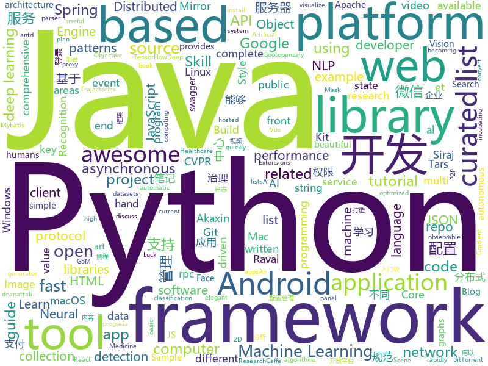

# 2018-07-01
See what the GitHub community is most excited about today.

## python
* [sg2im](https://github.com/google/sg2im)(**173 stars today**): Code for "Image Generation from Scene Graphs", Johnson et al, CVPR 2018
* [alexa-skills-kit-sdk-for-python](https://github.com/alexa-labs/alexa-skills-kit-sdk-for-python)(**78 stars today**): The Alexa Skills Kit SDK for Python (Beta) helps you get a skill up and running quickly, letting you focus on skill logic instead of boilerplate code.
* [termtosvg](https://github.com/nbedos/termtosvg)(**64 stars today**): Record terminal sessions as SVG animations
* [vibora](https://github.com/vibora-io/vibora)(**57 stars today**): Fast, asynchronous and elegant Python web framework.
* [darts](https://github.com/quark0/darts)(**40 stars today**): Differentiable architecture search for convolutional and recurrent networks
* [models](https://github.com/tensorflow/models)(**30 stars today**): Models and examples built with TensorFlow
* [keras](https://github.com/keras-team/keras)(**37 stars today**): Deep Learning for humans
* [faceai](https://github.com/vipstone/faceai)(**30 stars today**): 一款入门级的人脸、视频、文字检测以及识别的项目.
* [awesome-python](https://github.com/vinta/awesome-python)(**30 stars today**): A curated list of awesome Python frameworks, libraries, software and resources
* [sgan](https://github.com/agrimgupta92/sgan)(**32 stars today**): Code for "Social GAN: Socially Acceptable Trajectories with Generative Adversarial Networks", Gupta et al, CVPR 2018
* [public-apis](https://github.com/toddmotto/public-apis)(**29 stars today**): A collective list of public JSON APIs for use in web development.
* [Smart-Fruit](https://github.com/madman-bob/Smart-Fruit)(**29 stars today**): A Python schema-based machine learning library
* [django](https://github.com/django/django)(**24 stars today**): The Web framework for perfectionists with deadlines.
* [learn_math_fast](https://github.com/llSourcell/learn_math_fast)(**27 stars today**): This is the Curriculum for "How to Learn Mathematics Fast" By Siraj Raval on Youtube
* [requests](https://github.com/requests/requests)(**24 stars today**): Python HTTP Requests for Humans™✨🍰✨
* [Artificial-Intelligence-Deep-Learning-Machine-Learning-Tutorials](https://github.com/TarrySingh/Artificial-Intelligence-Deep-Learning-Machine-Learning-Tutorials)(**24 stars today**): A comprehensive list of Deep Learning / Artificial Intelligence and Machine Learning tutorials - rapidly expanding into areas of AI/Deep Learning / Machine Vision / NLP and industry specific areas such as Automotives, Retail, Pharma, Medicine, Healthcare by Tarry Singh until at-least 2020 until he finishes his Ph.D. (which might end up being int…
* [LatticeLSTM](https://github.com/jiesutd/LatticeLSTM)(**21 stars today**): Chinese NER using Lattice LSTM. Code for ACL 2018 paper.
* [tribler](https://github.com/Tribler/tribler)(**23 stars today**): Privacy enhanced BitTorrent client with P2P content discovery
* [flask-ask](https://github.com/johnwheeler/flask-ask)(**22 stars today**): Alexa Skills Kit for Python
* [youtube-dl](https://github.com/rg3/youtube-dl)(**22 stars today**): Command-line program to download videos from YouTube.com and other video sites
* [face_recognition](https://github.com/ageitgey/face_recognition)(**17 stars today**): The world's simplest facial recognition api for Python and the command line
* [hnatt](https://github.com/minqi/hnatt)(**20 stars today**): Train and visualize Hierarchical Attention Networks
* [scikit-learn](https://github.com/scikit-learn/scikit-learn)(**17 stars today**): scikit-learn: machine learning in Python
* [Detectron](https://github.com/facebookresearch/Detectron)(**17 stars today**): FAIR's research platform for object detection research, implementing popular algorithms like Mask R-CNN and RetinaNet.
* [cpython](https://github.com/python/cpython)(**16 stars today**): The Python programming language

## java
* [Java-Interview](https://github.com/crossoverJie/Java-Interview)(**123 stars today**): 👨‍🎓Java related : basic, concurrent, algorithm
* [proxyee-down](https://github.com/proxyee-down-org/proxyee-down)(**31 stars today**): http下载工具，基于http代理，支持多连接分块下载
* [CombineBitmap](https://github.com/Othershe/CombineBitmap)(**26 stars today**): Android 仿钉钉、微信 群聊组合头像
* [spring-boot](https://github.com/spring-projects/spring-boot)(**21 stars today**): Spring Boot
* [openzaly](https://github.com/akaxincom/openzaly)(**23 stars today**): openzaly 是 Akaxin 的服务器源代码，用以搭建私有聊天服务器。 服务器安装教程：https://www.akaxin.com/docs/install/index.html QQ群: 655249600
* [java-design-patterns](https://github.com/iluwatar/java-design-patterns)(**19 stars today**): Design patterns implemented in Java
* [pandora](https://github.com/whataa/pandora)(**20 stars today**): an android library for debugging what we care about directly in app.
* [spring-framework](https://github.com/spring-projects/spring-framework)(**15 stars today**): Spring Framework
* [tutorials](https://github.com/eugenp/tutorials)(**9 stars today**): The "REST With Spring" Course:
* [elasticsearch](https://github.com/elastic/elasticsearch)(**16 stars today**): Open Source, Distributed, RESTful Search Engine
* [netty](https://github.com/netty/netty)(**15 stars today**): Netty project - an event-driven asynchronous network application framework
* [incubator-dubbo](https://github.com/apache/incubator-dubbo)(**14 stars today**): Apache Dubbo (incubating) is a high-performance, java based, open source RPC framework.
* [zheng](https://github.com/shuzheng/zheng)(**13 stars today**): 基于Spring+SpringMVC+Mybatis分布式敏捷开发系统架构，提供整套公共微服务服务模块：集中权限管理（单点登录）、内容管理、支付中心、用户管理（支持第三方登录）、微信平台、存储系统、配置中心、日志分析、任务和通知等，支持服务治理、监控和追踪，努力为中小型企业打造全方位J2EE企业级开发解决方案。
* [weixin-java-tools](https://github.com/Wechat-Group/weixin-java-tools)(**13 stars today**): 可能是目前最好最全的微信Java开发工具包，支持包括微信支付、开放平台、小程序、企业号和公众号等的开发
* [RxJava](https://github.com/ReactiveX/RxJava)(**12 stars today**): RxJava – Reactive Extensions for the JVM – a library for composing asynchronous and event-based programs using observable sequences for the Java VM.
* [apollo](https://github.com/ctripcorp/apollo)(**11 stars today**): Apollo（阿波罗）是携程框架部门研发的分布式配置中心，能够集中化管理应用不同环境、不同集群的配置，配置修改后能够实时推送到应用端，并且具备规范的权限、流程治理等特性，适用于微服务配置管理场景。
* [incubator-weex](https://github.com/apache/incubator-weex)(**12 stars today**): Mirror of Apache Weex
* [bugsnag-android](https://github.com/bugsnag/bugsnag-android)(**11 stars today**): Bugsnag crash reporting for Android apps
* [okhttp](https://github.com/square/okhttp)(**11 stars today**): An HTTP+HTTP/2 client for Android and Java applications.
* [Travel-Mate](https://github.com/project-travel-mate/Travel-Mate)(**10 stars today**): A complete travel guide!
* [guava](https://github.com/google/guava)(**9 stars today**): Google core libraries for Java
* [fastjson](https://github.com/alibaba/fastjson)(**10 stars today**): 🚄A fast JSON parser/generator for Java
* [kafka](https://github.com/apache/kafka)(**10 stars today**): Mirror of Apache Kafka
* [AndroidUtilCode](https://github.com/Blankj/AndroidUtilCode)(**9 stars today**): 🔥Android developers should collect the following utils(updating).
* [incubator-skywalking](https://github.com/apache/incubator-skywalking)(**10 stars today**): A distributed tracing system, and APM ( Application Performance Monitoring )

## unknown
* [NLP-progress](https://github.com/sebastianruder/NLP-progress)(**125 stars today**): Repository to track the progress in Natural Language Processing (NLP), including the datasets and the current state-of-the-art for the most common NLP tasks.
* [Reborn](https://github.com/langyanduan/Reborn)(**88 stars today**): The missing proxy for macOS
* [build-your-own-x](https://github.com/danistefanovic/build-your-own-x)(**70 stars today**): 🤓Build your own (insert technology here)
* [gitignore](https://github.com/github/gitignore)(**64 stars today**): A collection of useful .gitignore templates
* [react-developer-roadmap](https://github.com/adam-golab/react-developer-roadmap)(**67 stars today**): Roadmap to becoming a React developer in 2018
* [awesome](https://github.com/sindresorhus/awesome)(**41 stars today**): 😎Curated list of awesome lists
* [You-Dont-Know-JS](https://github.com/getify/You-Dont-Know-JS)(**38 stars today**): A book series on JavaScript. @YDKJS on twitter.
* [mysql-sql-standard](https://github.com/zhishutech/mysql-sql-standard)(**33 stars today**): 基于MySQL开发SQL开发规范--知数堂 http://zhishutang.com
* [awesome-design-patterns](https://github.com/DovAmir/awesome-design-patterns)(**32 stars today**): A curated list of software and architecture related design patterns.
* [Interview-Notebook](https://github.com/CyC2018/Interview-Notebook)(**27 stars today**): 📆准备秋招学习笔记
* [project-based-learning](https://github.com/tuvtran/project-based-learning)(**28 stars today**): Curated list of project-based tutorials
* [free-programming-books](https://github.com/EbookFoundation/free-programming-books)(**27 stars today**): 📚Freely available programming books
* [ethereum-developer-tools-list](https://github.com/ConsenSysLabs/ethereum-developer-tools-list)(**29 stars today**): A guide to available tools and platforms for developing on Ethereum.
* [coding-interview-university](https://github.com/jwasham/coding-interview-university)(**24 stars today**): A complete computer science study plan to become a software engineer.
* [architect-awesome](https://github.com/xingshaocheng/architect-awesome)(**25 stars today**): 后端架构师技术图谱
* [USBuildingFootprints](https://github.com/Microsoft/USBuildingFootprints)(**26 stars today**): Computer generated building footprints for the United States
* [awesome-vue](https://github.com/vuejs/awesome-vue)(**21 stars today**): 🎉A curated list of awesome things related to Vue.js
* [proposals](https://github.com/tc39/proposals)(**21 stars today**): Tracking ECMAScript Proposals
* [Learn_Machine_Learning_in_3_Months](https://github.com/llSourcell/Learn_Machine_Learning_in_3_Months)(**16 stars today**): This is the code for "Learn Machine Learning in 3 Months" by Siraj Raval on Youtube
* [android-architecture](https://github.com/googlesamples/android-architecture)(**16 stars today**): A collection of samples to discuss and showcase different architectural tools and patterns for Android apps.
* [awesome-flutter](https://github.com/Solido/awesome-flutter)(**16 stars today**): An awesome list that curates the best Flutter libraries, tools, tutorials, articles and more.
* [linux-kernel-exploitation](https://github.com/xairy/linux-kernel-exploitation)(**15 stars today**): A bunch of links related to Linux kernel exploitation
* [ipfs](https://github.com/ipfs/ipfs)(**13 stars today**): Peer-to-peer hypermedia protocol
* [GLWTPL](https://github.com/me-shaon/GLWTPL)(**14 stars today**): "Good Luck With That" Public License
* [download](https://github.com/getlantern/download)(**13 stars today**): 

## c++
* [mace](https://github.com/XiaoMi/mace)(**186 stars today**): MACE is a deep learning inference framework optimized for mobile heterogeneous computing platforms.
* [tensorflow](https://github.com/tensorflow/tensorflow)(**55 stars today**): Computation using data flow graphs for scalable machine learning
* [pytorch](https://github.com/pytorch/pytorch)(**31 stars today**): Tensors and Dynamic neural networks in Python with strong GPU acceleration
* [opencv](https://github.com/opencv/opencv)(**22 stars today**): Open Source Computer Vision Library
* [envoy](https://github.com/envoyproxy/envoy)(**28 stars today**): C++ front/service proxy
* [RayTracer](https://github.com/rorydriscoll/RayTracer)(**21 stars today**): Quick path tracer project written in C++
* [opencv4nodejs](https://github.com/justadudewhohacks/opencv4nodejs)(**19 stars today**): Asynchronous OpenCV 3.x nodejs bindings with JavaScript and TypeScript API, with examples for: Face Detection, Machine Learning, Deep Neural Nets, Hand Gesture Recognition, Object Tracking, Feature Matching, Image Histogram
* [bitcoin](https://github.com/bitcoin/bitcoin)(**15 stars today**): Bitcoin Core integration/staging tree
* [electron](https://github.com/electron/electron)(**16 stars today**): Build cross platform desktop apps with JavaScript, HTML, and CSS
* [grpc](https://github.com/grpc/grpc)(**16 stars today**): The C based gRPC (C++, Python, Ruby, Objective-C, PHP, C#)
* [aseprite](https://github.com/aseprite/aseprite)(**16 stars today**): Animated sprite editor & pixel art tool (Windows, macOS, Linux)
* [Tars](https://github.com/Tencent/Tars)(**15 stars today**): Tars is a highly performance rpc framework based on naming service using tars protocol and provides a semi-automatic operation platform.
* [protobuf](https://github.com/google/protobuf)(**14 stars today**): Protocol Buffers - Google's data interchange format
* [apollo](https://github.com/ApolloAuto/apollo)(**15 stars today**): An open autonomous driving platform
* [modern-cpp-tutorial](https://github.com/changkun/modern-cpp-tutorial)(**14 stars today**): 📚C++11/14/17 On the Fly
* [godot](https://github.com/godotengine/godot)(**12 stars today**): Godot Engine – Multi-platform 2D and 3D game engine
* [devilution](https://github.com/diasurgical/devilution)(**13 stars today**): Diablo devolved - magic behind the 1996 computer game
* [openpose](https://github.com/CMU-Perceptual-Computing-Lab/openpose)(**11 stars today**): OpenPose: Real-time multi-person keypoint detection library for body, face, and hands estimation
* [xgboost](https://github.com/dmlc/xgboost)(**10 stars today**): Scalable, Portable and Distributed Gradient Boosting (GBDT, GBRT or GBM) Library, for Python, R, Java, Scala, C++ and more. Runs on single machine, Hadoop, Spark, Flink and DataFlow
* [v8](https://github.com/v8/v8)(**10 stars today**): The official mirror of the V8 Git repository
* [AirSim](https://github.com/Microsoft/AirSim)(**10 stars today**): Open source simulator based on Unreal Engine for autonomous vehicles from Microsoft AI & Research
* [caffe](https://github.com/BVLC/caffe)(**9 stars today**): Caffe: a fast open framework for deep learning.
* [leveldb](https://github.com/google/leveldb)(**7 stars today**): LevelDB is a fast key-value storage library written at Google that provides an ordered mapping from string keys to string values.
* [mongo](https://github.com/mongodb/mongo)(**10 stars today**): The MongoDB Database
* [vnote](https://github.com/tamlok/vnote)(**9 stars today**): A Vim-inspired note-taking application that knows programmers and Markdown better.

## html
* [react-from-zero](https://github.com/kay-is/react-from-zero)(**523 stars today**): A simple (99% ES2015 less) tutorial for React
* [breezy-pdf-lite](https://github.com/danielwestendorf/breezy-pdf-lite)(**92 stars today**): Simplified, self-hosted, version of breezypdf.com. HTML/CSS/JS in, PDF out, via Chrome
* [douyin](https://github.com/lujqme/douyin)(**13 stars today**): 抖音 桌面版(WIndows/Mac OS)
* [course-git-blog-project](https://github.com/udacity/course-git-blog-project)(****): Sample repo of a blog for the Git course
* [frontend-nanodegree-styleguide](https://github.com/udacity/frontend-nanodegree-styleguide)(****): Official FEND style guides
* [awesome-mac](https://github.com/jaywcjlove/awesome-mac)(**11 stars today**):  This repo is a collection of awesome Mac applications and tools for developers and designers.
* [styleguide](https://github.com/google/styleguide)(**10 stars today**): Style guides for Google-originated open-source projects
* [Coursera-ML-AndrewNg-Notes](https://github.com/fengdu78/Coursera-ML-AndrewNg-Notes)(**9 stars today**): 吴恩达老师的机器学习课程个人笔记
* [brain.js](https://github.com/BrainJS/brain.js)(**10 stars today**): 🤖Neural networks in JavaScript
* [fastText](https://github.com/facebookresearch/fastText)(**8 stars today**): Library for fast text representation and classification.
* [ecma262](https://github.com/tc39/ecma262)(**9 stars today**): Status, process, and documents for ECMA262
* [portainer](https://github.com/portainer/portainer)(**8 stars today**): Simple management UI for Docker
* [Spoon-Knife](https://github.com/octocat/Spoon-Knife)(****): This repo is for demonstration purposes only.
* [TranslatorX](https://github.com/pingfangx/TranslatorX)(**7 stars today**): JetBrains 系列软件汉化包
* [swagger-codegen](https://github.com/swagger-api/swagger-codegen)(**6 stars today**): swagger-codegen contains a template-driven engine to generate documentation, API clients and server stubs in different languages by parsing your OpenAPI / Swagger definition.
* [walle-web](https://github.com/meolu/walle-web)(**6 stars today**): A Web Deployment Tool (web代码部署工具)
* [ng-alain](https://github.com/cipchk/ng-alain)(**6 stars today**): ng-zorro-antd admin panel front-end framework
* [TIDoS-Framework](https://github.com/theInfectedDrake/TIDoS-Framework)(**6 stars today**): A comprehensive web-app audit framework with some serious perks.
* [cora-docs](https://github.com/spawaskar-cora/cora-docs)(**6 stars today**): CoRA Docs
* [gson](https://github.com/google/gson)(**5 stars today**): A Java serialization/deserialization library to convert Java Objects into JSON and back
* [notes](https://github.com/mozilla/notes)(**5 stars today**): A notepad for Firefox
* [qiubaiying.github.io](https://github.com/qiubaiying/qiubaiying.github.io)(****): BY Blog ->
* [beautiful-jekyll](https://github.com/daattali/beautiful-jekyll)(****): ✨Build a beautiful and simple website in literally minutes. Demo at http://deanattali.com/beautiful-jekyll
* [nodejs-ex](https://github.com/sclorg/nodejs-ex)(****): node.js example
* [fend-project-memory-game](https://github.com/udacity/fend-project-memory-game)(****): 

## WordCloud

