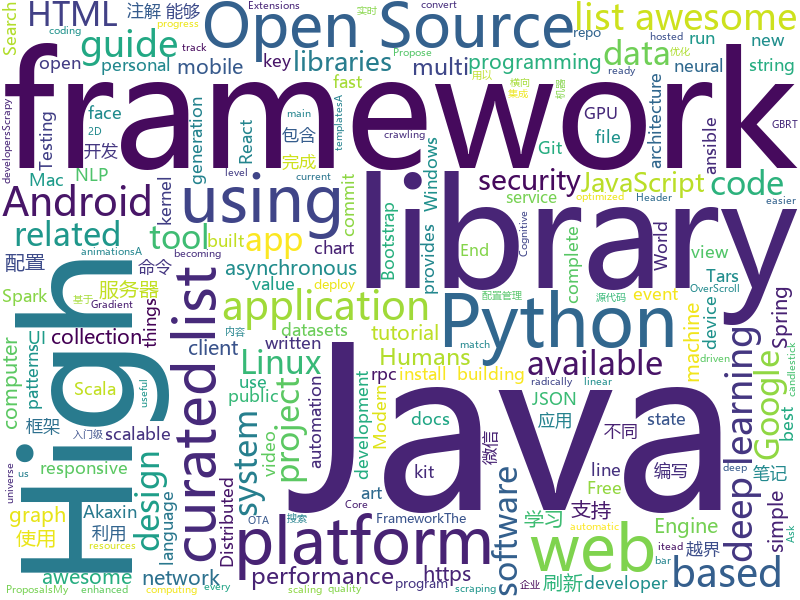

# 2018-07-02
See what the GitHub community is most excited about today.

## python
* [sg2im](https://github.com/google/sg2im)(**136 stars today**): Code for "Image Generation from Scene Graphs", Johnson et al, CVPR 2018
* [vibora](https://github.com/vibora-io/vibora)(**83 stars today**): Fast, asynchronous and elegant Python web framework.
* [awesome-python](https://github.com/vinta/awesome-python)(**34 stars today**): A curated list of awesome Python frameworks, libraries, software and resources
* [models](https://github.com/tensorflow/models)(**28 stars today**): Models and examples built with TensorFlow
* [noisy](https://github.com/1tayH/noisy)(**37 stars today**): Simple random DNS, HTTP/S internet traffic noise generator
* [pytorch-template](https://github.com/victoresque/pytorch-template)(**32 stars today**): PyTorch deep learning projects made easy.
* [termtosvg](https://github.com/nbedos/termtosvg)(**31 stars today**): Record terminal sessions as SVG animations
* [awesome-machine-learning](https://github.com/josephmisiti/awesome-machine-learning)(**25 stars today**): A curated list of awesome Machine Learning frameworks, libraries and software.
* [youtube-dl](https://github.com/rg3/youtube-dl)(**26 stars today**): Command-line program to download videos from YouTube.com and other video sites
* [flask](https://github.com/pallets/flask)(**23 stars today**): The Python micro framework for building web applications.
* [darts](https://github.com/quark0/darts)(**23 stars today**): Differentiable architecture search for convolutional and recurrent networks
* [cpython](https://github.com/python/cpython)(**18 stars today**): The Python programming language
* [T2F](https://github.com/akanimax/T2F)(**23 stars today**): T2F: text to face generation using Deep Learning
* [git-treesame-commit](https://github.com/jtolds/git-treesame-commit)(**23 stars today**): Create new Git commits that match the file tree of any arbitrary commit.
* [requests](https://github.com/requests/requests)(**20 stars today**): Python HTTP Requests for Humans™✨🍰✨
* [keras](https://github.com/keras-team/keras)(**15 stars today**): Deep Learning for humans
* [faceai](https://github.com/vipstone/faceai)(**19 stars today**): 一款入门级的人脸、视频、文字检测以及识别的项目.
* [django](https://github.com/django/django)(**17 stars today**): The Web framework for perfectionists with deadlines.
* [system-design-primer](https://github.com/donnemartin/system-design-primer)(**19 stars today**): Learn how to design large-scale systems. Prep for the system design interview. Includes Anki flashcards.
* [public-apis](https://github.com/toddmotto/public-apis)(**20 stars today**): A collective list of public JSON APIs for use in web development.
* [world-models](https://github.com/ctallec/world-models)(**17 stars today**): Reimplementation of World-Models (Ha and Schmidhuber 2018) in pytorch
* [ansible](https://github.com/ansible/ansible)(**16 stars today**): Ansible is a radically simple IT automation platform that makes your applications and systems easier to deploy. Avoid writing scripts or custom code to deploy and update your applications — automate in a language that approaches plain English, using SSH, with no agents to install on remote systems. https://docs.ansible.com/ansible/
* [home-assistant](https://github.com/home-assistant/home-assistant)(**14 stars today**): 🏡Open-source home automation platform running on Python 3
* [adb-enhanced](https://github.com/ashishb/adb-enhanced)(**18 stars today**): ADB enhanced for developers
* [scrapy](https://github.com/scrapy/scrapy)(**17 stars today**): Scrapy, a fast high-level web crawling & scraping framework for Python.

## java
* [Java-Interview](https://github.com/crossoverJie/Java-Interview)(**95 stars today**): 👨‍🎓Java related : basic, concurrent, algorithm
* [proxyee-down](https://github.com/proxyee-down-org/proxyee-down)(**33 stars today**): http下载工具，基于http代理，支持多连接分块下载
* [incubator-dubbo](https://github.com/apache/incubator-dubbo)(**20 stars today**): Apache Dubbo (incubating) is a high-performance, java based, open source RPC framework.
* [spring-boot](https://github.com/spring-projects/spring-boot)(**18 stars today**): Spring Boot
* [java-design-patterns](https://github.com/iluwatar/java-design-patterns)(**15 stars today**): Design patterns implemented in Java
* [pandora](https://github.com/whataa/pandora)(**15 stars today**): an android library for debugging what we care about directly in app.
* [netty](https://github.com/netty/netty)(**14 stars today**): Netty project - an event-driven asynchronous network application framework
* [retrofit](https://github.com/square/retrofit)(**13 stars today**): Type-safe HTTP client for Android and Java by Square, Inc.
* [okhttp](https://github.com/square/okhttp)(**12 stars today**): An HTTP+HTTP/2 client for Android and Java applications.
* [elasticsearch](https://github.com/elastic/elasticsearch)(**12 stars today**): Open Source, Distributed, RESTful Search Engine
* [weixin-java-tools](https://github.com/Wechat-Group/weixin-java-tools)(**10 stars today**): 可能是目前最好最全的微信Java开发工具包，支持包括微信支付、开放平台、小程序、企业号和公众号等的开发
* [spring-framework](https://github.com/spring-projects/spring-framework)(**10 stars today**): Spring Framework
* [tutorials](https://github.com/eugenp/tutorials)(**7 stars today**): The "REST With Spring" Course:
* [SmartRefreshLayout](https://github.com/scwang90/SmartRefreshLayout)(**12 stars today**): 🔥下拉刷新、上拉加载、二级刷新、淘宝二楼、RefreshLayout、OverScroll，Android智能下拉刷新框架，支持越界回弹、越界拖动，具有极强的扩展性，集成了几十种炫酷的Header和 Footer。
* [Travel-Mate](https://github.com/project-travel-mate/Travel-Mate)(**11 stars today**): A complete travel guide!
* [apollo](https://github.com/ctripcorp/apollo)(**10 stars today**): Apollo（阿波罗）是携程框架部门研发的分布式配置中心，能够集中化管理应用不同环境、不同集群的配置，配置修改后能够实时推送到应用端，并且具备规范的权限、流程治理等特性，适用于微服务配置管理场景。
* [Unblock163MusicClient-Xposed](https://github.com/bin456789/Unblock163MusicClient-Xposed)(**11 stars today**): Unblock 163 Cloud Music Android client through Xposed.
* [RxJava](https://github.com/ReactiveX/RxJava)(**10 stars today**): RxJava – Reactive Extensions for the JVM – a library for composing asynchronous and event-based programs using observable sequences for the Java VM.
* [MPAndroidChart](https://github.com/PhilJay/MPAndroidChart)(**10 stars today**): A powerful🚀Android chart view / graph view library, supporting line- bar- pie- radar- bubble- and candlestick charts as well as scaling, dragging and animations.
* [vjtools](https://github.com/vipshop/vjtools)(**9 stars today**): The vip.com's java coding standard, libraries and tools
* [deeplearning4j](https://github.com/deeplearning4j/deeplearning4j)(**9 stars today**): Deeplearning4j, ND4J, DataVec and more - deep learning & linear algebra for Java/Scala with GPUs + Spark - From Skymind
* [interview](https://github.com/mission-peace/interview)(**10 stars today**): Interview questions
* [S-MVP](https://github.com/UCodeUStory/S-MVP)(**8 stars today**): 🔥🔥优化版MVP,使用注解泛型简化代码编写，使用模块化协议方便维护，APT过程使用注解解析器利用JavaPoet🌝完成重复模块的编写，利用ASpect+GradlePlugin 完成横向AOP编程+Javassist动态字节码注入+Tinker热修复
* [zxing](https://github.com/zxing/zxing)(**8 stars today**): ZXing ("Zebra Crossing") barcode scanning library for Java, Android
* [openzaly](https://github.com/akaxincom/openzaly)(**8 stars today**): openzaly 是 Akaxin 的服务器源代码，用以搭建私有聊天服务器。 服务器安装教程：https://www.akaxin.com/docs/install/index.html QQ群: 655249600

## unknown
* [h-encore](https://github.com/TheOfficialFloW/h-encore)(**130 stars today**): Fully chained kernel exploit for the PS Vita
* [NLP-progress](https://github.com/sebastianruder/NLP-progress)(**123 stars today**): Repository to track the progress in Natural Language Processing (NLP), including the datasets and the current state-of-the-art for the most common NLP tasks.
* [Reborn](https://github.com/langyanduan/Reborn)(**115 stars today**): The missing proxy for macOS
* [USBuildingFootprints](https://github.com/Microsoft/USBuildingFootprints)(**97 stars today**): Computer generated building footprints for the United States
* [build-your-own-x](https://github.com/danistefanovic/build-your-own-x)(**85 stars today**): 🤓Build your own (insert technology here)
* [gitignore](https://github.com/github/gitignore)(**45 stars today**): A collection of useful .gitignore templates
* [You-Dont-Know-JS](https://github.com/getify/You-Dont-Know-JS)(**35 stars today**): A book series on JavaScript. @YDKJS on twitter.
* [awesome](https://github.com/sindresorhus/awesome)(**35 stars today**): 😎Curated list of awesome lists
* [Interview-Notebook](https://github.com/CyC2018/Interview-Notebook)(**28 stars today**): 📆准备秋招学习笔记
* [awesome-vue](https://github.com/vuejs/awesome-vue)(**32 stars today**): 🎉A curated list of awesome things related to Vue.js
* [project-based-learning](https://github.com/tuvtran/project-based-learning)(**28 stars today**): Curated list of project-based tutorials
* [free-programming-books](https://github.com/EbookFoundation/free-programming-books)(**26 stars today**): 📚Freely available programming books
* [coding-interview-university](https://github.com/jwasham/coding-interview-university)(**24 stars today**): A complete computer science study plan to become a software engineer.
* [awesome-design-patterns](https://github.com/DovAmir/awesome-design-patterns)(**28 stars today**): A curated list of software and architecture related design patterns.
* [architect-awesome](https://github.com/xingshaocheng/architect-awesome)(**18 stars today**): 后端架构师技术图谱
* [ethereum-developer-tools-list](https://github.com/ConsenSysLabs/ethereum-developer-tools-list)(**19 stars today**): A guide to available tools and platforms for developing on Ethereum.
* [react-developer-roadmap](https://github.com/adam-golab/react-developer-roadmap)(**18 stars today**): Roadmap to becoming a React developer in 2018
* [awesome-public-datasets](https://github.com/awesomedata/awesome-public-datasets)(**17 stars today**): A topic-centric list of high-quality open datasets in public domains. Propose NEW data ☛☛☛PR☛☛☛
* [papers](https://github.com/ring04h/papers)(**16 stars today**): my security summit papers
* [awesome-flutter](https://github.com/Solido/awesome-flutter)(**13 stars today**): An awesome list that curates the best Flutter libraries, tools, tutorials, articles and more.
* [proposals](https://github.com/tc39/proposals)(**14 stars today**): Tracking ECMAScript Proposals
* [dev-setup](https://github.com/marco-kretz/dev-setup)(**14 stars today**): My personal development setup
* [awesome-react](https://github.com/enaqx/awesome-react)(**13 stars today**): A collection of awesome things regarding React ecosystem.
* [awesome-scalability](https://github.com/binhnguyennus/awesome-scalability)(**12 stars today**): High Scalability, High Availability, High Stability, High Performance, and High Intelligence Back-End Design Patterns
* [linux-kernel-exploitation](https://github.com/xairy/linux-kernel-exploitation)(**12 stars today**): A bunch of links related to Linux kernel exploitation

## c++
* [mace](https://github.com/XiaoMi/mace)(**100 stars today**): MACE is a deep learning inference framework optimized for mobile heterogeneous computing platforms.
* [tensorflow](https://github.com/tensorflow/tensorflow)(**50 stars today**): Computation using data flow graphs for scalable machine learning
* [CNTK](https://github.com/Microsoft/CNTK)(**24 stars today**): Microsoft Cognitive Toolkit (CNTK), an open source deep-learning toolkit
* [electron](https://github.com/electron/electron)(**24 stars today**): Build cross platform desktop apps with JavaScript, HTML, and CSS
* [opencv](https://github.com/opencv/opencv)(**13 stars today**): Open Source Computer Vision Library
* [bitcoin](https://github.com/bitcoin/bitcoin)(**16 stars today**): Bitcoin Core integration/staging tree
* [pytorch](https://github.com/pytorch/pytorch)(**16 stars today**): Tensors and Dynamic neural networks in Python with strong GPU acceleration
* [dxvk](https://github.com/doitsujin/dxvk)(**18 stars today**): Vulkan-based D3D11 implementation for Linux / Wine
* [devilution](https://github.com/diasurgical/devilution)(**17 stars today**): Diablo devolved - magic behind the 1996 computer game
* [aseprite](https://github.com/aseprite/aseprite)(**17 stars today**): Animated sprite editor & pixel art tool (Windows, macOS, Linux)
* [RayTracer](https://github.com/rorydriscoll/RayTracer)(**17 stars today**): Quick path tracer project written in C++
* [Tars](https://github.com/Tencent/Tars)(**15 stars today**): Tars is a highly performance rpc framework based on naming service using tars protocol and provides a semi-automatic operation platform.
* [openpose](https://github.com/CMU-Perceptual-Computing-Lab/openpose)(**14 stars today**): OpenPose: Real-time multi-person keypoint detection library for body, face, and hands estimation
* [Sonoff-Tasmota](https://github.com/arendst/Sonoff-Tasmota)(**11 stars today**): Provide ESP8266 based itead Sonoff with Web, MQTT and OTA firmware using Arduino IDE or PlatformIO
* [tesseract](https://github.com/tesseract-ocr/tesseract)(**14 stars today**): Tesseract Open Source OCR Engine (main repository)
* [godot](https://github.com/godotengine/godot)(**11 stars today**): Godot Engine – Multi-platform 2D and 3D game engine
* [cosmos](https://github.com/OpenGenus/cosmos)(**10 stars today**): Algorithms that run our universe | Your personal library of every algorithm and data structure code that you will ever encounter | Ask us anything at our forum
* [protobuf](https://github.com/google/protobuf)(**8 stars today**): Protocol Buffers - Google's data interchange format
* [TSeer](https://github.com/Tencent/TSeer)(**8 stars today**): A high available service discovery & registration & fault-tolerance framework
* [swift](https://github.com/apple/swift)(**8 stars today**): The Swift Programming Language
* [leveldb](https://github.com/google/leveldb)(**8 stars today**): LevelDB is a fast key-value storage library written at Google that provides an ordered mapping from string keys to string values.
* [xgboost](https://github.com/dmlc/xgboost)(**8 stars today**): Scalable, Portable and Distributed Gradient Boosting (GBDT, GBRT or GBM) Library, for Python, R, Java, Scala, C++ and more. Runs on single machine, Hadoop, Spark, Flink and DataFlow
* [mongo](https://github.com/mongodb/mongo)(**8 stars today**): The MongoDB Database
* [apollo](https://github.com/ApolloAuto/apollo)(**8 stars today**): An open autonomous driving platform
* [json](https://github.com/nlohmann/json)(**7 stars today**): JSON for Modern C++

## html
* [react-from-zero](https://github.com/kay-is/react-from-zero)(**341 stars today**): A simple (99% ES2015 less) tutorial for React
* [breezy-pdf-lite](https://github.com/danielwestendorf/breezy-pdf-lite)(**25 stars today**): Simplified, self-hosted, version of breezypdf.com. HTML/CSS/JS in, PDF out, via Chrome
* [awesome-resume](https://github.com/resumejob/awesome-resume)(**14 stars today**): 包含简历常用例句
* [awesome-mac](https://github.com/jaywcjlove/awesome-mac)(**13 stars today**):  This repo is a collection of awesome Mac applications and tools for developers and designers.
* [frontend-nanodegree-styleguide](https://github.com/udacity/frontend-nanodegree-styleguide)(****): Official FEND style guides
* [styleguide](https://github.com/google/styleguide)(**9 stars today**): Style guides for Google-originated open-source projects
* [requests-html](https://github.com/kennethreitz/requests-html)(**10 stars today**): Pythonic HTML Parsing for Humans™
* [Spoon-Knife](https://github.com/octocat/Spoon-Knife)(****): This repo is for demonstration purposes only.
* [gentelella](https://github.com/puikinsh/gentelella)(**8 stars today**): Free Bootstrap 3 Admin Template
* [gson](https://github.com/google/gson)(**8 stars today**): A Java serialization/deserialization library to convert Java Objects into JSON and back
* [javascript-tutorial-en](https://github.com/iliakan/javascript-tutorial-en)(**8 stars today**): Modern JavaScript Tutorial
* [Winds](https://github.com/GetStream/Winds)(**8 stars today**): A Beautiful Open Source RSS & Podcast App
* [fonts](https://github.com/google/fonts)(**6 stars today**): Font files available from Google Fonts
* [foundation-sites](https://github.com/zurb/foundation-sites)(**7 stars today**): The most advanced responsive front-end framework in the world. Quickly create prototypes and production code for sites that work on any kind of device.
* [owasp-mstg](https://github.com/OWASP/owasp-mstg)(**6 stars today**): The Mobile Security Testing Guide (MSTG) is a comprehensive manual for mobile app security testing and reverse engineering.
* [douyin](https://github.com/lujqme/douyin)(**6 stars today**): 抖音 桌面版(WIndows/Mac OS)
* [Coursera-ML-AndrewNg-Notes](https://github.com/fengdu78/Coursera-ML-AndrewNg-Notes)(**6 stars today**): 吴恩达老师的机器学习课程个人笔记
* [smart-contract-best-practices](https://github.com/ConsenSys/smart-contract-best-practices)(**7 stars today**): A guide to smart contract security best practices
* [web-starter-kit](https://github.com/google/web-starter-kit)(**5 stars today**): Web Starter Kit - a workflow for multi-device websites
* [polymer](https://github.com/Polymer/polymer)(**6 stars today**): Build modern apps using web components
* [brain.js](https://github.com/BrainJS/brain.js)(**6 stars today**): 🤖Neural networks in JavaScript
* [awesome-angular](https://github.com/gdi2290/awesome-angular)(**6 stars today**): 📄A curated list of awesome Angular resources by @tipeio
* [linux-command](https://github.com/jaywcjlove/linux-command)(**6 stars today**): Linux命令大全搜索工具，内容包含Linux命令手册、详解、学习、搜集。https://git.io/linux
* [underexpress](https://github.com/ankythshukla/underexpress)(**6 stars today**): A free, responsive, ready to use website ui kit, built with bootstrap 4.
* [portainer](https://github.com/portainer/portainer)(**5 stars today**): Simple management UI for Docker

## WordCloud

