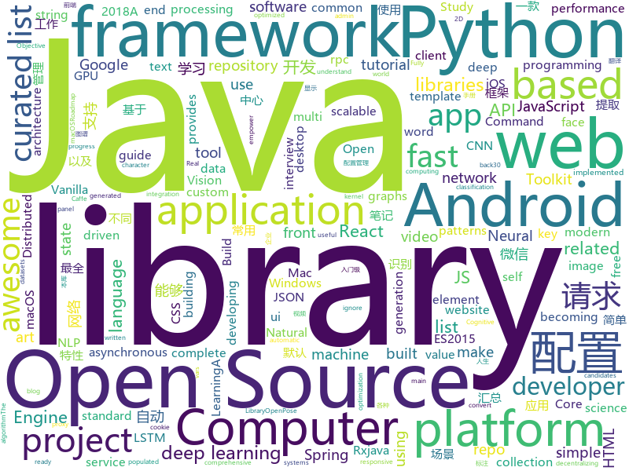

# 2018-07-03
See what the GitHub community is most excited about today.

## python
* [vibora](https://github.com/vibora-io/vibora)(**130 stars today**): Fast, asynchronous and elegant Python web framework.
* [sg2im](https://github.com/google/sg2im)(**123 stars today**): Code for "Image Generation from Scene Graphs", Johnson et al, CVPR 2018
* [ImageAI](https://github.com/OlafenwaMoses/ImageAI)(**81 stars today**): A python library built to empower developers to build applications and systems with self-contained Computer Vision capabilities
* [models](https://github.com/tensorflow/models)(**57 stars today**): Models and examples built with TensorFlow
* [adb-enhanced](https://github.com/ashishb/adb-enhanced)(**71 stars today**): ADB enhanced for developers
* [T2F](https://github.com/akanimax/T2F)(**62 stars today**): T2F: text to face generation using Deep Learning
* [awesome-python](https://github.com/vinta/awesome-python)(**51 stars today**): A curated list of awesome Python frameworks, libraries, software and resources
* [noisy](https://github.com/1tayH/noisy)(**57 stars today**): Simple random DNS, HTTP/S internet traffic noise generator
* [Python](https://github.com/TheAlgorithms/Python)(**45 stars today**): All Algorithms implemented in Python
* [mlflow](https://github.com/databricks/mlflow)(**45 stars today**): Open source platform for the complete machine learning lifecycle
* [ProGAN](https://github.com/perplexingpegasus/ProGAN)(**48 stars today**): 
* [faceai](https://github.com/vipstone/faceai)(**42 stars today**): 一款入门级的人脸、视频、文字检测以及识别的项目.
* [A-Joke](https://github.com/Licoy/A-Joke)(**41 stars today**): 🤡A-Joke { 一个笑话，目的就是想让你在工作之余能够博君一笑，尽得人生笑开颜 }
* [keras](https://github.com/keras-team/keras)(**36 stars today**): Deep Learning for humans
* [decaNLP](https://github.com/salesforce/decaNLP)(**35 stars today**): The Natural Language Decathlon: A Multitask Challenge for NLP
* [NCRFpp](https://github.com/jiesutd/NCRFpp)(**36 stars today**): NCRF++, an Open-source Neural Sequence Labeling Toolkit. It includes character LSTM/CNN, word LSTM/CNN and softmax/CRF components. (ACL 2018 demo paper)
* [Magic-Unicorn-Tool](https://github.com/LMGsec/Magic-Unicorn-Tool)(**36 stars today**): 
* [flask](https://github.com/pallets/flask)(**36 stars today**): The Python micro framework for building web applications.
* [public-apis](https://github.com/toddmotto/public-apis)(**37 stars today**): A collective list of public JSON APIs for use in web development.
* [django](https://github.com/django/django)(**27 stars today**): The Web framework for perfectionists with deadlines.
* [youtube-dl](https://github.com/rg3/youtube-dl)(**28 stars today**): Command-line program to download videos from YouTube.com and other video sites
* [face_recognition](https://github.com/ageitgey/face_recognition)(**23 stars today**): The world's simplest facial recognition api for Python and the command line
* [deda](https://github.com/dfd-tud/deda)(**28 stars today**): 
* [cpython](https://github.com/python/cpython)(**24 stars today**): The Python programming language
* [home-assistant](https://github.com/home-assistant/home-assistant)(**27 stars today**): 🏡Open-source home automation platform running on Python 3

## java
* [Java-Interview](https://github.com/crossoverJie/Java-Interview)(**157 stars today**): 👨‍🎓Java related : basic, concurrent, algorithm
* [vjtools](https://github.com/vipshop/vjtools)(**82 stars today**): The vip.com's java coding standard, libraries and tools
* [CombineBitmap](https://github.com/Othershe/CombineBitmap)(**76 stars today**): Android 仿钉钉、微信 群聊组合头像
* [pandora](https://github.com/whataa/pandora)(**65 stars today**): an android library for debugging what we care about directly in app.
* [ColorPickerView](https://github.com/skydoves/ColorPickerView)(**57 stars today**): 🎨The most standard and powerful colorpicker library.
* [proxyee-down](https://github.com/proxyee-down-org/proxyee-down)(**48 stars today**): http下载工具，基于http代理，支持多连接分块下载
* [spring-boot](https://github.com/spring-projects/spring-boot)(**36 stars today**): Spring Boot
* [java-design-patterns](https://github.com/iluwatar/java-design-patterns)(**40 stars today**): Design patterns implemented in Java
* [incubator-dubbo](https://github.com/apache/incubator-dubbo)(**36 stars today**): Apache Dubbo (incubating) is a high-performance, java based, open source RPC framework.
* [spring-framework](https://github.com/spring-projects/spring-framework)(**28 stars today**): Spring Framework
* [RxJavaPriorityScheduler](https://github.com/MindorksOpenSource/RxJavaPriorityScheduler)(**37 stars today**): RxPS - RxJavaPriorityScheduler - A RxJava Priority Scheduler library for Android and Java applications
* [apollo](https://github.com/ctripcorp/apollo)(**32 stars today**): Apollo（阿波罗）是携程框架部门研发的分布式配置中心，能够集中化管理应用不同环境、不同集群的配置，配置修改后能够实时推送到应用端，并且具备规范的权限、流程治理等特性，适用于微服务配置管理场景。
* [elasticsearch](https://github.com/elastic/elasticsearch)(**30 stars today**): Open Source, Distributed, RESTful Search Engine
* [apollo-use-cases](https://github.com/ctripcorp/apollo-use-cases)(**29 stars today**): 展示Apollo配置中心的各种使用场景和示例代码，欢迎大家把日常工作中的更多配置使用案例分享出来！
* [tutorials](https://github.com/eugenp/tutorials)(**18 stars today**): The "REST With Spring" Course:
* [weixin-java-tools](https://github.com/Wechat-Group/weixin-java-tools)(**28 stars today**): 可能是目前最好最全的微信Java开发工具包，支持包括微信支付、开放平台、小程序、企业号和公众号等的开发
* [okhttp](https://github.com/square/okhttp)(**26 stars today**): An HTTP+HTTP/2 client for Android and Java applications.
* [lottie-android](https://github.com/airbnb/lottie-android)(**22 stars today**): Render After Effects animations natively on Android and iOS, Web, and React Native
* [glide](https://github.com/bumptech/glide)(**21 stars today**): An image loading and caching library for Android focused on smooth scrolling
* [HanLP](https://github.com/hankcs/HanLP)(**22 stars today**): 自然语言处理 中文分词 词性标注 命名实体识别 依存句法分析 关键词提取 新词发现 短语提取 自动摘要 文本分类 拼音简繁
* [CommonDevKnowledge](https://github.com/AweiLoveAndroid/CommonDevKnowledge)(**21 stars today**): 🔥🌟⭐️⭐️⭐️⭐️史上最全的BAT大厂Android面试题汇集，以及常用的Android开发的一些技能点，冷门知识点汇总，开发中遇到的坑汇总等干货。
* [RxEasyHttp](https://github.com/zhou-you/RxEasyHttp)(**21 stars today**): 本库是一款基于RxJava2+Retrofit2实现简单易用的网络请求框架，结合android平台特性的网络封装库,采用api链式调用一点到底,集成cookie管理,多种缓存模式,极简https配置,上传下载进度显示,请求错误自动重试,请求携带token、时间戳、签名sign动态配置,自动登录成功后请求重发功能,3种层次的参数设置默认全局局部,默认标准ApiResult同时可以支持自定义的数据结构，已经能满足现在的大部分网络请求。
* [netty](https://github.com/netty/netty)(**19 stars today**): Netty project - an event-driven asynchronous network application framework
* [guava](https://github.com/google/guava)(**19 stars today**): Google core libraries for Java
* [MVPArms](https://github.com/JessYanCoding/MVPArms)(**18 stars today**): A common architecture for Android applications developing based on MVP, integrates many open source projects (like Dagger2、Rxjava、Retrofit ...), to make your developing quicker and easier.

## unknown
* [NLP-progress](https://github.com/sebastianruder/NLP-progress)(**182 stars today**): Repository to track the progress in Natural Language Processing (NLP), including the datasets and the current state-of-the-art for the most common NLP tasks.
* [USBuildingFootprints](https://github.com/Microsoft/USBuildingFootprints)(**124 stars today**): Computer generated building footprints for the United States
* [build-your-own-x](https://github.com/danistefanovic/build-your-own-x)(**119 stars today**): 🤓Build your own (insert technology here)
* [h-encore](https://github.com/TheOfficialFloW/h-encore)(**96 stars today**): Fully chained kernel exploit for the PS Vita
* [Reborn](https://github.com/langyanduan/Reborn)(**95 stars today**): The missing proxy for macOS
* [developer-roadmap](https://github.com/kamranahmedse/developer-roadmap)(**67 stars today**): Roadmap to becoming a web developer in 2018
* [gitignore](https://github.com/github/gitignore)(**51 stars today**): A collection of useful .gitignore templates
* [awesome](https://github.com/sindresorhus/awesome)(**64 stars today**): 😎Curated list of awesome lists
* [awesome-vue](https://github.com/vuejs/awesome-vue)(**58 stars today**): 🎉A curated list of awesome things related to Vue.js
* [architect-awesome](https://github.com/xingshaocheng/architect-awesome)(**51 stars today**): 后端架构师技术图谱
* [modern-js-cheatsheet](https://github.com/mbeaudru/modern-js-cheatsheet)(**51 stars today**): Cheatsheet for the JavaScript knowledge you will frequently encounter in modern projects.
* [You-Dont-Know-JS](https://github.com/getify/You-Dont-Know-JS)(**44 stars today**): A book series on JavaScript. @YDKJS on twitter.
* [react-developer-roadmap](https://github.com/adam-golab/react-developer-roadmap)(**54 stars today**): Roadmap to becoming a React developer in 2018
* [Interview-Notebook](https://github.com/CyC2018/Interview-Notebook)(**42 stars today**): 📆准备秋招学习笔记
* [project-based-learning](https://github.com/tuvtran/project-based-learning)(**40 stars today**): Curated list of project-based tutorials
* [weekly](https://github.com/dt-fe/weekly)(**38 stars today**): 前端精读周刊
* [SotA-CV](https://github.com/Lextal/SotA-CV)(**38 stars today**): A repository of state-of-the-art deep learning methods in computer vision
* [awesome-flutter](https://github.com/Solido/awesome-flutter)(**37 stars today**): An awesome list that curates the best Flutter libraries, tools, tutorials, articles and more.
* [awesome-design-patterns](https://github.com/DovAmir/awesome-design-patterns)(**36 stars today**): A curated list of software and architecture related design patterns.
* [coding-interview-university](https://github.com/jwasham/coding-interview-university)(**24 stars today**): A complete computer science study plan to become a software engineer.
* [free-programming-books](https://github.com/EbookFoundation/free-programming-books)(**29 stars today**): 📚Freely available programming books
* [CS231N_17_KOR_SUB](https://github.com/insurgent92/CS231N_17_KOR_SUB)(**32 stars today**): CS231N 2017 video subtitles translation project for Korean Computer Science students
* [Java-Guide](https://github.com/Snailclimb/Java-Guide)(**25 stars today**): 📖Java面试通关手册（Java学习指南）Java Interview Customs Manual (Java Study Guide)
* [Front-end-Developer-Interview-Questions](https://github.com/h5bp/Front-end-Developer-Interview-Questions)(**24 stars today**): A list of helpful front-end related questions you can use to interview potential candidates, test yourself or completely ignore.
* [react-from-zero](https://github.com/chinanf-boy/react-from-zero)(**27 stars today**): 🇨🇳翻译: React 简单 (至少99% ES2015 ) 例子🌰

## c++
* [mace](https://github.com/XiaoMi/mace)(**152 stars today**): MACE is a deep learning inference framework optimized for mobile heterogeneous computing platforms.
* [tensorflow](https://github.com/tensorflow/tensorflow)(**78 stars today**): Computation using data flow graphs for scalable machine learning
* [electron](https://github.com/electron/electron)(**51 stars today**): Build cross platform desktop apps with JavaScript, HTML, and CSS
* [Tars](https://github.com/Tencent/Tars)(**49 stars today**): Tars is a highly performance rpc framework based on naming service using tars protocol and provides a semi-automatic operation platform.
* [bitcoin](https://github.com/bitcoin/bitcoin)(**34 stars today**): Bitcoin Core integration/staging tree
* [px](https://github.com/pplux/px)(**37 stars today**): Single header C++ Libraries for Thread Scheduling, Rendering, and so on...
* [opencv](https://github.com/opencv/opencv)(**26 stars today**): Open Source Computer Vision Library
* [openpose](https://github.com/CMU-Perceptual-Computing-Lab/openpose)(**30 stars today**): OpenPose: Real-time multi-person keypoint detection library for body, face, and hands estimation
* [pytorch](https://github.com/pytorch/pytorch)(**26 stars today**): Tensors and Dynamic neural networks in Python with strong GPU acceleration
* [devilution](https://github.com/diasurgical/devilution)(**28 stars today**): Diablo devolved - magic behind the 1996 computer game
* [protobuf](https://github.com/google/protobuf)(**26 stars today**): Protocol Buffers - Google's data interchange format
* [tesseract](https://github.com/tesseract-ocr/tesseract)(**24 stars today**): Tesseract Open Source OCR Engine (main repository)
* [caffe](https://github.com/BVLC/caffe)(**20 stars today**): Caffe: a fast open framework for deep learning.
* [aseprite](https://github.com/aseprite/aseprite)(**22 stars today**): Animated sprite editor & pixel art tool (Windows, macOS, Linux)
* [AudioKit](https://github.com/AudioKit/AudioKit)(**22 stars today**): Swift audio synthesis, processing, & analysis platform for iOS, macOS and tvOS
* [CNTK](https://github.com/Microsoft/CNTK)(**19 stars today**): Microsoft Cognitive Toolkit (CNTK), an open source deep-learning toolkit
* [envoy](https://github.com/envoyproxy/envoy)(**16 stars today**): C++ front/service proxy
* [leetcode](https://github.com/haoel/leetcode)(**17 stars today**): LeetCode Problems' Solutions
* [json](https://github.com/nlohmann/json)(**14 stars today**): JSON for Modern C++
* [leveldb](https://github.com/google/leveldb)(**17 stars today**): LevelDB is a fast key-value storage library written at Google that provides an ordered mapping from string keys to string values.
* [xgboost](https://github.com/dmlc/xgboost)(**15 stars today**): Scalable, Portable and Distributed Gradient Boosting (GBDT, GBRT or GBM) Library, for Python, R, Java, Scala, C++ and more. Runs on single machine, Hadoop, Spark, Flink and DataFlow
* [grpc](https://github.com/grpc/grpc)(**15 stars today**): The C based gRPC (C++, Python, Ruby, Objective-C, PHP, C#)
* [godot](https://github.com/godotengine/godot)(**14 stars today**): Godot Engine – Multi-platform 2D and 3D game engine
* [meshoptimizer](https://github.com/zeux/meshoptimizer)(**15 stars today**): Mesh optimization library that makes indexed meshes more GPU-friendly
* [apollo](https://github.com/ApolloAuto/apollo)(**11 stars today**): An open autonomous driving platform

## html
* [react-from-zero](https://github.com/kay-is/react-from-zero)(**437 stars today**): A simple (99% ES2015 less) tutorial for React
* [solid](https://github.com/solid/solid)(**57 stars today**): Solid - Re-decentralizing the web (project directory)
* [fakescroll](https://github.com/yairEO/fakescroll)(**33 stars today**): vanilla-js lightweight custom HTML scrollbar
* [awesome-resume](https://github.com/resumejob/awesome-resume)(**22 stars today**): 包含简历常用例句
* [awesome-mac](https://github.com/jaywcjlove/awesome-mac)(**19 stars today**):  This repo is a collection of awesome Mac applications and tools for developers and designers.
* [Publii](https://github.com/GetPublii/Publii)(**19 stars today**): Publii is a desktop-based CMS for Windows and Mac that makes creating static websites fast and hassle-free, even for beginners.
* [Spoon-Knife](https://github.com/octocat/Spoon-Knife)(****): This repo is for demonstration purposes only.
* [Coursera-ML-AndrewNg-Notes](https://github.com/fengdu78/Coursera-ML-AndrewNg-Notes)(**14 stars today**): 吴恩达老师的机器学习课程个人笔记
* [portainer](https://github.com/portainer/portainer)(**15 stars today**): Simple management UI for Docker
* [styleguide](https://github.com/google/styleguide)(**14 stars today**): Style guides for Google-originated open-source projects
* [fastText](https://github.com/facebookresearch/fastText)(**14 stars today**): Library for fast text representation and classification.
* [gson](https://github.com/google/gson)(**14 stars today**): A Java serialization/deserialization library to convert Java Objects into JSON and back
* [JavaScript30](https://github.com/wesbos/JavaScript30)(**7 stars today**): 30 Day Vanilla JS Challenge
* [course-git-blog-project](https://github.com/udacity/course-git-blog-project)(****): Sample repo of a blog for the Git course
* [interview](https://github.com/cucygh/interview)(**10 stars today**): inteview
* [asvs](https://github.com/Santandersecurityresearch/asvs)(**11 stars today**): A simple web app that helps developers understand the ASVS requirements.
* [Splitting](https://github.com/shshaw/Splitting)(**12 stars today**): Microlibrary to split a DOM element's words & chars into elements populated with CSS vars.
* [Winds](https://github.com/GetStream/Winds)(**10 stars today**): A Beautiful Open Source RSS & Podcast App
* [swagger-codegen](https://github.com/swagger-api/swagger-codegen)(**8 stars today**): swagger-codegen contains a template-driven engine to generate documentation, API clients and server stubs in different languages by parsing your OpenAPI / Swagger definition.
* [TIDoS-Framework](https://github.com/theInfectedDrake/TIDoS-Framework)(**10 stars today**): A comprehensive web-app audit framework with some serious perks.
* [nndl.github.io](https://github.com/nndl/nndl.github.io)(**10 stars today**): 《神经网络与深度学习》 Neural Network and Deep Learning
* [underexpress](https://github.com/ankythshukla/underexpress)(**10 stars today**): A free, responsive, ready to use website ui kit, built with bootstrap 4.
* [react-app-rewired](https://github.com/timarney/react-app-rewired)(**9 stars today**): Override create-react-app webpack configs without ejecting
* [ng-alain](https://github.com/cipchk/ng-alain)(**9 stars today**): ng-zorro-antd admin panel front-end framework
* [breezy-pdf-lite](https://github.com/danielwestendorf/breezy-pdf-lite)(**9 stars today**): Simplified, self-hosted, version of breezypdf.com. HTML/CSS/JS in, PDF out, via Chrome

## WordCloud

