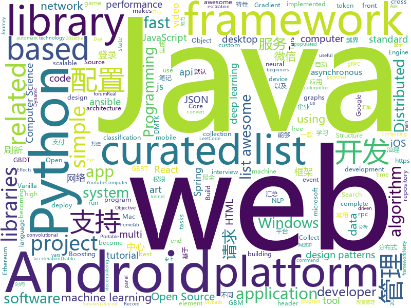

# 2018-07-04
See what the GitHub community is most excited about today.

## python
* [termtosvg](https://github.com/nbedos/termtosvg)(**1,152 stars today**): Record terminal sessions as SVG animations
* [models](https://github.com/tensorflow/models)(**59 stars today**): Models and examples built with TensorFlow
* [face_recognition](https://github.com/ageitgey/face_recognition)(**60 stars today**): The world's simplest facial recognition api for Python and the command line
* [vibora](https://github.com/vibora-io/vibora)(**65 stars today**): Fast, asynchronous and elegant Python web framework.
* [public-apis](https://github.com/toddmotto/public-apis)(**53 stars today**): A collective list of public JSON APIs for use in web development.
* [sg2im](https://github.com/google/sg2im)(**50 stars today**): Code for "Image Generation from Scene Graphs", Johnson et al, CVPR 2018
* [cheat.sh](https://github.com/chubin/cheat.sh)(**47 stars today**): the only cheat sheet you need
* [mlflow](https://github.com/databricks/mlflow)(**46 stars today**): Open source platform for the complete machine learning lifecycle
* [keras](https://github.com/keras-team/keras)(**39 stars today**): Deep Learning for humans
* [Python](https://github.com/TheAlgorithms/Python)(**41 stars today**): All Algorithms implemented in Python
* [awesome-python](https://github.com/vinta/awesome-python)(**40 stars today**): A curated list of awesome Python frameworks, libraries, software and resources
* [scikit-learn](https://github.com/scikit-learn/scikit-learn)(**34 stars today**): scikit-learn: machine learning in Python
* [youtube-dl](https://github.com/rg3/youtube-dl)(**37 stars today**): Command-line program to download videos from YouTube.com and other video sites
* [Magic-Unicorn-Tool](https://github.com/LMGsec/Magic-Unicorn-Tool)(**37 stars today**): 
* [faceai](https://github.com/vipstone/faceai)(**34 stars today**): 一款入门级的人脸、视频、文字检测以及识别的项目.
* [ansible](https://github.com/ansible/ansible)(**24 stars today**): Ansible is a radically simple IT automation platform that makes your applications and systems easier to deploy. Avoid writing scripts or custom code to deploy and update your applications — automate in a language that approaches plain English, using SSH, with no agents to install on remote systems. https://docs.ansible.com/ansible/
* [WinPwnage](https://github.com/rootm0s/WinPwnage)(**37 stars today**): 💻Elevate, UAC bypass, privilege escalation, dll hijack techniques
* [hottbox](https://github.com/hottbox/hottbox)(**36 stars today**): HOTTBOX: Higher Order Tensors ToolBOX.
* [flask](https://github.com/pallets/flask)(**29 stars today**): The Python micro framework for building web applications.
* [cpython](https://github.com/python/cpython)(**22 stars today**): The Python programming language
* [system-design-primer](https://github.com/donnemartin/system-design-primer)(**28 stars today**): Learn how to design large-scale systems. Prep for the system design interview. Includes Anki flashcards.
* [deda](https://github.com/dfd-tud/deda)(**30 stars today**): 
* [noisy](https://github.com/1tayH/noisy)(**30 stars today**): Simple random DNS, HTTP/S internet traffic noise generator
* [darts](https://github.com/quark0/darts)(**29 stars today**): Differentiable architecture search for convolutional and recurrent networks
* [python-patterns](https://github.com/faif/python-patterns)(**28 stars today**): A collection of design patterns/idioms in Python

## java
* [Java-Interview](https://github.com/crossoverJie/Java-Interview)(**153 stars today**): 👨‍🎓Java related : basic, concurrent, algorithm
* [RxEasyHttp](https://github.com/zhou-you/RxEasyHttp)(**92 stars today**): 本库是一款基于RxJava2+Retrofit2实现简单易用的网络请求框架，结合android平台特性的网络封装库,采用api链式调用一点到底,集成cookie管理,多种缓存模式,极简https配置,上传下载进度显示,请求错误自动重试,请求携带token、时间戳、签名sign动态配置,自动登录成功后请求重发功能,3种层次的参数设置默认全局局部,默认标准ApiResult同时可以支持自定义的数据结构，已经能满足现在的大部分网络请求。
* [pandora](https://github.com/whataa/pandora)(**76 stars today**): an android library for debugging what we care about directly in app.
* [spring-boot](https://github.com/spring-projects/spring-boot)(**45 stars today**): Spring Boot
* [CombineBitmap](https://github.com/Othershe/CombineBitmap)(**48 stars today**): Android 仿钉钉、微信 群聊组合头像
* [java-design-patterns](https://github.com/iluwatar/java-design-patterns)(**43 stars today**): Design patterns implemented in Java
* [CommonDevKnowledge](https://github.com/AweiLoveAndroid/CommonDevKnowledge)(**41 stars today**): 🔥🌟⭐️⭐️⭐️⭐️史上最全的BAT大厂Android面试题汇集，以及常用的Android开发的一些技能点，冷门知识点汇总，开发中遇到的坑汇总等干货。
* [zheng](https://github.com/shuzheng/zheng)(**33 stars today**): 基于Spring+SpringMVC+Mybatis分布式敏捷开发系统架构，提供整套公共微服务服务模块：集中权限管理（单点登录）、内容管理、支付中心、用户管理（支持第三方登录）、微信平台、存储系统、配置中心、日志分析、任务和通知等，支持服务治理、监控和追踪，努力为中小型企业打造全方位J2EE企业级开发解决方案。
* [weixin-java-tools](https://github.com/Wechat-Group/weixin-java-tools)(**34 stars today**): 可能是目前最好最全的微信Java开发工具包，支持包括微信支付、开放平台、小程序、企业号和公众号等的开发
* [tutorials](https://github.com/eugenp/tutorials)(**18 stars today**): The "REST With Spring" Course:
* [RxJava](https://github.com/ReactiveX/RxJava)(**32 stars today**): RxJava – Reactive Extensions for the JVM – a library for composing asynchronous and event-based programs using observable sequences for the Java VM.
* [elasticsearch](https://github.com/elastic/elasticsearch)(**30 stars today**): Open Source, Distributed, RESTful Search Engine
* [vjtools](https://github.com/vipshop/vjtools)(**29 stars today**): The vip.com's java coding standard, libraries and tools
* [apollo](https://github.com/ctripcorp/apollo)(**29 stars today**): Apollo（阿波罗）是携程框架部门研发的分布式配置中心，能够集中化管理应用不同环境、不同集群的配置，配置修改后能够实时推送到应用端，并且具备规范的权限、流程治理等特性，适用于微服务配置管理场景。
* [incubator-dubbo](https://github.com/apache/incubator-dubbo)(**23 stars today**): Apache Dubbo (incubating) is a high-performance, java based, open source RPC framework.
* [guava](https://github.com/google/guava)(**29 stars today**): Google core libraries for Java
* [fastjson](https://github.com/alibaba/fastjson)(**26 stars today**): 🚄A fast JSON parser/generator for Java
* [ColorPickerView](https://github.com/skydoves/ColorPickerView)(**28 stars today**): 🎨The most standard and powerful colorpicker library.
* [SmartRefreshLayout](https://github.com/scwang90/SmartRefreshLayout)(**27 stars today**): 🔥下拉刷新、上拉加载、二级刷新、淘宝二楼、RefreshLayout、OverScroll，Android智能下拉刷新框架，支持越界回弹、越界拖动，具有极强的扩展性，集成了几十种炫酷的Header和 Footer。
* [AndroidUtilCode](https://github.com/Blankj/AndroidUtilCode)(**23 stars today**): 🔥Android developers should collect the following utils(updating).
* [libgdx](https://github.com/libgdx/libgdx)(**24 stars today**): Desktop/Android/HTML5/iOS Java game development framework
* [netty](https://github.com/netty/netty)(**23 stars today**): Netty project - an event-driven asynchronous network application framework
* [XXPermissions](https://github.com/getActivity/XXPermissions)(**25 stars today**): 
* [lottie-android](https://github.com/airbnb/lottie-android)(**24 stars today**): Render After Effects animations natively on Android and iOS, Web, and React Native
* [retrofit](https://github.com/square/retrofit)(**22 stars today**): Type-safe HTTP client for Android and Java by Square, Inc.

## unknown
* [homelab](https://github.com/bradfitz/homelab)(**294 stars today**): Brad's homelab setup
* [NLP-progress](https://github.com/sebastianruder/NLP-progress)(**158 stars today**): Repository to track the progress in Natural Language Processing (NLP), including the datasets and the current state-of-the-art for the most common NLP tasks.
* [build-your-own-x](https://github.com/danistefanovic/build-your-own-x)(**133 stars today**): 🤓Build your own (insert technology here)
* [developer-roadmap](https://github.com/kamranahmedse/developer-roadmap)(**109 stars today**): Roadmap to becoming a web developer in 2018
* [Machine_Learning_Journey](https://github.com/llSourcell/Machine_Learning_Journey)(**97 stars today**): This is the Curriculum for "Machine Learning Journey" By Siraj Raval on Youtube
* [USBuildingFootprints](https://github.com/Microsoft/USBuildingFootprints)(**93 stars today**): Computer generated building footprints for the United States
* [gitignore](https://github.com/github/gitignore)(**70 stars today**): A collection of useful .gitignore templates
* [Awesome](https://github.com/Awesome-Windows/Awesome)(**78 stars today**): 💻An awesome & curated list of best applications and tools for Windows.
* [architect-awesome](https://github.com/xingshaocheng/architect-awesome)(**60 stars today**): 后端架构师技术图谱
* [awesome-design-patterns](https://github.com/DovAmir/awesome-design-patterns)(**67 stars today**): A curated list of software and architecture related design patterns.
* [awesome-vue](https://github.com/vuejs/awesome-vue)(**66 stars today**): 🎉A curated list of awesome things related to Vue.js
* [You-Dont-Know-JS](https://github.com/getify/You-Dont-Know-JS)(**61 stars today**): A book series on JavaScript. @YDKJS on twitter.
* [Interview-Notebook](https://github.com/CyC2018/Interview-Notebook)(**52 stars today**): 📆准备秋招学习笔记
* [project-based-learning](https://github.com/tuvtran/project-based-learning)(**59 stars today**): Curated list of project-based tutorials
* [awesome](https://github.com/sindresorhus/awesome)(**60 stars today**): 😎Curated list of awesome lists
* [SotA-CV](https://github.com/Lextal/SotA-CV)(**48 stars today**): A repository of state-of-the-art deep learning methods in computer vision
* [CS231N_17_KOR_SUB](https://github.com/insurgent92/CS231N_17_KOR_SUB)(**51 stars today**): CS231N 2017 video subtitles translation project for Korean Computer Science students
* [free-programming-books](https://github.com/EbookFoundation/free-programming-books)(**46 stars today**): 📚Freely available programming books
* [react-developer-roadmap](https://github.com/adam-golab/react-developer-roadmap)(**49 stars today**): Roadmap to becoming a React developer in 2018
* [awesome-flutter](https://github.com/Solido/awesome-flutter)(**43 stars today**): An awesome list that curates the best Flutter libraries, tools, tutorials, articles and more.
* [coding-interview-university](https://github.com/jwasham/coding-interview-university)(**38 stars today**): A complete computer science study plan to become a software engineer.
* [Front-end-Developer-Interview-Questions](https://github.com/h5bp/Front-end-Developer-Interview-Questions)(**33 stars today**): A list of helpful front-end related questions you can use to interview potential candidates, test yourself or completely ignore.
* [h-encore](https://github.com/TheOfficialFloW/h-encore)(**30 stars today**): Fully chained kernel exploit for the PS Vita
* [ethereum-token-standards-list](https://github.com/PhABC/ethereum-token-standards-list)(**31 stars today**): Exhaustive list of all token related standards proposed for the Ethereum network
* [computer-science](https://github.com/ossu/computer-science)(**26 stars today**): 🎓Path to a free self-taught education in Computer Science!

## c++
* [tensorflow](https://github.com/tensorflow/tensorflow)(**124 stars today**): Computation using data flow graphs for scalable machine learning
* [mace](https://github.com/XiaoMi/mace)(**101 stars today**): MACE is a deep learning inference framework optimized for mobile heterogeneous computing platforms.
* [leetcode](https://github.com/haoel/leetcode)(**45 stars today**): LeetCode Problems' Solutions
* [bitcoin](https://github.com/bitcoin/bitcoin)(**33 stars today**): Bitcoin Core integration/staging tree
* [electron](https://github.com/electron/electron)(**39 stars today**): Build cross platform desktop apps with JavaScript, HTML, and CSS
* [protobuf](https://github.com/google/protobuf)(**33 stars today**): Protocol Buffers - Google's data interchange format
* [opencv](https://github.com/opencv/opencv)(**25 stars today**): Open Source Computer Vision Library
* [pytorch](https://github.com/pytorch/pytorch)(**32 stars today**): Tensors and Dynamic neural networks in Python with strong GPU acceleration
* [devilution](https://github.com/diasurgical/devilution)(**28 stars today**): Diablo devolved - magic behind the 1996 computer game
* [tesseract](https://github.com/tesseract-ocr/tesseract)(**29 stars today**): Tesseract Open Source OCR Engine (main repository)
* [Tars](https://github.com/Tencent/Tars)(**25 stars today**): Tars is a highly performance rpc framework based on naming service using tars protocol and provides a semi-automatic operation platform.
* [aseprite](https://github.com/aseprite/aseprite)(**26 stars today**): Animated sprite editor & pixel art tool (Windows, macOS, Linux)
* [ceph](https://github.com/ceph/ceph)(**24 stars today**): Ceph is a distributed object, block, and file storage platform
* [caffe](https://github.com/BVLC/caffe)(**20 stars today**): Caffe: a fast open framework for deep learning.
* [openpose](https://github.com/CMU-Perceptual-Computing-Lab/openpose)(**20 stars today**): OpenPose: Real-time multi-person keypoint detection library for body, face, and hands estimation
* [px](https://github.com/pplux/px)(**22 stars today**): Single header C++ Libraries for Thread Scheduling, Rendering, and so on...
* [apollo](https://github.com/ApolloAuto/apollo)(**15 stars today**): An open autonomous driving platform
* [json](https://github.com/nlohmann/json)(**19 stars today**): JSON for Modern C++
* [xgboost](https://github.com/dmlc/xgboost)(**17 stars today**): Scalable, Portable and Distributed Gradient Boosting (GBDT, GBRT or GBM) Library, for Python, R, Java, Scala, C++ and more. Runs on single machine, Hadoop, Spark, Flink and DataFlow
* [grpc](https://github.com/grpc/grpc)(**17 stars today**): The C based gRPC (C++, Python, Ruby, Objective-C, PHP, C#)
* [godot](https://github.com/godotengine/godot)(**17 stars today**): Godot Engine – Multi-platform 2D and 3D game engine
* [LightGBM](https://github.com/Microsoft/LightGBM)(**17 stars today**): A fast, distributed, high performance gradient boosting (GBDT, GBRT, GBM or MART) framework based on decision tree algorithms, used for ranking, classification and many other machine learning tasks. It is under the umbrella of the DMTK(http://github.com/microsoft/dmtk) project of Microsoft.
* [swift](https://github.com/apple/swift)(**17 stars today**): The Swift Programming Language
* [cosmos](https://github.com/OpenGenus/cosmos)(**15 stars today**): Algorithms that run our universe | Your personal library of every algorithm and data structure code that you will ever encounter | Ask us anything at our forum
* [drishti](https://github.com/elucideye/drishti)(**16 stars today**): Real time eye tracking for embedded and mobile devices.

## html
* [react-from-zero](https://github.com/kay-is/react-from-zero)(**418 stars today**): A simple (99% ES2015 less) tutorial for React
* [solid](https://github.com/solid/solid)(**235 stars today**): Solid - Re-decentralizing the web (project directory)
* [fakescroll](https://github.com/yairEO/fakescroll)(**51 stars today**): vanilla-js lightweight custom HTML scrollbar
* [awesome-mac](https://github.com/jaywcjlove/awesome-mac)(**47 stars today**):  Now we have become very big, Different from the original idea. Collect premium software in various categories.
* [awesome-resume](https://github.com/resumejob/awesome-resume)(**24 stars today**): 包含简历常用例句
* [JavaScript30](https://github.com/wesbos/JavaScript30)(**17 stars today**): 30 Day Vanilla JS Challenge
* [Coursera-ML-AndrewNg-Notes](https://github.com/fengdu78/Coursera-ML-AndrewNg-Notes)(**18 stars today**): 吴恩达老师的机器学习课程个人笔记
* [Spoon-Knife](https://github.com/octocat/Spoon-Knife)(****): This repo is for demonstration purposes only.
* [Splitting](https://github.com/shshaw/Splitting)(**18 stars today**): Microlibrary to split a DOM element's words & chars into elements populated with CSS vars.
* [react-app-rewired](https://github.com/timarney/react-app-rewired)(**15 stars today**): Override create-react-app webpack configs without ejecting
* [gson](https://github.com/google/gson)(**12 stars today**): A Java serialization/deserialization library to convert Java Objects into JSON and back
* [fastText](https://github.com/facebookresearch/fastText)(**12 stars today**): Library for fast text representation and classification.
* [portainer](https://github.com/portainer/portainer)(**13 stars today**): Simple management UI for Docker
* [douyin](https://github.com/lujqme/douyin)(**12 stars today**): 抖音 桌面版(WIndows/Mac OS)
* [capacitor](https://github.com/ionic-team/capacitor)(**12 stars today**): Build cross-platform Native Progressive Web Apps for iOS, Android, and the web⚡️
* [EIPs](https://github.com/ethereum/EIPs)(**10 stars today**): The Ethereum Improvement Proposal repository
* [Winds](https://github.com/GetStream/Winds)(**11 stars today**): A Beautiful Open Source RSS & Podcast App
* [requests-html](https://github.com/kennethreitz/requests-html)(**9 stars today**): Pythonic HTML Parsing for Humans™
* [web-starter-kit](https://github.com/google/web-starter-kit)(**8 stars today**): Web Starter Kit - a workflow for multi-device websites
* [Publii](https://github.com/GetPublii/Publii)(**8 stars today**): Publii is a desktop-based CMS for Windows and Mac that makes creating static websites fast and hassle-free, even for beginners.
* [brain.js](https://github.com/BrainJS/brain.js)(**7 stars today**): 🤖Neural networks in JavaScript
* [awesome-competitive-programming](https://github.com/lnishan/awesome-competitive-programming)(**7 stars today**): 💎A curated list of awesome Competitive Programming, Algorithm and Data Structure resources
* [nodejs-ex](https://github.com/sclorg/nodejs-ex)(****): node.js example
* [ng-alain](https://github.com/cipchk/ng-alain)(**6 stars today**): ng-zorro-antd admin panel front-end framework
* [asvs](https://github.com/Santandersecurityresearch/asvs)(**7 stars today**): A simple web app that helps developers understand the ASVS requirements.

## WordCloud

