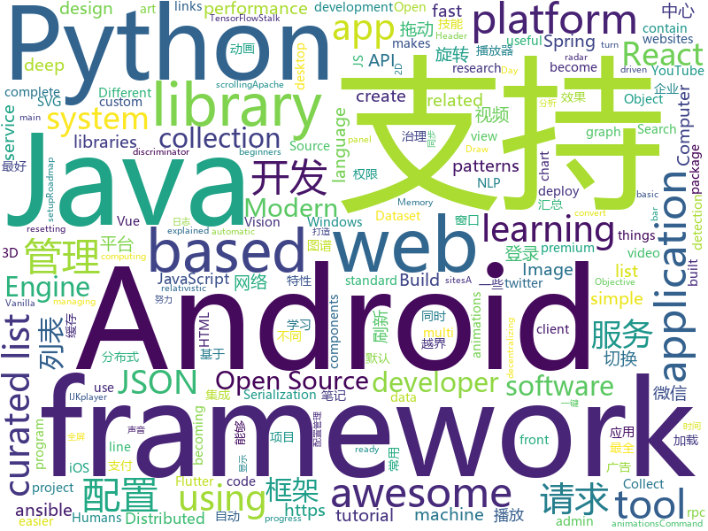

# 2018-07-06
See what the GitHub community is most excited about today.

## python
* [termtosvg](https://github.com/nbedos/termtosvg)(**764 stars today**): Record terminal sessions as SVG animations
* [youtube-dl](https://github.com/rg3/youtube-dl)(**677 stars today**): Command-line program to download videos from YouTube.com and other video sites
* [cartoonify](https://github.com/danmacnish/cartoonify)(**519 stars today**): python app to turn a photograph into a cartoon
* [tweets_analyzer](https://github.com/x0rz/tweets_analyzer)(**224 stars today**): Tweets metadata scraper & activity analyzer
* [models](https://github.com/tensorflow/models)(**63 stars today**): Models and examples built with TensorFlow
* [EagleEye](https://github.com/ThoughtfulDev/EagleEye)(**85 stars today**): Stalk your Friends. Find their Instagram, FB and Twitter Profiles using Image Recognition and Reverse Image Search.
* [ImageAI](https://github.com/OlafenwaMoses/ImageAI)(**65 stars today**): A python library built to empower developers to build applications and systems with self-contained Computer Vision capabilities
* [WorldModels](https://github.com/AdeelMufti/WorldModels)(**70 stars today**): Full World Models Implementation in Chainer
* [awesome-python](https://github.com/vinta/awesome-python)(**55 stars today**): A curated list of awesome Python frameworks, libraries, software and resources
* [keras](https://github.com/keras-team/keras)(**51 stars today**): Deep Learning for humans
* [mps-youtube](https://github.com/mps-youtube/mps-youtube)(**55 stars today**): Terminal based YouTube player and downloader
* [cheat.sh](https://github.com/chubin/cheat.sh)(**55 stars today**): the only cheat sheet you need
* [erc20-ico-onchain-technical-analysis](https://github.com/DeuroIO/erc20-ico-onchain-technical-analysis)(**53 stars today**): An tool to analyze any company's ICO
* [haproxy-wi](https://github.com/Aidaho12/haproxy-wi)(**45 stars today**): Web interface for managing Haproxy servers
* [atari-reset](https://github.com/openai/atari-reset)(**46 stars today**): Learn RL policies for Atari by resetting from a demonstration
* [flask](https://github.com/pallets/flask)(**42 stars today**): The Python micro framework for building web applications.
* [RelativisticGAN](https://github.com/AlexiaJM/RelativisticGAN)(**42 stars today**): Code for replication of the paper "The relativistic discriminator: a key element missing from standard GAN"
* [public-apis](https://github.com/toddmotto/public-apis)(**40 stars today**): A collective list of public JSON APIs for use in web development.
* [pipenv](https://github.com/pypa/pipenv)(**41 stars today**): Python Development Workflow for Humans.
* [mlflow](https://github.com/databricks/mlflow)(**36 stars today**): Open source platform for the complete machine learning lifecycle
* [vibora](https://github.com/vibora-io/vibora)(**36 stars today**): Fast, asynchronous and elegant Python web framework.
* [django](https://github.com/django/django)(**29 stars today**): The Web framework for perfectionists with deadlines.
* [ansible](https://github.com/ansible/ansible)(**31 stars today**): Ansible is a radically simple IT automation platform that makes your applications and systems easier to deploy. Avoid writing scripts or custom code to deploy and update your applications — automate in a language that approaches plain English, using SSH, with no agents to install on remote systems. https://docs.ansible.com/ansible/
* [requests](https://github.com/requests/requests)(**32 stars today**): Python HTTP Requests for Humans™✨🍰✨
* [Detectron](https://github.com/facebookresearch/Detectron)(**28 stars today**): FAIR's research platform for object detection research, implementing popular algorithms like Mask R-CNN and RetinaNet.

## java
* [Java-Interview](https://github.com/crossoverJie/Java-Interview)(**131 stars today**): 👨‍🎓Java related : basic, concurrent, algorithm
* [pandora](https://github.com/whataa/pandora)(**101 stars today**): an android library for debugging what we care about directly in app.
* [java-design-patterns](https://github.com/iluwatar/java-design-patterns)(**54 stars today**): Design patterns implemented in Java
* [spring-boot](https://github.com/spring-projects/spring-boot)(**47 stars today**): Spring Boot
* [elasticsearch](https://github.com/elastic/elasticsearch)(**53 stars today**): Open Source, Distributed, RESTful Search Engine
* [RxEasyHttp](https://github.com/zhou-you/RxEasyHttp)(**53 stars today**): 本库是一款基于RxJava2+Retrofit2实现简单易用的网络请求框架，结合android平台特性的网络封装库,采用api链式调用一点到底,集成cookie管理,多种缓存模式,极简https配置,上传下载进度显示,请求错误自动重试,请求携带token、时间戳、签名sign动态配置,自动登录成功后请求重发功能,3种层次的参数设置默认全局局部,默认标准ApiResult同时可以支持自定义的数据结构，已经能满足现在的大部分网络请求。
* [AppUpdater](https://github.com/jenly1314/AppUpdater)(**45 stars today**): AppUpdater版本更新，一键傻瓜式升级。
* [spring-framework](https://github.com/spring-projects/spring-framework)(**36 stars today**): Spring Framework
* [CommonDevKnowledge](https://github.com/AweiLoveAndroid/CommonDevKnowledge)(**40 stars today**): 🔥🌟⭐️⭐️⭐️⭐️史上最全的BAT大厂Android面试题汇集，以及常用的Android开发的一些技能点，冷门知识点汇总，开发中遇到的坑汇总等干货。
* [tutorials](https://github.com/eugenp/tutorials)(**20 stars today**): The "REST With Spring" Course:
* [GSYVideoPlayer](https://github.com/CarGuo/GSYVideoPlayer)(**33 stars today**): 视频播放器（IJKplayer、ExoPlayer、MediaPlayer），HTTPS支持，支持弹幕，支持滤镜、水印、gif截图，片头广告、中间广告，多个同时播放，支持基本的拖动，声音、亮度调节，支持边播边缓存，支持视频本身自带rotation的旋转（90,270之类），重力旋转与手动旋转的同步支持，支持列表播放 ，直接添加控件为封面，列表全屏动画，视频加载速度，列表小窗口支持拖动，动画效果，调整比例，多分辨率切换，支持切换播放器，进度条小窗口预览，列表切换详情页面无缝播放，其他一些小动画效果，rtsp、concat、mpeg。项目解析：
* [vjtools](https://github.com/vipshop/vjtools)(**29 stars today**): The vip.com's java coding standard, libraries and tools
* [weixin-java-tools](https://github.com/Wechat-Group/weixin-java-tools)(**25 stars today**): 可能是目前最好最全的微信Java开发工具包，支持包括微信支付、开放平台、小程序、企业号和公众号等的开发
* [AndroidUtilCode](https://github.com/Blankj/AndroidUtilCode)(**23 stars today**): 🔥Android developers should collect the following utils(updating).
* [lottie-android](https://github.com/airbnb/lottie-android)(**28 stars today**): Render After Effects animations natively on Android and iOS, Web, and React Native
* [apollo](https://github.com/ctripcorp/apollo)(**22 stars today**): Apollo（阿波罗）是携程框架部门研发的分布式配置中心，能够集中化管理应用不同环境、不同集群的配置，配置修改后能够实时推送到应用端，并且具备规范的权限、流程治理等特性，适用于微服务配置管理场景。
* [incubator-skywalking](https://github.com/apache/incubator-skywalking)(**24 stars today**): A distributed tracing system, and APM ( Application Performance Monitoring )
* [zheng](https://github.com/shuzheng/zheng)(**24 stars today**): 基于Spring+SpringMVC+Mybatis分布式敏捷开发系统架构，提供整套公共微服务服务模块：集中权限管理（单点登录）、内容管理、支付中心、用户管理（支持第三方登录）、微信平台、存储系统、配置中心、日志分析、任务和通知等，支持服务治理、监控和追踪，努力为中小型企业打造全方位J2EE企业级开发解决方案。
* [SmartRefreshLayout](https://github.com/scwang90/SmartRefreshLayout)(**22 stars today**): 🔥下拉刷新、上拉加载、二级刷新、淘宝二楼、RefreshLayout、OverScroll，Android智能下拉刷新框架，支持越界回弹、越界拖动，具有极强的扩展性，集成了几十种炫酷的Header和 Footer。
* [glide](https://github.com/bumptech/glide)(**20 stars today**): An image loading and caching library for Android focused on smooth scrolling
* [incubator-dubbo](https://github.com/apache/incubator-dubbo)(**19 stars today**): Apache Dubbo (incubating) is a high-performance, java based, open source RPC framework.
* [zxing](https://github.com/zxing/zxing)(**23 stars today**): ZXing ("Zebra Crossing") barcode scanning library for Java, Android
* [graal](https://github.com/oracle/graal)(**23 stars today**): GraalVM: Run Programs Faster Anywhere🚀
* [okhttp](https://github.com/square/okhttp)(**19 stars today**): An HTTP+HTTP/2 client for Android and Java applications.
* [MPAndroidChart](https://github.com/PhilJay/MPAndroidChart)(**19 stars today**): A powerful🚀Android chart view / graph view library, supporting line- bar- pie- radar- bubble- and candlestick charts as well as scaling, dragging and animations.

## unknown
* [vue-patterns](https://github.com/learn-vuejs/vue-patterns)(**363 stars today**): Useful Vue patterns, techniques, tips and tricks and helpful curated links.
* [homelab](https://github.com/bradfitz/homelab)(**226 stars today**): Brad's homelab setup
* [developer-roadmap](https://github.com/kamranahmedse/developer-roadmap)(**147 stars today**): Roadmap to becoming a web developer in 2018
* [build-your-own-x](https://github.com/danistefanovic/build-your-own-x)(**146 stars today**): 🤓Build your own (insert technology here)
* [Interview-Notebook](https://github.com/CyC2018/Interview-Notebook)(**76 stars today**): 📆准备秋招学习笔记
* [architect-awesome](https://github.com/xingshaocheng/architect-awesome)(**71 stars today**): 后端架构师技术图谱
* [awesome-design-patterns](https://github.com/DovAmir/awesome-design-patterns)(**79 stars today**): A curated list of software and architecture related design patterns.
* [gitignore](https://github.com/github/gitignore)(**58 stars today**): A collection of useful .gitignore templates
* [You-Dont-Know-JS](https://github.com/getify/You-Dont-Know-JS)(**61 stars today**): A book series on JavaScript. @YDKJS on twitter.
* [awesome](https://github.com/sindresorhus/awesome)(**70 stars today**): 😎Curated list of awesome lists
* [NLP-progress](https://github.com/sebastianruder/NLP-progress)(**63 stars today**): Repository to track the progress in Natural Language Processing (NLP), including the datasets and the current state-of-the-art for the most common NLP tasks.
* [free-programming-books](https://github.com/EbookFoundation/free-programming-books)(**59 stars today**): 📚Freely available programming books
* [quickdraw-dataset](https://github.com/googlecreativelab/quickdraw-dataset)(**60 stars today**): Documentation on how to access and use the Quick, Draw! Dataset.
* [awesome-vue](https://github.com/vuejs/awesome-vue)(**57 stars today**): 🎉A curated list of awesome things related to Vue.js
* [coding-interview-university](https://github.com/jwasham/coding-interview-university)(**46 stars today**): A complete computer science study plan to become a software engineer.
* [project-based-learning](https://github.com/tuvtran/project-based-learning)(**46 stars today**): Curated list of project-based tutorials
* [awesome-flutter](https://github.com/Solido/awesome-flutter)(**43 stars today**): An awesome list that curates the best Flutter libraries, tools, tutorials, articles and more.
* [react-developer-roadmap](https://github.com/adam-golab/react-developer-roadmap)(**40 stars today**): Roadmap to becoming a React developer in 2018
* [package.json](https://github.com/stereobooster/package.json)(**36 stars today**): 🗃️package.json fields explained
* [awesome-ninja-admins](https://github.com/trimstray/awesome-ninja-admins)(**31 stars today**): 💫A collection of awesome lists, manuals, blogs, hacks, one-liners and tools for Awesome Ninja Admins.
* [flutter-study](https://github.com/yang7229693/flutter-study)(**31 stars today**): Flutter Study
* [awesome-react](https://github.com/enaqx/awesome-react)(**29 stars today**): A collection of awesome things regarding React ecosystem.
* [meetup-slides](https://github.com/servicemesher/meetup-slides)(**25 stars today**): Slides from Service Mesh meetups
* [Machine_Learning_Journey](https://github.com/llSourcell/Machine_Learning_Journey)(**26 stars today**): This is the Curriculum for "Machine Learning Journey" By Siraj Raval on Youtube
* [package.json](https://github.com/pkg-json/package.json)(**26 stars today**): Spec for package.json

## c++
* [apollo](https://github.com/ApolloAuto/apollo)(**149 stars today**): An open autonomous driving platform
* [tensorflow](https://github.com/tensorflow/tensorflow)(**94 stars today**): Computation using data flow graphs for scalable machine learning
* [deno](https://github.com/ry/deno)(**101 stars today**): A secure TypeScript runtime on V8
* [mace](https://github.com/XiaoMi/mace)(**56 stars today**): MACE is a deep learning inference framework optimized for mobile heterogeneous computing platforms.
* [Ender-3](https://github.com/Creality3DPrinting/Ender-3)(**55 stars today**): The Creality3D Ender-3, a fully Open Source 3D printer perfect for new users on a budget.
* [electron](https://github.com/electron/electron)(**51 stars today**): Build cross platform desktop apps with JavaScript, HTML, and CSS
* [opencv](https://github.com/opencv/opencv)(**40 stars today**): Open Source Computer Vision Library
* [protobuf](https://github.com/google/protobuf)(**36 stars today**): Protocol Buffers - Google's data interchange format
* [bitcoin](https://github.com/bitcoin/bitcoin)(**31 stars today**): Bitcoin Core integration/staging tree
* [frisky](https://github.com/samyk/frisky)(**36 stars today**): Instruments to assist in binary application reversing and augmentation, geared towards walled gardens like iOS and macOS
* [pytorch](https://github.com/pytorch/pytorch)(**29 stars today**): Tensors and Dynamic neural networks in Python with strong GPU acceleration
* [tesseract](https://github.com/tesseract-ocr/tesseract)(**31 stars today**): Tesseract Open Source OCR Engine (main repository)
* [grpc](https://github.com/grpc/grpc)(**22 stars today**): The C based gRPC (C++, Python, Ruby, Objective-C, PHP, C#)
* [openpose](https://github.com/CMU-Perceptual-Computing-Lab/openpose)(**24 stars today**): OpenPose: Real-time multi-person keypoint detection library for body, face, and hands estimation
* [envoy](https://github.com/envoyproxy/envoy)(**25 stars today**): C++ front/service proxy
* [aseprite](https://github.com/aseprite/aseprite)(**24 stars today**): Animated sprite editor & pixel art tool (Windows, macOS, Linux)
* [flatbuffers](https://github.com/google/flatbuffers)(**22 stars today**): Memory Efficient Serialization Library
* [frameDemoMo2](https://github.com/tome34/frameDemoMo2)(**22 stars today**): Android组件化项目框架
* [json](https://github.com/nlohmann/json)(**19 stars today**): JSON for Modern C++
* [Paddle](https://github.com/PaddlePaddle/Paddle)(**18 stars today**): PArallel Distributed Deep LEarning
* [Tars](https://github.com/Tencent/Tars)(**19 stars today**): Tars is a highly performance rpc framework based on naming service using tars protocol and provides a semi-automatic operation platform.
* [mongo](https://github.com/mongodb/mongo)(**17 stars today**): The MongoDB Database
* [caffe](https://github.com/BVLC/caffe)(**16 stars today**): Caffe: a fast open framework for deep learning.
* [godot](https://github.com/godotengine/godot)(**16 stars today**): Godot Engine – Multi-platform 2D and 3D game engine
* [AnyQ](https://github.com/baidu/AnyQ)(**17 stars today**): FAQ-based Question Answering System

## html
* [itty-bitty](https://github.com/alcor/itty-bitty)(**341 stars today**): Itty.bitty is a tool to create links that contain small sites
* [react-from-zero](https://github.com/kay-is/react-from-zero)(**175 stars today**): A simple (99% ES2015 less) tutorial for React
* [solid](https://github.com/solid/solid)(**57 stars today**): Solid - Re-decentralizing the web (project directory)
* [Publii](https://github.com/GetPublii/Publii)(**37 stars today**): Publii is a desktop-based CMS for Windows and Mac that makes creating static websites fast and hassle-free, even for beginners.
* [awesome-resume](https://github.com/resumejob/awesome-resume)(**30 stars today**): 包含简历常用例句
* [awesome-mac](https://github.com/jaywcjlove/awesome-mac)(**25 stars today**):  Now we have become very big, Different from the original idea. Collect premium software in various categories.
* [fastText](https://github.com/facebookresearch/fastText)(**19 stars today**): Library for fast text representation and classification.
* [Spoon-Knife](https://github.com/octocat/Spoon-Knife)(****): This repo is for demonstration purposes only.
* [portainer](https://github.com/portainer/portainer)(**15 stars today**): Simple management UI for Docker
* [JavaScript30](https://github.com/wesbos/JavaScript30)(**9 stars today**): 30 Day Vanilla JS Challenge
* [fakescroll](https://github.com/yairEO/fakescroll)(**11 stars today**): vanilla-js lightweight custom HTML scrollbar
* [ionicons](https://github.com/ionic-team/ionicons)(**10 stars today**): The premium icon font for Ionic
* [polymer](https://github.com/Polymer/polymer)(**10 stars today**): Build modern apps using web components
* [skill-map](https://github.com/TeamStuQ/skill-map)(**9 stars today**): 程序员技能图谱
* [masonry](https://github.com/desandro/masonry)(**10 stars today**): 🏩Cascading grid layout plugin
* [swagger-codegen](https://github.com/swagger-api/swagger-codegen)(**8 stars today**): swagger-codegen contains a template-driven engine to generate documentation, API clients and server stubs in different languages by parsing your OpenAPI / Swagger definition.
* [gson](https://github.com/google/gson)(**9 stars today**): A Java serialization/deserialization library to convert Java Objects into JSON and back
* [DOClever](https://github.com/sx1989827/DOClever)(**9 stars today**): 做最好的接口管理平台
* [Coursera-ML-AndrewNg-Notes](https://github.com/fengdu78/Coursera-ML-AndrewNg-Notes)(**8 stars today**): 吴恩达老师的机器学习课程个人笔记
* [react-app-rewired](https://github.com/timarney/react-app-rewired)(**9 stars today**): Override create-react-app webpack configs without ejecting
* [flag-icon-css](https://github.com/lipis/flag-icon-css)(**7 stars today**): 🎏A collection of all country flags in SVG — plus the CSS for easier integration
* [ng-alain](https://github.com/cipchk/ng-alain)(**7 stars today**): ng-zorro-antd admin panel front-end framework
* [primeng](https://github.com/primefaces/primeng)(**8 stars today**): UI Components for Angular
* [design-blocks](https://github.com/froala/design-blocks)(**8 stars today**): A set of 170+ Bootstrap based design blocks ready to be used to create clean modern websites.
* [javascript-tutorial-en](https://github.com/iliakan/javascript-tutorial-en)(**7 stars today**): Modern JavaScript Tutorial

## WordCloud

